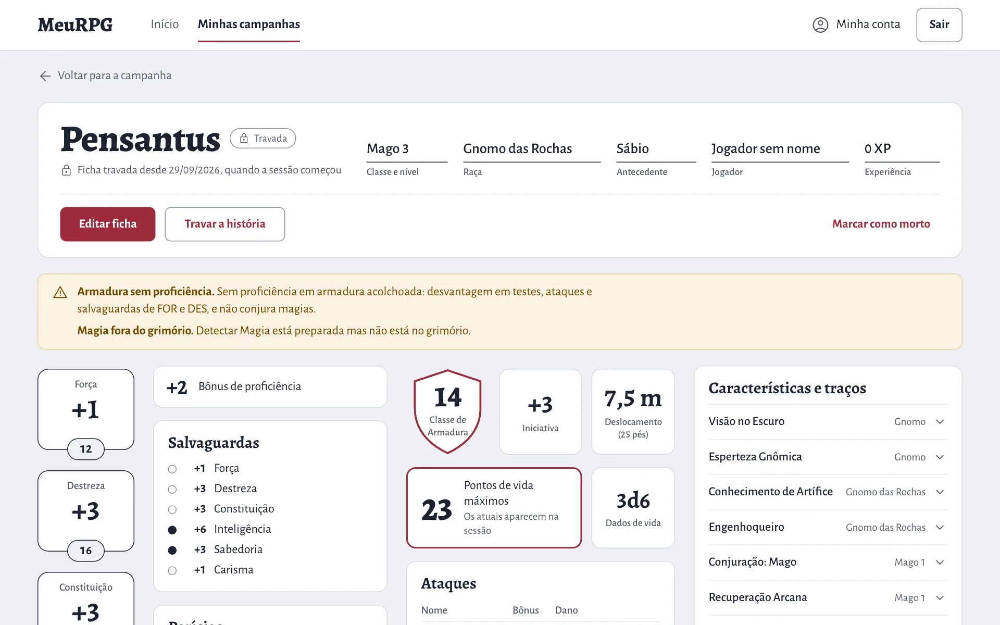
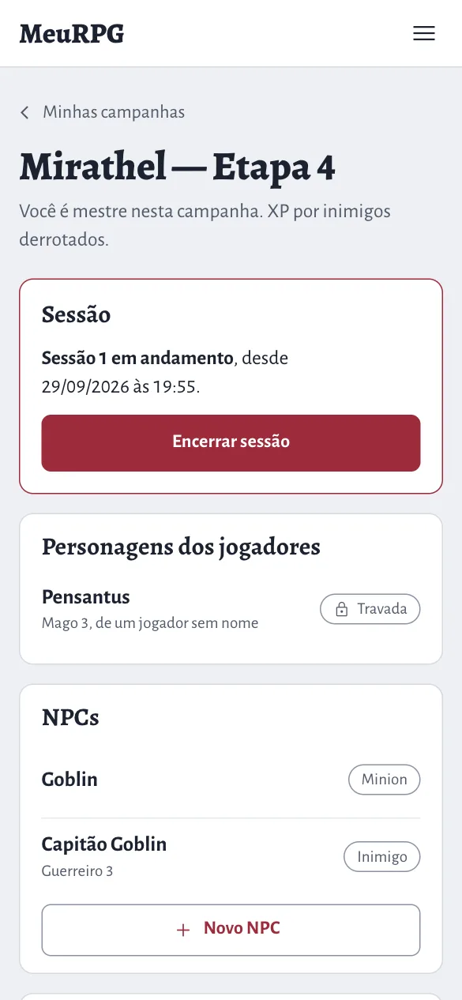
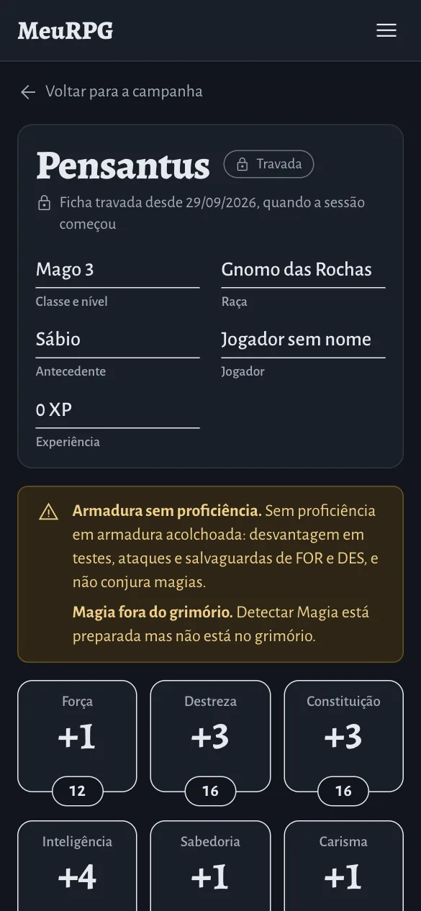

<h1 align="center">MeuRPG</h1>

<p align="center">Versão em português; o <a href="README.md">README em inglês</a> é o canônico.</p>

<p align="center">
  Onde uma mesa de D&amp;D 5e prepara e joga as suas campanhas.<br>
  O mestre conduz, o jogador acompanha a ficha, e as regras fazem as contas.
</p>

<p align="center">
  <a href="https://github.com/PuraFome/meuRPG/actions/workflows/backend.yml?query=branch%3Amain"></a>
  <a href="https://github.com/PuraFome/meuRPG/actions/workflows/web.yml?query=branch%3Amain"></a>
  <a href="https://github.com/PuraFome/meuRPG/actions/workflows/e2e.yml?query=branch%3Amain"></a>
</p>

<p align="center">
  <a href="backend/go.mod"></a>
  <a href="web/package.json"></a>
  <a href="proto/"></a>
  <a href="docs/data.md"></a>
  <a href="docs/operations.md"></a>
</p>

<p align="center">
  <a href="e2e/tests/a11y.spec.ts"></a>
  <a href=".github/dependabot.yml"></a>
  <a href="https://www.conventionalcommits.org/pt-br/v1.0.0/"></a>
  <a href="NOTICE"></a>
  <a href="LICENSE"></a>
  <a href="https://github.com/PuraFome/meuRPG/commits/main"></a>
</p>

<p align="center">
  <picture>
    <source media="(prefers-color-scheme: dark)" srcset="docs/img/ficha-desktop-escuro.webp">
    
  </picture>
</p>

## O que é

O MeuRPG é o companheiro de uma mesa de D&D 5e. O mestre prepara o mundo e conduz a sessão ao vivo; o jogador entra por convite, acompanha a ficha e age no RP e no combate com o que as regras permitem. O motor de regras faz as contas, e o servidor é a autoridade: o que está escondido nunca sai dele para o jogador. Mais contexto em [Visão do produto](docs/pt-BR/produto/visao.md).

É um servidor em Go que serve o app Angular e a API na mesma origem, com o CockroachDB, feito para rodar no Cloud Run, em São Paulo. As telas estão em português por enquanto; a interface em inglês vem depois do MVP. O app antigo está descontinuado e documentado em [App antigo](docs/legacy-app.md) (em inglês).

> A documentação técnica (arquitetura, dados, design, operação, CONTRIBUTING) é em inglês. Os documentos de produto e a privacidade têm versão em português em [`docs/pt-BR/`](docs/pt-BR/README.md).

## Fase atual

**Pré-MVP.** Tudo o que estava planejado para o MVP está construído (Etapas 1 a 10 do [roadmap](docs/roadmap.md), em inglês). Os próximos passos: endurecimento e um ensaio antes da primeira sessão de verdade da mesa, depois a internacionalização (interface em inglês) e então as histórias pós-MVP.

## O que funciona

- **Login e campanhas.** Login por OpenID Connect (o Google em produção), com sessão no servidor de até 30 dias. O mestre cria campanhas e convites (com validade e número de usos, e a aprovação do mestre se quiser); quem recebe o link entra, logado ou fazendo login no caminho.
- **Personagens.** A ficha no formato da ficha oficial, calculada pelo motor de regras a partir do SRD 5.1: modificadores, perícias, CA, PV, magias e os avisos de regra. NPCs numa ficha curta. As habilidades e os PV podem ser rolados no app. As fichas travam quando a sessão começa.
- **Sessão ao vivo.** Quem joga recebe o aviso quando a sessão começa; os PV, os espaços de magia e os dados de vida mudam na tela quando o mestre corrige. O resumo, com os destaques, fecha a sessão.
- **Mapas sem spoiler.** Mapas feitos a partir da galeria, com pontos de interesse (batalha, submapa, cena de RP), tokens, camadas (paredes, terreno difícil, cobertura, luz), armadilhas, tesouros e névoa de guerra por jogador; o que está escondido nunca chega ao jogador. Dá para imprimir na escala da mesa.
- **Combate.** Iniciativa, ordem dos turnos e movimento numa grade de 1,5 m (ou sem grade, o "teatro da mente"). Na sua vez, o jogador vê o que pode fazer com a ação, a ação bônus, a reação e o movimento, e rola com o dado do app ou o físico. Movimento em círculo, salto, cobertura e ataque de oportunidade como nas regras oficiais; o mestre aplica dano, condições e testes contra a morte; o registro conta a luta.
- **Cenas de RP, pistas e quebra-cabeças.** Ações de cena com testes de perícia e de resistência, pistas e ganchos, NPCs em cena com retrato, seis tipos de quebra-cabeça com dicas, informação dividida e consequências.
- **Progressão.** XP por combate, ouro, marco ou avulso; subida de nível guiada pela ficha.
- **Criaturas.** As 334 criaturas do SRD num bestiário, o familiar, os mortos-vivos e os animais convocados, e a Forma Selvagem.
- **O conteúdo e as regras da própria mesa.** Magias, raças, antecedentes, classes e subclasses da mesa; regras da mesa (PV da subida de nível, jeitos de fazer habilidades, crítico, testes contra a morte escondidos); interruptores do que os jogadores podem usar.
- **Geradores.** Masmorras (portas, escadas, salas numeradas), montador de encontros pelo orçamento do grupo e gerador de tesouro.
- **Imagens geradas por IA.** A arte de uma cena, a vista isométrica e o mapa com textura, feitos só do que os jogadores já viram.
- **Galeria e documento da campanha.** Envio de imagens com os metadados removidos; as anotações do mestre em Markdown.

## O visual: a ficha de papel

As telas imitam a ficha oficial de D&D 5e: os medalhões de habilidade, o escudo da CA, os pontos de proficiência. O número de jogo é a coisa mais visível da tela. O tema claro e o escuro seguem o sistema operacional, com contraste AA nos dois, e cada tela funciona no celular, na mesa de jogo. Os princípios, os tokens e como uma tela é desenhada e revisada estão em [Design](docs/design.md) (em inglês).

<p align="center">
  
  &nbsp;&nbsp;
  
</p>

## Stack

| Parte | O que usa |
| --- | --- |
| Backend | Go, num monólito modular (`identity`, `authz`, `campaigns`, `rules`, `characters`, `play`, `maps` e outros), que também é o BFF do app |
| API | Protobuf + [Connect](https://connectrpc.com), em `proto/`; o cliente TypeScript do `web/` é gerado dos mesmos `.proto` |
| Banco | CockroachDB, com as queries no sqlc e as migrations no goose |
| Web | Angular 21 (standalone, zoneless) com Angular Material, no visual da [ficha de papel](docs/design.md) |
| Login | OpenID Connect com PKCE; o navegador só recebe um cookie `__Host-` com uma sessão opaca |
| Regras | Um motor puro sobre o SRD 5.1, com os efeitos em JSON e as fórmulas num sandbox |
| Infra | Cloud Run e CockroachDB no Google Cloud, em São Paulo |

O desenho completo, com os diagramas, está em [Arquitetura](docs/architecture.md) (em inglês).

## Como rodar

Precisa de Docker, Go 1.27, Node 22 e `make`. As ferramentas que só geram código ou rodam lint (buf, sqlc, golangci-lint) estão no [CONTRIBUTING](CONTRIBUTING.md#local-environment) (em inglês).

```bash
make up      # CockroachDB, migrations, devidp e o app em http://localhost:8080
make test    # testes do backend (go test -race)
make e2e     # testes pela tela (Playwright) e de acessibilidade (axe)
make down    # derruba tudo
```

No Mac, dá para rodar tudo sem Docker: `make db-native-start` e depois `make up LOCAL_STACK=native` (ver [All native](CONTRIBUTING.md#everything-native-mac-optional)).

Abra `http://localhost:8080` no Chrome e clique em "Entrar": o login vai para o **devidp**, um provedor de teste que só existe na sua máquina e no CI, e um clique em "Mestre Teste" volta logado. O Safari não aceita cookie `Secure` em `http://localhost`.

Para mexer só nas telas, com recarga automática, deixe o `make up` rodando e suba o Angular em modo dev, em `http://localhost:4200`:

```bash
cd web
npm ci --ignore-scripts   # nunca roda scripts de instalação de terceiros
npm start
```

Todos os comandos estão em `make help` e no [CONTRIBUTING](CONTRIBUTING.md).

## Estrutura do repositório

| Pasta | O que tem |
| --- | --- |
| `backend/` | O servidor Go: `cmd/` (a API, as migrations, o devidp e o importador do SRD), `internal/<módulo>` e `migrations/` |
| `proto/` | Os contratos da API (`meurpg/<módulo>/v1/*.proto`) |
| `web/` | O app Angular |
| `e2e/` | Os testes Playwright de cada critério de aceite e o `a11y.spec.ts` |
| `deploy/local/` | O Docker Compose do ambiente local |
| `docs/` | A documentação, com os diagramas em Mermaid ([índice](docs/README.md)) |
| `.github/` | Os workflows do CI, o Dependabot e o modelo de PR |
| `src/`, `server/` | O [app antigo](docs/legacy-app.md), descontinuado |

## Qualidade

Todo código entra por PR, com o CI verde. O que cada job confere está em [CONTRIBUTING](CONTRIBUTING.md#what-ci-checks).

- **Cada critério de aceite vira um teste:** `go test` para a regra que roda no servidor, Playwright para o que aparece na tela, marcado com a história (`@MR-001`).
- **Acessibilidade:** o [axe](https://github.com/dequelabs/axe-core) passa nas telas principais, no tema claro e no escuro, no computador e no celular, e o CI falha em qualquer violação séria ou crítica das regras WCAG 2.1 A e AA.
- **Contrato e código gerado:** `buf lint`, `buf format` e `buf breaking` nos `.proto`; o CI gera de novo o código do buf e do sqlc e falha se aparecer diferença.
- **Banco de verdade nos testes:** os testes de integração rodam contra o CockroachDB, na mesma imagem do ambiente local.
- **Tudo com versão presa:** as actions pelo SHA do commit, as imagens pelo digest, os pacotes npm na versão exata e instalados sem scripts. O Dependabot abre toda semana os PRs que mantêm isso em dia, e o `govulncheck` confere as dependências Go.
- **Nada escondido vaza:** um teste de vazamento faz cada leitura e pede cada evento do stream como cada pessoa, e confere que o que o mestre escondeu nunca chega a um jogador (RN-10). O CodeQL procura falhas de segurança no Go, no TypeScript e nos workflows.
- **Privacidade:** a regra mais restritiva entre a LGPD e o GDPR, dado a dado, em [Privacidade](docs/pt-BR/privacidade.md). O app não guarda nada no `localStorage` nem no `sessionStorage`.

## Documentação

| Documento | Responde |
| --- | --- |
| [docs/pt-BR/README.md](docs/pt-BR/README.md) | O índice da documentação em português |
| [docs/README.md](docs/README.md) | O índice completo (em inglês) |
| [CONTRIBUTING.md](CONTRIBUTING.md) | Como rodar, testar e abrir um PR (em inglês) |
| [Visão](docs/pt-BR/produto/visao.md), [Histórias](docs/pt-BR/produto/historias.md), [Regras](docs/pt-BR/produto/regras.md), [Glossário](docs/pt-BR/produto/glossario.md) | O que o app faz, para quem, e como o jogo se comporta nele |
| [Privacidade](docs/pt-BR/privacidade.md) | Os dados pessoais que guardamos |
| [Roadmap](docs/roadmap.md), [Arquitetura](docs/architecture.md), [Dados](docs/data.md), [Design](docs/design.md), [Operação](docs/operations.md) | Documentação de engenharia, em inglês |

## Conteúdo de regras e licença

As regras vêm do System Reference Document 5.1 (SRD 5.1), sob a licença Creative Commons Attribution 4.0. O app é compatível com a quinta edição ("5E compatible") e não usa nenhuma marca da editora. A atribuição que a licença exige, com o texto exato, está no [NOTICE](NOTICE) e na página "Créditos" do app:

> This work includes material taken from the System Reference Document 5.1 ("SRD 5.1") by Wizards of the Coast LLC and available at https://dnd.wizards.com/resources/systems-reference-document. The SRD 5.1 is licensed under the Creative Commons Attribution 4.0 International License available at https://creativecommons.org/licenses/by/4.0/legalcode.

- O conteúdo fica embutido no binário, em `backend/internal/rules/srd51`, gerado a partir do 5e-database (MIT) num commit fixado. Nada é buscado em runtime.
- Três tabelas vêm do SRD 5.2.1 (as regras de 2024, também CC BY 4.0): os jeitos de fazer habilidades, o orçamento de XP dos encontros e os valores dos itens mágicos. O app rotula cada uma "SRD 5.2.1 (regras de 2024)", e o NOTICE traz a atribuição delas.
- Os nomes em português e os efeitos estruturados são nossos. As descrições do SRD ficam em inglês por enquanto.
- Nenhum texto de livro fora do SRD entra no repositório: o que a mesa usar de outros livros ela cadastra com as próprias palavras.
- Como o motor funciona: [Architecture → rules module](docs/architecture.md#rules-module-rules-as-data). Como atualizar o SRD: [CONTRIBUTING.md](CONTRIBUTING.md#rules-content-srd).

As fontes (Alegreya e Alegreya Sans, OFL 1.1) e os ícones (Material Symbols, Apache 2.0) também estão no [NOTICE](NOTICE), com as licenças em [`third_party/licenses/`](third_party/licenses/).

O MeuRPG é distribuído sob a [Apache License 2.0](LICENSE). O conteúdo de terceiros listado no [NOTICE](NOTICE) mantém a própria licença: o SRD 5.1 e o SRD 5.2.1 (CC BY 4.0), os dados do 5e-database (MIT), as fontes (OFL 1.1) e os ícones (Apache 2.0). Quem redistribui o MeuRPG, com ou sem mudanças, leva junto o `LICENSE` e o `NOTICE`.

## App antigo (descontinuado)

O Angular em `src/` e o NestJS em `server/` são o app antigo. Não recebem mudanças, e os dois saem do repositório depois do MVP. O que eles faziam e como rodavam está em [App antigo](docs/legacy-app.md) (em inglês).
