# Arquitetura

O novo backend é um monólito modular em Go no Cloud Run em São Paulo. O CockroachDB fica no Google Cloud, também em São Paulo, como o Samuel confirmou: servidor e banco no mesmo provedor e na mesma região. O Angular só desenha a tela; toda regra roda no servidor.

## Decisões

Decisões difíceis de desfazer viram ADR (Architecture Decision Record) no repositório privado `docs/adr/` (ignorado neste repositório, mantido por Samuel e Vinicius). O código e os documentos aqui citam só o número, como "ver ADR-0002".

| Peça | Escolha | Por quê |
| --- | --- | --- |
| Backend | Go, monólito modular: um deploy só, módulos com fronteiras claras (ADR-0001) | Um time pequeno não precisa de microserviços. As fronteiras deixam separar um módulo depois, se um dia precisar. |
| BFF | O próprio servidor Go (ADR-0001) | A tela pede "a ficha pronta" numa chamada. Nenhuma regra de D&D fica no navegador, então ninguém trapaceia editando o JavaScript. |
| API | Protobuf + Connect (connect-go e connect-es), com buf (ADR-0001) | Um contrato gera o código dos dois lados. Funciona em HTTP/1.1 com JSON, então dá para testar com `curl`. |
| Tempo real | Stream do Connect (server streaming), aberto só durante a sessão e só com a aba visível; o aviso de sessão é uma consulta leve a cada 30 segundos, não um stream (ADR-0005, proposta; implementado na Etapa 5, ver [Sessão ao vivo](#sessão-ao-vivo)) | Sem sessão ativa, nada fica conectado. Um WebSocket esquecido aberto o mês todo custaria caro (ver [Operação](operacao.md)). |
| Hospedagem | Cloud Run em `southamerica-east1`, 1 vCPU e 512 MiB, `min-instances` 0, `max-instances` 1 enquanto o fan-out do stream for em memória (ADR-0003, ADR-0005) | Escala a zero quando ninguém usa. No uso previsto, fica abaixo de US$ 1 por mês (ver [Operação](operacao.md)). |
| Banco | CockroachDB no Google Cloud (São Paulo), com pgx, sqlc e goose (ADR-0003) | sqlc gera Go tipado a partir do SQL. O CockroachDB roda em `SERIALIZABLE`, então toda escrita repete a transação no erro `40001`. |
| Login | Google OIDC com PKCE; sessão com token opaco num cookie `__Host-` httpOnly (ADR-0002) | O JavaScript da página não lê o cookie, e dá para revogar a sessão na hora (logout, tirar alguém da campanha). |
| Frontend | Um novo app Angular em `web/`, sobre o cliente Connect, com as regras no servidor. O servidor Go entrega o build, na mesma origem da API (ADR-0006, proposta) | O cookie de sessão só funciona bem sem cookies de terceiros, e o Safari do iPhone bloqueia esses cookies. No app antigo (descontinuado), o Angular ficava no GitHub Pages e a API no Render, em sites diferentes; componentes úteis de lá (stepper da ficha, mapa, editor) são portados para o `web/` conforme a necessidade. Detalhes em [Frontend (web/)](#frontend-web) abaixo. |
| Jev (depois do MVP) | Cloudflare Workers AI, atrás de uma interface em Go | Trocar de provedor sem mexer no resto do código. |

## Transações e o pool de conexões

**Dentro de uma transação, nenhuma leitura pelo pool.** Quem está dentro de um `db.InTx` já segura uma conexão do pool; uma leitura pelo pool pega uma segunda e espera por ela enquanto a transação segura a primeira. Com poucas requisições ao mesmo tempo, cada uma segura uma conexão e espera outra: todas travam até o contexto acabar. Foi o que aconteceu no CI (PR #120): o `MoveCombatant` leu o terreno do mapa pelo pool dentro da transação, e ele e mais quatro requisições ficaram parados por 176 s. Sozinha, a mesma chamada funciona, e é por isso que o erro só aparece sob carga.

| Regra | Como se cumpre |
| --- | --- |
| Tudo o que a transação lê ou escreve passa por ela | `queries.WithTx(tx)`, ou uma função que recebe o `pgx.Tx`. Nunca o `s.queries` ou o `s.pool` do serviço, e nunca uma função de outro módulo que leia pelo pool. |
| Uma chamada entre módulos que lê recebe a transação | O primeiro argumento depois do `ctx` é o `tx pgx.Tx` (`nil`: o pool, para quem chama fora de transação). É assim em `CombatRoster` (`CombatParty`, `CombatCharacters`, `SessionCharacters`, `CombatSheet`, `CombatTurnOptions`, `CombatSpell`, `CombatSave`, `SceneOptions`, `CheckSummon`, `ContentNames`, `CreatureSheet`, `CreatureTurnOptions`, `CreatureSave`, `CreatureEyes`), `characters.ContentSource.For` e `TableRulesReader.StoredTableRules`, `maps.MapDefaults.FogOnNewMaps`, `campaigns.XPAwards.AwardedXP`, `MapKeeper` (`MapGrid`, `MapTokens`, `ScenePoint`), `TerrainSource.Terrain`, `DiceModes.ForcedDice`, `LevelUps.LevelUpReason`, `DiceRules.LevelUpDice`, `progression.Campaigns.CampaignXPMode`, `CharacterDirectory` (`MapCharacters`, `PartyVision`), `CombatMaps.CombatPositions` e `CombatSight.KnownTerrain`. Cada módulo tem um `queriesIn(tx)` (no `maps`, `queriesIn(q, tx)`) que escolhe a transação ou o pool. |
| Um erro de leitura dentro da transação sobe | No CockroachDB um comando que falha aborta a transação, e o seguinte falha com `25P02`, que ninguém repete. Engolir um `40001` (log e seguir) transformaria um conflito repetível numa falha. Com `tx`, o erro volta embrulhado com `%w`; só o caminho do pool pode registrar e seguir. |
| Dentro da transação, ninguém espera outra requisição | A cena da névoa compilada dentro de uma transação não entra no cache de fluxo único do `maps` (`once`): quem segura uma conexão não espera quem pode estar esperando por uma. |
| O que não pode mudar durante a transação, ou que faz escrita própria, é preparado antes | A vista da névoa (`sightForWrite`) é lida antes. O retrato de um NPC que precisa de cópia (o fundo de um mapa com névoa) tem os arquivos copiados antes (`Gallery.PreparePortrait`, só para quem passa nas mesmas conferências da transação) e a linha da galeria inserida **dentro** dela (`PortraitCopy.Insert`); se a transação falha, os arquivos saem (`Discard`) e não sobra imagem órfã. |
| Nada de efeito fora do banco dentro da transação | A transação pode rodar de novo no erro `40001`; publicar no stream, mexer em arquivo e chamar outro serviço ficam para depois do commit. |

**O que prova.** Todo pool de teste (`platform/dbtest`) tem **uma** conexão (`MaxConns = 1`) e um rastreador de `Acquire`. Uma aquisição feita de dentro do closure de um `db.InTx` falha o teste na hora, com a pilha, e o próprio `Acquire` é cancelado, então nada espera. Uma espera de mais de 90 s por uma conexão (o caso que a pilha não enxerga, como uma goroutine lançada pelo closure) derruba **o binário de testes do pacote inteiro** com a pilha de quem espera. Como todo teste de integração passa por esse pool, toda escrita de todo pacote roda com uma conexão só, e uma chamada nova que leia pelo pool dentro de uma transação quebra o teste que a exercita. Um teste que corre transações umas contra as outras pede um pool maior com `dbtest.PoolSize(t, n)` (n pelo menos o número de corredores; com uma conexão elas rodariam uma de cada vez e não provariam nada); um que precisa segurar uma transação aberta enquanto o serviço trabalha usa `dbtest.SideConnection` e `side.Begin`. `MEURPG_TEST_POOL_MAX_CONNS=8` vale para o processo todo e serve para listar todas as violações de uma vez.

**O tamanho do pool em produção.** Sem `pool_max_conns` na `DATABASE_URL`, o pool abre no máximo 10 conexões (`db.defaultMaxConns`), e por que 10 está em [Operação](operacao.md#o-pool-de-conexões). É uma rede de segurança, não a correção: nenhum caminho pode segurar uma conexão e pedir outra, qualquer que seja o tamanho.

## Módulos

Cada módulo do backend fica em `backend/internal/<módulo>`. Um módulo só chama outro pela interface pública dele, nunca pelas tabelas.

- `identity`: login do mestre, sessões de login e usuários. O login do mestre é um *relying party* OIDC genérico: Google em produção, um provedor OIDC local nos testes ponta a ponta — o módulo fala o protocolo, não um SDK do Google. O login do jogador sem Google (RN-17, decidido pelo Samuel em 29/09/2026: handle por mesa, sem e-mail) ainda não está implementado — ver [ADR-0009](adr/0009-login-do-jogador-sem-google.md). Criar campanha continua exigindo uma conta com Google no MVP (RN-14).
- `campaigns`: campanhas, membros (inclusive o membro pendente de um convite com aprovação, RN-15), papéis, convites, como a campanha rola os dados (RN-18), as regras da mesa (RN-24, ver [As regras da mesa](#as-regras-da-mesa-mr-025-rn-24)) e o documento da campanha (MR-018, ver [Documento da campanha](#documento-da-campanha)).
- `characters`: personagens, fichas, história, trava, notas do mestre e, depois, cópias. Também serve o catálogo de regras do editor (`ContentService`), hoje só com o SRD e, na Etapa 10, com o conteúdo da mesa (ADR-0018; ver [Módulo characters](#módulo-characters-personagens-e-fichas)).
- `play`: sessão de jogo, cenas, encontros, combatentes e o stream ao vivo. Hoje: iniciar, encerrar e listar sessões, o que trava as fichas (Etapa 4), e a sessão ao vivo: o aviso, o stream, a correção do mestre nos PV, espaços de magia e dados de vida, com o histórico em `session_events`, e o que a sessão mostra, o mapa atual e uma imagem da galeria (Etapa 5; ver [Módulo play](#módulo-play-sessões-de-jogo)).
- `maps`: mapas, pontos de interesse, tokens, a galeria de imagens e, depois, masmorras. Na Etapa 5, a galeria (enviar, guardar e servir as imagens, ver [Módulo maps: galeria](#módulo-maps-galeria-e-imagens)) e os mapas, com o que cada um vê decidido no servidor (ver [Módulo maps: mapas](#módulo-maps-mapas-pontos-e-tokens)).
- `progression`: o XP que o mestre dá (por inimigos, por ouro ou à mão), os marcos, o histórico e quem pode subir de nível (Etapa 7, `ProgressionService`; ver [Módulo progression](#módulo-progression-xp-e-marcos)).
- `notes`: as anotações particulares dos jogadores, com etiqueta de cena, junto das pistas que o mestre revelou a cada um (Etapa 8, `NotesService`; ver [Módulo notes](#módulo-notes-anotações-dos-jogadores)).
- `rules`: as contas do D&D 5e (modificadores, CD, bônus). Não acessa o banco, então é fácil de testar.
- `platform`: o que é de todos: configuração, banco, servidor HTTP, logs e os dados (`platform/dice`: ler expressões, rolar e conferir o dado físico).

Cada módulo é construído do zero, direto no Go: não há troca de lado nem coexistência com o NestJS antigo, que fica descontinuado e será removido do repositório (decidido pelo Samuel em 29/09/2026, ver [App antigo](app-antigo.md)) — o backend novo passa a cobrir sozinho todas as histórias do MVP. O critério de pronto é o mesmo de qualquer história: os testes do módulo passam (ver [Visão do produto](produto/visao.md)).

### Diagrama: arquitetura alvo

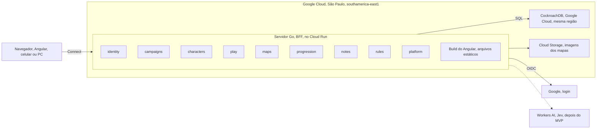

A linha tracejada é futura: o Jev (Workers AI) só entra depois do MVP. O app antigo (Angular em `src/`, NestJS em `server/`, GitHub Pages e Render) não faz parte deste diagrama porque está descontinuado. O `src/` fica no repositório só como referência até sair num PR à parte; o `server/` (NestJS) será removido do repositório (decidido pelo Samuel em 29/09/2026, ver [App antigo](app-antigo.md)).

Os fluxos de quem pode mexer na ficha e de como o jogador entra na sessão ficam em [Regras de negócio → Fluxos e estados](produto/regras.md#fluxos-e-estados), porque são regra de negócio, não peça de infraestrutura.

## Contratos de API (Protobuf)

Toda chamada da API nasce num arquivo `.proto`. O `buf generate` gera o código Go e o TypeScript, e o CI recusa um PR que quebra o contrato. Foi um desencontro de contrato entre o Angular e o NestJS que causou o erro 400 ao salvar fichas.

Regras:

1. Um pacote por módulo e versão: `meurpg.<módulo>.v1`, em `proto/meurpg/<módulo>/v1/`.
2. Um serviço por módulo, em regra. Um assunto à parte dentro do módulo pode ter um serviço próprio, no mesmo pacote: o `campaigns` tem o `CampaignService` e o `CampaignDocumentService`, do [documento da campanha](#documento-da-campanha). Cada chamada tem o seu par `XxxRequest` e `XxxResponse`, mesmo vazio, como o `buf lint` pede.
3. O número de um campo nunca muda nem é reaproveitado. Campo removido vira `reserved`.
4. Mudança que quebra o contrato vira um pacote `v2`. O `buf breaking` compara cada PR com a `main`.
5. O código gerado fica no repositório. O CI roda `buf generate` de novo e falha se aparecer diferença.
6. Campos em `snake_case` no `.proto`; o TypeScript gerado usa `camelCase` sozinho.
7. Chamada só de leitura leva um nível de idempotência, e qual depende da requisição (decidido por Vinicius em 29/09/2026):
   - **Requisição sem ID e sem dado pessoal** (vazia, como `GetMe`, `ListMyCampaigns`, `ListOpenGameSessions` e `GetServerInfo`): `idempotency_level = NO_SIDE_EFFECTS`. O Connect passa a aceitar GET, que o navegador pode guardar em cache.
   - **Requisição com ID ou dado pessoal** (como `GetCampaign`, `ListMembers`, `ListInvites`, `GetCampaignDocument`, `GetCharacter`, `ListCharacters`, `GetMasterNotes`, `ListContent`, `GetSpellDetails`, `ListSpells`, `GetClassTableDefaults`, `GetEffectMenu`, `ListGameSessions` e `GetLiveSession`): `idempotency_level = IDEMPOTENT`. Fica documentada como leitura e segura para repetir, mas só aceita POST: num GET, a mensagem inteira vai na URL, e a URL fica nos logs da plataforma (ver [Privacidade](privacidade.md)).
   - O teste `TestConnectGETOnlyForRequestsWithoutData` (`backend/cmd/api`) falha se um método `NO_SIDE_EFFECTS` tiver requisição com campo.
8. Os nomes seguem o Google AIP (decidido por Vinicius em 29/09/2026):
   - **Métodos padrão** começam com `Get`, `List`, `Create`, `Update` ou `Delete` mais o recurso (AIP-131 a AIP-135): `GetCampaign`, `ListMembers`, `CreateInvite`.
   - **Métodos customizados** começam com o verbo da ação (AIP-136): `AcceptInvite`, `RevokeInvite`.
   - **Busca com filtro**, quando existir, vira `Search<Recurso>`, como `SearchCampaigns`: é o equivalente em RPC do `:search` do AIP-136. Leva `IDEMPOTENT`, porque a requisição carrega o filtro.
   - Nome que já existe não muda: renomear uma RPC quebra o contrato (regra 4).

O primeiro contrato, da Etapa 1, só prova que o caminho todo funciona:

```protobuf
syntax = "proto3";

package meurpg.system.v1;

// SystemService exposes build and runtime information.
service SystemService {
  rpc GetServerInfo(GetServerInfoRequest) returns (GetServerInfoResponse) {
    option idempotency_level = NO_SIDE_EFFECTS;
  }
}

message GetServerInfoRequest {}

message GetServerInfoResponse {
  string version = 1;
  string commit = 2;
}
```

Como o Connect aceita JSON, dá para chamar com `curl`:

```bash
curl -s -X POST http://localhost:8080/meurpg.system.v1.SystemService/GetServerInfo \
  -H 'Content-Type: application/json' -H 'Connect-Protocol-Version: 1' -d '{}'
```

### Códigos de erro

Cada regra de negócio recusada devolve um código de erro do Connect, sempre o mesmo para o mesmo caso.

| Código | Quando |
| --- | --- |
| `unauthenticated` | Sem sessão de login válida. |
| `permission_denied` | O usuário é membro da campanha, mas não tem o papel: um jogador tenta uma ação de mestre. |
| `failed_precondition` | A regra não deixa agora: ficha travada (RN-01), sessão que não começou, convite expirado, imagem usada num mapa. Vem com um detalhe que diz o motivo, quando há mais de um (`InviteUnusable`, `CharacterBlocked`, `GameSessionBlocked`, `XPBlocked`, `AbilityScoresRefusal`, `XpModeChangeBlocked`), ou o que a tela precisa mostrar (`ImageInUse`, com os mapas que usam a imagem). |
| `not_found` | Não existe, ou o usuário não pode saber que existe: um mapa escondido para o jogador, ou uma campanha da qual ele não é membro (ADR-0011). O membro pendente (RN-15) recebe o mesmo `not_found` fora das poucas chamadas que ele pode fazer. |
| `invalid_argument` | Entrada inválida, como um atributo acima de 30. |
| `resource_exhausted` | Um limite da campanha acabou: a galeria cheia (300 imagens ou 500 MB, MR-019), 200 mapas na campanha ou 200 pontos num mapa. |
| `aborted` | Conflito de transação (`40001`) que continuou depois das novas tentativas, ou uma ficha ou um documento da campanha que mudou desde que o app o leu (revisão velha, AIP-154). O app recarrega e a pessoa tenta de novo. |

## Frontend (web/)

O `web/` é o app Angular novo (o `src/` antigo está depreciado). O Go serve o build dele na mesma origem da API, como a linha "Frontend" da tabela de decisões explica.

- **Como é servido:** `backend/internal/platform/httpserver.NewStatic` serve `index.html` e os assets com hash a partir de `WEB_DIR` (`/app/web` na imagem, configurável). Sem `WEB_DIR` válido, o servidor sobe só com a API e registra uma linha de log — não é erro fatal, é o caso normal fora da imagem Docker (`make run` no host, por exemplo). Rota desconhecida (não é `/meurpg.*`, `/auth/*`, `/healthz` nem `/readyz`) cai no `index.html`, para o roteador do Angular assumir (SPA fallback); as quatro exceções viram 404 puro, nunca a página.
- **Cache:** asset com hash no nome (todo mundo, graças a `outputHashing: "all"`) leva `Cache-Control: public, max-age=31536000, immutable`. O `index.html` leva `no-cache`, sempre.
- **CSP:** `default-src 'self'`; `form-action` é `'self'` mais a origem do provedor de login (ver o fluxo do convite abaixo); sem exceção nenhuma em `script-src` (o build de produção não usa `<script>` nem atributo de evento inline — checado no HTML gerado e ao vivo, sem violação no console). `style-src` precisa de `'unsafe-inline'`: é o Angular injetando o CSS de cada componente em `<style>` no `<head>`, em tempo de execução, independente de qualquer opção do build — confirmado também ao vivo (sem o `'unsafe-inline'`, o app carrega sem nenhum estilo). Mais detalhes e a opção de trocar isso por nonce por requisição: comentário de `cspHeader` em `static.go`.
- **Codegen:** `proto/buf.gen.yaml` roda `protoc-gen-es` (Connect-ES v2: um plugin só gera mensagens e serviços) como plugin local, do binário em `web/node_modules/.bin`, com `target=ts`, escrevendo em `web/src/gen/` — código gerado e comitado, como o lado Go. `make proto` instala as dependências do `web/` sozinho, se faltarem.
- **Dev:** `cd web && npm start` sobe o Angular com `proxy.conf.json` encaminhando `/meurpg.*`, `/auth` e as sondas para `localhost:8080`.
- **Visual:** os tokens de cor, tipo, espaço e raio são propriedades CSS `--mr-*` em `web/src/styles.scss`, com os tokens de sistema do Angular Material apontados para eles, e as peças comuns (painel, lista, etiqueta, aviso) ficam em `web/src/styles/_ui.scss`. O que cada um significa e como uma tela é desenhada e revisada: [Design](design.md).
- **Fontes:** Alegreya e Alegreya Sans (licença OFL), dos pacotes `@fontsource/alegreya` e `@fontsource/alegreya-sans`, só o subconjunto latino em woff2, declaradas em `web/src/styles.scss` e servidas pelo próprio Go, como os ícones abaixo. A licença de cada uma está no `NOTICE` e em `third_party/licenses/`.
- **Ícones:** quando a tela precisa de um ícone, é a fonte Material Symbols auto-hospedada (pacote `@material-symbols/font-400`, copiado para o build por uma entrada `assets` do `angular.json` e servido pelo próprio Go) — nunca o Google Fonts, que o `font-src 'self'` do CSP bloqueia e que `docs/privacidade.md` proíbe.

### Estado de sessão e o fluxo de entrar/sair

Um `AuthService` (`web/src/app/core/auth/auth.service.ts`) chama `IdentityService.GetMe` uma vez, na inicialização — na prática assim que o menu de conta da barra de navegação, sempre presente, injeta o serviço — e guarda o resultado num signal com quatro estados:

| Estado | Quando |
| --- | --- |
| `unknown` | O `GetMe` ainda não voltou. |
| `signed-out` | O `GetMe` respondeu com o código `unauthenticated`. |
| `signed-in` | O `GetMe` respondeu com o usuário e `sessionExpiresAt`. |
| `unavailable` | Qualquer outro código do Connect, ou uma falha de rede. Nunca vira `signed-out`: um servidor ou banco fora do ar não pode parecer um usuário deslogado. |

O transporte Connect único do app (`web/src/app/core/connect/transport.ts`) força `credentials: 'same-origin'` no `fetch`, para o cookie de sessão ir em toda chamada, e já recebe `Connect-Protocol-Version: 1` em toda chamada unária por padrão do `@connectrpc/connect` (ver [CSRF](#csrf)) — nada a configurar para isso.

Entrar é sempre uma navegação de página inteira para `/auth/login?return_to=<caminho atual>`, nunca uma rota Angular: é o servidor quem conduz o fluxo OIDC (ver [Módulo identity](#módulo-identity-login-e-sessão) abaixo). `authGuard` (`web/src/app/core/auth/auth.guard.ts`) protege rotas que precisam de sessão, como "Minhas campanhas": deixa passar se `signed-in`; manda para o login, com `return_to`, se `signed-out`; e redireciona para a página "servidor indisponível" (mantendo o caminho pedido em `return_to`, para "Tentar de novo" voltar direto para lá) se `unavailable`, em vez de tratar como se a pessoa tivesse saído. Depois do callback do servidor, o navegador já volta em `return_to`, então não há nada para o cliente interpretar.

Sair chama `IdentityService.SignOut` e sempre volta para a página inicial com uma navegação de página inteira — mesmo se a chamada falhar, porque um "Sair" que falha silenciosamente é pior do que um cookie que uma tentativa futura de `GetMe` corrige.

### Nenhum dado no navegador além do cookie de sessão

Regra do Vinicius, sem exceção: nada no `web/` lê nem grava `localStorage`, `sessionStorage`, IndexedDB, nem grava cookie pelo JavaScript, nem usa Worker para guardar token ou dado pessoal. O único lugar onde a sessão mora é o cookie `__Host-meurpg_session`, `HttpOnly` — o próprio JavaScript do app nunca o lê nem o escreve; quem faz login e logout é sempre uma navegação de página inteira para o servidor (`AuthService.signIn`/`signOut`, acima), nunca `fetch` guardando algo no navegador. O token do convite (abaixo) também nunca toca em armazenamento algum: vive só num campo do componente, na memória.

`web/src/no-web-storage.spec.ts` é a trava automática: varre todo `.ts`/`.html` de `web/src` (fora `gen/` e specs) atrás de `localStorage`, `sessionStorage`, `indexedDB`, `document.cookie =` e `new Worker`/`new SharedWorker`, e falha o teste se algum aparecer. Ver [Privacidade](privacidade.md).

**Por que nada fica no navegador.** O padrão BFF (tabela de decisões, acima) é o que a diretriz do IETF para OAuth em aplicações no navegador ("OAuth 2.0 for Browser-Based Applications") classifica como a opção mais forte: os tokens do OIDC ficam só no servidor, e o navegador só tem o cookie de sessão `__Host-`, `HttpOnly`, que o JavaScript não lê. Guardar token num Web Worker é a mitigação recomendada só para quem precisa mesmo guardar token no navegador — e mesmo assim um XSS ainda consegue usar o worker como proxy; não é o nosso caso, porque nenhum token OIDC chega ao navegador. O token do convite também não fica ali: vai no corpo do `POST /auth/login`, e o servidor guarda só o hash dele, no estado de login de uso único e 10 minutos; um worker não sobreviveria à navegação até o provedor de qualquer forma. Se um dia o navegador precisar chamar uma API de terceiro direto, o padrão do worker é o plano para esse token.

### Telas de campanhas, convite e perfil

MR-001, MR-002 e MR-003 (ver [Histórias](produto/historias.md)) ficam em `web/src/app/pages/`, todas carregadas por rota lazy (`loadComponent`), sobre o `CampaignService` gerado (`web/src/app/core/campaigns/campaigns.service.ts`):

| Rota | Tela | Guarda |
| --- | --- | --- |
| `/campanhas` | `ListMyCampaigns`, com o papel (mestre/jogador) de cada uma, ou "esperando a aprovação do mestre" para o membro pendente (RN-15); formulário "Nova campanha" (nome, modo de XP) que leva à campanha criada | `authGuard` |
| `/campanhas/:id` | `GetCampaign` + `ListMembers`; para o mestre, a seção "Convites" (criar, com a opção "Exigir aprovação do mestre", listar com status, revogar). Para o membro pendente, só `GetCampaign` (que traz só o nome): o aviso "Esperando a aprovação do mestre" e o próprio personagem, sem pedir os membros | `authGuard` |
| `/convite` | Aceita um convite pelo token no fragmento da URL (abaixo) | Pública — trata os dois casos, logado e deslogado |
| `/convite/erro` | Mensagem por código (`motivo`), depois do fluxo de login pelo convite | Pública |
| `/perfil` | "Meu perfil": muda o nome de exibição (`IdentityService.UpdateProfile`) | `authGuard` |

Erros do Connect viram mensagem em português por um mapa `Código → texto` (`web/src/app/core/connect/connect-errors.ts`), com um caso especial para `AcceptInvite`: seu `failed_precondition` carrega o detalhe `InviteUnusable`, e `web/src/app/core/campaigns/invite-errors.ts` lê `state` dele para dizer exatamente por quê (expirado, revogado, já usado). Uma campanha da qual o usuário não é membro, e uma que não existe, chegam como o mesmo `not_found` (ADR-0011) e viram a mesma tela "campanha não encontrada" — o app nunca tenta adivinhar a diferença.

**O fluxo do convite, do lado do navegador** (`web/src/app/pages/invite/invite-accept.ts`):

1. Ao abrir `/convite#t=<token>`, o componente lê o token de `location.hash` no construtor e chama `history.replaceState` **imediatamente**, antes de qualquer outra coisa — a URL visível nunca mostra o token depois desse primeiro instante. O token fica só num campo privado do componente, na memória (ver "Nenhum dado no navegador", acima); nunca vira parâmetro de rota, query string, nem toca em armazenamento algum.
2. Sem token, mostra "link de convite inválido".
3. Com token e sessão ativa, chama `AcceptInvite` direto: sucesso (inclusive `already_member`) navega para `/campanhas/<id>`; convite inutilizável mostra a mensagem específica de `invite-errors.ts`. Num convite com aprovação (RN-15, MR-024), quem acabou de virar membro pendente (`awaiting_approval` e não `already_member`) vai direto para `/campanhas/<id>/personagens/novo`, criar o personagem que o mestre vai aprovar.
4. Com token e sem sessão, mostra "Entrar para aceitar o convite". O clique monta e envia um `<form method="post" action="/auth/login">` oculto, com `return_to=/campanhas`, `intent=campaign_invite` e `intent_payload=<token>` — esse é o contrato com o servidor (módulo `identity`): ele aceita o convite depois do login e redireciona para `/campanhas/<id>` (ou `/campanhas/<id>/personagens/novo`, para quem acabou de virar membro pendente), ou para `/convite/erro?motivo=<código>`, com `<código>` entre `expired`, `revoked`, `used_up`, `not_found`, `invalid` e `unavailable` (o banco falhou ao aceitar). O botão "Entrar" do menu nunca leva o fragmento para o `return_to`: o `AuthService.signIn` corta tudo a partir do `#`, e o servidor também descarta fragmentos. É um POST de mesma origem para `/auth/login`, e o servidor responde com um 303 para o provedor. O navegador confere o `form-action` do CSP em cada passo desse redirecionamento, então o CSP lista, além de `'self'`, a origem do provedor configurado em `OIDC_ISSUER` (`WithFormActionOrigin` em `backend/internal/platform/httpserver/static.go`); sem isso, o botão não sai da página.

### Testes

Unitários (Vitest, `web/src/**/*.spec.ts`) cobrem o mapeamento de erros, o corte do fragmento (`replaceState` chamado, nada de armazenamento tocado), os campos do formulário do fluxo deslogado e, para o convite com aprovação (MR-024), a caixa "Exigir aprovação do mestre", o destino de quem acabou de virar membro pendente, o aviso "Esperando a aprovação do mestre", a lista "Esperando aprovação" do mestre e os botões "Aprovar personagem" e "Recusar personagem". Ponta a ponta (Playwright, tags `@MR-001`/`@MR-002`/`@MR-003`/`@MR-024`) ficam em `e2e/tests/campaigns.spec.ts`, `e2e/tests/invite.spec.ts` (inclusive o caminho de login pelo convite, item 4 acima) e `e2e/tests/character-approval.spec.ts`.

## Módulo identity: login e sessão

O mestre entra por um provedor OpenID Connect (OIDC) com Authorization Code + PKCE, e o servidor abre uma sessão opaca de no máximo 30 dias, guardada num cookie `__Host-` `HttpOnly` (ADR-0002). O código fica em `backend/internal/identity` e não conhece nenhum provedor: em produção é o Google, em desenvolvimento um provedor OIDC local ou um provedor falso dos testes. Tudo vem da configuração (ver [CONTRIBUTING.md](../CONTRIBUTING.md#login-local-com-um-provedor-oidc)) e da descoberta OIDC (`/.well-known/openid-configuration`).

| Rota | O que faz |
| --- | --- |
| `GET /auth/login?return_to=/caminho` | Guarda o estado do login e manda o navegador para o provedor. `return_to` só aceita um caminho deste site; um fragmento (`#...`) é descartado. |
| `POST /auth/login` | O mesmo, a partir de um formulário do app, com uma **intenção de login** opcional (`intent` e `intent_payload`): algo que o servidor conclui logo depois do login, como aceitar um convite. Ver [Aceitar o convite pelo login](#aceitar-o-convite-pelo-login). |
| `GET /auth/callback` | Confere tudo, cria a sessão, grava o cookie, conclui a intenção, se houver, e volta para `return_to` (ou para onde a intenção mandar). |
| `IdentityService.GetMe` | Quem está logado (o ID da conta e o nome de exibição) e quando a sessão acaba. Aceita GET, porque a requisição é vazia. |
| `IdentityService.SignOut` | Revoga a sessão atual no banco e apaga o cookie. As outras sessões do usuário continuam. |
| `IdentityService.UpdateProfile` | Muda o nome de exibição (vazio apaga). O `GetMe` também devolve esse nome. |

### Diagrama: o login

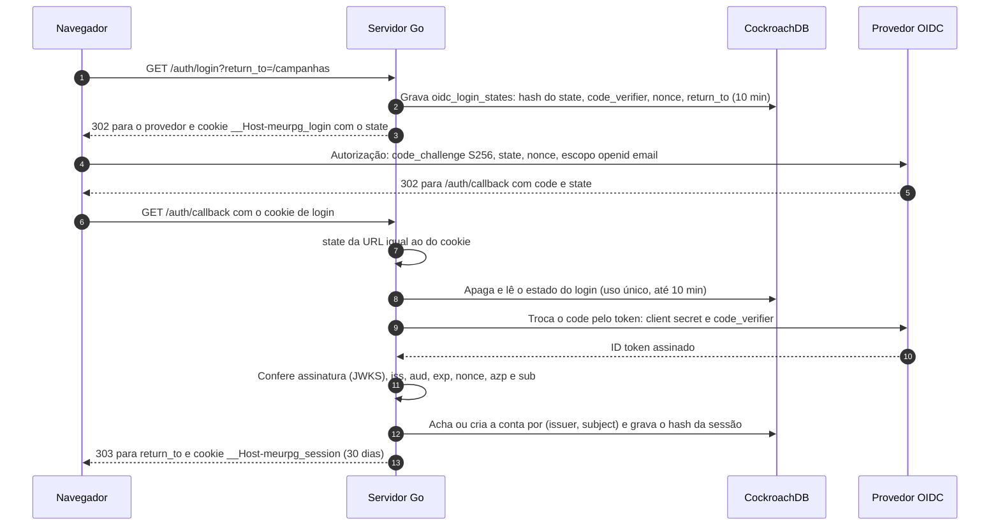

O callback recusa com 400, sem criar sessão, quando: falta o cookie de login ou o `state` não bate com ele; o estado não existe, já foi usado ou passou de 10 minutos; o provedor devolveu erro; a troca do `code` falhou (inclusive por PKCE); ou o ID token falha em qualquer conferência. O `aud` precisa ser só o nosso client ID, e o `azp`, quando vem, também.

### Sessão

- **Token:** 32 bytes aleatórios (`crypto/rand`) no cookie `__Host-meurpg_session`, com `Secure`, `HttpOnly`, `SameSite=Lax` e `Path=/`. O banco guarda só o SHA-256 (`auth_sessions.token_hash`).
- **Validade:** 30 dias corridos desde o login, sem renovar com o uso (NIST SP 800-63B-4, AAL1). Depois disso, o mestre passa pelo provedor de novo.
- **`auth_time` e `max_age`:** o servidor manda `max_age` só se `OIDC_MAX_AGE` estiver definido (o Google não documenta o parâmetro). O `auth_time` do ID token, quando vem, é só registrado em `auth_sessions.auth_time`, nunca usado para decidir: num provedor local de teste ele manteve a hora do primeiro login mesmo depois de um login forçado. No ambiente local, o devidp recebe `OIDC_MAX_AGE=1h`; com o Google, a variável fica sem valor. Quem cumpre a reautenticação a cada 30 dias (NIST SP 800-63B-4) é a sessão de 30 dias no servidor, não o `max_age`.
- **Logout:** apaga a linha da sessão, então o token para de valer na hora, em qualquer instância. Um stream da sessão ao vivo já aberto termina na checagem seguinte, em até 60 segundos (ver [Sessão ao vivo](#sessão-ao-vivo)).
- **Login de novo no mesmo navegador:** gera outro token (nada de reaproveitar o antigo) e revoga a sessão anterior.

Outros módulos descobrem quem chama pela interface descrita em [Quem está chamando](#quem-está-chamando), logo abaixo.

### Quem está chamando

A sessão só entra no contexto de uma requisição pelo `identity`, depois de conferir o cookie no banco: o interceptor, nas chamadas Connect, e o `AuthenticateRequest`, o mesmo passo para as poucas rotas HTTP comuns (enviar e baixar imagens, ver [Módulo maps](#módulo-maps-galeria-e-imagens)). Os dois só leem o cookie da requisição. Nenhuma função exportada põe uma sessão, ou um usuário qualquer, no contexto (decidido por Vinicius em 29/09/2026).

- **Os outros módulos recebem quem chama por uma interface,** `authz.Caller` (`UserID(ctx) (string, error)`). O `identity.Service` implementa lendo a chave privada que o interceptor dele preencheu, e o `cmd/api/main.go` liga as duas pontas. Sem sessão válida, a resposta é `unauthenticated`; se o banco não responde, o interceptor devolve `unavailable`, para o app não achar que o usuário saiu.
- **Nos handlers, a pergunta passa pelo `authz`:** `authz.RequireSignedIn(ctx)` quando basta estar logado, `authz.RequireCampaignMember` ou `authz.RequireCampaignRole` quando é sobre uma campanha. O `campaigns` monta o serviço com `Mount(handle, sessions, ...)`, em que `sessions` é o interceptor mais o `Caller` (o próprio `identity.Service` em produção). Numa rota HTTP comum, o `authz.Middleware` faz o papel do `authz.Interceptor`: as mesmas checagens, com um memo por requisição. Nenhuma rota está em `pendingMayCall`, então o membro pendente fica de fora.
- **Os testes dos outros módulos usam um `Caller` falso** (um mock), em vez de fabricar uma sessão. O mock só existe nos arquivos `_test.go` daquele módulo.
- **O `identity.Store` também fecha essa porta:** os métodos de sessão e de estado do login são não exportados, então nenhum outro pacote cria ou consulta uma sessão, nem implementa um `Store` falso que invente uma.
- **A intenção de login também:** o `IntentHandler.Complete` recebe o usuário como `identity.SignedIn`, que só o callback do `identity` preenche (ver [Aceitar o convite pelo login](#aceitar-o-convite-pelo-login)).

Assim, um erro num módulo novo não vira um jeito de se passar por outra pessoa: para ter um usuário no contexto, a requisição precisa de um cookie de sessão válido.

### CSRF

A proteção vem em camadas, como a ADR-0009 descreve:

| Camada | O que barra |
| --- | --- |
| Cookie `SameSite=Lax` | O navegador não manda o cookie em POST nem em `fetch` vindos de outro site. |
| `http.CrossOriginProtection` em volta do mux | Recusa com 403 um POST (ou PUT, DELETE) de outra origem, pelo `Sec-Fetch-Site` ou comparando `Origin` com `Host`. GET sempre passa, então nenhum GET pode mudar estado sem proteção própria. |
| `connect.WithRequireConnectProtocolHeader()` em todo serviço | Toda chamada unária do Connect exige o header `Connect-Protocol-Version: 1` (ou `connect=v1` na URL de um GET). Outro site só mandaria esse header depois de um preflight de CORS, que o servidor não aceita. |
| `state` no cookie de login, PKCE e `nonce` | Protegem o `GET /auth/callback`, que cria a sessão mesmo sendo GET. Ninguém consegue fazer o navegador da vítima terminar um login começado por outra pessoa. |

Por causa do header obrigatório, um `curl` numa chamada Connect precisa de `-H 'Connect-Protocol-Version: 1'`.

O envio de imagens (`POST /uploads/images`) não é Connect, então o header do protocolo não vale para ele. Quem o protege é o `http.CrossOriginProtection`, que fica em volta de todas as rotas, e o cookie `SameSite=Lax`. O teste `TestCrossSiteUploadsAreRefused` confere que um envio de outro site recebe 403 e não grava nada.

### Limite de tentativas no login

`/auth/login` grava uma linha em `oidc_login_states` a cada chamada, então tem um limite, em memória, antes de qualquer outra coisa. O `GET` e o `POST` dividem o mesmo limite. Passou do limite, a resposta é `429 Too Many Requests` com `Retry-After` (em segundos), sem gravar nada.

| Limite | Valor | Por quê |
| --- | --- | --- |
| Por IP do cliente | 20 de uma vez, depois 1 a cada 3 s (20 por minuto) | Folga para uma mesa inteira no mesmo Wi-Fi; um cliente sozinho não enche a tabela. |
| Geral | 200 de uma vez, depois 2 por segundo (120 por minuto) | Limita o que uma botnet grava: no máximo 7.200 linhas por hora por instância, que o TTL apaga na hora seguinte. |

- O limite de cada cliente é conferido antes do geral, então um cliente acima do próprio limite não gasta a cota de todo mundo. IPv6 conta por `/64`.
- Os contadores ficam na memória de cada instância: com N instâncias no Cloud Run, o limite efetivo é até N vezes maior. Uma tabela de no máximo 10 mil clientes evita que endereços novos esgotem a memória; um cliente parado some da tabela em até 2 minutos, mesmo que nenhuma requisição nova chegue.
- **De onde vem o IP.** Localmente, da conexão (`RemoteAddr`); `X-Forwarded-For` é ignorado, porque qualquer cliente manda o que quiser nele. No Cloud Run (a variável `K_SERVICE` existe), toda requisição passa pelo front end do Google, e o IP do cliente vem do **último** item do `X-Forwarded-For`: o Google acrescenta o endereço de quem se conectou a ele depois do que o cliente mandou, e não confere o que vem antes. A fonte (documentação do Google Cloud) e o que muda se um dia houver um load balancer na frente estão no comentário de `ratelimit.ClientKey`, em `backend/internal/platform/ratelimit`.
- O IP não vai para o log (ver [Privacidade](privacidade.md)).

### Sem provedor ou sem banco

O servidor sobe mesmo sem `OIDC_ISSUER` ou sem `DATABASE_URL`: o log de início avisa que o login está desligado, `/auth/login` e `/auth/callback` respondem 503 e o `IdentityService` responde `unavailable`. Se o provedor estiver fora do ar quando o servidor sobe, a descoberta é tentada de novo no próximo login.

## Testes e o provedor de desenvolvimento

Os testes rodam em três camadas, e nenhuma depende de um provedor de identidade de fora:

| Camada | Onde | Provedor OIDC | No CI |
| --- | --- | --- | --- |
| Unitário e fluxo em Go | `go test` em `backend/` | O provedor de `internal/identity/oidctest`, dentro do próprio teste (HTTPS com `httptest`), que loga o usuário na hora e deixa o teste quebrar uma coisa de cada vez: claims, chave de assinatura, descoberta | Job `go` |
| Integração em Go | `go test` com `MEURPG_TEST_DATABASE_URL` | O mesmo, com o CockroachDB de verdade atrás | Job `go-db` (CockroachDB com `docker run`) |
| Ponta a ponta | Playwright em `e2e/`, contra o `docker compose` | **devidp** (`backend/cmd/devidp`): o mesmo `oidctest`, servido com uma página que lista os usuários de teste | Workflow `e2e` |

O devidp implementa só o que o login precisa, com rigor: descoberta, JWKS com uma chave RSA gerada ao subir, `/authorize` com PKCE S256 obrigatório, `state` e `nonce`, `/token` para um client confidencial, ID token RS256 com `email`, `email_verified` e `auth_time`, e `max_age` e `prompt` medidos contra a própria sessão dele. Ele nunca vai para produção: a imagem dele é outra, ele só aceita issuer em host de loopback e não sobe no Cloud Run (detalhes e usuários de teste no [CONTRIBUTING.md](../CONTRIBUTING.md#login-local-com-o-devidp)).

### Diagrama: o login no ambiente local

O issuer é `http://idp.localhost:9090` para os dois lados. O navegador resolve qualquer `*.localhost` para `127.0.0.1` sozinho (RFC 6761) e chega ao devidp pela porta publicada. O container da API chega ao mesmo nome pelo alias de rede `idp.localhost`, que o Docker resolve para o container do devidp. Com a mesma string dos dois lados, o `iss` do ID token bate com o `OIDC_ISSUER`. A configuração aceita `http` num nome `*.localhost` pelo mesmo motivo.

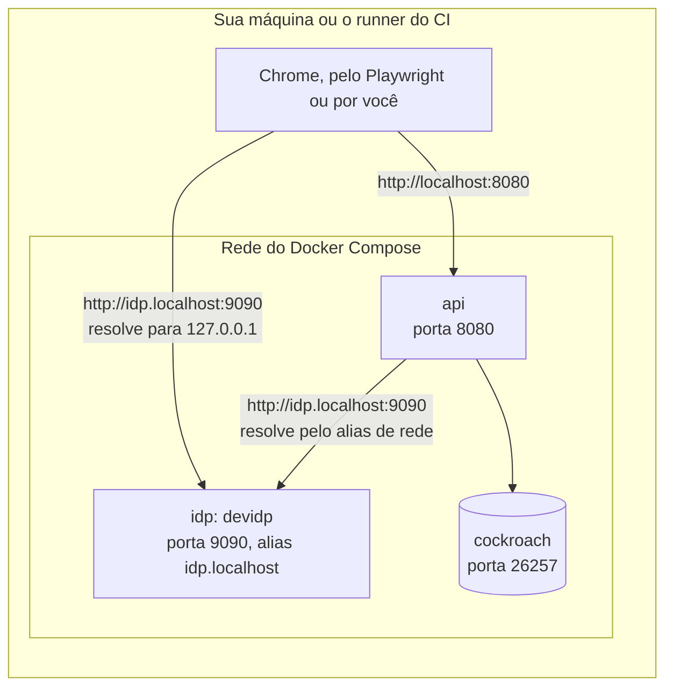

O cookie `__Host-meurpg_session` exige `Secure`, e mesmo assim funciona em `http://localhost`: o Chrome trata `localhost` como contexto seguro. Um teste Playwright confere isso no navegador. O Safari não aceita, então o login local é no Chrome ou no Firefox.

## Módulo campaigns e autorização

O mestre cria a campanha e gera convites; o jogador faz login e aceita o convite, e vira jogador da campanha (MR-001, MR-002, MR-003). O código fica em `backend/internal/campaigns`, e quem decide o que cada um pode fazer é o pacote `backend/internal/authz` (ADR-0011: papéis por campanha, conferidos no banco a cada requisição).

| Chamada | Quem pode |
| --- | --- |
| `CreateCampaign`, `ListMyCampaigns`, `AcceptInvite` | Qualquer pessoa logada. `ListMyCampaigns` também lista as campanhas em que a pessoa é membro pendente, só com o nome |
| `GetCampaign` | Membros da campanha; o membro pendente (RN-15) também, e recebe só o nome e `awaiting_approval` |
| `ListMembers` | Membros da campanha. O membro pendente não aparece na lista e recebe `not_found` |
| `CreateInvite`, `ListInvites`, `RevokeInvite` | O mestre da campanha |
| `SetCampaignDiceMode` | O mestre da campanha (RN-18, ver [Dados da campanha](#dados-da-campanha)) |
| `SetMyDicePreference` | Membros da campanha, o mestre também; o membro pendente recebe `not_found` |
| `ListPendingMembers`, `RemovePendingMember` | O mestre da campanha. Listam e removem os membros pendentes que ainda não criaram o personagem (RN-15, pergunta 24); não são `ListMembers` de propósito, porque essas pessoas não são membros. Quem já criou o personagem se aprova ou se recusa pelo `CharacterService` |
| `CampaignDocumentService`: `GetCampaignDocument`, `UpdateCampaignDocument` | O mestre da campanha (ver [Documento da campanha](#documento-da-campanha)) |

### Autorização

O papel é por campanha (RN-05): a linha em `campaign_members` diz se a pessoa é `master` ou `player` naquela campanha. Não existe papel global, nem papel guardado em token.

- **O banco decide, a cada requisição.** Tirar alguém da campanha vale na chamada seguinte, sem esperar nada vencer.
- **Uma checagem explícita no começo de cada handler:** `authz.RequireCampaignMember(ctx, id)` para qualquer membro, `authz.RequireCampaignRole(ctx, id, authz.RoleMaster)` só para o mestre, ou só `authz.RequireSignedIn(ctx)` quando basta estar logado. As poucas chamadas que o membro pendente pode fazer usam `authz.RequireCampaignMemberOrPending(ctx, id)` (ver [Membro pendente](#membro-pendente)). Quem está chamando vem do `identity`, pela interface `authz.Caller` (ver [Quem está chamando](#quem-está-chamando)).
- **Uma leitura por campanha, por requisição.** O `authz.Interceptor` dá a cada requisição um memo novo, e o memo acaba com ela.
- **O stream confere de novo.** Um stream (`WatchGameSession`) dura minutos, e o memo dele duraria o mesmo tanto. Por isso o handler chama `authz.RecheckCampaignMember` a cada 60 segundos: ela lê de novo a sessão de login (`identity.Service.RecheckSession`, pela interface `authz.SessionRechecker`) e a participação, sem o memo, e o stream termina com o mesmo erro que uma chamada nova receberia (`unauthenticated` ou `not_found`). Sem um `Caller` que saiba conferir a sessão de novo, a checagem falha (`internal`).
- **Sem o interceptor, a checagem falha** (`internal`), nunca libera.

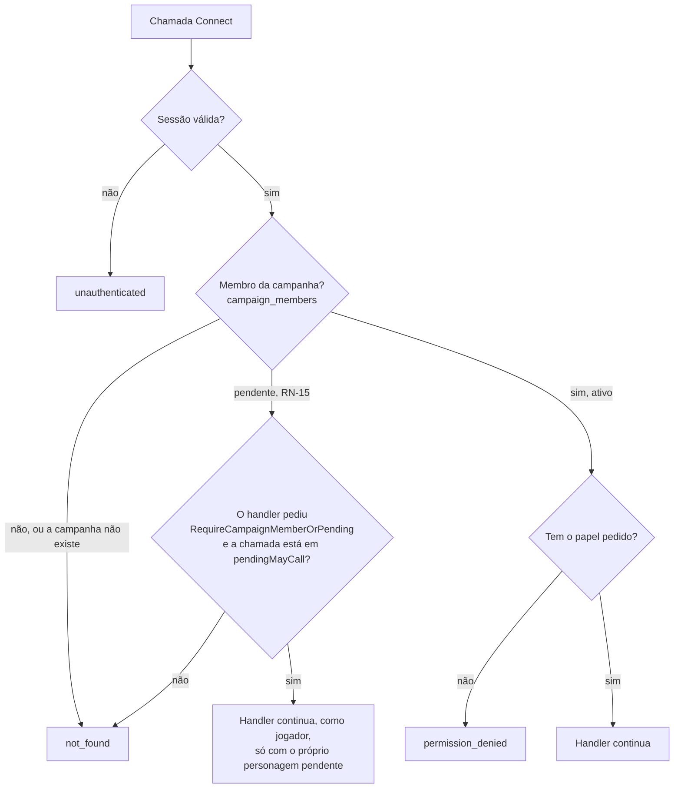

Quem não é membro recebe `not_found` tanto para uma campanha que existe quanto para uma inventada, com a mesma mensagem. Assim ninguém descobre quais campanhas existem. Um teste chama todo método do `CampaignService` como mestre, jogador, não membro, anônimo e membro pendente (`TestAuthorizationMatrix`), e falha se um método novo aparecer sem linha na tabela; o `CampaignDocumentService` tem o dele (`TestCampaignDocumentAuthorizationMatrix`).

### Membro pendente

O membro pendente é quem aceitou um convite com aprovação (RN-15, MR-024) e espera o mestre aprovar o personagem que criou. Ele não é membro: `campaign_members.status = 'pending'`, e `RequireCampaignMember` e `RequireCampaignRole` respondem a ele exatamente como a quem não está na campanha (`not_found`, a mesma mensagem). Assim, toda chamada que já existe, e toda chamada nova, o deixa de fora sem ninguém precisar lembrar dele.

Um membro pendente que nunca cria o personagem é apagado sozinho 30 dias depois de entrar (TTL do banco sobre `campaign_members.pending_expires_at`, ver [Modelo de dados](dados.md#esquema-implementado)); o mestre o vê e o remove antes com `ListPendingMembers` e `RemovePendingMember`. Se ele aceita um convite comum (sem aprovação) da mesma campanha, `AcceptInvite` o promove na mesma transação: gasta um uso, ativa a participação e aprova o personagem dele, se houver, pela interface `campaigns.Characters`, que o `characters` implementa (`cmd/api` liga os dois com `SetCharacters`, porque os dois módulos se precisam e nenhum importa o outro).

A exceção é uma só (acrescida em 06/10/2026 das duas chamadas dos 4d6, que fazem parte de criar o personagem), e fica escrita no `authz` (`backend/internal/authz/pending.go`), não espalhada pelos handlers: enquanto espera, ele trabalha no próprio personagem. Para passar, duas travas precisam abrir:

1. O handler pede, chamando `authz.RequireCampaignMemberOrPending` em vez de `RequireCampaignMember`.
2. A chamada está em `pendingMayCall`, a lista fechada do que o membro pendente pode chamar. Se um handler fora da lista pedir mesmo assim, o membro pendente continua recebendo `not_found`, e o erro de programação vai para o log.

| Chamada em `pendingMayCall` | Para quê | O que o handler limita |
| --- | --- | --- |
| `CampaignService.GetCampaign` | Ver o nome da campanha enquanto espera | Só `id`, `name`, `my_role` (jogador) e `awaiting_approval` |
| `CharacterService.CreateCharacter` | Criar o único personagem, que nasce pendente | Só personagem de jogador, e um só (RN-03: o pendente conta como vivo) |
| `CharacterService.GetCharacter`, `ListCharacters` | Ler o próprio personagem | Só o próprio personagem pendente |
| `CharacterService.UpdateCharacter`, `UpdateCharacterStory` | Editar a ficha e a história | Só o próprio personagem pendente |
| `CampaignService.GetTableRules` | Ler os jeitos de fazer atributos que a mesa deixa (RN-24) | Só leitura; o mesmo que um jogador lê |
| `CharacterService.GetAbilityRolls`, `RollAbilityScores` | Fazer os atributos da ficha com os 4d6 que o servidor guarda (RN-24, fatia 10.4a); o pendente só cria a ficha do jeito que a mesa deixa | Só o jogador (o mestre recebe `permission_denied`); os jogos são dele |
| `ContentService.ListContent` | O catálogo que o editor de personagem oferece | — |
| `ContentService.GetSpellDetails` | Os detalhes de uma magia, para a lista de magias do editor | — |

Dentro dessas chamadas, o membro pendente é tratado como jogador (`authz` devolve `RolePlayer` e `Membership.Pending`), e o `characters` só mostra a ele os personagens `pending` dele (`canSee`, em `access.go`). `ListMyCampaigns` não precisa de exceção: só pede login, e lista as participações da própria pessoa, pendentes incluídas. Mudar a lista é mudar a RN-15: precisa da decisão, das linhas nas matrizes de autorização (`TestAuthorizationMatrix` de `campaigns` e de `characters` têm uma coluna para o membro pendente) e do teste `TestPendingMayCallIsTheAgreedList`.

O membro pendente deixa de existir de um dos dois jeitos, sempre pelo mestre e sempre na mesma transação que decide o personagem (ver [Módulo characters](#aprovar-ou-recusar-o-personagem)): a aprovação o torna membro ativo (jogador), a recusa apaga a participação.

### Convites

O convite é um link `https://<app>/convite#t=<token>`. O token tem 32 bytes aleatórios e só o servidor o gera; o banco guarda só o SHA-256 dele (`campaign_invites.token_hash`), e o servidor devolve o token uma vez só, na resposta do `CreateInvite`.

- **O token vai no fragmento (`#t=`),** que o navegador nunca manda para o servidor, então não aparece em log nem no `Referer`. O app lê o fragmento e manda o token no corpo do `AcceptInvite`, nunca na URL (ADR-0009).
- **Padrão (RN-07, decidida em 29/09/2026):** vale para uma pessoa e por 7 dias. O mestre pode escolher de 1 a 20 usos e de 5 minutos a 30 dias, e pode revogar o convite a qualquer momento. Quem já entrou continua na campanha.
- **Aceitar exige login** (hoje, OIDC). Quando o login do jogador sem Google chegar (RN-17, ADR-0009), ele cria a conta e a sessão, e a mesma regra de aceitar convite roda depois.
- **Convite com aprovação (RN-15, MR-024, implementado na Etapa 4):** o mestre escolhe, em cada convite, se ele exige aprovação (`CreateInviteRequest.requires_approval`, "Exigir aprovação do mestre" na tela; o padrão é não exigir, e o convite funciona como antes). Quem aceita um convite com aprovação vira [membro pendente](#membro-pendente), gasta um uso do convite, e o app o leva direto para criar o personagem, que nasce pendente. O mestre aprova ou recusa esse personagem (ver [Módulo characters](#aprovar-ou-recusar-o-personagem)); recusado, o jogador precisa de um convite novo.
- **Aceitar de novo não muda nada:** um membro recebe a campanha de volta com `already_member`, e nenhum uso do convite é gasto. Vale para o membro pendente, com qualquer convite da campanha: ele continua pendente.
- **Dois jogadores disputando o último uso não entram os dois.** Tudo acontece numa transação (`db.InTx`), com a linha do convite travada (`SELECT ... FOR UPDATE`); o `UPDATE` repete as regras, e um `CHECK` no banco impede `use_count` maior que `max_uses`. O teste `TestAcceptInviteRaceForTheLastUse` põe dez pessoas ao mesmo tempo no CockroachDB.
- **Convite que não serve** responde `failed_precondition`, com o detalhe `InviteUnusable` dizendo o motivo: expirado, revogado ou já usado. O app mostra uma mensagem clara para cada um. "Já usado" é o aviso de que o link pode ter vazado.

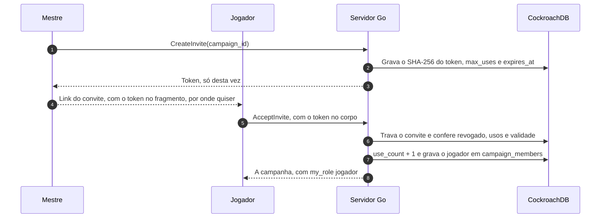

### Aceitar o convite pelo login

Quem abre o link do convite sem estar logado entra e aceita o convite num passo só, e nada fica guardado no navegador: nem `localStorage`, nem `sessionStorage`, nem service worker (decidido por Vinicius em 29/09/2026, ADR-0009). O token vai no corpo do formulário de login, e o servidor guarda só o hash dele, dentro do estado do login, que já é de uso único e dura no máximo 10 minutos.

1. A tela `/convite#t=<token>` lê o token do fragmento e envia um formulário `POST /auth/login` (`application/x-www-form-urlencoded`, da mesma origem) com `return_to`, `intent=campaign_invite` e `intent_payload=<token>`.
2. O `identity` confere o limite de tentativas e o `return_to`, e pede ao `campaigns` para preparar a intenção. O `campaigns` confere o formato do token e devolve o SHA-256 dele. O `identity` grava o hash, com o tipo da intenção, em `oidc_login_states`, e segue o login como sempre.
3. No callback, depois de criar a sessão, o `identity` pede ao `campaigns` para concluir a intenção. O `campaigns` aceita o convite pelo hash, na mesma transação do `AcceptInvite` (`db.InTx`, com a linha do convite travada).
4. O navegador vai para `/campanhas/<campaign_id>`, inclusive quem já era membro. Quem acabou de virar membro pendente, por um convite com aprovação (RN-15), vai para `/campanhas/<campaign_id>/personagens/novo`, criar o personagem. Se o convite não serve, vai para `/convite/erro?motivo=<código>`. O login vale do mesmo jeito: a sessão fica, e só o destino muda.

| `motivo` | Quando |
| --- | --- |
| `expired` | O convite passou da validade. |
| `revoked` | O mestre revogou o convite. |
| `used_up` | Os usos acabaram, talvez com alguém que pegou o link. |
| `not_found` | Nenhum convite tem esse token, ou a campanha foi apagada. |
| `invalid` | O que ficou guardado no login não é um hash de token. Só um bug causa isso. |
| `unavailable` | O banco não respondeu. Abrir o link de novo pode funcionar. |

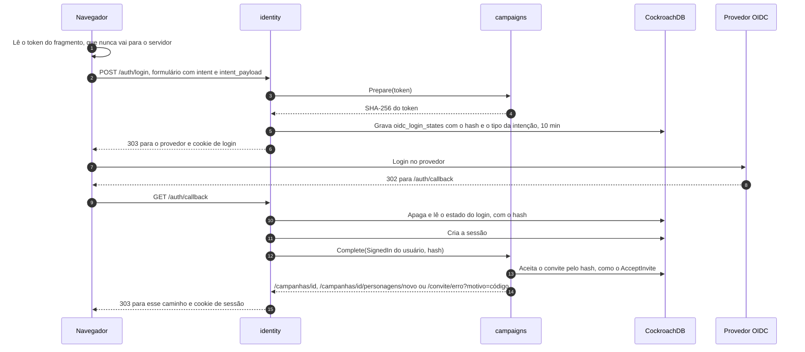

Regras que valem para qualquer intenção, não só a do convite:

- **O `identity` não conhece o `campaigns`.** Ele tem um registro de intenções por nome (`identity.Config.Intents`), preenchido no `cmd/api/main.go`. Cada intenção implementa `identity.IntentHandler`: `Prepare(payload)` no começo do login, que devolve o que guardar (no máximo 256 bytes, e nunca um segredo como veio), e `Complete(ctx, quem, dados)` depois da sessão criada, que devolve para onde ir.
- **`Complete` só age por quem acabou de entrar.** O usuário chega como `identity.SignedIn`, uma capacidade: o campo é privado e não há construtor, então só o callback do `identity` preenche um, logo depois de criar a sessão daquela pessoa. Fora do `identity`, só dá para escrever `identity.SignedIn{}`, que não tem usuário, e o `Complete` do convite recusa esse valor antes de tocar no banco (decidido por Vinicius em 29/09/2026). Pelo mesmo motivo do `ContextWithSession` removido: nenhuma função exportada age como um usuário qualquer.
- **Nada secreto em URL.** O `GET /auth/login` recusa `intent` e `intent_payload` com 400, e o `POST` recusa query string. O `return_to` perde o fragmento, então nem um `#t=...` colado por engano é guardado.
- **CSRF:** o `POST /auth/login` passa pelo `http.CrossOriginProtection`, então um formulário de outro site recebe 403. Sem isso, qualquer página poderia fazer o navegador de alguém entrar numa campanha escolhida por um atacante.
- **Entrada ruim para antes do provedor:** tipo de intenção desconhecido, `intent_payload` sem `intent`, token mal formado ou maior que 1.024 caracteres respondem 400; corpo acima de 8 KiB, 413; outro `Content-Type`, 415. Nada é gravado.
- **O destino passa pela mesma checagem do `return_to`.** Um caminho que não é deste site é trocado pelo `return_to`.
- **Logs:** registram só o motivo e o tipo da intenção, nunca o token, o hash ou um valor enviado pelo cliente. Os testes `TestIntentLogsHaveNoSecrets` e os de `signin_test.go` conferem.

### Respostas e GET

Toda resposta do `CampaignService` e do `CampaignDocumentService`, inclusive os erros, sai com `Cache-Control: no-store`. Só o `ListMyCampaigns` aceita GET (`NO_SIDE_EFFECTS`), porque a requisição dele é vazia. As outras leituras (`GetCampaign`, `ListMembers`, `ListInvites`, `GetCampaignDocument`) levam o ID da campanha, e num GET a mensagem inteira vai na URL, que fica nos logs da plataforma (ver [Privacidade](privacidade.md)). Por isso elas levam `IDEMPOTENT` e ficam só em POST, mesmo sem efeito colateral (regra 7 dos [Contratos de API](#contratos-de-api-protobuf)).

### Dados da campanha

Como os jogadores rolam os dados é uma configuração da campanha mais uma preferência de cada membro (RN-18, MR-013, MR-014). O `Campaign` traz `dice_mode`; o `GetCampaign` traz também `my_dice_preference`, a do próprio chamador, que é o que a página da campanha precisa (as listas não leem a coluna, então vem vazia nelas). O `ListMembers` põe `dice_preference` em cada `Member` só quando quem chama é o mestre, porque é ele que lista a escolha de cada jogador no painel "Dados"; para um jogador o campo vem vazio. Foi um campo a mais, e não uma chamada nova, porque o painel já lista os membros. `SetCampaignDiceMode` e `SetMyDicePreference` devolvem o valor salvo; repetir o mesmo valor não é erro, e um valor não especificado é `invalid_argument`.

A conta "onde este jogador rola?" é `campaigns.EffectiveDiceMode(modo, preferência)`, uma função pura: com `app` ou `physical` na campanha, vale o modo e a preferência não importa; com `players_choose`, vale a preferência. O `Service.PlayerDiceMode(ctx, campaignID, userID)` faz as duas leituras e aplica a função. O módulo `play` não importa o `campaigns`: ele vai declarar uma interface pequena (`PlayerDiceMode(ctx, campaignID, userID) (campaigns.RollsIn, error)` ou o equivalente com um tipo dele) e o `cmd/api` entrega o serviço, como já se faz com `ActiveCampaigns`. Os NPCs não passam por aqui: rolam sempre no app.

#### O pacote platform/dice

`backend/internal/platform/dice` é Go puro, sem dependência nova, e é onde se rola (o módulo `rules` continua sem aleatoriedade, ADR-0008). `Parse` lê `d20`, `1d20+6`, `2d6 + 2`, `1d4 - 1` e recusa o resto, com os limites de 1 a 100 dados, lados em 4, 6, 8, 10, 12, 20 ou 100, e modificador de −100 a +100. `Roll(roller, expr)` devolve um `Result` (a expressão, as faces, o modificador e o total). `Roller` é uma interface: `Crypto` usa `crypto/rand` (`rand.Int` sorteia sem viés), e `Fixed` devolve uma sequência de faces nos testes. `Physical(expr, soma)` confere a soma digitada, que tem de ficar entre `N` e `N×lados`, e soma o modificador; o resultado não tem faces, porque ninguém as digitou.

### As regras da mesa (MR-025, RN-24)

As escolhas da página "Regras da mesa" são do `campaigns` (arquivo `tablerules.go`; a tabela `campaign_table_rules`, ver [Dados](dados.md)) e valem para a campanha inteira. Três chamadas do `CampaignService`:

| Chamada | Quem | O que faz |
| --- | --- | --- |
| `GetTableRules` | Todo membro ativo e o membro pendente (RN-15; não membro: `not_found`) | As regras, o estilo que elas formam, os três estilos prontos e os números dos jeitos de atributo (o conjunto padrão, o custo de cada valor da compra, os 27 pontos e a faixa de digitar, do SRD 5.2.1), para o app não fazer conta. Sem linha, os padrões. `IDEMPOTENT`. |
| `SetTableRules` | O mestre | Troca **todas** as regras de uma vez (a página tem um "Salvar regras" só): cada campo é gravado como veio, e o modo de dados (`campaigns.dice_mode`, RN-18) vai na mesma transação. Valem a partir de agora: as fichas que existem ficam como estão. |
| `SetCampaignXpMode` | O mestre | Muda o modo de XP depois de criada a campanha (RN-09). Ver abaixo. |

- **Os campos e os padrões** (o padrão é o que o app fazia): PV do nível `player_chooses`; os quatro jeitos de atributo ligados (pelo menos um: `invalid_argument` se nenhum); crítico `doubled_dice`; testes contra a morte `visible_to_all`; combate com mapa; névoa desligada nos mapas novos; até 20 regras da casa de 1 a 200 caracteres, numa linha, só texto que o app mostra. **O crítico e os testes contra a morte são aplicados pelo combate** (fatia 10.4b, ver [As regras da mesa no combate](#as-regras-da-mesa-no-combate-etapa-10-fatia-104b)).
- **O estilo da mesa não é guardado.** `StyleOf(modo de dados, combate com mapa, névoa nos mapas novos)` devolve `TUDO_NO_APP` (app, com mapa, névoa), `MESA_FISICA` (físicos, sem mapa, sem névoa), `TEATRO_DA_MENTE` (cada um escolhe, sem mapa, sem névoa) ou `PERSONALIZADO` quando os três valores não batem com nenhum. Os três estilos vêm na resposta do `GetTableRules` (`presets`), para a tela preencher os campos sem repetir a conta; um estilo só preenche esses três, e o resto fica como o mestre marcou.
- **Quem lê o quê.** O `characters` lê tudo pelo `ContentSource` (ver [Módulo characters](#módulo-characters-personagens-e-fichas)): os PV do nível e os jeitos de atributo. O `maps` lê `FogOnNewMaps` ao criar um mapa (a névoa é feita de quadrados da grade, e um mapa novo não tem grade: o mapa leva a marca `fog_on_first_grid`, e a névoa liga com a primeira grade, no `SetMapGrid`, com a cópia da imagem se outro uso a divide, RN-10), por `maps.MapDefaults` (uma interface de um método que o `campaigns.Service` implementa; `Config.Defaults` é opcional e vazia quer dizer sem névoa). O `play` lê o "combate com mapa" (fatia 10.5b, RN-25), o crítico e os testes contra a morte (fatia 10.4b) por `play.CombatDefaults` (`Config.Defaults`, opcional: vazio quer dizer os padrões do SRD e todo combate sem modo no mapa), que o `campaigns.Service` implementa (`CombatWithoutMap` e `StoredTableRules(ctx, tx, campanha)`, na transação de quem escreve). O crítico e os testes contra a morte **não** passam pelo `ContentSource`: são regras do combate, não do conteúdo da ficha.
- **O modo de XP depois de criada a campanha.** `SetCampaignXpMode` troca `campaigns.xp_mode` e guarda a hora (`xp_mode_changed_at`, que uma chamada que não muda nada devolve). O modo também decide o "Pode subir de nível" (RN-12): trocá-lo move os avisos de subir de nível que esperam (por XP, o XP alcançar o nível; por marcos, a marca), sem gravar nada nas fichas. Se já houve XP dado (um prêmio que não foi desfeito, um marco incluído), recusa com `failed_precondition` e o detalhe `XpModeChangeBlocked` (`awards` e `total_xp`: o texto da tela "Já houve XP dado nesta campanha") até o mestre mandar `confirm`; sem XP dado, ou para o modo que a campanha já tem, muda sem perguntar. **Nada é convertido**: o XP já dado e o histórico ficam como estão, e o novo modo vale daqui para a frente (RN-09: os modos só decidem que prêmios cabem na campanha). O número de prêmios e de XP vem do `progression` pela interface `campaigns.XPAwards` (`AwardedXP`, implementada pelo `progression.Service`, ligada por `SetXPAwards` no `cmd/api`), lida na transação que muda o modo, com a linha da campanha travada. Voltar ao modo de antes pergunta do mesmo jeito. **Um prêmio e a mudança do modo se alternam:** `give` e as escritas dos marcos planejados releem o modo dentro da própria transação (`CampaignXPMode(ctx, tx, ...)`), e, sob isolamento serializável, um dos dois repete (`TestRN09_AnAwardAndAChangeOfTheXPModeTakeTurns`).
- **Quem rola dados.** `CampaignDiceMode` agora responde também por um membro pendente (RN-15): ele cria o personagem e rola os atributos pela regra da campanha.

Testes (`campaigns`): `TestRN24_TableRulesRoundTrip`, `TestRN24_TheStyleIsWorkedOutNotStored`, `TestRN24_OnlyTheMasterWritesTheRules`, `TestRN24_TheRulesRefuseWhatBreaksTheLimits`, `TestTableRulesParamsRefuseWhatBreaksTheLimits`, `TestStyleOf`, `TestRN09_TheXPModeChangesAfterCreation` e a matriz `TestAuthorizationMatrix`; no `progression`, `TestRN09_ChangingTheXPModeAsksOnceXPWasAwarded` e `TestRN09_AnUndoneAwardDoesNotCount`; no `maps`, `TestRN24_NewMapsStartWithTheFogTheTableChose`.

### Nome de exibição

Os membros aparecem pelo nome de exibição, que cada pessoa digita no app (`IdentityService.UpdateProfile`, de 1 a 40 caracteres). Ele nunca vem do provedor de login. O `campaigns` pede os nomes ao `identity` por uma interface (`Profiles`, que o `identity.PostgresStore` implementa), sem ler a tabela `users`, como a regra dos módulos manda.

### Documento da campanha

Cada campanha tem um documento: um texto em Markdown que só o mestre lê e escreve (MR-018), com a preparação do jogo, imagens da galeria e links para mapas e fichas. "Só o mestre" está decidido (pergunta 27, respondida em 02/10/2026), porque o documento guarda spoilers; se um dia os jogadores puderem ler o documento, ou partes dele, mudam a autorização e esta seção. O código fica em `backend/internal/campaigns/document.go`; o contrato, em `proto/meurpg/campaigns/v1/campaign_document.proto`; a tabela, em [Modelo de dados](dados.md#esquema-implementado).

| Chamada do `CampaignDocumentService` | Mestre | Jogador | Não membro | Anônimo | Membro pendente (RN-15) |
| --- | --- | --- | --- | --- | --- |
| `GetCampaignDocument`, `UpdateCampaignDocument` | Sim | `permission_denied` | `not_found` | `unauthenticated` | `not_found` |

- **Um documento por campanha.** A linha em `campaign_documents` nasce no primeiro salvamento. Antes disso, o documento é vazio, na revisão 0. Apagar a campanha apaga o documento; excluir a conta de quem o editou por último não apaga: o documento é da campanha.
- **Revisão, como na ficha.** O app manda a revisão que leu (`expected_revision`), e o servidor só salva se ela ainda é a guardada, numa instrução só: `INSERT ... ON CONFLICT DO NOTHING` no primeiro salvamento, `UPDATE ... WHERE revision = <a lida>` nos outros. Se alguém salvou antes (outra aba, ou outro mestre quando a RN-13 chegar), a resposta é `aborted` e nada muda; a tela avisa e guarda o rascunho. O mesmo salvamento repetido (o mesmo texto, pela mesma pessoa, uma revisão acima) devolve o documento salvo, não `aborted`: é uma resposta que se perdeu, ou um clique duplo.
- **O texto.** Até 200 KiB: 204.800 bytes de UTF-8, contados em bytes, como o banco guarda (um `CHECK` repete o limite). Quebra de linha e tabulação valem, e `\r\n` vira `\n`. Os outros caracteres de controle, e os invisíveis que mudam a direção do texto, são recusados com `invalid_argument`, que diz o campo e nunca repete o texto. Nada mais muda: os espaços nas pontas ficam, porque no Markdown eles contam, e o editor recebe de volta exatamente o que salvou.
- **Quem editou.** A resposta traz `updated_at` e o nome de exibição de quem salvou por último (`updated_by_display_name`), para "Editado por Samuel ontem às 22:10". O `campaigns` pede o nome ao `identity` pela interface `Profiles`.

Além do Markdown comum (títulos, parágrafos, negrito, itálico, listas), o app entende três links próprios:

| No texto | Na tela |
| --- | --- |
| `[texto](mapa:<id do mapa>)` | Um link que abre o mapa numa janela, sem sair do documento |
| `[texto](ficha:<id do personagem>)` | Um link que abre a ficha numa janela |
| `` | A imagem; o texto entre colchetes é o texto alternativo e a legenda |

Os IDs são UUIDs, que os seletores do editor ("Imagem da galeria", "Link para mapa", "Link para ficha") escrevem: o mestre nunca digita um ID, e a leitura nunca mostra um. O servidor guarda os IDs como texto e não confere nada. Um link para algo apagado, ou de outra campanha, aparece como indisponível ("mapa apagado", "ficha apagada", "imagem apagada"). A imagem só vem da galeria: o app não carrega imagem de uma URL externa escrita no texto, e o CSP (`img-src 'self'`) também não deixaria (ver [Privacidade](privacidade.md)).

**Por que o servidor não renderiza o documento.** O servidor guarda o texto e não o interpreta. O app transforma o Markdown numa árvore de tokens e desenha cada token com o Angular, nunca com `innerHTML`, então nenhum texto do documento vira HTML ou script na página. E cada link é resolvido pelas chamadas e rotas de sempre (o módulo `maps`, o `characters` e `/images/<id>`), com a autorização de cada uma: um ID escrito no texto não dá acesso a nada. Assim o documento não precisa repetir a autorização do que ele cita, e um link nunca mostra a alguém o que essa pessoa não pode ver, mesmo se a regra da pergunta 27 (só o mestre lê) mudar.

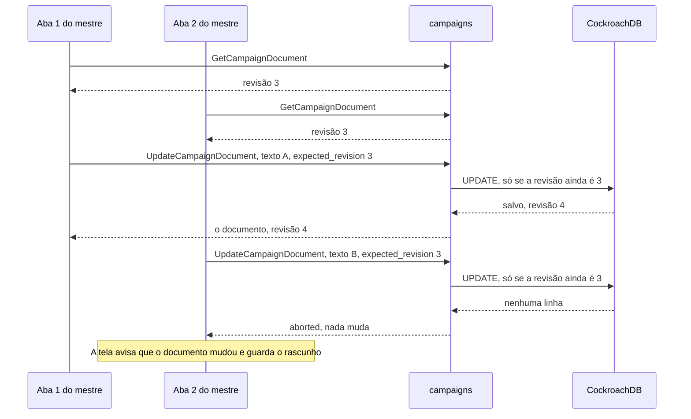

## Módulo rules: regras como dados

O `rules` calcula a ficha: recebe as escolhas do jogador (o `Build`) e devolve os números da ficha (o `Derived`), a partir do conteúdo do SRD 5.1 embutido no binário (ADR-0008). Não usa banco, rede, relógio nem aleatoriedade: a mesma ficha e o mesmo conteúdo dão sempre o mesmo resultado. O código fica em `backend/internal/rules`.

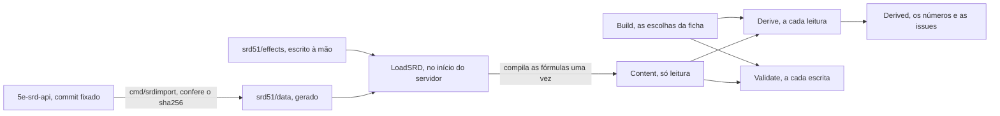

| Função | Quando roda | O que faz |
| --- | --- | --- |
| `LoadSRD()` | Uma vez, no início | Lê o snapshot e os efeitos, confere o esquema e compila toda fórmula. Erro aqui é bug no conteúdo embutido, e o servidor não sobe. |
| `Validate(build, content)` | Em toda escrita de ficha | Recusa o que não faz sentido nenhum: atributo fora de 1 a 30, nível total acima de 20, chave que não existe, sub-raça de outra raça, listas grandes demais. Devolve o campo, com os nomes do proto, sem repetir o valor. |
| `Derive(build, content)` | Em toda leitura de ficha | Calcula a ficha. Nunca falha: uma chave desconhecida, uma escolha fora da regra ou uma fórmula que quebra vira uma `Issue`, e o resto é calculado ("o app é um assistente, não um juiz"). |
| `Content.Catalog()`, `NamePT()`, `Summary()` | Nas telas de edição e nas listas | O que o editor oferece, com nomes em português; o nome de uma chave; "Mago 3" para uma linha de lista. |
| `Content.NextLevelXP(nível)`, `LevelForXP(xp)`, `XPForChallenge(nd)`, `SplitXP(total, n)` | No XP e na ficha | As contas de experiência (RN-09, RN-12): o XP do próximo nível (falso no 20), o nível de um XP, o XP de um nível de desafio ("1/4", "5"...) e a parte de cada um numa divisão, arredondada para baixo. Tabelas em `effects/advancement.json`, conferidas ao carregar (20 níveis crescentes; os 34 níveis de desafio em ordem). `Derived.NextLevelXP` e `Content.Catalog().ChallengeRatings` (que o `ListContent` devolve para o seletor de ND do NPC) saem delas. |
| `SceneOptions(derived, ações)` | Na cena de RP (MR-015) | Para cada teste que o mestre pôs na cena (`skill:investigation`, `ability:str`, `save:wis`, com nome e CD opcionais), o bônus do personagem, o nome em português ("Teste de Força", "Salvaguarda de Sabedoria") e a passiva de Percepção, Investigação e Intuição. Os tipos são fechados: nada de combate entra numa cena, e uma chave desconhecida devolve um `*SceneError`, nunca um pânico. |

**O que o `Derive` calcula**, para as 12 classes e as 9 raças do SRD, do nível 1 ao 20:

- atributos com os bônus de raça, sub-raça e manuais, e os modificadores;
- bônus de proficiência, os 6 testes de resistência (da primeira classe), as 18 perícias (nenhuma, metade, proficiente ou especialização), as 3 passivas e a iniciativa;
- CA com armadura, escudo e defesas sem armadura, com a descrição de como chegou nela; PV máximos (fixo ou rolado) e dados de vida; deslocamento e sentidos;
- conjuração por classe (CD, ataque, truques, magias conhecidas ou preparadas), espaços de magia (com a tabela de multiclasse) e a magia de pacto do bruxo;
- ataques com as armas da ficha e com os truques de dano;
- features e traços até o nível do personagem, com o texto do SRD em inglês, as dicas (`hints`) e as `issues`.

- recursos com usos (`Resources`: Retomar o Fôlego, Ki, Fúria, com o máximo no nível e quando voltam) e ações (`Actions`, as que uma feature dá, com a ação que gastam e o recurso que consomem; `StandardActions`, as dez de todo mundo);
- o dano de cada ataque também como números (`DamageDice`, `VersatileDice`: quantidade, faces e bônus), além do texto "1d8+3".

**O que não calcula (ainda):** magias ativas como Armadura Arcana e Escudo, PV atuais, espaços gastos e recursos em uso (são da sessão de jogo, Etapa 6; o `combat`, abaixo, só faz as contas sobre o que a sessão guarda). Os efeitos escritos à mão cobrem os níveis 1 a 5; acima disso, uma feature sem efeito aparece só como texto, e o mestre resolve.

### Efeitos e versões

O SRD descreve as features em prosa. O que o motor precisa saber fica em `effects/*.json`, escrito à mão, num conjunto fechado de tipos:

| Tipo | Exemplo |
| --- | --- |
| `modifier` | Defesa sem Armadura: `ac.base`, o maior entre as opções, `10 + mod("dex") + mod("con")`, só com `armor() == "none"` |
| `proficiency` | Pau para Toda Obra: metade da proficiência em toda perícia e na iniciativa |
| `roll_mode` | Esperteza Gnômica: vantagem em resistências de INT, SAB e CAR contra magia (vira dica) |
| `sense` | Visão no escuro, 18 m (60 ft) |
| `spellcasting` | Mago: INT, prepara do grimório, `max(1, mod("int") + classLevel("wizard"))` preparadas |
| `resource`, `grant_action` | Fúria, Retomar o Fôlego: viram `Derived.Resources` e `Derived.Actions`, que o `combat` lê (ver [Combate e detalhes das magias](#combate-e-detalhes-das-magias)) |
| `extra_attack` | Ataque Extra: quantos ataques a Ação de Atacar faz (`Derived.AttacksPerAction`) |
| `wild_shape` | Forma Selvagem do druida: o ND máximo e se exclui voo e natação (`max_cr`, `no_fly`, `no_swim`), nos três níveis (2, 4 e 8); ver [Criaturas, convocações e Forma Selvagem](#criaturas-convocações-e-forma-selvagem) |
| `choice`, `note`, `handler` | Escolhas do jogador, o que só aparece como texto, e uma função Go registrada (só o SRD: o conteúdo da mesa nunca usa `handler`) |

Um efeito com `tags` (como `against:magic`) nunca é aplicado sozinho: vira uma dica na ficha, e o mestre decide. A versão do conteúdo, `srd51@<commit>+fx.<n>` (com `+mesa.<revisão>` quando a campanha tem conteúdo próprio, ver [O conteúdo da mesa](#o-conteúdo-da-mesa-contentwith-mr-025-rn-23-adr-0018-fatia-101b)), aparece na ficha. Mudar um arquivo de `effects/` exige uma revisão nova; um teste confere. Um snapshot novo ou uma revisão nova pode mudar números de uma ficha travada, e o `content_version` mostra com qual conteúdo eles foram calculados.

### Itens mágicos

Os 362 itens mágicos do SRD 5.1 (MR-044, Etapa 10) entram no `rules` como dados, sem efeitos: o `cmd/srdimport` lê `5e-SRD-Magic-Items.json` (o mesmo commit, o sha256 no `inputHashes`) e escreve `srd51/data/magic-items.json` (`srd51.MagicItem`: chave `item:<índice>`, nome do SRD, categoria, raridade, sintonização e de quem, variantes e o texto em inglês). O carregamento confere o formato e os nomes em português são `item:<índice>` em `effects/names_pt.json`, um por item e por variante. Os valores em PO (tabela do SRD 5.2.1) não ficam aqui: são do gerador de tesouro (MR-044, fatia 10.10b; ver [O gerador de tesouro](#o-gerador-de-tesouro-mr-044-etapa-10-fatia-1010b)).

**Famílias e variantes.** O SRD lista "Armadura, +1, +2 ou +3" uma vez, como família, e de novo como três variantes. Cada um é um item de verdade, com a própria chave: a família guarda `Variants` (as chaves, na ordem do SRD) e cada variante guarda `VariantOf` e a raridade própria (Armadura +1 rara, +2 muito rara, +3 lendária; Arma e Munição +1 incomum, +2 rara, +3 muito rara). São 21 famílias. Onze têm a raridade `varies`, porque as variantes diferem: munição, armadura e arma +1/+2/+3, Cinto e Poção da força de gigante, Estatueta de poder maravilhoso, Trompa do Valhala, Pedra de Ioun, Poção de cura, Pergaminho de magia e Varinha do mago de guerra. As outras dez (Bolsa de truques, Tapete voador, Poção de resistência...) têm raridade própria, e as variantes dizem a delas. A Bola de cristal é o caso especial: o SRD a chama de "muito rara ou lendária" e diz que a comum é "um item muito raro", enquanto as três variantes são lendárias. Ela é uma família que também é um item (`Standalone`, uma lista fixa no importador): sorteia-se como Bola de cristal comum entre os muito raros, e as variantes entre os lendários.

**Sintonização.** `Attunement` vale quando o cabeçalho do SRD diz "(requires attunement)", e `AttunementBy` guarda a restrição em inglês ("by a paladin"), com o rótulo em português em `AttunementByPT` (`attunement:<restrição em minúsculas, com hífens>` em `names_pt.json`; o carregamento recusa uma restrição sem rótulo e um rótulo sem restrição). Uma sintonização que vale só para uma propriedade fica no texto: o Martelo dos Raios não pede sintonização como item, só o Giant's Bane dele.

**O que se sorteia.** Uma lista plana pesaria demais as famílias (o Anel de Resistência são 10 das 117 entradas raras). Por isso `MagicItemUnits(raridade)` devolve **unidades**: cada item avulso (a Bola de cristal comum inclusa) e **uma unidade por (família, raridade)**, com as variantes daquela raridade em `Options`. Quem sorteia escolhe uma unidade e, dentro dela, uma opção: o Anel de Resistência é uma unidade rara com 10 opções, e a Pedra de Ioun é uma unidade em cada raridade em que aparece (4 opções entre as raras, 7 entre as muito raras, 3 entre as lendárias). São 266 unidades, das 362 entradas; uma família nunca é unidade numa raridade que as variantes dela não têm, a não ser a Bola de cristal.

| Função (`rules.Content`) | O que faz |
| --- | --- |
| `MagicItems()` | Todas as 362 entradas (famílias e variantes), ordenadas por nome em português, como `MagicItemEntry`. Cópias. |
| `MagicItem(chave)` | Uma entrada com o texto do SRD em inglês. |
| `MagicItemUnits(raridade)` | As unidades que um tesouro pode conter naquela raridade (acima), ordenadas pelo nome em português da chave. Cópias. |
| `MagicRarities()` | As seis raridades, da mais comum à artefato. |

**Consumíveis.** `Consumable` vem de `effects/consumables.json`, escrito à mão: as categorias poção e pergaminho, e os itens de uso único (Munição +1/+2/+3 e a família, Flecha matadora, Conta de força, Vela de invocação, os três pós, a Gema elemental, a Pena mágica, os manuais e tomos que perdem a magia depois de lidos, o Manual de golens, os Pigmentos maravilhosos, o Unguento restaurador, a Cola soberana e o Solvente universal). O carregamento recusa uma categoria ou um item que não existe, um repetido e um que a categoria já cobre. A tabela de valores do SRD 5.2.1 divide por dois o consumível, menos o Pergaminho de magia, que `SpellScroll` marca (ver [O gerador de tesouro](#o-gerador-de-tesouro-mr-044-etapa-10-fatia-1010b)).

### Criaturas, convocações e Forma Selvagem

As 334 criaturas do SRD 5.1 (MR-037, Etapa 9) entram no `rules` como o resto do conteúdo: o `cmd/srdimport` lê `5e-SRD-Monsters.json` (o mesmo commit, o sha256 no `inputHashes`) e escreve `srd51/data/monsters.json` (`srd51.Monster`: tamanho, tipo, CA e o que a dá, PV e dados, deslocamentos em pés, os seis atributos, bônus de resistência e de perícia, vulnerabilidades, resistências e imunidades, imunidades a condições, sentidos, ND e XP, traços, ações com o bônus de ataque, as partes do dano, a CD de resistência e as rotinas do Ataque Múltiplo, reações e ações lendárias). Os nomes em português são `monster:<índice>` em `effects/names_pt.json`; o texto das fichas fica em inglês, como o das magias. Duas leituras do importador merecem aviso: quando o SRD dá uma escolha de dano (a espada longa com uma ou duas mãos), fica a primeira opção e o texto tem o resto; e a resistência que o 5e-database deixa só no texto ("Força CD 11 ou cai Derrubado") é lida do texto da ação.

| Função (`rules.Content`) | O que faz |
| --- | --- |
| `ListCreatures(filtro)`, `CreatureByKey(chave)` | A lista (nome em português ou inglês sem acento, tipo, tamanho, ND mínimo e máximo, sem voo, sem natação; ordenada por nome em português; recusa um ND que não é do SRD, um mínimo acima do máximo e um tamanho que não existe) e a ficha com os rótulos em português. Alimentam o `ContentService.ListCreatures` e o `GetCreature`. |
| `MonsterDerived(chave)` | A ficha da criatura como `Derived`, que o combate já lê: atributos e modificadores, resistências e perícias (os bônus da ficha, ou o modificador), CA, PV, o deslocamento de andar em `SpeedWalkFt` e os outros (`SpeedFlyFt`, `SpeedSwimFt`, `SpeedClimbFt`, `SpeedBurrowFt`, `Hover`), sentidos, Percepção passiva, os ataques (bônus e a **primeira** parte do dano; o texto inteiro vai em `Attack.Notes` para o mestre), o Ataque Múltiplo como `AttacksPerAction` (a maior rotina) e as ações com resistência em `SaveActions`, com a CD. Sem conjuração. |
| `SummonOptions(magia, círculo, build)`, `CheckSummon(...)` | O que uma magia de convocação deixa escolher com aquele espaço, e a conferência de uma escolha (`ErrSummonCreature`, `ErrSummonCount`, `ErrSummonOption`, `ErrSummonCircle`). O tempo de conjuração, o ritual e a concentração vêm dos dados da magia. |
| `WildShapeLimitFor(build)`, `WildShapeForms(build)`, `WildShapeAllows(build, fera)` | As feras que o druida pode assumir agora: nível 2, ND até 1/4, sem voo nem natação (31 feras); nível 4, até 1/2, sem voo (48); nível 8, até 1 (70). |
| `WildShapeDerived(ficha, fera)` | A ficha do druida na forma de fera, pelo SRD: CA, PV (uma reserva à parte: `HitPointsMax` é o da fera), deslocamentos, Força, Destreza e Constituição, ataques e sentidos da fera; Inteligência, Sabedoria e Carisma, bônus de proficiência, features e recursos do personagem. As proficiências em perícias e resistências ficam e ganham as da fera, e onde as duas têm a mesma vence o bônus maior. A visão no escuro do personagem só vale se a fera também a tem (vale o maior alcance). Sem magias: `Spellcasting`, `Spells` e `PactMagic` saem vazios. |

**O efeito `summon`** (quinto tipo fechado de `effects/spells.json`, junto de `hp_pool`, `hp_threshold`, `zero_hp_target` e `flat_heal`; o carregamento recusa criatura, campo, ND ou modo de ataque que não existe). Quatro entradas: `spell:find-familiar` (as 15 formas do SRD, uma criatura, ritual de 1 hora, **não ataca**; o Pacto da Corrente, `feature:pact-of-the-chain`, soma Diabrete, Pseudodragão, Quasit e Sprite, e faz **todo** familiar do bruxo, de qualquer forma, atacar só com a reação), `spell:animate-dead` (Esqueleto ou Zumbi: 1 criatura mais 2 por círculo acima do 3º), `spell:conjure-animals` (só feras; 1 de ND 2, 2 de ND 1, 4 de ND 1/2 ou 8 de ND 1/4, vezes 2 no 5º círculo, 3 no 7º e 4 no 9º; concentração) e nenhuma para Encontrar Montaria, que fica para depois do MVP (pergunta 74). Quem gasta o espaço e cria as criaturas é o `play` (fatias 9.9 e 9.10); o `rules` só diz o que pode.

**Na API.** `ContentService.ListCreatures` (filtros, ordem por nome em português, páginas de 1 a 400 (o bestiário pede 400 e recebe as 334), 50 por padrão, `page_token` opaco) e `GetCreature` (a ficha para a tela) são `IDEMPOTENT` e só aceitam POST. As criaturas são regra pública, igual para toda campanha, mas só um **membro ativo** pergunta: o membro pendente (RN-15) não precisa de criatura para montar o personagem e recebe `not_found`. O `DerivedSheet` ganhou os deslocamentos (`speed_fly_ft`, `speed_swim_ft`, `speed_climb_ft`, `speed_burrow_ft`, `hover`), `save_actions` e, no `Attack`, `notes`; o `Sense` ganhou `sense` ("darkvision"...), porque o `key` de um sentido de criatura é a criatura. A CA de uma criatura vem da armadura que ela usa (o azer tem 17, com escudo), e a nota diz o que veste e os outros valores ("15 com Armadura Arcana"). Testes: `TestMonsterDerived`, `TestListCreatures`, `TestSummonOptions`, `TestCheckSummon`, `TestWildShapeForms`, `TestWildShapeDerived` (o pacote `rules`), `TestListAndGetCreatures` e a linha dos dois métodos em `TestAuthorizationMatrix` (o `characters`).

**O bestiário e o "Criar NPC" (MR-042, fatia 10.9a).** O bestiário é a mesma lista: `ListCreatures` ganhou `size` (o enum `CreatureSize` que já existia) e `min_cr`, e cada `CreatureSummary` leva a CA e os PV médios (`armor_class`, `hit_points`), então a linha "Lobo · Wolf · SRD · CA 13 · PV 11" sai de uma chamada só; o `page_token` vale só para os mesmos filtros, tamanho e ND incluídos. Não há uma segunda lista, e os chamadores da Etapa 9 (Forma Selvagem, convocações) mandam os mesmos campos de antes e recebem as mesmas linhas. Os rótulos de tipo e de tamanho em português já saem do `rules` (`type_pt`, `size_pt`). O acesso não mudou: membro ativo lê, o pendente recebe `not_found`; o jogador pode ver o bestiário (é regra do SRD), mas a leitura de um combate nunca traz os números de um monstro (RN-20, RN-29, fatia 10.9b). O **"Criar NPC"** é o `CharacterService.CreateNpcFromCreature` (`characters/npcfromcreature.go`): só o mestre, `MINION` ("Minion", o padrão que o app oferece) ou `STORY` ("NPC de história"; a ficha completa do `ENEMY` e do `BOSS` pede classe e raça, que uma criatura não tem). O servidor monta a `BasicSheet` a partir de `Content.CreatureByKey` e `MonsterDerived`, e a passa pelas mesmas conferências de uma ficha básica digitada (`cleanBasicSheet`): CA, PV médios, deslocamento (o de andar, ou o maior que ela tem), iniciativa (o modificador de Destreza), tamanho, ND, XP, os atributos (`ability_scores`) e até três ataques, de arma ou de magia, com o bônus, o alcance e o primeiro dano (a `BasicAttack` guarda um dano só: as outras partes, como o fogo a mais da mordida do dragão, vão na descrição da ficha, "Mordida: +2d6 fogo."; a resistência e os outros efeitos ficam na ficha do SRD, e um ataque sem dano ou com um dado que a ficha não tem, como d20, fica de fora). Os nomes dos ataques saem em português (`attack:<nome>`, conteúdo fx.13, para as 334 criaturas), mais `monster_key`, o elo com a criatura. Os dois campos novos são só do servidor: o `checkSheet` os zera no que chega, e o `UpdateCharacter` mantém os salvos (`keepCreatureLink`), então o elo sobrevive às edições do mestre. É uma cópia: os números não seguem a criatura depois. A idempotência é `characters.create_key` com um índice único parcial (`INSERT ... ON CONFLICT DO NOTHING`, e a repetição lê o NPC que já existe e confere que o pedido é o mesmo, senão `invalid_argument`); o NPC, como todo NPC, é do mestre e o jogador não o lista nem o lê (RN-04), e o token dele no mapa nasce escondido (RN-10). Tudo na mesma transação, só com `WithTx` (PR #121). **No navegador (fatia 10.17a)**, o bestiário são duas rotas preguiçosas, `campanhas/:id/bestiario` (a lista) e `campanhas/:id/bestiario/:criatura` (a ficha, com "Criar NPC"), e o painel "Bestiário" da página da campanha. Só o mestre as vê: como o servidor deixa qualquer membro ler o SRD, a página pergunta o papel à campanha (`BestiaryAccessCheck`) e diz ao jogador que é do mestre. A lista pede as 334 criaturas numa chamada (`page_size` 400) e filtra no servidor (nome, tipo, tamanho, `min_cr`/`max_cr`); a busca fica nos parâmetros do endereço. A ficha reaproveita o `StatBlock` da Etapa 9 (com `full`). A chave de idempotência do "Criar NPC" nasce uma vez por diálogo aberto; a CA, os PV, o deslocamento e os atributos que o diálogo mostra vêm da ficha da criatura, e os ataques que vão junto vêm do servidor (`Creature.npc_attack_names`, que o `GetCreature` preenche com a própria função que o `CreateNpcFromCreature` usa para montar a ficha, então os dois nunca diferem; `TestGetCreatureNpcAttackNames`). O `CharacterService` passou a mandar o detalhe `InvalidField` (o nome do campo) em todo `invalid_argument` de campo, para o app dizer qual campo sem ler a mensagem (`TestCreateNpcFromCreatureNamesTheField`).

**Monstros no combate, "Pôr no combate" (MR-042, RN-29, fatia 10.9b).** `CombatService.AddMonsters` (`play/combat_monsters.go`) põe de 1 a 10 monstros de uma criatura do SRD num combate em `SETUP` ou `ACTIVE`, como o `AddCombatants`, e só o mestre chama. **Os monstros são cópias, no combate, de um NPC só por campanha e criatura** (RN-29, "um por criatura"): o `characters` o faz na primeira vez e o reaproveita (`CombatRoster.MonsterNpc`, `characters/combatmonsters.go`). É um minion com a ficha básica que o "Criar NPC" faz (`npcSheetFromCreature`, a mesma função), os PV médios e `BasicSheet.combat_only` ligado (campo só do servidor: o `checkSheet` o zera no que chega e o `keepCreatureLink` o mantém). A chave de criação é fixa, um UUID v5 da campanha e da criatura, e o `INSERT ... ON CONFLICT (campaign_id, create_key) DO NOTHING` seguido de uma leitura na mesma transação faz um NPC só, mesmo com dois adds ao mesmo tempo (o `GetOpenGameSessionForUpdate` já os põe em fila). O NPC nunca aparece na lista do mestre (`ListCharacters` o filtra na consulta, por `sheet->'basic'->>'combat_only'`; sem coluna nova, sem migration), e o `participants()` (`StartEncounter`, `AddCombatants`) e o palco o recusam com `invalid_argument`: a única entrada é o `AddMonsters`. Nunca é apagado: os combatentes, o XP e o resumo apontam para ele, e `combatants.character_id` apaga em cascata. O nome e os PV de cada monstro ficam na linha do combatente: `planned` ganhou o nome-base (`copyLabels` conta a partir do que já está no combate, e um monstro sozinho leva o nome puro) e os PV de cada cópia, que o `addParticipants` usa no lugar do máximo da ficha. Daí em diante o combate trata o monstro como qualquer NPC, sem código novo: a palavra do estado e o escondido (RN-20, RN-10), os ataques da ficha por `RollAttack` (então o crítico segue a regra da mesa, RN-24) e o XP por inimigos, que soma o `xp_value` copiado da ficha ao combatente (o XP do ND da criatura, RN-09), com a divisão e a sobra de sempre (`TestMR042_ThreeBanditsGiveTheirXPToTheParty`: 75 XP, 18 para cada um de quatro e 3 de sobra). O nome-base é o do mestre (1 a 30 caracteres) ou o da criatura em português; **o bestiário é o SRD público, então um jogador que conhece a criatura acha os números dela**, e o app só diz ao jogador o nome que o mestre deu (quem quer segredo dá outro nome-base, RN-20). Os PV são a média da criatura (o padrão, pergunta 81) ou rolados: o servidor rola os dados de vida (`2d8+2`, lidos de `Creature.HitPointsRoll`) uma vez por monstro, no mínimo 1, **antes** dos d20 da iniciativa (que rola um por monstro, com o modificador de Destreza, RN-19). Entram escondidos, a não ser que o pedido diga `hidden = false`, e **sem quadrado** no mapa: o mestre os põe, como todo NPC sem token (no teatro da mente ninguém tem quadrado, RN-25). Num combate que já corre, o turno não muda. **A chave de idempotência cobre o pedido inteiro:** o evento `combatants_added` guarda os parâmetros (a criatura, a quantidade, um hash do nome, os PV e o escondido: nunca um nome) e os ids e PV de cada monstro; uma repetição igual devolve os mesmos ids sem rolar nem criar nada, e uma com outros parâmetros, ou com uma chave que um `AddCombatants` usou, é `invalid_argument`. **O que só o mestre lê:** o `Combatant` leva `bestiary_creature_key` e `challenge_rating` (a ficha de criatura e o "ND 1/8"; vêm do NPC e valem também para um NPC do "Criar NPC"), e o registro tem a linha `COMBAT_LOG_KIND_MONSTERS_ADDED` ("Bandido 1: 9 PV (2d8+2: 3, 4)"), só do mestre e **também de antes do combate começar** (rodada 0, a única linha que o registro guarda da preparação). Nada disso chega ao jogador, nem pelo `GetEncounter`, nem pelo registro, nem pelo stream (o `encounter_changed` é um aviso sem conteúdo). **O ataque múltiplo** da criatura (`Content.MonsterDerived(...).AttacksPerAction`, o mesmo número do turno das criaturas do personagem) vale para qualquer ficha básica ligada a uma criatura (`basicDerived`), então as opções do turno do monstro contam os ataques da Ação de Atacar (`attacks_per_action`, `attacks_left`) e os NPCs que o "Criar NPC" já fez passam a seguir o ataque múltiplo da criatura. O mestre joga os monstros, então nenhum ataque a mais é recusado a ele (o mestre tem a última palavra, como com todo NPC): os ataques são quaisquer N dos que a ficha guarda (até três). O número vem do SRD 5.1 e não do snapshot, que erra alguns (o Veterano fazia 4, o Montículo Movediço 3, o Urso Pardo 1): o `effects/corrections.json` os corrige (`creature_corrections`, tipo fechado: criatura e campo conhecidos, `attacks_per_action`, conteúdo fx.15), e o `TestMultiattackCountsFollowTheSRDText` lê o texto do Multiattack das 148 criaturas e confere o número que o motor usa, com uma lista explícita das que o texto não deixa ler (o Chuul, o Grick, a Hidra, a Medusa e o Fungo Violeta, cada uma com o motivo). A Forma Selvagem também usa esse número: o Urso Pardo agora faz 2 ataques.

### As criaturas do personagem no jogo (MR-037, fatia 9.9)

**Uma criatura é do personagem, e no combate é um combatente do tipo `creature`.** As regras (o que uma magia deixa convocar, os números de uma criatura) são do `rules`, descritas acima; esta seção é o que o servidor guarda e faz com elas. O módulo `characters` guarda a criatura (`character_creatures`, `00102`); o módulo `play` a põe no combate (`combatants.kind = 'creature'`, `00103`); os dois se encontram em duas interfaces pequenas ligadas no `cmd/api`: `play.CombatRoster` (o que o combate pede ao `characters`) e `characters.CreatureHost` (o que o `characters` pede ao `play`, ligada por `SetCreatureHost`).

| Quem | O quê |
| --- | --- |
| `CharacterService` | `ListCharacterCreatures` (`IDEMPOTENT`; o mestre e o jogador dono; para qualquer outro jogador é `not_found`, como a ficha, e o PV nunca chega a ele), `GiveCreature` (só o mestre, qualquer criatura do SRD, até 40 por personagem), `RenameCreature` (o combatente da criatura num combate aberto ganha o nome novo) e `DismissCreature` (o dono ou o mestre; dispensar uma já dispensada não muda nada) e `AdjustCreatureHitPoints` (só o mestre, RN-02, só fora do combate: dentro dele o PV é do combatente e vale `AdjustCombatantHitPoints`; a 0 PV a criatura é dispensada). A ficha da criatura (`ContentService.GetCreature`) é a de sempre. |
| `PlayService.CastSummon` | Conjurar fora do combate o que não cabe nele: Encontrar Familiar (1 hora, **ritual: sem espaço de magia**), Animar os Mortos (1 minuto, gasta o espaço) e Conjurar Animais (1 ação). Confere que o personagem tem a magia (a do grimório vale como ritual para o mago; o Pacto da Corrente dá o ritual de Encontrar Familiar sem a magia), o espaço (os `vitals`, como todo gasto) e a escolha (`rules.CheckSummon`), cria as criaturas e escreve o evento `creature_summoned` (IDs e chaves, nunca o nome que o jogador digitou). Um familiar novo dispensa o antigo ("um de cada vez", motivo `replaced`), e uma convocação que pede concentração (Conjurar Animais) dispensa antes as criaturas da concentração anterior, dentro ou fora do combate (motivo `concentration`). Recusado enquanto o personagem está num combate que não acabou (`SUMMON_IN_COMBAT`: lá é o `CastSpell`). |
| `CombatService.CastSpell` | Conjurar Animais no combate: o pedido leva `summon` (a opção e as chaves das criaturas, e os nomes) e a rolagem da iniciativa do grupo no mesmo `roll_in_app` / `d20_face` (a magia não rola mais nada), que o jogador faz como todo dado (RN-18). As criaturas nascem em quadrados livres ao lado de quem conjurou, entram na ordem com **uma iniciativa só** e jogam juntas se o total empata com outro combatente (o turno conjunto de sempre). Uma magia mais longa que uma ação é recusada com `CASTING_TIME_TOO_LONG` ("Leva 1 hora: conjure fora do combate"); uma escolha que as regras recusam, com `SUMMON_CHOICE_INVALID`; sem a rolagem, `SUMMON_NEEDS_INITIATIVE`; sem lugar (um combate tem 40 combatentes, contando as criaturas da concentração que sai), `TOO_MANY_COMBATANTS`, antes de gastar o espaço. O bônus do grupo é o da primeira criatura da conjuração, qualquer que seja o membro por quem o jogador rola. |
| `CombatService.EndConcentration` | Encerra a concentração (o próprio jogador ou o mestre) e **dispensa as criaturas daquela conjuração**, com um `creature_dismissed` para cada uma. `SetCombatantConditions` com `end_concentration` e conjurar outra magia de concentração fazem o mesmo (RN-22). |
| Dica do stream `creatures_changed` (20) | Para o mestre e o dono, fora do combate; no combate, `encounter_changed` já cobre. Não leva conteúdo. |

**A tela da ficha (fatia 9.16).** O navegador lê a lista com `ListCharacterCreatures`, as fichas com `ContentService.GetCreature` (guardadas na memória, são regras públicas), o catálogo do mestre com `ListCreatures` e **o que a ficha pode convocar com `CharacterService.GetSummonOptions`**, e conjura com `CastSummon`; a dica `creatures_changed` faz o painel e a lista do mestre lerem de novo (o mesmo cliente do stream do `xp_changed`, só enquanto há sessão aberta, e também quando o stream volta). O navegador não guarda regra nenhuma de convocação.

**A tela do combate (fatia 9.17).** O navegador junta o que o jogador joga (`Combatant.controlled_by_me`: o personagem e as criaturas) em abas (`core/combat/mine.ts`: o personagem primeiro, depois cada conjuração, pelo `summon_group_id`, ou uma criatura sozinha) e lê as opções de cada criatura com `GetTurnOptions` (`CreatureOptionsState`); atacar e mover usam o mesmo fluxo e a mesma página Mover do personagem (`moverId`). "Encerrar a parte dos Lobos" é um `EndTurn` por membro que ainda age. Conjurar Animais em combate é o `CastSpell` com `summon`, pela folha de conjurar da ficha, com o d20 do grupo em `roll_in_app` ou `d20_face`; que a magia é de convocação vem do `GetSummonOptions`, sem tabela no navegador. A Forma Selvagem usa `ListWildShapeForms`, `AssumeWildShape` e `LeaveWildShape` (`CreaturesClient`); as reservas de PV vêm do `Combatant.wild_shape_hit_points_*` (só o dono e o mestre) e os usos, de `CharacterVitals.resources`. O servidor não manda a CA de uma criatura nem da fera (RN-20): a tela lê a do livro (`GetCreature`). O dano que passa da fera para o druida vem do servidor, na linha do registro do combate (`COMBAT_LOG_KIND_WILD_SHAPE` = 21, `CombatLogEntry.wild_shape` = 41, `CombatLogWildShape`: a fera, se começou ou terminou, o motivo `WildShapeEndReason` e `carried_damage`): o número só vai para o jogador do druida e para o mestre (RN-20), e os outros leem "voltou à forma normal" sem número. O aviso do jogador (`core/combat/combat-notices.ts`, `FormNotices`) lê essa linha, diz o motivo (a fera caiu a 0 PV, o mestre ajustou, o druida caiu a 0 PV, ficou inconsciente) e o número, e o que o registro já tinha quando o combate foi lido não é novidade (uma reconexão não repete o aviso); o cartão do mestre não mostra a divisão. **A segunda rodada da 9.17 (05/10/2026).** O servidor ganhou três coisas pequenas, sem migration: (1) a linha do registro da Forma Selvagem (acima; os eventos `wild_shape_started` e `wild_shape_ended` agora levam o combate, a rodada e o ator, também o fim por 0 PV, o do mestre e o do druida, e o fim do mestre não é uma "última ação" que o desfazer pule); (2) os nomes em português dos ataques das criaturas (`attack:<slug>` em `names_pt.json`, `Attack.name_pt` e `CreatureAction.name_pt` = 9, revisão 11 do conteúdo; o navegador não traduz nada); (3) nada mais: a pergunta "Perdeu a concentração" do mestre não depende mais de uma magia fixa, ela é oferecida só a quem tem criaturas de uma conjuração (`summon_group_id` com o dono) e o desfazer do servidor as traz de volta. No navegador, a lógica dos avisos saiu da tela para `core/combat/combat-notices.ts` (`FormNotices`, `ConcentrationWatch`, `wildActionLine`) e `core/combat/mine.ts` (`actingTab`, `validTab`, `membersToEnd`), puros e testados; os avisos valem para um combate só, e o que o registro já tinha ao ler o combate não é novidade.

**`GetSummonOptions` (leitura, `IDEMPOTENT`).** Responde, para um personagem de jogador, o que a folha de conjurar desenha: para cada magia de convocar que ele pode conjurar (a magia na ficha, pronta ou no grimório; o Pacto da Corrente dá o ritual de Encontrar Familiar sem a magia), a chave, o nome em português, o círculo, o tempo ("1 hora"), se é ritual e se pede concentração, `can_ritual` e `can_cast_with_slot`, e, para cada círculo que ele pode usar (o da própria magia, se for ritual, e o de cada espaço que ele tem dali para cima), as opções que `rules.SummonOptions` dá (a contagem já com o círculo, e as formas ou o tipo e o ND máximo); mais os espaços (`SummonSlot`, os de pacto com `pact`, com os livres) e, por magia, o que uma conjuração mandaria embora (o familiar vivo; as criaturas da concentração de agora, que uma nova encerra, RN-22). É o mesmo código que o `CheckSummon` usa (`summonStanding`), então a leitura e a conjuração concordam; o `CastSummon` continua conferindo toda escolha. Acesso como o de `ListCharacterCreatures`: o dono e o mestre; outro jogador recebe `not_found`; nenhum PV vai na resposta (RN-20). Testes: `TestMR037_SummonOptions`, `TestRN20_SummonOptionsCarryNoHitPoints` e a linha da matriz de autorização.

**O que o combate faz com elas.**

- **Quem entra.** As criaturas vivas de um personagem de jogador entram quando o combate é montado (`StartEncounter`), uma linha para cada, sem iniciativa e sem quadrado enquanto o dono não tem token. O jogador dono (ou o mestre) rola a iniciativa com `SubmitInitiative`: **uma rolagem por conjuração** (as criaturas com o mesmo `summon_group_id` recebem o mesmo d20 e o mesmo total, e o bônus de quem rolou; Conjurar Animais é regra do SRD, e o mesmo vale, por decisão nossa, para Animar os Mortos); o familiar rola a própria. O mestre pode tirar uma do combate (`RemoveCombatant`), e ela continua na lista do dono. Quem sai do combate em preparação leva as criaturas junto. Os de Conjurar Animais, conjurados antes do combate, entram com o dono já concentrando na magia. Uma criatura dada pelo mestre **durante** um combate não entra nele.
- **De quem é a linha.** `combatants.character_id` é o **dono** (a coluna continua `NOT NULL` e a criatura some com o personagem, em cascata) e `user_id` o jogador do dono, então o `mayAct` de sempre funciona: o jogador age pela criatura, e só ele e o mestre. `Combatant.mine` continua verdadeiro **só para o personagem do próprio jogador** (a tela atual acha o "meu" combatante com ele); o campo novo `controlled_by_me` cobre também as criaturas, e `owner_character_id` diz de quem é. `character_id` fica vazio numa criatura, até para o mestre.
- **Vez e economia.** A criatura tem a vez e a economia dela, calculadas de `MonsterDerived`: ataques (cada ação com bônus de ataque, a primeira parte do dano), a Disparada e as ações padrão, **sem** "Conjurar uma magia". O que a magia deixou: o familiar não ataca (sem ataques nem a ação Atacar, nem para o mestre: `CREATURE_CANNOT_ATTACK`); o do Pacto da Corrente tem os ataques desabilitados como ação (`REACTION_ONLY`) e só ataca com `as_reaction`; as de Animar os Mortos e Conjurar Animais atacam como qualquer criatura. Ao entrar no combate a criatura copia, como o personagem, o lado (`party`), o tamanho e o deslocamento de voar da ficha dela (`size`, `speed_fly_ft`) e o salto (`combat.JumpLimits` da Força da criatura, `jump_long_dft` e `jump_high_dft`): o movimento da 9.6 usa o melhor entre andar e voar, quem voa ignora terreno difícil, e nadar e escalar nunca são a velocidade no mapa. O jogador dono a move na vez dela e o mestre sempre; outro jogador recebe `permission_denied`. O combatente dispensado (concentração que acabou) não ocupa quadrado nem dá cobertura, porque o movimento e a cobertura leem a lista sem os dispensados. Testes: `TestMR037_ACreatureMovesLikeAnyCombatant`, `TestMR037_ADismissedCreatureBlocksNoSquare`.
- **PV e derrota.** O PV fica no combatente, como o do NPC: o dano cai na hora, sem esperar o mestre (RN-02 é do PV de **personagem**), e a 0 PV a criatura fica derrotada (sem testes contra a morte) e **dispensada** da lista do dono. Não há código por ponto de PV: toda escrita de combate passa por `syncCreatures`, que, depois da mudança e antes do evento dela, dispensa a criatura derrotada e traz de volta a que um "Desfazer" ou uma cura levantou. No fim do combate, e quando ela sai dele, o PV volta para `character_creatures`.
- **Quem vê o quê (RN-20).** O jogador dono e o mestre recebem o PV da criatura como número (`hit_points_*`); **todos os outros recebem só a palavra do estado**, na ordem, no registro e no stream (nunca um `hit_points_*`, nem `hit_points_after` no registro). A iniciativa da criatura é pública, como a dos personagens; o dono, o tipo e o nome em português da criatura também (o grupo sabe de quem é). O grupo e o ataque permitido só vão ao dono e ao mestre.
- **Fora do combate.** O PV é do mestre (`AdjustCreatureHitPoints`); a criatura pode ter um token no mapa de exploração, que o mestre põe como qualquer token, e a Forma Selvagem e "ver pelos olhos do familiar" são da fatia 9.10, na seção seguinte.
- **O que o desfazer põe de volta.** O "Desfazer" do mestre devolve o PV da criatura (e a traz de volta se ela caíra), tira as criaturas de um `CastSpell` e devolve o espaço e a concentração; Quando a concentração acaba, os combatentes das criaturas não são apagados: ficam **dispensados** (`combatants.dismissed`, `00104`), fora da ordem, do mapa e dos turnos, mas com o mesmo id, PV, condições e linhas do registro; desfazer o fim da concentração tira a marca e eles voltam, os mesmos. Os eventos `creature_summoned` e `creature_dismissed` são escritos antes do evento da mudança e **não fecham a cadeia do desfazer** (`lastAction` os pula): desfeito o `CastSpell` ou o fim da concentração, a ação anterior ainda pode ser desfeita. No combate, a criatura derrotada não escreve evento próprio (o dano que a derrotou já é o registro dela, e um evento depois dele fecharia o desfazer da ação anterior); fora do combate, o `creature_dismissed` com `reason: defeated` é escrito.

**A auditoria dos testes de tipo do `play`.** Eram 42 conferências `== kindNPC` e `!= kindPlayer`; cada uma foi lida, e a coluna diz o que uma criatura faz ali. As que **mudaram** passaram a perguntar "guarda o PV no combatente?" (`holdsHP`: NPC ou criatura) ou "é do lado do grupo?" (`inParty`: personagem ou criatura).

| Onde | Antes | Criatura |
| --- | --- | --- |
| `landDamage`, `healCombatant` | só NPC leva o dano e a cura na hora | `holdsHP`: leva na hora, como o NPC |
| `AdjustCombatantHitPoints`, `readFxTarget`, `dropToZero` (Sono, Palavra de Poder), `pendingProto` (`target_defeated`) | só NPC | `holdsHP` |
| `UndoLastAction` (o dano, a cura, a magia e a correção de PV, 3 lugares) | só NPC volta o PV na combatente | `holdsHP`; e o `syncCreatures` refaz a lista do dono |
| `stateOf` | só NPC tem palavra de estado | `holdsHP`: Ileso / Ferido / Muito ferido / Derrotado |
| `turnFor`, `EndTurn` (de quem é a parte encerrada), a economia dividida do turno conjunto | só personagem de jogador é "do jogador" | `inParty`: o grupo com uma criatura é do jogador, não "só de NPCs" |
| `combatantToProto`: `character_id`, iniciativa | personagem de jogador (ou o mestre) | criatura: `owner_character_id` no lugar do `character_id`; iniciativa pública (`inParty`) |
| `armorClasses`, os retratos, os nomes do registro | a ficha vem do `character_id` | a ficha vem da criatura (`sheetKey`, `sheetOf`): nunca a CA do dono |
| `ResetDeathSavesOfCharacter`, `MarkDeathSaveRolledOnTurn` (SQL) | pelo `character_id` | `AND kind = 'player'`: o `character_id` de uma criatura é o do dono |
| `RollAttack`, `GetTurnOptions`, `TakeAction`, `CastSpell`, o alvo de um ataque e de uma resistência | a ficha do `character_id` | a ficha da criatura, e `mayAttack` aplica o que a magia deixou |

As que **não mudaram, de propósito**: `isDown` (uma criatura nunca "cai": é derrotada), `RollDeathSave` e `ConfirmDeath` (recusam: só personagem morre), `shieldFor` (a criatura não conjura Escudo), o gasto de espaço e de recurso (só personagem), `ApplyPendingDamage` (nunca há dano esperando numa criatura), `SetCombatantHidden` (uma criatura nunca é escondida), `npcOnlyGroups` (um grupo com criatura não é de NPCs), os retratos (só NPC), os destaques do combate (`tallyHighlights`: o dano de uma criatura não conta para o dono; e um golpe, crítico ou dano num alvo do grupo, uma criatura ou um personagem, é fogo amigo e não conta para ninguém: só vale o que acerta um NPC), o XP (só NPC derrotado dá XP: `kind = 'npc'` no SQL), `RemoveCombatant` (só o personagem de jogador não sai de um combate que corre) e `endEncounter` (só o personagem tem token para levar de volta). Testes: `TestMR037_TheKindAudit`, `TestMR037_ACreatureAtZeroLeavesAndTheHitPointsGoBack`, `TestRN20_CreatureHitPointsOnlyToOwnerAndMaster`.

**O que os ADRs devem dizer.** O ADR-0011 (quem pode o quê) ganha a linha das criaturas: o mestre e o jogador dono leem, renomeiam e dispensam; só o mestre dá e corrige o PV; para outro jogador a criatura é `not_found`. O ADR-0007 (eventos) ganha o payload de `creature_summoned` (`character_id`, `creature_ids`, `monster_keys`, `source`, `ritual`, e o `summon_roll` no combate) e de `creature_dismissed` (`character_id`, `creature_ids`, `reason`: `owner`, `master`, `defeated`, `concentration`), todos só de IDs e chaves.

### A Forma Selvagem, os olhos do familiar e os tokens das criaturas (MR-037 e MR-036, fatia 9.10)

**A forma do druida mora nos `vitals`; a conta é do `rules`.** A forma é parte dos `vitals` para a API (`CharacterVitals.wild_shape`) e tem a tabela `character_wild_shapes` (`00113`): uma linha por personagem na forma de fera, com a chave da fera (`monster:wolf`) e o PV atual dela, sempre 1 ou mais (a 0 a forma acaba e a linha some); mudar a forma sobe a `revision` dos `vitals`. É uma tabela à parte por causa da trava, não colunas dos `vitals`: `UseReaction`, por exemplo, gasta um espaço (escreve a linha dos `vitals`) e depois lê a ficha, por outra conexão, para a CA, e essa leitura agora junta a forma; com a forma na linha dos `vitals` a leitura esperaria a escrita da própria transação (foi o que travou o `TestShieldTurnsAHitIntoAMiss` por minutos, num primeiro desenho com colunas nos `vitals`). O máximo da fera nunca é guardado, vem da ficha dela (`MonsterDerived`). O PV do próprio druida (`hit_points_current`) fica **parado** e só leva o dano que sobra quando a fera cai. O `characters` é o único lugar que lê a forma de volta em números do personagem: `Service.derive` chama `rules.WildShapeDerived` (CA, ataques, deslocamentos, sentidos e Força, Destreza e Constituição da fera; sem magias) e é o que `fighter` (ficha de combate, opções do turno, CA), `combatCharacter` (velocidade, tamanho, voo e saltos que o combatente copia) e `PartyVision` (os sentidos da névoa) usam. Nada da conta da fera foi refeito fora do `rules`.

| Chamada | Quem pode | O que faz |
| --- | --- | --- |
| `CharacterService.ListWildShapeForms` | O mestre e o jogador dono (outro jogador: `not_found`) | As feras que a Forma Selvagem permite agora (`rules.WildShapeForms`: nível 2, ND até 1/4 sem voo nem natação; 4, até 1/2 sem voo; 8, até 1), por nome em português, com o limite que decidiu a lista. Vazia para quem não é druida |
| `PlayService.AssumeWildShape` | O jogador dono e o mestre | Num combate ou fora dele, com a sessão aberta. Gasta **um uso** de `wild_shape` (`NO_USES`) e, no combate, a **ação**, na vez do personagem (o mestre pode agir de novo com a ação gasta, como em `TakeAction`). Recusas com tipo: `WILD_SHAPE_BEAST_NOT_ALLOWED`, `ALREADY_IN_WILD_SHAPE`, `ACTION_USED`, `NOT_YOUR_TURN`. A ação da ficha (`feature:wild-shape...`) não passa mais pelo `TakeAction`, que a recusa com `invalid_argument`, porque ela precisa da fera. Escreve `wild_shape_started` |
| `PlayService.LeaveWildShape` | O jogador dono e o mestre | "Voltar à forma normal": **ação bônus** na vez do personagem (a do mestre não gasta nada). `NOT_IN_WILD_SHAPE` na forma própria. Escreve `wild_shape_ended` (`reason: left`) |
| `PlayService.AdjustCharacterVitals` | O mestre | Ganhou `wild_shape_hit_points_current` (1 até o máximo da fera; **0 acaba a forma**, e então `wild_shape_ended` com `reason: master` e os números do combatente voltam). Sem forma é `invalid_argument` |

- **Dano na fera, cura na fera, o que sobra.** O dano que o mestre aplica (`ApplyPendingDamage`) cai na reserva da fera, sem PV temporário (`damageBeast`); se a fera cai a 0, a forma acaba, o combatente volta aos números do personagem e **o que sobrou passa para o druida** pelo caminho de sempre (PV temporário primeiro, `changeVitals`, os testes contra a morte). A cura num druida na forma (`healCombatant`: uma magia, Retomar o Fôlego) cura a fera, até o máximo dela. `wild_shape_ended` com `reason: damage` e `carried_damage` é escrito **antes** do evento do dano e não fecha o desfazer (`lastAction` o pula, como aos eventos das criaturas).
- **No combate.** Ao assumir ou deixar a forma, o combatente troca `speed_ft`, `speed_fly_ft`, `size` e os saltos (`SetCombatantBody`, o mesmo que o combatente copia ao entrar), então o movimento da 9.6 usa o tamanho e a velocidade da fera; o combate que começa com um druida já na forma o põe com os números da fera. As opções do turno vêm de `fighter`: os ataques da fera (`monster:wolf#bite`), as ações padrão, **nenhuma magia**. `CastSpell` e `CastSummon` são recusados com `WILD_SHAPE_NO_SPELLS` antes de gastar qualquer coisa. O `Combatant` leva `wild_shape_beast_key` e o nome em português para **todos que o veem** (o grupo vê o lobo), e o PV da fera (`wild_shape_hit_points_*`) só para o mestre e o jogador dono (RN-20: o PV do personagem já era assim). **O druida volta à forma própria quando cai a 0 PV ou inconsciente (SRD)**: `changeVitals` acaba a forma sempre que o PV do próprio druida chega a 0 (o dano que sobrou, a correção do mestre, Palavra de Poder: Matar), e dar a condição Inconsciente (Sono, o mestre) também (`endFormIfAsleep`); cada fim escreve `wild_shape_ended` (`reason`: `zero_hp` ou `unconscious`, antes do evento da mudança, e sem fechar o desfazer). `AssumeWildShape` num druida a 0 PV ou inconsciente é recusada com `COMBATANT_DOWN`. A cura de um druida a 0 PV cura o druida, não uma fera. O desfazer do dano que o levou a 0 põe a forma de volta; o da condição não.
- **O desfazer.** O `hpState` dos eventos de PV carrega a forma (`shape`: a fera e o PV dela), e `putVitals` põe a forma de volta junto com o PV, e os números do combatente com ela. O desfazer do mestre da ação que começou a forma a acaba e devolve o uso, a ação e a corrida; o da ação "Voltar à forma normal" põe a fera de volta com o PV que tinha.
- **Os eventos** (ADR-0007) só têm IDs, chaves e números: `wild_shape_started` (`character_id`, `beast`, `resource`, e o que o desfazer repõe) e `wild_shape_ended` (`beast`, `reason`: `left`, `damage` ou `master`, `carried_damage`).

**"Ver pelos olhos do familiar" (MR-036, D6).** O jogador de um personagem com familiar (a criatura de origem `familiar`) vê o que o familiar vê, com os sentidos dele (a visão no escuro da coruja, a percepção às cegas do morcego), enquanto ele está **no mesmo mapa, a 30 m ou menos** (20 quadrados, o círculo de RN-21: a reta entre os centros). O estado fica nos `vitals` (`familiar_sight_creature_id`, `familiar_sight_in_combat`, `familiar_sight_conditions`, `00114`) e só vale enquanto o familiar continua vivo e com o personagem (a leitura junta `character_creatures` e ignora um dispensado).

| Chamada | O que faz |
| --- | --- |
| `PlayService.StartFamiliarSight` | Confere o familiar (`FAMILIAR_SIGHT_BLOCKED`: `NO_FAMILIAR`, `NOT_ON_MAP`, `TOO_FAR`, `ALREADY_SEEING`, no campo `familiar_sight_reason`). **Fora do combate** vale até o jogador parar (e acaba quando o personagem entra num combate ou o combate começa, `reason: combat`; num combate em preparação, `COMBAT_NOT_BEGUN`); as posições são as dos tokens no mapa atual (precisa de grade). **No combate** gasta a **ação**, na vez do personagem, as posições são as dos combatentes e acaba no começo da próxima vez dele (`startTurn` chama `endFamiliarSights`, num `familiar_sight` com `reason: turn`) ou com o fim do combate (`endCombatSights`, sem evento: o `encounter_ended` já diz). Enquanto dura, o personagem é **cego e surdo** e o jogador vê **só** o que o familiar vê (a vista do próprio personagem sai da conta; com a "Visão do grupo", as vistas dos outros personagens continuam valendo para o grupo): no combate o combatente ganha as condições `blinded` e `deafened` (só as que ele ainda não tinha, guardadas em `conditions_given`: acabar tira só essas); fora dele o aviso é o `FamiliarSightState` nos `vitals`. É um lembrete para o mestre, como toda condição (RN-22) |
| `PlayService.StopFamiliarSight` | O jogador para quando quiser: tira as condições e **não devolve a ação**. `NOT_SEEING` se não estava vendo |

O desfazer do mestre desfaz só o **começo** no combate (devolve a ação e tira as condições); o fim, por turno ou por vontade, não se desfaz. No mapa, `PartyVision` manda o `link.PartyMember.Eyes` (a criatura e os sentidos dela) e o `maps` põe um observador a mais no quadrado onde a criatura está (o token dela, ou o combatente enquanto roda um combate: `CombatPositions.Creatures`), **só enquanto ela está a 30 m do personagem** (`familiarEyes`): passando disso a visão do familiar sai, o jogador não vê nada de novo (o personagem continua cego) e o que foi visto fica lembrado. O play avisa a névoa (`MapKeeper.VisionChanged`, depois do commit) ao assumir ou deixar a forma e ao começar ou parar a visão. Testes: `TestMR036_FamiliarSightOutsideACombat`, `TestMR036_FamiliarSightInCombat`, `TestMR036_FamiliarSightKeepsAConditionTheCharacterHad`, `TestMR036_FamiliarSightNeedsTheFamiliarWithin30m`, `TestMR036_TheFamiliarsEyesGiveItsView`.

**Chaves de idempotência e leituras da ficha (rodada de revisão da 9.10).** Uma chave de idempotência é de quem a usou: `write()` (e a rolagem de cena) recusa com `invalid_argument` uma chave repetida por **outro membro**, e as quatro chamadas novas recusam também a chave repetida **para outro personagem** (o `GetVitals` da resposta de uma repetição nunca devolve os `vitals` de quem não é o dono da chave). E `CombatSheet`, `CombatTurnOptions` e `CombatSpell` (`play.CombatRoster`) recebem a transação do chamador (`nil`: o pool): uma mudança que escreveu os `vitals` ou a forma e depois lê a ficha precisa lê-la dentro da transação, ou a leitura espera a escrita da própria transação (ver a trava acima). Quando a forma ou a visão do familiar muda por qualquer caminho (a fera que cai no `ApplyPendingDamage`, o `AdjustCharacterVitals` do mestre, o desfazer, o fim do combate ou da sessão, uma criatura que sai e passa a vez), o `write()` publica os `vitals` e avisa a névoa depois do commit (`combatTx.told`).

**O que a 9.10 deixa de fora, dito claro.** (1) As magias que leem o PV (Sono, Palavra de Poder: Matar...) leem o PV do druida, não o da fera: uma Palavra de Poder: Matar num druida na forma leva o personagem a 0, não a fera. (2) A duração da Forma Selvagem (horas) não é contada: o mestre a encerra (`AdjustCharacterVitals` com a fera a 0) ou o jogador usa "Voltar à forma normal". (3) Se o mestre dispensa o familiar com os olhos ligados, a visão acaba sozinha (a leitura dos `vitals` só considera o familiar vivo), mas as condições de cego e surdo que o combatente ganhou ficam para o mestre tirar. (4) O registro do combate não tem linha para a forma nem para os olhos do familiar (os eventos existem no histórico da sessão); a tela do mestre os mostra nos `vitals`. (5) A fera não leva o PV temporário: o do druida continua dele.

**Quais criaturas enxergam pelo dono (a decisão da 9.10).** D6 diz que "cada jogador vê o que o personagem dele (e as criaturas dele) vê". Lido ao pé da letra, **toda** criatura com token iluminaria o mapa do dono, o que tira o sentido da ação "Ver pelos olhos do familiar" (o SRD só dá os sentidos do familiar ao dono por essa ação, que gasta a ação e o deixa cego e surdo) e custaria uma visão por criatura (Conjurar Animais traz até oito). Por isso: **só o familiar, e só enquanto os olhos dele estão ligados**, enxerga pelo dono; as outras criaturas **aparecem** para o grupo (o token delas é do grupo, nunca escondido), mas não enxergam por ninguém. Mudar para "todas" é trocar `familiarEyes` por um laço sobre os tokens de criatura do dono.

**O token de uma criatura (D7).** `map_creature_tokens` (`00116`, módulo `maps`) guarda `(map_id, creature_id, x_bp, y_bp)`, um token por criatura por mapa, em tabela própria porque a chave de `map_tokens` é `(map_id, character_id)`, um token por personagem, e um personagem tem muitas criaturas. O mestre põe e move com `PlaceMapToken` (`creature_id` no lugar de `character_id`) e tira com `RemoveMapToken` (`creature_id`); o jogador recebe `permission_denied`, e `character_id` e `creature_id` juntos ou nenhum dão `invalid_argument`. O `MapToken` de uma criatura leva `creature_id` (15), o `character_id` do **dono** (o grupo sabe de quem é), o nome da criatura, `hidden` sempre falso e nunca luz carregada. É um **token de grupo**: todo jogador que vê o mapa o recebe, com névoa ou sem, mesmo num quadrado preto (`creatureTokensOf`, depois dos tokens dos personagens); mover um é `map_changed`, não `token_moved`, e numa névoa avisa a visão. A criatura dispensada, ou de um dono morto, não é listada (`CharacterDirectory.MapCreatures`); o token continua na tabela e some com a criatura ou com o mapa (`CASCADE`). No fim do combate a posição do combatente da criatura volta para o token dela, se ela tem um (`SetTokenPositions` com `CreatureID`); o combate não cria token.

**O que os ADRs devem dizer.** O ADR-0007 (eventos) ganha os payloads de `wild_shape_started`, `wild_shape_ended` e `familiar_sight` acima (só IDs, chaves e números, nunca o nome da criatura), a regra de que `wild_shape_ended` por dano é escrito antes do evento do dano e não fecha o desfazer, e que o fim da visão do familiar por turno ou por vontade não é desfazível. O ADR-0011 (quem pode o quê) ganha: `AssumeWildShape`, `LeaveWildShape`, `StartFamiliarSight` e `StopFamiliarSight` são do jogador dono e do mestre (outro jogador: `permission_denied`; não membro e pendente: `not_found`), `ListWildShapeForms` é do mestre e do dono, e **pôr e tirar o token de uma criatura é só do mestre**.

### Combate e detalhes das magias

O pacote `rules/combat` é a parte pura da luta (MR-012 a MR-014): o que o personagem pode fazer agora e a aritmética de ataque, dano, cura, espaços e testes contra a morte. Como o `rules`, não usa banco, rede, relógio nem aleatoriedade: os dados são rolados fora (no servidor da sessão ou pelo jogador, RN-18) e entram como número, e toda função devolve um valor novo em vez de mudar o que recebeu. O módulo `play` guarda o estado e chama estas funções; o app escreve os resultados em português.

| Função | O que faz |
| --- | --- |
| `Options(derived, TurnState, Usage)` | O `TurnOptions` da "Sua vez": a economia (ação, ação bônus, reação, cada uma com `used` e `available`; movimento em pés, dobrado depois da Disparada), os ataques, as magias, as ações padrão e as ações das features, cada opção habilitada ou desabilitada com um código de motivo. Calculado a cada leitura, nunca guardado. |
| `ResolveAttack(bônus, CA, d20)` | Acerto ou erro: 20 natural sempre acerta e é crítico, 1 natural sempre erra. |
| `DamageTotal(dados, faces, crítico)` | Soma as faces rolladas e o bônus. Crítico dobra os dados, nunca o bônus. `DiceToRoll` e `DiceRange` dão quantos dados rolar e a faixa válida, para conferir o total digitado com dado físico. |
| `CriticalDice(dados, crítico, regra)` | Quantos dados rolar e o que vem sem rolar, com a regra da mesa (RN-24): `CriticalDoubledDice` rola o dobro de dados; `CriticalMaxPlusRoll` rola os dados uma vez e soma o máximo deles (`fixed`, dados × faces) sem rolar. O bônus entra uma vez, nas duas. É o que o `play` usa em todo crítico (o combate e as armadilhas); `DamageTotal`, `DiceToRoll` e `DiceRange` ficam para a conta do SRD. |
| `ApplyDamage(pv, temporários, dano)` | Os PV temporários vão primeiro; piso em 0; diz se "caiu a 0" e quanto sobrou do dano. |
| `ApplyHeal(pv, máximo, cura)` | Cura até o máximo e diz quanto curou de fato. |
| `SpendSlot`, `SpendPactSlot`, `SpendResource` | Gastam um espaço de magia, um de pacto ou um uso de recurso; `ErrNoSlot` e `ErrNoUses` quando não há. Devolvem um `Usage` novo. |
| `DeathSave(d20, sucessos, falhas)` | 10 ou mais é sucesso, menos é falha, 1 natural são duas falhas, 20 natural volta com 1 PV. Três sucessos: estável. Três falhas: `dying`, que o mestre confirma (RN-03); o motor nunca mata sozinho. `DamageWhileDown(crítico)` dá 1 falha (2 no crítico) para dano em quem está a 0. |
| `JumpLimits(derived)`, `HasRunningStart(movimento anterior)` | O salto (MR-034, RN-21): o alcance em distância e em altura, com e sem corrida, em décimos de pé. Só as contas da ficha; a linha do salto e o que ele custa estão em `rules/grid`. |
| `ConcentrationDC(dano)` | `max(10, dano/2)`, o número do lembrete de concentração (RN-22). |
| `AttacksLeft`, `MissileDarts`, `SaveSucceeded`, `HalfDamage`, `ShieldACBonus` | Quantos ataques da Ação de Atacar ainda cabem (Ataque Extra), os dardos dos Mísseis Mágicos (3, e mais um por círculo acima do 1º), a resistência que alcança a CD, a metade do dano arredondada para baixo e os +5 do Escudo. |

**Os motivos de uma opção desabilitada** são códigos, nunca texto; o app mapeia cada um para a frase em português:

| Código | Quando | Parâmetros |
| --- | --- | --- |
| `ACTION_USED`, `BONUS_ACTION_USED`, `REACTION_USED` | A ação, a ação bônus ou a reação que a opção pede já foi usada | — |
| `ATTACKS_USED` | A Ação de Atacar fez todos os ataques (Ataque Extra); com um ataque só, o código é `ACTION_USED` | — |
| `NO_SLOT` | Magia de círculo 1 ou mais sem espaço livre no círculo dela nem acima (nem de pacto) | `min_level`: o círculo da magia |
| `NO_USES` | O recurso da feature acabou | `recharge`: quando volta (`short_rest`, `long_rest`...) |
| `REACTION_ONLY_WHEN_HIT` | Escudo: só se conjura quando um ataque acerta o conjurador | — |
| `REACTION_ONLY` | As outras magias de reação (Contramágica, Queda Suave, Repreensão Infernal) | — |
| `CASTING_TIME_TOO_LONG` | Tempo de conjuração de 1 minuto ou mais | — |

**A ordem das magias.** `Options` devolve `spells` já ordenada (MR-014, pergunta 57): primeiro as que dá para conjurar agora (`enabled`), depois as outras; em cada grupo, os truques primeiro, depois por círculo e pelo nome em português (sem acento, sem diferenciar maiúscula; empate mantém a ordem da ficha). O Escudo Arcano nunca dá para conjurar na vez do próprio personagem (`REACTION_ONLY_WHEN_HIT`), então vai entre as outras, e a tela mostra o motivo como "Só fora da sua vez".

Vale o primeiro motivo que se aplica: o que a magia é, depois a economia, depois os espaços. Cada magia traz também os círculos com que pode ser conjurada (`slots`: do círculo dela para cima, só com espaço livre, mais o espaço de pacto do bruxo, com quantos estão livres para o aviso de "último espaço"). Truques que causam dano ficam só em `attacks`, não em `spells`. O `TurnOptions` é devolvido pelo `CombatService.GetTurnOptions`, com a economia (inclusive `attacks_per_action` e `attacks_left`, do Ataque Extra).

**Ações padrão e recursos.** As dez ações de todo mundo (Atacar, Conjurar uma magia, Disparada, Desengajar, Esquivar, Ajudar, Esconder, Preparar, Procurar, Usar um objeto) ficam em `effects/standard_actions.json`, escritas à mão, e entram na regra das revisões dos efeitos. Os nomes em português dos recursos ficam em `effects/names_pt.json` como `resource:<nome>`; sem esse nome, vale o da feature. **Ataque Extra** é um tipo de efeito fechado, `extra_attack` (com `count`: 2 no 5º nível do guerreiro, bárbaro, monge, paladino e patrulheiro), e `Derived.AttacksPerAction` guarda o maior `count` do personagem (1 sem ele). **Surto de ação** é uma ação grátis (`grant_action` com `free`) ligada ao recurso `action_surge`.

**Detalhes das magias.** `ListContent` continua leve (nome, círculo, escola, classes, ritual, concentração, tempo de conjuração). Tudo o que o SRD diz de uma magia vem de `ContentService.GetSpellDetails(campaign_id, spell_key)`, para o diálogo "?" (mesmo acesso do `ListContent`, membro pendente incluído; chave desconhecida é `not_found`): tempo de conjuração (quantidade e unidade, e o gatilho da reação quando o SRD tem), alcance (tipo e distância em pés), componentes (V, S, M e o material em inglês), duração (instantânea, com tempo, até ser dissipada, especial; e se pede concentração), ataque, resistência (habilidade e o que acontece ao passar: nada, metade ou outra coisa), dano por círculo do espaço (e por nível do personagem, nos truques), cura por círculo e o texto em inglês, com "Em círculos superiores". O servidor devolve dado estruturado e o texto cru do SRD para o que não cabe na estrutura ("4d6 OR 5d6"); escrever "60 ft" como "18 m" e "1 action" como "1 ação" é do app (`spell-details-format.ts`, que cai no texto cru, marcado, quando o valor não mapeia; o editor busca a magia ao abrir o "?" e guarda a resposta só enquanto a página está aberta, sem Web Storage). Em Go, `SpellDetails.DamageAt(círculo, nível)` e `HealAt(círculo)` dão as rolagens já em números (`ParseDice`), para as fatias de combate.

### Grade, visão e predefinições (Etapa 9)

Dois pacotes puros novos fazem a geometria do mapa e a névoa de guerra (MR-034 a MR-036, RN-21), junto de duas tabelas de conteúdo escritas à mão. Nenhum usa banco, rede, relógio nem aleatoriedade (ADR-0008); o `maps` guarda as camadas, o `play` pergunta o custo de um movimento e o `vision` constrói a névoa sobre a linha do `grid`. O navegador não faz conta nenhuma: desenha o que o servidor manda. Na fatia 9.2 existiram só as contas; a ligação do movimento, do alcance, do salto e da cobertura com o servidor é da fatia 9.6 ([Movimento no combate](#movimento-no-combate-etapa-9-fatia-96)); as camadas e os novos tipos de ponto são da fatia 9.3 ([Camadas, névoa e os novos tipos de ponto](#camadas-névoa-e-os-novos-tipos-de-ponto-etapa-9)), e a névoa de cada personagem, da 9.4.

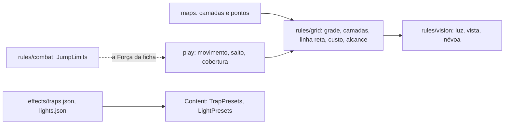

**`rules/grid`.** A grade de um mapa (`Grid`: colunas e linhas; as linhas saem da imagem por `RowsFor`, `round(colunas × altura / largura)` entre 1 e 400), a conversão entre pontos-base (0 a 10000 da largura e da altura da imagem) e quadrados (`SquareOf`, `CenterOf`, as mesmas contas do `play`) e as **camadas empacotadas**, que o `maps` guarda e a API manda (o navegador decodifica, então o formato faz parte do contrato):

| Camada | Tipo | Bytes |
| --- | --- | --- |
| Parede, terreno difícil | `Layer`: 1 bit por quadrado | `ceil(quadrados / 8)`. O quadrado `n = linha × colunas + coluna` é o bit `n % 8` do byte `n / 8`, do menos significativo para o mais. |
| Luz | `LightLayer`: 2 bits por quadrado (0 não pintado, 1 escuro, 2 penumbra, 3 claro) | `ceil(quadrados / 4)`. O quadrado `n` ocupa os bits `2 × (n % 4)` e o seguinte do byte `n / 4`. |
| Cobertura | `CoverLayer`: 2 bits (0 nenhuma, 1 meia, 2 três quartos; o 3 nunca é guardado) | Igual à da luz. |
| Portas | `DoorLayer`: 4 bits por quadrado (0 nenhuma, 1 aberta, 2 fechada, 3 trancada, 4 grade, 5 secreta; 6 a 15 nunca são guardados) | `ceil(quadrados / 2)`. O quadrado `n` é o nibble baixo do byte `n / 2` quando `n` é par e o alto quando é ímpar. O nibble sobrando do último byte (número ímpar de quadrados) é 0. Um valor acima de 5, o tamanho errado ou um nibble sobrando são recusados ao ler (`ErrLayerSize`). |

Os bits que sobram no último byte são 0; `Decode…` recusa tamanho errado, bit sobrando ligado e, na cobertura, o valor 3 (`ErrLayerSize`). Uma parede é cobertura total; ela e o quadrado de três quartos bloqueiam o movimento, mas só a parede bloqueia a vista e a luz.

A **linha reta entre os centros** de dois quadrados (`Line`) é percorrida com inteiros, então o resultado é o mesmo em toda máquina: o quadrado de saída fica de fora, o de chegada entra, e uma linha que passa exatamente por uma quina não entra nos dois quadrados vizinhos a ela. Quando esses dois são paredes (ou uma parede e uma coluna, no movimento), a linha é **espremida** e fica bloqueada. Em cima da linha:

| Função | O que faz |
| --- | --- |
| `Terrain.Move(de, para, ocupantes, mover)` | O custo de um movimento reto em décimos de pé: o comprimento da linha (exato até o décimo) mais 50 por quadrado em que a linha entra que é terreno difícil ou tem outra criatura (uma vez só, mesmo que os dois valham). Quem voa não paga o terreno do mapa, só o espaço de criaturas. Bloqueia por parede, coluna, espremida e criatura hostil que não dá para atravessar (dois tamanhos de diferença, `Size`), e por terminar no quadrado de alguém (salvo Miúdo com Miúdos). |
| `Terrain.MoveUntil(…, parar, restante)` | O movimento como de fato acontece, para quando o jogador não vê tudo (névoa) ou há uma armadilha: segue a linha e para antes do primeiro obstáculo real, antes do primeiro quadrado que o movimento que sobra (`restante`, em décimos de pé) não paga (`StopMovement`), ou no primeiro quadrado do conjunto `parar` (a área da armadilha). O custo é o real até ali e nunca passa do que sobra. `Marked` e `MarkedAt` dizem que a armadilha disparou mesmo quando o quadrado dela está ocupado e o personagem termina um quadrado antes (`Reached`). |
| `Terrain.Reach(de, movimento que sobra, ocupantes, mover)` | Todo quadrado alcançável num movimento reto, com o custo, em ordem de leitura: o círculo, encolhido pelo terreno e cortado pelas paredes. É o que o servidor manda para o navegador desenhar. |
| `Terrain.Jump(de, para, ocupantes, mover)` | O custo do salto em distância: só o comprimento (passa por cima de terreno difícil e de criaturas); não atravessa parede nem coluna. |
| `Terrain.CoverBetween(atacante, alvo, criaturas)` | A cobertura do alvo: a melhor entre os quadrados da linha, sem os dois das pontas; parede ou espremida é total, outra criatura dá meia. |
| `LeavesReach(de, para, reator, alcance)` | Se um movimento sai do alcance de quem reage (o ataque de oportunidade), inclusive atravessando-o, e o último quadrado dele dentro do alcance. |
| `RangeSquares`, `RangeFt` | O alcance de ataque e de magia: a distância entre os centros **arredondada para baixo** em quadrados, vezes 5 ft. |
| `Terrain.Validate()`, `NewSight(grade, paredes)` | Conferem que a grade vale e que cada camada é do tamanho dela (`ErrBadGrid`): os bytes de uma camada não querem dizer nada em outra grade. Entrada de fora nunca derruba o servidor. |
| `Sight.Clear(de, para)` | Se a linha não cruza parede, rápido: com uma soma de áreas das paredes, pula o trecho da linha cuja caixa não tem parede e divide o resto ao meio. É o que o `vision` usa. |

**`rules/vision`** é a conta da névoa de guerra (D6): da `Scene` (a grade, as paredes, a luz base do mapa, a luz pintada e as fontes de luz) o `Compile` calcula a luz de cada quadrado, a maior que chega a ele, e `Lit.See(viewer)` diz o que cada observador (um quadrado e seus sentidos em pés: visão no escuro, visão às cegas, visão verdadeira) enxerga: **não visto**, **claro**, **penumbra**, **cinza** (no escuro, dentro da visão no escuro ou da visão às cegas) ou **parede vista** (uma parede que toca um quadrado visto). Luz e vista param nas paredes, pela mesma linha do movimento. Um observador sempre conhece o próprio quadrado. `Lit.Union` junta vários (a "Visão do grupo", ou um jogador com mais de uma criatura). `PassivePenalty` dá −5 para penumbra e cinza (levemente obscurecido, SRD) e 0 para claro. A visão no escuro, dentro do alcance, vê a penumbra como luz clara e o escuro como cinza; a visão verdadeira vê os dois como luz clara. `Compile` devolve erro para grade inválida ou camadas de outra grade, e limita o raio de uma fonte de luz a 120 ft (claro e penumbra, cada um). Medido (`go test ./internal/rules/vision -run '^$' -bench .`, Apple M1 Pro; o Cloud Run, com 1 vCPU, é mais lento): a caverna do desenho (24 × 16, 4 observadores, 2 luzes) leva uns 0,03 ms; 60 × 40 com 6 e 10 luzes, uns 0,4 ms; 200 × 400 com 6 e 20, uns 5 ms no escuro; um campo de 200 × 400 em luz do dia com borda e cinco pilares, uns 80 ms; com 1 parede em cada 1000 quadrados, uns 75 ms; com 1 em cada 100 (o pior caso medido), uns 145 ms.

**Predefinições.** `effects/traps.json` (as oito armadilhas de exemplo do SRD, nas nossas palavras e com os números do SRD, mais a tabela de gravidade e o dano por nível) e `effects/lights.json` (as luzes do SRD, em pés) são escritos à mão, conferidos ao carregar (tipos fechados, condições e tipos de dano que existem, tudo recusado se não bate) e entram na regra da revisão dos efeitos. Os nomes em português são `trap:<chave>` e `light:<chave>`, em `names_pt.json`. O `ContentService.ListTrapPresets` e `ListLightPresets` (`characters/presets.go`) entregam as predefinições, a tabela de gravidade e o dano por nível ao formulário do mestre; são regra pública, `IDEMPOTENT`, só para membro ativo (o pendente recebe `not_found`, como em `ListCreatures`). `Content.TrapPresets()`, `TrapSeverities()`, `TrapDamageByLevel()` e `LightPresets()` entregam o conteúdo; uma armadilha tem as partes de efeito do desenho (um ataque, dano que sempre acerta, condições que sempre pegam e uma resistência, com o que acontece ao falhar e ao passar), a CD para notar e para achar, o gatilho, a área e o `fall_ft` dos fossos (queda de 1d6 por 3 m, `FallDice`, e quem cai fica Derrubado). `find_dc_ours` marca a CD para achar que não é do SRD (ele só dá a CD para notar): `TrapPreset.FindDCIsOurs`. `TrapPresets()` e `TrapPreset()` devolvem cópias profundas. A lanterna de foco (um cone) fica de fora: o app só acende círculos.

### Movimento no combate (Etapa 9, fatia 9.6)

O movimento, o alcance, o salto e a cobertura do combate (MR-034, RN-21) são do módulo `play`, que **chama** `rules/grid` e `rules/combat.JumpLimits` e não refaz a geometria (`combat_move.go`, `combat_cover.go`). Os números que o combate precisa de uma ficha são copiados para o combatente quando ele entra, como a velocidade: o lado, o tamanho, a velocidade de voo e os limites de salto (migration `00098`, [Dados](dados.md)). O que fica no servidor (RN-20): a CA com a cobertura nunca vai a um jogador.

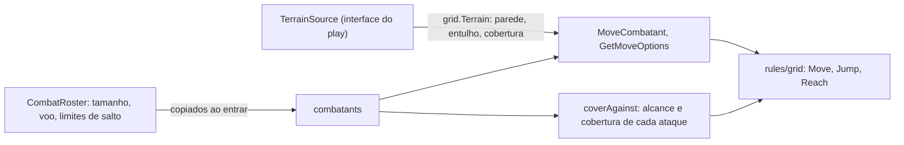

| Peça | O que faz |
| --- | --- |
| `TerrainSource` | `Terrain(ctx, campanha, mapa) (grid.Terrain, error)`, declarada no `play` e implementada pelo `maps` (`Service.Terrain`, em `terrain.go`: a grade e as camadas de parede, terreno difícil, cobertura e portas que o mestre pintou (as portas como estão, a verdade; ver [As portas](#as-portas-etapa-10-fatia-106c)), lidas com os mesmos `gridOf` e `loadLayers` do `GetMapLayers`; sem linha de camadas é piso aberto, um mapa de outra campanha é `not_found`, e a luz não entra). Como as duas se precisam, o `cmd/api` liga uma à outra com `play.Service.SetTerrain` depois de criar o `maps`; uma fonte nula (os testes sem mapa) também é piso aberto. O terreno só vale se a grade dele é a do combate, que foi copiada quando começou: camadas de outra grade, ou um mapa que o mestre apagou, viram piso aberto. |
| `MoveCombatant` | Uma linha reta do quadrado do combatente ao escolhido. O jogador paga o comprimento exato em décimos de pé (`grid.Terrain.Move`) e vê o `TOO_FAR` com o que falta (`missing_dft`); o mestre move de graça. O `grid.Occupants` de cada movimento é montado por `occupantsFor`: os outros combatentes no mapa e vivos, hostis quando o lado é o outro, com o maior tamanho do quadrado; o jogador planeja com os que enxerga, e o movimento real roda com `Terrain.MoveUntil` contra todos: para antes de uma criatura escondida, cobra o custo até ali e responde só `stopped_early`; as portas fechadas que a linha atravessa se abrem e uma trancada o faz parar ([As portas](#as-portas-etapa-10-fatia-106c)). Num mapa com névoa, "os que enxerga" são os que o personagem vê agora e o terreno do plano é o que ele conhece (a fatia 9.7, [abaixo](#combate-por-jogador-na-névoa-etapa-9-fatia-97)). Voa quem tem `speed_fly_ft` (a melhor das duas velocidades, sem pagar o entulho); nadar e escalar ficam de fora. |
| `GetMoveOptions` | `Terrain.Reach` para os alcançáveis e `Terrain.Move` para os recusados dentro do círculo, cada um com o motivo (`WALL`, `ENEMY`, `OCCUPIED`, `TOO_COSTLY`). Só do combatente do próprio jogador na vez dele, ou qualquer um para o mestre. |
| Salto | `MoveCombatant` com `jump`: `LONG` usa `Terrain.Jump` (custo = comprimento, sem terreno difícil, sem parede, sem pousar em criatura); `HIGH` gasta os pés sem mover. Os limites vêm de `combat.JumpLimits` (guardados no combatente, e só eles valem: o `GetTurnOptions` os devolve; parado é a metade) e a corrida, de `combat.HasRunningStart` sobre o `last_move_dft`, que soma os movimentos a pé seguidos e é quebrado por ação, ataque, magia ou salto (`breakRun`; o desfazer a devolve). O `GetTurnOptions` os devolve (`TurnOptions.jumps`). O evento `combatant_moved` leva `jump`, `height_dft` e `landing_difficult`; o registro mostra o lembrete da Acrobacia só ao mestre. |
| Lado e tamanho | `combatants.side` (`party` ou `enemy`) e `size`. Os personagens de jogador e as criaturas deles (MR-037) são `party` e os NPCs `enemy`; o mestre troca um NPC com `SetCombatantSide` (evento `side_set`). O tamanho vem da raça do personagem (o `Catalog`), do `BasicSheet.size` (sem valor, Médio) ou, numa criatura, da ficha dela (`CreatureByKey`). Todo combatente ocupa um quadrado, Grande ou não. |
| Alcance | `grid.RangeFt`, os quadrados entre os centros arredondados para baixo vezes 5 ft, em todo lugar onde havia `GridDistanceFt` (`combat_actions.go`, `combat_spells.go`): um vizinho na diagonal está a 5 ft. |
| Cobertura | `coverAgainst`: a maior entre `Terrain.CoverBetween` (com os quadrados das outras criaturas) e a marca do mestre (`SetCombatantCover`, evento `cover_set`, apagada quando o combatente se move; o movimento que a apaga manda também `encounter_changed`, porque o `combatant_moved` só leva o quadrado). Soma +2 ou +5 na CA do ataque com arma e do ataque de magia e no teste de Destreza da magia; a cobertura total faz `RollAttack` e `CastSpell` recusarem o jogador (`TARGET_COVER_TOTAL`; magia de área não recusa) e a lista de alvos a anota (`TargetInReach.cover`, `cover_source`). A CA com a cobertura (`target_armor_class`, `cover_bonus`) só vai ao mestre; é guardada no dano pendente (`pending_damages.attack_armor_class`, migration `00100`) para o Escudo comparar o golpe com ela mais 5. Uma magia com o tipo `ignores_cover` em `effects/spells.json` (Chama Sagrada, `Content.IgnoresCover`, `link.Spell.IgnoresCover`) não soma cobertura ao teste, mas a recusa de alvo por cobertura total fica. `TargetInReach.untargetable` diz ao app que o jogador não pode escolher o alvo. |
| Desengajar | `standard:disengage` liga `combatants.disengaged`, zerado no começo da vez (`ResetCombatantTurn`) e devolvido pelo desfazer. É a marca que o ataque de oportunidade lê ([abaixo](#ataques-de-oportunidade-etapa-9-fatia-96b)). |
| Desfazer | `combatant_moved` passou a ser um tipo que o `UndoLastAction` desfaz: o evento guarda de onde o combatente saiu (`from`: quadrado, movimento andado, corrida, marca de cobertura), e o desfazer põe tudo de volta (um salto e a cobertura que o movimento apagou incluídos). |

**Em décimos de pé.** O servidor guarda e cobra o movimento em décimos de pé (`movement_used_dft`, `last_move_dft`; `Combatant.movement_*_dft`, `MovementLeft.*_dft`); os campos em pés continuam preenchidos, arredondados para baixo, para o app publicado. O app desenha o que o `GetMoveOptions` manda (fatias 9.15 e 9.15b, [abaixo](#o-movimento-e-o-ataque-de-oportunidade-na-tela-etapa-9-fatias-915-e-915b)); o `combat-grid.ts` ficou só com a geometria da grade (onde um quadrado fica no mapa).

**Limites desta fatia, ditos claro.** Não havia névoa de guerra (fatia 9.4) nem ataque de oportunidade (feito na 9.6b, abaixo); nadar e escalar não custam diferente; todo combatente ocupa um quadrado; uma criatura escondida dos jogadores não conta como cobertura para o ataque de um jogador (contaria como "cobertura do mapa" e entregaria que ela está ali); quando o mestre ataca, todas contam. O combate que já estava rodando quando a migration chegou fica sem limites de salto até as pessoas voltarem a entrar (os campos novos têm padrão 0).

### Ataques de oportunidade (Etapa 9, fatia 9.6b)

Um movimento que sai do alcance de um inimigo aterrissa na hora e **oferece** um ataque a esse inimigo; o turno de quem andou espera a resposta (MR-034, RN-21, pergunta 69; `combat_opportunity.go`). O `play` chama `grid.LeavesReach` (a linha inteira, o quadrado de saída incluso, e o último quadrado ainda dentro do alcance) e o caminho de ataque e de dano que já existia, sem refazer nenhum dos dois.

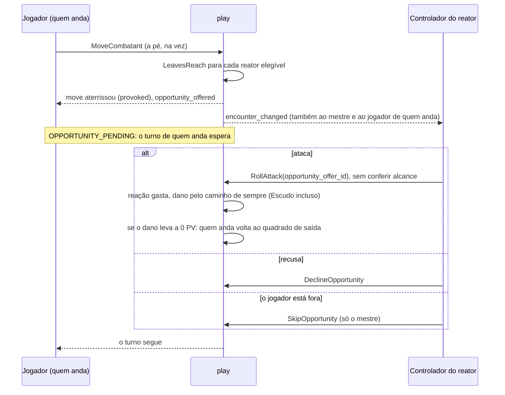

| Peça | O que faz |
| --- | --- |
| Quem provoca | `opportunityReactors`: o outro `side`, no mapa, não derrotado, com a reação livre, sem condição que incapacite (Incapacitado, Paralisado, Petrificado, Atordoado, Inconsciente) nem Cego, não caído (a vista de quem está a 0 PV), uma criatura que pode atacar com a reação (`mayAttack`) e com um ataque corpo a corpo; quem está no mesmo grupo de turno também reage. O alcance é o maior alcance corpo a corpo da ficha, no mínimo 5 ft (`meleeReachOf`; uma arma de arremesso, com alcance longo, não conta). Quem anda escondido não é visto por ninguém; num mapa com névoa, o reator tem de **ver** quem anda (a fatia 9.7, [abaixo](#combate-por-jogador-na-névoa-etapa-9-fatia-97)); e quem usou Desengajar não provoca. Um salto em distância provoca (gasta movimento); o salto em altura, a colocação do mestre fora da vez de quem anda, o movimento `forced` do mestre e o movimento de volta da regra dos 0 PV não oferecem. Para o jogador, `GetMoveOptions` avisa só com o que ele vê (alcance de 5 ft, sem a reação nem a ficha do NPC). |
| Ofertas | `opportunity_offers` (`00108`): uma por reator por movimento, com o quadrado de saída. O `MoveCombatant` grava um evento `opportunity_offered` por oferta (ids e quadrado, antes do evento do movimento, como os das criaturas) e põe o `move_id` no próprio evento. As ofertas estão no combate, não no `combatant_moved`: um movimento que provoca manda `encounter_changed` ao mestre, ao jogador de quem anda (o turno dele espera) e aos jogadores dos reatores (a pergunta deles), e a nenhum outro jogador, porque a oferta de um reator que ele talvez não veja não é dele (`publishOffersMade`). A cópia dos jogadores vai sem revisão ("leia de novo"). |
| O turno espera | `mustNotWait` (chamado por `mustActNow`, que o ataque, a ação e a magia usam, pelo `MoveCombatant` e pelo `EndTurn`): `OPPORTUNITY_PENDING` para o jogador de quem tem oferta pendente, ou cujo ataque de oportunidade ainda tem o dano por rolar, aplicar ou descartar (`ListWaitingOpportunityOffers`); vale para o mover e para as criaturas do mesmo jogador no grupo de turno. Depois de qualquer mudança, `pruneOffers` passa a `skipped` as ofertas que ninguém responde mais (derrotado, caído, incapacitado, reação gasta). O mestre nunca é parado, e quando ele encerra o turno de quem andou as ofertas pendentes passam a `skipped`. As reações dos outros combatentes não esperam. |
| Respostas | Atacar é o `RollAttack` com `opportunity_offer_id` (implica `as_reaction`, não confere o alcance e grava `offer_id` no evento do ataque); recusar, `DeclineOpportunity`; seguir sem esperar, `SkipOpportunity` (só o mestre). Os dois últimos gravam `reaction_declined` com o `offer_id`. Quem pode: o controlador do reator (o jogador do personagem ou da criatura; o mestre, de um NPC) e o mestre em qualquer uma (RN-10: um reator que o jogador não vê é `not_found`). Uma oferta que não existe mais (movimento desfeito, turno que passou) ou já respondida é `aborted`. |
| Regra dos 0 PV | O ataque guarda o dano que abriu em `attack_pending_id`. Quando esse dano leva quem anda de mais de 0 PV a 0 (`RollDamage` para um NPC ou criatura; `ApplyPendingDamage` para um personagem), `returnToReach` põe o combatente no quadrado de saída da oferta e o evento do dano guarda `returned_from`, o que o desfazer do dano repõe; se o quadrado de saída está ocupado, quem anda fica onde está e o evento guarda `return_blocked` (a linha do mestre diz). O ataque conta a cobertura com quem anda no quadrado de saída. O movimento é publicado (`combatant_moved`) como qualquer outro. |
| Desfazer | O desfazer do movimento apaga as ofertas pendentes dele (`move_id`). Só a última ação se desfaz: um movimento cuja oferta foi respondida só se desfaz depois de desfazer a resposta, e o desfazer de um ataque de oportunidade, de uma recusa ou de um "seguir sem esperar" devolve a oferta a `pending`. A recusa e o "seguir sem esperar" não têm linha própria no registro: o evento fica preso à linha do movimento (`move_id`), que passa a ser a desfazível. Os eventos `opportunity_offered` não fecham a cadeia do desfazer. |
| Quem vê o quê | `Encounter.opportunity_offers` (`opportunityOffers`): o mestre vê todas, com nomes; o controlador do reator vê a sua, com os ataques corpo a corpo e o quadrado de saída; o jogador de quem anda vê o `mover_id` e só vê o reator (id e nome) se o reator não está escondido dele (RN-10); os outros jogadores não veem nenhuma. O stream continua só com a dica `encounter_changed` (e `combatant_moved` quando alguém volta), então nada novo vaza por ele. O `GetMoveOptions` põe em cada quadrado `provokes_reactor_ids`, só com reatores que quem pergunta enxerga. |

### O movimento e o ataque de oportunidade na tela (Etapa 9, fatias 9.15 e 9.15b)

O navegador só desenha o que o servidor manda (RN-21, RN-20). A página "Mover" (`pages/live-session/combat/move-page`) lê o `GetMoveOptions` (`core/combat/move-options-state.ts`, perguntado de novo a cada mudança do combate; uma resposta lenta nunca passa por cima de uma mais nova) e o `GetMapLayers` (`core/maps/layers-state.ts`, lido de novo quando o `layers_revision` do mapa muda; `core/maps/layers.ts` decodifica os bytes no formato de `rules/grid`). Tudo o que ela escreve vem de `core/combat/move-plan.ts`: procurar o quadrado na resposta (alcançável com o custo, recusado com o motivo, ou fora do círculo), dizer o custo e o que sobra, avisar quem pode provocar e perguntar da armadilha conhecida; nada ali calcula um custo, uma parede ou uma cobertura. O único comprimento que o navegador mede é o da linha de um salto em distância (`core/combat/jump-plan.ts`, só para escrever "Saltar 4,5 m" antes de confirmar): o servidor não manda onde dá para cair, então ele decide ao confirmar e responde `TOO_FAR` com o limite. As ofertas de ataque de oportunidade (`Encounter.opportunity_offers`) viram o `alertdialog` do jogador (`OpportunitySheet`, aberto sozinho uma vez por oferta), o cartão do mestre (`OpportunityCard`) e a espera de quem andou (`core/combat/opportunity.ts`: `waitingText`, `barText`); "Atacar com <arma>" abre a `AttackSheet` com a oferta (`opportunity.offerId`), o que faz o `RollAttack` ir com `opportunity_offer_id`. A oferta chega ao jogador pelo `encounter_changed` sem revisão (`revision` 0), e a página lê o combate de novo a cada um desses, como num mapa com névoa, onde todo aviso dos jogadores vem assim; com revisão, só lê quando ela é mais nova que a da tela. A cobertura de cada alvo vem do `TargetInReach` (`core/combat/cover.ts`).

| Peça | O que faz |
| --- | --- |
| `shared/map-layers` | `MapLayersOverlay` (parede, terreno difícil e cobertura sobre a imagem, na linguagem de `MAP-LANGUAGE`) e `MapLayersLegend` (só o que o mapa tem). Reusadas pelo mapa do combate, pela página "Mover" e, na 9.12 e na 9.13, pelo editor e pela sessão |
| `paint-surface`, `editor-overlay`, `editor-bar`, `editor-painting`, `layers-panel`, `grid-panel`, `fog-panel`, `map-ask` (`pages/maps`) | O editor do mapa da 9.12: a superfície que pega o pincel, a camada que desenha a grade, as camadas, a luz pintada, o cursor, as marcas de ponto e o alcance da luz, a barra, "Camadas", "Grade", "Névoa de guerra" e a pergunta no lugar. Ver [O editor do mapa](#o-editor-do-mapa-etapa-9-fatia-912) |
| `shared/combat-map` | Desenha o `Reach` que a tela manda (os quadrados do servidor e o círculo do movimento que sobra), o quadrado escolhido com o custo, as camadas e o alcance do reator de uma oferta. Não confere nada: soltar o próprio token abre, para o jogador, a página "Mover" naquele quadrado, com os avisos e a confirmação dela (nada anda sozinho); o arrasto do mestre move na hora |
| `move-page` | "Mover" e "Saltar" (distância e altura), o aviso de ataque de oportunidade com "Desengajar", a pergunta da armadilha, as setas "Ajustar a escolha" e o rodapé fixo |
| `opportunity-sheet`, `opportunity-card` | O aviso do jogador e o cartão do mestre, que também diz "Esperando a reação do Caio (Toren)" e tem "Seguir sem esperar" |
| `order-list` (`row-cover`, `cover-mark`) | A cobertura de cada combatente contra quem tem a vez, "Marcar cobertura" e "Marcar como aliado" |

### Armadilhas em jogo (Etapa 9, fatia 9.8)

Notar, procurar, disparar e desarmar uma armadilha (MR-035, RN-10, RN-02) são divididos entre dois módulos que se chamam pelos dois lados: o `maps` é dono da armadilha (onde está a área, o estado, quem a conhece, o que cada personagem enxerga dela) e o `play` é dono do jogo em volta (os movimentos, os dados, o dano, o histórico e o desfazer). Os dois se ligam no `cmd/api` (`playService.SetTraps(mapsService)` e `mapsService.SetTrapFirer(playService)`), como o `TerrainSource`; sem ligação, nenhuma armadilha faz nada em jogo.

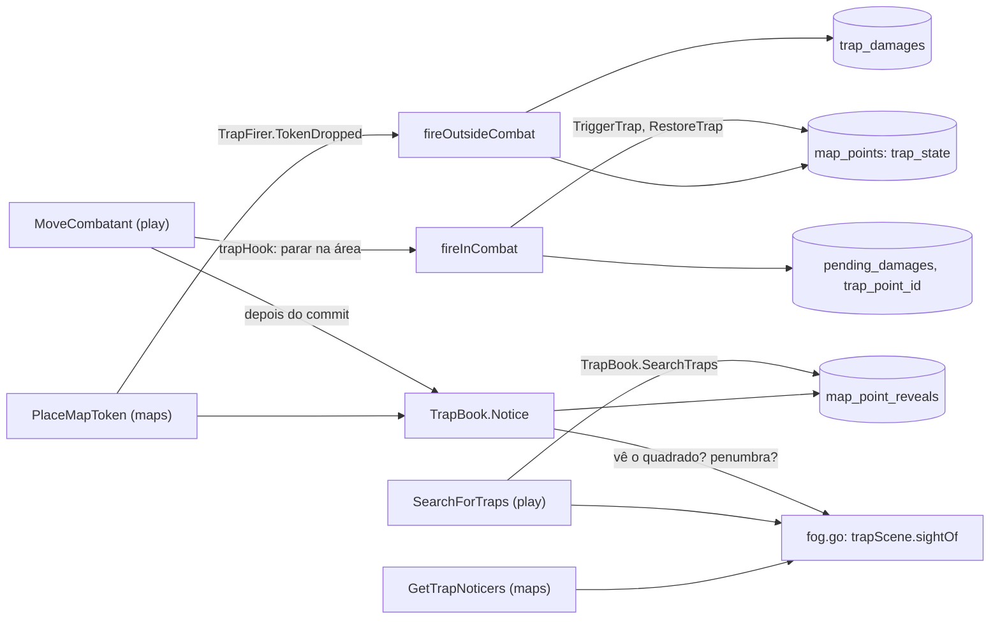

| Peça | O que faz |
| --- | --- |
| `play.TrapBook` | A interface que o `play` declara e o `maps.Service` implementa (`maps/traps_play.go`): `Traps` e `KnownTraps` (as armadilhas do mapa, com os dados do mestre ou só com o nome e a área), `Notice`, `SearchTraps`, `Told`, `TriggerTrap` e `RestoreTrap` (dentro da transação do `play`, que trava a sessão), `TrapChanged` (o aviso a todos depois do commit) e `TrapNames` (o nome de uma armadilha disparada, para o registro). Os tipos ficam em `maps/link` (`Trap`, `Observer`, `Eyes`). |
| `maps.TrapFirer` | O outro lado: o `PlaceMapToken`, depois do commit, chama `TokenDropped` e o `play` dispara as armadilhas "Ao entrar na área" cuja área tem o quadrado do token, durante uma sessão e sem combate no mapa. NPC não dispara. |
| Quem enxerga o quê | `trapScene` (`maps/traps_play.go`) monta o mapa para as armadilhas: a grade, as armadilhas, quem as conhece, a Percepção passiva e os sentidos de cada personagem (`PartyMember.PassivePerception`, preenchido por `characters.PartyVision` da ficha derivada; uma ficha básica vale 10) e, com a névoa, a cena de `fog.go` (`newSight`); sem névoa todo quadrado da grade é visto em luz clara. `sightOf` diz, para um observador num quadrado, se algum quadrado da área está a até 3 m (100 décimos de pé entre centros), se algum é visto agora e, nos dois ao mesmo tempo, a penalidade de `vision.PassivePenalty` (−5 na penumbra ou no cinza da visão no escuro; penumbra dentro da visão no escuro vale claro). Um mapa sem grade não tem quadrados: não há aviso nem busca. |
| Uma criatura solta no mapa | O mestre que põe o token de uma criatura de personagem (`PlaceMapToken` com `creature_id`) numa armadilha "Ao entrar na área", fora de um combate e num mapa que os jogadores veem, dispara a armadilha como o token de um personagem (`TrapFirer.CreatureDropped`): a criatura é pega com quem está na área (ou sozinha, se a armadilha escolhe os alvos à mão), com a CA e a resistência da ficha dela; a linha fica no nome do personagem dono e só ele e o mestre a leem. Sem PV guardados fora do combate, o dano dela é só a linha (como o de um NPC); a criatura não nota nada ao ser solta. Uma criatura que já estava na área também é pega por `FireTrap` sem alvos, por `TokenDropped` e por `CreatureDropped` (os tokens de criatura entram em `tokensOn`; `creaturesInArea` acha a criatura pelos personagens do grupo). `GetTrapNoticers` ganhou `passes_dc` (a passiva mais a penalidade alcança a CD, esteja o personagem onde estiver), para a tela dizer "Se chegar a 3 m: nota" sem comparar. |
| Notar | `Notice` roda **depois do commit** de um movimento (para ver o quadrado onde o personagem está agora): o personagem de jogador, ou a criatura dele com a própria Percepção passiva e os próprios sentidos (`CombatRoster.CreatureEyes`), que termina ali revela a armadilha armada, conhecida por ele ainda não, com CD para notar e `passiva + penalidade ≥ CD`; grava `map_point_reveals` (`noticed`), o evento `trap_noticed` e avisa por `PublishToUsers` só o jogador dele: um `map_changed` e a dica `trap_noticed{map_id, point_id}` (campo 21 do stream; só quando o jogador vê o mapa, e nunca para outro jogador nem para o mestre). A linha entra em `ListTrapActivity` como `TrapActivity.notice` (campo 5; `TrapNotice` com os personagens e o nome da armadilha, que o jogador já conhece): o mestre lê todas, o jogador só as dos personagens dele, sem CD. |
| Procurar | `SearchForTraps` é do jogador, durante a sessão. Num combate em andamento do qual o personagem faz parte é a ação Procurar (`searcherPlace`: a vez dele, a ação ainda livre, o quadrado do combatente, o mapa do combate); fora dele, o mapa atual da sessão e o token. O d20 vem do app ou do dado físico (RN-18), com o bônus de `SceneOptions` (`skill:perception` ou `skill:investigation`). Tudo numa transação que trava a sessão: `SearchTraps` revela as achadas e o `play` escreve `trap_searched` (a rolagem, a perícia e os IDs achados; nunca uma CD). A resposta traz a rolagem e os IDs achados, que são os mesmos para "nada aqui" e "o teste falhou". |
| Disparar ao entrar | `trapHook` (`combat_traps.go`) é o gancho que o `MoveCombatant` chama em três pontos: `stops()` entrega a área das armadilhas armadas "Ao entrar na área" (menos as que já têm o personagem dentro) como o `stopAt` do `Terrain.MoveUntil`, `marked`/`landed` dizem onde o movimento entrou ou pousou (um salto só conta onde pousa; o movimento do mestre só onde termina), e `finish` devolve o evento do movimento ou, quando entrou numa armadilha, escreve o do movimento e deixa o do disparo (`trap_triggered`) como o da mudança (`altKind`), na mesma transação. Só o personagem de jogador e a criatura dele disparam. Pegos: quem está na área, mais quem entrou; se o efeito é de alvos manuais, só quem entrou. |
| Disparar na mão | `FireTrap` (mestre): num combate no mapa da armadilha é uma mudança de combate (`fireByHandInCombat`, com `target_ids` de combatentes ou, sem eles, quem está na área); fora dele, `fireOutsideCombat`, numa transação própria (`target_ids` de personagens com token no mapa ou, sem eles, os tokens na área). `TriggerTrap` marca `trap_state = triggered` e `trap_triggered_at` (a armadilha vira pública) e devolve a armadilha como era, com os dados do mestre. |
| O efeito | `resolveTrap` (`traps_effect.go`, sem banco): os ataques da armadilha vão um a um às criaturas pegas, em ordem, com o bônus dela contra a CA da criatura (20 acerta e dobra os dados, 1 erra); o dano que sempre acerta e as condições vão a todas; a resistência (de todas ou só das atingidas) usa o bônus de cada criatura (como as das magias; ficha básica rola d20 + 0); ao falhar, o dano e a condição; ao passar, metade (arredondada para baixo) ou nada. Cada parte de dano de cada criatura é uma rolagem. |
| Onde cai o dano | No combate (`trapDamageInCombat`): o personagem de jogador ganha uma linha de `pending_damages` `rolled` sem atacante e com `trap_point_id` (o mestre a aplica com `ApplyPendingDamage`, mudando a quantia se quiser); o NPC e a criatura levam na hora (`landDamage`, a linha nasce `applied`); as condições vão para o combatente. Fora do combate (`fireOutside`): uma linha de `trap_damages` `rolled` para o personagem de jogador (`ApplyTrapDamage` aplica às vitais, `DiscardTrapDamage` descarta, ambos com chave de idempotência e o evento `damage_applied` ou `damage_discarded`); o NPC só tem o evento, e as condições são um lembrete nele. `ListTrapDamages` lista o que espera, dos dois lugares, para o cartão do mestre. |
| Desfazer | Um disparo no combate é um evento `trap_triggered` desfazível (`takeBackTrap`): apaga as linhas de dano que abriu, devolve o PV dos NPCs e criaturas e as condições, e arma a armadilha de novo (`RestoreTrap`); o movimento que a disparou é o evento anterior e se desfaz em seguida. Fora do combate não há desfazer, como nos outros eventos fora dele. |
| Avisar antes de entrar | `GetMoveOptions` de um jogador chama `markKnownTraps`: cada quadrado alcançável cuja linha entra na área de uma armadilha armada "Ao entrar na área" que o personagem conhece (`KnownTraps`) leva `known_trap_point_id` e `known_trap_name`. O mestre não é avisado, e uma armadilha desconhecida nunca é marcada. |
| O registro | O disparo é a linha `TRAP_TRIGGERED` do `ListCombatLog` (`CombatLogEntry.trap`): todos recebem a armadilha (ela é pública) e o que fez a cada criatura (passou, falhou, o dano e se foi aplicado); o d20 e os dados são do mestre e do dono do alvo; a CD e a CA, só do mestre; um NPC escondido não aparece para o jogador. A busca é uma linha só do mestre ("Procurar"). |
| Regras da busca (SRD, pergunta 71) | A busca de Percepção tem **desvantagem** nas armadilhas cujos quadrados estão pouco visíveis para o personagem (penumbra, ou escuro visto pela visão no escuro; a visão às cegas dentro do alcance não conta, `penaltyAt`). No app o servidor rola dois d20 (`d20_face_2` e `second_roll` no dado físico) e vale o menor nessas e o primeiro nas outras; com dado físico o segundo é exigido (`SEARCH_NEEDS_TWO_DICE`) quando algum quadrado a até 3 m que o personagem vê está pouco visível (`nearbyObscured`, que olha quadrados, nunca armadilhas). Investigação não muda. A visão às cegas também tira os −5 da Percepção passiva. |
| Uma resistência por golpe | Numa armadilha que pede a resistência de quem foi atingido (`applies_to HIT`), a resistência, o dano ao falhar e a condição são rolados **uma vez por golpe** (cada dardo); `TrapCaught.saves` traz todas e `save` a primeira. |
| Acrescentar criaturas | O disparo ao entrar pega quem entrou (e quem está na área, se o efeito não é de alvos manuais). O mestre acrescenta outras ao **mesmo disparo** com `FireTrap.extend_firing_id` (o `TrapFiring.id`, que é o id da linha do registro): o servidor rola só para as acrescentadas, sem mexer no estado da armadilha, e elas entram nos resultados e na linha do registro; um "Desfazer" tira só elas. |
| Lido na transação | O `MoveCombatant` lê as armadilhas **dentro da transação do movimento** (`Traps(ctx, tx, ...)`): um desarme ou uma exclusão que confirma enquanto isso faz o movimento ler de novo, e uma armadilha que não existe mais simplesmente não para ninguém. Se o movimento provoca e a armadilha dispara, o evento do disparo leva o `move_id` e um reenvio com a mesma chave mantém `provoked`. Um ataque de oportunidade que leva o personagem a 0 PV e o devolve antes da área não desfaz o disparo: ele já aconteceu. |
| Fora do combate | `ListTrapActivity`: o mestre lê cada disparo (ataque, resistência, dano, condições como lembrete) e cada busca (quem, perícia, d20, total, o que achou) da sessão aberta; o jogador, só as linhas dos personagens dele, com o próprio d20 e "passou" ou "falhou", sem CD e sem armadilha que ele não conhece. Uma busca de jogador e um disparo fora do combate mandam ao mestre um `map_changed` sem conteúdo, e quando um personagem nota uma armadilha o mestre também o recebe, e mais ninguém além do jogador dele. O token solto só dispara ou nota num mapa que os jogadores veem (revelado ou o atual). |
| O dano que não some | Ao fim de um combate o dano de armadilha em personagem de jogador que ainda espera vira linha de `trap_damages` (`keepTrapDamage`); `trap_damages` sobrevive ao fim da sessão, e `ListTrapDamages` lista o da campanha inteira, com o número e a data da sessão, até o mestre aplicar ou descartar (`ApplyTrapDamage` funciona sem sessão aberta, só sem o evento). O "Desfazer" do combate passa por `trap_noticed` e por qualquer evento de armadilha ou de dano de armadilha que não seja deste combate. |
| Quem pode | O mestre dispara, desarma (`maps.DisarmTrap`, `trap_disarmed`), aplica e descarta o dano e lê o "Quem notaria" (`maps.GetTrapNoticers`); o jogador procura (e só ele: o mestre recebe `permission_denied`). `trap_noticed` e `trap_disarmed` entram no histórico por `AppendEvent` (`appendableKinds`), e `trap_searched` e `trap_triggered` o `play` escreve. |

**Na tela (fatia 9.14).** O mapa da sessão desenha as armadilhas, os baús e as luzes por cima da imagem com `app-map-pins`, tanto no mapa simples (`app-map-view`) quanto no de névoa: `app-fog-map` tem a entrada `pins`, que põe as marcas dentro do palco (elas se movem e ampliam com a imagem), desenha só os pontos que o servidor mandou (o lembrado, `MapPoint.remembered`, escurecido) e tira os três tipos dos marcadores comuns. O "Ver como" do mestre usa o mesmo. A legenda das marcas e o "Procurar armadilhas" do jogador ficam sob o mapa nos dois casos. O navegador não calcula nada de regra: a CD, a Percepção passiva e se "passa" vêm do servidor (`TrapNoticer.passes_dc`).

### Combate por jogador na névoa (Etapa 9, fatia 9.7)

Num mapa com a névoa ligada, **cada jogador recebe só os NPCs que o personagem dele vê agora** (MR-036, RN-10, RN-20; `combat_fog.go`). Para esse jogador, um NPC que ele não vê é um combatente escondido: sai da ordem, do turno, dos alvos, do registro e do stream; nomeá-lo é `not_found`, em toda chamada (inclusive `EndTurn` com o `expected_combatant_id` dele). Os personagens de jogador e as criaturas deles nunca somem (D6). Um mapa sem névoa não muda nada.

| Peça | O que faz |
| --- | --- |
| `FogSource` | Interface do `play`, implementada pelo `maps.Service` (`fogcombat.go`) e ligada em `cmd/api` com `play.Service.SetFog`, como o `TerrainSource`. `CombatSight` devolve, **de uma vez só e já com o grupo lido**, o que os jogadores veem agora do mapa do combate (nulo sem névoa): `Users`, `Sees(jogador, quadrado)`, `CanSee(de, sentidos, para)` (uma conta só para o par: a luz do quadrado para aqueles sentidos e uma linha, `vision.Lit.CanSee`, nunca uma vista do mapa inteiro) e `KnownTerrain(jogador)` (parede, entulho e cobertura dos quadrados que ele vê agora ou lembra). A cena é a mesma das leituras da 9.4, então vale o mesmo que `GetMapVision`. `CombatMoved` é o gancho da 9.4. |
| Quem vê quem | `combatViewer.unseen`: os NPCs que o jogador não vê agora (um NPC sem quadrado também não é visto). `combatViewer.sees` passou a dizer `!Hidden && !unseen`, e tudo que já perguntava "o jogador vê este combatente?" (a ordem, `turnFor`, `npcOnlyGroups`, as listas de alvo, o dano pendente, os avisos de reação e de oportunidade, `findCombatant`) ganhou a regra da névoa sem ser reescrito. Quem lê fora de uma mudança monta o viewer com `viewerFor`; dentro dela, `combatTx.viewer`; a resposta de uma repetição (a mesma chave) refaz o viewer (`viewerAfter`), porque o fechamento dela não rodou. |
| A vista é lida antes da transação | `write` lê a vista (`sightForWrite`) **antes** de abrir a transação, junto com a revisão do combate: o `maps` pergunta ao `play` onde estão os combatentes (`CombatPositions`, pelo pool), e essa leitura esperaria as linhas que a própria mudança já escreveu. Com a trava da sessão na mão, a transação confere a revisão: se outra mudança entrou no meio, devolve `errSightStale` e o `write` lê a vista de novo (até 3 vezes, depois `aborted`), então o que se carimba é a mesa de quando a coisa aconteceu. Depois do commit, **uma** vista é lida e dividida entre as publicações e a resposta (`withFogMemo`); a de antes diz quem via os quadrados de onde alguém saiu. |
| O registro | `insertEvent` carimba o evento (`stamp`): `fogged` e `seen_by`, os ids dos usuários que viam **todos** os NPCs dele quando aconteceu (cada um no quadrado em que estava; num movimento, em qualquer dos dois quadrados; num ataque de oportunidade, o que foge no quadrado de onde saiu). A linha é do jogador que está em `seen_by`; nunca se recalcula com a vista de depois. Evento sem NPC, ou escrito antes da névoa, não leva a marca e segue a regra de antes (o combatente que o mestre esconde ainda leva a linha de volta). Para o mestre, `Hidden` diz que nenhum jogador a vê. |
| O movimento | O terreno que o jogador conhece (`sight.knownTerrain`, lido antes da transação) vira o **plano** (`planOn`; o `GetMoveOptions` e a checagem do `MoveCombatant`): quadrado não visto é piso, então o alcance pode oferecer um quadrado que na verdade é parede. O movimento real roda no terreno de verdade e para onde algo o bloqueia (`stopped_early`, sem dizer o quê); nenhuma recusa nomeia parede nem criatura que o jogador não vê (D1, "movimento no escuro"). Depois de cada movimento que pousou, do desfazer dele, da volta da regra dos 0 PV e do desfazer dessa volta, `positionChanged` chama `CombatMoved`: a memória cresce e `vision_changed` vai a quem vê um dos quadrados. |
| Ataque de oportunidade | O reator só provoca se **vê** quem anda, no quadrado de onde ele saiu (`reactorSees`), **depois** do filtro do alcance (só os reatores que o movimento deixa para trás são perguntados): **todo** reator, de qualquer tipo, vê do próprio quadrado com os próprios sentidos (`link.Sheet.Senses`: visão no escuro, visão às cegas e visão verdadeira, da ficha ou da criatura; sem eles, a visão comum), na luz do mapa, e a "Visão do grupo" do jogador dele não conta (SRD: cada criatura percebe com os próprios olhos). O aviso do `GetMoveOptions`, o do mestre inclusive, usa a mesma regra e só nomeia o reator que o jogador vê; um reator que ele não vê provoca do mesmo jeito (se vê quem anda), e o jogador lê só "Esperando o mestre". Quem anda é julgado **no quadrado de onde saiu** (`combatViewer.seesAt`): um NPC que recuou para o escuro depois de o jogador o ver sair continua com a oferta, o `RollAttack` com ela é encontrado e a linha é do jogador; o dano, rolado depois, com o alvo fora da vista, é do mestre. |
| O stream | `turn_changed` vai a cada jogador como ele vê o turno (um NPC que ele não vê é "Vez do mestre"). `combatant_moved` de um NPC vai só a quem vê o quadrado novo; quem só viu o quadrado de onde ele saiu (na vista de antes) recebe o `encounter_changed` sem conteúdo, para ler o combate de novo e não achá-lo; os outros não recebem nada. `combat_log_changed` de uma linha carimbada vai só a quem está em `seen_by`. O `encounter_changed` dos jogadores diz `revision` 0 ("leia de novo"): o número do mestre sobe com tudo que acontece, e um jogador que o recebesse contaria os passos no escuro. Se a vista não puder ser lida, o jogador não recebe nada que nomeie um combatente. |
| A revisão do jogador | `Encounter.revision` num mapa com névoa é, para o jogador, quantos eventos do combate ele podia ver (`visibleRevision`: os sem NPC, os de antes da névoa e os que o têm em `seen_by`): nunca desce, e não sobe pelo que acontece fora da vista dele. O app publicado nunca lê nem devolve a `revision` (nenhuma chamada a usa para comparar e trocar), então não há canal aceito: é o número do mestre que fica sendo o do mestre. |
| Cobertura | Há duas: a **real**, que mexe na CA e no teste de resistência (e só o mestre lê como número), e a que **o jogador lê** (a lista de alvos, `untargetable`, a recusa `TARGET_COVER_TOTAL`, a resposta do `RollAttack`, o registro), feita com o terreno que ele conhece e só as criaturas que ele vê (`coverOf`, `coverPool`). Uma cobertura do mapa no registro só vai a quem, na hora, a teria lido igual (`cover_restricted` e `cover_seen_by` no evento; as outras leituras não a trazem): um pilar num quadrado no escuro, ou um Ogro que ninguém vê, não vira "cobertura do mapa". A marca do mestre vale sempre. |
| Armadilhas (9.8) | O disparo de uma armadilha é público (ela fica revelada a todos), então a linha `trap_triggered` não depende de `seen_by`; o que ela fez a um **NPC** é só de quem o via na hora: o carimbo grava, em cada `Caught` de NPC, `fogged` e `seen_by`, e `trapEntry` tira do jogador o NPC que ele não via (como já tirava o que o mestre escondeu). Quem dispara é sempre um personagem de jogador ou uma criatura (um NPC nunca dispara uma armadilha andando), então o movimento que parou numa armadilha segue as regras de cima: o plano usa o terreno que o jogador conhece, o movimento real roda no terreno de verdade, e as marcas `known_trap_*` do `GetMoveOptions` vêm das armadilhas que o personagem conhece, não do que a vista mostra. `trap_noticed` e `trap_searched` seguem como a 9.8 os fez, por usuário. |
| Forma Selvagem e o familiar (9.10) | A vista de um jogador já é a do `PartyVision`: na Forma Selvagem, os sentidos da fera (um lobo não tem visão no escuro); com "Ver pelos olhos do familiar", os olhos dele no lugar dos do personagem (`link.PartyMember.Eyes`). `CombatSight.Sees` usa essa vista, então a ordem, os alvos e o stream seguem os olhos certos. O reator de um ataque de oportunidade vê com os sentidos da ficha **da forma de agora** (`CombatSheet` deriva a fera), e uma criatura é do grupo: nunca some para os jogadores. As escritas de Forma Selvagem e do familiar são do próprio personagem (sem NPC no evento), então não levam carimbo. |
| Apagar o mapa | `DeleteMap` é recusado (`MapBlocked COMBAT_RUNNING`) enquanto um combate que não terminou roda no mapa, como a grade e a imagem: apagar o mapa limpava o `map_id` do combate e desligava o filtro. |

**Limites desta fatia, ditos claro.** O mestre ainda não pode ler o combate "como" um personagem (o "Ver como" do mapa é da 9.4; no combate fica para a tela da 9.13). Uma parede que bloqueia o jogador mas que ele não conhece não é refutável por cobertura (o alvo que ele vê tem linha livre até ele, e a cobertura que lê usa só o que ele conhece). Um jogador sem personagem vivo no mapa vê todos os NPCs como não vistos. **Custo.** Um movimento num mapa com névoa lê a vista duas vezes (antes e depois do commit; cada uma é a cena do cache da 9.4, a leitura do mapa e das fichas do grupo, uma vez só) e, no `maps`, uma terceira para a memória; o ataque de oportunidade pergunta a vista só dos reatores que o movimento deixa para trás, com a conta de um par. Medido (`TestFogCombatMoveCost`, Apple M1 Pro, banco de testes em memória, sem `-race`): um movimento forçado do mestre (a chamada inteira, com o HTTP e o banco) leva, em média, **44 ms** na caverna (24 × 16, três jogadores e seis NPCs; no pior caso 53 ms para um NPC e 64 ms para um personagem) e **25 ms** num mapa de 60 × 40 com seis jogadores e quatro NPCs (pior caso 57 ms). Antes da revisão eram uma vista a mais por leitura e, no ataque de oportunidade, uma vista inteira por reator hostil dentro da transação com a trava; agora o reator custa uma conta de par. Num 200 × 400 a cena compilada custa o que a 9.4 mediu (uns 5 ms no escuro), e o par do reator, uma linha.

### Subir de nível (MR-040)

Três funções puras, em `levelup.go`, dizem o que um nível dá e o que a ficha travada pode mudar na subida (RN-01, RN-12). Como o resto do pacote, não usam banco, relógio nem aleatoriedade: o dado de vida é rolado fora e entra como número.

| Função | O que faz |
| --- | --- |
| `LevelUpOptions(before, classKey, c)` | O que o próximo nível dessa classe dá, em dados que a tela desenha: se tem Aumento de Atributo, o dado de vida e a média, quantos truques e magias novos (e de qual lista, até qual círculo), o novo máximo de preparadas, a subclasse, as opções das features do nível, as perícias e a especialização, e o que muda sozinho (espaços, bônus de proficiência, as features novas, pelo nome). Calculado pelo `Derive` da ficha de antes e da de depois, sem escolhas. |
| `ApplyLevelUp(before, choices, c)` | O `Build` que as escolhas fazem: a classe com um nível a mais e as escolhas somadas. Os PV seguem o método da ficha: a média numa ficha de PV fixos não grava nada; um dado numa ficha de PV fixos passa a "rolados", com a média nos níveis anteriores; numa ficha de dados rolados, a média entra como uma rolagem. Não julga nada. |
| `CheckLevelUp(before, after, c)` | Recusa tudo o que o nível não dá. As únicas diferenças aceitas: uma classe do personagem com um nível a mais; o aumento de atributo, só em nível que tem um (+2 em um ou +1 em dois, nenhum acima de 20); a entrada nova de PV (1 até o dado) com os níveis anteriores iguais; exatamente os truques e as magias conhecidas ou do grimório que a tabela dá (duas por nível no Mago), e magias preparadas novas, nenhuma removida; a subclasse no nível dela; e exatamente as opções, perícias e especialização que as features do nível dão. Tudo o mais (nome, raça, antecedente, valores-base, armadura, escudo, armas, as outras classes) é `locked_field`. No fim, a ficha nova não pode ter uma `Issue` que a de antes não tinha (magia fora da lista da classe ou acima do círculo, preparadas demais): vira `sheet_issue`. |

Cada recusa é um `*LevelUpError` com o campo (`full.cantrip_keys`, com os nomes de campo do proto) e um código de motivo estável (`class`, `max_level`, `locked_field`, `ability_not_due`, `ability_shape`, `ability_above_20`, `hit_points`, `subclass`, `cantrips`, `spells`, `prepared`, `feature_choice`, `skills`, `expertise`, `sheet_issue`), que a tela traduz para o português; nunca se lê a mensagem. O que as opções dizem, e o que a checagem exige, vem dos mesmos números (`levelUpOptionsWith`): o que a subclasse escolhida soma (as três perícias do Colégio do Conhecimento, o truque do Círculo da Terra, as opções das features dela) está na parte de cada subclasse candidata (`LevelUpSubclass`), porque o nível dela ainda não tem subclasse. As invocações novas do Bruxo vêm da coluna `invocations_known` da tabela da classe (níveis 2, 5, 7, 9, 12, 15 e 18, como na tabela do SRD; o snapshot do 5e-database erra os níveis 4 e 6, e a correção está em `effects/corrections.json`), e os Segredos Mágicos do Bardo (níveis 10, 14 e 18) deixam duas das magias novas virem da lista de qualquer classe (`AnyClassSpells`; o `Derive` também deixa de marcar essas magias como fora da lista). **O que não é coberto, de propósito, e o mestre acrescenta pelo editor** (`MasterAdds` lista as do nível): o Arcana Mística do Bruxo (11, 13, 15 e 17), a Maestria de Magia e a Magia Característica do Mago (18 e 20), os Segredos Mágicos Adicionais do Colégio do Conhecimento (6) e os inimigos e terrenos favoritos do Patrulheiro; multiclasse e subclasse própria; e **trocar uma magia conhecida por outra**, que o SRD permite a Bardo, Patrulheiro, Feiticeiro e Bruxo ao subir de nível (a subida só acrescenta, nunca remove). Uma chave repetida em qualquer lista é recusada. O `TestLevelUpSweep` sobe as 12 classes de 1 a 20, com cada subclasse do SRD, fazendo exatamente o que as opções pedem, e confere que a checagem, o `Validate` e o `Derive` aceitam cada passo sem nenhuma `Issue` (o `TestLevelUpSweepTable` faz o mesmo com classes da mesa; ver [O conteúdo da mesa](#o-conteúdo-da-mesa-contentwith-mr-025-rn-23-adr-0018-fatia-101b)). Testes: `TestLevelUpPensantus` (Mago 3 para 4, os números do golden: Int 18 para 20, PV 23 para 30, ou 34 com Constituição, CD 14 para 15, preparadas 7 para 9, truques 3 para 4, grimório 10 para 12, espaços do 2º círculo 2 para 3), `TestLevelUpToren` (Guerreiro 3 para 4 com aumento, e 4 para 5 sem nada a escolher), o Clérigo (prepara sem grimório), o Feiticeiro (magias conhecidas e metamagia), a subclasse, os PV rolados e `TestLevelUpRefusals`, uma linha por recusa.

### O conteúdo da mesa: `Content.With` (MR-025, RN-23, ADR-0018; fatia 10.1b)

O conteúdo que o mestre cadastra entra no motor como uma camada sobre o SRD: `(*Content).With(Overlay)` devolve **um `*Content` novo**, o SRD mais as entradas da mesa, e nunca muda o que recebeu. O `rules` continua puro (sem banco, rede, relógio nem aleatoriedade); quem guarda as entradas é a fatia 10.1c, e os editores são a 10.2 e a 10.3. O código está em `rules/overlay*.go`.

| Peça | O que faz |
| --- | --- |
| `Overlay` | A revisão e as entradas dos seis tipos: `TableClass`, `TableSubclass`, `TableRace`, `TableSubrace`, `TableBackground` e `TableSpell`. Cada uma começa com um `TableEntry` (a chave, o nome em português e `Archived`) e traz as características (`TableFeature`: chave, nome, texto e `Effects`). Os campos seguem o que os editores preenchem, para a 10.1c mapear os protos um para um. |
| Chaves | Toda chave da mesa é `<tipo>:<nome>@mesa`, o nome com 1 a 60 caracteres de `[a-z0-9-]`; a de uma característica é `feature:`, `trait:` ou `background-feature:`. O `With` recusa uma chave sem o `@mesa`, de outro tipo, mal formada ou que já existe (inclusive a de outra entrada ou característica). Como o prefixo é o do SRD, todo lugar que decide pelo prefixo (`feature:`, `trait:`, `class:`, `subclass:`, `spell:`) vale para as chaves da mesa. A chave de uma característica de classe ou subclasse vem pronta (a 10.1c as cria no servidor). **Palavras reservadas:** o `With` recusa (`reserved_key`) uma chave, de entrada ou de característica, com `magical-secrets`, `wild-shape` ou `ability-score-improvement` no nome, ou que termina em `-spellcasting`, porque o motor, o `play` e o web reagem a essas palavras nas chaves do SRD (os Segredos Mágicos do Bardo, a Forma Selvagem, o aumento de atributo). As chaves que o motor escreve levam o tipo (`feature:class-<nome>-spellcasting@mesa`, `feature:subclass-<nome>-spellcasting@mesa`, `feature:class-<nome>-ability-score-improvement-<n>@mesa`), então uma classe e uma subclasse de mesmo nome nunca geram a mesma chave. |
| Copy-on-write | O SRD é um singleton que muitas requisições leem ao mesmo tempo. O `With` copia (raso) só os mapas que muda, soma as entradas, refaz os índices e o catálogo, e deixa os valores compartilhados: uma subclasse da mesa de uma classe do SRD entra numa **cópia** da classe, com a lista de subclasses nova, e o mesmo vale para as sub-raças de uma raça. Dois conteúdos feitos do mesmo SRD não se enxergam, e `TestWithDoesNotChangeTheBase`, `TestWithOverlaysDoNotSeeEachOther` e `TestWithConcurrently` (sob `-race`) provam isso. Um `Content` que já tem a camada da mesa não aceita outra. |
| Os mesmos carregadores | As fórmulas passam pelo compilador de sempre (`classLevel("cavaleiro-runico@mesa")` vale) e os efeitos, pelo `compileEffect` do SRD; uma fórmula repetida é compilada uma vez por `With`. O que o `With` acrescenta são as checagens abaixo. |
| Menu fechado | Uma característica da mesa só tem efeitos de: `modifier`, `proficiency`, `resource` (com usos e recarga), `sense`, `roll_mode`, `grant_action`, `extra_attack`, `choice`, `note` e a **magia concedida** (uma `note` com `spells`, como a Herança Infernal do SRD: o personagem conhece o truque Luz, ou uma magia uma vez por dia, quando a mesma característica tem um `resource`; sem `handler`). Uma magia concedida está na lista do personagem e não conta nos números da classe (truques, conhecidas, preparadas), nem pede espaço de magia. **Nenhum `handler`**, nem um que já existe (um `handler` lê colunas de uma classe do SRD que a da mesa não tem): o erro nomeia a chave. `spellcasting` e `wild_shape` também ficam de fora (o motor escreve a conjuração a partir da classe), e só uma `note` concede magias. Um `choice` escolhe entre opções do SRD (uma chave que o SRD tem, nunca da mesa); as opções de uma característica `feature` valem na ficha com a característica da mesa como origem. Uma característica só de texto sempre vale. O recurso não pode ter o nome de um do SRD. |
| A classe | O contrato da ADR-0018 (seção 8): dado de vida (6, 8, 10 ou 12), duas resistências, perícias, proficiências, pré-requisitos de multiclasse, o nível da subclasse (3 se não disser) e **exatamente 20 linhas** de tabela (bônus de proficiência, que por padrão é o do SRD, as características, truques, magias conhecidas e espaços). Os níveis de aumento de atributo são 4, 8, 12, 16 e 19 por padrão, e o servidor escreve as características `<classe>-ability-score-improvement-<n>@mesa`, que o motor acha pela chave como as do SRD. Cada classe tem até 60 características e cada subclasse, 60 à parte. |
| Conjuração | `none`, `full`, `half` ou `pact`, o atributo, `known` ou `prepared` e a lista: a de uma classe do SRD (ou de uma da mesa com lista própria), somada às magias que citam a classe. O número de preparadas é uma fórmula (se não vier, `max(1, mod + nível)`, com a metade do nível na de metade). A característica "Conjuração" é escrita pelo motor. Antes do nível em que começa, as colunas são zero; depois, tem espaços (um só nível de espaço no pacto). |
| Conjurador de um terço | É a conjuração de uma **subclasse** (`CastingThird`), como no SRD de 2014: a classe mãe não conjura, e a subclasse traz a tabela de truques, magias e espaços de cada nível, do nível em que começa até o 20. A regra de multiclasse (`multiclassSlots`) conta o nível inteiro do conjurador completo, metade do de metade e **um terço** do de um terço (arredondados para baixo) e lê os espaços da tabela do conjurador completo **do SRD**, nunca de uma classe da mesa (a tabela dela é só dela). Sozinho, o conjurador usa a tabela própria. |
| Subclasse | Traz a classe mãe (do SRD ou da mesa, que nunca muda), as características por nível de classe, a conjuração de um terço (opcional) e as **magias sempre preparadas** por nível de classe, que não contam no limite de preparadas. O nível da escolha é o da classe mãe (o motor o guarda na classe). |
| Raça e sub-raça | O formato de 2014: bônus de atributo, tamanho, deslocamento, visão no escuro (um sentido da própria raça), idiomas e quantos escolher, e os traços. "+2 e +1 à escolha" é a opção do mestre (`ChoiceBonuses`): o jogador põe os bônus nos manuais, e o `Derive` avisa (`race_bonus`) enquanto eles não cobrem. |
| Antecedente | Duas perícias, ferramentas, idiomas a escolher, o equipamento (texto) e a característica, que costuma ser uma nota. |
| Magia | Círculo, escola, tempo, alcance, componentes (com o material), duração, concentração, ritual, classes, texto e "em níveis mais altos", mais **o alvo** (`SpellTarget`): uma criatura, várias (com uma a mais por círculo acima), uma **área** (cone, cubo, cilindro, linha ou esfera, em pés, de 5 em 5; uma área não leva ataque de magia) ou só quem conjura (o alcance é Pessoal); o tempo, o alcance, a duração e os componentes têm tipos só de entrada (`TableCastingTime` com o gatilho de uma reação, `TableRange`, `TableDuration`, `TableComponents`), sem os campos que o `With` ignoraria; e, se quiser, um ataque ou um teste de resistência (metade ou nada), o dano (dados a mais por círculo acima ou por degrau do truque) e a cura. O `With` escreve as tabelas no formato do SRD e usa o mesmo construtor, então o `SpellDetails` é igual ao das magias do SRD (`DamageAt`, `HealAt`) e o combate resolve a magia da mesa do mesmo jeito. O alvo é `SpellDetails.Target` (`IsArea()`, `AnyNumber()`, `MaxTargets(círculo, círculoDaMagia)`, 0 para qualquer número e para quem só afeta quem conjura, como o `maxTargetsOf` do `play`): na magia da mesa é o que o mestre escreveu, e na do SRD é calculado (ver [Os alvos das magias e a página "Magias"](#os-alvos-das-magias-e-a-página-magias-etapa-10-fatia-102)). O motor guarda o tamanho em pés e escreve o texto ("Cone de 4,5 m", `LabelPT`). |
| Lista de magias | A pergunta "esta magia está na lista desta classe?" é uma só, `content.onList` (`spell.classes` ∪ a lista que a classe reusa): o `Derive` e a subida de nível a usam. O catálogo responde a mesma coisa pelo outro lado, `spellClasses` (as classes de cada magia, com as da mesa que reusam a lista, em `SpellEntry.Classes`), e a conta é a mesma. O `Validate` não olha listas: só confere que a chave é de uma magia (o que está fora da lista é uma `Issue` do `Derive`). Quem escolhe o conjurador de uma magia (o combate) usa `Spellcasting.SpellList`, a lista que ele lê: a da classe ou, no conjurador de um terço, a da classe de que a subclasse conjura (`SubclassEntry.Casting` diz o atributo, conhecer ou preparar, a lista e o círculo máximo por nível). |
| Arquivadas | Uma entrada `Archived` continua valendo em toda parte (`Derive`, `Validate`, nomes, subida de nível); o catálogo a marca (`Archived`). Recusar uma chave arquivada como escolha **nova** precisa da ficha de antes, então é da 10.1c e da 10.2: `Content.ArchivedKeys(build)` lista as chaves arquivadas que uma ficha usa (o servidor compara a ficha de antes com a de depois), e `TableKeys(build)` as chaves `@mesa` (a ficha que usa alguma não vai para outra campanha). |
| Chave que falta | Uma ficha que cita uma chave `@mesa` que o conteúdo não tem abre, com uma `Issue` `unknown_key`; nada entra em pânico (`TestMissingTableKeysNeverPanic`). O `Validate` a recusa, como a qualquer chave desconhecida. |
| Versão e limites | A versão é `srd51@<commit>+fx.<n>+mesa.<revisão>`; a do SRD não muda, e a revisão é **por campanha**: um cache de conteúdos tem de ser indexado pela campanha **e** pela versão, nunca só pela versão. Limites, todos checados na primeira passada, antes de compilar qualquer coisa: 300 entradas (as características não contam); 60 características por classe e por subclasse; **60 traços por raça e por sub-raça**; 20 efeitos por característica; **2.000 efeitos** e **500 fórmulas distintas** no conjunto (os efeitos que o motor escreve entram na conta; uma fórmula repetida é compilada uma vez); 20 itens em cada lista de um efeito; 80 caracteres num nome e 4.000 num parágrafo (50 parágrafos). O erro diz o limite. Os 64 KiB por entrada são do armazenamento (10.1c). |
| Erros | `*OverlayError{Key, Field, Reason, Message}`: `Field` é o caminho na entrada como o chamador a mandou (`classes[2].levels[4].features[0].effects[1].formula`; o `With` ordena as entradas por chave para o resultado não depender da ordem, mas os índices são os do chamador) e `Reason` um código estável (`limit`, `bad_key`, `duplicate_key`, `reserved_key`, `bad_name`, `bad_text`, `dangling_reference`, `forbidden_effect`, `bad_formula`, `bad_table`, `bad_casting`, `bad_value`, `overlay`), para a 10.1c devolver violações de campo e o web dizer em português. O campo é preciso para as características e os efeitos; para os outros atributos é o caminho da entrada mais o atributo, quando a mensagem o diz. |

**Custo.** Medido em 05/10/2026 (Apple M1 Pro, sem `-race`; `BenchmarkWith`, um conteúdo de 300 entradas: 10 classes, 30 subclasses, 20 raças, 40 sub-raças, 40 antecedentes e 160 magias): **de 5 a 11 ms (a máquina é compartilhada) e 3,3 MB por `With`**, dentro do orçamento da ADR-0018 (25 ms e 4 MB); um `With` vazio leva de 1,7 a 3 ms e 1 MB (clonar os mapas e refazer o catálogo). Cada conteúdo desse conjunto realista fica com uns **1,5 MB** retidos na memória além do SRD (`MEURPG_MEASURE=1 go test ./internal/rules -run TestWithMemory -v`), então oito no cache somam uns 12 MB. **No pior caso que os orçamentos deixam passar** (300 entradas, 2.000 efeitos, 500 fórmulas distintas; `TestWithAtTheBudgets`) um `With` leva uns 31 ms e o conteúdo retém uns 1 MB, então oito somam uns 8 MB. Sem os orçamentos, 300 classes de 60 características de 20 efeitos custavam 24 s, 14,6 GB alocados e 673 MB retidos. Comandos: ver [CONTRIBUTING](../CONTRIBUTING.md#conteúdo-de-regras-srd).

**O portão de qualidade (ADR-0018, seção 12).** O `TestLevelUpSweepTable` sobe de 1 a 20, fazendo exatamente o que as opções pedem, uma classe da mesa de cada tipo de conjuração (nenhuma, completa que prepara, completa que conhece, de metade, de pacto) com as subclasses (uma com características, outra com magias sempre preparadas) e os conjuradores de um terço de duas classes do SRD (o Cavaleiro Rúnico do Guerreiro, que conhece, e o Trapaceiro Místico do Ladino, que prepara), e o `TestLevelUpSweepTableMulticlass` repete com cada uma delas junto de uma classe do SRD, nas duas ordens. Nenhum passo pode falhar no `CheckLevelUp` nem no `Validate`, deixar uma `Issue` ou entrar em pânico. Na subida de nível, a parte de cada subclasse candidata (`LevelUpSubclass`, que também diz se está arquivada) agora também diz as magias novas (`Spells`, `SpellsKind`) e a lista (`SpellList`, `MaxSpellLevel`) de uma subclasse que conjura, e `LevelUpOffer.SpellList` é a lista de onde as magias saem (a que a classe reusa, ou a da subclasse de um terço). O `TestDeriveTableCharacterGolden` fixa a ficha de um personagem da mesa nos níveis 1, 5 e 11 (`testdata/golden/table-character.json`).

### Fórmulas no Expr, com sandbox

As fórmulas dos efeitos rodam no Expr (`github.com/expr-lang/expr`), pinado em `v1.17.8`, nunca abaixo de `v1.17.7` (CVE-2025-68156). Como o conteúdo da mesa (homebrew) vai ser entrada não confiável, o pacote `rules/formula` fecha o Expr em camadas:

- **Ambiente fechado e tipado.** A fórmula só enxerga `level()`, `classLevel("wizard")`, `mod("int")`, `score("int")`, `prof()`, `armor()` e `shield()`. Nenhuma dessas funções acessa banco, rede, relógio ou aleatoriedade, e um nome desconhecido é erro de compilação.
- **Sem builtins.** `DisableAllBuiltins` desliga todos; só `floor`, `ceil`, `min` e `max` voltam, como funções nossas de duas linhas, com tipos fixos.
- **Lista branca antes de compilar.** A árvore da fórmula só pode ter números, verdadeiro/falso, aritmética, comparações, `and`/`or`/`not`, o ternário e chamadas às funções acima, com argumentos de texto literais e conhecidos (as 6 habilidades, as classes, as categorias de armadura). Ranges (`1..1000000` aloca memória mesmo sem builtins), `in`, `matches`, pipes, `??`, `let`, acesso a membros, listas, mapas e closures são recusados.
- **Limites.** No máximo 256 bytes e 64 nós; números literais até 1.000 e resultados até 10.000. A compilação acontece uma vez, ao carregar o conteúdo, nunca numa requisição.
- **Execução que não derruba o servidor.** Um erro em tempo de execução (um `%` por zero) vira uma `Issue` e o efeito é ignorado. A execução também é protegida por `recover`.
- **Testes.** Um teste tenta cada construção proibida, e um fuzz (`FuzzCompileFormula`) alimenta o compilador com entrada aleatória.

O SRD 5.1 é CC-BY-4.0: a atribuição exata fica no `NOTICE`, em `srd51.Attribution` e na página "Créditos"; um teste confere que são o mesmo texto.

### O gerador de masmorras (MR-010, Etapa 10, fatia 10.6b)

O pacote puro `rules/dungeon` gera um nível de masmorra a partir de `(Options, seed)`: uma grade retangular de quadrados de 5 pés (1,5 m) com salas, corredores de 1 quadrado, portas e escadas, mais os metadados. Como o resto do `rules`, não usa banco, rede, relógio, variável global nem goroutine, e não itera mapa sem ordenar as chaves: o mesmo `(version, seed, options)` dá o mesmo `Dungeon`, byte a byte, em qualquer plataforma. A integração com o mapa (a imagem, as camadas de paredes e de portas, o serviço) é a fatia 10.6d, descrita em [O mapa de uma masmorra gerada](#o-mapa-de-uma-masmorra-gerada-etapa-10-fatia-106d); a fatia 10.6b entregou só a regra.

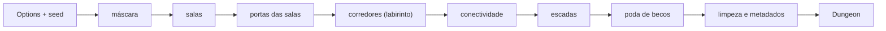

| Função | O que faz |
| --- | --- |
| `Generate(opts)` | O gerador. Recusa opção fora da faixa com `*OptionError` (que diz qual opção; `errors.Is(err, ErrInvalidOption)`) e devolve `ErrNoSpace` quando a máscara não deixa espaço nem para uma sala do menor tamanho. Tamanho par vira o ímpar de baixo; os lados de sala viram ímpares. As opções efetivas voltam em `Dungeon.Options`. |
| `DefaultOptions(seed)` | Os valores padrão (51 × 51, `spread`, `meandering`, `typical`, 2 escadas, 60% de poda). |
| `Check(d)` | Confere os invariantes da especificação que dá para ler no resultado: limites e opções efetivas, paridade e tamanho das salas, sem sobreposição nem quadrado bloqueado, alcançabilidade a partir da entrada, portas (paridade, abertas dos dois lados, 4 quadrados de distância, sem armadilha em porta aberta ou grade), exits em duas salas, corredores sem 2 × 2 e fora de pisos e anéis, escadas, entrada e becos com poda 100. Não confere o determinismo nem a independência dos fluxos (testes à parte). Também roda dentro do `Generate` com `Options.SelfCheck`. |
| `WallsMask`, `Markers`, `PromptOf` / `PromptJSON` | O que o chamador deriva do resultado: a máscara de abertos e paredes (parede é todo quadrado fechado com um aberto entre os 8 vizinhos), um marcador por porta e por escada, e o JSON estruturado para o prompt de imagem (sem pixels e sem sorteio; as ligações diretas entre salas em `connections[]` e as redes de corredor, com as salas de cada uma, em `networks[]`). A imagem em si (só pisos e paredes) é do `maps/dungeonimg` (10.6d). |

O `Dungeon` guarda dados, não bits: `Kinds` (rocha, sala, corredor, porta; o quadrado fora da máscara é rocha), `RoomIDs`, `CorridorIDs`, `Mask` (onde a silhueta deixa), `Rooms` (com `Exits`), `Doors` (tipo `archway`, `closed`, `barred`, `locked` ou `secret`, a marca `Trapped`, o eixo e o que a porta liga), `Corridors`, `Stairs`, `Entrance`, `DiscardedRooms` e `StairsPlaced`. Os tipos de porta casam com os estados da camada de portas (RN-26); uma porta secreta está no resultado, e esconder dos jogadores é da integração.

**Determinismo.** O gerador de números é nosso (xoshiro256\*\* com semente expandida por SplitMix64), não o `math/rand`, cujo fluxo não é estável entre versões do Go. Cada fase tem o próprio fluxo (SplitMix64 da semente com uma constante da fase), então mudar `stairs` não muda as salas e mudar `door_mix` não move nenhuma porta: o tipo e a marca de armadilha de toda porta saem de um fluxo só deles ("door kinds"), e não do fluxo da fase. Os sorteios usam inteiros sem viés (Lemire) e embaralhamentos de Fisher-Yates; a ordem dos sorteios, comentada no código (`DRAW:`), é parte do contrato. Mudar qualquer número que altere a saída pede uma `Version` nova e o arquivo `testdata/golden.json` refeito (um hash da grade por caso). Um vetor de teste pina o gerador. A lista de leituras da especificação que o código fez está no comentário do pacote (`doc.go`).

**Custo.** Medido num Apple M1 Pro (máquina compartilhada, então os tempos oscilam), `Generate` leva 0,1 ms em 31 × 31, 0,25 ms em 51 × 51, 1,5 ms em 121 × 121, 4,4 ms em 199 × 199 e uns 8 ms em 199 × 399 (o maior), contra a meta de 50 ms e o teto de 250 ms; aloca uns 4 MB nesse maior (o resultado em si fica perto de 0,6 MB). Os piores casos construídos em 199 × 399 (salas de 3 × 3 em `tiled` com densidade 200, salas pequenas e densas, máscara com laços) levam de 7 a 12 ms; o de laços a 100% aloca uns 17 MB, porque quase todo quadrado vira uma junção e o resultado lista dezenas de milhares de corredores. A conectividade tenta de novo os grupos órfãos e descarta um por passe sem progresso; com os trilhos das portas entrando no labirinto e as ligações dos dois lados, o padrão descarta 0% das salas (1% numa varredura de 20 000 combinações com máscaras e poucas portas) e os piores casos vistos fazem no máximo uns 8 passes. `PromptOf` é linear: 3,5 a 4,7 ms em 199 × 399 (limite 20 ms). O labirinto usa pilha explícita, sem recursão. Os limites: largura de 15 a 199, altura de 15 a 399 e no máximo 500 salas. O serviço que chamar o gerador deve rodar com um prazo (proposto: 2 s) e recusar pedidos acima dos limites antes de gerar.

**Sala limpa (ADR-0015).** O gerador foi escrito só a partir de uma especificação de comportamento, por quem não viu o código de nenhum outro gerador. A especificação e a nota de origem dela ficam com o PR do gerador, como comentários, e não neste documento nem no código; a auditoria (uma terceira pessoa conferiu que a especificação não tem código, dado nem texto do original) fica no ADR privado.

## Módulo characters: personagens e fichas

O jogador cria o próprio personagem e o mestre cria os NPCs; a ficha volta com os números calculados pelo servidor (MR-003, MR-004, MR-005, MR-006). O personagem de quem entrou por um convite com aprovação espera o mestre aprovar ou recusar (MR-024, RN-15). O código fica em `backend/internal/characters`, e as tabelas estão em [Modelo de dados](dados.md#esquema-implementado).

- **A ficha guarda escolhas, não números.** `CharacterSheet` é uma ficha completa (`FullSheet`: jogador, inimigo e boss) ou básica (`BasicSheet`: minion e NPC de história). A completa guarda chaves de conteúdo, como `class:wizard`; toda escrita passa por `rules.Validate`, e toda leitura por `rules.Derive`, que devolve o `DerivedSheet` (ver [Módulo rules](#módulo-rules-regras-como-dados)). O navegador nunca calcula uma regra.
- **O NPC dá XP (MR-016).** `FullSheet` (inimigo, chefe) e `BasicSheet` (lacaio) têm `challenge_rating` ("0", "1/8", ... "30" ou vazio) e `xp_value` (0 a 1.000.000). A ficha de um jogador recusa os dois com `invalid_argument`. O servidor guarda o que recebe: quem preenche o XP a partir do nível é o editor. O `characters` também soma e subtrai o XP da ficha a pedido do `progression` e diz, em `GetCharacter`, se o personagem pode subir de nível (ver [Módulo progression](#módulo-progression-xp-e-marcos)).
- **O retrato do NPC (MR-031).** `FullSheet` e `BasicSheet` têm `portrait_image_id`: uma imagem da galeria da campanha, conferida pelo `Gallery` (ver [NPCs em cena](#npcs-em-cena-o-palco)). A ficha de um jogador recusa o campo com `invalid_argument`. O campo mora no JSON da ficha, sem migration.
- **A história é à parte** (`CharacterStory`: personalidade, aparência, história, aliados), com a própria trava e a própria chamada (`UpdateCharacterStory`).
- **Revisão.** Ficha e história dividem uma `revision`. Quem salva manda a revisão que leu; se a ficha mudou nesse meio-tempo, a resposta é `aborted` e nada muda.
- **Notas do mestre** ficam numa tabela à parte e só saem por `GetMasterNotes`. Nenhuma outra resposta as carrega (RN-11), e um teste confere cada resposta que o jogador pode pedir.

| Chamada | Mestre | Dono (jogador) | Outro jogador | Não membro | Anônimo | Membro pendente (RN-15) |
| --- | --- | --- | --- | --- | --- | --- |
| `CreateCharacter`, tipo jogador | `permission_denied` | Sim; `failed_precondition` se já tem um vivo (RN-03) | Sim, o próprio | `not_found` | `unauthenticated` | Sim, um só, que nasce pendente |
| `CreateCharacter`, NPC | Sim | `permission_denied` | `permission_denied` | `not_found` | `unauthenticated` | `permission_denied` |
| `GetCharacter`, `UpdateCharacter`, `UpdateCharacterStory` do personagem do jogador | Sim | Sim, dentro das travas abaixo | `not_found` | `not_found` | `unauthenticated` | Só o próprio personagem pendente |
| `GetCharacter`, `UpdateCharacter`, `UpdateCharacterStory` de um NPC | Sim | `not_found` | `not_found` | `not_found` | `unauthenticated` | `not_found` |
| `ListCharacters` | Todos, NPCs e pendentes incluídos | Só os próprios | Só os próprios | `not_found` | `unauthenticated` | Só o próprio pendente |
| `SetStoryEditing`, `MarkCharacterDead` (só personagem de jogador) | Sim | `permission_denied` | `permission_denied` | `not_found` | `unauthenticated` | `not_found` |
| `ApproveCharacter`, `RejectCharacter` (só personagem de jogador) | Sim | `permission_denied` | `permission_denied` | `not_found` | `unauthenticated` | `not_found` |
| `GetMasterNotes`, `UpdateMasterNotes` | Sim | `permission_denied` | `permission_denied` | `not_found` | `unauthenticated` | `not_found` |
| `GetLevelUpOptions`, `PreviewLevelUp` (só enquanto `can_level_up`) | Sim | Sim | `not_found` | `not_found` | `unauthenticated` | `not_found` |
| `RollLevelUpHitPoints`, `LevelUpCharacter` (só enquanto `can_level_up`) | `permission_denied` | Sim | `not_found` | `not_found` | `unauthenticated` | `not_found` |
| `ListLevelUps` | Sim | `permission_denied` | `permission_denied` | `not_found` | `unauthenticated` | `not_found` |
| `ContentService.ListContent`, `GetSpellDetails` | Sim | Sim | Sim | `not_found` | `unauthenticated` | Sim |
| `ContentService.ListSpells`, `ListCreatures`, `GetCreature`, `ListTrapPresets`, `ListLightPresets` | Sim | Sim | Sim | `not_found` | `unauthenticated` | `not_found` |
| `CharacterService.CreateNpcFromCreature` | Sim | `permission_denied` | `permission_denied` | `not_found` | `unauthenticated` | `not_found` |
| `TableContentService.ListTableEntries` | Sim, com todas as entradas e as contagens | Sim, só as que não estão arquivadas | Sim, idem | `not_found` | `unauthenticated` | `not_found` |
| `TableContentService.CreateTableEntry`, `UpdateTableEntry`, `ArchiveTableEntry`, `UnarchiveTableEntry`, `GetClassTableDefaults`, `GetEffectMenu` | Sim | `permission_denied` | `permission_denied` | `not_found` | `unauthenticated` | `not_found` |

Um membro que não pode ver um personagem (o de outro jogador, ou qualquer NPC para um jogador) recebe `not_found`, com a mesma mensagem de um personagem que não existe; assim ninguém descobre IDs de NPC. O teste `TestAuthorizationMatrix` chama cada método como cada um dos seis e falha se um método novo aparecer sem linha na tabela.

**As travas do jogador (RN-01).** O dono edita a ficha enquanto ela é rascunho, ou enquanto espera a aprovação do mestre (pendente, MR-024). Depois que uma sessão começa, a ficha trava; a história também, e o jogador só a edita enquanto o mestre libera (`SetStoryEditing`), até a próxima sessão começar. O mestre edita tudo, sempre. Os números calculados nunca são editáveis.

| Motivo (`CharacterBlockedReason`) | Quando |
| --- | --- |
| `SHEET_LOCKED` | O jogador tenta editar a ficha depois que uma sessão começou. |
| `CHARACTER_DEAD` | O jogador tenta editar a ficha de um personagem morto (RN-03). |
| `LIVING_CHARACTER_EXISTS` | O jogador tenta criar um segundo personagem vivo na campanha (RN-03). O detalhe traz o ID do personagem vivo. |
| `STORY_LOCKED` | O jogador tenta editar a história de um personagem travado ou morto sem a liberação do mestre. |
| `NOT_PENDING` | O mestre tenta recusar um personagem que não espera aprovação (MR-024): aprovado, o personagem fica na campanha. |
| `AWAITING_APPROVAL` | O mestre tenta marcar como morto um personagem que ainda espera aprovação (MR-024): ele aprova ou recusa antes. Também vale nas chamadas do subir de nível. |
| `CANNOT_LEVEL_UP` | Uma chamada do subir de nível guiado (MR-040) num personagem que não "Pode subir de nível" (RN-12), que é NPC ou que está no nível 20. Um personagem morto responde `CHARACTER_DEAD`. |
| `DICE_FORCED_PHYSICAL` | `RollLevelUpHitPoints`, ou `LevelUpCharacter` com o dado rolado no app, numa campanha em que todos rolam dado físico (RN-18). |
| `DICE_FORCED_IN_APP` | `LevelUpCharacter` com o dado físico digitado, numa campanha em que todos rolam no app (RN-18). |

Esses motivos vêm no detalhe `CharacterBlocked` do `failed_precondition`, e ganham de uma revisão velha: tentar de novo não resolveria. Um `invalid_argument` diz o campo, com o caminho do proto (por exemplo, `sheet.full.base_scores.intelligence`), e nunca repete o que a pessoa digitou.

**A ficha básica (NPC) rola iniciativa e ataca com dados de verdade.** `BasicSheet` guarda `initiative_bonus` (−10 a +20) e até 3 `BasicAttack`: nome (1 a 40 caracteres), bônus de ataque (−10 a +20), dados do dano (1 a 20 dados de 4, 6, 8, 10 ou 12 faces), bônus do dano (−20 a +40), tipo de dano (`DamageType`, os 13 do SRD) e alcance em pés (0 a 600; 0 é corpo a corpo, 1,5 m). O alcance está na API, mas a tela ainda não tem campo para ele: ela devolve o valor como veio. Cada erro é um `invalid_argument` com o caminho do campo (`sheet.basic.attacks[1].damage_dice_sides`). Os campos antigos `attack_bonus` e `damage` (texto livre, como "1d6+2 cortante") ficam no `.proto` só para ler fichas salvas antes da Etapa 6. **A conversão acontece na leitura, sem migration:** `loadSheet` chama `upgradeLegacyAttack` (`legacy_attack.go`), uma função pura que lê "NdS+K tipo", em português ou inglês, e a transforma num ataque chamado "Ataque" com o bônus antigo, zerando os campos antigos. Se o texto não for lido (sem tipo, dado inválido, número fora do limite), os campos antigos continuam como estão e a tela mostra "Dano antigo: …" para o mestre refazer. O JSON guardado só muda quando o mestre salva de novo, e quem salva com ataques tem os campos antigos limpos pelo servidor (`cleanBasicSheet`); sem ataques, o texto antigo é mantido, para salvar nunca apagá-lo. Uma migration de dados não ganharia nada: a leitura é barata, vale para todo leitor (ficha, sessão, combate) e não tem como deixar uma ficha pela metade.

**Texto livre.** O servidor tira espaços das pontas; campos de uma linha recusam quebra de linha e caracteres de controle, e os de várias linhas aceitam quebra de linha e tabulação. Os limites, em caracteres, estão nos comentários de `characters.proto`.

**Respostas e GET.** Como no `campaigns`: toda resposta, inclusive os erros, sai com `Cache-Control: no-store`, e toda leitura leva um ID, então é `IDEMPOTENT` e só aceita POST.

**O `ContentSource`: de onde vem o conteúdo (Etapa 10, fatia 10.1a; MR-025, RN-23).** Toda leitura do conteúdo de regras no `characters` passa por um `ContentSource` (`contentsource.go`), nunca por um `*rules.Content` guardado no serviço:

```go
For(ctx context.Context, tx pgx.Tx, campaignID string) (*rules.Content, TableRules, error)
```

- **Devolve o conteúdo e as regras da mesa da campanha.** `TableRules` são as escolhas da mesa (RN-23, RN-24), e o valor zero dela são os padrões do SRD que o código já assumia (o jogador escolhe rolar ou a média no PV do nível, todos os jeitos de atributo, crítico dobra os dados, testes contra a morte visíveis, combate com mapa, mapas novos sem névoa, sem lembretes): cada campo diz o que a mesa muda, nunca o que o SRD já faz. **O tipo é de `platform/tablerules`** (`tablerules.Rules`, um valor sem comportamento), e o `characters.TableRules` é um apelido dele: desde a fatia 10.4a o `campaigns` guarda as regras, o `characters` as lê pelo `ContentSource`, o `maps` e o combate (fatia 10.4b) também precisam delas, e um pacote neutro deixa os módulos compartilharem o tipo sem importar um ao outro. Ver [As regras da mesa](#as-regras-da-mesa-mr-025-rn-24).
- **Recebe a transação de quem chama** (`nil` fora de uma): a implementação da 10.1c lê a revisão do conteúdo da campanha dentro dela, pela regra do PR #121 (nenhuma leitura pelo pool dentro de `db.InTx`). Por isso quem está numa transação passa o `tx`, e o `campaignID` vem do que a chamada já sabe (a associação, a linha lida, o argumento da interface), nunca de uma leitura a mais.
- **As regras vêm do `campaigns`** (`TableSource`, desde a 10.4a): `TableRulesReader.StoredTableRules`, que o `campaigns.Service` implementa e o `cmd/api` liga, lidas pelo `tx` que a chamada recebe (uma leitura da chave primária de `campaign_table_rules`, que sem linha dá o valor zero). O conteúdo, desde a 10.1c, é o SRD mais as entradas da mesa (abaixo). O `SRDSource`, que nunca toca o banco, continua para quem não precisa das regras (testes). Cada leitura do conteúdo custa essa leitura a mais; `Service.TableRulesFor(ctx, tx, campaignID)` expõe só as regras. O combate não passa por aqui: ele lê as regras por `play.CombatDefaults` (ver [As regras da mesa](#as-regras-da-mesa-mr-025-rn-24)).
- **A fonte de verdade é o `TableSource`** (fatia 10.1c, ver [O conteúdo da mesa ao vivo](#o-conteúdo-da-mesa-ao-vivo-etapa-10-fatia-101c)): o SRD mais as entradas que o mestre cadastrou **e** as regras da mesa (um só objeto: `NewTableSource(pool, srd, campaigns)`; `ContentFor` pula a leitura das regras). O `SRDSource` (o SRD para toda campanha, sem tocar o banco) continua só para quem não tem banco. Os pontos de chamada não mudaram.
- **O catálogo do `ListContent` é montado por conteúdo**, não mais na partida: o mesmo conteúdo dá o mesmo catálogo, e o conteúdo de uma mesa terá o dele. O cache guarda no máximo 8 catálogos (o orçamento de 8 conteúdos do plano), o mais antigo sai primeiro, para que os conteúdos de uma mesa que foi editada não fiquem vivos.
- **Um conteúdo por requisição.** Uma requisição pede o conteúdo uma vez e o passa adiante (`shapedVitals`, `writeWildShape`, `levelUpTarget.content`); nas vistas do combate, a costura `CombatRoster.ContentNames(ctx, tx, campaignID)` devolve uma função de nomes ligada a um conteúdo, e o `play` a pede uma vez por vista. Uma escrita pede o conteúdo **antes** da transação (ou dentro dela, com o `tx`), nunca depois do commit: uma falha ali faria o cliente repetir uma escrita que já valeu.
- **Ajudantes que recebem o conteúdo** (`derive`, `maxima`, `combatCharacter`, `checkSheet`, `creatureOf`...) continuam recebendo um `*rules.Content`: quem chama o pega do `ContentSource` da campanha. Os leitores internos de vitais (`getVitals`, `shapedVitals`) passam a receber o `tx` em vez da `Queries`, para poderem pedir o conteúdo na mesma transação.
- **Os poucos pontos sem campanha ficam no SRD** (`Config.SRD`): os nomes das condições (RN-22) e das perícias de uma cena, e as predefinições de armadilhas e luzes (`ListTrapPresets`, `ListLightPresets`; o `maps` confere as chaves delas contra o SRD), que nenhuma mesa muda. O `maps` também continua no SRD puro (`Config.Rules`): lê só predefinições, tipos de dano, condições e perícias.
- **As costuras com o `play` ganharam campanha e transação** onde liam o conteúdo sem saber de qual campanha: `CombatRoster.NamePT` (virou `ContentNames`, que devolve o nomeador do conteúdo), `CreatureSheet`, `CreatureTurnOptions`, `CreatureSave` e `CreatureEyes` agora recebem `(ctx, tx, campaignID, ...)` e devolvem erro. `Conditions()` e `SceneCheckName` ficam como estavam (SRD).

**Por que o `ContentService` fica aqui.** A ADR-0008 punha o conteúdo da mesa no `campaigns`; a ADR-0018 (05/10/2026) o deixa aqui, no `characters`, que já serve o catálogo: na Etapa 10, o conteúdo da mesa vira uma camada por campanha sobre o SRD, lida por um `ContentSource` dentro da transação de quem chama (ver [MR-025](produto/historias.md#mr-025-cadastrar-conteúdo-da-mesa) e [RN-23](produto/regras.md)). O conteúdo de uma campanha é o SRD embutido no `rules` mais as entradas da mesa (`campaign_content`), e o `ContentSource` o devolve; o catálogo é montado uma vez por conteúdo e servido pelo `characters`. A requisição já leva o `campaign_id`, porque o conteúdo da mesa vai ser por campanha (decidido pelo Samuel em 29/09/2026). Cada classe que conjura leva, em `ClassSpellcasting.max_spell_level_by_level`, o maior círculo de magia que ela alcança em cada nível (calculado a partir dos espaços de magia da tabela da classe, com `rules.MaxSpellLevelFromSlots`), e o editor só filtra as listas de magias por essa tabela; quem valida de verdade, ao salvar, continua sendo o servidor.

### O conteúdo da mesa ao vivo (Etapa 10, fatia 10.1c)

O conteúdo que o mestre cadastra (MR-025, RN-23, ADR-0018) é guardado, servido e **vale na hora**, no `characters`. O motor é o da [fatia 10.1b](#o-conteúdo-da-mesa-contentwith-mr-025-rn-23-adr-0018-fatia-101b); esta fatia põe em volta dele o armazenamento, a API e a leitura ao vivo.

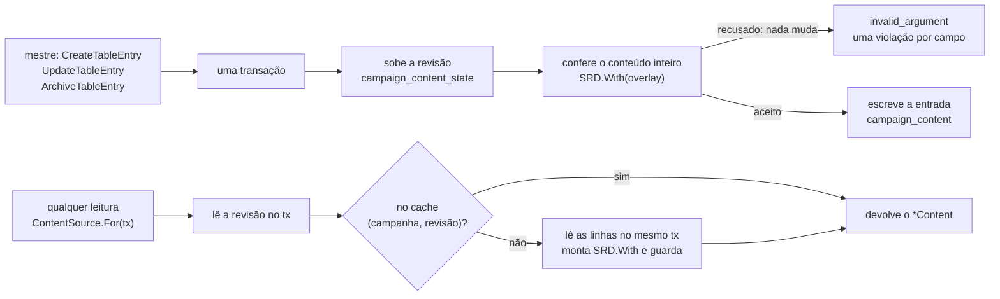

| Peça | O que faz |
| --- | --- |
| Armazenamento | `campaign_content` (uma linha por entrada, o `data` é o protojson da mensagem do tipo) e `campaign_content_state` (a revisão da campanha). Está no `characters`, e não em `campaigns.content_revision` como a ADR-0018 dizia: o `characters` não escreve uma coluna de outro módulo. Ver [Dados](dados.md). |
| Os protos | `rules/v1/table_content.proto`: uma mensagem por tipo (`TableClass`, `TableSubclass`, `TableRace`, `TableSubrace`, `TableBackground`, `TableSpell`), um para um com os tipos `Table*` do `rules`, e o `TableEntry`, que as leituras devolvem. As escritas e a leitura em inteiro são o `TableContentService`; o catálogo continua sendo o `ContentService.ListContent`, que já traz as entradas da mesa (e a marca `archived`). Os dois serviços ficam em arquivos diferentes porque o `rules.proto` não pode importar o que importa o `rules.proto`. |
| Escritas (só o mestre) | `CreateTableEntry`, `UpdateTableEntry`, `ArchiveTableEntry` e `UnarchiveTableEntry`. Cada uma é **uma transação** que começa subindo a revisão (e por isso duas escritas da mesma campanha rodam uma depois da outra), lê todas as entradas, aplica a mudança e confere **o conteúdo inteiro da campanha** com `SRD.With`: um conteúdo recusado muda nada (a transação volta, a revisão também). O erro é `invalid_argument` com o detalhe `TableContentRefusal`, uma `TableContentViolation{field, reason}` por erro do motor (`OverlayError`), com o caminho nos nomes do próprio corpo (`table_class.levels[4].features[0].effects[1].value`): os editores apontam o campo e o texto em português é do web, pelo código. O servidor acrescenta `immutable` (tipo, chave, classe ou raça mãe mudaram, uma chave de característica que a entrada nunca teve, ou **uma magia que passa de truque a magia de círculo, ou o contrário**), `duplicate_name` (outra entrada do tipo tem o nome, sem distinguir caixa) e `size_limit` (64 KiB). Uma entrada obsoleta (`expected_revision` diferente da `revision` da entrada) é `aborted` com `TableContentBlocked` `STALE`. **Uma entrada arquivada ainda se edita** e continua arquivada; arquivar duas vezes é `ARCHIVED`, desarquivar uma que não está é `NOT_ARCHIVED`. **Arquivar e desarquivar não são mudanças da entrada**: não mexem na `revision` nem no `updated_at` dela (as fichas que a usam "continuam com ela", sem aviso), mas sobem a revisão da campanha, para o cache; a data do arquivamento é `archived_at`. |
| As chaves | A da entrada nasce do nome (sem acento, `a-z0-9-`, até 60, com `-2`, `-3`... se já existe; as palavras reservadas do motor viram uma palavra só) e nunca muda, nem quando o nome muda. A das características é do servidor: `feature:class-<início do nome>-<hash>--<nome da característica>@mesa` (e `subclass`, `race`, `subrace` e `background` no lugar de `class`, com `trait:` e `background-feature:` nos três últimos): o início do nome da entrada tem até 16 caracteres e o hash são 6 caracteres de um SHA-256 da chave **inteira** da entrada, então duas entradas de nomes longos que começam igual nunca fazem a mesma chave, e a característica ainda tem lugar dentro dos 60 caracteres do motor; o `--` nunca aparece num nome, então as duas partes não se confundem. **Uma característica mantém a chave enquanto existe**: o editor a devolve na atualização, e, se não devolver, a de mesmo nível e nome a retoma; só uma sem chave e sem par ganha uma nova. Uma chave que a entrada nunca teve é recusada (`immutable`), para um pedido não poder tomar a característica de outra entrada. |
| `ListTableEntries` | As entradas em inteiro, por tipo e nome. O mestre recebe todas (as arquivadas também, com `archived_at`) e, em cada uma, **quantas fichas a usam** ("Em uso por N fichas"); o jogador recebe as que não estão arquivadas, por inteiro (números e efeitos, pergunta 83), e nunca uma contagem; um membro pendente não a lê (ele só precisa do catálogo). Até a 10.1d, tudo que não está arquivado está "ligado". |
| `ListContent` e o que um jogador nunca recebe de uma entrada arquivada | O catálogo da campanha: o SRD mais a mesa, com `content_version` `srd51@...+fx.N+mesa.<revisão>` e `table_revision`. As entradas arquivadas só vão para o mestre (com `archived`); o catálogo de jogadores é uma cópia (`proto.Clone`, filtrando as seis listas) sem elas. **`GetLevelUpOptions`** não oferece a um jogador uma subclasse arquivada, a não ser a que a própria ficha já tem (o mestre a recebe com `LevelUpSubclass.archived`). **`GetSpellDetails`** responde `not_found` a um jogador ou membro pendente para uma magia arquivada, a não ser que uma ficha **dele** na campanha a use. **Nenhuma chave arquivada chega a um jogador, nem por referência**: o catálogo dele, `ListTableEntries` (que também tira as classes e a lista de uma conjuração, as magias que um efeito concede e as sempre preparadas de cada corpo), os detalhes da magia e as opções de subida de nível limpam as chaves arquivadas das listas de referência (`Spell.class_keys`, `list_class_key`, `TableSpell.class_keys`, `TableCasting.list_from`, `TableEffect.spells`...), e uma subclasse ou sub-raça cuja classe ou raça mãe está arquivada some, a não ser que uma ficha do jogador a use (no `ListTableEntries`; no catálogo, compartilhado entre os jogadores, some sempre). Os catálogos novos dizem o que a 10.1b acrescentou para quem lê: `Race.choice_bonuses`, `Subclass.spellcasting` (o conjurador de um terço), `ClassSpellcasting.list_class_key` (a lista que a classe reusa) e `Background.equipment_pt`. |
| O `TableSource` | Um só objeto para o conteúdo e as regras (`tablesource.go`; `NewTableSource(pool, srd, campaigns)`). `For(ctx, tx, campanha)` **lê a revisão dentro do `tx` de quem chama** (a regra do #121) e devolve `SRD.With(overlay)` **e** as regras guardadas (`TableRulesReader.StoredTableRules`, pelo mesmo `tx`); `ContentFor` pula as regras. Sem linha de revisão (a campanha sem conteúdo) devolve o próprio SRD, sem montar nada. **Fora de uma transação**, um acerto custa a leitura da revisão pelo pool; um erro abre **uma transação de leitura** que lê de novo a revisão e as linhas, para o conteúdo guardado sob uma revisão ser o dessa revisão. **A ordem contra uma escrita de ficha:** `CreateCharacter` e `UpdateCharacter` leem o conteúdo antes da transação (a validação precisa dele), e **dentro dela o leem de novo**; se a revisão mudou nesse meio-tempo (um arquivamento, uma edição), a ficha é conferida outra vez com o conteúdo novo, e a escrita vale para um só dos dois lados. A `LevelUpCharacter` já lê o conteúdo dentro da transação. O conflito de serialização (40001) é repetido pelo `db.InTx`. |
| O cache | Por **(campanha, revisão)**, no máximo **8 conteúdos**, o menos recente sai primeiro. Um acerto custa a leitura da revisão (uma consulta indexada). Um erro **monta o conteúdo só para quem pediu**, lendo as linhas no mesmo `tx` (então são as da revisão que ele leu), sem `singleflight` compartilhado: uma requisição que segura uma conexão esperando por outra que precisa de uma é como o pool trava. Duas que erram ao mesmo tempo montam as duas, e a segunda a guardar vence (o resultado é o mesmo). **Uma escrita nunca preenche o cache**: o que ela monta ainda pode voltar atrás, e a revisão seguinte seria outra coisa. O custo de memória e o tempo estão em [Operação](operacao.md#o-cache-do-conteúdo-da-mesa). |
| "A classe mudou" (pergunta 80, E10-02 estado 8) | A mudança vale na hora, **também nas fichas travadas**. Cada ficha guarda, **dentro do próprio documento** e escritos por `checkSheet` (criar, editar e subir de nível; o que o cliente manda é ignorado), a revisão do conteúdo (`FullSheet.content_revision`), os avisos que ela já tinha (`known_issues`, cada um por **código, campo e frase exata**: "Faltam 1 perícias" que vira "Há 3 perícias; escolhe 2" é outro aviso) e, para uma entrada ainda sinalizada, a revisão em que a ficha estava em dia com ela (`content_baselines`). **Cada aviso do `Derive` leva as chaves da mesa de que depende** (`Issue.Keys`: a entrada do campo a que aponta, e as entradas de que o número é calculado, como as classes numa contagem de perícias, a raça num bônus a distribuir, todas as chaves numa fórmula que falhou). Em **toda leitura**, `Content.ChangedSince` lista as entradas da mesa que a ficha usa e que mudaram depois (cada uma guarda a revisão e a data, `updated_at`, da própria última mudança), e o servidor mostra, **para cada entrada mudada, só os avisos novos cujas chaves a incluem**: a `DerivedSheet` traz `changed_content` (a chave, o nome, o campo, as revisões, **a data da mudança** e **as frases exatas** desses avisos) e uma `Issue` `table_content_changed` por entrada. Um aviso de outra entrada nunca é atribuído a ela (o texto de um antecedente que muda não carrega o aviso de uma magia). O aviso **some sozinho** quando nada mais fica ligado a ele (o mestre desfaz a mudança, ou a ficha é ajustada); uma mudança que não deixou aviso novo naquela ficha (um texto) não mostra nada; não há "dispensar". **Salvar a ficha não o limpa** (um renome do jogador ou uma edição sem relação do mestre mantém a faixa): ao salvar, os avisos que estavam sinalizados e continuam de pé ficam **fora** de `known_issues`, e a entrada guarda a revisão-base em `content_baselines`, então a leitura seguinte os sinaliza de novo; só corrigir o que o aviso diz o limpa. É um aviso, **nunca um erro do `Validate`**: nenhuma outra edição é recusada por ele, só o dono e o mestre o leem, e o jogador nunca recebe o histórico das mudanças nem quem as fez. **Para o `Validate` nunca recusar uma edição sem relação por causa de uma mudança**, o servidor recusa na própria entrada a única mudança que o `Validate` confere contra a ficha: uma magia passar de truque a círculo (a ficha guarda os dois em listas diferentes). As outras (a conjuração de uma classe ou subclasse, o número de bônus à escolha de uma raça, as perícias de um antecedente...) só geram avisos do `Derive`, nunca um erro do `Validate`. O `UpdateTableEntry` devolve também `affected_characters`: as fichas que usam a entrada e **ficaram com avisos novos ligados a ela**, com o nome do jogador, para a lista "Fichas com aviso" do mestre. |
| Entrada arquivada como escolha nova | O `CreateCharacter` e o `UpdateCharacter` recusam uma chave arquivada que a ficha nova tem e a de antes não tinha (`Content.ArchivedKeys`, comparando as duas; a de uma criação é comparada com nada): `failed_precondition` com o detalhe `CharacterBlocked` `ARCHIVED_CONTENT` e a `content_key`. O `LevelUpCharacter` e o `PreviewLevelUp` recusam com `LEVEL_UP_REFUSAL_REASON_ARCHIVED_CHOICE` (e o campo). A ficha que já usa a chave continua funcionando (`Derive`, `Validate`, nomes e subida de nível). |
| Ficha com chave `@mesa` não muda de campanha | `CheckSheetCanMove(sheet)` (`failed_precondition`, `CharacterBlocked` `TABLE_CONTENT_STAYS`, com a primeira chave). **Nada o chama ainda**: não existe cópia nem reuso de personagem entre campanhas (MR-021, MR-022), e quem os fizer tem de chamá-lo antes de escrever. |
| Fora daqui | O `maps` continua no SRD. Os interruptores por opção ("Opções para os jogadores", 10.1d) e o que é específico de cada tipo (o combate das magias da mesa e o servidor da classe e da subclasse são das fatias 10.2 e 10.3, já feitas; as telas dos editores, as 10.11, 10.12 e 10.12b) vêm depois. Uma escrita ainda não avisa a sessão ao vivo: o próximo `GetCharacter` e a próxima leitura de conteúdo já veem a revisão nova. |

**Testes** (`tablecontent_test.go`): `TestTableContentEveryKindIsCreatedUpdatedArchivedAndBroughtBack` (os seis tipos pelas quatro escritas, com a chave estável num renome), `TestTableContentFeatureKeysAreStable`, `TestTableContentKeysNeverChangeAndNamesAreUnique`, `TestTableContentRefusalsAreFieldViolations`, `TestTableContentLimits` (64 KiB e 300), `TestTableContentAccess` (mestre, jogador, pendente e quem é de fora), `TestTableContentStaleAndRevision`, `TestTableContentIsLive` (uma escrita aparece na leitura seguinte, também dentro de uma transação com o pool de uma conexão, e o cache nunca passa de 8), `TestTableContentConcurrentWrites` (oito escritas ao mesmo tempo, a revisão termina em oito), `TestTableContentChangeShowsOnTheSheet` (o aviso, as frases, a data, e some sozinho), `TestTableContentAnUnrelatedEditIsNeverRefusedForAChange`, `TestTableContentEveryMechanicalChangeLetsTheSheetSave`, `TestTableContentASpellNeverCrossesCantripAndLeveled`, `TestTableContentArchivedIsNeverANewChoice`, `TestTableContentArchivedSubclassesAreNotOffered`, `TestTableContentArchivedSpellsAreNotShown`, `TestTableContentNeverNamesAnArchivedKeyToAPlayer`, `TestTableContentAnIssueIsBlamedOnItsOwnEntry`, `TestIssuesAreToldApartByTheirWholeIdentity`, `TestTableContentWritesAreOrderedAgainstContentWrites` (um arquivamento entre a leitura e a transação), `TestTableContentFeatureKeysOfLongNames`, `TestTableContentTheClientNeverSetsTheContentRevision` e `TestSheetsThatUseTableContentStayInTheirCampaign`.

### Os alvos das magias e a página "Magias" (Etapa 10, fatia 10.2)

Toda magia, do SRD ou da mesa, diz **quem ela pega**, e a página "Magias" dos jogadores (MR-045, E10-11) lê isso, a busca e os filtros do servidor (MR-025, RN-23). O código novo está em `rules/spelltarget.go`, `rules/spelllist.go`, `characters/spelllist.go` e `characters/spelldetails.go`.

**O alvo de uma magia do SRD.** O importador (`cmd/srdimport`) lê o `area_of_effect` do 5e-database (a forma e o tamanho em pés) para `spells.json` (`area_type`, `area_size_ft`): 88 das 319 magias o têm, e o importador recusa uma forma que não é cone, cubo, cilindro, linha ou esfera e um tamanho que não é múltiplo de 5. O carregamento confere de novo. `srdTarget` decide, nesta ordem (a primeira linha é um arquivo escrito à mão, `effects/spell_targets.json`):

| Quando | O alvo |
| --- | --- |
| A magia está em `effects/spell_targets.json` | O que o arquivo diz (ver abaixo) |
| A magia tem área estruturada | `TargetArea`, com a forma e o tamanho. O estruturado manda: o texto não é lido. |
| Mísseis Mágicos e Raio Ardente | `TargetCreatures`, 3 e mais 1 por círculo acima (um dardo ou um raio cada, também no `targets_per_level` que o app lê: o Raio Ardente do 3º círculo tem 4 raios) |
| Ataque de magia | `TargetCreature` |
| O texto do SRD diz área ("20-foot radius", "up to three creatures", uma magia de Pessoal que causa dano ou pede resistência...) | `TargetCreatures` sem número (`Count` 0: quem conjura escolhe quantas; o mestre julga) |
| Alcance Pessoal | `TargetSelf` ("Só quem conjura") |
| O resto | `TargetCreature`; com `PerSlotLevel` 1 quando "em níveis superiores" diz "one additional creature" |

O texto de cada alvo é `SpellTarget.LabelPT()`, mandado em `SpellDetails.target.label_pt`: "Uma criatura", "Várias criaturas", "Só quem conjura" ou a área ("Cone de 4,5 m", "Esfera de 6 m", "Linha de 30 m"), com os metros de `MetersPT` (5 ft = 1,5 m, vírgula, sem casa decimal quando é inteiro, em quilômetros a partir de 1.000 m). O app escreve o resto da magia (tempo, alcance "Pessoal", "Toque" ou a distância, duração, componentes) como já escrevia (`spell-details-format.ts`).

**O arquivo à mão, `effects/spell_targets.json`.** O banco e o texto erram em algumas magias, e o arquivo as corrige com as nossas palavras. Os tipos são fechados (`creature`, `creatures` com `count` e `per_slot_level`, `area` com forma e tamanho, `self` e `none`, "nenhuma criatura": um ponto, um objeto, um lugar, sem ninguém para escolher), toda chave é uma magia do SRD (o carregamento recusa o resto), `label_pt` troca só o texto da página, e o arquivo entra na revisão do conteúdo (fx.14). Os tipos `self` e `none` valem "ninguém para escolher": o `play` lista só quem conjura, recusa outro alvo (`link.Spell.CasterOnly`) e não rola a resistência de ninguém (Contato com Outro Plano pede a resistência de quem conjura). As entradas:

| Tipo | Magias |
| --- | --- |
| Uma criatura | `telekinesis` |
| Só quem conjura | `detect-evil-and-good`, `detect-magic`, `detect-poison-and-disease`, `speak-with-plants`, `branding-smite`, `divine-favor`, `flame-blade`, `contact-other-plane`, `magic-jar`, `scrying`, `wish` |
| Nenhuma criatura | `arcane-eye`, `magnificent-mansion`, `dancing-lights`, `druidcraft`, `fabricate`, `light`, `major-image`, `minor-illusion` |
| Várias criaturas, com o número do SRD | `bless` e `bane` (3, mais 1 por círculo), `mass-healing-word` e `prayer-of-healing` (6), `mass-suggestion` (12), `telepathic-bond` (8), `water-walk` (10), `wind-walk` (você e 10), `astral-projection` (você e 8), `heroes-feast` (12) |
| Área que o banco não tem | `hypnotic-pattern` (cubo de 9 m), `plant-growth` (esfera de 30 m), `purify-food-and-drink` (esfera de 1,5 m), `glyph-of-warding` (esfera de 6 m) |
| Só o texto muda | `flame-strike` ("Cilindro de 3 m de raio": o banco traz 40 ft, a altura), `forbiddance`, `mirage-arcane`, `teleportation-circle` (3 m de diâmetro), `guards-and-wards` e `fire-storm` (nada de cubo falso) |

**Onde a área estruturada e o texto ainda discordam.** O `characters/combatspells.go` lia só o texto. Com o estruturado, 11 magias passam a ser área (qualquer número de alvos) e antes pegavam um alvo: `blade-barrier`, `control-water`, `forcecage`, `guardian-of-faith`, `hallow`, `prismatic-wall`, `private-sanctum`, `storm-of-vengeance`, `wall-of-fire`, `wall-of-thorns` e `wind-wall` (o `TestStructuredAreasAgainstTheText` fixa a lista). Outras 10 do banco tinham área e o arquivo corrigiu (as que antes pegavam um alvo, como `telekinesis` e `arcane-eye`, e as que eram "só quem conjura" por serem Pessoal, como `detect-magic`). No sentido contrário, as magias que só o texto chama de área e o arquivo não corrige (`compulsion`, `enthrall`, `mass-heal`, `dispel-evil-and-good`, `eyebite`, as de convocação) ficam como estavam, "várias criaturas" sem número, e como o mestre nunca é limitado pelo número de alvos, isso não trava ninguém.

**A página "Magias" (`ContentService.ListSpells`).** Só o membro ativo (o pendente recebe `not_found`, como no `ListCreatures`), `IDEMPOTENT`, com `query`, `class_key`, `levels`, `school_keys`, `character_id`, `page_size` (1 a 400, 100 por padrão) e `page_token`; devolve a `Spell` leve, em ordem de nome em português, com `total`. Uma magia é uma linha só, a do SRD ou a da mesa, e a descrição inteira continua sendo o `GetSpellDetails`.

- **A busca** acha o nome em português ou em inglês, sem acento e sem diferenciar maiúscula ("maos" acha Mãos Flamejantes).
- **A classe** é a lista dela: as magias que a citam, ou a lista que a classe da mesa reutiliza. Uma chave de subclasse que conjura (o conjurador de um terço) vale a lista da classe de onde ela conjura. Uma classe sem lista dá uma lista vazia.
- **"Só as que posso aprender"** (`character_id`): a lista de cada classe que conjura na ficha, até o círculo mais alto dessa classe, truques inclusive; numa multiclasse, a lista de cada uma pelo nível nela. O dono da ficha e o mestre podem pedir; outro jogador recebe `not_found`, e uma ficha básica, `failed_precondition`.
- **Quem vê o quê:** o jogador nunca recebe uma magia da mesa arquivada, nem a chave de uma classe arquivada em `class_keys`; o mestre recebe as arquivadas, com a marca `archived`. A regra mora num só ponto (`SpellFilter.Hidden`): os interruptores de "Opções para os jogadores" (fatia 10.1d) entram nele.

**A magia da mesa em combate.** Ela passa pelo mesmo `CombatSpell`, que lê o conteúdo da campanha: o ataque (`attack`, um d20 por alvo), a resistência (metade ou nada), o dano por círculo ou por degrau do truque, a cura com o modificador, a concentração, os espaços e o registro valem como numa magia do SRD, com o nome em português no registro. O alvo vem da magia: `link.Spell` ganhou `TargetCount` e `TargetPerLevel`, e o `maxTargetsOf` os usa antes de olhar o tipo da magia (uma magia da mesa com ataque e três criaturas rola três ataques). Pessoal alcança só quem conjura ou uma área que sai dele (o `With` recusa Pessoal com "uma criatura" ou "várias"). As "Magias que leem PV" e as de convocação ficam só no SRD: a chave da mesa não está em `effects/spells.json`, então nenhuma magia da mesa lê PV nem convoca, e o `GetSpellDetails` dela não traz `hit_point_effect`. O `GetTurnOptions` ganhou `SpellTargets.targets_per_level`, quantos alvos a mais por círculo (1 no SRD que diz "one additional creature"; o número do mestre na da mesa).

**O antecedente "Outro".** O antecedente de texto livre segue a regra do SRD 5.1 "Customizing a Background" (pergunta 82): o `CustomBackground` da ficha ganhou `proficiency_keys` (duas ferramentas ou idiomas, em qualquer mistura), `feature_name` e `feature_text` (a característica, nas palavras do jogador) e `equipment` (texto). O `Validate` confere os limites (no máximo 2 ferramentas ou idiomas, cada um uma proficiência de ferramenta ou um idioma do SRD, sem repetir; nome da característica até 40 caracteres; texto até 1.000; equipamento até 500), e o que falta é um aviso do `Derive` (`missing`, um por parte: as ferramentas ou idiomas, a característica e o equipamento), nunca um erro: o app é um assistente. Os três avisos só aparecem quando a ficha já tem alguma das partes novas, isto é, quando o editor que as escreve a salvou: uma ficha de antes não ganha aviso nenhum. Um idioma que a raça já dá vira um aviso (ele gasta uma das duas escolhas à toa). O `Derive` aplica: as ferramentas viram proficiências, os idiomas entram em `Languages`, a característica entra em `Features` (`background-feature:custom`, de origem `background:custom`) e o equipamento sai em `DerivedSheet.background_equipment_pt`, que também mostra o equipamento de um antecedente da mesa. A subida de nível não muda nada disso (`full.custom_background` é travado).

**Raças, sub-raças e antecedentes da mesa.** Os tipos da fatia 10.1b já carregam tudo o que o editor E10-01 mostra: tamanho, deslocamento, visão no escuro, bônus de atributo e o "+2 e +1 à escolha", idiomas e quantos escolher, e os traços como características com efeito do menu; a sub-raça soma bônus e traços; o antecedente, as duas perícias, as ferramentas do SRD, os idiomas a escolher, o equipamento em texto e a característica como nota. Não faltou campo: a única mudança é que o equipamento de um antecedente da mesa agora chega ao `Derive` (`background_equipment_pt`).

### As classes e subclasses da mesa de ponta a ponta (Etapa 10, fatia 10.3)

O servidor dá ao editor da classe (E10-02) tudo de que ele precisa, e os fluxos de uma classe da mesa (criar, subir de nível, jogar e mudar) funcionam de ponta a ponta; o `web` (10.12 e 10.12b) **desenha o que o servidor manda e não calcula nenhuma tabela nem escolhe nenhum menu** (MR-025, RN-23, ADR-0018). O motor e o armazenamento são das fatias [10.1b](#o-conteúdo-da-mesa-contentwith-mr-025-rn-23-adr-0018-fatia-101b) e [10.1c](#o-conteúdo-da-mesa-ao-vivo-etapa-10-fatia-101c); esta fatia acrescenta duas leituras, os caminhos dos campos das recusas e as frases de "A classe mudou".

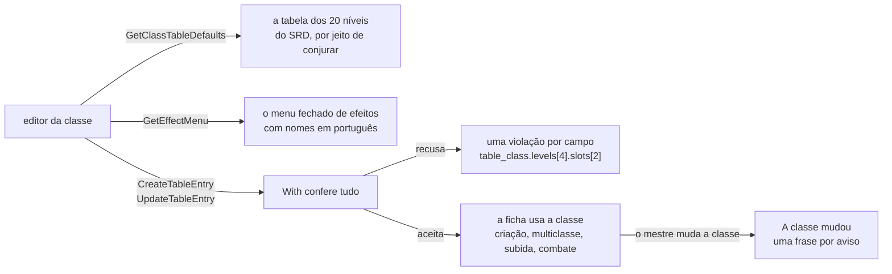

| Peça | O que faz |
| --- | --- |
| Os padrões da tabela de 20 níveis | `TableContentService.GetClassTableDefaults` (só o mestre; `rules.Content.TableDefaults`). Devolve o bônus de proficiência do SRD por nível (+2 nos níveis 1 a 4 até +6 nos 17 a 20), os níveis de aumento de atributo (4, 8, 12, 16 e 19), o nível da subclasse (3) e **uma tabela de 20 linhas por jeito de conjurar**: nenhuma, completa, metade, pacto e um terço (a da subclasse), cada uma "conhece" ou "prepara". A linha é uma `TableClassLevel` pronta para ser o `levels` da classe (as características vêm vazias): bônus, truques conhecidos, magias conhecidas e os espaços por círculo (nove números, ou nenhum antes de a conjuração começar). Os números são os das tabelas de classe do SRD, lidas do próprio SRD (nunca do conteúdo da campanha: uma campanha que não carrega não os quebra): completa e a de um terço usam a do Mago/Clérigo, metade a do Paladino (começa no nível 2), pacto a do Bruxo (um círculo só, todos os espaços dele), "conhece" os truques e as magias conhecidas do Feiticeiro (completa), do Patrulheiro (metade) e do Bruxo; "prepara" não tem magias conhecidas. **O conjurador de um terço**, que o SRD 5.1 não tem, usa a tabela completa a um terço do nível, arredondado para cima (2 espaços no nível 3, 4 e 2 no 7, 4/3/3/1 no 19), 2 truques (3 a partir do nível 10) e, a que conhece as magias, 3 nos níveis 3 e 4 e mais uma a cada dois níveis, 11 no nível 20: é o nosso padrão, escrito com as nossas palavras, e o mestre muda o que quiser. A referência (`reference_class_key`) diz de qual classe do SRD vêm os números. |
| O menu fechado como dado | `TableContentService.GetEffectMenu` (só o mestre; `rules.Content.EffectMenu`). Devolve os nove tipos de efeito com o nome e a frase em português, os campos de cada um (o que é obrigatório, o tipo do campo e a lista a que ele aponta, os limites de um número) e **todas as listas fechadas** com nomes em português: os alvos de modificador (CA, PV, deslocamento, ataque e dano de arma, uma perícia, um teste de resistência), os modos (somar, pelo menos, definir), os alvos de proficiência (perícias, testes de resistência, a iniciativa, armaduras, armas e ferramentas), os níveis, os modos e os alvos de vantagem ou desvantagem, os sentidos, as recargas, as economias de ação, os tipos de escolha, as perícias, os idiomas, as ferramentas e os prefixos das etiquetas. Traz também **as listas de opções do SRD** que uma escolha de "uma opção de uma lista" pode oferecer (os estilos de luta, as invocações...), as funções de fórmula (`level()`, `classLevel("<classe>")`, `mod("<atributo>")`, `score("<atributo>")`, `prof()`, `armor()`, `shield()`, `floor`, `ceil`, `min`, `max`) com a frase de cada uma, os índices de classe que o `classLevel` aceita (as do SRD e **as da mesa**) e os limites (60 características por classe, 20 efeitos por característica, 2 a 4 ataques). O editor não escreve nenhuma dessas listas; o que ele oferece, o servidor aceita: `TestEffectMenuIsWhatTheValidatorAccepts` põe cada valor de cada lista num efeito e confere que o `With` o aceita, e que os tipos, os campos e os obrigatórios são os que o validador lê. Os nomes são em português: as ferramentas têm o nome da ficha, e duas listas de opções com o mesmo nome levam a classe ("Estilo de Luta (Guerreiro)", "Metamagia (Feiticeiro, nível 3)"); `TestEffectMenuNamesArePortuguese` confere. **Um campo que o tipo do efeito não lê** é recusado só **ao escrever a entrada** (criar, editar e desarquivar); numa entrada já guardada ele é ignorado ao ler (`Overlay.Strict`), para um campo perdido nunca deixar uma campanha ilegível (`TestStrayEffectFieldsAreIgnoredWhenRead`). O menu oferece um subconjunto do que o motor entende (um `damage.spell.<magia>` ou a escolha de uma magia por chave, por exemplo, ficam fora): ele nunca oferece o que o servidor recusa. |
| Um campo por regra | Toda recusa de uma classe ou subclasse sai como `TableContentViolation` com o **campo exato** que o editor desenha, nos nomes do proto e com os índices dele (`table_class.levels[4].slots[2]`, `table_class.casting.list_from`, `table_class.skill_from[2]`, `table_class.levels[0].features[0].effects[0].max`, `table_subclass.always_prepared[1].spell_key`, `table_subclass.casting.start_level`), e um motivo estável (`bad_table`, `bad_casting`, `bad_value`, `bad_formula`, `forbidden_effect`, `dangling_reference`, `limit`...). Uma fórmula que não compila aponta o `value`, o `when` ou o `max` que falhou; um campo que o tipo do efeito não lê (um `recharge` num modificador, uma `count` num sentido) é recusado **nesse campo**, com `bad_value`; o bônus de multiclasse aponta a habilidade (`table_class.minimums.wisdom`). `TestClassRefusalsNameTheirField` (`rules`, mais de 60 casos, cada regra com o campo e o motivo) e `TestTableClassRefusalsPointAtTheirField` (`characters`, pela API, e uma recusa não muda nada) são a lista. O que o `With` diz do **conteúdo inteiro** continua com o campo vazio, e o limite de 300 entradas com o motivo `limit`. |
| A multiclasse na criação | `CreateCharacter` já aceita uma ficha com mais de uma classe, cada uma com a sua subclasse, a da mesa inclusa: nada precisou mudar, e o que faltava era a prova. Os pré-requisitos do SRD de cada classe (a primeira também) são **avisos** da ficha (`multiclass_prerequisite`), nunca recusa, como o resto das regras de escolha; a subclasse antes do nível dela é o aviso `subclass_level`. Os PV seguem a regra da mesa (RN-24): com "rolar", toda a conta é de níveis depois do primeiro, **somando as classes** (`HIT_POINTS_RULE` recusa a média e a falta de rolagens), e o primeiro nível é o dado cheio da primeira classe. Os espaços de magia são os da tabela de conjuradores da multiclasse: completa conta o nível, metade a metade (para baixo), o conjurador de um terço um terço (para baixo) e a classe da mesa com a mesma conta da do SRD, com o pacto à parte. |
| A subclasse que conjura, na subida de nível | `LevelUpSubclass` ganhou o que o conjurador de um terço soma ao escolher a subclasse: `spells` (quantas magias conhecidas), `spells_kind`, `spell_list_class_key` (a classe de cuja lista elas vêm) e `max_spell_level`, e, para a que **prepara** em vez de conhecer, `prepares` e `prepared_max_after` (quantas pode preparar no nível novo, já com a subclasse). Sem eles a tela da subida de nível não saberia quantas magias pedir nem de qual lista. As magias sempre preparadas da subclasse entram na ficha no nível delas e não contam no limite; os espaços e os truques vêm da linha da tabela da subclasse. |
| "A classe mudou": as frases | `rules.Issue` ganhou `ChangeMessage` e `ChangeSubject`: a frase do mesmo aviso como uma **mudança** a conta, sem o nome da entrada, e a classe ou subclasse de que ela fala. Só os avisos ligados a uma entrada da mesa (`Issue.Keys`) têm uma. `ChangedContent.messages` leva essas frases, montadas onde a entrada que mudou é conhecida (`changeSentence`): **o nome entra só quando a frase é sobre a própria entrada que mudou**; sobre qualquer outra, a frase sai sem nome e com maiúscula (uma classe do SRD cujo número mudou porque o traço de uma raça da mesa mudou nunca é nomeada). `DerivedSheet.issues` e a identidade do aviso (`código`, campo e frase) continuam com a frase neutra, que também vale num rascunho, e por isso `content_baselines` não muda. As frases (E10-02, estado 8): **perícias** "Guardião do Vale agora dá 2 perícias no nível 1; esta ficha tem 3." (com outra fonte de perícias, "O total de perícias para escolher agora é 4; esta ficha tem 3."), **truques** "Mago agora conhece 3 truques; esta ficha tem 4.", **magias conhecidas** "… agora conhece 5 magias; esta ficha tem 6.", **magias preparadas** "… agora prepara 4 magias; esta ficha tem 5." (com um conjurador só e nenhuma outra fonte; o conjurador de um terço é nomeado pela **subclasse**; senão, "O total de magias preparadas agora é 4; esta ficha tem 5."), **o nível da subclasse** "Guardião do Vale agora escolhe a subclasse no nível 5; esta ficha tem nível 3 nela.", **a multiclasse** "Guardião do Vale agora pede outros atributos para multiclasse; os desta ficha não cumprem." e **uma opção do SRD que a característica da mesa deixou de oferecer** "Guardião do Vale agora não oferece a escolha Estilo de Luta: Defesa; ela não vale mais nesta ficha." O aviso da opção é ligado à entrada **de onde vem a lista de opções** (a classe ou subclasse da mesa cuja característica oferece opções do mesmo conjunto do SRD), nunca a outra entrada da ficha; se nenhuma característica a oferece mais, não há entrada a culpar e o aviso não aparece em "A classe mudou" (a ficha continua com o aviso comum, que diz que a opção não vale para o personagem: ela guarda a opção do SRD, não a característica da mesa que a ofereceu). Uma frase diz o que a entrada dá hoje e o que a ficha tem, no singular quando é 1. Os outros avisos (uma magia que saiu da lista da classe, por exemplo) usam a própria frase. |

**Testes.** `rules` (sem banco): `TestTableDefaultsFollowTheSRDTables` e `TestTableDefaultsMakeValidClasses` (cada padrão vira uma classe que o `With` aceita e que sobe de 1 a 20 pelo mesmo varredor de `TestLevelUpSweepTable`, o conjurador de um terço como subclasse do Guerreiro), `TestEffectMenuIsWhatTheValidatorAccepts`, `TestEffectMenuRequiredFieldsAreRequired`, `TestEffectMenuFormulaHelpers`, `TestClassRefusalsNameTheirField` e `TestChangedClassSentences`. Com banco (`characters`): `TestTableClassEditorStartsFromTheServer` (só o mestre lê; os padrões são os do SRD; uma classe de cada tabela padrão e o conjurador de um terço padrão são aceitos sem mudar), `TestTableClassRefusalsPointAtTheirField`, `TestTableClassMulticlassAtCreation` (Corvina, Maga 3 e Clériga 1, cada uma com uma subclasse da mesa; Guardião 2 e Mago 2; Guerreiro 3 com o conjurador de um terço e Mago 2; o pré-requisito e a subclasse cedo viram aviso), `TestTableClassMulticlassHitPointsFollowTheRule`, `TestTableClassCreationAndLevelUp` (Ícaro, o Guardião do Vale com o antecedente "Outro", do nível 1 ao 5: a média, o estilo de luta no 2 com os espaços e as magias preparadas, a subclasse no 3 com as magias sempre preparadas, o aumento de atributo no 4 e os espaços da tabela no 5), `TestTableClassThirdCasterCreationAndLevelUp`, `TestTableClassSubclassPickedAtLevelUpGivesItsSpells`, `TestTableClassChangeIsTold` e `TestTableClassThirdCasterChangeIsTold` (cada mudança comum, com a frase exata, e o aviso que some sozinho). E no `play`: `TestMR025_AThirdCasterOfTheTableCastsATableSpell` (a Lâmina de Nanquim, uma magia da mesa da lista do Mago, conjurada em combate por um Guerreiro 5 da Lâmina de Tinta: o ataque com a Inteligência e a proficiência da subclasse, os espaços da tabela dela, o dano de 2d8 e o registro).

### Os atributos de uma ficha nova (RN-24)

Quando um **jogador** cria a ficha, o servidor confere os valores-base (antes do bônus da raça) contra o jeito que ele disse ter usado (`CreateCharacterRequest.ability_method`) e contra os jeitos que a mesa deixa (`TableRules.AbilityMethodsOff`); a conferência é só da criação, e os NPCs do mestre e as edições do mestre depois ficam livres. As contas são puras, em `rules/abilitymethods.go`: o conjunto padrão (15, 14, 13, 12, 10 e 8, cada um uma vez, em qualquer ordem), a compra por 27 pontos (cada valor de 8 a 15, no máximo 27 pontos gastos, custos 0, 1, 2, 3, 4, 5, 7 e 9), os 4d6 (os seis resultados guardados, cada um uma vez) e digitar (3 a 18). Os três primeiros jeitos vêm do SRD 5.2.1 (CC BY 4.0, p. 20; no `NOTICE`). A recusa é `failed_precondition` com o detalhe `AbilityScoresRefusal` (o motivo e o jeito: `METHOD_NOT_ALLOWED`, `NOT_STANDARD_ARRAY`, `BAD_POINT_BUY`, `NO_ROLLS_STORED`, `NOT_THE_ROLLS`, `TYPED_OUT_OF_RANGE`); a ficha mal formada continua `invalid_argument`, antes. **O servidor grava o jeito na ficha** (`FullSheet.ability_origin`: o jeito e, nos 4d6, os seis jogos, já que os guardados são gastos pela criação). O valor que o cliente manda é sempre ignorado (na criação e na edição), e um NPC nunca o tem. Em `UpdateCharacter`, enquanto a ficha é o rascunho do jogador, a edição **do jogador** que muda os valores-base é conferida contra o jeito gravado (`keepAbilityOrigin`; a mesma recusa `AbilityScoresRefusal`); o mestre edita livre, e uma ficha sem registro não é conferida. Sem `ability_method` é o app de antes das regras: enquanto a mesa deixa todos os jeitos, vale só a conferência de sempre da ficha (1 a 30 em cada valor), então o app que ainda não manda o campo continua funcionando; quando o mestre desliga um jeito, o campo passa a ser obrigatório (`METHOD_NOT_ALLOWED`), porque não haveria contra o que conferir.

**Os 4d6 do servidor.** `RollAbilityScores` rola seis jogos de quatro d6 com `platform/dice` e os guarda em `character_ability_rolls` (um por jogador e campanha); chamar de novo devolve os mesmos jogos (`already_rolled`), então recarregar a tela não rola de novo, e `GetAbilityRolls` os lê sem rolar. O `CreateCharacter` que usa os jogos apaga a linha na mesma transação, e a ficha seguinte rola de novo; uma ficha recusada não os gasta. **Com dado físico (RN-18)** o jogador digita os seis jogos de quatro dados, uma vez só (`typed_dice`, cada dado de 1 a 6; o servidor tira o menor de cada jogo): a mesa que força o app recusa os dados digitados (`DICE_FORCED_IN_APP`), a que força o físico recusa a rolagem do servidor (`DICE_FORCED_PHYSICAL`), "cada jogador escolhe" aceita os dois; digitar de novo outros dados é `ROLLS_ALREADY_STORED`, e os mesmos dados são uma repetição. A regra de dado vem do mesmo `DiceRules` do subir de nível. Quem rola é o jogador ou o membro pendente (RN-15); o mestre recebe `permission_denied`. **Os bônus manuais:** `extra_ability_bonuses` positivos não passam do que a raça deixa pôr (a escolha do meio-elfo ou de uma raça da mesa) mais 2 por Aumento de Atributo alcançado (`rules.FreeAbilityPoints`), na criação e na edição do rascunho do jogador; a recusa é `EXTRA_BONUSES`. **Os PV da criação** acima do nível 1 são conferidos contra a regra da mesa (`HIT_POINTS_RULE`). `ContentSource` ganhou `ContentFor`, que devolve só o conteúdo, sem ler as regras: o que não precisa delas (`contentFor`) não paga a leitura. O `AbilityOrigin` guarda também `typed` (os 4d6 digitados, e não rolados pelo servidor); um `ability_method` desconhecido é `invalid_argument`. A leitura da regra e da linha acontece na transação do `CreateCharacter`, pelo `tx` (PR #121). Testes: `TestRN24_TheScoresFollowTheMethod`, `TestRN24_ATableCanSwitchMethodsOff`, `TestRN24_TheServerKeepsTheFourD6`, `TestRN24_PhysicalDiceAreTypedOnce`, `TestRN24_ThePendingMemberMakesTheirScoresToo`, `TestRN24_TheTableRulesAreReadInTheCallersTransaction` e, em `rules`, `TestCheckStandardArray`, `TestPointBuy`, `TestCheckTyped` e `TestAbilityRolls`. **O que o app mudou (fatia 10.13a):** o jogador deixa de rolar no navegador (`crypto.getRandomValues`, MR-004) e passa a pedir os jogos a `RollAbilityScores`, manda `ability_method` na criação e lê os jeitos que valem em `GetTableRules` (ver [As telas das regras da mesa](#as-telas-das-regras-da-mesa-etapa-10-fatia-1013a)); o mestre, nos NPCs, continua rolando no navegador.

### Aprovar ou recusar o personagem

O personagem criado por um [membro pendente](#membro-pendente) nasce `CHARACTER_STATE_PENDING` (RN-15, MR-024). O jogador edita a ficha e a história enquanto espera; a sessão de jogo não o trava, e ele não morre. O mestre o vê em "Esperando aprovação", na seção "Personagens" da campanha, abre a ficha e decide:

- **`ApproveCharacter`**: o personagem vira rascunho (RN-01 vale como sempre: trava na próxima sessão), e a participação do jogador vira ativa. Aprovar de novo, ou aprovar um personagem que nunca esperou, não muda nada.
- **`RejectCharacter`**: o personagem é apagado, com a história e as notas do mestre, e a participação pendente também. O jogador não vê mais a campanha e precisa de um convite novo. Só vale para personagem pendente; para os outros, `failed_precondition` (`NOT_PENDING`).

As duas mexem em duas tabelas de dois módulos, numa transação só: o `characters` muda o personagem e pede ao `campaigns` para mudar a participação, pela interface `characters.PendingMembers` (`ActivatePendingMember` e `DeletePendingMember`), que o `campaigns.Service` implementa e o `cmd/api` liga, como o `play` faz com o `SheetLocker`. Nenhum dos dois pacotes importa o outro. As duas travam a linha do personagem primeiro (`SELECT ... FOR UPDATE`), então uma aprovação e uma recusa ao mesmo tempo acontecem uma depois da outra: a segunda encontra o personagem já ativo (a recusa recebe `failed_precondition`) ou já apagado (a aprovação recebe `not_found`), nunca metade de cada (`TestRN15_ApproveAndRejectRace`).

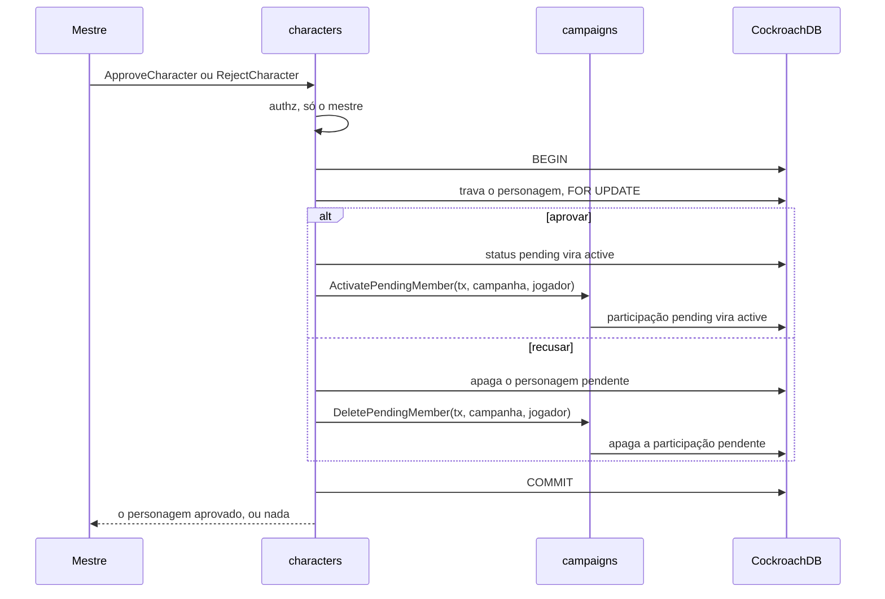

Na tela, a ficha pendente mostra ao jogador "Esperando a aprovação do mestre", e ao mestre os botões "Aprovar personagem" e "Recusar personagem"; recusar pede uma confirmação ("Confirmar recusa"), porque apaga o personagem de vez.

### Subir de nível pela ficha (MR-040)

O jogador sobe o personagem de nível pela ficha travada, só enquanto `can_level_up` é verdadeiro (RN-01, RN-12; pergunta 48 do Samuel). O módulo `characters` faz a parte que precisa de banco; o que um nível dá e o que a ficha pode mudar é do `rules` (ver [Subir de nível](#subir-de-nível-mr-040)). Cinco chamadas do `CharacterService`, na tabela de quem pode acima:

- **`GetLevelUpOptions`** (leitura, `IDEMPOTENT`): o `LevelUpOptions` da classe (a primeira, se `class_key` vier vazio) com os nomes em português, a regra de dado da campanha (`dice_rule`) e o dado que o servidor já rolou, se houver (`kept_hit_point_roll`). Para o mestre e para o dono.
- **`PreviewLevelUp`** (leitura, `IDEMPOTENT`): a ficha derivada de depois, com as escolhas aplicadas, e a primeira recusa, se houver (`LevelUpRefusal`, como dado, não como erro). É o "Resumo", o antes e o depois: o app web não tem o motor de regras, então o servidor faz as contas, inclusive o novo máximo de preparadas depois de um aumento de atributo. Não grava nada.
- **`RollLevelUpHitPoints`**: o servidor rola o dado de vida da classe com `platform/dice` e guarda o resultado em `character_level_up_rolls`, por personagem e nível (não por classe: um personagem de duas classes rola uma vez só por nível). Chamar de novo, com a mesma chave ou outra, devolve a mesma rolagem (`already_rolled`); pedir para outra classe é recusado (`HIT_POINT_ROLL_OTHER_CLASS`). A campanha que força dado físico a recusa (`DICE_FORCED_PHYSICAL`). Só o dono.
- **`LevelUpCharacter`**: recebe a revisão e as escolhas, monta a ficha nova a partir da guardada (o cliente nunca manda a ficha), roda `rules.Validate` (`invalid_argument` para o que é malformado, como uma chave que não existe) e `rules.CheckLevelUp` (`failed_precondition` com o detalhe `LevelUpRefusal`: o campo e o motivo), e grava, na mesma transação, a ficha (com a checagem de revisão, `aborted` se velha) e o registro em `character_level_ups`, e apaga o dado usado. A ordem das recusas: personagem morto ou pendente, revisão velha, "não pode subir de nível", a ficha guardada que já não passa nas regras de hoje (`SHEET_NEEDS_MASTER`: nenhuma escolha a conserta, o mestre corrige pelo editor), dado, regras. Só o dono; o mestre continua com o editor (`permission_denied`). Depois da gravação publica o `xp_changed`.
- **`ListLevelUps`** (leitura, `IDEMPOTENT`): o "O que mudou" do mestre: as subidas da campanha, ou de um personagem (`character_id`), da mais nova à mais antiga, em páginas (`page_size` 1 a 50, `page_token` opaco, como o histórico de XP), cada uma com o jogador, a classe, o nível de antes e o de depois, as escolhas (`LevelUpChoices`, com o valor que os PV tomaram), os nomes em português de cada chave e a hora. É a leitura **menor** que desenha o estado 6 da tela `E8-15`: o mestre é avisado pelo stream e lê a lista, sem aprovação nem veto (pergunta 66, decidida em 04/10/2026). Só o mestre.

**Dado e RN-18.** A regra da campanha vem do `campaigns` pela interface `characters.DiceRules`, ligada em `cmd/api` (o mesmo desenho do `play.DiceModes`): `FORCED_PHYSICAL` recusa o dado do app, `FORCED_IN_APP` recusa o número digitado, e com "cada jogador escolhe" vale o de cada rolagem (a preferência salva só diz qual opção a tela destaca). O dado digitado é um número de 1 até o dado da classe; fora disso é `HIT_POINTS`.

**Os PV e a regra da mesa (RN-24).** A regra de PV do nível (`TableRules.HitPoints`, lida junto com o conteúdo, na transação) diz que método vale, e vale nas duas chamadas: com "rolar", a média é recusada; com "a média", todo dado é recusado. O `GetLevelUpOptions` diz qual vale em `hit_points_rule` (`PLAYER_CHOOSES`, `ROLL_ONLY` ou `AVERAGE_ONLY`), à parte do `dice_rule`, que diz onde se rola. `LevelUpCharacter` e `PreviewLevelUp` com o método que a regra não aceita dão a recusa `HIT_POINTS_RULE` (campo `choices.hit_points.method`); um `PreviewLevelUp` sem método ainda não escolheu e não é recusado. `RollLevelUpHitPoints` numa mesa "só a média" é `failed_precondition` com `CharacterBlocked` `HIT_POINTS_AVERAGE_ONLY`. O dado já guardado de antes de a regra mudar fica guardado, e a regra vale na hora de subir. Testes: `TestRN24_TheLevelUpFollowsTheHitPointsRule`.

**Ao vivo.** A subida reaproveita o aviso que a ficha e a lista já escutam, o `xp_changed` (o campo 14 do stream, sem conteúdo): ele já significa "leia o XP e os níveis de novo", e a subida muda exatamente isso (o nível da ficha e o `can_level_up`). O `characters` chama `PublishXPChanged` pela interface `characters.Live`, que o `play` implementa e `cmd/api` liga; só o comentário do campo mudou. Não ocupa o campo 20.

**O registro e o "pode subir" que some.** Nada precisa limpar o `can_level_up`: ele vem do XP da ficha e da marca de marco, e o nível na ficha mudou (ver [RN-12](produto/regras.md)). A subida não mexe no XP: a campanha por XP deixa de pedir o nível quando o XP não alcança o próximo, e a por marcos quando o nível passa o da marca. O `TestMR040_CanLevelUpClearsAfterwards` confere os dois.

### A tela do subir de nível (MR-040, fatia 8.15)

A página `/campanhas/:id/personagens/:characterId/subir-de-nivel` (rota preguiçosa, `pages/level-up`) é só um cliente das cinco chamadas acima: o navegador não calcula regra (ADR-0008). `core/levelup` guarda a parte sem tela: `LevelUpClient` (as chamadas, mais o conteúdo e a preferência de dados da campanha), `levelup-flow.ts` (os passos de cada nível e as listas dos seletores, que vêm do servidor e do conteúdo), `LevelUpDraft` (as escolhas em signals, o que falta e o `LevelUpChoices` a enviar), `levelup-summary.ts` (as linhas "antes → depois", das duas fichas derivadas), `levelup-errors.ts` (as recusas por código e motivo, nunca por mensagem) e `LevelUpFeed` (a leitura do mestre).

- **A cada escolha** o `LevelUpPreview` chama o `PreviewLevelUp` (com 150 ms de calma; a resposta ultrapassada por uma mais nova é descartada) e a tela lê dele o "O que muda", o novo máximo de preparadas e a primeira recusa (o teto de 20 dos atributos é dela: a tela só mostra o motivo). Com o dado de vida rolado, chama também com a média, para o cartão "Média: 4" mostrar a vida com ela. A tela não faz conta de regra: mostra os números do servidor e os termos ("4 + Constituição +3").
- **Os passos:** Atributos, Vida, Magias e Resumo; o passo sem escolha não existe. "Escolhas" (subclasse, opções das features, perícias, especialização) entra antes de Magias, porque a subclasse pode dar truques.
- **Salvar** é uma chamada só, `LevelUpCharacter`, no "Confirmar o nível N", com a revisão lida. `aborted` (revisão velha) e `LevelUpRefusal` aparecem no lugar; a confirmação volta à ficha pelo estado da navegação (nunca Web Storage), e a ficha o tira do histórico depois de ler, então um recarregamento não mostra o aviso de novo. "Ler a ficha de novo" depois de uma revisão velha refaz a sessão com a ficha e as opções novas e leva junto as escolhas que ainda valem.
- **O mestre:** o `LevelUpFeed` lê `ListLevelUps` na campanha (uma página de 50) e a lista lê todas as páginas e a página lê de novo no `xp_changed` quando a campanha tem sessão aberta (`XpWatcher`, o mesmo cliente do stream da ficha). "Recente" é "confirmada nas últimas 24 horas", sem guardar nada no navegador; dispensar o aviso vale até recarregar.

## Módulo play: sessões de jogo

O `play` inicia, encerra e lista as sessões de jogo de uma campanha, o que trava as fichas (RN-01, Etapa 4), e cuida da sessão ao vivo (Etapa 5): o aviso de que a sessão começou (RN-06), o stream da sessão (ADR-0005) e a correção do mestre nos PV, nos espaços de magia e nos dados de vida (RN-02), cada uma registrada em `session_events` (ADR-0007). Desde a Etapa 6 ele também roda o combate: o encontro, quem luta, a iniciativa, a ordem dos turnos e o movimento na grade (MR-013), e o que se faz num turno: as opções, o ataque em dois passos, o dano, as ações padrão, o desfazer e o registro (MR-012, MR-014, [Combate](#combate)); as magias, as reações, os testes contra a morte e as condições vêm na fatia seguinte. O código fica em `backend/internal/play`.

| Chamada do `PlayService` | Quem pode | Erros próprios |
| --- | --- | --- |
| `StartGameSession` | O mestre da campanha | `failed_precondition` (`SESSION_ALREADY_OPEN`) se já há uma sessão aberta |
| `EndGameSession` | O mestre da campanha | `not_found` se a sessão não é da campanha. Encerrar de novo não é erro: devolve a sessão como está |
| `ListGameSessions` | Membros da campanha | — |
| `ListOpenGameSessions` | Qualquer pessoa logada; cada um vê só as campanhas em que é membro ativo | — |
| `GetLiveSession`, `WatchGameSession` | Membros da campanha | `failed_precondition` (`NO_OPEN_SESSION`) sem sessão aberta |
| `AdjustCharacterVitals` | O mestre da campanha, durante a sessão | `failed_precondition` (`NO_OPEN_SESSION`); `not_found` se o personagem não é um personagem de jogador vivo da campanha; `invalid_argument` fora de 0 até o máximo |
| `SetCurrentMap` | O mestre da campanha, durante a sessão | `failed_precondition` (`NO_OPEN_SESSION`); `not_found` se o mapa não é da campanha |
| `SetShownImage` | O mestre da campanha, durante a sessão | `failed_precondition` (`NO_OPEN_SESSION`); `not_found` se a imagem não é da galeria da campanha |
| `OpenScene` | O mestre da campanha, durante a sessão (abrir outra cena esvazia o palco) | `failed_precondition` (`NO_OPEN_SESSION`); `not_found` se o ponto não é um ponto de cena da campanha. Qualquer ponto de cena abre, mesmo sem ações (pergunta 63); abrir descobre a cena (MR-030) |
| `CloseScene` | O mestre da campanha, durante a sessão | `failed_precondition` (`NO_OPEN_SESSION`). Sem cena aberta, não muda nada; fechar esvazia o palco |
| `GetOpenScene` | Membros da campanha | `failed_precondition` (`NO_OPEN_SESSION`) |
| `RollSceneCheck` | Um jogador, com personagem vivo, durante a sessão | `permission_denied` para o mestre; `failed_precondition` (`NO_OPEN_SESSION`, ou `SceneBlocked`: `NO_OPEN_SCENE`, `ALREADY_ROLLED` (sem tentativa sobrando), `WRONG_DICE_MODE`, `NO_CHARACTER`); `not_found` se a ação não é da cena aberta; `invalid_argument` para um d20 fora de 1 a 20 |
| `GrantSceneAttempt` | O mestre da campanha, durante a sessão | `failed_precondition` (`NO_OPEN_SESSION`; `SceneBlocked`: `NO_OPEN_SCENE`); `not_found` se a ação não é da cena aberta ou o personagem não é um personagem de jogador vivo da campanha; `invalid_argument` para uma chave que não é UUID, ou já usada por outra mudança. Numa ação sem limite não muda nada |
| `GetSessionSummary` | Membros da campanha | `not_found` se a sessão não é da campanha; `failed_precondition` (`GameSessionBlocked`: `SESSION_NOT_ENDED`) para uma sessão ainda aberta. Ver [Resumo da sessão](#resumo-da-sessão) |
| `PutOnStage` | O mestre da campanha, durante a sessão | `failed_precondition` (`NO_OPEN_SESSION`; `SceneBlocked`: `NO_OPEN_SCENE`, `STAGE_FULL` com 4 em cena); `not_found` se o personagem não é um NPC vivo da campanha (ou o ID não é um UUID). O NPC que já está em cena não muda nada |
| `TakeOffStage` | O mestre da campanha, durante a sessão | `failed_precondition` (`NO_OPEN_SESSION`). O NPC que não está em cena não muda nada |
| `SetSpeaker` | O mestre da campanha, durante a sessão | `failed_precondition` (`NO_OPEN_SESSION`); `not_found` se o NPC não está em cena. O `character_id` vazio tira a fala de todos |
| `ListLeftImages` | Membros da campanha, com ou sem sessão aberta | — |
| `TakeBackLeftImage` | O mestre da campanha, com ou sem sessão aberta | `not_found` se a imagem não está na lista de imagens deixadas |

O membro pendente (RN-15) recebe `not_found` em tudo que pede campanha, como quem não é membro; `TestAuthorizationMatrix` tem uma coluna para ele.

**Como o `play` e o `characters` se encontram.** Iniciar uma sessão trava as fichas na mesma transação que abre a sessão. O `play` não mexe na tabela `characters`: ele declara uma interface, `SheetLocker`, que o `characters.Service` implementa com `LockSheets`, e o `cmd/api` liga os dois. Nenhum dos dois pacotes importa o outro. `LockSheets` não recebe quem está chamando: é "o sistema" da RN-01, e só o `play` o chama, depois de conferir que quem chama é o mestre.

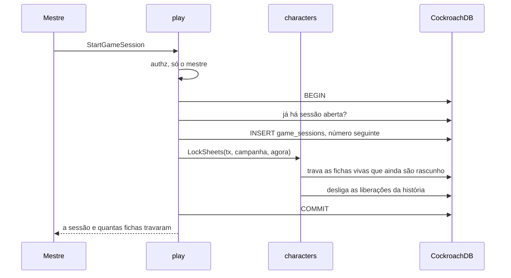

- **Uma sessão aberta por campanha.** A checagem dentro da transação dá o erro claro; um índice único parcial garante a regra quando duas chamadas correm juntas.
- **O personagem criado depois** da primeira sessão fica rascunho até a próxima começar, porque `LockSheets` roda em todo início de sessão, não só no primeiro.
- **Encerrar não destrava nada.** A ficha continua travada entre as sessões.

### Sessão ao vivo

O jogador fica sabendo da sessão por uma consulta leve, e acompanha a sessão por um stream que só existe enquanto ele está com a página da sessão aberta e visível (ADR-0005).

- **O aviso (RN-06) é uma consulta, não um stream.** Com a aba visível e a pessoa logada, o app chama `ListOpenGameSessions` a cada 30 segundos, e uma vez quando a aba volta a ficar visível. A resposta traz as sessões abertas das campanhas em que a pessoa é membro ativo, com o nome da campanha e o papel dela; uma sessão nova vira o aviso "A sessão 3 de Mirathel começou" com o link. São duas leituras por índice (as campanhas da pessoa, pelo `campaigns`, e as sessões abertas delas, pelo índice parcial de `game_sessions`), e o Cloud Run só cobra o tempo da requisição.
- **O link da sessão** é `/campanhas/<id>/sessao`, sem segredo (RN-07). Quem decide é o servidor: sem login, `unauthenticated`, e o app manda para o login; quem não é membro, ou é membro pendente, recebe `not_found` (a tela mostra "Peça um convite ao mestre", sem o nome da campanha); sem sessão aberta, `failed_precondition` com `GameSessionBlocked` e o motivo `NO_OPEN_SESSION` (a tela mostra "Nenhuma sessão em andamento").
- **O stream** (`WatchGameSession`) manda primeiro `ready`, depois de registrar a assinatura. Só então o app lê a foto da sessão (`GetLiveSession`), então nenhuma mudança cai no intervalo entre a foto e o stream. Uma mudança pode chegar antes da foto: a `revision` das `CharacterVitals` diz qual é a mais nova. Depois vêm `heartbeat` a cada 25 segundos, `vitals_changed`, os eventos dos mapas (`current_map_changed`, `map_changed`, `token_moved`, ver [Os mapas na sessão ao vivo](#os-mapas-na-sessão-ao-vivo)), `shown_image_changed`, `left_images_changed`, os eventos do combate (`encounter_changed`, `turn_changed`, `combatant_moved`, `combat_log_changed`, ver [Combate](#combate)), `xp_changed` (o XP da campanha mudou, ver [Módulo progression](#módulo-progression-xp-e-marcos)) e `session_ended`.

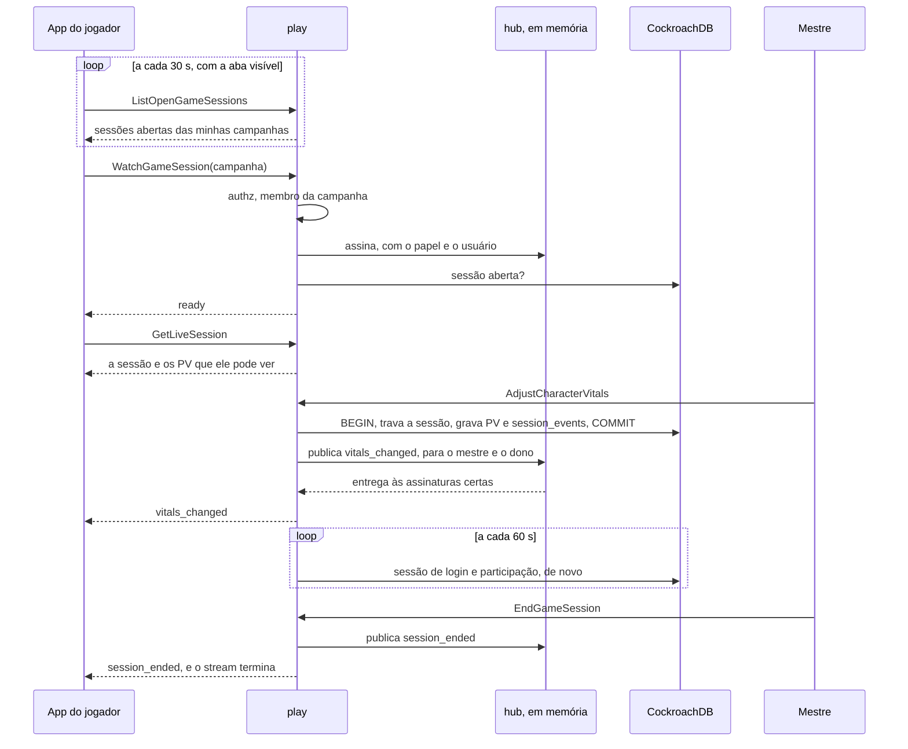

**Quem vê o quê.** O mestre vê as `CharacterVitals` de todo personagem de jogador vivo da campanha; o jogador, só as do próprio personagem, na foto e no stream (decidido em 02/10/2026, pergunta 28). O filtro roda no servidor: cada evento publicado leva a própria audiência (todos, o mestre, ou um usuário), e o hub só entrega às assinaturas dela. `TestPlayersSeeOnlyTheirOwnVitals` confere a foto e o stream, e `TestRN11_LiveSessionNeverCarriesMasterNotes` confere que nada da sessão ao vivo carrega as notas do mestre.

**Quando o stream termina.**

| Quando | Como termina | O que o app faz |
| --- | --- | --- |
| O mestre encerra a sessão | `session_ended`, depois fim sem erro | Mostra "Sessão encerrada" |
| 30 minutos de stream | Fim sem erro | Reconecta e lê a foto de novo |
| O servidor vai reiniciar (graceful shutdown) | Fim sem erro, na hora: o `httpserver` chama `play.Service.Close` quando o desligamento começa | Reconecta |
| O app parou de ler e ficou 16 eventos para trás | `unavailable` | Reconecta e lê a foto de novo |
| A sessão de login acabou (logout, revogada, 30 dias) | `unauthenticated`, na checagem seguinte | Manda para o login |
| A pessoa saiu da campanha | `not_found`, na checagem seguinte | "Peça um convite ao mestre" |

O app reconecta com espera crescente (1 s, 2 s, 4 s, até 30 s, com variação aleatória) e só com a aba visível: com a aba escondida por 2 minutos, ele mesmo fecha o stream, e reabre (com a foto nova) quando a aba volta. É o que impede uma aba esquecida de segurar uma conexão aberta (ver [Operação](operacao.md#stream-da-sessão-ao-vivo)).

**No app.** A consulta do aviso fica em `web/src/app/shell/live-notice/open-sessions.ts`, que faz parte do bundle inicial, mas carrega o cliente gerado do `PlayService` só na primeira consulta (um `import()` dinâmico), então o código gerado fica num chunk lazy. A página da sessão (`web/src/app/pages/live-session`) segue as regras acima em `live-stream.ts`, testado com relógio falso. O aviso não aparece na página da própria campanha (o painel "Sessão" já diz), nas páginas de sessão, nem para o mestre da campanha, que foi quem iniciou; o link "Ao vivo" aparece para todos.

**O hub fica em memória, numa instância só.** O pacote `play/live` guarda as assinaturas de cada campanha na memória do servidor. Publicar nunca espera: cada assinatura tem um buffer de 16 eventos, e a que enche é derrubada, em vez de atrasar a mudança do mestre. Com duas instâncias do Cloud Run, a mudança feita numa não chegaria aos streams abertos na outra; por isso o serviço roda com `max-instances = 1` enquanto o fan-out for em memória (ver [Operação](operacao.md)). Quando uma instância não bastar, um canal compartilhado (changefeed do CockroachDB ou Pub/Sub) entra no lugar do hub, e o resto não muda.

**O stream passa pela mesma pilha HTTP.** O log de requisições embrulha a resposta num `statusRecorder` que repassa o `Flush`, o `CrossOriginProtection` recusa POST de outra origem (o stream é um POST com `Content-Type: application/connect+json`, que outro site só mandaria depois de um preflight de CORS), o servidor fala HTTP/1.1 e h2c, e não há `WriteTimeout`. `TestLiveStreamIsNotBuffered` abre o stream pelo servidor de verdade, em HTTP/1.1 e em h2c, com o heartbeat desligado, e confere que `ready` e `vitals_changed` chegam na hora.

### PV, espaços de magia e dados de vida

Os números do personagem que mudam durante o jogo (PV atual, PV temporários, espaços de magia usados por círculo, espaços de pacto usados e dados de vida usados) ficam em `character_vitals`, no módulo `characters`, porque são do personagem e duram de uma sessão para outra (ver [Modelo de dados](dados.md#esquema-implementado)). O `play` os lê e muda pela interface `play.VitalsKeeper` (`ListVitals`, `GetVitals`, `AdjustVitals`), que o `characters.Service` implementa e o `cmd/api` liga, como o `SheetLocker`. As mensagens (`CharacterVitals`) são do `play.proto`, porque só o `PlayService` as serve: o `play` declara a interface e o que passa por ela, e o `characters` só preenche.

- **Os máximos nunca são guardados.** Saem do `rules.Derive`, como todo número da ficha: PV máximo, espaços por círculo, espaços de pacto e dados de vida (o total é o nível). A cada leitura, o valor guardado é cortado no máximo de agora: uma ficha que perdeu nível nunca mostra mais do que tem.
- **Sem linha, o personagem está inteiro:** PV cheio, nada usado, `revision` 0.
- **Só personagens de jogador vivos e ativos** (não NPC, não morto, não pendente). O NPC ganha PV de combate com os combatentes, na Etapa 6.
- **A correção do mestre** (`AdjustCharacterVitals`) troca só os valores que vêm na requisição, cada um de 0 até o máximo (PV temporários até 999). Numa transação só, o `play` trava a linha da sessão aberta (`FOR UPDATE`), confere a chave de idempotência, pede ao `characters` para gravar e grava o evento em `session_events`; só depois do `COMMIT` publica `vitals_changed`.
- **Idempotência.** O app manda um UUID novo a cada correção (`idempotency_key`) e o mesmo numa nova tentativa. Se a chave já está em `session_events`, nada é gravado nem publicado, e a resposta traz os PV como estão agora (`TestAdjustCharacterVitalsIsIdempotent`). A mesma chave para outro personagem é `invalid_argument`.
- **Ordem dos eventos.** O `seq` de cada evento é o seguinte da sessão, lido com a linha da sessão travada, então duas correções ao mesmo tempo esperam uma pela outra e ganham 1, 2, 3, sem buraco e sem repetição (`TestSessionEventsAreOrderedPerSession`). `EndGameSession` trava a mesma linha, então uma correção em andamento termina antes da sessão acabar.

### O que a sessão mostra

A sessão aberta mostra a todos duas coisas, lado a lado e independentes: o mapa atual e uma imagem da galeria que o mestre escolhe mostrar (MR-028), como um retrato ou uma carta. As duas ficam na linha da sessão, em `game_sessions`, e só o mestre as muda, só com a sessão aberta.

| | Mapa atual | Imagem mostrada |
| --- | --- | --- |
| Chamada | `SetCurrentMap(map_id)`, vazio para tirar | `SetShownImage(image_id)`, vazio para parar |
| Coluna | `current_map_id` | `shown_image_id` |
| Revela | O mapa (RN-10): o jogador sempre vê o mapa atual | Nada além da própria imagem, e só enquanto é mostrada |
| Na foto | `GetLiveSession.current_map_id`; o app lê o mapa com `MapService.GetMap` | `GetLiveSession.shown_image` (ID, nome como legenda, tamanho, URLs) |
| No stream | `current_map_changed`, para todos | `shown_image_changed`, para todos |
| Quando é apagado | `DeleteMap` tira da sessão (`SET NULL`) e manda `current_map_changed` vazio | `DeleteGalleryImage` tira da sessão (`SET NULL`) e manda `shown_image_changed` vazio |

- **Uma sessão nova começa sem os dois:** as colunas são da linha da sessão. A sessão encerrada guarda o último, só como registro.
- **Escolher o mapa atual o revela** na mesma transação que trava a linha da sessão. Se o mestre esconder o mapa atual depois, o jogador continua vendo enquanto ele for o atual (`Map.revealed` falso e `Map.current` verdadeiro).
- **A imagem mostrada não abre a galeria.** O jogador recebe o ID da imagem enquanto ela é mostrada, e mais nenhum; depois que o mestre para de mostrar, a rota `GET /images/{id}` responde `404` a ele, mesmo que tenha guardado o ID, a menos que o mestre a tenha deixado com os jogadores (abaixo; ver [Servir as imagens](#servir-as-imagens) e a pergunta 32, respondida em 02/10/2026, da [MR-028](produto/historias.md#mr-028-mostrar-uma-imagem-aos-jogadores)).

#### Imagens deixadas com os jogadores

O mestre pode deixar a imagem mostrada com os jogadores (MR-028, "Deixar com os jogadores"): ela sai da tela, mas continua numa lista que os jogadores veem até o mestre tirá-la. A lista é da campanha, não da sessão: por isso fica na tabela `campaign_left_images` (`campaign_id`, `image_id`, `left_at`; chave primária nas duas primeiras; `CASCADE` na campanha e na imagem da galeria, então apagar a imagem a tira da lista), e não em `game_sessions`, que a perderia quando a sessão acaba. O interruptor da imagem que está à mostra, esse sim, é da sessão: `game_sessions.shown_image_keep` (começa desligado, e volta a desligado quando a imagem mostrada muda).

| Chamada | O que faz |
| --- | --- |
| `SetShownImage(image_id, keep)` | `keep` é o interruptor da imagem mostrada. O mestre liga chamando de novo com a mesma imagem (não manda evento: os jogadores não sabem do interruptor). Com ele ligado, parar de mostrar ou trocar passa a imagem para a lista, na mesma transação que trava a linha da sessão; `EndGameSession` faz o mesmo ao encerrar |
| `ListLeftImages(campaign_id)` | Qualquer membro ativo, com ou sem sessão: a lista, da mais antiga para a mais nova, com as mesmas URLs da imagem mostrada |
| `TakeBackLeftImage(campaign_id, image_id)` | Só o mestre: tira a imagem da lista (ela continua na galeria); `not_found` se não está lá |
| `left_images_changed` (stream) | Uma dica sem conteúdo, a todos: deixou, tirou ou apagou uma imagem deixada. O app lê a lista de novo |

A tabela é do módulo `maps` (a rota das imagens a lê, junto das tabelas dos mapas); o `play` a escreve pela mesma interface `MapKeeper` (`LeaveImage` dentro da transação dele, `ListLeftImages`, `TakeBackImage`). `GetLiveSession.shown_image_keep` diz ao mestre se o interruptor está ligado; o jogador sempre recebe `false`.

**Como o `play` e o `maps` se encontram.** Um precisa do outro, então cada um declara o que precisa, o outro implementa, e o `cmd/api` liga os dois, sem nenhum importar o outro:

- o `play` declara `MapKeeper`: conferir e revelar o mapa atual, dentro da transação do `play`, ler a imagem mostrada e guardar as imagens deixadas com os jogadores. O `maps` implementa com `maps.SessionMaps`, que só precisa do banco;
- o `maps` declara `LiveSession`: qual é o mapa atual e a imagem mostrada, qual é o ponto da cena aberta, e publicar no stream. O `play.Service` implementa com `OnScreen`, `OpenScenePoint` e `Publish`. As mensagens são as do `play.proto`: o `maps` as monta, como o `characters` monta as `CharacterVitals`.

Como o `SessionMaps` não precisa do `play`, o `cmd/api` o cria primeiro, cria o `play` com ele, e só então cria o `maps` com o `play`: nenhum dos dois espera o outro.

### Cenas de RP

Uma cena de RP é um ponto do mapa do tipo `scene` com as ações que o mestre escolheu (MR-015, Etapa 7). As ações moram no `maps` (`scene_actions`, `MapService`); abrir a cena na sessão, rolar e o registro são do `play` (`backend/internal/play/scene.go`). O Samuel decidiu as perguntas 51 a 55 em 03/10/2026 (ver [Perguntas em aberto](produto/perguntas-em-aberto.md#respondidas-em-03102026)): o que está descrito aqui é o que existe, com a CD que o mestre pode mostrar por cena (52) e as tentativas por ação e por jogador (55), feitas no servidor na fatia 8.9 da Etapa 8 e nas telas na fatia 8.14.

- **As ações** (pergunta 51): um teste de perícia, um teste de atributo ou uma salvaguarda, cada um com nome opcional (até 60 caracteres) e CD opcional (1 a 30), no máximo 20 por ponto. O mestre muda uma de cada vez (`AddSceneAction`, `UpdateSceneAction`, `MoveSceneAction`, `RemoveSceneAction`: não há "salvar tudo"), e cada resposta traz a lista como ficou. A chave é conferida no catálogo das regras (`rules.Content.SceneCheckName`, que o `cmd/api` entrega ao `maps` em `Config.Rules`): só perícias, os seis atributos e as seis salvaguardas, então um ataque, uma magia ou uma habilidade de combate dá `invalid_argument`. O `MapPoint` ganha `scene_actions`: o mestre recebe tudo; o jogador, só nos pontos que vê (RN-10), e com a CD só quando o ponto tem `show_dc` ligada (RN-20, pergunta 52). Cada ação tem também `max_attempts` (as tentativas de cada jogador, abaixo), que todos recebem.
- **Mostrar a CD** (pergunta 52, fatia 8.9): `map_points.show_dc`, por cena, desligada por padrão, que o mestre muda com `UpdateMapPoint` (ou `CreateMapPoint`) como os ganchos; só um ponto de cena a tem, e um ponto que deixa de ser cena a perde. Todo membro recebe a chave (`MapPoint.show_dc`, `OpenSceneInfo.show_dc`). Ligada, o jogador recebe `dc` nas ações que têm CD (`SceneActionView` e `SceneAction`) e `passed` nas próprias rolagens; desligada, nada disso, como antes. Uma ação sem CD não mostra nada a mais, e o mestre vê a CD sempre. Mudar a chave com a cena aberta manda `scene_changed` a todos, e o app lê a cena de novo. Cada rolagem guarda no evento se a cena mostrava a CD quando foi feita (`dc_shown`): é essa marca, não a chave de hoje, que o [resumo da sessão](#resumo-da-sessão) conta.
- **Abrir e fechar** (pergunta 53): `OpenScene(point_id)` escolhe um ponto de cena da campanha **qualquer um, mesmo sem ações** (pergunta 63, mudada na Etapa 8: a descrição, as pistas e os NPCs bastam para uma cena; o `SceneBlocked` `NO_ACTIONS` continua no enum, mas o servidor nunca o manda), escondido ou não: abrir um ponto escondido não o revela no mapa, mas **descobre** a cena (`scene_discoveries`, MR-030). Uma cena por vez: abrir outra troca a primeira; abrir a que já está aberta não muda nada. `CloseScene` não pergunta nada. A cena aberta é `game_sessions.open_scene_point_id`; um ponto apagado, ou que deixa de ser de cena, fecha a cena. Cada abertura e cada fechamento vira um `session_events` (`scene_opened`, `scene_closed`).
- **Ler a cena** (`GetOpenScene`, uma chamada própria, não o `GetLiveSession`: ela calcula bônus a partir da ficha, e o app a lê depois do `ready` e de cada `scene_changed`). O nome e a descrição do ponto vão para todos. O **mestre** recebe também os ganchos do ponto e as pistas, cada uma com quem a tem (MR-029); o jogador **nunca** recebe nem um nem outro (RN-20), nem as pistas já reveladas a ele: essas lê nas anotações. O **mestre** recebe as ações com a CD e o limite de tentativas e todas as rolagens, cada uma com quem rolou, o dado e o total, `passed` quando a ação tinha CD e `attempts_left` (quantas tentativas aquele personagem ainda tem naquela ação, para oferecer "Dar mais uma tentativa"). O **jogador** recebe as ações **sem CD** (a não ser que a cena a mostre), cada uma com o bônus e a passiva do próprio personagem vivo (`rules.SceneOptions`, pelo `CombatRoster.SceneOptions`), o limite (`max_attempts`) e as tentativas que **o próprio personagem** ainda tem (`attempts_left`), e só as próprias rolagens, sem `passed` (a não ser que a cena mostre a CD). A passiva só vem em Percepção, Investigação e Intuição. Um jogador sem personagem vivo (ou com ficha básica) recebe as ações sem bônus.
- **Rolar** (`RollSceneCheck`, RN-18, pergunta 55): o jogador rola, com o próprio personagem vivo, uma ação da cena aberta. O servidor rola o d20, ou recebe o d20 digitado (1 a 20) conforme a regra por rolagem do RN-18: um modo forçado pela campanha recusa a outra forma com `WRONG_DICE_MODE`. Total = d20 + o bônus de `SceneOptions`. Cada personagem rola cada ação até o **limite de tentativas** dela (`scene_actions.max_attempts`, pergunta 55: 1 por padrão, de 1 a 5, ou 0 para sem limite; o mestre muda com `UpdateSceneAction`), contando as rolagens e as tentativas dadas (`GrantSceneAttempt`) desde o último `scene_opened`: sem nenhuma sobrando, a rolagem é recusada com `ALREADY_ROLLED` (o nome é do tempo em que o limite era 1; o motivo é o mesmo); fechar e abrir a cena de novo zera todas as contas. Baixar o limite abaixo do que alguém gastou o deixa sem tentativas e não apaga nada (as sobras são `max(limite - rolagens + dadas, 0)`, calculadas a cada leitura dos `session_events`); subir devolve. **"Dar mais uma tentativa"** (`GrantSceneAttempt(action_id, character_id, idempotency_key)`, só o mestre, cena aberta): soma uma tentativa daquele personagem naquela ação nesta abertura, grava o evento `scene_attempt_granted` (só IDs: o ponto e a ação no payload, o personagem no evento) e manda `scene_changed` a todos, o mesmo aviso sem conteúdo; numa ação sem limite não muda nada e não grava. A chave de idempotência repetida não soma outra. Repetir a chamada com a mesma `idempotency_key` devolve a primeira rolagem e não grava nada. A resposta ao jogador é a rolagem com o total; a CD e se passou só vêm quando a cena mostra a CD, e ficam com o mestre se não. O registro do mestre (pergunta 54) é a lista de rolagens do `GetOpenScene`, lida de `session_events`, da mais nova para a mais antiga.
- **O stream.** `scene_changed` (campo 15 do `WatchGameSessionResponse`) vai a todos quando a cena abre, fecha ou muda (uma ação ou o texto do ponto): é só um aviso sem conteúdo, e o app lê a cena de novo, já filtrada. `stage_changed` (campo 17) vai a todos quando o palco muda (ver [NPCs em cena](#npcs-em-cena-o-palco)). Uma mudança que só o mestre lê (as pistas e a revelação de uma pista na cena aberta) manda o `scene_changed` só ao mestre, e o stream dos jogadores não ouve nada. `scene_check_rolled{action_id}` (campo 16) vai só ao mestre e a quem rolou: ninguém ouve a rolagem de outro jogador, e nenhum dos dois leva número nenhum. `notes_changed` (campo 18) vai só aos jogadores que receberam uma pista: sem conteúdo, o app lê as anotações de novo (`PlayService` publica pela interface `maps.LiveSession.PublishToUsers`).
- **No app** (fatia 7.5). Os clientes `MapsClient` (as quatro chamadas das ações) e `SceneClient` (`OpenScene`, `CloseScene`, `GetOpenScene`, `RollSceneCheck`) são chamados só por código lazy. O `SceneState` guarda a cena como cada pessoa a vê e diz, numa região viva, o que mudou; a sessão o lê depois do `ready` (a primeira leitura é calada) e a cada `scene_changed` ou `scene_check_rolled`. Os motivos de `SceneBlocked` viram texto por `scene-errors.ts`, nunca pela mensagem. As telas estão em [Design](design.md#cenas-de-rp).

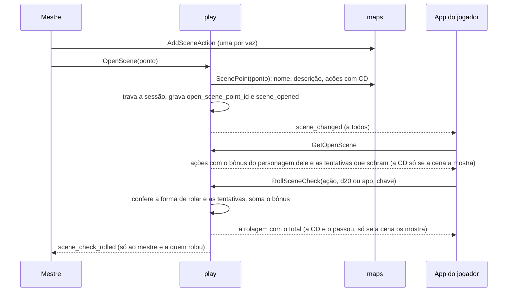

- **Ganchos, pistas e descobertas** (MR-029 e MR-030, Etapa 8; perguntas 59 a 61, decididas pelo Samuel em 03/10/2026). Os "Ganchos e anotações" são um texto Markdown do mestre, até 4.000 caracteres, na coluna `map_points.hooks`: salvam com o ponto (`UpdateMapPoint`) e só o mestre os recebe, no mapa e na cena aberta. As pistas (`scene_clues`) são textos de 1 a 500 caracteres, até 30 por cena, que o mestre muda uma por vez (`AddSceneClue`, `UpdateSceneClue`, `MoveSceneClue`, `RemoveSceneClue`), como as ações.
  - **Revelar** (`RevealSceneClue(campanha, pista, character_ids)`): o app marca todos os personagens de jogador por padrão e o mestre desmarca. Cada jogador recebe a pista **uma vez** (`scene_clue_reveals`, único por pista e jogador: repetir não muda nada, não grava evento e não avisa ninguém), e **não há "esconder de novo"**. A linha guarda uma **cópia do texto**, então editar ou apagar a pista, ou a cena, depois não muda o que o jogador recebeu (decisão: a pista foi dita à mesa). Com sessão aberta, a revelação vira o evento `clue_revealed` (só IDs: a pista, o ponto e os personagens que ainda não a tinham, nunca o texto) e o `maps` o grava pela interface `LiveSession.AppendEvent`, a mesma que o `progression` usa; sem sessão, a revelação vale do mesmo jeito. Só os jogadores que a receberam ouvem `notes_changed`. Quem está offline a lê no próximo `ListNotes`.
  - **Quem tem cada pista**: o mestre recebe cada pista com `revealed_to` (os personagens e quando); "Todos", "Só a Brisa" e "Ninguém ainda" a tela calcula comparando com o grupo.
  - **Descobertas** (`scene_discoveries`): uma cena é descoberta quando seu ponto é revelado no mapa (`SetMapPointRevealed(true)` ou `UpdateMapPoint` com `revealed`) ou quando o mestre a abre (`OpenScene`, mesmo escondida); vale para o grupo todo e continua valendo se o ponto for escondido de novo. É a única lista de cenas que um jogador alcança por nome fora do mapa e da cena aberta (ver [Módulo notes](#módulo-notes-anotações-dos-jogadores)).
- **Como o `play`, o `maps` e o `characters` se encontram.** O `play` lê a cena pelo `MapKeeper.ScenePoint` (`maps.SessionMaps`, que traz também os ganchos e as pistas, e que o `play` só entrega ao mestre) e grava a descoberta pelo `MapKeeper.DiscoverScene`, na transação de `OpenScene`, pede os bônus ao `CombatRoster.SceneOptions` e o nome do teste ao `CombatRoster.SceneCheckName` (`characters.Service`), e o `maps` pergunta qual ponto é a cena aberta pelo `LiveSession.OpenScenePoint` (`play.Service`), para avisar o stream quando muda uma ação ou o ponto da cena aberta.
- **O histórico** (`session_events`): o payload de `scene_check_rolled` leva só IDs e números (o ponto, a ação, a chave do teste, o d20, o bônus, o total, `physical`, `dc_shown` (a cena mostrava a CD) e, se a ação tinha CD, `passed`), nunca um nome de pessoa, de ação ou de cena, nem a CD (ver [Privacidade](privacidade.md)). O de `scene_attempt_granted` leva o ponto e a ação. O palco grava `stage_changed` com o `change` (`put`, `taken_off`, `speaker` ou `cleared`) e o ID do NPC, sem nome.

### NPCs em cena: o palco

O palco é a fila de NPCs "em cena" na cena aberta, como numa visual novel (MR-031, Etapa 8, D7; pergunta 62, decidida pelo Samuel em 03/10/2026: o retrato fica na ficha do NPC e aparece na cena e no cartão do combate). O código é `backend/internal/play/stage.go`; o retrato é do `characters` (`portrait.go`); a regra de baixar a imagem é do `maps` (`serve.go`).

- **O retrato** é o campo `portrait_image_id` da ficha de um NPC (`FullSheet` ou `BasicSheet`): uma imagem da galeria da campanha. O `characters` confere pela interface `Gallery` (`SetGallery`; quem implementa é `maps.SessionMaps.ImageInCampaign`, que o `cmd/api` entrega antes de ligar o resto, porque só precisa do banco): uma imagem de outra campanha, ou que não existe, é `invalid_argument` com o mesmo texto, para ninguém saber que existe em outra, e a ficha de um jogador recusa o campo. **Apagar a imagem da galeria limpa o retrato** (`DeleteGalleryImage` chama `ClearPortraits` na mesma transação e manda `stage_changed`), em vez de recusar como faz para o fundo de um mapa: o retrato cai nas iniciais, o mapa sem imagem não é mapa. Um retrato gravado no instante em que a imagem é apagada pode sobreviver a ela: a URL responde `404` e o app desenha as iniciais; o próximo salvamento da ficha é recusado até o retrato ser trocado. O cartão do NPC no combate (`Combatant.portrait_url`) leva a URL só na cópia do mestre (`TestMR031_TheMastersNPCCardHasThePortrait`).
- **O palco** é a tabela `stage_npcs` (ver [Dados](dados.md)): por sessão, em ordem, no máximo 4. Três chamadas do `PlayService`, só do mestre e só com a sessão aberta: `PutOnStage(character_id)` (qualquer NPC vivo da campanha, escondido no combate ou não, o que não o revela lá; recusa com `SceneBlocked` `NO_OPEN_SCENE` sem cena aberta e `STAGE_FULL` com 4 em cena; repetir não muda nada), `TakeOffStage` e `SetSpeaker` (um só fala por vez; vazio, ninguém). Cada uma trava a linha da sessão, muda e grava um `session_events` `stage_changed` (só IDs, sem nome) na mesma transação, e depois do `COMMIT` publica `stage_changed` (campo 17 do `WatchGameSessionResponse`, sem conteúdo) a todos. A resposta é o palco como ficou. **Fechar a cena, ou abrir outra, esvazia o palco** na mesma transação (`OpenScene` e `CloseScene` chamam `clearStage`): abrir de novo a que já está aberta não muda nada.
- **O que cada um recebe (RN-20).** O palco vai no `OpenSceneInfo.stage` do `GetOpenScene` (a resposta do `OpenScene` também o leva): cada entrada tem o nome do NPC, a URL do retrato (vazia sem retrato: o app desenha as iniciais) e se ele fala. O mestre recebe também o `character_id`, que as três chamadas pedem. **O jogador nunca recebe** o tipo, o PV, a CA, o XP, a ficha, as notas nem o ID do personagem: o `id` da entrada é o lugar no palco, feito quando o NPC entra, e não nomeia ninguém. O stream leva só o aviso. `TestMR031_APlayerSeesOnlyNameAndPortrait` lê cada resposta e cada evento que o jogador recebe, como o JSON do app, e confere as chaves de cada entrada.
- **Baixar o retrato.** O jogador só baixa a imagem (e a miniatura) de um NPC **enquanto ele está no palco da cena aberta** da sessão aberta da campanha; em qualquer outra hora é `404`, como numa imagem que ele não pode ver: fora de cena, com a cena fechada, trocada ou a sessão encerrada, também no `If-None-Match` (nunca um `304`). É a mesma forma da imagem mostrada (MR-028): `maps.playersSeeImage` pergunta ao `play` (`LiveSession.ImageOnStage`), depois das outras regras. O mestre baixa sempre (`TestMR031_PortraitsAreVisibleOnlyOnStage`).
- **A tabela de quem chama.** As três chamadas estão na tabela do `PlayService` acima; `TestAuthorizationMatrix` (no `play`) e `TestStageAuthorizationMatrix` (no `maps`, com cena e NPCs de verdade) chamam cada uma como mestre, jogador, de fora, pendente e sem login.

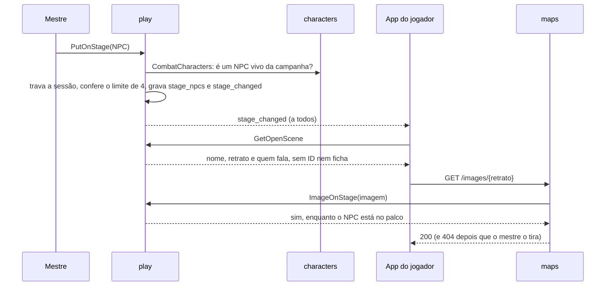

### Combate

Um combate (no código, um *encounter*) vive dentro da sessão aberta: o mestre escolhe quem luta, todos rolam a iniciativa, os turnos giram até o mestre encerrar (MR-013). O contrato é o `CombatService`, em `proto/meurpg/play/v1/combat.proto`, e os eventos andam no mesmo stream da sessão. Fica num serviço à parte, e não como mais métodos do `PlayService`, porque o combate cresce a cada fatia (ataques, desfazer e registro; depois as magias, as reações, os testes contra a morte, as condições e as features) e o `play.proto` já é o maior arquivo do módulo; os dois serviços são implementados pelo mesmo `play.Service` e montados juntos, com os mesmos interceptors. O código fica em `combat.go` (as chamadas), `combat_write.go` (a transação que toda mudança compartilha), `combat_view.go` (quem vê o quê), `combat_rules.go` (as contas, puras e testadas sem banco), `combat_actions.go` (as opções, o ataque, o dano, as ações padrão e os PV do NPC), `combat_undo.go` (o desfazer), `combat_log.go` (o registro), `combat_events.go` (o payload dos eventos), `combat_spells.go` e `combat_spells_view.go` (conjurar), `combat_reactions.go` (o Escudo), `combat_death.go` (os testes contra a morte e a confirmação), `combat_conditions.go` (condições e concentração) e `combat_vitals.go` (espaços, usos e PV pelos `character_vitals`).

```mermaid
stateDiagram-v2
    [*] --> setup: StartEncounter
    setup --> active: BeginCombat (todos com iniciativa)
    active --> active: EndTurn
    setup --> ended: EndEncounter
    active --> ended: EndEncounter
    setup --> ended: a sessão termina
    active --> ended: a sessão termina
    ended --> [*]
```

| Chamada do `CombatService` | Quem pode | O que faz |
| --- | --- | --- |
| `StartEncounter` | O mestre, com a sessão aberta | Cria o combate em `setup`, no mapa atual (que precisa de grade) ou no mapa do ponto de batalha. Põe o grupo e as cópias dos NPCs; cada NPC rola a própria iniciativa na hora. Com `monsters` ("Começar este combate", MR-043), põe também os monstros do bestiário, na mesma transação e pelo mesmo código do `AddMonsters` ([O montador de encontros](#o-montador-de-encontros-mr-043-fatia-109c)) |
| `GetEncounter` | Membros, filtrado | O último combate da sessão aberta, inclusive o que acabou de terminar, ou nenhum |
| `SubmitInitiative` | O jogador no próprio personagem, ou o mestre em qualquer um | d20 rolado no app (`roll_in_app`) ou o d20 físico digitado (`d20_face`), com a RN-18: com "cada jogador escolhe" o jogador escolhe a cada rolagem, e só um modo que o mestre forçou barra (`WRONG_DICE_MODE`). Só em `setup` |
| `SetInitiativeOrder` | O mestre | Ordena o empate (mesmo total e mesmo bônus) |
| `BeginCombat` | O mestre | `active`, rodada 1, o primeiro da ordem na vez. Sem a iniciativa de alguém: `failed_precondition` (`INITIATIVE_MISSING`) com quem falta |
| `EndTurn` | O jogador do membro, ou o mestre (qualquer um) | Encerra a parte de um membro do turno; quando o último que age encerra, o turno passa ao próximo grupo que não está derrotado e, depois do último, a rodada sobe (num turno de um só, é a vez toda, como sempre). `aborted` se `expected_combatant_id` não é mais um membro que age. Com dano a rolar, a aplicar ou à espera de uma reação do combatente da vez: `PENDING_DAMAGE`, e só o mestre passa assim mesmo (`discard_pending_damage`), o que descarta o dano. Com o teste contra a morte do jogador por rolar: `DEATH_SAVE_DUE` (o mestre passa assim mesmo). Se ninguém está na vez (o combatente da vez saiu do combate, ou o personagem dele foi apagado), só o mestre chama, e a vez recomeça do primeiro da ordem, na mesma rodada |
| `MoveCombatant` | O jogador no próprio personagem, na vez dele; o mestre em qualquer um, sempre | Põe o combatente num quadrado, ou o faz saltar (`jump`). O jogador paga o comprimento exato da linha em décimos de pé, com o terreno e as criaturas na conta, e é limitado pelo movimento que sobra; o mestre, não ([Movimento no combate](#movimento-no-combate-etapa-9-fatia-96)) |
| `GetMoveOptions` | O jogador no próprio personagem, na vez dele; o mestre em qualquer um | Todo quadrado que o combatente alcança num movimento reto, com o custo, e o motivo de cada quadrado do círculo que recusa (`IDEMPOTENT`) |
| `SetCombatantSide` | O mestre | Marca um NPC como "Aliado" (lado do grupo) ou inimigo, e grava `side_set` |
| `SetCombatantCover` | O mestre | Marca à mão a cobertura de um combatente (nenhuma, meia, três quartos, total), que some quando ele se move, e grava `cover_set` |
| `SetCombatantHidden` | O mestre | Esconde ou mostra um NPC |
| `AddCombatants` | O mestre | Reforços (NPCs), com a iniciativa rolada na hora e o lugar na ordem |
| `AddMonsters` | O mestre | "Pôr no combate" (MR-042, RN-29): de 1 a 10 monstros de uma criatura do SRD, com PV médios ou rolados, escondidos por padrão, cada um com a iniciativa rolada na hora (ver "Monstros no combate" na seção do módulo `characters`) |
| `RemoveCombatant` | O mestre | Tira alguém; se era a vez dele, a vez passa |
| `EndEncounter` | O mestre | `ended`; os tokens dos jogadores vão para onde eles pararam. Encerrar de novo não é erro |
| `GetTurnOptions` | O jogador no próprio personagem; o mestre em qualquer um | O que o combatente pode fazer agora ("Sua vez"), com os alvos de cada ataque e de cada magia (`spell_targets`, com a distância, os dardos por círculo e quantos alvos a magia aceita) e o dano que falta rolar ou aplicar. Responde também fora da vez, com tudo desabilitado e o motivo |
| `RollAttack` | O jogador no próprio personagem, na vez dele (ou com `as_reaction`, fora dela); o mestre em qualquer combatente da vez | O ataque, primeiro passo: rola o d20 (app ou face física), gasta a ação (ou a reação, no ataque de oportunidade) e compara com a CA do alvo |
| `CastSpell` | O jogador no próprio personagem, na vez dele; o mestre em qualquer combatente da vez | Conjura: gasta o espaço e a ação ou a ação bônus de uma vez, e resolve pelo que a magia é (ataque de magia, resistência, dardos, cura ou só registro) |
| `DeclineOpportunity`, `SkipOpportunity` | O controlador do reator (o jogador do personagem ou da criatura; o mestre, de um NPC) recusa; só o mestre segue sem esperar | Respondem uma oferta de ataque de oportunidade sem atacar (o ataque é o `RollAttack` com `opportunity_offer_id`); gravam `reaction_declined` ([Ataques de oportunidade](#ataques-de-oportunidade-etapa-9-fatia-96b)) |
| `UseReaction`, `DeclineReaction` | O jogador no personagem atingido; o mestre em qualquer um | O Escudo quando um golpe acerta: gasta o espaço e a reação, dá +5 na CA até o começo da próxima vez do personagem e compara o golpe de novo; ou deixa o golpe passar |
| `RollDeathSave` | O jogador no próprio personagem; o mestre em qualquer um | O teste contra a morte de quem está a 0 PV, no começo da vez dele |
| `ConfirmDeath` | O mestre | Confirma a morte de quem falhou três vezes: marca o personagem como morto e o tira da ordem. Não se desfaz |
| `SetCombatantConditions` | O mestre; o jogador só para encerrar a concentração do próprio personagem | As condições (rótulos, RN-22) e o fim da concentração |
| `RollDamage` | O jogador no próprio ataque; o mestre em qualquer um | O dano do ataque que acertou, segundo passo. NPC alvo: aplicado na hora. Personagem de jogador: fica `ROLLED`, esperando o mestre. Numa magia de área, uma rolagem só vale para todos os alvos da conjuração; uma cura aplica na hora |
| `ApplyPendingDamage`, `DiscardPendingDamage` | O mestre | "Aplicar 5 de dano" (pelos `character_vitals`, RN-02), com a quantia que ele quiser no lugar da rolada (`amount`), e "Não aplicar" |
| `TakeAction` | O jogador no próprio personagem, na vez dele; o mestre em qualquer combatente da vez | As ações padrão que só gastam a economia (Disparada, Desengajar, Esquivar, Ajudar, Esconder, Preparar, Procurar, Usar um objeto) e as ações das features (`feature:second-wind`, `feature:action-surge-1-use`...), que gastam também um uso do recurso |
| `AdjustCombatantHitPoints` | O mestre | "Dano/Cura" de um NPC: dano, cura ou valor exato, e PV temporários |
| `UndoLastAction` | O mestre | Desfaz a última ação, um passo, com um evento compensatório |
| `ListCombatLog` | Membros, filtrado | O registro do combate, da última rodada para a primeira |

Os erros de estado são `failed_precondition` com o detalhe `EncounterBlocked` e um motivo (`MAP_HAS_NO_GRID` com o `map_id`, para a tela oferecer a grade; `NO_CURRENT_MAP`; `ENCOUNTER_ALREADY_OPEN`; `NOT_IN_SETUP`; `NOT_ACTIVE`; `NOT_YOUR_TURN`; `NOT_PLACED`; `TOO_FAR` com `missing_ft`; `SQUARE_OCCUPIED`; e, nas ações, `ACTION_USED`, `BONUS_ACTION_USED`, `REACTION_USED`, `ATTACKS_USED`, `NO_SLOT` com `min_level`, `NO_USES` com `recharge`, `TARGET_OUT_OF_REACH` com `missing_ft`, `TARGET_DEFEATED`, `COMBATANT_DOWN`, `PENDING_DAMAGE`, `REACTION_PENDING`, `NOT_AWAITING_REACTION`, `DEATH_SAVE_DUE`, `DEATH_SAVE_NOT_DUE`, `NOT_DYING`, `DAMAGE_ALREADY_ROLLED`, `DAMAGE_NOT_ROLLED`, `DAMAGE_RESOLVED`, `NOTHING_TO_UNDO`, `WRONG_DICE_MODE`...). Quem chama não depende do texto da mensagem.

**Como o `play` lê os outros módulos.** Por interfaces pequenas, ligadas no `cmd/api`, sem importar código de ninguém. Os tipos simples que passam por elas ficam em `play/link`, um pacote que não importa nada do projeto.

| Interface do `play` | Quem implementa | Para quê |
| --- | --- | --- |
| `CombatRoster` (`CombatParty`, `CombatCharacters`, `CombatSheet`, `CombatTurnOptions`, `CombatSpell`, `CombatSave`, `MarkDead`, `Conditions`) | `characters.Service` | Quem pode lutar, com o bônus de iniciativa, a velocidade e o PV máximo (do `rules.Derive` numa ficha completa; como está numa ficha básica); a CA, os ataques, as ações padrão e as das features de um personagem (`link.Sheet`, com os ataques por ação); o `TurnOptions` do motor de regras, com os espaços e os usos que o personagem já gastou; a magia como o conjurador a conjura, já no círculo do espaço (`link.Spell`: alcance, ataque ou resistência, dano ou cura com o modificador do conjurador); o bônus de resistência de um alvo (uma ficha básica não tem: `Known` falso); a morte confirmada pelo mestre (o efeito do `MarkCharacterDead`, na transação do combate); e as condições do SRD. Uma ficha básica vira um `rules.Derived` mínimo (os ataques estruturados como `basic:0`, `basic:1`, e as dez ações padrão), então o motor serve ao Goblin como serve ao Toren |
| `DiceModes` (`ForcedDice`) | Um adaptador em cima de `campaigns.Service.CampaignDiceMode` | O que o modo da campanha obriga: nada (`cada jogador escolhe`), tudo no app, ou tudo com dado físico (RN-18). A preferência do jogador não entra: ela só é o padrão que a tela destaca (`PlayerDiceMode`, `EffectiveDiceMode`) |
| `MapKeeper` (mais `MapGrid`, `BattlePoint`, `MapTokens`, `SetTokenPositions`) | `maps.SessionMaps` | A grade do mapa, o mapa de um ponto de batalha, onde estão os tokens e, no fim, mover os tokens dos jogadores |

**A grade e o movimento (RN-21).** O mapa tem `grid_columns` (4 a 200 quadrados de 1,5 m na largura da imagem); as linhas seguem a proporção da imagem (`round(colunas × altura / largura)`, de 1 a 400) e não são guardadas. O combate copia a grade ao começar (`encounters.grid_columns` e `grid_rows`), então mudar a grade do mapa depois não mexe em ninguém. Cada combatente começa no quadrado do token do personagem, se tem um (de várias cópias de um NPC, só a primeira), e senão sem posição: o mestre o põe. O jogador anda na própria vez, no máximo o movimento que sobra: a velocidade da ficha (dobrada depois da Disparada, `dashed`) menos o que já andou, em décimos de pé, e uma linha reta custa o seu comprimento exato (um passo na diagonal vale 7,1 ft), com o terreno e as criaturas na conta (ver [Movimento no combate](#movimento-no-combate-etapa-9-fatia-96); o círculo substituiu a distância de Chebyshev na fatia 9.6). Passou: `TOO_FAR`. Um quadrado ocupado por alguém que ele vê: `SQUARE_OCCUPIED`; um combatente escondido do jogador não bloqueia, para o erro não revelar que ele está ali. O mestre move qualquer um para qualquer quadrado da grade, sem gastar movimento. A Disparada (`TakeAction`) chama `markDashed`, e o movimento que sobra dobra até o fim da vez.

**A ordem (RN-19).** Maior total primeiro; no empate, maior bônus; no empate dos dois, a ordem que o mestre decidiu (`SetInitiativeOrder`), e sem decisão, a de entrada. Quem ainda não rolou fica no fim. O servidor guarda a posição de cada um (`order_index`) e refaz a ordem a cada rolagem ou reforço. O jogador rola a própria iniciativa uma vez só, para ninguém rolar de novo até sair bom; o mestre pode corrigir qualquer valor. Cada NPC rola o seu, no servidor, com `crypto/rand` (RN-19); o dado físico é validado pela `platform/dice`.

**Quem vê o quê (RN-10, RN-20).** Como no mapa, o filtro roda no servidor (`combat_view.go`) e o que o jogador não vê fica fora da resposta, nunca em branco. `TestRN20_PlayersNeverReceiveHiddenCombatantsOrNPCNumbers` lê a resposta do jogador como o JSON que o app recebe e procura nela o combatente escondido e os números do NPC.

| O quê | O mestre vê | O jogador vê |
| --- | --- | --- |
| Combatente escondido (NPC novo nasce escondido) | Todos | Nenhum: nem o ID, nem o nome, nem a posição |
| A vez de um escondido | O combatente | "Vez do mestre": `current_combatant_id` vazio e `master_turn` verdadeiro |
| PV e PV temporários de um NPC | Os números | Uma palavra: Ileso, Ferido, Muito ferido (metade ou menos) ou Derrotado |
| CA de qualquer combatente | Só o mestre: `Combatant.armor_class` (a lista da ordem, "CA 15") e `AttackRoll.target_armor_class` ("Acertou contra CA 18 do Toren"); o servidor lê a ficha de cada um só para a cópia do mestre | Nunca: nenhuma resposta a leva, só Acertou ou Errou |
| Iniciativa de um NPC | O total, o d20 e o bônus | Nada: só a ordem |
| Iniciativa de um jogador | Tudo | O total de todos os jogadores; o d20 e o bônus, só do próprio |
| PV de um jogador | Os números, dos `character_vitals` | Os do próprio personagem vêm da sessão ao vivo; os dos outros jogadores, não (pergunta 28); só a palavra "Caído" a 0 PV, de todos |
| Velocidade, movimento que sobra, ação, ação bônus, reação | Todos | Só do próprio personagem |
| De qual personagem um NPC é cópia | Sim | Não |

**O ataque em dois passos (MR-012, MR-014).** São duas chamadas porque, com dado físico, o jogador digita o d20 e depois o dano (RN-18). `RollAttack` confere quem pode (o jogador no próprio personagem, na vez dele, com a ação livre, o alvo à vista e ao alcance; o mestre em qualquer combatente da vez, sem limite de alcance nem de ação: o Capitão com várias armas é dele), rola o d20 (`crypto/rand` no app, ou a face digitada, 1 a 20), gasta a **ação** e compara com a CA do alvo (`rules/combat.ResolveAttack`: 20 natural é crítico, 1 natural erra). A resposta traz a rolagem em números (`1d20 (13) + 6 = 19`) e o resultado, **nunca a CA para o jogador**; a resposta do mestre leva também a CA contra a qual o total foi comparado (`target_armor_class`, com o +5 de um Escudo ativo, guardada no evento, para um reenvio achar a mesma). `TestRN20_PlayersNeverReceiveCAOrHiddenLogEntries` procura a CA no JSON do jogador e confere que a do mestre a tem. Acertou: abre uma linha em `pending_damages` (guardada, para um reenvio ou um recarregamento achar). `RollDamage` rola os dados do dano (no crítico, como a regra da mesa manda: dobrados, ou uma vez com o máximo somado; o modificador uma vez, o tipo do ataque) ou valida a soma digitada (`dice.Physical`, de N a N × faces). A Ação de Atacar faz um ataque, ou mais com o Ataque Extra (ver abaixo); a vantagem e a desvantagem ficam por conta da mesa.

```mermaid
sequenceDiagram
    actor J as Jogador
    participant S as play (servidor)
    participant DB as CockroachDB
    actor M as Mestre
    J->>S: RollAttack(atacante, ataque, alvo, d20)
    S->>S: alcance (RN-21), RN-18, CA do alvo (só no servidor)
    S->>DB: gasta a ação, abre o dano pendente, evento attack_rolled
    S-->>J: o d20, Acertou ou Errou (nunca a CA)
    J->>S: RollDamage(pending_id, dados)
    alt O alvo é um NPC
        S->>DB: aplica na hora (PV temporários primeiro, 0 = derrotado), evento damage_rolled
        S-->>J: Aplicado, "Goblin 2 derrotado"
    else O alvo é um personagem de jogador
        S->>DB: guarda a rolagem (ROLLED), evento damage_rolled
        S-->>J: Pendente: o mestre aplica
        M->>S: ApplyPendingDamage(pending_id)
        S->>DB: ajusta os character_vitals (RN-02), evento damage_applied
    end
```

**Dano pendente.** `pending_damages` guarda o dano de um acerto, com os dados copiados da ficha no momento do acerto (uma ficha mudada depois não mexe numa rolagem aberta; o crítico já vem com a regra da mesa aplicada: os dados dobrados, ou os dados de sempre mais o máximo em `critical_max`, ver [As regras da mesa no combate](#as-regras-da-mesa-no-combate-etapa-10-fatia-104b)). O estado vai de `awaiting_roll` a `rolled` (só para personagem de jogador) e a `applied` ou `discarded`. Um NPC aplica na hora: `ApplyDamage` (PV temporários primeiro, piso em 0); a 0 PV ele fica `defeated` e `nextTurn` o pula. O dano em personagem de jogador espera o mestre (RN-02) e passa pelos `character_vitals` (o mesmo caminho da correção), com o piso em 0; a 0 PV o personagem está **caído**: o `GetEncounter` mostra a palavra `COMBATANT_STATE_DOWN` ("Caído") a todos que o veem, derivada dos `character_vitals`, sem números. Os testes contra a morte são da seção [Os caídos](#os-caídos-rn-03); a morte por dano massivo continua sendo do mestre. `EndTurn` com dano aberto do combatente da vez recusa com `PENDING_DAMAGE`; só o mestre passa assim mesmo (`discard_pending_damage`, o "Passar o turno mesmo assim?" da tela), e o dano aberto é descartado na mesma transação.

**Conjurar (MR-014).** `CastSpell` gasta o espaço e a ação (ou a ação bônus) **na conjuração**, na mesma transação (MR-014, critério 2): um reenvio com a mesma chave não gasta nada, e uma conjuração recusada também não. Quem conjura: o jogador no próprio personagem, na vez dele (uma magia preparada ou um truque de resistência da lista de opções); o mestre, em qualquer combatente da vez (um NPC com ficha completa conjura da ficha; os espaços de NPC não são contados, só os de personagem de jogador). A magia, o círculo (`slot`: nível ou pacto, nenhum para truque) e os alvos vêm conferidos contra o `TurnOptions` do personagem, e os alvos contra o que ele vê, o alcance (Pessoal só o conjurador, Toque 5 ft, à distância o alcance da magia; o mestre nunca é limitado) e quantos alvos a magia aceita. Quem diz se uma magia atinge uma área e quantos alvos leva é o `SpellDetails.Target`: o que o mestre escreveu na magia da mesa, a área estruturada do 5e-database na do SRD e, só para a que não tem área estruturada, o texto do SRD, lido com dois padrões (`rules/spelltarget.go`); um ataque de magia leva um alvo, então um palpite errado nunca trava o mestre (ele não é limitado pelo número de alvos). A magia da mesa conjura-se pelo mesmo `CombatSpell`, com o conteúdo da campanha (ver a seção abaixo).

| A magia é | O que a conjuração faz | O que fica para `RollDamage` |
| --- | --- | --- |
| Ataque de magia (Raio Gélido... com `attack_type`) | Um d20 por alvo (`roll_in_app`, ou `d20_face` para um alvo só, RN-18 a cada rolagem), contra a CA como no `RollAttack` (o crítico segue a regra da mesa); o acerto abre o dano pendente, e o Escudo pode segurá-lo | O dano de cada acerto |
| Resistência (Mãos Flamejantes, Chama Sagrada) | O servidor rola a resistência de cada alvo: um NPC de ficha completa usa o bônus do `Derived.SavingThrows`; uma ficha básica não tem bônus, rola d20 + 0 e o registro diz (`bonus_known` falso, só para o mestre); o personagem de jogador também é rolado no app com o bônus da ficha (a palavra final é do mestre, pelo `amount`). Quem passa leva metade (arredondada para baixo) ou nada, como a magia diz | **Uma** rolagem para a conjuração toda (SRD): os danos pendentes dela dividem um `cast_id`, e rolar um assenta todos, cheio ou pela metade |
| Mísseis Mágicos | Os dardos (3, e mais um por círculo acima) são divididos entre os alvos, ao menos um em cada, somando exato; sem rolagem de ataque | O dano de cada alvo: 1d4 + 1 por dardo, em qualquer círculo (o dano do SRD no círculo é o da salva inteira, e cada dardo é 1d4 + 1) |
| Cura | Um dano pendente que é cura | A rolagem com o modificador de conjuração ("+ MOD") cura **na hora**, até o máximo, por NPC e por personagem (pelos `character_vitals`); quem estava a 0 PV levanta e os testes contra a morte zeram |
| Lê PV (Sono, Borrifo de Cores, Palavra de Poder, Poupar os Moribundos, Cura Completa) | O servidor lê o PV de cada alvo (NPC: `combatants.hp_current`; personagem de jogador: o `VitalsKeeper`) e aplica o efeito na hora, na mesma transação (ver [Magias que leem PV](#magias-que-leem-pv)) | — |
| O resto (Teia, Passo Nebuloso...) | Gasta e registra; o efeito é da mesa, e o mestre marca as condições depois | — |

#### Magias que leem PV

Seis magias do SRD não rolam dano: o que fazem depende do PV de quem está na área (MR-014, Etapa 8, pergunta 58). O que cada uma faz é conteúdo escrito à mão, em `rules/srd51/effects/spells.json`, num conjunto fechado de quatro tipos que o carregador confere (como o `effects/` das features; mudar o arquivo pede uma revisão nova, a `fx.6`):

| Tipo | O que faz | Magias |
| --- | --- | --- |
| `hp_pool` | Rola um total de dados (e os dados a mais por círculo acima do da magia) e passa pelas criaturas em ordem crescente de PV atual, pulando as que já estão inconscientes ou a 0 PV; cada uma cujo PV cabe no que sobrou ganha a condição, e o total desce pelo PV dela | Sono (5d8, +2d8, Inconsciente), Borrifo de Cores (6d10, +2d10, Cego) |
| `hp_threshold` | A criatura com PV igual ou menor que N sofre o efeito: uma condição ou a morte | Palavra de Poder: Atordoar (150, Atordoado), Matar (100, morre) |
| `zero_hp_target` | Só vale numa criatura a 0 PV, e a deixa estável | Poupar os Moribundos |
| `flat_heal` | Cura um valor fixo (mais um tanto por círculo) e encerra condições | Cura Completa (70, +10 por círculo; encerra Cego e Surdo) |

`rules.SpellEffect(chave, círculo)` devolve o efeito já no círculo do espaço. As contas são funções puras de `rules/combat` (`hpspells.go`): `ResolvePool`, `ResolveThreshold`, `ResolveZeroHP` e `ResolveFlatHeal` recebem o PV de cada criatura e os dados rolados e dizem quem é afetado (empates mantêm a ordem dos alvos; o limite vale com PV exatamente igual a N). Em `play`, `combat_spells_hp.go` lê o PV de verdade e aplica o resultado: a condição pelo mesmo campo que o `SetCombatantConditions` escreve; a "morte" derrota um NPC (0 PV) e leva um personagem de jogador a 0 PV com três falhas de morte, para o mestre confirmar com `ConfirmDeath` (RN-03); o personagem a 0 PV de Poupar os Moribundos fica estável (três sucessos). O total do pool é rolado no servidor (`roll_in_app`) ou digitado com dado físico (`pool_sum`, a soma dos dados), e segue o modo de dados da campanha como qualquer rolagem (RN-18). O evento da conjuração guarda, por alvo, o PV de antes, o que foi afetado e o que o "Desfazer última ação" precisa devolver (PV, falhas de morte, condições).

**Quem recebe o quê (RN-20).** `SpellCast` (a resposta) e `CombatLogSpell` (o registro) levam campos tipados, e o app nunca lê texto: `effect_kind`, `effect_condition_key` e, por alvo, `SpellEffectResult.outcome` (afetado ou não) vão para todo mundo que vê a linha; `pool_roll` (`5d8 (2, 4, 1, 5, 3) = 15`) só para o mestre e para o jogador de quem conjurou; `effect_threshold`, e por alvo `reason`, `hit_points_before`, `pool_order` e `pool_left`, só para o mestre; `healed`, para o mestre e para o jogador do alvo (num NPC, a quantidade contaria a quem conjurou quantos PV faltavam). Os alvos continuam na ordem que quem conjurou listou, e a ordem do total só aparece no `pool_order` do mestre.

Uma conjuração leva no máximo **10 alvos**, também a do mestre: o que cada alvo sofreu fica no evento da conjuração e no da rolagem de dano, e o payload de um `session_events` tem no máximo 4 KiB (`00024`); passar disso é `invalid_argument`. Uma cura aparece no registro com o que o alvo recuperou (até o máximo) só para o mestre e para o jogador do alvo; os outros recebem a rolagem, porque o número cortado diria quantos PV faltavam (RN-20).

Uma magia de concentração põe o nome dela em `concentration_spell` do conjurador; uma segunda a troca, e o registro diz qual terminou (RN-22). O `GetTurnOptions` traz, para cada magia que dá para conjurar agora, os alvos que quem chama vê, com a distância e `too_far`, e os dardos por círculo.

**A reação: o Escudo (decisão 5 da linha do tempo).** Quando um golpe que não é crítico acerta um personagem de jogador que pode conjurar o Escudo agora (preparado, com espaço livre, reação livre, de pé), o dano pendente nasce em `AWAITING_REACTION`, e não em `AWAITING_ROLL`: quem atacou vê "esperando a reação", e o jogador atingido e o mestre recebem o aviso no `GetEncounter` (`reaction_prompts`, por quem vê: o mestre todos, o jogador os do próprio personagem, sem o atacante e sem o total do golpe). O jogador decide sem saber o total, como numa mesa.

```mermaid
sequenceDiagram
    actor M as Mestre (ataca)
    participant S as play (servidor)
    actor J as Jogador atingido
    M->>S: RollAttack(Capitão, alvo: Pensantus)
    S->>S: o d20 acerta a CA, não é crítico, e o alvo pode conjurar o Escudo
    S-->>M: Acertou, dano pendente AWAITING_REACTION
    S-->>J: encounter_changed, reaction_prompts no GetEncounter
    alt O jogador usa o Escudo
        J->>S: UseReaction(pending_id, círculo)
        S->>S: gasta o espaço e a reação, ac_bonus = 5, compara o total guardado com a CA + 5
        alt O total ficou abaixo
            S-->>J: STOPPED, o dano pendente é descartado e o registro diz que o Escudo o segurou
        else Ainda acerta
            S-->>J: STILL_HIT, o dano pendente vai a AWAITING_ROLL
        end
    else Ele deixa passar, ou o mestre responde por ele
        J->>S: DeclineReaction(pending_id)
        S-->>M: o dano pendente vai a AWAITING_ROLL
    end
    M->>S: RollDamage(pending_id)
```

`RollDamage` e `ApplyPendingDamage` num golpe que espera a reação dão `REACTION_PENDING`; `EndTurn` do atacante dá `PENDING_DAMAGE` (só o mestre passa, descartando). Os +5 ficam em `combatants.ac_bonus` até o começo da próxima vez do personagem (`ResetCombatantTurn`): todo ataque nesse meio tempo usa a CA da ficha mais o bônus, e o bônus nunca altera a ficha (RN-04). O **ataque de oportunidade** é o `RollAttack` com `as_reaction`: um ataque corpo a corpo (alcance de 5 ft; uma arma que a ficha lista com alcance próprio, como a adaga arremessável, conta como à distância) fora da vez, que gasta a reação no lugar da ação. As outras magias de reação são da mesa.

**Os caídos (RN-03).** Um personagem de jogador a 0 PV está "Caído" (a palavra vem dos `character_vitals`). A vez dele começa com um teste contra a morte por rolar (`death_save_due`, para ele e para o mestre), e a vez espera por ele. Quem cai a 0 PV **durante a própria vez** (um ataque de oportunidade, a correção do mestre) não deve o teste nessa vez: o primeiro é no começo da vez seguinte (SRD 5.1; `changeVitals` marca `death_save_rolled`).

```mermaid
stateDiagram-v2
    [*] --> Caido: chegou a 0 PV
    Caido --> Caido: teste de morte (sucesso ou falha), dano a 0 PV (uma falha; duas no crítico)
    Caido --> Estavel: 3 sucessos
    Estavel --> Caido: dano (os sucessos zeram e conta uma falha)
    Caido --> Morrendo: 3 falhas
    Morrendo --> Morto: o mestre confirma (ConfirmDeath)
    Caido --> De_pe: 20 natural, ou qualquer cura (1 PV ou mais): as contagens zeram
    Estavel --> De_pe: qualquer cura
    Morrendo --> De_pe: qualquer cura
    Morto --> [*]
```

`RollDeathSave` usa `combat.DeathSave` (10 ou mais é sucesso, menos é falha, 1 natural são duas falhas, 20 natural volta com 1 PV pelos `character_vitals`); o d20 é do app ou digitado, a cada rolagem (RN-18). Dano que acerta quem está a 0 PV (o "Aplicar" do mestre) não baixa os PV: soma uma falha (`combat.DamageWhileDown`). Toda cura acima de 0 zera as duas contagens: uma magia, Retomar o Fôlego, o 20 natural, a correção dos PV do mestre (`AdjustCharacterVitals`) e um desfazer, pelo mesmo caminho dos `character_vitals` (`changeVitals`). O jogador que tenta `EndTurn` com o teste por rolar recebe `DEATH_SAVE_DUE` (o mestre passa a vez mesmo assim). Com três falhas o personagem está **morrendo**: o mestre vê a palavra "Morrendo" e confirma com `ConfirmDeath`, que chama o efeito do `MarkCharacterDead` (o personagem passa a `dead` e o jogador pode criar outro), marca o combatente como fora da ordem e passa a vez se era a dele. Para os jogadores a palavra continua "Caído", com as contagens (públicas, a não ser que a mesa as esconda do que não é o dono nem o mestre: ver [As regras da mesa no combate](#as-regras-da-mesa-no-combate-etapa-10-fatia-104b)): o app nunca diz que alguém morreu antes de o mestre confirmar (pergunta 39). `ConfirmDeath` não se desfaz: o personagem já está morto no módulo `characters`. As contagens ficam na linha do combatente: o combate encerrado as guarda para o resumo ("Caída: 1 sucesso, 1 falha"), e um combate novo começa em 0 e 0.

**Condições e concentração (RN-22).** As condições são rótulos (`combatants.conditions`, chaves do SRD como `condition:poisoned`): `SetCombatantConditions` troca o conjunto inteiro, só o mestre; o jogador só encerra a concentração do próprio personagem. Não há efeito nenhum. Os jogadores veem as condições dos combatentes que veem (as chaves e os nomes em português, `condition_names_pt`), nunca as de um escondido. Quando um dano é aplicado a quem está concentrado, a resposta e o registro levam `concentration_dc` (`combat.ConcentrationDC` do dano que o alvo sofre, sem o que os PV temporários absorveram): "Teste de concentração: CD 10", só para o mestre e para o jogador do alvo. O app lembra; quem rola é a mesa.

**Recursos, ações das features e Ataque Extra.** Os usos gastos de cada recurso da ficha ficam em `character_vitals.resources_used` (`{chave: usos}`, cortados ao máximo da ficha na leitura, como os espaços), e a correção do mestre (`AdjustCharacterVitals.resources_used`) os devolve: não há descanso ainda. `TakeAction` aceita as `feature_actions` do `TurnOptions`: gasta a economia (uma ação grátis não gasta nada), um uso do recurso (`NO_USES` com a `recharge`; só personagem de jogador conta usos, e um recurso que é um reservatório de pontos, como Cura pelas Mãos, fica com o mestre) e vai para o registro. Só duas mudam números: **Retomar o Fôlego** cura 1d10 + o nível de guerreiro, rolado como um dano (RN-18) e curado pelos `character_vitals`, e **Surto de Ação** devolve a ação, com os ataques da Ação de Atacar. **Ataque Extra:** `combatants.attacks_made` conta os ataques da vez; o primeiro gasta a ação, os seguintes cabem enquanto sobram (`AttacksLeft`) e o último dá `ATTACKS_USED`; o contador volta a 0 no começo da vez. O Ataque Extra é só da Ação de Atacar, ou seja, de ataques com arma: um truque (`Kind` magia) gasta a ação inteira e não conta ataque, e depois de um ataque com arma o truque dá `ACTION_USED`, e vice-versa. O multiataque de NPC continua sendo do mestre, que pode atacar de novo.

| Ação de feature, níveis 1 a 5 | Economia | Como o combate trata |
| --- | --- | --- |
| Retomar o Fôlego (guerreiro) | Ação bônus, 1 uso por descanso curto | Cura 1d10 + nível pelo caminho dos PV; gasta o uso |
| Surto de Ação (guerreiro, nível 2) | Grátis, 1 uso por descanso curto | Devolve a ação e os ataques; gasta o uso |
| Fúria (bárbaro) | Ação bônus, usos por descanso longo | Gasta o uso e registra; os efeitos são da mesa |
| Inspiração de Bardo (bardo), Palavras Cortantes (bardo, reação) | Ação bônus; reação | Gasta e registra (a inspiração tem usos por descanso longo) |
| Sentido Divino, Cura pelas Mãos (paladino) | Ação | O primeiro gasta um uso; a Cura pelas Mãos é um reservatório de pontos do mestre: gasta a ação e nenhum ponto |
| Canalizar Divindade: Expulsar Mortos-Vivos e Preservar a Vida (clérigo), Arma Sagrada e Expulsar o Profano (paladino) | Ação | Gasta a ação e um uso e registra |
| Forma Selvagem (druida) | Ação | Não passa pelo `TakeAction`: é o `AssumeWildShape`, que gasta a ação e um uso, troca os números do combatente pelos da fera e registra (ver [A Forma Selvagem...](#a-forma-selvagem-os-olhos-do-familiar-e-os-tokens-das-criaturas-mr-037-e-mr-036-fatia-910)) |
| Conjuração Flexível: Criar Espaços de Magia e Converter Espaço de Magia (feiticeiro) | Ação bônus | Gasta a ação bônus e registra; os pontos de feitiçaria são da mesa |
| Rajada de Golpes, Defesa Paciente, Passo do Vento (monge, nível 2); Desviar Projéteis (reação); Queda Lenta (reação) | Ação bônus; reação | Gasta a economia e registra |
| Ação Ardilosa, Mãos Rápidas (ladino); Esquiva Sobrenatural (ladino, reação) | Ação bônus; reação | Gasta a economia e registra |
| Presa do Caçador: Matador de Gigantes (patrulheiro, reação); Estilo de Luta: Proteção (guerreiro e paladino, reação) | Reação | Gasta a reação e registra (fora da vez dá para usar) |
| Sopro (meio-dragão, traço da raça) | Ação | Gasta a ação e um uso e registra |

**Desfazer (compensação, não apagamento).** `UndoLastAction(expected_event_id)` desfaz um passo, só do mestre. A última ação é o último `session_events` da sessão que um desfazer ainda não desfez (`lastAction`): se for um ataque, um dano, um "Aplicar" ou "Não aplicar", uma ação padrão ou de feature, uma magia conjurada, um Escudo usado ou recusado, um teste contra a morte, as condições ou a concentração, ou o ajuste de PV de um NPC, daquele combate, pode ser desfeita (a confirmação da morte, não); qualquer evento depois (a vez passou, um movimento, uma correção dos PV) deixa `NOTHING_TO_UNDO`, porque desfazer por cima dele deixaria de ser repor o que estava antes. Cada evento guarda o antes (PV e `defeated`, a economia, os ataques feitos, o estado do dano, as contagens da morte, a concentração, as condições, o bônus de CA) e o que gastou (o espaço, o uso do recurso), e o desfazer escreve de volta, pelos mesmos caminhos (`character_vitals` para os espaços, os usos e os PV), e grava um evento `action_undone` com o ID do desfeito: o histórico guarda os dois. `expected_event_id` é o `undoable_event_id` do registro; se já é outro, `aborted`, e dois mestres nunca desfazem duas coisas. A linha desfeita some do registro.

**O registro do combate (D10, ADR-0007).** `ListCombatLog` monta o registro a cada leitura, a partir dos `session_events` do combate (a coluna `encounter_id`), da última rodada para a primeira, sem tabela própria: o histórico e o registro não podem discordar. Cada linha é estruturada (tipo, rodada, quem fez e em quem, o ataque ou a ação e o nome em português, as rolagens, o resultado, o dano e o tipo); a frase em português é do app. Os eventos de um ataque (a rolagem, o dano, o "Aplicar") viram **uma** linha, a do ataque. Entram: o começo e o fim do combate, os ataques (com o dano, a quantia que o mestre aplicou no lugar da rolada, só para ele, e o lembrete de concentração), as magias conjuradas (uma linha com o resultado em cada alvo: o ataque, a resistência, o dano ou a cura), as reações, os testes contra a morte e a morte confirmada, as condições e o fim da concentração, as ações padrão e de feature, o movimento na vez (`distance_ft`), e, só para o mestre, o ajuste de PV de um NPC e o "mostrar/esconder". A iniciativa, a ordem dos turnos e os reforços não são linhas do registro; o que acontece antes da rodada 1 também não.

| O quê | O mestre | O jogador |
| --- | --- | --- |
| Uma linha com um combatente escondido (hoje, ou quando aconteceu) | Sim, com `hidden` ligado ("Só o mestre vê") | Nenhuma: nem o ID, nem o nome, nem "espera escondido" |
| Um combatente que o mestre mostra depois | — | As linhas **novas**; as antigas (feitas escondido) continuam fora (cada evento guarda `secret`) |
| Os dados (d20 e dano) | Todos | Só os do próprio personagem; dos outros, o resultado e o dano que sofrem ou causam |
| A resistência de um alvo de magia | Os dados, o bônus e se o bônus é conhecido | O resultado como palavra (passou ou falhou); os dados só se o alvo é o personagem dele (nunca os de um NPC); a CD, só quem conjurou |
| Uma conjuração que toca um escondido | Sim, com `hidden` ligado | Nenhuma linha |
| A quantia que o mestre aplicou no lugar da rolada | As duas | Só o que o personagem levou |
| O aviso de reação (Escudo) | Todos, com o atacante | Só o do próprio personagem, sem o atacante e sem o total do golpe |
| Condições | Todas | As dos combatentes que veem |
| "Morrendo" | Sim | Nunca: "Caído", com as contagens (públicas); "Estável" e "Morto" (depois da confirmação) são para todos |
| PV depois do dano (`hit_points_after`) | Sim | Nunca (RN-20) |
| CA de qualquer um | Não faz parte do registro (o mestre a lê na ordem e na rolagem) | Nunca |
| Ajuste de PV de um NPC, mostrar/esconder | Sim | Nenhuma |
| `undoable_event_id`, `undoable` | A última ação | Nunca |

**Eventos.** Cada mudança vira um `session_events` (`encounter_started`, `initiative_submitted`, `initiative_order_set`, `combat_begun`, `turn_ended`, `combatant_moved`, `combatant_hidden_set`, `combatants_added`, `combatant_removed`, `encounter_ended`, e os das ações: `attack_rolled`, `damage_rolled`, `damage_applied`, `damage_discarded`, `action_taken`, `hit_points_adjusted`, `action_undone`, e os das magias e do resto: `spell_cast`, `reaction_used`, `reaction_declined`, `death_save_rolled`, `death_confirmed`, `conditions_set`), na mesma transação, com o payload só de IDs e números (`combat_events.go`; o evento leva o `encounter_id`, a rodada e se um escondido estava nele). O nome da arma ou da ação nunca vai no evento: o registro o lê da ficha, na hora. Só depois do `COMMIT` o `play` publica, para cada audiência o que ela pode ver (o hub ganhou a audiência "jogadores", para um evento que o mestre recebe de outra forma):

| Evento no stream | Quando | Quem recebe |
| --- | --- | --- |
| `encounter_changed{encounter_id, revision}` | Qualquer mudança no combate | Todos. É só um aviso sem conteúdo: o app lê `GetEncounter` de novo, já filtrado |
| `turn_changed{round, current_combatant_id, master_turn}` | O combate começa, a vez passa, quem está na vez some ou muda de estado | Cada um a sua cópia: o mestre vê quem é; o jogador, "Vez do mestre" se é um escondido |
| `combatant_moved{combatant_id, col, row}` | Um combatente anda | O mestre sempre; o jogador, só se vê o combatente |
| `combat_log_changed{encounter_id}` | Uma linha do registro surgiu, mudou ou sumiu (ataque, dano, ação, desfazer, movimento na vez, começo e fim) | O mestre sempre; o jogador, só se a linha não tem um escondido. Aviso sem conteúdo: o app lê `ListCombatLog` de novo |

**Idempotência e concorrência.** Toda escrita leva `idempotency_key`. Numa transação só, o `play` trava a linha da sessão aberta (`FOR UPDATE`, como a correção dos PV), confere a chave em `session_events`, muda as linhas, grava o evento e termina; a chave repetida não muda nada, não grava nada, não publica nada, e a resposta é o combate como está (a de um ataque ou de um dano refaz a rolagem do evento guardado: o reenvio nunca rola de novo, e a chave de outra mudança é `invalid_argument`). Duas mudanças ao mesmo tempo esperam uma pela outra, então o toque duplo em "Encerrar turno" nunca pula dois turnos: o segundo traz um `expected_combatant_id` que já não é o da vez e recebe `aborted` (`TestEndTurnIsIdempotent`). Um índice único parcial (`encounters_one_open_per_session`) garante um combate aberto por sessão mesmo se duas chamadas correrem juntas. Encerrar a sessão (`EndGameSession`) encerra o combate na mesma transação.

**O combate na tela.** A página da sessão (`pages/live-session`) lê o combate (`CombatClient.get`, em `core/combat`) a cada `ready` e depois de cada `encounter_changed` mais novo que a cópia que ela tem (`CombatState` compara as revisões e só deixa uma cópia mais velha de lado); `turn_changed` e `combatant_moved` entram no lugar, sem ler de novo, e um combatente que a tela não conhece manda ler. O servidor já filtrou o que cada um vê, então a tela só desenha o que chega. Quem escolhe a tela é o `CombatView` (`pages/live-session/combat`): para o mestre, a iniciativa, o combate e o resumo; para o jogador, "Role a iniciativa", a vez com o mapa e a página "Mover", e o resumo. Os erros viram português pelo código e pelo detalhe `EncounterBlocked` (`combat-errors.ts`), nunca pela mensagem. Arrastar um token salva um movimento de cada vez por combatente (`MoveSaves`), e se o servidor recusa, o token volta e a tela diz por quê. A grade do mapa tem a página própria `/campanhas/:id/mapas/:mapId/grade` (`MapService.SetMapGrid`). Imprimir o mapa também tem a página própria, `/campanhas/:id/mapas/:mapId/imprimir` (MR-033, `pages/maps/map-print`): só web, lê o mapa que já vem de `MapService.GetMap` (`grid_columns`, `grid_rows` e a imagem), faz a conta das folhas em `print-math.ts` e imprime com CSS de impressão, sem PDF no servidor. Ver [Design](design.md#imprimir-o-mapa). O código do combate é carregado só com a página da sessão: o pacote inicial não cresce.

**Conjurar, cair e reagir na tela (fatia 6.5c).** As folhas novas (`cast-sheet`, `shield-sheet`, `feature-sheet`, `conditions-dialog`) moram numa moldura só, `sheet-frame`, que rola por dentro com o rodapé fixo, e abrem por `openSheet` (folha no celular, diálogo do tablet para cima; o Escudo é um `alertdialog` sem saída). Toda a lógica pura fica em `core/combat` e é testada sem DOM: `cast-flow` (os espaços, os alvos, os dardos, o resultado), `death-saves`, `conditions` (as 15 do SRD com os nomes em português), `combat-log` (as frases novas). O `CombatClient` ganhou `castSpell`, `rollDeathSave`, `confirmDeath`, `setConditions`, o `amount` do `applyDamage` e o `asReaction` do `rollAttack`; cada ação leva a própria `idempotency_key`, feita uma vez e reenviada na retentativa. O `SpellCatalog` lê o que o SRD diz de uma magia (`GetSpellDetails`: se ela rola ataque, pede resistência ou cura) só quando a tela precisa. Os nomes em português vêm prontos do servidor: as condições (`condition_names_pt`), a magia da concentração (`concentration_spell_name_pt`) e a do aviso de reação (`spell_name_pt`), que também diz quem atacou e com quê (`attacker_label`, `attack_name_pt`) só a quem vê o atacante (RN-20). O jogador lê `GetTurnOptions` também fora da vez (o ataque de oportunidade usa os `attack_targets`), e o aviso do Escudo abre sozinho a partir de `Encounter.reaction_prompts` depois de cada `encounter_changed`; o cartão do mestre lê o mesmo dano pendente e troca ao vivo quando o jogador responde. A correção do mestre (`AdjustCharacterVitals`) durante um combate com aquele personagem sobe a revisão do encontro e publica `encounter_changed`, para as telas mostrarem "Caído" ou a cura na hora. O ataque de oportunidade aceita só ataques com `Attack.melee` (arma corpo a corpo do SRD, arremessável ou não: a adaga conta), a 1,5 m. Uma ação de característica que gasta um recurso leva o nome do recurso ("Surto de Ação", não o "Surto de Ação (1 uso)" do SRD).

### O turno conjunto

O turno do combate é de um **grupo** (MR-013, RN-19, Etapa 8, fatia 8.11). Combatentes lado a lado na ordem com o mesmo total de iniciativa, jogadores e NPCs, formam um grupo (`groupRuns`, `combat_turn.go`); quem está sozinho no total é um grupo de um. O grupo não é guardado: é calculado da ordem e dos totais quando a vez chega a ele (`nextTurnGroup`), e `combatants.turn_state` guarda a resposta, `idle` (fora do turno), `acting` ou `ended`, até o turno passar. Assim reordenar um empate, trazer um reforço ou esconder um membro no meio da vez não muda uma vez que já começou.

```mermaid
stateDiagram-v2
    [*] --> acting: a vez do grupo começa (cada membro vivo)
    acting --> ended: EndTurn do membro (jogador ou mestre)
    ended --> [*]: o último encerra, o turno passa ao próximo grupo
    acting --> [*]: o membro sai, morre ou é removido
```

- **Início da vez:** `startTurn` zera, para cada membro vivo, o movimento, a ação, a ação bônus, o Disparar, a reação, o bônus do Escudo e o teste contra a morte devido (`ResetCombatantTurn`), e `current_combatant_id` aponta o primeiro.
- **Toda checagem de "é a vez dele"** é `actsNow` (está no turno e a parte não terminou): `MoveCombatant`, `RollAttack`, `RollDamage`, `TakeAction`, `CastSpell`, os testes contra a morte, as reações (`mustReactNow`: quem age agora gasta a ação, não a reação) e `GetTurnOptions` (`gate`). O desfazer fica fechado depois de uma parte encerrada, porque `turn_part_ended` não é uma ação desfazível.
- **O que cada um recebe (RN-20):** `Encounter.turn_group_ids` e `Combatant.turn_part_ended` só para um grupo que tem um personagem de jogador, sem nunca um membro escondido (a vez espera a parte do mestre sem nomeá-lo); um grupo só de NPCs chega ao jogador como os ids que ele vê, sem `current_combatant_id` escolhido nem total, mais `npc_only_groups` para o plural "os Goblins"; a economia de um jogador chega a ele, ao mestre e aos outros jogadores do mesmo grupo. O stream não ganhou evento: `encounter_changed` e `turn_changed` (cada plateia a sua cópia) bastam.
- **Eventos:** `turn_part_ended` (a parte encerrada, com o turno ainda de pé) e `turn_ended` (a vez passou), além do `combat_log` "Brisa encerrou a parte dela".
- **Na web:** `core/combat/joint-turn.ts` (puro) lê isso e agrupa a ordem (`orderItems`); o cartão do mestre é `joint-card`, e `end-part` e `joint-others` são do jogador.

### Destaques do combate

Quando um combate termina, a mesa vê quem fez o quê (MR-032, Etapa 8, D8; pergunta 64, decidida pelo Samuel em 03/10/2026). `CombatService.GetCombatHighlights(encounter_id)` (`backend/internal/play/highlights.go`) é de qualquer membro, só para um combate **encerrado** da sessão aberta (senão `failed_precondition` com `EncounterBlocked` `NOT_ENDED`; um combate de outra campanha é `not_found`).

- **De onde vem.** Como o registro do combate, é calculado a cada leitura dos `session_events` do combate, nunca guardado: o histórico e os destaques não podem discordar. Um evento que o `action_undone` desfez é pulado (a primeira passada acha todos os desfeitos), e o dano de um personagem de jogador só conta quando o mestre o aplica (`damage_applied`): rolado e esperando, ou descartado, não conta.
- **O que conta**, por personagem de jogador que lutou: **dano causado** a NPCs, só os PV que realmente saíram (os temporários também; o dano além de 0 não conta: 28 rolados num goblin de 7 PV são 7); **cura feita**, o que realmente voltou, a quem for; **dano levado**, de quem for (um golpe com 0 PV é falha no teste contra a morte, não PV); **golpes finais**, NPCs que o golpe dele levou a 0 PV; **acertos críticos**, com arma e com ataque de magia. O ajuste de PV de um NPC pela mão do mestre (`AdjustCombatantHitPoints`) não é de ninguém. Quem saiu do combate (`RemoveCombatant`) não aparece.
- **As categorias**, na ordem do app: Mais dano causado, Mais cura, Tanque (mais dano levado), Golpe final e Acertos críticos. Cada uma traz o número e todos os empatados, na ordem do combate; uma categoria em que todos têm 0 fica de fora (`HighlightKind`, `HighlightCategory`).
- **O que cada um recebe (RN-20).** Nenhum NPC é nomeado, escondido ou não: o dano a um NPC escondido entra como número, e nenhuma resposta leva nome nem ID de NPC. **Todo membro** recebe as categorias com os números dos vencedores; **só o mestre** recebe também `characters`, a tabela com todos os números de cada personagem, zeros incluídos ("Números de cada jogador" na tela). O jogador recebe a lista vazia (`TestMR032_HighlightsOfTheAmbush`).
- **Testes.** O combate de referência (`timeline.md`) é o principal: Toren 23 de dano, Brisa 24 levados, Pensantus e Toren com 2 golpes finais, sem cura nem crítico, então Golpe final empata e duas categorias ficam de fora. `TestMR032_HighlightsSkipTheUndoneAndCountWhatHappened` (desfazer, cura, crítico, NPC escondido), `TestMR032_OverkillDoesNotCount`, `TestMR032_UndoneActionsAreSkipped`, `TestMR032_DamageTakenIsWhatTheMasterApplied`, `TestMR032_HealingIsWhatWasGivenBack`, `TestMR032_TiesNameEveryoneAndZerosAreLeftOut` e `TestMR032_HighlightsAuthorizationMatrix`.

### Resumo da sessão

Quando a sessão acaba, a mesa vê como foi (MR-032, Etapa 8, fatia 8.9; pergunta 64, decidida pelo Samuel em 03/10/2026). `PlayService.GetSessionSummary(campaign_id, game_session_id)` (`backend/internal/play/summary.go`) é de qualquer membro, só para uma sessão **que acabou**: a sessão aberta é recusada com `failed_precondition` (`GameSessionBlocked` `SESSION_NOT_ENDED`), porque os números dela ainda mudam e cada combate já tem os próprios destaques; uma sessão de outra campanha é `not_found`. O app sabe que o resumo existe pelo `session_ended` que o stream de todos recebe quando o mestre encerra a sessão (o evento traz o id da sessão); o mestre também abre o resumo de uma sessão antiga pela lista de sessões.

- **De onde vem.** Como os destaques, é calculado a cada leitura dos `session_events`, nunca guardado. Para cada combate que começou na sessão (`started_at` preenchido) o servidor roda o mesmo `tallyHighlights` do `GetCombatHighlights` e soma, por personagem, na ordem em que apareceram; as categorias saem do mesmo `categoriesOf`, com duas a mais: `HIGHLIGHT_KIND_CHECKS_PASSED` ("Mais testes passados fora do combate": a contagem de testes passados, e empate nomeia todos) e `HIGHLIGHT_KIND_TREASURE_FOUND` ("Mais tesouro encontrado", fatia 9.11, abaixo).
- **O que conta como teste.** Só a rolagem de `scene_check_rolled` com `dc_shown` (a cena mostrava a CD aos jogadores quando foi feita) e `passed` preenchido (a ação tinha CD). Uma rolagem numa cena que escondia a CD não entra em conta nenhuma, para ninguém (RN-20): a cena nunca disse ao jogador se passou, e o resumo também não diz. O mestre desligar a chave depois não tira as rolagens feitas com ela ligada; ligá-la depois não põe as feitas antes. **"Mais tesouro encontrado" (MR-041, Etapa 9, fatia 9.11).** A última categoria (`HIGHLIGHT_KIND_TREASURE_FOUND = 7`, só do resumo da sessão: os destaques de um combate nunca a devolvem) e o `treasure_found_po` de cada personagem (`SessionCharacterSummary`, na tabela do mestre e no `mine` do jogador) vêm das PO que cada personagem achou **naquela sessão**: os tesouros com `treasure_session_id` igual ao dela, cada valor dividido entre quem achou e arredondado para baixo (125 e 125 para 251 PO de dois). O `play` pede ao `maps` pela interface que já tem, `MapKeeper.TreasureFoundIn(session_id)` (a consulta `ListTreasureFindsOfSession`); a conta é feita na leitura, como o resto, e **decisão: lê os dados vivos**. Conta os tesouros achados naquela sessão com o valor e os finders **como estão agora**, e não os eventos `treasure_found`: marcar de novo para trocar quem achou não escreve evento, então os eventos não bastam como fonte. O custo é aceito: editar um tesouro depois muda o resumo de uma sessão antiga (um tesouro convertido, porém, fica travado, e um desmarcado deixa de contar). Um tesouro achado fora de uma sessão não tem sessão e não conta; um desmarcado depois perdeu a sessão e os finders e também não conta. Quem achou e não lutou nem rolou teste entra no resumo por isso. Todo membro recebe a categoria (tesouro achado é público) e vale em qualquer modo de XP; é um número diferente do XP de "Voltar à cidade", que divide entre quem o mestre escolher. Teste: `TestMR032_SummaryCountsTreasureFoundInTheSession`.
- **O que cada um recebe (RN-20).** **Todo membro**: o início, o fim e a duração, e as categorias com os vencedores e o número deles, sem o "de N". **O mestre**, também: quantos combates e cenas abertas (abrir de novo conta de novo), os testes passados e tentados no total ("9 de 12") e a tabela `players` com cada personagem que lutou ou rolou um teste, zeros incluídos ("Pensantus: 3 de 4"). **O jogador**, em vez disso: o `mine`, o próprio resultado (o dano dele e os testes passados de tentados), e nunca o de outro jogador. Nenhum NPC é nomeado.
- **A tela (fatia 8.14).** O app lê o resumo quando a página da sessão passa para "encerrada" (o mestre confirmou o fim, ou o stream mandou `session_ended`): `SessionEnded` (`pages/live-session/session-ended`) chama `GetSessionSummary` com o id da sessão que a página já tinha e desenha o painel do mestre ou o cartão do jogador; se a leitura falhar, cai no aviso simples "A sessão acabou". A tela não calcula nada: escreve os campos que o servidor mandou. Os quadros dos destaques, a tabela por jogador e o cartão ficam em `web/src/app/shared/highlights` e são os mesmos do fim do combate.
- **Testes.** `TestMR032_SessionSummary` (um combate e três cenas, uma com a CD escondida: Pensantus 1 de 3, Toren 2 de 3, Brisa 2 de 2; o mestre, cada jogador e as recusas), `TestRN20_SessionSummaryHidesWhatTheSceneHid` (lê cada resposta do jogador como JSON), e as linhas do `GetSessionSummary` e do `GrantSceneAttempt` nas matrizes de autorização (`TestAuthorizationMatrix`, `TestSceneAuthorizationMatrix`).

### Quebra-cabeças (MR-038, Etapa 10, fatia 10.7a)

Os quebra-cabeças (MR-038, RN-27) são do `play`, porque se jogam dentro da sessão: o mestre os faz na campanha, mostra um aos jogadores da sessão aberta, e eles o resolvem ao vivo. A fatia 10.7a fez três tipos, "Apagar as luzes", a fechadura de combinação e os símbolos giratórios; a 10.7b acrescentou o enigma, a sequência e a cifra, as dicas por perícia, a informação dividida e as consequências, em cima do mesmo desenho (ver [Mais quebra-cabeças](#mais-quebra-cabeças-fatia-107b)). O código está em `backend/internal/play/puzzles*.go`, as contas em `backend/internal/rules/puzzle` e a API em `proto/meurpg/play/v1/puzzles.proto` (`PuzzleService`); `queries.sql` do `play` tem o bloco `Puzzles`.

```mermaid
flowchart LR
    Mestre["Mestre: CreatePuzzle"] --> P["puzzles (só do mestre)"]
    Mestre -->|"ShowPuzzle"| R["puzzle_runs: o estado ao vivo"]
    P -->|"a semente e a configuração"| Regras["rules/puzzle: o começo, o mínimo"]
    Jogador["Jogador: MakePuzzleMove (chave)"] --> Tx{"Uma transação"}
    Tx --> R
    Tx --> M["puzzle_moves"]
    Tx -->|"resolveu"| Acao["Ao resolver: porta, ponto ou pista, pelo maps"]
    Tx -->|"resolveu"| Ev["session_events: puzzle_solved"]
    R -->|"depois do commit"| Hint["stream: puzzle_changed, só o ID"]
    Hint --> Leitura["Cada app lê de novo: GetPuzzleRun ou GetMasterPuzzleRun"]
```

- **As contas são puras** (`rules/puzzle`): sem banco, relógio nem sorteio; a semente é uma entrada, e a mesma semente dá sempre o mesmo começo. **Apagar as luzes** (3 a 7 de lado; um toque troca a luz e as quatro vizinhas) guarda o painel num `uint64`. O começo são toques sorteados da semente, e um que se anula (o painel resolvido) ou que fica a menos de 3 toques de resolvido é recusado e sorteado de novo (com a mesma saída de emergência dos pilares). O **mínimo de toques** é resolvido em GF(2): a eliminação de Gauss dá uma solução, e, quando a matriz é singular (3 a 7: só o 4 × 4, com um núcleo de 2⁴ elementos, e o 5 × 5, de 2², então um painel pode ter várias soluções, ou nenhuma), o servidor olha todas as somas do núcleo atrás da que tem menos toques. A **fechadura** tem 2 a 6 rodas de dígitos, letras ou das nossas oito runas (Lua, Chama, Onda, Raiz, Olho, Estrela, Pedra, Folha); uma jogada gira uma roda de um em um, dando a volta no alfabeto. Os **símbolos giratórios** têm 3 a 6 pilares e 3 a 6 símbolos nossos (Corvo, Lobo, Serpente, Coruja, Cervo, Peixe), com ligações opcionais (girar um pilar gira também os que ele lista, no mesmo sentido, então girar de volta desfaz). O começo sai do alvo por giros sorteados, nunca já resolvido nem a menos de 3 giros dele (se 64 sorteios seguidos forem fáceis demais, o primeiro que não é o alvo vale: três é a regra, não uma garantia), e o **mínimo de giros** é uma busca em largura sobre os no máximo 6⁶ = 46 656 estados. Medido (`go test ./internal/rules/puzzle -run '^$' -bench .`, Apple M1 Pro): o mínimo de um painel de 7 × 7, uns 3 µs; a busca de 6 pilares com 6 símbolos, uns 1,6 ms.
- **Cada tipo é uma peça só** (`puzzleKind`, `puzzles_kinds.go`): conferir o que o mestre escreveu, gerar o começo, aplicar uma jogada, dizer se resolveu, calcular o mínimo e tirar da configuração o que o jogador não lê. O resto (armazenamento, rodadas, chave contra repetição, "Ao resolver", dicas, quem vê o quê) nunca olha dentro de um tipo. A configuração, a resposta, o estado e a jogada são um `oneof` por tipo; a fatia 10.7b acrescenta um tipo e seus campos, sem mexer em nenhum que existe.
- **Uma rodada por (sessão, quebra-cabeça)** (`puzzle_runs`), criada ao mostrar. Toda mudança segue a mesma ordem de trancas: a linha da sessão, a do quebra-cabeça e a da rodada. Por isso um evento da sessão sempre ganha o número seguinte, e uma jogada espera o "Recomeçar" que está em andamento. "Mostrar" um quebra-cabeça já mostrado não muda nada; um fechado volta ao começo da rodada. "Recomeçar" volta ao **mesmo** começo; "Gerar outro começo" sorteia uma semente nova e um começo novo (só as luzes e os pilares; a fechadura recusa) e vale antes ou depois de mostrar (antes, prepara a rodada, e os jogadores não veem nada até o "Mostrar"). As dicas soltas e o histórico de jogadas ficam.
- **As jogadas são relativas** (tocar uma luz, girar uma roda ou um pilar de um), nunca "ponha isto naquilo", então duas jogadas ao mesmo tempo valem as duas: cada uma é aplicada ao estado que a outra deixou, dentro da transação, e o resultado não depende da ordem (`TestMovesCommute`, `TestMR038_TwoPlayersMovingAtOnce`). Cada jogada leva a chave contra repetição do app (`puzzle_moves`, única por rodada): repetir a chave devolve a rodada **como está agora** (com as jogadas que outros fizeram desde então, não a primeira resposta), com `replayed`, sem jogar de novo, e `solved_by_this_move` do original; a chave de outro jogador é recusada. Editar um quebra-cabeça (só antes de ser mostrado) apaga as rodadas preparadas dele que nunca foram mostradas, porque o começo delas deixaria de servir (outro tamanho de painel, outro mural); o mestre sorteia de novo. O desfazer do combate ignora os eventos `puzzle_*` e a `clue_revealed` de uma resolução, como ignora a `door_opened`: mostrar ou resolver um quebra-cabeça no meio de um combate não desliga o "Desfazer". Quem joga é o personagem vivo do jogador (`NO_CHARACTER` se não tem), e o nome dele é o "quem jogou por último" que todos leem. Resolvido (`solved_at`), a rodada congela: outra jogada é recusada com `SOLVED`. Se duas jogadas resolvem ao mesmo tempo, uma vence e a outra recebe `SOLVED` (`TestMR038_TwoMovesThatSolveAtOnce`).
- **"Ao resolver"** é um enum e o alvo (`PuzzleOnSolve`): só avisar o mestre (o padrão), abrir uma porta, revelar um ponto do mapa ou revelar uma pista da cena a quem resolveu. Roda **na transação da jogada que resolveu**, pelo `maps` e com a transação da jogada (a regra do PR #121: nenhuma leitura pelo pool lá dentro): `PuzzleOpenDoor` abre a porta qualquer que fosse o estado dela (fechada, trancada, grade ou secreta: o quebra-cabeça é a chave), inteira (num mapa calibrado, todos os quadrados de porta do quadrado do desenho, RN-25), e sobe a revisão das camadas, como um movimento que abre uma porta; `PuzzleRevealPoint` revela o ponto como o `SetMapPointRevealed`; `PuzzleRevealClue` dá a pista só ao jogador do personagem que fez a jogada, uma vez, e registra `clue_revealed`. Os avisos (`DoorsChanged`, o mapa, as anotações) saem depois do commit. Um alvo que sumiu não desfaz a vitória, e o mestre vê o que aconteceu em `outcome`: uma porta pintada por cima ou já aberta é `DOOR_NOT_CLOSED`; um ponto ou uma pista apagados, ou um mapa que se foi, `TARGET_GONE`. Os jogadores leem, resolvido, `solved_message`: o texto que o mestre escreveu (`PuzzleOnSolve.message`, até 200 caracteres) ou uma linha genérica ("Uma porta se abriu.", "<ponto> apareceu no mapa.", "Você ganhou uma pista."), guardada na mesma transação (`puzzle_runs.solve_message`). O alvo é conferido ao criar (é da campanha) e o app não rola dados.
- **O stream** manda `puzzle_changed` (a dica 22, só o ID do quebra-cabeça) a todos, depois do commit de cada mudança. Há um portão de tempo por quebra-cabeça, como o do `map_changed`: a primeira dica sai na hora, e as mudanças dos 250 ms seguintes viram uma só, enviada quando o intervalo acaba (a última nunca fica sem aviso); e uma que já espera na fila de uma conexão não entra de novo (`live.Event.Coalesce`). Arquivar um quebra-cabeça já mostrado também manda a dica; arquivar um que nunca foi mostrado, não. Cada app lê a rodada de novo (`GetPuzzleRun` para o jogador, `GetMasterPuzzleRun` para o mestre; `ListShownPuzzles` quando o quebra-cabeça ainda não está na tela).
- **O que o jogador nunca recebe (RN-10, RN-27).** A solução da fechadura, o mínimo de jogadas e o caminho, as dicas ainda não soltas, a ação e o alvo do "Ao resolver" e qualquer quebra-cabeça que não foi mostrado. Ele lê, nos símbolos giratórios, o mural e as ligações (o desenho E10-06: o desafio são as jogadas), e, resolvido, o texto do "Ao resolver". Há dois construtores, e só um deles vai a um jogador (`playerRunProto`, em `puzzles_view.go`). Um quebra-cabeça desconhecido, não mostrado, fechado ou arquivado é `not_found`, igual a um que não existe. O mestre lê tudo (`MasterPuzzleRun`); "Mostrar a solução só para mim" é da tela. `TestRN10_PlayersNeverReceiveTheAnswer` é uma lista de permissão: para cada mensagem (a leitura, a lista, a resposta de cada jogada vencedora, o evento do stream) confere as chaves exatas do JSON do app, e que nenhum texto nem ID do mestre (alvos, dicas, mensagem, nome de quebra-cabeça não mostrado ou arquivado) aparece.
- **O que a sessão registra** (ADR-0007): só `puzzle_shown`, `puzzle_solved`, `puzzle_reset` (também o "Gerar outro começo") e `puzzle_closed`, com IDs (o `puzzle_solved` leva também o que o "Ao resolver" fez). As jogadas ficam em `puzzle_moves`; uma dica solta não é evento. O `TestSessionEventKindsMatchTheCheck` confere o `CHECK`.
- **Autorização.** Criar, editar, listar, arquivar, mostrar, recomeçar, gerar outro começo, fechar, soltar dica e a visão do mestre são do mestre (`permission_denied` para um jogador). `MakePuzzleMove` é do jogador (o mestre recebe `permission_denied`: o painel dele não é jogável). `GetPuzzleRun` e `ListShownPuzzles` servem a qualquer membro, com o que um jogador recebe. Quem não é membro, ou é membro pendente, recebe `not_found`.
- **Os erros** são `failed_precondition` com `PuzzleBlocked` (`NO_OPEN_SESSION`, `SOLVED`, `ALREADY_SHOWN`, `ARCHIVED`, `NOT_SHOWN`, `NO_CHARACTER`, `NO_MORE_HINTS`, `NO_GENERATED_START`) e `invalid_argument` com `PuzzleInvalid` (o motivo e o campo, nunca o valor); uma chave contra repetição que não é UUID ou já foi usada por outra mudança é `invalid_argument` **sem** esse detalhe.
- **Como a fatia 10.7b se apoiou nisto.** Um tipo novo é uma implementação de `puzzleKind` e um caso em `kindOf` e em `allKinds` (que `kindByStored` usa), com as mensagens do tipo nos `oneof` de `puzzles.proto`; as dicas, as partes e as consequências são campos e RPCs novos que não mudaram nenhum que existia.

### Mais quebra-cabeças (fatia 10.7b)

A fatia 10.7b (MR-038, RN-27, RN-10, RN-18) acrescenta ao `PuzzleService` três tipos, as dicas por teste de perícia, a informação dividida e as consequências, sem uma segunda via: os arquivos são os de `play/puzzles*.go` (mais `puzzles_rules.go` e `puzzles_hints.go`) e as contas puras estão em `rules/puzzle` (`answers.go`, `cipher.go`, `sequence.go`). A API continua uma só, `PuzzleService`, em `proto/meurpg/play/v1/puzzles.proto`; as tabelas novas e as colunas novas estão em [Dados](dados.md#esquema-implementado).

```mermaid
flowchart TD
    J["Jogador: MakePuzzleMove (resposta, sino ou mensagem)"] --> T{"Uma transação"}
    T --> P{"Parou? sem tentativas? a sequência ainda não tocou?"}
    P -->|"sim"| R["Recusa: STOPPED, NO_ATTEMPTS_LEFT, SEQUENCE_*"]
    P -->|"não"| M["O tipo julga a jogada"]
    M -->|"certa"| S["Resolve: Ao resolver, na mesma transação"]
    M -->|"errada"| W["wrong = true em puzzle_moves"]
    W --> A["A tentativa do jogador se gasta, pela contagem"]
    W --> Z["Dispara o ponto de armadilha, uma vez (trap_triggered)"]
    T --> C["Conta para o limite de jogadas; o de tempo é do relógio"]
    T -->|"depois do commit"| H["puzzle_changed e o aviso da armadilha"]
```

- **Os três tipos** são três `puzzleKind` (`puzzles_kinds.go`). A novidade para o serviço é só uma pergunta, `judges()`: uma jogada pode estar **errada**. O `move` devolve um `moveOutcome` (o estado, o que mudou, se errou, o passo e, no enigma e na cifra, se acertou: o estado deles é vazio, a resposta é a jogada). O resto (rodadas, chave contra repetição, "Ao resolver", dicas, quem vê o quê) continua sem olhar dentro de um tipo.
  - **Enigma.** `rules/puzzle.Fold` põe o texto em minúsculas, tira os acentos (uma tabela nossa do português e do latim vizinho, sem dependência nova) e deixa só letras e números, com qualquer outro trecho valendo um espaço; `Matches` compara com as respostas aceitas (1 a 10, até 80 caracteres, sem repetir depois de dobradas). A resposta que o jogador digitou (até 600 caracteres) fica em `puzzle_moves.move` e em `puzzle_runs.last_move`.
  - **Sequência.** A solução são os passos (`SequenceSolution.steps`); o estado é o progresso da tentativa (`SequenceState.progress`). Um sino certo avança, o último resolve, um errado volta a 0 e marca a jogada como errada, com o número do passo. Os sinos são oito nomes nossos (`Bells`).
  - **Cifra.** `Encipher` troca as letras A a Z (deslocamento de 1 a 25, ou uma palavra-chave de 3 a 26 letras diferentes que abre o alfabeto cifrado) e deixa o resto onde está; o servidor guarda o texto cifrado em `config.cipher.ciphertext` (o que o jogador lê) e a mensagem e a chave na solução. `PreviewPuzzleCipher` cifra para o formulário do mestre sem guardar nada.
- **Tocar a sequência sem vazar** (`PlayPuzzleSequence`, só o mestre). O servidor guarda só **quando** o toque começou (`puzzle_runs.play_started_at`) e quantos toques houve (`plays`); cada leitura de um jogador calcula, pelo relógio do servidor, quantos passos já apareceram (`rules/puzzle.SequencePlayback`: o primeiro na hora e um a cada 1,2 s) e devolve **só** esses sinos em `SequencePlayback.shown`, mais o tempo até a próxima mudança (`next_in_ms`). Para os apps lerem de novo no momento certo, o servidor agenda uma dica `puzzle_changed` para cada passo (`time.AfterFunc`, pelo mesmo portão de tempo das outras dicas; o app também pode ler de novo quando `next_in_ms` acaba, então uma dica perdida por um reinício não trava ninguém). Passado o fim, `shown` volta a vir vazio e nunca mais traz a sequência. Enquanto toca, ou antes do primeiro toque, as jogadas são recusadas (`SEQUENCE_PLAYING`, `SEQUENCE_NOT_PLAYED`), para o que os jogadores repetem ser o que eles viram. O "Recomeçar" encerra um toque que esteja rodando e mantém a contagem. Tocar não escreve evento da sessão e não mexe no progresso da tentativa.
- **A dica por perícia** (`TryPuzzleHint`, só jogador, `puzzles_hints.go`). A transação trava a sessão, depois a rodada (a ordem de sempre), e segue RN-18: o modo de dados que a campanha forçou vale (`WRONG_DICE_MODE`), o dado físico é o d20 digitado e o bônus é o da ficha (`SceneOptions` da chave `skill:...`, a mesma conta dos testes de cena). A CD vem de `puzzles.hint_dc`, é do mestre e nunca vai ao jogador: a resposta traz a rolagem e `passed`. Cada jogador lê as dicas que o mestre soltou **ou** as que ganhou, a que for maior (`max(released_hints, ganhas)`); passar dá a próxima que ele ainda não lê, **só a ele** (`puzzle_hint_tries.granted_count`). O limite de tentativas é uma por jogador por dica (a `UNIQUE (run_id, user_id, hint_index)`): quem falhou espera o mestre soltar aquela dica (outro jogador que passa ganha a dele, não devolve a tentativa). Cada tentativa sobe a revisão da rodada, para o app aplicar a leitura que vem depois, e manda `puzzle_changed`; não há evento da sessão (o mestre as lê em `MasterPuzzleRun.hint_tries`, as últimas 50).
- **A informação dividida.** `puzzles.parts` guarda até 8 partes (personagem e texto). Ao criar, cada personagem precisa estar em `CombatParty` (vivo, de jogador, de membro ativo: o de um membro pendente não está); depois, na leitura, o jogador recebe `my_part` (o texto da parte do personagem dele) e `part_holders` (só nomes dos outros personagens que têm uma parte). O construtor do jogador, `playerRunProto`, recebe um `playerView` com o que é só dele, lido antes (`viewerOf`); o mestre recebe as partes inteiras em `Puzzle.parts`, e a cópia dele da leitura dos jogadores não leva nenhuma.
- **As consequências** (`PuzzleOnWrong`, `puzzles_rules.go`). A armadilha, as tentativas e os limites combinam. Uma **rodada** é o que os contadores contam: começa quando o quebra-cabeça é mostrado, recomeçado ou mostrado de novo depois de fechado (`puzzle_runs.round_start_seq` e `round_started_at`); as jogadas da rodada são as de `puzzle_moves` depois dessa `seq`.
  - **A armadilha** é o caminho que o `play` já tem para o mestre disparar uma armadilha à mão (`fireOutside`, sem ninguém pego, `Manual`): dentro da transação da jogada errada (a regra do PR #121: o ponto é lido e travado pela transação), o `maps` marca o ponto como disparado, o `play` escreve o `trap_triggered` (que fica fora da cadeia do desfazer do combate, porque não tem combate) e, depois do commit, as dicas de sempre avisam o mapa. Uma armadilha que já disparou, foi desarmada ou foi apagada não dispara de novo, e a jogada segue; o mestre arma o ponto de novo para disparar outra vez. Uma jogada repetida (a mesma chave) devolve a resposta antiga antes de chegar aqui: nunca dispara duas vezes. O nome do ponto vai ao jogador em `last_move.trap_name`, só depois de disparada (RN-10: um ponto que disparou é público, a CD e o efeito nunca).
  - **A tentativa** é a própria jogada marcada `wrong`: o servidor conta as do jogador na rodada (`CountWrongPuzzleMoves`) com a rodada trancada, então a contagem é exata mesmo com jogadas ao mesmo tempo, e recusa a próxima com `NO_ATTEMPTS_LEFT`.
  - **Os limites** (jogadas e tempo) nunca são gravados como "parou": `stopOf` calcula pelas contas e pelo relógio (as jogadas da rodada contra `max_moves`, `round_started_at + time_limit_seconds` contra agora), então um tempo que acaba sem ninguém jogar também vale, e o "Recomeçar" que abre outra rodada é o que o desfaz. A jogada que chega ao limite de jogadas e **resolve** resolve; as outras recusam com `STOPPED`, e a dica por perícia e o "Tocar a sequência" também. No fim do tempo, o servidor agenda uma dica `puzzle_changed` (como o toque da sequência), para os apps lerem de novo. O mestre lê `stop_reason` (jogadas ou tempo); o jogador, só `stopped` e uma linha neutra. A sessão não ganha tipo de evento novo: o mestre é avisado pela dica e pela leitura dele, e o histórico continua com os quatro de sempre mais o `trap_triggered` da armadilha.
- **O que o jogador nunca recebe, a mais** (RN-10): as respostas do enigma, a sequência antes de tocar (e fora do que o toque já mostrou), a mensagem em claro e a chave da cifra, a CD da dica, as partes dos outros jogadores, o texto que outro jogador digitou, qual sino outro tocou e os IDs e o efeito da armadilha. A lista de permissão `playerRunKeys` do `TestRN10_PlayersNeverReceiveTheAnswer` ganhou as chaves novas, e `TestRN10_PlayersNeverReceiveWhatTheNewKindsHide` confere cada caminho novo no JSON do app. Em `lastMove.move` o jogador só lê as jogadas dos tipos que não julgam.
- **A tela (fatia 10.15a, os três primeiros tipos; a 10.15b traz os outros três).** O cliente é `core/puzzles` (`PuzzlesClient`; `PuzzlePlay`, que manda cada jogada com uma chave nova, repete com a **mesma** chave quando a resposta não chega e só aplica uma resposta de revisão maior; `PuzzleSessionState`, a lista da sessão que o `puzzle_changed` mantém: o mestre lê o quebra-cabeça do ID, o jogador a lista dos mostrados), as páginas do mestre são rotas preguiçosas (`campanhas/:id/quebra-cabecas/novo` e `…/:puzzleId/editar`) mais o painel da página da campanha, e a sessão ganha o painel e o cartão ao vivo do mestre e o aviso do jogador. O jogador joga na própria página da sessão (`?quebra-cabeca=ID`, no lugar do painel), para que a sessão continue com um stream só (ADR-0005). Cada tipo é uma tela em `shared/puzzle-boards` atrás do `PuzzleHost`, e os painéis do mestre e do jogador não olham dentro de um tipo. O navegador não calcula solução, mínimo nem vitória: desenha o que o servidor manda (o começo do formulário vem do `PreviewPuzzleStart`, e a semente que o mestre viu é a que se guarda).

## Módulo progression: XP e marcos

O mestre dá XP ao grupo e registra marcos; a campanha inteira lê o histórico e o XP de todos (MR-016, RN-09, RN-12; pergunta 50, decidida pelo Samuel em 03/10/2026). O módulo `progression` tem as tabelas `xp_awards` e `xp_award_shares` (ver [Dados](dados.md)) e o `ProgressionService`. O XP em si é um número da ficha (`FullSheet.experience_points`), então quem o muda é o `characters`; o `progression` pede por uma interface.

| Chamada | Mestre | Jogador | Não membro | Anônimo | Membro pendente (RN-15) |
| --- | --- | --- | --- | --- | --- |
| `AwardXP`, `MarkMilestone`, `UndoLastXPAward`, `ListTreasuresToConvert` | Sim | `permission_denied` | `not_found` | `unauthenticated` | `not_found` |
| `AddMilestone`, `UpdateMilestone`, `MoveMilestone`, `RemoveMilestone`, `MarkMilestoneReached`, `GiveMilestoneTo` | Sim | `permission_denied` | `not_found` | `unauthenticated` | `not_found` |
| `ListXPAwards`, `GetCampaignExperience` | Sim | Sim | `not_found` | `unauthenticated` | `not_found` |
| `ListMilestones` | Sim, todos | Sim, só os alcançados | `not_found` | `unauthenticated` | `not_found` |

O `TestAuthorizationMatrix` do módulo chama cada método como cada um desses papéis e falha se um método novo não estiver na tabela dele.

- **Os modos (RN-09).** `AwardXP` recebe `ENEMIES` (o total é a soma do `xp_value` dos NPCs derrotados de um combate **encerrado**, um prêmio por combate, a menos que seja desfeito), `GOLD` (1 XP por PO) ou `MANUAL` (o número que o mestre digitou). O modo precisa caber na campanha: campanha por inimigos aceita `ENEMIES` e `MANUAL`; por ouro, `GOLD` e `MANUAL`; por marcos, nenhum deles, só `MarkMilestone`. Fora disso, `failed_precondition` com o detalhe `XPBlocked` (`MODE_NOT_ALLOWED`, que traz o modo da campanha). Os outros motivos: `ENCOUNTER_NOT_ENDED`, `ALREADY_AWARDED`, `NOTHING_TO_GIVE` (total 0, ou pouco demais para dar 1 XP a cada um), `NOTHING_TO_UNDO` e `CHARACTER_NOT_ELIGIBLE` (quem não é personagem de jogador vivo da campanha: morto, pendente, NPC ou de outra campanha; o detalhe traz o ID).
- **A divisão.** `rules.SplitXP(total, quantos)`, arredondada para baixo (100 para 3 dá 33, e 1 se perde: a resposta traz `lost_xp`; pergunta 46, decidida pelo Samuel em 03/10/2026). Quem recebe é a lista que o mestre manda (`character_ids`, 1 a 40, sem repetir): o servidor não decide quem lutou, a tela propõe (pergunta 45, decidida pelo Samuel em 03/10/2026).
- **O prêmio é uma transação só.** O `progression` grava o prêmio e as partes, soma cada parte em `experience_points` na ficha, por `characters.AddExperience` (a interface `progression.Party`), e acrescenta o evento da sessão, tudo junto. A trava da ficha (RN-01) não impede: é um ato do mestre. O XP fica entre 0 e 1.000.000, e a revisão da ficha sobe.
- **"Voltar à cidade" (Etapa 9, fatia 9.11, MR-041, pergunta 75).** É um prêmio `GOLD` com `treasure_point_ids`, sem tipo novo de prêmio nem de evento. O `progression` nunca lê as tabelas do `maps`: pede por `progression.Treasures`, que o `maps.Treasures` implementa (`backend/internal/maps/treasure_convert.go`, ligado no `cmd/api`). `ListTreasuresToConvert` (só o mestre, `IDEMPOTENT`) lê os tesouros achados e não convertidos (`ListUnconverted`, que não lê a tabela de personagens: devolve os IDs de quem achou, por ID) e pede os nomes ao `characters`, que ordena quem achou por nome; devolve no máximo 100, os mais antigos (o que uma conversão aceita), e `total` diz quantos há. O histórico (RN-10) dá ao jogador só `treasure_count` e `gold`; a lista `treasures` (IDs e PO de cada um) é do mestre. Nenhuma API entrega o evento cru a um jogador: o stream só manda a dica `xp_changed`. Dentro da transação do prêmio: `LockForConversion` trava as linhas dos pontos (`SELECT … FOR UPDATE`) e o `progression` confere cada um (`not_found` se não é tesouro da campanha, `TREASURE_NOT_FOUND_YET`, `TREASURE_ALREADY_CONVERTED`, e `TREASURES_OVER_LIMIT` se somam mais de 1.000.000 PO), soma as PO (o total e a coluna `gold` do prêmio), grava o prêmio, as partes e, em `xp_award_treasures`, os tesouros; `MarkConverted` preenche `map_points.treasure_converted_award_id`. Duas conversões ao mesmo tempo esperam uma pela outra na trava, e a segunda encontra o tesouro convertido (`TestMR041_ATreasureIsConvertedOnce`). O desfazer chama `Release`, que limpa a ligação na mesma transação; só o último prêmio se desfaz, então um tesouro convertido por um prêmio que não é mais o último continua convertido (o mestre corrige à mão). O evento `xp_awarded` ganha `treasures` (ID e PO de cada um, nada de nome) e o `xp_award_undone` também; o histórico (`XPAward.treasures`) sobrevive ao desfazer. A divisão é a de sempre (`SplitXP`). Em campanha por inimigos ou por marcos o modo é recusado (`MODE_NOT_ALLOWED`); o tesouro dela só aparece no mapa e no resumo.
- **Marcos (RN-12, pergunta 48).** `MarkMilestone` (só em campanha por marcos) grava um prêmio `milestone` com partes de 0 XP e o nível total de cada personagem na hora (`level_at_mark`). "Pode subir de nível" dura enquanto o nível da ficha não passa desse: a leitura compara, e nada é gravado quando o mestre sobe o nível.
- **Marcos planejados (Etapa 8, fatia 8.10, MR-016, pergunta 45).** Na campanha por marcos, o mestre escreve os marcos antes (`planned_milestones`, até 100 por campanha, 1 a 120 caracteres, na ordem dele) com `AddMilestone`, `UpdateMilestone`, `MoveMilestone` e `RemoveMilestone`, uma mudança por chamada e no formato das pistas de cena (cada uma responde com a lista toda, que o app adota; só marco ainda planejado muda, senão `failed_precondition` `MILESTONE_ALREADY_REACHED`; `resource_exhausted` no 101º). `MarkMilestoneReached(milestone_id, character_ids, idempotency_key)` e `GiveMilestoneTo` reusam o `give` do `MarkMilestone`: o mesmo prêmio `milestone`, com o texto do marco como motivo e `xp_awards.milestone_id` apontando para ele, então `can_level_up`, o evento `milestone_marked` (com o `milestone_id`, nunca o texto) e o `xp_changed` são os de sempre; dentro da transação o marco é travado (`FOR UPDATE`), para dois marcos ao mesmo tempo se revezarem. **Alcançado** é derivado: ter um prêmio ligado a ele que não foi desfeito. Todas as escritas de marco (inclusive editar, mover e remover) conferem o modo da campanha (`MODE_NOT_ALLOWED`). Uma chave de idempotência reusada precisa ser o mesmo pedido: mesmo tipo (marcar ou "Dar a mais alguém", guardado em `xp_awards.milestone_again`), mesmo marco e mesmos personagens, senão `invalid_argument` e nada é dado. Um marco que já teve algum prêmio, mesmo desfeito, não é removido (`MILESTONE_HAS_HISTORY`): apagá-lo limparia o `milestone_id` de prêmios, e o histórico nunca se reescreve. Marcar de novo dá `MILESTONE_ALREADY_REACHED`; `GiveMilestoneTo` num marco planejado dá `MILESTONE_NOT_REACHED`, e num personagem que já o tem, `CHARACTER_ALREADY_MARKED`. O desfazer continua o do último prêmio: sem marca viva o marco volta a planejado; desfazer uma marca de "Dar a mais alguém" tira só aquela. `ListMilestones` (qualquer membro) dá ao mestre tudo na ordem dele e ao jogador **só os alcançados** (RN-20: o servidor nem monta os planejados para ele), cada um com as marcas vivas (`XPAward`: quem, quando, `can_undo` só do mestre), e, por último, os registrados fora da lista (`off_list`, o ID é o do prêmio). Campanha que conta XP responde `MODE_NOT_ALLOWED`. No app, o `MilestonesStore` guarda a lista e `pages/campaign-detail/milestones` tem o painel (planejados, alcançados, personagens e a folha "Marcar como alcançado"); a página da campanha não escuta o stream, então a tela do jogador se atualiza ao reabrir a aba.
- **Desfazer (ADR-0007).** `UndoLastXPAward` desfaz só o último prêmio que não foi desfeito (`expected_award_id`, opcional, dá `aborted` se outro já é o último): subtrai cada parte das fichas (nunca abaixo de 0) ou desliga as marcas, e preenche `undone_at` e `undone_by`. O prêmio continua no histórico com a etiqueta "Desfeito"; nada é apagado. Para desfazer um anterior, desfaz-se os mais novos antes (a pergunta 50 pode vir a pedir mais).
- **Idempotência.** Toda escrita leva `idempotency_key`. A chave fica no próprio prêmio (e a do desfazer em `undo_key`), não em `session_events`, porque o prêmio existe com ou sem sessão aberta: a mesma chave não muda nem publica nada e devolve o que a primeira fez; a chave de outra mudança é `invalid_argument`.
- **Leitura.** `ListXPAwards` pagina do mais novo ao mais antigo (`page_size` 1 a 50, `page_token` opaco) com quem deu (nome de exibição), o modo, o motivo, o nome do combate, as partes (nome do personagem e XP), se foi desfeito e `can_undo` (só para o mestre, no último). `GetCampaignExperience` traz cada personagem de jogador vivo com nível, XP, XP do próximo nível, `can_level_up` e o motivo (`XP` ou `MILESTONE`).
- **"Pode subir de nível" na ficha.** `GetCharacter` traz `can_level_up` e `level_up_reason`, só para o mestre e para o dono, de um personagem de jogador vivo. A regra mora no `progression` (`levelUpReason`): em campanha por inimigos ou por ouro, o XP da ficha chegar ao do próximo nível (`DerivedSheet.next_level_xp`); em campanha por marcos, uma marca de marco cujo nível ainda não foi ultrapassado. Ninguém sobe do nível 20. O `characters` pergunta ao `progression` por uma interface (`characters.LevelUps`, ligada no `cmd/api` com `SetLevelUps`), a mesma volta que o `campaigns` e o `characters` fazem.
- **Na sessão ao vivo.** Com uma sessão aberta, cada prêmio, desfazer e marco vira uma linha em `session_events` (`xp_awarded`, `xp_award_undone`, `milestone_marked`), pela interface `progression.SessionLog` que o `play` implementa, com IDs e números só: nem o motivo nem nome algum entram no payload (o motivo fica em `xp_awards`). Depois do commit sai `xp_changed`, um aviso sem conteúdo (campo 14 do `WatchGameSessionResponse`) para todos da sessão, mestre e jogadores: o app lê o histórico e o XP de novo, onde pode. Sem sessão aberta, o XP é dado igual e nada é gravado nem publicado.
- **O XP do NPC (RN-20).** O nível de desafio (`challenge_rating`) e o `xp_value` são campos da ficha de NPC (`FullSheet` de inimigo e chefe, `BasicSheet` de lacaio); o servidor confere o nível contra a lista do `rules`, o XP de 0 a 1.000.000, e a ficha de um jogador recusa os dois com `invalid_argument` (nada se perde calado). Ao entrar no combate, o NPC leva o `xp_value` para `combatants.xp_value`, e só o mestre recebe `Combatant.xp_value`. O jogador nunca vê a ficha de um NPC, e o combate dele não tem o número (`TestRN20_PlayersNeverGetAnNPCsXP`).
- **No app (Etapa 7, fatia 7.4).** O cliente é `web/src/app/core/progression` (`ProgressionClient`, carregado só por código preguiçoso; as cinco chamadas; a chave de idempotência nasce uma vez por ação e vai de novo na repetição). Os erros viram português pelo código e pelo detalhe `XPBlocked` (`xp-errors.ts`), nunca pela mensagem. O `ExperienceStore` lê o XP e o histórico de uma campanha e é entregue por quem usa: a página da campanha (o painel "Experiência" e a etiqueta "Pode subir de nível" da lista), o "Dar XP" da sessão e o fim do combate; uma leitura ultrapassada por outra mais nova é descartada. Na sessão ao vivo, o `xp_changed` chega pelo mesmo `LiveStream` e soma 1 no `XpChanges`: tudo que depende de XP na página (o fim do combate, o "Dar XP") lê de novo. A ficha do personagem escuta a sessão pelo mesmo cliente (`XpWatcher`, que usa o `LiveStream` e o `LiveSessionSourceLive`, não uma cópia), só enquanto a campanha tem sessão aberta e até a página sair; sem sessão, lê ao abrir. A divisão que a tela mostra ao vivo (`xp-math.ts`) repete a do servidor (para baixo); quem vale é a resposta do servidor (`xp_each`, `lost_xp`). O texto do motivo e o "O que aconteceu" levam o aviso de ficção (`docs/privacidade.md`). **"Voltar à cidade" na tela (Etapa 9, fatia 9.18):** o `ExperienceStore` lê também, só para o mestre e só em campanha que conta XP (`load(id, comHistórico, comTesouros)`), os tesouros esperando (`ListTreasuresToConvert`: até 100 e o `total`), e os lê de novo a cada `refresh` (um prêmio ou um desfazer; o `xp_changed` da sessão os deixa para as folhas, que leem ao abrir: `refresh({ treasures: false })`), limpando os da campanha anterior quando a campanha muda; o diálogo `town-sheet` os lê de novo ao abrir e depois de uma recusa do servidor. A conversão é um `AwardXP` de modo `GOLD` com `treasure_point_ids` (`AwardInput` `town`), o motivo "Voltar à cidade" e uma chave de idempotência por escolha. A conta que a tela mostra (as PO somadas, a divisão) é só a prévia, em `core/progression/treasure.ts`; o servidor soma e divide, e a resposta vale. Nenhuma regra nova nasce no navegador.
- **Como os módulos se ligam.** `progression` declara `Party` (implementada pelo `characters`: `Party`, `Names`, `AddExperience`), `Combats` e `SessionLog` (pelo `play`: `CampaignEncounter`, `EncounterNames`, `AppendEvent`, `PublishXPChanged`), `Campaigns` (`CampaignXPMode`; e o `progression` implementa, para o `campaigns`, `AwardedXP`, quantos prêmios valem e quanto XP deram, que a mudança do modo de XP pergunta, RN-09) e `Profiles` (nomes de exibição); os tipos que atravessam ficam em `progression/link`. O `cmd/api` liga tudo. Nenhum pacote importa o código de outro.

## Módulo notes: anotações dos jogadores

Cada jogador escreve anotações particulares na campanha e lê, na mesma lista, as pistas que o mestre revelou a ele (MR-030, MR-029; Etapa 8, decisões D5 e D6 do plano, perguntas 59 a 61, decididas pelo Samuel em 03/10/2026). O módulo `notes` tem a tabela `player_notes` (ver [Dados](dados.md)) e o `NotesService`, em `proto/meurpg/notes/v1/notes.proto`; o código fica em `backend/internal/notes`. **O mestre não lê as anotações** (pergunta 60), e nenhum outro jogador também: todo SQL do módulo filtra pelo autor, então a anotação de outra pessoa nunca é encontrada.

| Chamada | Mestre | Jogador ativo | Não membro | Anônimo | Membro pendente (RN-15) |
| --- | --- | --- | --- | --- | --- |
| `ListNotes`, `CreateNote`, `UpdateNote`, `DeleteNote`, `ListNoteScenes` | `not_found` | Sim, nas próprias anotações | `not_found` | `unauthenticated` | `not_found` |

O mestre recebe `not_found`, e não `permission_denied`, de propósito: ele não tem anotações, e a resposta é a mesma de uma anotação que não existe. Uma anotação de outro jogador, o ID de uma pista e um ID que não existe também são `not_found`. O `TestNotesAuthorizationMatrix` chama cada método como cada um desses papéis e falha se um método novo não estiver na tabela.

- **A lista** (`ListNotes`): as anotações do jogador e as pistas reveladas a ele, da mais nova à mais antiga (uma anotação pela última escrita, uma pista pela chegada), com filtro opcional por cena. Uma pista vem como `NOTE_KIND_CLUE`: só leitura, sem editar nem apagar, e **não conta** nas 300 anotações. A resposta traz `note_count` e `max_notes`. A lista não é paginada: no máximo 300 anotações e as pistas.
- **Os limites**: o texto de uma anotação tem de 1 a 2.000 caracteres (várias linhas), e cada jogador tem no máximo 300 por campanha (`resource_exhausted`, conferido na transação do `INSERT`).
- **A etiqueta de cena**: só uma cena **descoberta** (ver [Cenas de RP](#cenas-de-rp)). Uma cena não descoberta e uma que não existe são recusadas do mesmo jeito (`invalid_argument`, a mesma mensagem), para o jogador nunca saber que ela está lá. `ListNoteScenes` é o seletor: só as cenas descobertas, pelo nome de hoje. O nome de uma cena só chega a um jogador por essas listas depois de descoberta; a etiqueta de uma anotação ou de uma pista só mostra o nome enquanto a cena é descoberta (uma pista de cena ainda não descoberta chega sem etiqueta).
- **Como se liga ao `maps`.** As cenas descobertas e as pistas recebidas são tabelas do `maps`; o `notes` declara a interface `Scenes` (`DiscoveredScenes`, `ReceivedClues`), implementada por `maps.SessionMaps` e conectada no `cmd/api`, com os tipos simples em `notes/link`. Nenhum módulo importa o outro.
- **Excluir a conta** apaga as anotações e as pistas recebidas (`ON DELETE CASCADE`). Hoje não existe sair da campanha nem ser removido como membro ativo; quando existir, apagar as anotações dele entra na mesma transação (como já acontece com o membro pendente que o mestre recusa ou remove: os dados dele somem junto).
- **Texto livre e logs**: o texto de uma anotação nunca entra em log nem em evento (ver [Privacidade](privacidade.md)).

## Módulo maps: galeria e imagens

A galeria guarda as imagens que o mestre usa nos mapas e no documento da campanha (MR-019). O servidor aceita só JPEG, PNG e WebP, grava cada imagem codificada de novo, sem nenhum metadado, e só a entrega a quem pode vê-la: o mestre da campanha, ou o jogador enquanto a imagem está visível para ele. O código fica em `backend/internal/maps`, com os mapas, os pontos de interesse e os tokens (ver [Módulo maps: mapas](#módulo-maps-mapas-pontos-e-tokens)).

| Rota ou chamada | Quem pode | O que faz |
| --- | --- | --- |
| `POST /uploads/images` | O mestre da campanha | Recebe a imagem (formulário `multipart/form-data`: `campaign_id`, depois `file`), confere, codifica de novo, guarda e responde `201` com o `GalleryImage` em JSON |
| `GET /images/{id}` e `GET /images/{id}/thumb` | O mestre da campanha da imagem; o jogador, só enquanto vê a imagem (o fundo de um mapa que ele vê, a imagem mostrada na sessão, ou uma imagem que o mestre deixou com os jogadores) | Entrega a imagem, ou a miniatura de 480 px no lado maior |
| `GalleryService.ListGalleryImages` | O mestre | Lista a galeria, da mais nova para a mais antiga, com o uso da cota |
| `GalleryService.RenameGalleryImage` | O mestre | Muda o nome (1 a 80 caracteres, uma linha) |
| `GalleryService.DeleteGalleryImage` | O mestre | Apaga a linha e os arquivos. Recusa com `failed_precondition` se um mapa usa a imagem; se for o retrato de um NPC, o retrato é limpo (MR-031) |

Enviar e baixar não são chamadas Connect porque o corpo é um arquivo. As duas rotas usam o mesmo cookie de sessão e as mesmas checagens do `authz` (ver [Quem está chamando](#quem-está-chamando)). O contrato inteiro, com os erros, fica no comentário do `GalleryService` em `proto/meurpg/maps/v1/gallery.proto`.

### O envio

```mermaid
sequenceDiagram
    participant M as Mestre, no navegador
    participant A as API, rota de envio
    participant I as maps/images
    participant B as Blob store
    participant DB as CockroachDB
    M->>A: POST /uploads/images, campaign_id e depois file
    A->>A: CrossOriginProtection, sessão, só o mestre
    A->>DB: A galeria já está cheia?
    A->>A: Lê o arquivo, no máximo 10 MiB
    A->>I: Process, uma imagem por vez
    I->>I: Tipo pelos primeiros bytes, tamanho pelo cabeçalho
    I->>I: Decodifica, desvira pela orientação do EXIF, codifica de novo, faz a miniatura
    I-->>A: A imagem limpa e a miniatura
    A->>B: Put da imagem e da miniatura
    A->>DB: BEGIN, conta a cota, INSERT gallery_images, COMMIT
    alt a cota estourou ou o banco falhou
        A->>B: Delete dos dois arquivos
        A-->>M: 429 QUOTA ou 503
    else deu certo
        A-->>M: 201 com o GalleryImage em JSON
    end
```

- **A ordem economiza trabalho.** O `campaign_id` vem antes do arquivo, então quem não é o mestre recebe a recusa antes de o servidor ler 10 MiB. Uma olhada rápida na cota também vem antes; a checagem que vale é a de dentro da transação, que o `SERIALIZABLE` do CockroachDB protege de dois envios ao mesmo tempo.
- **O tipo vem dos bytes,** nunca do nome do arquivo nem do que o navegador diz. SVG, GIF e o resto são recusados.
- **Bomba de descompressão.** O servidor lê só o cabeçalho primeiro (`image.DecodeConfig`) e recusa acima de 8.192 px num lado ou de 40 megapixels. Também estima a memória que a decodificação vai usar (um JPEG progressivo ou um PNG de 16 bits gastam bem mais por pixel) e recusa acima de 256 MiB. Só uma imagem é processada por vez em cada instância, então alguns envios juntos não esgotam os 512 MiB do Cloud Run (ver [Operação](operacao.md)).
- **Codificar de novo é o que limpa.** A imagem nova tem só os pixels: EXIF (com a posição do GPS), XMP, perfis ICC, os textos de um PNG e qualquer coisa escondida depois da imagem ficam para trás. PNG continua PNG, para o mapa e o retrato de um NPC manterem as partes transparentes (a miniatura também mantém o alfa; `TestTransparentPNGKeepsAlpha`). JPEG continua JPEG, com qualidade 88. WebP vira JPEG, ou PNG quando tem pixels transparentes.
- **A foto fica em pé.** O celular grava a foto como o sensor viu e anota no EXIF como estava virado. Como o EXIF sai, o servidor desvira os pixels antes, senão a foto apareceria deitada.
- **O nome** vem do nome do arquivo, sem pastas, sem extensão e sem caracteres de controle, cortado em 80 caracteres ("Imagem" quando não sobra nada). O mestre pode mudar.
- **Os arquivos antes da linha.** Se algo falha depois de gravar um arquivo, os dois arquivos são apagados. Uma queda do servidor bem no meio pode deixar arquivos sem linha, que ninguém alcança; uma limpeza periódica pode achá-los depois pelo prefixo da campanha.

### Onde as imagens ficam

O pacote `backend/internal/platform/blob` é uma interface pequena (`Put`, `Open`, `Delete`) com uma implementação em disco. As chaves são `campaigns/<campanha>/images/<id>` e `…/<id>.thumb`: tudo de uma campanha tem o mesmo prefixo.

| Onde | Como |
| --- | --- |
| Ambiente local | `BLOB_DIR=/var/lib/meurpg/images`, num volume do Docker Compose (`images`), que sobrevive ao `make down` |
| Testes | Uma pasta temporária por teste |
| Produção | Um bucket privado do Cloud Storage, em São Paulo, atrás da mesma interface, a partir do primeiro deploy (ver [Operação](operacao.md)) |

- **Em disco,** cada arquivo começa com uma linha com o tipo (`image/jpeg`), seguida da imagem. O `Put` escreve num arquivo temporário e renomeia por cima, então ninguém lê meio arquivo. Toda operação passa por um `os.Root`, que recusa qualquer caminho fora da pasta, mesmo por um link simbólico, e a chave só aceita letras minúsculas, dígitos, `.`, `-` e `_`. Os erros não levam o caminho, porque a chave tem IDs.
- **Sem `BLOB_DIR`,** as imagens ficam desligadas: o envio, o download e o `GalleryService` respondem `503`/`unavailable`, e o resto do app funciona. O log de início avisa.
- **Apagar** tira a linha primeiro e os arquivos depois: sem a linha, ninguém alcança os arquivos, então uma falha ao apagá-los não expõe nada (vai para o log).
- **Apagar a campanha** (hoje, só pela exclusão da conta do mestre) apaga as linhas pelo `ON DELETE CASCADE`, mas não os arquivos. Quem implementar a exclusão da campanha ou da conta precisa apagar também o prefixo `campaigns/<campanha>/` (ver [Privacidade](privacidade.md)).

### Servir as imagens

O mestre baixa toda imagem da campanha; o jogador, só a imagem que ele vê agora (RN-10). `GET /images/{id}` (e `/thumb`) confere, nesta ordem:

1. sessão válida, senão `401`, antes de procurar a imagem;
2. a imagem existe e quem pede é membro ativo da campanha dela, senão `404`, igual a uma imagem que não existe, nunca `403`;
3. para o jogador, a imagem está visível para ele agora: é o fundo de um mapa que ele vê (revelado, ou o mapa atual da sessão aberta) a imagem que o mestre mostra na sessão aberta (MR-028), uma imagem deixada com os jogadores, ou o retrato de um NPC que está no palco da cena aberta (MR-031). Senão, `404`. **Nunca** a imagem que é o fundo de um mapa com a névoa ligada (`ImageIsOnAFogMap`): o jogador só a recebe, desenhada, quadrado por quadrado (MR-036; [A imagem de um mapa com névoa](#a-imagem-de-um-mapa-com-névoa)). São leituras de cada módulo: o que a sessão mostra vem do `play` (`LiveSession.OnScreen`), os mapas, de uma consulta só (`ImageIsOnAVisibleMap`, pelo índice `maps_image_id_idx`), e o palco, de `LiveSession.ImageOnStage`, só se as outras não bastaram.

Só depois disso vem o `304` do `If-None-Match`: nem um estranho descobre que a imagem existe mandando o ETag, nem um jogador continua com uma imagem que não vê mais.

| Header | Valor | Por quê |
| --- | --- | --- |
| `Cache-Control` | Mestre: `private, max-age=31536000, immutable`. Jogador: `private, no-cache` | Os bytes de um ID nunca mudam (um envio novo ganha um ID novo), então o mestre guarda a imagem por um ano. O jogador pode deixar de ver a imagem a qualquer momento (o mapa escondido de novo, a imagem que parou de ser mostrada), então o navegador dele pergunta de novo a cada uso: `304` sem corpo enquanto ele vê, `404` depois. `private`, porque é só daquele membro |
| `Vary` | `Cookie` | Num navegador usado pelo mestre e por um jogador (um sai, o outro entra), a cópia de um nunca responde pelo outro: um cookie de sessão novo é outra entrada no cache |
| `ETag` | `"<id>"` (miniatura: `"<id>.thumb"`) | O navegador revalida sem baixar de novo (`304`) |
| `Content-Type`, `Content-Length` | Do arquivo guardado | — |
| `X-Content-Type-Options: nosniff` e `Content-Disposition: inline` | — | O navegador trata o arquivo como a imagem que o `Content-Type` diz |
| `Content-Security-Policy: default-src 'none'` | — | Mesmo aberta sozinha numa aba, a resposta não roda nada |
| `Cross-Origin-Resource-Policy: same-origin` | — | Outro site não embute a imagem |

O CSP do app já aceita as imagens (`img-src 'self'`), e o handler do Angular deixa `/images` e `/uploads` para a API (`isAPIPath`); no `ng serve`, o `proxy.conf.json` encaminha as duas.

**RN-10 com imagens.** O jogador baixa uma imagem só enquanto a vê: saber o ID não basta, porque ele guarda os IDs de mapas escondidos de novo e de imagens que pararam de ser mostradas (decidido pelo integrador em 30/09/2026, junto com a MR-028; antes, qualquer membro baixava qualquer imagem da campanha pelo ID). O ID só chega a ele numa resposta que pode ver (um mapa que ele vê, a imagem que o mestre mostra, ou a lista de imagens deixadas), e a rota confere de novo a cada pedido, também na lista `campaign_left_images`: deixada, é servida; tirada pelo mestre, volta a `404` (`TestRN10_PlayersOnlyFetchImagesTheyCanSee`). O nome da imagem na galeria vai ao jogador só na imagem mostrada e nas deixadas com ele, como legenda; num mapa, só ao mestre. A galeria, que lista todas as imagens, é só do mestre (`TestMR019_PlayersCannotListTheGallery`). Quem não é membro ativo recebe `404` (`TestAuthorizationMatrix`, no `maps`). O que continua fora do alcance do servidor: a imagem que o navegador já desenhou na página, e o que alguém salvou ou fotografou da tela.

### Os erros do envio

A rota não é Connect, mas os erros usam os códigos do Connect, num JSON pequeno que o app traduz pelo `reason`: `{"code": "invalid_argument", "reason": "UNSUPPORTED_TYPE", "message": "..."}`. A `message` é em inglês, para quem desenvolve; a tela mostra um texto próprio para cada `reason`.

| HTTP | `code` | `reason` | Quando |
| --- | --- | --- | --- |
| 400 | `invalid_argument` | `UNSUPPORTED_TYPE` | Não é JPEG, PNG nem WebP |
| 413 | `invalid_argument` | `TOO_LARGE` | Mais de 10 MiB, enviado ou depois de codificado de novo |
| 400 | `invalid_argument` | `DIMENSIONS` | Pixels demais |
| 400 | `invalid_argument` | `CORRUPT` | Parece uma imagem aceita, mas não abre |
| 400 | `invalid_argument` | `MALFORMED_REQUEST` | Não é um formulário `multipart`, falta um campo, sobra um campo, ou a ordem está errada |
| 429 | `resource_exhausted` | `QUOTA` | A campanha já tem 300 imagens, ou passaria de 500 MiB |
| 401, 403, 404 | `unauthenticated`, `permission_denied`, `not_found` | — | Sem sessão; um jogador; quem não é membro (ou a campanha não existe) |
| 503 | `unavailable` | — | Imagens desligadas (sem `BLOB_DIR`), ou o banco ou o armazenamento não responderam |

O `403` do `CrossOriginProtection` (um envio de outro site) vem antes de tudo isso, em texto puro: o app nunca o vê.

### No app

A tela da galeria (`/campanhas/:id/galeria`), o painel "Galeria" da página da campanha e o seletor de imagem usam três peças de `web/src/app/core/images/`, todas carregadas só pelas rotas lazy:

- `GalleryClient`: o `GalleryService` gerado (listar, renomear, apagar).
- `ImageUploader`: o `POST /uploads/images`, com `XMLHttpRequest` e `FormData` (`campaign_id`, depois `file`, sem escrever o `Content-Type`). É XHR, e não `fetch`, porque só o XHR informa o progresso do envio; o app não tem `HttpClient`, e colocá-lo só para isto pesaria mais. A resposta `201` vira o `GalleryImage` gerado (`fromJson`).
- `UploadQueue`: envia os arquivos um depois do outro, cada um com o próprio progresso, cancelamento e erro. Antes de enviar, confere no próprio navegador o tipo (JPEG, PNG ou WebP), o tamanho (10 MB) e o número de imagens, com o `GalleryUsage` do `ListGalleryImages`. Os bytes da cota ficam com o servidor, porque ele conta a imagem já codificada de novo, que pode ser bem menor que o arquivo.

O texto de cada erro vem do `reason` (ou do `code`, ou do status HTTP), nunca da `message` (`upload-errors.ts`). As imagens na tela vêm sempre de `/images/<id>` ou `/thumb`, da mesma origem: o CSP (`img-src 'self'`) não deixa mostrar uma prévia do arquivo antes do envio (uma URL `blob:`).

### Imagens geradas por IA (MR-039, RN-28, ADR-0019, fatia 10.8a)

O mestre pede uma imagem a um modelo (a API do Gemini) e o servidor a guarda na galeria como qualquer imagem: escondida dos jogadores até o mestre mostrar (RN-10). O código fica em `backend/internal/maps` (`imagegen.go`, o `ImageGenerationService`, em `proto/meurpg/maps/v1/imagegen.proto`) e em `backend/internal/maps/images/gen`, um pacote pequeno que só fala com o modelo e não conhece campanha, pessoa nem banco.

| Chamada do `ImageGenerationService` | O que faz |
| --- | --- |
| `GetImageGenerationStatus` | Se a geração está ligada e a conta do mês ("Restam 17 de 20 imagens em outubro"): o limite, o gasto, quando recomeça (o primeiro instante do mês seguinte, no horário de Brasília) e os limites de um pedido (500 caracteres, 10 imagens de objetos e 4 de personagens). Funciona com a geração desligada |
| `GenerateSceneImage` | A arte da cena: o texto do mestre, o estilo, a proporção (10, padrão 16:9) e imagens da galeria como referência. Responde na hora com o pedido `PENDING`. As imagens de referência são lidas do blob store e encolhidas antes de reservar a vaga (abaixo) |
| `EditGeneratedImage` | Um ajuste de uma imagem gerada: um pedido novo, que gasta uma vaga |
| `GetImageGeneration` | O estado do pedido (`PENDING`, `DONE` com a imagem, `REFUSED` ou `FAILED` com a frase em português, `CANCELED`); com `wait_seconds` (até 25) é uma **espera longa**: responde assim que o estado muda, quando a espera acaba ou no desligamento (abaixo). Não há dica no stream: o jogador nunca sabe que um pedido existe |
| `CancelImageGeneration` | Antes de o pedido sair do servidor, devolve a vaga; depois, só para a espera |
| `ListImageEdits` | A cadeia de ajustes de uma imagem: a primeira e todos os ajustes abaixo dela, da mais antiga para a mais nova, cada uma com o texto que a fez |

Só o mestre chama. Um jogador, um membro pendente e quem é de fora recebem `not_found`, como para uma imagem escondida (o serviço não diz que a campanha gera imagens); sem sessão, `unauthenticated`. As recusas que o mestre pode resolver são `failed_precondition` com o detalhe `ImageGenerationBlocked`: `OFF` (sem chave, ou sem armazenamento de imagens), `LIMIT_REACHED` (com a conta do mês, para o "Volta em 1º de novembro") e `GALLERY_FULL`.

**A conta do mês, em três passos (RN-28).**

1. **Reservar.** Uma transação curta (`reserve`) acha o pedido de uma chave já usada e o devolve, ou confere a geração ligada, a conta do mês, a galeria e as imagens de referência (todas da campanha, lidas pela transação) e insere a linha de `image_requests`. A linha é a vaga: o mês conta as linhas que não foram devolvidas. O `SERIALIZABLE` do CockroachDB faz dois pedidos disputando a última vaga repetirem, e o segundo vê a vaga tomada (`TestMR039_TheLastSlotGoesToOneRequest`).
2. **Chamar o modelo, fora de qualquer transação (a regra do PR #121).** Uma goroutine por pedido (`run`, uma chamada por vez no servidor) usa as imagens já preparadas (veja "A memória", abaixo), marca `sent_at` (se um "Cancelar" chegou antes, nada sai) e chama o `Generator`. Ela deriva de um contexto do serviço (cancelado no desligamento), com 6 minutos, e não do contexto do pedido: o mestre pode fechar a página.
3. **Guardar ou devolver.** A imagem passa pelo mesmo caminho de um envio (`process`, `storeImage`: decodificada e codificada de novo, sem metadado, com a cota da galeria) e vira uma imagem `generated`, chamada "Imagem n". A linha da galeria e o fim do pedido vão na **mesma transação**, permitida uma vez só (de `pending`, de `canceled` depois do envio ou de um `timeout` depois do envio). Se o pai de um ajuste foi apagado no meio, o filho fica sem pai (`parent_image_id` só entra se a imagem ainda existe, na transação) e a vaga continua gasta. Se nada foi gerado (uma recusa, uma resposta sem imagem, uma falha), o pedido termina `refused` ou `failed` e a vaga volta; uma chave recusada pelo Google (401 ou 403: um erro de quem opera, não uma recusa) vira "O serviço de imagens não está disponível", com uma linha de erro no log (o status e o motivo do Google, nunca a chave). "Cancelar" depois de o pedido sair só para a espera: a vaga fica gasta e a imagem, se vier, vai para a galeria (o pedido continua `CANCELED`, com `image_id`).

Cada pedido leva uma chave contra repetição (`idempotency_key`, única por campanha): repetir a chamada devolve o primeiro pedido, nunca gera de novo. **Pedidos perdidos.** Um pedido `PENDING` que nunca saiu do servidor há mais de 10 minutos falha e devolve a vaga; um que saiu e continua `PENDING` há 10 minutos falha como `timeout` com a vaga **gasta** (a chamada pode ter sido cobrada), e uma imagem que ainda chegue entra na galeria, uma vez só. Isso acontece quando alguém lê o pedido, o estado do mês ou pede outra imagem da campanha (então o "Restam" está certo). A reserva conta também os pedidos no ar contra o espaço da galeria, para uma galeria cheia não falhar depois de o Google cobrar.

**Desligamento.** `cmd/api` cancela o contexto do serviço quando o desligamento começa (`OnShutdown`): um pedido ainda na fila de chamadas devolve a vaga na hora, as esperas longas respondem, e uma chamada já enviada é cortada e segue a regra acima (vaga gasta, expira depois). Depois de o servidor HTTP parar, espera-se as goroutines por cerca de 1 s, dentro dos 10 s do Cloud Run, antes de fechar o pool (`TestMR039_Shutdown`).

**A espera longa e o Cloud Run.** O Cloud Run roda com CPU só durante uma requisição (escala a zero, `max-instances` 1): uma goroutine que trabalha depois de a resposta sair pode ficar sem CPU, e a instância pode parar. Por isso o app mantém **uma espera longa aberta** (`GetImageGeneration` com `wait_seconds` 25, de novo e de novo) enquanto espera a imagem, e a instância sempre tem uma requisição em andamento durante a geração. A espera usa um avisador na memória, por pedido (uma instância só): a goroutine avisa ao terminar, a chamada lê a linha de novo no banco antes de responder, e o fim da espera também responde (`TestMR039_TheLongPoll`). Com mais de uma instância, a espera ainda acaba no prazo.

**A memória.** O pior caso de uma chamada foi medido (`MEURPG_MEASURE=1`, números em [Operação](operacao.md#imagens-geradas-a-api-do-gemini)):
- cada imagem de referência é a **referência** da imagem: um JPEG de no máximo 1024 px no lado maior, qualidade 85 (só a referência, nunca a imagem guardada), guardada ao lado dela no blob store (`<id>.ref`, só para imagem maior que 1024 px). É feita no envio, com a imagem já decodificada em `images.Process` (sem outra decodificação); uma imagem mais antiga a ganha na primeira vez que é usada, dentro da vaga do envio (`processing`: uma imagem decodificada de cada vez no servidor), reduzida direto para os 1024 px em faixas, sem cópia do tamanho dela; apagar a imagem apaga a referência (`TestMR039_TheReferenceIsKeptNextToTheImage`). Tudo **antes** de reservar a vaga do mês;
- o corpo inteiro tem no máximo 8 MiB (com o base64): se ainda passa disso depois de encolher, o pedido é recusado com `ImageGenerationBlocked` `REQUEST_TOO_LARGE`, sem gastar vaga;
- o corpo é escrito como um fluxo (`io.Pipe`, o base64 feito enquanto se escreve), nunca montado inteiro;
- a resposta tem no máximo 8 MiB e é lida direto para uma estrutura tipada, sem `any`.

**O que vai ao Google.** O texto do mestre como ele escreveu, o estilo (uma palavra em inglês: "watercolor"), a proporção e as imagens da galeria que ele escolheu; num ajuste, a imagem anterior, o texto da primeira imagem, os ajustes já feitos e o novo. O servidor não acrescenta nome de pessoa, e-mail, ficha nem ID: o `gen.Request` não tem campo onde caberiam, e `TestRN28_NothingPersonalGoesToTheModel` lê o corpo que sairia (pelo fake) e confere que nenhum nome, e-mail ou ID está nele. O texto do mestre nunca vai para o log, em nenhum nível; as mensagens de erro dizem uma regra, nunca o texto. A tela avisa o que vai.

**O `Generator`.** Uma interface de dois métodos (`Generate(ctx, Request) (Image, error)` e `Model()`), com duas implementações:

- **`gen.Gemini`**, sobre `net/http`, sem SDK (nenhuma dependência nova). Chama a **Interactions API** (`POST https://generativelanguage.googleapis.com/v1beta/interactions`), e não o `generateContent`, porque só ela tem o `store`: com `store=false` a chamada não fica guardada como uma interação (o padrão guarda por 55 dias no nível pago). Isso não diz que o Google não guarda nada: pelos termos dos serviços pagos ele ainda pode guardar os dados por pouco tempo ou em cache, em qualquer país (ver [Privacidade](privacidade.md#o-que-as-imagens-geradas-mandam-ao-google-mr-039-rn-28)). O corpo é `{"model", "input": [{"type":"text","text"}, {"type":"image","mime_type","data"}...], "response_format": {"type":"image","mime_type":"image/png","aspect_ratio","image_size":"1K"}, "store": false}`, com `snake_case`; a chave vai só no cabeçalho `x-goog-api-key` (um `config.Secret`: `[REDACTED]` em qualquer formatação, `TestLoadImages`, `TestGeminiErrorsNeverCarryTheKey`). Só um `429` ou um `5xx` (a *resposta*) tenta mais uma vez, depois de 2 s. Um tempo esgotado, uma conexão cortada depois do envio e uma resposta ilegível **nunca** são repetidos (podem ter sido cobrados): viram falha. Nenhum redirecionamento é seguido, para o cabeçalho da chave nunca ir junto. A resposta só vale com `status` `completed`; a imagem é o **último** bloco `image` dos passos `model_output`, e os passos `thought` (os rascunhos do modelo) são ignorados; um rascunho sozinho, ou um `incomplete`, é "O serviço não gerou uma imagem". Uma parada por segurança (`errors` com `SAFETY` ou `PROHIBITED`, ou um `400` que diga "blocked") vira `RefusedError`, sem a mensagem do Google; um `401` ou `403` (a chave) vira `NotAuthorizedError`.
- **`gen.Fake`**, para o ambiente local, o CI e os testes (`IMAGE_GENERATOR=fake`, recusado no Cloud Run): determinístico, devolve um PNG válido de 256 px no lado maior, na proporção pedida, e o mesmo texto dá os mesmos bytes. Simula uma recusa (`[recusa]` no texto), uma resposta vazia (`[vazio]`), uma falha (`[erro]`) e uma resposta lenta (`[lento]`); um `Hook` deixa um teste segurar o pedido no ar, e `Calls()` guarda o que chegou, com o corpo JSON que o Gemini mandaria.

Os limites e os formatos vêm da documentação do Gemini, conferida em 06/10/2026: [geração de imagens](https://ai.google.dev/gemini-api/docs/image-generation) (o corpo, as 10 proporções, até 10 imagens de objetos e 4 de personagens, `512px` a `4K`), [Interactions API](https://ai.google.dev/gemini-api/docs/interactions) (`store`, a retenção) e [preços](https://ai.google.dev/gemini-api/docs/pricing). O cabeçalho `Api-Revision: 2026-05-20` fixa a resposta no formato de `steps` (que virou o padrão em 26/05/2026; sem o cabeçalho, uma mudança do padrão mudaria o que lemos): [guia de mudanças de maio de 2026](https://ai.google.dev/gemini-api/docs/interactions-breaking-changes-may-2026). A resposta REST de verdade só se confirma com uma chave: o teste opcional `TestRealGemini` (`MEURPG_TEST_GEMINI_API_KEY`) existe para isso.

**A cadeia de ajustes.** `gallery_images.parent_image_id` liga o ajuste à imagem de que partiu. O modelo não guarda estado: cada ajuste manda de novo a imagem anterior, o texto da primeira imagem da cadeia, os ajustes já feitos e o novo (o servidor lê a cadeia no banco), com a mesma proporção e o mesmo estilo da imagem de origem e `store=false`. `ListImageEdits` devolve a árvore inteira da imagem, com o texto de cada uma.

**Falhas** (todas devolvem a vaga, com uma frase em português escrita por nós, nunca a do Google): sem imagem ("O serviço não gerou uma imagem"), recusa ou parada por segurança, o serviço fora (depois de uma nova tentativa), uma imagem de referência apagada no meio, a galeria cheia ao guardar e um pedido perdido num reinício.

### Imagens feitas de um mapa (MR-039, RN-28, fatia 10.8b)

O mestre pode pedir a arte de uma cena, a vista isométrica ou o próprio mapa com textura a partir de um mapa com grade. É o mesmo serviço e o mesmo caminho da fatia 10.8a (`reserve`, `run`, `modelRequest`, `process`, `storeImage`, a conta do mês, a espera longa e o cancelar); o que muda é o **desenho de referência** que vai ao modelo e o que se faz com o resultado. O código novo fica em `backend/internal/maps/imagegen_map.go` e nos pacotes puros `maps/refimg` (o desenho e a conta da proporção) e `maps/images` (`CropFit`).

| Chamada nova do `ImageGenerationService` | O que faz |
| --- | --- |
| `GetMapImageReference` | O que um pedido mandaria, antes de pedir (sem gastar vaga): o desenho em PNG de até 512 px, os quadrados vistos ("12 de 600"), se os jogadores veem algo, a proporção do mapa com textura e **os NPCs que o mestre pode marcar** ("Quem aparece na imagem": id, nome e retrato). Serve ao desenho E10-07 |
| `GenerateMapImage` | `MAP_SCENE`, `ISOMETRIC` ou `TEXTURED_MAP` de um mapa, com o texto, o estilo, a proporção (menos no mapa com textura), referências da galeria e os NPCs que aparecem. Responde na hora com o pedido `PENDING`, como `GenerateSceneImage` |
| `UseGeneratedImageAsMapImage` | "Usar como imagem do mapa" para um mapa com textura pronto: troca a imagem do mapa por ela (devolve o mapa) |

**A vista dos jogadores** (`playersSeenOf`; só a arte da cena e a vista isométrica). A arte da cena e a vista isométrica partem do que os jogadores veem **agora** (ADR-0019, 06/10/2026):

- Com a névoa ligada, é a **união** da visão dos personagens vivos dos jogadores no mapa: a mesma conta da névoa (9.4, `newSight`) com a "visão do grupo" forçada e **sem a memória** (o que eles só lembram não entra). Os quadrados vistos incluem a parede junto a um quadrado visto, como na névoa. Sem nenhum personagem no mapa, ou com personagens que não veem quadrado nenhum (escuridão mágica, cegos), a vista é vazia e o pedido é recusado (`PLAYERS_SEE_NOTHING`, sem gastar vaga, e `players_see_something` falso).
- Sem a névoa, é o mapa todo, menos o que está escondido: o desenho nunca tem um token escondido, um ponto, uma armadilha, um tesouro nem uma porta.
- As **criaturas** são os personagens dos jogadores (um disco azul) e os NPCs que não estão escondidos, em um quadrado visto agora (um disco vermelho). **Enquanto um combate roda no mapa, nenhum NPC entra** (como a leitura dos tokens de um jogador: os combatentes não são tokens do mapa); os personagens dos jogadores ficam no quadrado do combatente.
- O chão e as paredes vêm das camadas do mapa (`floorPlan`): a parede pintada é sólida, **uma porta secreta ainda escondida é parede** (RN-10, RN-26) e qualquer outra porta é chão (a porta é uma sobreposição que o app desenha). Numa masmorra gerada, a rocha atrás das paredes também é sólida (`solidOf`, o mesmo desenho do "Redesenhar").
- **A imagem enviada do mapa não entra no desenho.** Uma imagem que o mestre subiu pode mostrar a porta secreta ou o inimigo escondido pintados, e o servidor não tem como saber. O desenho é só chão e paredes, no estilo da ficha de papel do app (`dungeonimg`), cortado ao retângulo dos quadrados vistos (mais um quadrado de margem), com **preto onde ninguém vê**.

**O mapa com textura.** Parte do mapa inteiro, porque a névoa já o esconde de cada jogador, e **não leva criatura nenhuma**: `npc_character_ids` e `character_image_ids` precisam estar vazios (`invalid_argument` com o detalhe `ImageGenerationInvalidField`, antes de reservar a vaga), o `GetMapImageReference` não devolve NPCs nele e a vista dos jogadores nem é calculada. A imagem pode virar o mapa que os jogadores leem, e uma criatura pintada nela não é uma criatura do mapa. O desenho (`refimg.RenderPadded`) é o mapa inteiro, com a porta secreta como parede, completado com rocha até **a proporção do modelo mais próxima da do mapa** (`refimg.Closest`: a razão entre as duas, das 10 proporções; o servidor ignora a proporção do pedido). O pedido guarda **onde o mapa ficou no desenho** (as frações do retângulo do mapa na tela, `pad_x0` a `pad_y1`) e o modelo devolve uma imagem dessa proporção: o servidor **recorta de volta** com essas frações (`refimg.CropBy`, não recalculadas do tamanho da imagem: o desenho é feito num tamanho próprio, e a diferença chegava a uma fração de quadrado; no maior mapa, 199 × 399, é menos de 0,05 de quadrado, `TestCropByFractionsOfTheDrawing`) e **ajusta ao tamanho da imagem do mapa** (`images.CropFit`: Catmull-Rom em faixas, JPEG sem metadado). O resultado tem exatamente o tamanho da imagem do mapa, então pode ocupar o lugar dela com a mesma grade. **O limite:** a imagem do mapa de até **16 megapixels** (4.000 × 4.000 px, ou 8.000 × 2.000, qualquer grade: os 200 × 400 quadrados cabem), porque a cópia de trabalho do recorte tem 4 bytes por pixel; acima disso, `MAP_IMAGE_TOO_LARGE` (sem vaga), e o `GetMapImageReference` avisa antes (`texture_too_large`, `max_texture_pixels`) para a tela desligar a escolha. `CropFit` também recusa (`ErrDimensions`, e a vaga volta) uma resposta do modelo de mais de 4.096 px de lado ou cuja decodificação, com a cópia de trabalho da saída, passe de 178 MiB. A lista das salas de uma masmorra gerada (`Sala 3: 7 x 5 squares`, só o nome e o tamanho) vai só neste jeito, e só quando o mapa é uma masmorra gerada.

**Os NPCs que aparecem** (a arte da cena e a vista isométrica; o mapa com textura não leva criatura). O mestre marca até 4 (os retratos entram como referências de personagem, junto com as imagens de personagem que ele escolher na galeria; uma imagem repetida conta uma vez). O servidor **só aceita os que os jogadores veem** (`invalid_argument` para os outros) e **recusa em `character_image_ids` o retrato de um NPC que tem token neste mapa e que os jogadores não veem agora** (escondido, ou fora da vista; `checkCharacters`): uma imagem da galeria que não é retrato de NPC segue sendo escolha do mestre. Nos dois casos o erro leva `ImageGenerationInvalidField` com o nome do campo, e a recusa vem antes de reservar a vaga. Um NPC sem retrato não manda referência nenhuma. Os retratos são lidos pelo `CharacterDirectory.NpcPortraits` (o módulo `characters`).

**Como um pedido de mapa segue.** `GenerateMapImage` é `begin` com uma etapa a mais em `prepare` (`prepareMap`), antes de reservar a vaga: lê o mapa e as camadas, calcula a vista, confere os NPCs, desenha a referência e guarda o que vale na hora de usar (a imagem do mapa, as colunas e o fator da grade e o tamanho em pixels) nas colunas novas de `image_requests`. Uma recusa (sem grade, ninguém no mapa, NPC que eles não veem) não gasta vaga. A referência vai como a primeira imagem depois da anterior de um ajuste e antes das referências da galeria; o texto em inglês diz como lê-la (o claro é chão, o escuro com hachura é parede e rocha, o preto não aparece, um disco é uma criatura a desenhar, nunca o disco). A resposta do modelo passa por `process` (a arte da cena e a vista isométrica) ou por `cropToMap` (o mapa com textura), dentro da mesma vaga de processamento de imagem.

**"Usar como imagem do mapa"** (`UseGeneratedImageAsMapImage`) é o caminho estreito `replaceMapImageKeepingLayers` da 10.6d: numa transação com a linha do mapa travada, a imagem do mapa passa a ser a gerada, **sem tocar nas camadas, nos pontos, nos tokens nem no que os jogadores lembram** (o tamanho em pixels é o mesmo e a grade também). Antes confere que o mapa ainda é aquele de que o pedido partiu: a mesma imagem, as mesmas colunas e o mesmo fator da grade, o mesmo tamanho **e as mesmas paredes** (o pedido guarda um hash do chão e das paredes que o desenho mostrava, `map_plan_hash`, com a porta secreta como parede; uma parede pintada ou uma porta secreta revelada o muda, uma porta aberta ou trancada não). Se não for, recusa com `ImageGenerationBlocked` `MAP_CHANGED` (o mesmo motivo; a tela diz "gere de novo"). **Num mapa com névoa a imagem do mapa é sempre só dele**, como no `UpdateMap` (`prepareFogCopy`, `prepareReuseCopy`): se a imagem gerada também é mostrada aos jogadores, é retrato de um NPC, é fundo de outro mapa ou está no palco, o mapa recebe uma **cópia** (lida antes da transação, a linha dentro dela, os arquivos apagados se não for usada), e um jogador nunca alcança a imagem do mapa. O pedido guarda a imagem que o "Usar" pôs no mapa (`used_map_image_id`, na mesma transação): um "Usar" repetido, com ela ainda como a imagem do mapa, responde igual, sem cópia nova nem escrita; se a imagem do mapa mudou desde então, `MAP_CHANGED`. A imagem antiga continua na galeria. Depois, os ladrilhos da névoa são refeitos e o mapa muda para quem o lê (`publishMapChanged`). Numa masmorra gerada, o "Redesenhar" passa a responder `IMAGE_CHANGED` (a imagem não é mais a do gerador), e um "Usar" depois de um "Redesenhar", ou correndo com ele, é recusado (a linha do mapa travada decide quem chega primeiro: `TestMR039_UseAfterAndRacingRedraw`).

**O que vai ao Google**, por jeito (a lista completa está em [Privacidade](privacidade.md#o-que-as-imagens-geradas-mandam-ao-google-mr-039-rn-28)): o texto do mestre, o estilo, a proporção, as referências da galeria, os retratos dos NPCs marcados (só na arte da cena e na vista isométrica) e o desenho (o chão e as paredes dos quadrados vistos, no preto do resto, com um disco por criatura vista, na arte da cena e na vista isométrica; o mapa inteiro, no mapa com textura) e, só no mapa com textura de uma masmorra gerada, a lista das salas. Nenhum nome de pessoa, de personagem ou de NPC, e-mail, ficha, ID ou texto do mapa. `TestMR039_TheSceneArtAndTheIsometricViewOfAMap` lê o corpo que sairia (pelo fake) e confere.

**A memória** do desenho foi medida no maior mapa (200 × 400): ver [Operação](operacao.md#imagens-geradas-a-api-do-gemini).

## Módulo maps: mapas, pontos e tokens

Um mapa é uma imagem da galeria com pontos de interesse e tokens por cima (MR-008, MR-009, MR-012). O mestre prepara tudo escondido e revela aos poucos; o servidor decide o que cada um vê (RN-10), e o jogador nunca recebe o que está escondido. O código fica em `backend/internal/maps` (`mapservice.go` e as regras de quem vê o quê em `visibility.go`), e o contrato no `MapService` de `proto/meurpg/maps/v1/maps.proto`.

| Chamada do `MapService` | Quem pode | O que faz |
| --- | --- | --- |
| `ListMaps` | Membros da campanha, filtrado | Os mapas, do mais antigo para o mais novo, cada um com a imagem, se está revelado, se é o mapa atual, quantos pontos tem e de quais mapas é submapa |
| `GetMap` | Membros da campanha, filtrado | Um mapa com os pontos e os tokens. Mapa escondido: `not_found` para o jogador. Num mapa com névoa, o jogador recebe só o que o personagem dele vê ou lembra (ver [A névoa por jogador](#a-névoa-por-jogador-etapa-9-fatia-94)); o mestre pode mandar `as_character_id` ("Ver como") |
| `CreateMap` | O mestre | Cria o mapa a partir de uma imagem da galeria da campanha. Nasce escondido e sem névoa; se a regra da mesa (`fog_on_new_maps`, RN-24) mandar, a névoa liga com a primeira grade (`SetMapGrid`, com a cópia da imagem que outro uso divide, como ao ligar a névoa). `resource_exhausted` passando de 200 mapas |
| `UpdateMap` | O mestre | Muda o nome ou a imagem, com a revisão (`aborted` se for velha) |
| `DeleteMap` | O mestre | Apaga o mapa com os pontos e os tokens; os pontos de submapa que levavam a ele ficam sem destino; se era o mapa atual, a sessão fica sem |
| `SetMapRevealed` | O mestre | Revela ou esconde o mapa |
| `SetMapGrid` | O mestre | Define a grade de batalha (`columns`, de 4 a 200 quadrados **do desenho**; 0 tira) e a calibração (`square_factor`, quantos quadrados de 1,5 m vale cada um, de 1 a 20; 0 é 1). O mapa passa a trazer `grid_columns` e `grid_rows` (a grade das regras, que não passa de 200 × 400) e `drawn_columns`, `drawn_rows` e `square_factor`. Um fator múltiplo do antigo, com as mesmas colunas do desenho, escala o que foi pintado e a memória dos jogadores (ver [A calibração da grade](#a-calibração-da-grade-etapa-10-fatia-10-5a)); outras colunas apagam as camadas pintadas (o mesmo vale para trocar a imagem em `UpdateMap`), e as duas coisas são recusadas com `failed_precondition` (`MapBlocked` `COMBAT_RUNNING`) enquanto há um combate no mapa; tirar a grade desliga a névoa. Os jogadores que veem o mapa recebem `map_changed` |
| `PaintMapCells` | O mestre | Pinta um lote de quadrados (1 a 400) de uma camada: terreno difícil, parede, cobertura, luz ou portas (`MAP_LAYER_DOORS`, com um `DoorState`; o mestre abre, fecha e tranca uma porta na sessão pintando-a, e revelar uma porta secreta é pintá-la fechada). A última escrita vale, repetir não muda nada. `failed_precondition` `NO_GRID` sem grade. Ver [Camadas, névoa e os novos tipos de ponto](#camadas-névoa-e-os-novos-tipos-de-ponto-etapa-9) |
| `GetMapLayers` | Membros da campanha, filtrado | As cinco camadas empacotadas. O mestre recebe todas, como foram pintadas; o jogador, parede, terreno, cobertura e portas, nunca a luz, e as portas como ele as conhece (`doors`: a trancada vem como fechada e a secreta não vem, a camada das paredes tem uma parede no lugar dela); num mapa com névoa, só dos quadrados que o personagem vê ou lembra, mais as paredes junto de um quadrado visto (`fog_withheld`: "esta é uma visão filtrada") |
| `SetMapFog` | O mestre | A névoa de guerra do mapa: ligada (precisa de grade), a luz base (escuro, penumbra ou claro) e a "Visão do grupo". Ligar a névoa num mapa cuja imagem também serve a outra coisa copia a imagem (ver [A imagem de um mapa com névoa](#a-imagem-de-um-mapa-com-névoa)) |
| `GetMapVision` | Membros da campanha | O estado de cada quadrado para quem chama (visto claro, penumbra, em cinza, parede, lembrado, não visto), empacotado em 4 bits por quadrado, e um número de revisão, mais o índice das peças da imagem (`tiles_path`, `tile_squares`, `tiles`; ver [As peças da imagem por jogador](#as-peças-da-imagem-por-jogador-etapa-9-fatia-95)). O mestre, sem `as_character_id`, vê tudo; com ele, vê o que o jogador daquele personagem vê |
| `ForgetMapVision` | O mestre | "Esquecer o que foi visto": apaga a memória de todos os jogadores sobre o mapa |
| `RevealTrap` | O mestre | Mostra uma armadilha a personagens de jogador escolhidos (1 a 50) ou a todos. Escreve `trap_revealed` com a sessão aberta |
| `MarkTreasureFound`, `UnmarkTreasureFound` | O mestre | Marca o tesouro como achado por um ou mais personagens, ou tira a marca. Recusados depois de convertido em XP (`TREASURE_CONVERTED`). Escrevem `treasure_found` e `treasure_unfound` com a sessão aberta |
| `SetCarriedLight` | O mestre, ou o jogador no próprio personagem | A luz que o personagem carrega no token (uma predefinição de `ListLightPresets`, ou vazio) |
| `CreateMapPoint` | O mestre | Põe um ponto (batalha, submapa, cena de RP, armadilha, tesouro ou luz) numa posição. Nasce escondido. `resource_exhausted` passando de 200 pontos |
| `UpdateMapPoint` | O mestre | Muda o que vier na requisição: tipo, nome, descrição, os ganchos (só num ponto de cena, até 4.000 caracteres), "Mostrar a CD aos jogadores" (`show_dc`, só num ponto de cena), posição (mover é isto), destino do submapa, revelado, e os dados dos tipos novos (a armadilha inteira, o valor do tesouro, a luz) |
| `DeleteMapPoint` | O mestre | Apaga o ponto |
| `SetMapPointRevealed` | O mestre | Revela ou esconde o ponto. Revelar um ponto de cena descobre a cena (MR-030) |
| `AddSceneAction`, `UpdateSceneAction`, `MoveSceneAction`, `RemoveSceneAction` | O mestre | As ações de uma cena de RP, uma mudança por chamada, cada uma devolvendo a lista do ponto (MR-015; ver [Cenas de RP](#cenas-de-rp)). `invalid_argument` para uma chave que não é perícia, atributo ou salvaguarda, um nome com mais de 60 caracteres, uma CD fora de 1 a 30 ou um ponto que não é de cena; `resource_exhausted` passando de 20 ações |
| `AddSceneClue`, `UpdateSceneClue`, `MoveSceneClue`, `RemoveSceneClue` | O mestre | As pistas de uma cena de RP (MR-029), uma mudança por chamada, cada uma devolvendo a lista do ponto com quem tem cada pista. `invalid_argument` para um texto vazio ou com mais de 500 caracteres, ou um ponto que não é de cena; `resource_exhausted` passando de 30 pistas |
| `RevealSceneClue` | O mestre | Revela uma pista aos personagens de jogador escolhidos (1 a 50); cada jogador a recebe uma vez e não há como desfazer. `not_found` para um NPC, um personagem sem jogador ou uma pista de outra campanha. Ver [Cenas de RP](#cenas-de-rp) |
| `PlaceMapToken` | O mestre | Põe o token de um personagem vivo da campanha, ou o move. O de jogador nasce visível; o de NPC, escondido. Com `creature_id` no lugar de `character_id`, põe o token de uma criatura de um personagem (MR-037): token de grupo, nunca escondido |
| `SetMapTokenHidden` | O mestre | Esconde ou mostra o token |
| `RemoveMapToken` | O mestre | Tira o token do mapa (de um personagem, ou de uma criatura com `creature_id`) |

- **A grade de batalha (MR-013, RN-21).** `maps.grid_columns` guarda quantos quadrados de 1,5 m cabem na largura da imagem; as linhas são calculadas pela proporção da imagem. Sem grade (`NULL`), o combate não começa no mapa. A conta de linhas e a leitura da grade pelo `play` estão em `maps.SessionMaps`.
- **Posições em pontos-base.** `x_bp` e `y_bp` vão de 0 a 10000 na largura e na altura da imagem (5000 é o meio). Não dependem do tamanho da imagem, então trocar a imagem ou dar zoom não mexe em nada. A resposta traz a largura e a altura da imagem, para a tela desenhar o mapa antes de a imagem chegar.
- **Os pontos.** Batalha, submapa ou cena de RP, com nome (até 80 caracteres) e descrição para os jogadores (até 2.000, com quebras de linha). O ponto de submapa leva a outro mapa da mesma campanha, nunca ao próprio; o app abre primeiro a ficha do ponto, com "Abrir <mapa>". O ponto de batalha também pode ter um mapa de destino, o do combate: iniciar o combate pelo ponto (`CombatService.StartEncounter`) faz esse mapa virar o mapa atual da sessão, e o revela (ver [Combate](#combate)); ele não conta como "submapa de". A cena de RP, com as ações que o mestre escolhe e a abertura na sessão, veio na Etapa 7 (decidido em 02/10/2026, pergunta 29; ver [Cenas de RP](#cenas-de-rp)). Mudar um ponto de cena para outro tipo apaga as ações dele.
- **Os tokens.** Um por personagem por mapa. O personagem precisa ser vivo e da campanha (de jogador, nem morto nem pendente, ou NPC); quem diz é o `characters`, pela interface `maps.CharacterDirectory` (`characters.Service.MapCharacters`), que devolve só ID, tipo, nome e jogador: nada da ficha, nem as notas do mestre. O personagem que morre continua na tabela, mas não aparece no mapa.
- **Um movimento por vez.** Mover (`PlaceMapToken`, `UpdateMapPoint`) não leva revisão: vale a última escrita. Dois movimentos seguidos do mesmo token, enviados juntos, podem chegar ao banco fora de ordem (os dois escrevem a mesma linha, e a repetição no erro `40001` pode gravar o mais velho por último), e o mapa de todos ficaria na posição velha. Por isso a tela manda um movimento de cada ponto ou token por vez (`web/src/app/core/maps/move-saves.ts`): enquanto um vai, só o último espera, e os do meio ficam de fora. Se o servidor recusar, o item volta para a última posição salva. E o mapa (`shared/map-view`) parte da última posição que ele mesmo informou até o estado novo chegar: sem isso, duas setas seguidas, mais rápidas que a tela, mandavam a mesma posição duas vezes.
- **Limites.** 200 mapas por campanha e 200 pontos por mapa (proposta, como a cota da galeria), porque as listas não são paginadas.
- **A imagem de um mapa não pode ser apagada** da galeria: `DeleteGalleryImage` responde `failed_precondition` com o detalhe `ImageInUse`, que nomeia os mapas; a galeria mostra em cada imagem os mapas que a usam (`GalleryImage.used_in_maps`).

### Quem vê o quê no mapa

O filtro roda no servidor, em `visibility.go`, e o que o jogador não vê fica de fora da resposta, nunca em branco: nem o ID, nem o nome, nem a descrição. `TestMR009_PlayersNeverReceiveHiddenPoints` lê a resposta do jogador como o JSON que o app recebe e procura o ponto escondido nela.

| O quê | O mestre vê | O jogador vê |
| --- | --- | --- |
| Mapa | Todos, com "revelado" e "mapa atual" | O revelado, e o mapa atual da sessão mesmo escondido. Qualquer outro é `not_found`, igual a um mapa que não existe |
| Ponto | Todos, com o estado | Só os revelados, num mapa que ele vê, com três exceções (abaixo): a luz, a armadilha e o tesouro |
| Armadilha | Todas, com CDs, gatilho, efeito e quem a conhece | Só se foi revelada a um personagem dele, está disparada ou o mestre a revelou a todos; e então só o nome, a descrição, a posição, a área e o estado (armada, disparada ou desarmada), nunca as CDs, o gatilho, o efeito nem a predefinição |
| Tesouro | Todos, com o valor e quem achou | O revelado (só nome e posição) ou o achado (com a descrição, o valor e quem achou, mesmo que ninguém o tenha revelado) |
| Luz (ponto) | Todas | Nunca: ele vê a luz, não o ponto |
| Camadas pintadas | As quatro | Parede, terreno e cobertura de um mapa que ele vê; nunca a luz; num mapa com névoa, só os quadrados que o personagem vê ou lembra |
| A luz que um personagem carrega | Todas | A do próprio personagem; as dos outros chegam só pela névoa (o que ela ilumina) |
| Token | Todos, com o estado | Só os visíveis, num mapa que ele vê; o próprio vem marcado (`mine`) para a tela desenhar "(você)". Num mapa com névoa: o de todo personagem de jogador, sempre; o de um NPC, só num quadrado visto agora. O de uma criatura de um personagem é de grupo: todos o recebem, nunca escondido, com névoa ou sem |
| Destino do ponto de submapa | Sempre | Só se ele também vê o mapa de destino; senão o ponto não tem destino e só mostra a descrição |
| De quais mapas este é submapa | Todos | Só os que ele vê, por um ponto revelado |
| Quantos pontos o mapa tem | Todos | Só os que ele vê (o contador do mapa soma as armadilhas que ele conhece); num mapa com névoa, só os que ele recebe |
| A névoa de guerra | `fog_enabled`, `base_light` e `group_vision` | `fog_enabled` e `group_vision`; a luz base, não |
| A imagem de um mapa com névoa | Sempre | Nunca: sem ID, URL nem miniatura (`image_withheld`), só o tamanho |
| Nome da imagem na galeria | Sim | Não |
| O arquivo da imagem (`GET /images/{id}`) | Toda imagem da campanha | Só enquanto vê um mapa com essa imagem, enquanto ela é a imagem mostrada na sessão, ou enquanto o mestre a deixa com os jogadores, e nunca a de um mapa com névoa (ver [Servir as imagens](#servir-as-imagens)) |

Quem não é membro ativo (e o membro pendente) recebe `not_found` em tudo, como no resto do app (`TestMapServiceAuthorizationMatrix`).

### Camadas, névoa e os novos tipos de ponto (Etapa 9)

A fatia 9.3 põe no servidor tudo que os mapas da Etapa 9 guardam; as telas vieram em 9.12 a 9.14, a leitura da névoa por jogador em 9.4, as armadilhas em jogo em 9.8 e a conversão do tesouro em XP em 9.11. O código está em `layers.go` (camadas e névoa), `spec.go` (os dados dos tipos novos), `traps.go` (revelar armadilha, tesouro achado) e `carriedlight.go`.

```mermaid
flowchart LR
    Mestre["Mestre: PaintMapCells, SetMapFog, pontos"] --> Maps["maps"]
    Maps --> Layers[("map_layers: 4 camadas empacotadas")]
    Maps --> Points[("map_points: armadilha, tesouro, luz")]
    Maps --> Reveals[("map_point_reveals, map_treasure_finders")]
    Maps -->|"CombatRunsOnMap"| Play["play"]
    Maps -->|"AppendEvent, OpenSessionID, PublishToUsers"| Play
    Layers -->|"paredes e luz pintada"| Fog["névoa por jogador (9.4)"]
```

- **As cinco camadas (D2, e as portas na Etapa 10).** Terreno difícil e parede (1 bit por quadrado), cobertura (2 bits: nenhuma, meia, três quartos), luz (2 bits: não pintado, escuro, penumbra, claro) e portas (4 bits: nenhuma, aberta, fechada, trancada, grade, secreta; ver [As portas](#as-portas-etapa-10-fatia-106c)), no formato de `rules/grid` (ver [Grade, visão e predefinições](#grade-visão-e-predefinições-etapa-9)). Ficam na tabela `map_layers`, uma linha por mapa, e não em quatro colunas de `maps`, porque o `maps` é lido inteiro (`SELECT *`) por quase toda chamada e 60 KB iriam junto toda vez; mapa sem nada pintado não tem linha, e camada sem nada pintado é `NULL` (a resposta a manda vazia). O limite é 10 KB por camada de 1 bit, 20 KB por camada de 2 bits e 40 KB a das portas, na maior grade (200 × 400).
- **Pintar.** `PaintMapCells(camada, valor, quadrados)` aceita até 400 quadrados por chamada, todos dentro da grade (um quadrado de fora recusa o lote inteiro: nada é pintado), e vale a última escrita, sem revisão, porque pintar é arrastar. Repetir o que já está não muda nada e não sobe a revisão. A chamada trava a linha do mapa (`GetMapForUpdate`), então dois lotes seguidos esperam um pelo outro. `Map.layers_revision` sobe uma vez por mudança das camadas que o jogador lê (terreno, parede, cobertura); a **luz pintada**, que nenhum jogador lê, tem contador próprio (`maps.light_revision`) e o mestre lê a soma, para o número do jogador não dizer quando o mestre pinta luz (num mapa com névoa o jogador recebe 0 em `Map.layers_revision`, e, em `GetMapLayers`, um número do que ele recebe). Ela fica **separada** de `Map.revision` (a guarda do nome e da imagem) para que pintar nunca faça um `UpdateMap` de outra aba falhar com `aborted`.
- **O que apaga as camadas.** Outras colunas do desenho (ou um fator menor, ou que não é múltiplo do antigo: ver [A calibração da grade](#a-calibração-da-grade-etapa-10-fatia-10-5a), que escala em vez de apagar quando o novo fator é múltiplo do antigo), ou outra imagem no mapa: `clearLayers` apaga a linha de `map_layers`, sobe a revisão e apaga a memória do que os jogadores viram do mapa (`map_vision_memory`: um bitmap só serve à grade em que foi feito). A mesma grade (as mesmas colunas e linhas das regras, mesmo com outra calibração), a mesma imagem ou um novo nome não apagam. Trocar a imagem de um mapa com grade é recusado (`invalid_argument`) se a proporção da nova imagem levaria a grade das regras a mais de 400 linhas. As duas mudanças são recusadas com `failed_precondition` e o detalhe `MapBlocked` `COMBAT_RUNNING` enquanto há um combate que não terminou no mapa (`encounters.map_id`); o `maps` pergunta ao `play` pela interface `maps.CombatMaps` (`play.Service.CombatRunsOnMap`, ligada no `cmd/api`), **dentro da mesma transação** que trava a linha do mapa e decide se a grade ou a imagem mudam de fato. A tela pergunta antes; o servidor só faz. Planejado na Etapa 10 (fatia 10.8, MR-039): o mapa com textura, gerado a partir do próprio mapa e ajustado ao tamanho da grade, troca a imagem **sem** apagar as camadas nem a memória dos jogadores.
- **Quem lê as camadas.** `GetMapLayers`: o mestre recebe as cinco; o jogador, de um mapa que ele vê, parede, terreno, cobertura e portas (são coisas visíveis; as portas como ele as conhece), nunca a luz; **com névoa**, só os quadrados que o personagem dele vê ou lembra (fatia 9.4, [abaixo](#a-névoa-por-jogador-etapa-9-fatia-94)), e `fog_withheld` diz que vazio quer dizer "nada que você conheça".
- **A névoa (D6).** Três colunas novas em `maps`: `fog_enabled` (desligada por padrão; precisa de grade, e tirar a grade desliga), `base_light` (`dark` por padrão) e `group_vision`. `SetMapFog` muda cada uma sozinha; desligar a névoa mantém as camadas. Mudar só a luz base não avisa os jogadores nem mexe em `updated_at` (ela é do mestre); só a chave e a "Visão do grupo" fazem isso. O `Map` traz `fog_enabled` e `group_vision` a todos e `base_light` só ao mestre.
- **Os tipos novos de ponto.** `map_points.kind` aceita `trap`, `treasure` e `light`, cada um com colunas próprias, `NULL` nos outros tipos (as CHECKs garantem que um tipo nunca carrega dado de outro; migration 00093). A **armadilha** guarda a definição em `trap` (JSONB, no mesmo formato da mensagem `TrapSpec` da API, sem o estado) e o estado em `trap_state` (armada, disparada, desarmada), porque o jogo ao vivo o muda e porque "disparada" decide quem vê. O servidor confere tudo ao criar e ao mudar, com as mesmas regras do carregador de `effects/traps.json`: CDs de 1 a 30 (notar pode ser 0, "nenhuma"), área de 1 a 4, gatilho `enter` ou `manual`, ataque com bônus de 0 a 20 e 1 a 10 ataques, dano de 1 a 20 dados de d4 a d12 ou um número de 1 a 100, no máximo 4 partes de dano e 4 condições, tipo de dano e condição que existem, uma resistência que ao falhar faz dano ou dá condição, e metade do dano só onde há dano. Criar a partir de uma predefinição **copia** os números: mudar a predefinição depois não mexe numa armadilha do mapa. O **tesouro** guarda o valor em PO (0 a 1.000.000, inteiro; a descrição é a do ponto), quando foi achado, a sessão aberta nessa hora e, para a fatia 9.11, `treasure_converted_award_id`. A **luz** guarda a predefinição de origem (ou nada, se for personalizada) e os dois raios em pés (0 a 120, múltiplos de 5, não os dois 0). Mudar o tipo de um ponto apaga os dados do tipo antigo e exige os do novo; uma luz não pode ser revelada. **Uma armadilha que disparou fica pública para sempre:** `trap_triggered_at` é gravado na primeira vez que o estado vira `triggered` e, fora o "Desfazer" do disparo (`RestoreTrap`, que o devolve como estava), nada o limpa; é ele (não o estado de agora) que decide "todos veem", no `seesPoint`, na contagem de pontos e em `ListPointRevealsOfCampaign`; desarmá-la depois mostra "Desarmada" a quem a vê, e rearmá-la não a esconde. Um disparo desfeito torna a armadilha escondida de novo, se ela estava escondida antes. Uma edição que não manda o estado (`TRAP_STATE_UNSPECIFIED`) mantém o atual, e só uma armadilha nova nasce armada.
- **Sem chave estrangeira em dois IDs.** `treasure_session_id` e `treasure_converted_award_id` são UUIDs simples: `map_points` e `game_sessions` já se referenciam (a cena aberta), e uma referência a `game_sessions` ou a `xp_awards` fecharia um ciclo que a cópia de tabelas dos bancos de teste (`platform/dbtest`) não sabe montar. Nada se perde, porque uma sessão e um prêmio só são apagados junto com a campanha, que apaga os pontos do mapa também.
- **Quem sabe de uma armadilha (D5, RN-10).** A tabela `map_point_reveals(point_id, character_id, how, at)` diz que personagens a conhecem, e `how` é `noticed` e `searched` (a fatia 9.8 escreve em jogo, ver [Armadilhas em jogo](#armadilhas-em-jogo-etapa-9-fatia-98)) ou `master` (`RevealTrap`). O `viewerOf` lê, para cada jogador, as armadilhas reveladas a personagens dele (`knownTraps`) e o `seesPoint` decide; uma revelação a alguns personagens vai por `PublishToUsers` só aos jogadores deles, como as pistas. Revelar a todos é o `revealed_at` que já existia. Quando uma armadilha que só alguns personagens conhecem muda, é revelada ou escondida, ou é apagada, os jogadores desses personagens recebem `map_changed` por `PublishToUsers` (os jogadores são lidos na transação, antes de o `DELETE` apagar as linhas de `map_point_reveals`), e mais ninguém. Armadilha disparada, ou revelada a todos, todos veem. A resposta a um jogador traz só nome, descrição, posição, área e estado; as CDs, o gatilho, o efeito e a predefinição nunca saem do mestre. Uma armadilha desarmada aparece assim a quem a vê.
- **Tesouro achado (D8).** `MarkTreasureFound(personagens)` guarda `treasure_found_at`, a sessão aberta (`LiveSession.OpenSessionID`, que trava a linha da sessão como o `AppendEvent`) e quem achou (`map_treasure_finders`); a partir daí qualquer um que veja o mapa vê o tesouro com a descrição, o valor e quem achou. Marcar de novo troca quem achou e mantém quando. Os eventos `treasure_found` e `treasure_unfound` (e `trap_revealed`) só são escritos com a sessão aberta e levam IDs e o valor em PO, nunca um nome nem um texto. Um tesouro **achado** não pode ser apagado, nem o mapa que o guarda (`MapBlocked` `TREASURE_FOUND`: desmarque antes), para o resumo da sessão nunca o perder em silêncio. Com `treasure_converted_award_id` preenchido, o valor, a marca, o tipo e a exclusão do ponto ou do mapa ficam travados (`MapBlocked` `TREASURE_CONVERTED`); a fatia 9.11 preenche e limpa esse campo dentro da transação do prêmio de XP.
- **A luz que o personagem carrega (D6).** `map_tokens.carried_light` guarda a chave de uma predefinição (`light:torch`); `SetCarriedLight` é do jogador para o próprio personagem e do mestre para qualquer um (um jogador num NPC recebe `not_found`, e no personagem de outro jogador, `permission_denied`; num token escondido, o jogador recebe `not_found`, igual a não ter token, e nenhum aviso). O `MapToken` traz a chave só ao mestre e ao dono; o que os outros veem dela vem pela névoa (9.4).
- **Avisos.** Pintar manda `map_changed` com no máximo um por segundo por mapa: o primeiro sai na hora, os seguintes viram um só no fim do segundo, e a última mudança nunca fica sem aviso (`hintGate`). O que avisa os jogadores está na tabela da próxima seção.
- **Fora desta fatia.** A leitura da névoa por jogador (9.4, a próxima seção), as peças da imagem (9.5), perceber e procurar armadilhas em jogo, disparar e o dano delas (9.8, [abaixo](#armadilhas-em-jogo-etapa-9-fatia-98)), converter o tesouro em XP e o resumo da sessão (9.11) e as telas (9.12 a 9.14, [feitas](#o-editor-do-mapa-etapa-9-fatia-912)). O "Quem notaria" da armadilha (a Percepção passiva de cada personagem, com −5 na penumbra) o servidor calcula (`GetTrapNoticers`, fatia 9.8).


### As portas (Etapa 10, fatia 10.6c)

As portas (MR-010, RN-26) são a quinta camada do mapa: o `maps` as guarda e as lê por jogador, o `rules/grid` e o `rules/vision` as usam, e o `play` abre uma porta fechada quando um movimento entra nela. O servidor está pronto; as telas (editor, sessão e combate) são da fatia 10.14a, descritas [abaixo](#as-portas-no-web-etapa-10-fatia-1014a), e o gerador de masmorras (10.6b a 10.6d) é quem as preenche.

```mermaid
flowchart LR
    Mestre["Mestre: PaintMapCells(DOORS, DoorState)"] --> Maps["maps: map_layers.doors"]
    Maps -->|"Terrain: portas como estão"| Move["play: MoveCombatant"]
    Move -->|"MoveUntil: abre, ou para na trancada"| Grid["rules/grid"]
    Move -->|"DoorKeeper.OpenDoors com a tx do movimento"| Maps
    Move -->|"door_opened antes do combatant_moved"| Log["session_events, registro"]
    Maps -->|"Scene.Doors"| Vision["rules/vision"]
    Maps -->|"GetMapLayers: trancada vira fechada, secreta vira parede"| Player["jogador"]
```

| Peça | O que faz |
| --- | --- |
| `grid.Door`, `grid.DoorLayer` | Os seis estados e a camada de 4 bits (formato na tabela de [Grade, visão e predefinições](#grade-visão-e-predefinições-etapa-9)): `NewDoorLayer`, `DecodeDoorLayer`, `Get`, `At`, `Set`, `Encode`, `Count`. `Door.BlocksSight` (fechada, trancada, secreta) e `Door.BlocksMove` (trancada, grade, secreta; a fechada **não** bloqueia: o movimento a abre). |
| `grid.Terrain.Doors` | A camada junto das outras. A fechada, a trancada e a secreta contam como parede para a cobertura (`CoverBetween`); a grade não dá cobertura. `Move` (o planejamento) deixa passar a fechada e a lista em `Move.Opens`, bloqueia a trancada (`StopLocked`), a grade e a secreta (`StopWall`); um salto não atravessa porta nenhuma que não esteja aberta. `Reach` usa `Move`. |
| `Terrain.MoveUntil` | O movimento de verdade: abre as portas fechadas que a linha atravessa (`Stopped.Opens`, só até onde chegou) e **para antes** da trancada (`StopLocked`, `LockedAt`), da grade e da secreta, com o custo do que andou. Uma porta pintada num quadrado que também é parede é parede. |
| `grid.SightWalls`, `vision.Scene.Doors` | A vista e a luz param nas paredes **e** nas portas fechadas, trancadas e secretas; a grade e a aberta deixam passar. A conta da névoa não mudou (`NewSight` recebe a soma, feita uma vez por cena): os orçamentos de `CONTRIBUTING` seguem. |
| `Door.AsPlayerKnows`, `Terrain.ForPlayers` | O que o jogador sabe antes de tentar: a trancada é fechada e a secreta é uma parede (e nenhuma porta). O jogador planeja o movimento com isso (`planOn`); a conta real roda com a verdade. |
| `maps` | `loadLayers` e `PaintMapCells` (valor 0 a 5, as mesmas regras de lote, revisão e aviso das outras camadas); `layerSet.forPlayers` e `filterLayers` (num mapa com névoa, só os quadrados que o personagem vê ou lembra) entregam ao jogador as portas como ele as conhece; `Terrain` devolve ao `play` a verdade; a cena da névoa e a memória dos jogadores leem a camada pela `layers_revision`; trocar a grade ou a imagem apaga a camada com as outras. `OpenDoors` e `DoorsChanged` (`doors.go`) são a costura com o `play`. |
| `play` | `DoorKeeper` (interface declarada no `play`, implementada pelo `maps`; `SetTerrain` a pega da mesma fonte, então o `cmd/api` não muda). No `MoveCombatant` de um jogador, `openDoors` escreve a camada **com a transação do movimento** (regra da PR #121: nada pelo pool dentro do `InTx`), e um evento `door_opened` por porta que abriu de fato (`Secret` se quem andou está escondido; leva de onde ele saiu, para o `stamp` dar a linha a quem viu quem andou). Depois do commit, `DoorsChanged` avisa (`map_changed`; numa névoa, `vision_changed` a quem a mudança alcança) e o `combat_log_changed` sai. O registro monta uma entrada `COMBAT_LOG_KIND_DOOR_OPENED` (campo `door`: col e row) por evento. O movimento do mestre (de graça, sem parede que o pare) também anda sobre as portas: abre as fechadas e para antes de uma trancada, grade ou secreta (`MoveUntil` num terreno só com as portas); um movimento forçado não anda. |

- **Trancada.** O movimento para antes dela. A resposta traz `locked_door` e o custo é o que se andou; se o primeiro passo já é a porta, é uma recusa (`ENCOUNTER_BLOCKED_REASON_DOOR_LOCKED`) e nada é gasto. O jogador só recebe `locked_door` para uma porta que conhece (vê ou lembra); no escuro é `stopped_early`, como qualquer coisa no caminho (RN-10). O app não guarda que o jogador "já sabe" que a porta está trancada: o `GetMoveOptions` dele a trata como fechada até ser tentada de novo (o servidor não tem onde guardar isso sem dado novo; o mestre planeja com tudo).
- **O Desfazer.** Um movimento que abriu uma porta se desfaz como qualquer outro: o personagem volta, o movimento gasto volta. **A porta continua aberta** e a linha do registro continua (o evento `door_opened` é da porta, não do movimento): uma porta aberta fica aberta. O evento é escrito antes do `combatant_moved`, então o desfazer age no movimento, e a busca pela última ação passa por cima dele (como já faz com as ofertas de oportunidade e as criaturas).
- **Quem recebe a linha.** Num mapa com névoa, o `stampDoor` grava `fogged` e `seen_by` em todo `door_opened`, seja quem for que abriu: os jogadores cujo terreno conhecido (visto agora ou lembrado, antes da mudança) tinha a porta, mais o jogador de quem andou. Os outros não recebem a linha nem o quadrado. Num mapa sem névoa, todos, exceto se o combatente está escondido (nunca uma linha com um combatente escondido, RN-20). A porta lembrada mostra o estado de agora: uma porta aberta num corredor que o jogador lembra muda para ele e manda `vision_changed`.
- **Pintar.** O servidor compara o que o jogador lê (paredes e portas como ele as conhece) antes e depois de pintar portas: se não mudou (trancar uma porta fechada, uma secreta sobre uma parede), a revisão sobe no contador do mestre, como a luz, e só o mestre recebe o `map_changed`. Uma porta pintada sobre uma criatura não é conferida: numa névoa a criatura fica escondida até a porta abrir (o app avisa o mestre antes).
- **O que o jogador nunca recebe** (RN-10): a porta secreta (a camada das paredes tem uma parede nesse quadrado e a das portas, nada), o fato de uma porta estar trancada antes de tentar (a camada diz fechada) e, num mapa com névoa, qualquer porta de um quadrado que ele não vê nem lembra. `TestRN10_PlayersNeverSeeASecretDoor` lê as respostas como o app (JSON).

### A calibração da grade (Etapa 10, fatia 10.5a)

A calibração (MR-025, RN-25) diz quantos quadrados de 1,5 m vale cada quadrado do desenho de um mapa: `SetMapGrid(columns, square_factor)`, em que `columns` são as colunas **do desenho**. A tela é da fatia 10.13a (ver [A tela da calibração](#as-telas-das-regras-da-mesa-etapa-10-fatia-1013a)); o combate sem grade está [abaixo](#o-combate-sem-grade-o-teatro-da-mente-etapa-10-fatia-105b).

```mermaid
flowchart TD
    Pedido["SetMapGrid(columns, square_factor)"] --> Limites{"colunas x fator até 200,<br/>linhas x fator até 400?"}
    Limites -->|não| Recusa["invalid_argument, com o limite"]
    Limites -->|sim| Combate{"a grade das regras mudou e há<br/>combate no mapa?"}
    Combate -->|sim| Bloqueio["failed_precondition: MapBlocked COMBAT_RUNNING"]
    Combate -->|"a grade das regras não mudou"| Nada["só o fator e updated_at"]
    Combate -->|"mesmas colunas e fator múltiplo do antigo"| Escala["scaleLayers: as 5 camadas e a memória dos jogadores<br/>viram blocos; a revisão das camadas sobe"]
    Combate -->|"qualquer outra mudança"| Apaga["clearLayers: apaga as camadas e a memória"]
    Escala --> Fim["map_changed, cache da névoa e das peças esquecidos, visão recalculada"]
    Apaga --> Fim
```

- **Uma coluna a mais, nenhum leitor mudou.** `maps.grid_columns` continua sendo a grade das regras (as colunas do desenho vezes o fator) e `maps.grid_factor` (`00128`) guarda o fator. As linhas das regras são as do desenho (`RowsFor`, a proporção da imagem) vezes o fator (`grid.EngineGrid`, `gridOf` no `maps`), então um quadrado do desenho é sempre um bloco inteiro de quadrados das regras, mesmo quando a proporção não é exata. As camadas, a névoa, as peças, o `play` (que copia a grade ao começar o combate) e a web de antes leem a mesma `grid_columns` e `grid_rows` de sempre; o `Map` ganhou `drawn_columns`, `drawn_rows` e `square_factor` (30 a 32) para a tela desenhar as linhas do desenho e contar em quadrados das regras.
- **Escalar.** `grid.ScaleStep(antigo, novo)` diz se a mudança é sem perda (o novo é múltiplo do antigo); `Layer`, `LightLayer`, `CoverLayer` e `DoorLayer` têm `Scaled(k)`, que põe em cada quadrado do bloco k × k o valor do quadrado de origem. O `maps` (`calibration.go`) escala as cinco camadas e o bitmap de cada jogador em `map_vision_memory` (só os da época de agora) **dentro da transação do `SetMapGrid`**, pela `tx`, e sobe a revisão das camadas. Um fator menor, que não é múltiplo, outras colunas do desenho ou um mapa que ainda não tinha grade apagam, como sempre.
- **As portas.** Uma porta é o quadrado inteiro do desenho, o bloco de fator × fator quadrados. Ao escalar, todos os quadrados do bloco levam a mesma porta, no mesmo estado (trancada continua trancada, secreta continua secreta). A camada nunca exigiu chão dos dois lados de uma porta (pintar uma porta sobre uma parede é permitido, é como se faz uma secreta), então não há porta inválida a corrigir. Num mapa calibrado (fator maior que 1), a porta continua sendo uma só para o mestre e para o movimento: **pintar** um quadrado de porta (`PaintMapCells`, camada `DOORS`) pinta o bloco inteiro, para trancar, destrancar ou revelar ser uma ação só (as outras camadas pintam quadrado a quadrado); e **abrir andando** (`OpenDoors`) abre todos os quadrados fechados do bloco de uma vez e devolve um quadrado só por bloco, então o `play` escreve um evento `door_opened` por porta, não por quadrado. Com o fator 1 nada disso muda.
- **A memória em andamento.** `scaleLayers` sobe a época da visão (`vision_epoch`) e grava a memória escalada na época nova: uma atualização da névoa que leu o mapa antes da mudança, ainda com o bitmap da grade velha, não consegue gravá-lo por cima (a gravação confere a época).
- **A imagem.** O `UpdateMap` que troca a imagem de um mapa com grade confere `grid.EngineGrid` com o tamanho da nova imagem e recusa (`invalid_argument`, com o limite de 200 × 400) se a proporção levaria a grade das regras a mais de 400 linhas.
- **A mesma grade.** Se as colunas e as linhas das regras ficam iguais (24 colunas de 1,5 m para 12 de 3 m, com a proporção da imagem batendo), só o fator muda: nada é apagado, escalado nem recusado por um combate.
- **Pontos, tokens e armadilhas.** Posições são em pontos-base da imagem e caem no bloco certo sozinhas. A `area_size` de uma armadilha é em quadrados de 1,5 m e **não** é escalada: na calibração de 3 m, uma armadilha de 2 quadrados de 1,5 m é um quadrado do desenho (3 m), a mesma área de antes; uma de 4 passa a cobrir 6 m. Quando a calibração sobe, o número de quadrados das regras continua o mesmo, então a armadilha cobre, no desenho, a metade da largura que cobria; se o mestre quiser o mesmo número de quadrados do desenho, edita a armadilha.
- **RN-10.** Depois de escalar, o jogador de um mapa com névoa recebe só o que vê ou lembra **na grade nova**: a memória escalada é um superconjunto da de antes, e a visão é recalculada na grade fina (`refreshVision`). `TestMR025_TheFogKeepsWhatWasSeen` lê as respostas como o app.
- **O que não muda.** O combate fica recusado enquanto roda (os combatentes estão em quadrados da grade antiga) e o `StartEncounter` copia a grade das regras, como antes. O gerador de masmorras (10.6d) usa sempre o fator 1.

### As telas das regras da mesa (Etapa 10, fatia 10.13a)

As telas de MR-025 que usam o servidor da 10.4a e da 10.5a (desenho E10-03). O navegador não faz conta de regra: ele mostra os números que o servidor dá e manda o que o jogador escolheu.

- **A página "Regras da mesa"** (`/campanhas/:id/regras`, `pages/table-rules`, rota preguiçosa; o mestre edita e o jogador lê as regras em palavras, sem controles, em `rules-read`; a campanha leva o painel "Regras da mesa" para os dois, e o painel "Dados" do mestre só resume o modo e leva para cá). O `TableRulesClient` lê `GetTableRules` e grava `SetTableRules` (a página inteira de uma vez, com o modo de dados) e `SetCampaignXpMode`. O **estilo** da página é calculado no navegador a partir dos três estilos prontos que o servidor manda (`styleOf`: os dados, o combate e a névoa batem com um preset, ou é "Personalizado"), porque a pessoa vê o estilo antes de salvar; escolher um estilo só copia esses três valores (`applyPreset`) e a página diz o que mudou. Os números dos jeitos de atributo (o conjunto, os 27 pontos, a faixa de digitar) vêm do servidor e vão nas frases dos cartões. O **modo de XP** tem fluxo próprio (`xp-mode-panel`): `SetCampaignXpMode` sem `confirm`; com XP já dado, a recusa `XpModeChangeBlocked` abre no lugar a pergunta com o número de prêmios e de XP, e só a confirmação manda `confirm`.
- **O passo "Atributos"** (`character-editor/table-ability-scores`, só para o **jogador** que cria uma ficha e para o membro pendente; o mestre e os NPCs continuam com o editor livre de antes). A fonte do editor (`CharacterEditorSource`) ganhou `loadAbilityTable` (as regras, os números e a rolagem já guardada), `rollAbilityScores` e o `abilityMethod` do `CreateCharacter`. Cada jeito escreve os seis números no formulário e o passo fica incompleto, com o motivo, até o jeito terminar: o **conjunto padrão** usa os valores do servidor e a mesma tela de colocar os 4d6; a **compra por pontos** soma os custos que o servidor deu ("Restam N pontos"); os **4d6** pedem `RollAbilityScores` (nunca `crypto.getRandomValues`) e mostram a rolagem guardada, a mesma depois de recarregar; com dado físico (RN-18) o jogador digita os dados uma vez e o servidor os guarda; **digitar** vai de 3 a 18. A recusa do servidor (`AbilityScoresRefusal`) aparece por motivo em `describeCharacterError`. **O rascunho do próprio jogador** (editar antes de a ficha travar) mostra só o jeito que o servidor gravou (`FullSheet.ability_origin`, lido em `loadCharacterForEdit`), com os limites dele e, nos 4d6, os dados guardados na ficha; o mestre e as fichas sem jeito gravado ficam com o editor livre. **Os PV da criação** seguem `TableRules.hit_points`, que `loadAbilityTable` traz (só "Rolado", só "Média" ou os dois), e a recusa `LevelUpRefusal` `HIT_POINTS_RULE` do `CreateCharacter` tem a própria mensagem. Os dados físicos só vão ao servidor depois da pergunta "Guardar estas rolagens?".
- **Os PV do subir de nível** segue `LevelUpOptions.hit_points_rule`: com `ROLL_ONLY` a página não mostra a média e já abre no dado; com `AVERAGE_ONLY`, só a média, sem dado; com `PLAYER_CHOOSES`, os dois cartões de sempre.
- **A calibração** mora no painel "Grade" do editor do mapa (`grid-panel`, e a pergunta em `grid-panel/calibrate-ask`). `SetMapGrid` agora leva sempre o fator do mapa (`MapsClient.setGrid(…, squareFactor)`): quem muda só as colunas manda o fator de agora, ou o servidor leria 0 como 1 e perderia a calibração. A pergunta "Mudar a grade?" só abre quando a mudança apaga as camadas e algo está pintado ou visto: para um fator maior que é múltiplo do de agora, com as mesmas colunas, a tela salva direto (`core/maps/calibration.ts` diz o efeito: `scales`, `clears` ou `same`, com a regra de `SetMapGrid`). O mapa desenha as linhas do desenho (a cada `square_factor` quadrados, traço cheio) por cima da grade das regras (pontilhada). Com um combate no mapa, o botão fica desligado com a razão escrita, e a recusa `COMBAT_RUNNING` do servidor diz o mesmo.
- **Testes:** Vitest (`table-rules.spec.ts`, `table-ability-scores.spec.ts`, `grid-panel.spec.ts`, `level-up.spec.ts`, `calibration.spec.ts`...) e Playwright em `e2e/tests/table-rules.spec.ts` (`@RN-24`, `@RN-25`, `@RN-09`), mais as telas no `a11y.spec.ts`.

### O mapa de uma masmorra gerada (Etapa 10, fatia 10.6d)

O `DungeonService` (`proto/meurpg/maps/v1/dungeons.proto`, no módulo `maps`, montado no mesmo `Mount` do `MapService`) transforma o resultado do `rules/dungeon` num mapa da campanha (MR-010, RN-26). **Todas as chamadas são do mestre, e o jogador (e quem não é membro) recebe `not_found` de todas**, como por um mapa escondido: a lista das salas, as opções, a semente e a porta secreta são só do mestre (RN-10). O que o jogador lê do mapa passa pelo `MapService`, pela névoa e pelos filtros das portas, como em qualquer mapa. Nada daqui vai ao stream da sessão, a não ser o `map_changed` do próprio mapa.

```mermaid
flowchart LR
    Pg["Página 'Gerar masmorra'"] -->|"PreviewDungeon: opções + semente"| Gen["rules/dungeon.Generate<br/>(prazo de 2 s, 4 de cada vez)"]
    Gen -->|"grade, portas, escadas, salas; sem imagem"| Pg
    Pg -->|"CreateDungeonMap: nome + opções + a semente da prévia"| Gen
    Gen --> Pl["solidOf: a planta da imagem<br/>(células + camadas)"]
    Pl --> Img["maps/dungeonimg.Render<br/>só pisos e paredes"]
    Img -->|"images.Encode: PNG sem metadados + miniatura"| Blob["blob store"]
    Gen --> Tx["uma transação: imagem da galeria, mapa,<br/>grade, névoa, camadas, escadas, generated_dungeons"]
    Blob --> Tx
    Tx --> Mapa["mapa escondido, névoa ligada, luz clara"]
    Mapa -->|"Redesenhar: camadas de agora + células"| Pl
```

| Chamada | O que faz |
| --- | --- |
| `PreviewDungeon` | Gera e devolve só a planta: a grade (1 bit por quadrado aberto, o formato da camada das paredes), as portas com o tipo verdadeiro e o eixo, as escadas e o piso de cada sala. Não guarda nada, então a página pode chamar a cada opção que muda. Uma opção que a requisição não manda toma o padrão do gerador (`optional` nos números; enum `UNSPECIFIED`); sem semente, o servidor sorteia e devolve (`crypto/rand`), então "Outra semente" é uma chamada nova. As opções voltam como foram usadas. |
| `CreateDungeonMap` | Gera, desenha, guarda e monta o mapa numa transação (abaixo). A página manda a semente que mostrou na prévia, então o mapa é o que ela mostrou. Validadas as opções, a criação continua mesmo que quem chamou vá embora (`context.WithoutCancel`). |
| `GetDungeonRooms` | A lista das salas ao lado do mapa, com as saídas (o tipo verdadeiro da porta, a armadilha, a sala do outro lado), os pontos de cena de cada sala (`scene_point_ids`: os pontos de cena do mapa cujo quadrado está no piso da sala, achados na hora), todas as portas (as passagens incluídas, para "13 portas e 8 passagens"), as escadas, a entrada, as opções, a semente e a versão do gerador, e `image_is_generated` (a imagem do mapa ainda é a que o gerador desenhou: "Gerada pelo app"). Lê o que foi guardado na criação, nunca as camadas: uma porta que o mestre mudou depois ainda aparece como foi gerada. |
| `PlaceDungeonScene` | "Pôr uma cena nesta sala": chama o `CreateMapPoint` (o caminho de todo ponto: limite de 200, nasce escondido) com um ponto de cena de RP, "Sala N", no quadrado do meio da sala N. Pode repetir: cada chamada faz um ponto. |
| `RedrawDungeonMap` | "Redesenhar" (abaixo). |

**Validação e prazo.** `Generate` confere toda opção antes de sortear qualquer coisa: uma opção fora da faixa vira `invalid_argument` com o detalhe `DungeonOptionRefused` (o nome da opção do gerador, como `room_side_min`; vazio para `ErrNoSpace`, quando a silhueta e o tamanho não deixam espaço para uma sala). A API aceita até 199 × 399 (o limite das camadas); as predefinições da página vão de 21 a 121, e o tamanho digitado vale. O gerador não se interrompe, então roda numa goroutine: passados 2 s (a proposta da especificação, §6) a chamada responde `deadline_exceeded` e a goroutine termina sozinha; no máximo 4 gerações correm ao mesmo tempo (`dungeonGate`) e **uma prévia por vez por campanha** (a segunda ao mesmo tempo é `resource_exhausted`: a página pergunta de novo com as últimas opções), porque a prévia é pedida a cada mudança e cada uma ocupa um núcleo. Um valor de enum que o servidor não conhece (`mask = 99`) é recusado com `DungeonOptionRefused`, nunca vira o padrão.

**O que a criação faz.** Fora da transação: gera, confere o limite de pedidos, desenha a imagem e guarda os dois arquivos no blob store (como o envio guarda antes da linha). Numa só transação (`db.InTx`, só `WithTx`, a regra da PR #121): confere o limite de 200 mapas e a cota da galeria, insere a imagem da galeria (`<nome> (masmorra)`, do mestre), o mapa (escondido, RN-10), a grade (as colunas são a largura da masmorra: fator de calibração 1), a névoa ligada com a luz base **clara** (MR-010, decidido em 06/10/2026: assim, mesmo com uma imagem com textura, a sala atrás de uma porta secreta só aparece para quem a vê), as camadas, as escadas e o registro. Se qualquer passo falha, os arquivos são apagados e nada fica.

| Camada ou ponto | Como o servidor o preenche |
| --- | --- |
| Paredes | **Todo quadrado que não é aberto** (`!open` do `WallsMask`): as paredes e toda a rocha atrás delas, para uma marca de parede só cobrir a massa inteira, a hachura da imagem não discordar da do editor e nenhum token poder ser largado na rocha. |
| Portas | Uma por marcador de porta: **passagem (`archway`) = nada** (é piso); `closed` = fechada; `locked` = trancada; `barred` = grade; `secret` = secreta. **Uma porta com armadilha é a mesma porta** (fechada, trancada ou secreta; RN-26): o mapa não tem ponto de armadilha, e só a lista das salas diz "Porta com armadilha" (`DungeonExit.trapped`). |
| Escadas | Pontos de submapa **sem destino** (o tipo que já existe, a escada que leva a outro mapa fica para o mestre ligar), nomeados "Escada para cima" e "Escada para baixo", no meio do quadrado, **nascem reveladas** como uma porta (com a névoa ligada, o jogador vê uma só onde vê o quadrado, MAP-LANGUAGE-E10). A primeira é a entrada. O ponto leva o campo `MapPoint.stairs` (`StairDirection`: cima ou baixo; coluna `map_points.stairs`, migrations 00158 e 00159, a segunda preenche as masmorras de antes), que vai a quem recebe o ponto (o mestre sempre; o jogador, só de um ponto revelado num quadrado que ele vê). A tela desenha o selo com a seta e o nome "Escada para cima/baixo" no mapa, na legenda e na lista ("Escada", nunca "Submapa"), para o mestre e para o jogador, sem procurar pelo nome nem por quadrado. |
| Salas | Só na lista (`generated_dungeons.rooms`): a imagem nunca leva número de sala. |

**A imagem** (`maps/dungeonimg`, pura: uma função da planta). Só **pisos e paredes**: o piso é papel, toda borda de piso junto de uma parede leva um contorno de tinta, e as paredes e a rocha atrás delas levam **um preenchimento escuro liso**: a hachura não está na imagem, o app a desenha por cima de todo quadrado da camada das paredes (que cobre a rocha toda), então o mapa tem um tratamento de parede só, o do editor (a linguagem do mapa: "Parede" e a rocha são a mesma marca). A prévia da página usa a paleta da imagem e a mesma marca. Uma porta de passagem, fechada, grade ou trancada é desenhada como **piso**, uma porta **secreta como parede**, e nunca aparece número de sala nem escada: as portas são uma sobreposição que o app desenha pela camada, para poderem abrir e fechar. Os pixels por quadrado são `⌊8192 / max(colunas, linhas)⌋` com teto de 24 (uma masmorra de 199 × 399 sai com 20 e 3.980 × 7.980 px, abaixo dos 40 megapixels do envio). O PNG sai com paleta de 4 cores (um byte por pixel) e passa por `images.Encode`, o mesmo caminho de um envio sem a decodificação: sem metadados (ADR-0012), com a miniatura de 480 px, e a imagem fica escondida como toda imagem da galeria (só o mestre a lê; num mapa com névoa o jogador recebe peças, nunca a imagem). A planta (`solidOf`) é uma função **das camadas**: é sólido o quadrado da camada das paredes e o da porta secreta, e todo o resto, as portas incluídas, é piso (uma parede que o mestre limpou vira buraco, e a rocha que ele limpou também). Assim a criação e o "Redesenhar" usam o mesmo código.

**O registro** (`generated_dungeons`, ver [Modelo de dados](dados.md)): as opções como foram usadas, a semente, a versão do gerador, as células finais (2 bits por quadrado) e as salas. Só o mestre o lê. Como as células ficam guardadas, uma versão nova do gerador nunca muda um mapa que já existe.

**"Redesenhar" e a troca de imagem que mantém as camadas.** Hoje, trocar a imagem de um mapa (`UpdateMap`) apaga as camadas e a memória dos jogadores (`clearLayers`), porque uma camada é medida pela grade. O `RedrawDungeonMap` desenha a imagem de novo, **do mesmo tamanho em pixels**, a partir das paredes e das portas de agora (a parede que o mestre pintou é parede, a que limpou é piso, a porta secreta que continua secreta é parede e a revelada é piso) e a coloca no mapa por `replaceMapImageKeepingLayers`, a operação estreita e explícita que **só ela e o mapa com textura (10.8) usam**: ela exige que o mapa tenha grade, que a imagem antiga seja a do mapa agora, que as duas imagens sejam da campanha do mapa e que a nova tenha o tamanho exato da antiga (senão `failed_precondition` com `MapBlocked` `IMAGE_CHANGED`, ou `invalid_argument` para outra campanha), usa `SetMapImageOnly` (a revisão do mapa sobe) e **não chama `clearLayers`**: as camadas, os pontos, os tokens, a memória da névoa dos jogadores e a revisão das camadas ficam como estão. O `generated_dungeons.image_id` guarda a imagem que o gerador desenhou (criada e trocada na mesma transação), e **só essa imagem é trocada e apagada**: se a imagem do mapa é outra (o mestre enviou a dele), se a grade ou o tamanho da imagem não batem mais, ou se a linha das camadas sumiu (uma imagem ou uma grade nova apaga as camadas, também uma grade tirada e posta de volta), a resposta é `IMAGE_CHANGED` e nada é desenhado nem apagado: sem isso, o desenho sairia de camadas vazias (toda parede viraria piso) e a imagem do mestre seria apagada. O servidor lê o mapa e as camadas, desenha **fora da transação**, e a transação trava a linha do mapa, lê tudo de novo e confere que a imagem, a grade e a **planta que a imagem mostra** (paredes mais as portas que contam como parede) são as mesmas (senão `aborted`, "tente de novo"). Comparar a planta, e não a `layers_revision`, deixa uma porta que um personagem abriu durante o jogo (que sobe a revisão e não muda a imagem: porta aberta e fechada são piso) não abortar o desenho. A imagem antiga sai da galeria (linha e arquivos), a menos que outra coisa a use: a transação pergunta de novo o que ela consegue ler (o fundo de outro mapa, uma imagem deixada com os jogadores) e limpa os retratos que apareceram no meio (`ClearPortraits`, e o palco ouve), como o `DeleteGalleryImage`; o que ela não consegue ler (a imagem mostrada na sessão, o palco, um retrato) é perguntado antes dela. Depois do commit, as peças da névoa são esquecidas (são cortadas da imagem) e os jogadores que veem o mapa recebem `map_changed`.

**Limite de pedidos.** Criar e redesenhar dividem um balde por campanha (em memória, como todo limite do servidor): uma rajada de 4, depois uma a cada 15 s, e 20 de rajada para o servidor todo; passando, `resource_exhausted`. A prévia não é limitada (custa milissegundos), só o prazo e as 4 gerações ao mesmo tempo.

**RN-10, o que o jogador nunca recebe.** A lista das salas, o registro (as opções, a semente, a versão), o tipo verdadeiro das portas (o jogador lê a trancada como fechada e a secreta como parede, pelos filtros de 10.6c), qualquer coisa antes de o mestre revelar o mapa (um mapa escondido é `not_found`), e a imagem, que a névoa nunca entrega inteira. `TestRN10_PlayersReadNothingOfADungeon` lê as respostas como o app (JSON) e procura a semente e as palavras da lista.

**Medidas** (Apple M1 Pro; `TestDungeonMapCreationTiming -v` e `go test -bench Render ./internal/maps/dungeonimg`): ver [CONTRIBUTING](../CONTRIBUTING.md#as-medidas-do-mapa-de-uma-masmorra).

### As regras da mesa no combate (Etapa 10, fatia 10.4b)

O combate aplica duas das regras da página "Regras da mesa" (MR-025, RN-24): o crítico e quem vê os testes contra a morte. As regras são lidas, nunca guardadas em memória: cada escrita as lê na própria transação (`combatTx.rules`, lida em `writeOnce` logo depois de travar a sessão, pelo `play.CombatDefaults.StoredTableRules(ctx, tx, ...)`; regra do PR #121), e cada leitura fora de uma transação as lê quando monta o `combatViewer` (`viewerWith`, `ListCombatLog`) ou a resposta (`GetTurnOptions`). Mudar as regras no meio do combate vale **da próxima rolagem em diante**; um dano que já foi aberto fica como foi aberto. Nenhum caminho as guarda por mais tempo que a chamada.

**O crítico.** O `RollAttack` (o ataque de arma, o de magia de ataque, o de criatura e o de NPC, que passam todos por ele, o ataque de oportunidade também) e o `CastSpell` de uma magia que ataca abrem o dano pelo mesmo `openHit`, que pede ao `combat.CriticalDice` quantos dados rolar e o que vem sem rolar:

| Regra | `dice_count` do dano pendente | `critical_max` | O dano |
| --- | --- | --- | --- |
| "Dados dobrados" (padrão, SRD) | O dobro dos dados do ataque | 0 | A rolagem mais o bônus |
| "Máximo mais uma rolagem" | Os dados do ataque, uma vez | Dados × faces | A rolagem, o bônus e o máximo |

As colunas `pending_damages.critical_max` (`00155`) e `critical_max_rule` guardam o que vem sem rolar e a regra com que o acerto foi aberto (um crítico de dano fixo, sem dados, também diz a regra); antes delas, e num acerto que não é crítico, valem 0 e falso. `trap_damages.critical_max` faz o mesmo para a armadilha fora do combate. O `RollDamage` rola `dice_count` dados com o modificador `bônus + critical_max` (então `dados (faces) + modificador = total` continua valendo no `DiceRoll`), e o dado físico digita só a soma dos dados que se rolam: de `dice_count` a `dice_count × faces`, sem o máximo nem o bônus. A tela mostra a dica pelo `critical_rule` do `PendingDamage` ("role os dados duas vezes" ou "o máximo mais uma rolagem") e o `GetTurnOptions` e o `AttackRoll` o dizem antes do dano; o navegador não faz conta. O registro (`CombatLogDamage.critical_rule` e `critical_max`) diz o mesmo. A regra do ataque vai no evento (`critical_max_rule`), então a resposta de uma repetição diz o mesmo da primeira.

**Os testes contra a morte escondidos.** Com a regra "só o dono e o mestre", o que vale é o que a mesa tinha **quando a rolagem foi escrita**: o evento do teste e o do golpe a 0 PV guardam `death_hidden` (do `c.rules`), e o registro filtra por essa marca (como a névoa filtra por `SeenBy`), então trocar a regra nunca revela nem esconde o que já foi escrito; as contagens do combatente, o estado de agora, seguem a regra de agora. Os caminhos que levam um teste contra a morte, e como cada um é filtrado para quem não é o dono nem o mestre (`combatViewer.hideDeath`, `deathHiddenFrom(combatente)`):

| Caminho | Quem não é o dono nem o mestre recebe |
| --- | --- |
| `Combatant.death_successes` e `death_failures` (`GetEncounter` e toda resposta que traz o combate) | 0 e 0; o estado é a palavra "Caído" (`DOWN`), nunca `DYING` (que já era só do mestre). `death_save_due` já era só do dono e do mestre. |
| O estado "Estável" e "Morto" | Iguais para todos: o resultado é da mesa, o caminho até ele não. |
| `ListCombatLog`, a linha `DEATH_SAVE` | Nenhuma linha por um teste que seguiu (sucesso, falha, 20 natural); só a que fez o personagem estável, com `stable` e nada mais (sem d20, sem resultado, contagens em 0). A `DEATH_CONFIRMED` é de todos. |
| `CombatLogDamage.death_failures_added` e `PendingDamage.death_failures_added` (um golpe em quem está a 0 PV: uma falha, duas no crítico) | 0 (a resposta do `RollDamage` ao jogador que atacou, e a linha do registro). |
| O stream | Só dicas (`encounter_changed`, `combat_log_changed`, `turn_changed`), que nunca trazem um teste; o `vitals_changed` do 20 natural vai ao dono e ao mestre, como sempre. A dica sobe a revisão do combate para todos, como toda mudança: o sinal de que "algo aconteceu" fica, aceito. |
| `RollDeathSave` | Só o dono (ou o mestre) o chama e recebe o teste. |
| Os destaques e o resumo da sessão | Nada a filtrar: não carregam teste contra a morte (um golpe a 0 PV não tira PV, então nem entra no "dano levado"). Os testes `TestRN24_HiddenDeathSavesAreTheOwnersAndTheMasters` conferem o JSON deles. |

A magia que deixa um personagem estável (Poupar os Moribundos) e a morte que o mestre confirma aparecem para todos, como antes: são resultados. Com "visíveis a todos" (o padrão) nada muda. O modo teatro (RN-25) segue as mesmas regras, sem diferença por modo. **Armadilhas:** o ataque de uma armadilha que é crítico (`resolveTrap`, rolado pelo servidor de uma vez) segue a mesma regra: ela vem do `c.rules` do combate ou da transação do disparo fora dele, e o máximo vai em `critical_max` (do `pending_damages` e do `trap_damages`), já somado ao `roll_total` e ao `modifier` do `DiceRoll`. Todo `combatTx` nasce em `writeOnce` ou em `openTx`, que leem as regras: nenhum caminho esquece.

Testes (`play`, com banco): `TestRN24_TheCriticalFollowsTheTablesRule` (arma, magia de ataque, magia que ataca e NPC, dados do app e físicos, a mudança no meio), `TestRN24_ACreaturesCriticalFollowsTheRule`, `TestRN24_TheRulesAreReadInTheCallersTransaction`, `TestRN24_HiddenDeathSavesAreTheOwnersAndTheMasters`, `TestRN24_ARevivalAndADeathStayWithTheOwnerAndTheMaster`, `TestRN24_ADeathTheMasterConfirmsIsTheTables`, `TestRN24_VisibleDeathSavesAreUnchanged` e `TestRN24_TheTheatreFollowsTheSameRules`; sem banco, `TestDamageTotalUnder` (`rules/combat`).

### O combate sem grade, o teatro da mente (Etapa 10, fatia 10.5b)

Um combate tem um **modo**, escolhido quando ele começa e que nunca muda (`encounters.mode`: `grid` ou `theatre`, MR-025, RN-25, ADR-0017). No `grid`, que é o combate de sempre, o servidor sabe onde cada um está. No `theatre`, o "teatro da mente", ele não sabe de lugar nenhum: nenhum combatente tem quadrado, o combate não tem mapa nem grade (0 por 0), o servidor nunca confere alcance, distância nem alcance de magia de um jogador (o mestre julga), o movimento é um número e o ataque de oportunidade é uma oferta do mestre. O servidor está pronto; as telas (o desenho E10-04) são da fatia 10.13.

```mermaid
flowchart TD
    Inicio["StartEncounter(mode)"] --> Modo{"mode do pedido?"}
    Modo -->|"GRID"| Grid["combate no mapa: a grade e os combatentes nos quadrados dos tokens"]
    Modo -->|"THEATRE"| Teatro["combate sem mapa: grade 0 x 0, ninguém tem quadrado"]
    Modo -->|"não disse"| Regra{"regra da mesa<br/>combate com mapa (RN-24)"}
    Regra -->|"ligada, o padrão"| Grid
    Regra -->|"desligada"| Teatro
    Teatro --> Ponto{"map_point_id?"}
    Ponto -->|sim| Recusa["failed_precondition: THEATRE_HAS_NO_MAP"]
    Ponto -->|não| Roda["o combate roda; o modo não muda mais"]
    Grid --> Roda
```

- **A escolha.** `StartEncounter` leva `mode`. Um `map_point_id` sem modo é um combate no mapa (o ponto leva a um mapa), qualquer que seja a regra da mesa. Sem ele (`UNSPECIFIED`, o app já publicado), vale a regra da mesa "combate com mapa" (RN-24), lida na própria transação do início (`campaigns.Service.CombatWithoutMap`, ligada ao `play` em `Config.Defaults`; sem ela, todo combate é no mapa). Um cliente que não manda o campo e uma mesa com a regra ligada têm o combate de hoje. O `theatre` não pede mapa, e deixa o mapa atual da sessão como está; recusa um `map_point_id` (`THEATRE_HAS_NO_MAP`). O combate lê o modo de `Encounter.mode` e a dica `encounter_changed` o leva também (`mode`), para a tela desenhar uma lista ou um mapa sem perguntar.
- **O que o `theatre` faz em cada caminho do combate.**

| Caminho | No `theatre` |
| --- | --- |
| Iniciativa, turnos, `BeginCombat`, `EndTurn`, `SetInitiativeOrder`, reforços (`AddCombatants`), `EndEncounter` | Iguais. Ninguém é posto num quadrado ao entrar, e o fim do combate não devolve token a lugar nenhum. O XP dos NPCs derrotados vale como sempre. |
| `MoveCombatant` (andar, saltar, o movimento em círculo, pôr um combatente no mapa) | Recusado, `failed_precondition` com `NEEDS_A_MAP`, para o mestre e para o jogador. Não há quadrado. |
| `GetMoveOptions` | Resposta válida e vazia: nenhum quadrado alcançável ou recusado, e `movement_left_dft` com o que ainda dá para gastar. |
| `SpendMovement(distance_ft)` | O jogador gasta movimento por número, em pés inteiros (a tela anda de 5 em 5 ft, 1,5 m), em `combatants.movement_used_dft`, o mesmo campo do movimento no mapa, e nunca passa do movimento do turno: a velocidade (a melhor entre andar e voar), o dobro depois de Disparada. Vale na vez do próprio combatente (ou de uma criatura do personagem); o mestre gasta por qualquer combatente, fora da vez também, com o mesmo limite. Passar do que resta é `TOO_FAR` (com `missing_ft` e `missing_dft`); a oferta de um ataque de oportunidade que espera impede o jogador (`OPPORTUNITY_PENDING`). No `grid`, `THEATRE_ONLY`. A resposta diz o que sobra (`movement_left_dft`: "Restam 3,0 m" é 100). Escreve um `combatant_moved` sem quadrado, que o registro mostra como "gastou 6,0 m de movimento" e o desfazer do mestre repõe. |
| Alvos e alcance de um ataque (`GetTurnOptions`, `RollAttack`) | A lista tem todo combatente que as regras deixam atacar (não ele mesmo, não um derrotado, não um escondido para o jogador), sem `distance_ft` e sem `too_far`. O `RollAttack` do jogador não confere posição nem alcance (no `grid`, `NOT_PLACED` e `TARGET_OUT_OF_REACH`). |
| Magias (`CastSpell`, a lista de alvos) | Igual: sem distância, sem `too_far`, sem conferir o alcance (um corpo a corpo, o toque, o alcance de 36 m, tudo vale); a magia de área é "qualquer número de alvos", como a de mesa. O número de alvos, os dardos e a cobertura total continuam conferidos. |
| Ajudar, Disparada, Esquivar, Desengajar (`TakeAction`) | Iguais. A Disparada dobra o que `SpendMovement` pode gastar. |
| Cobertura (`SetCombatantCover`) | Já não dependia de posição: o mestre marca os quatro graus (nenhuma, meia +2, três quartos +5, total = não dá para mirar), vale até ele mudar, e a rolagem diz a palavra e o bônus. A cobertura do mapa não existe. |
| Ataque de oportunidade | O servidor nunca acha sozinho que alguém saiu do alcance. O mestre oferece (`OfferOpportunity(mover, reactor)`, só no `theatre`): quem andou é quem está na vez, o reator é de quem ele saiu do alcance. A oferta é a de sempre (`opportunity_offers`, sem quadrado, `by_hand`): o jogador do reator recebe a pergunta, ataca com `RollAttack` (`opportunity_offer_id`, sem conferir alcance) ou recusa; a reação do NPC é o mestre atacando à mão; vale uma reação por rodada (`REACTION_USED`) e as condições de sempre. O servidor recusa (`NO_OPPORTUNITY`) um reator derrotado, caído, incapacitado, cego, do mesmo lado de quem andou ou sem ataque corpo a corpo, e quem andou derrotado, escondido ou depois de Desengajar. O mestre também tira a oferta (`WithdrawOpportunity`, "Retirar a oferta") ou segue sem esperar (`SkipOpportunity`). O turno de quem andou, se é um jogador, espera a resposta; só o jogador do reator, o de quem andou e o mestre ouvem a oferta (RN-10). A oferta feita à mão é uma linha do registro (`OPPORTUNITY_OFFERED`: "Goblin 1 saiu do alcance de Toren"; só o mestre, o jogador do reator e o jogador de quem andou a recebem, e um combatente escondido nela a tira de todo jogador), e a resposta (recusar, seguir sem esperar, retirar) pertence a essa linha, que fica `undoable` para o mestre. A oferta em si fecha a cadeia do desfazer (se retira, não se desfaz); retirá-la se desfaz. `WithdrawOpportunity` só vale para a oferta feita à mão (`THEATRE_ONLY` para a de um movimento). |
| Criaturas convocadas, Forma Selvagem, criaturas do personagem | Iguais, sem quadrado: a criatura entra na ordem (um combate em `setup` e um conjuro no meio do combate), joga na vez do grupo, ataca sem alcance e gasta movimento por número. A Forma Selvagem não muda. |
| Olhos do familiar | Recusados no combate, `FAMILIAR_SIGHT_BLOCKED` com o motivo `NO_MAP` (o detalhe de sempre dessa chamada): a visão pelos olhos dele é a da névoa, e não há mapa. Parar de ver continua valendo. |
| Névoa, luz, portas | Não existem: sem mapa no combate, o `fogSightOf` é nulo, e nenhum jogador recebe nada do mapa por ele. |
| Armadilhas (`FireTrap`, `SearchForTraps`, o disparo ao entrar, o aviso antes de pisar) | Não existem: com um combate `theatre` aberto na sessão, `FireTrap` e `SearchForTraps` respondem `NEEDS_A_MAP`, e largar um token ou uma criatura não dispara nenhuma (de qualquer mapa). A ordem dos erros é a de sempre (uma armadilha que não existe é `not_found` antes), e a repetição de um disparo ou de uma busca feitos antes do combate (a chave já está no histórico) recebe a resposta guardada. |
| Condições sem velocidade (os dois modos) | `speedDFt` é 0 para agarrado e contido (velocidade 0) e para paralisado, petrificado, atordoado e inconsciente (não andam), então o movimento que resta é 0 no `GetMoveOptions`, no `MoveCombatant` do jogador e no `SpendMovement`. Caído (SRD: levantar custa metade da velocidade) não é modelado: o app não tem ação de levantar. |
| Testes contra a morte, destaques, o registro, o desfazer, XP | Iguais. |

- **RN-10 continua.** Um NPC escondido nunca está na lista de alvos, no registro, na ordem nem nas ofertas de um jogador, no `theatre` como no `grid` (`TestRN25_AttacksAndCoverWithoutReach` lê o JSON do jogador).
- **Onde o modo mora no código.** `combat_theatre.go` tem o modo, os recusos, `SpendMovement`, `OfferOpportunity` e `WithdrawOpportunity`; cada caminho que lia posição ganhou a sua pergunta (`isTheatre(enc)`), nos mesmos lugares que já conferiam `placed(...)`: `RollAttack` e `checkTargets` (o alcance), `targetsFor` e `spellTargetList` (a distância), `MoveCombatant` e `GetMoveOptions`, as armadilhas, o olho do familiar. Uma oferta feita à mão tem `left_col` e `left_row` nulos, e quem os lia trata o nulo (`seesAtOffer`, o cálculo da cobertura e a regra dos 0 PV, que não leva ninguém a lugar nenhum).

### O montador de encontros (MR-043, fatia 10.9c)

**O montador mede um encontro contra o grupo, monta um do zero a partir de uma semente, troca uma criatura por outra do mesmo XP e guarda o encontro num ponto de batalha.** O servidor está pronto; a tela é a fatia 10.17b. A conta é do `rules` (`rules/encounter`, pura: nenhum banco, relógio nem sorteio próprio; a semente é uma entrada) e a tabela de orçamento é conteúdo (`effects/encounter_budget.json`, a "XP Budget per Character" do SRD 5.2.1, p. 201, revisão `fx.16`, creditada no `NOTICE`). As RPCs são do `EncounterService`, no módulo `play` (`play/encounters.go`), que já fala com o `characters` (o grupo), com o `maps` (o ponto de batalha) e com o conteúdo.

```mermaid
flowchart LR
    Grupo["O grupo<br/>personagens de jogador vivos (o nível)<br/>+ NPCs do mestre (o nível que ele dá)"] --> Orc["Orçamento por faixa<br/>soma da tabela por nível"]
    Criaturas["Criaturas x quantidades<br/>XP do SRD 5.1 pelo ND"] --> Total["XP total<br/>(soma, sem multiplicadores)"]
    Orc --> Faixa{"A menor faixa<br/>que comporta o total"}
    Total --> Faixa
    Faixa --> Baixa["Baixa<br/>(abaixo dela também)"]
    Faixa --> Moderada
    Faixa --> Alta
    Faixa --> Acima["Acima de alta<br/>permitido, com o aviso e quanto passa"]
    Grupo --> Teto["ND máximo<br/>menor nível + 3"]
```

- **A conta (`EvaluateEncounter`).** O orçamento do grupo é a soma, faixa por faixa, do orçamento de cada membro pelo nível dele (1 a 20). O XP do encontro é a soma de XP da criatura × quantidade (o XP vem do ND no SRD 5.1; o guia de 2024 não tem os multiplicadores do de 2014). A faixa é a menor entre baixa, moderada e alta cujo orçamento comporta o total: abaixo do orçamento baixo ainda é "Baixa", e acima do alto é `ABOVE_HIGH`, permitido, com `over_xp` (quanto passa) e o aviso, sem a palavra "mortal". O ND máximo é o menor nível do grupo mais 3 (os NPCs do grupo contam, com o nível que o mestre deu); uma criatura acima dele não é recusada, é um aviso (`above_cap` na linha e `ABOVE_CR_CAP`). Os outros avisos: grupo vazio (`NO_PARTY`: o orçamento é 0) e gente demais para um combate (`TOO_MANY`: as criaturas, mais os combatentes do grupo, passam de 40; **os combatentes do grupo são os personagens de jogador e as criaturas vivas deles, o familiar por exemplo**, que entram no combate com o dono, e o início de um combate com monstros conta o mesmo). Um encontro vazio é válido (0 XP, "Baixa"). A resposta leva o grupo, os orçamentos, as linhas (cada uma com a criatura como a lista do bestiário a mostra, a quantidade e o subtotal), o total, a faixa, o ND máximo e os avisos: **o navegador não faz conta nenhuma.**
- **O grupo (pergunta 86).** São os personagens de jogador vivos da campanha, com o nível total da ficha (`CombatRoster.PartyLevels`, na mesma consulta do `CombatParty`: nunca um morto, um pendente nem um arquivado), mais os `extra_party` do pedido: NPCs que o mestre põe naquele momento da história, com o nível que ele diz (1 a 20; a ficha do NPC não precisa de nível). Um `extra_party` pode apontar um NPC da campanha (`character_id`: vivo, não de jogador, nunca o NPC que o app guarda para as criaturas) ou ser só um nome e um nível. São no máximo 10, e o grupo do pedido não é guardado: cada leitura o lê de novo, então se um personagem morre, o orçamento muda sozinho.
- **O gerador (`GenerateEncounter`; `rules/encounter/generate.go`).** Nosso, escrito para o app, sem ler código de ninguém (ADR-0015). Entram o orçamento da faixa pedida (baixa, moderada ou alta), o ND máximo, o tipo de criatura opcional, a semente e o máximo de criaturas (o que sobra de um combate de 40 depois dos combatentes do grupo, no máximo 24: o encontro nunca enche o combate). Os candidatos são as criaturas do SRD do tipo, com XP maior que 0, ND até o máximo e XP até o orçamento, em ordem de chave (então a ordem da lista nunca muda a resposta). **Uma tentativa** sorteia um líder e gasta o que sobra num grupo de uma criatura, ou de duas: o grupo nunca tem criatura de ND acima do líder (se a única que cabe é do tipo do líder, o grupo é dele); a primeira criatura leva de 50 a 70 % do que sobra (tudo, se o grupo é de uma só) e a segunda o resto, e por fim as mais caras do grupo ganham mais cópias enquanto couberem. Nenhuma criatura tem mais de 10 cópias. **Duas regras fazem o gerador alcançar a faixa pedida mesmo em grupos tortos** (por exemplo, um personagem de nível 1 e um de 20, ou quatro de nível 1 contra ínferos, onde o Diabrete de 200 XP passa de seis décimos do orçamento): nas tentativas ímpares o líder vem de todos os candidatos, não só dos que custam de um oitavo a seis décimos do orçamento (as pares ficam com esses, e se não há, com os que custam até seis décimos); e o tipo de criatura do grupo é sorteado de preferência entre os que *conseguem* gastar a parte dele em até 10 cópias (XP vezes cópias, pelo menos a parte), e, se nenhum consegue, entre a metade mais cara. **O gerador faz 48 tentativas e guarda a que gastou mais** ("spend as much of your XP budget as you can without going over", SRD 5.2.1), a primeira em caso de empate; para se alguma gasta o orçamento inteiro. O custo nunca passa do orçamento, nenhuma criatura passa do ND máximo e a mesma semente dá o mesmo encontro (o sorteio é um splitmix64 de 32 bits, igual em toda máquina). Medido em 100 sementes sobre o SRD de verdade: os grupos de sempre (Mirathel, 4 de nível 1, 4 de nível 10, 4 de nível 20, 5 de nível 3) gastam 98 % ou mais do orçamento de cada faixa e caem sempre nela; um de nível 1 com um de nível 20 chega a "Alta" em 83 de 100 (o teto de ND 4 e as 24 criaturas deixam pouca folga). Sem criatura que caiba (nenhuma do tipo dentro do ND e do orçamento), `failed_precondition` com o motivo `NOTHING_FITS`; sem grupo, `NO_PARTY`; com o grupo enchendo o combate, `NOTHING_FITS` também. A semente é do pedido (`uint32`); com 0, o servidor sorteia uma (dois d100, de 1 a 10.000) e a devolve na resposta, e é isso o "Gerar outro". Leva cerca de 1,1 ms por encontro sobre as 334 criaturas, com a medida do resultado (`BenchmarkGenerateEncounter`).
- **O "Trocar" (`ListEncounterSwaps`).** Para uma linha, as criaturas do SRD de **mesmo XP** (então o total não muda) e, se o mestre escolheu um tipo, do mesmo tipo; a própria criatura fica de fora, e a lista vem em ordem de nome em português. A quantidade fica com a linha (4 Capangas viram 4 Orcs). O app tira da lista as que o encontro já tem.
- **Guardar num ponto de batalha.** `SaveBattleEncounter` guarda, **no lugar do que o ponto tinha**, o encontro (`BattleEncounter`: criaturas e quantidades, o nome-base de cada grupo, como os PV são escolhidos e se os monstros começam escondidos), na tabela `battle_encounters` (`00160`), do módulo `play`; `GetBattleEncounter` o lê já medido contra o grupo do dia (com `extra_party`, se o pedido o manda), `ClearBattleEncounter` o tira (tirar de um ponto sem encontro não é erro) e `ListBattleEncounters` diz quais pontos de um mapa guardam um ("Já guarda um encontro"). O encontro é guardado **normalizado** (as contagens, o modo dos PV e o escondido explícitos), então guardar o mesmo encontro de novo não grava nada, nem muda a hora. O ponto precisa ser um ponto de batalha da campanha (`MapKeeper.BattlePoint`, lido antes da transação; um ponto que sumiu entre a leitura e a escrita é `not_found`). Nunca se guarda o XP nem a faixa. Escrita só por `WithTx` dentro do `db.InTx` (PR #121).
- **Quem lê (RN-10).** Todas as RPCs são do mestre, e **o jogador, o membro pendente e quem é de fora recebem `not_found`**, não `permission_denied`: nem a existência do montador nem a de um encontro guardado se confirma. A tabela é lida só por este arquivo (o `maps` nunca a lê, então o `GetMap`, o ponto e o stream de um jogador não a alcançam), e as RPCs não publicam nada no stream.

**Uma criatura que sumiu.** Um encontro guardado sobrevive a uma mudança do conteúdo (uma troca do SRD): a leitura (`GetBattleEncounter`) continua devolvendo o encontro, deixa a criatura de fora da conta e a lista em `unknown_creature_keys`, com o aviso `UNKNOWN_CREATURE`; guardar ou medir um encontro com uma chave que não é do SRD é `failed_precondition` com o motivo `UNKNOWN_CREATURE` (nunca `unavailable`), até o mestre a tirar. **Um ponto que deixou de ser de batalha:** `ListBattleEncounters` só lista pontos de batalha (junta `map_points`), mas `ClearBattleEncounter` apaga a linha enquanto ela existir, então o mestre sempre consegue limpar; sem linha, um ponto que não é de batalha é `not_found`.

**"Começar este combate".** O `StartEncounter` ganhou `monsters` (os grupos: chave da criatura, quantidade de 1 a 40 e nome-base opcional), `monster_hit_points` e `monsters_hidden`. **Escolhemos mandar os monstros no pedido, em vez de o servidor ler o ponto**, por três razões: o mestre muda o que o ponto guarda antes de começar (o desenho 7 mostra o "Iniciar combate" já preenchido, e ele pode mexer); o teatro da mente não leva ponto (`THEATRE_HAS_NO_MAP`), então o combate sem mapa começado de um encontro guardado só funciona se os monstros vierem no pedido; e uma leitura do ponto dentro da transação do início seria mais uma conta entre módulos sem ganho (o app lê o ponto antes, com `GetBattleEncounter`, e o `StartEncounter` confere cada criatura de novo). Os monstros entram **na mesma transação do início e sob a mesma chave de idempotência**, pelo mesmo código do `AddMonsters` (`planMonsters`): o NPC de cada criatura (um por campanha e criatura, RN-29), os PV médios ou rolados (os dados de todos antes dos d20), os nomes numerados em conjunto ("Bugbear 1" e "Bugbear 2", "Hobgoblin 1" a "Hobgoblin 4"), escondidos por padrão, cada um com a iniciativa rolada na hora e sem quadrado. A linha do registro "Bandido 1: 9 PV (2d8+2: 3, 4)", só do mestre, é escrita como a do `AddMonsters` (um evento `combatants_added` com os monstros, sem chave própria: a do início cobre tudo). Com monstros, `participants` pode vir vazio (o grupo todo entra); os monstros e o grupo juntos são no máximo 40 combatentes, uma criatura vem uma vez só (cada uma pode ter até 40 monstros: o início não tem o limite de 10 do `AddMonsters`), e um pedido repetido com a mesma chave devolve o mesmo combate sem rolar nada: **o evento do início guarda um resumo (`digest`) do pedido inteiro** (os monstros, os modos, os participantes, o modo do combate, o ponto e o nome), e uma repetição com a mesma chave e outro pedido é `invalid_argument` ("idempotency_key was already used for another change"), como no `AddMonsters`. Os monstros, com o grupo, contam também as criaturas vivas dos personagens (o familiar) nos 40. Funciona igual no teatro da mente (ninguém tem quadrado) e no combate no mapa (o ponto leva o mapa, como sempre). O jogador lê só os jogadores: os monstros escondidos nem chegam a ele, e o resto segue a RN-20.

### O gerador no web (Etapa 10, fatia 10.14b)

As telas do gerador (MR-010, RN-26, RN-10; E10-05, estados 1 a 6) só desenham o que o `DungeonService` manda; nenhuma geração roda no navegador, e nenhuma chamada é feita por um jogador (o servidor responde `not_found`).

| Peça | O que faz |
| --- | --- |
| `pages/maps/dungeon-new` | A página "Gerar masmorra" (rota lazy `campanhas/:id/mapas/masmorra`). A prévia é pedida 350 ms depois da última mudança, uma por vez (uma mudança durante um pedido espera por ele e pergunta de novo com as últimas opções); as faixas da própria página (21 a 121, os lados das salas) recusam antes de perguntar, e uma recusa do servidor (`DungeonOptionRefused`) cai no campo que ela nomeia. "Criar o mapa" manda as opções e a semente **da prévia que está na tela**, nunca as do formulário de agora (uma resposta feita para opções antigas é descartada por um contador); "Parar de esperar" só aborta a espera, e sair da página também a aborta (o servidor termina o mapa). |
| `shared/dungeon-preview` | Desenha o layout compacto: as paredes (os bits de `open`) como um só caminho SVG com a hachura do mapa, a grade, as portas pelas marcas de `shared/map-layers` e as escadas pelo `app-stair-mark`, mais a contagem e a legenda do que desenha. |
| `pages/maps/dungeon-rooms`, `dungeon-image` | A lista das salas e o painel "Imagem" com "Redesenhar", do mestre, no editor (e a lista também no celular). `core/maps/dungeon-info.ts` lê `GetDungeonRooms` uma vez por mapa e por imagem, **só quando o servidor diz** (`Map.generated_dungeon`, só do mestre, sempre falso para o jogador) que o mapa é uma masmorra gerada; um `not_found` é "nenhuma masmorra aqui", e qualquer outra falha mostra um aviso com "Tentar de novo". Os selos de escada do mapa vêm do campo do ponto, não dessa leitura. A lista "Salas" fica ao lado do mapa (que fica no lugar, e vai até a sala escolhida), com o painel "Imagem" na mesma coluna. |
| `core/maps/dungeon-*.ts` | O cliente, as frases dos erros (por detalhe tipado, nunca pela mensagem), as opções do formulário e as contas só de desenho (`wallPath`, `doorSquaresOf`). |

### As portas no web (Etapa 10, fatia 10.14a)

As telas das portas (MR-010, RN-26, RN-10; desenhos E10-05, estados 7 a 11) só desenham o que o servidor manda e pintam pelo `PaintMapCells`: nada de regra no navegador.

| Peça | O que faz |
| --- | --- |
| `core/maps/layers.ts` | `decodeLayers(packed, player)` lê a camada `doors` (4 bits por quadrado: o quadrado `n` é o nibble baixo do byte `n / 2` quando `n` é par e o alto quando é ímpar) em `DoorSquare` (`col`, `row`, `state` 1 a 5 e `axis`, o sentido do vão, que segue a regra do `planDoor`: chão dos dois lados). Para o jogador (`player`), a trava do cliente (RN-10) desenha uma trancada como fechada e descarta uma secreta, mesmo que viesse. `doorCounts` conta por tipo, para a legenda e para a linha "Portas" de "Camadas". |
| `shared/map-layers` | `app-door-mark` (uma marca por tipo, também na legenda e nos botões do editor), `app-map-layers` (desenha as portas que chegam, no editor, na névoa e no combate), `app-map-layers-legend` (as portas do mapa logo depois de "Parede") e `app-door-picks` (um botão transparente por porta, só na tela do mestre). |
| `core/maps/door-paint.ts` | `planDoor` é a regra de um toque da ferramenta "Porta": devolve as escritas, na **ordem segura** (a porta primeiro e depois a parede some; para tirar, a parede volta e depois a porta some, nunca um vão no meio; se a segunda for recusada, o editor lê as camadas de novo e fica uma porta sobre uma parede), ou a recusa. `EditorPainting` as aplica e as manda pela mesma fila das outras camadas (a parede primeiro, depois a porta), e confere os tokens do mapa (`Occupant`) antes de uma porta que esconde quem está nela. |
| `pages/live-session/door-sheet` | A folha da porta (`openSheet`: folha de baixo no celular, diálogo do tablet para cima): pinta `OPEN`, `CLOSED` ou `LOCKED` na hora, e `CLOSED` para revelar uma secreta (apagando antes a parede pintada embaixo, se houver). O mapa se atualiza pelo stream (`map_changed`), como com qualquer pintura. |
| Combate | `MoveCombatant` agora devolve `lockedDoor` (`MoveResult`), e a página "Mover" fica aberta com o aviso; a recusa `DOOR_LOCKED` entra pelo `combatErrorMessage`; o registro escreve `COMBAT_LOG_KIND_DOOR_OPENED` como "Toren abriu a porta.". |

- **Só se desenha o que chega.** A camada do jogador não tem a trancada (vem como fechada) nem a secreta (é parede, na camada das paredes), então nenhuma marca do web precisa saber esconder nada: o cadeado e a porta secreta aparecem só onde a camada do mestre os traz. A legenda do jogador nunca diz "trancada" nem "secreta".
- **Fora do combate o jogador não move o token** (`PlaceMapToken` é do mestre), então "o jogador anda até a porta" é só o combate; na exploração, o mestre abre, fecha e tranca pela folha da porta.
- **Onde o mestre toca numa porta:** o mapa da sessão com a névoa ligada e o mapa do combate (a página da sessão, não o recorte do celular). O mapa da sessão sem névoa é só a imagem, sem as camadas, e não tem as portas por cima.

### O gerador de tesouro (MR-044, Etapa 10, fatia 10.10b)

O gerador de tesouro é uma função pura do `rules` (`treasure.go` e `treasure_generate.go`): o modo (`individual` ou `hoard`, o "de covil"), o nível do grupo (1 a 20) e uma **semente** dão sempre o mesmo tesouro. O `TreasureService` (`proto/meurpg/maps/v1/treasure.proto`, no módulo `maps`, montado no mesmo `Mount` do `MapService`) o serve ao mestre e o põe num mapa (RN-09, RN-10). **Todas as chamadas são do mestre; o jogador, o membro pendente e quem não é membro recebem `not_found` de todas** (a mesma função, `requireDungeonMaster`, do `DungeonService`), então um tesouro gerado nunca chega a um jogador antes de ele achar o ponto.

```mermaid
flowchart LR
    Tela["Página 'Tesouro'"] -->|"GetTreasureParty"| Nivel["menor e maior nível<br/>dos personagens vivos"]
    Tela -->|"GenerateTreasure: modo, nível, semente"| Gen["rules.GenerateTreasure<br/>(tabelas nossas + itens do SRD 5.1)"]
    Gen -->|"moedas, gemas, arte, itens, totais"| Tela
    Tela -->|"GetMagicItem: Ver descrição"| Item["raridade, valor com o rótulo de 2024,<br/>texto do SRD em inglês"]
    Tela -->|"PlaceTreasure: modo, nível, semente, versão, quadrado, chave"| Gen2["gera de novo no servidor"]
    Gen2 --> Tx["uma transação: confere a grade,<br/>acha a chave ou insere o ponto"]
    Tx --> Ponto["ponto TREASURE escondido:<br/>valor = o ouro, itens na descrição"]
    Ponto -->|"campanha por ouro: Voltar à cidade (MR-041)"| XP["XP só do ouro"]
```

**As tabelas são nossas** (`effects/treasure.json`, em português; o SRD 5.1 não tem tabelas de tesouro aleatório e nenhum número, valor ou nome vem de livro ou de outro site). Quatro faixas de nível do grupo (1 a 4, 5 a 10, 11 a 16 e 17 a 20; `TreasureBand` diz a faixa de um nível), cada uma com o modo individual e o de covil. Um **individual** é só de moedas (o que uma criatura carrega); um **covil** tem moedas, gemas, obras de arte e itens mágicos. Cada linha de moedas é um tipo (`pc`, `pp`, `pe`, `po` e `pl`), uma rolagem (`3d10*11`: dados, vezes um multiplicador, mais ou menos um número fixo, nunca abaixo de 0) e a chance de aparecer. Gemas, arte e itens têm a chance de existirem, quantos (outra rolagem) e os pesos do que cada um é: o degrau de valor (gemas e arte) ou a raridade (itens).

**Os critérios, um por um.**

1. **As moedas partem de uma meta de ouro médio por faixa e modo, que nós escolhemos e ligamos aos valores do SRD 5.2.1** (a tabela de valores, abaixo): as moedas de um **covil** valem, em média, **metade de um item da raridade típica da faixa**, e as de um **individual**, **um vigésimo** disso. A raridade típica é a incomum na faixa 1 a 4 (400 PO), a rara na 5 a 10 (4.000), a muito rara na 11 a 16 (40.000) e a lendária na 17 a 20 (200.000). As metas são, então, 200, 2.000, 20.000 e 100.000 PO no covil e 10, 100, 1.000 e 5.000 PO no individual. As rolagens foram escolhidas para bater nessas médias, num formato nosso: o grosso vem de uma moeda "principal" da faixa (prata no começo, ouro no meio, platina no fim), com um troco numa moeda menor, vezes multiplicadores que não são potências de dez, e uma chance de a moeda aparecer (o electro e a platina do meio vêm só às vezes). Médias que saem: covil 207, 1.981, 19.798 e 99.750 PO; individual 9, 95, 944 e 5.055 PO.
2. **Gemas e obras de arte têm uma escala de valor só nossa, e a arte é a das gemas deslocada meio degrau.** As gemas valem 6 PO no primeiro degrau e, daí em diante, três vezes o degrau anterior, arredondado para dois algarismos: 6, 18, 54, 160, 490, 1.500 e 4.400 PO. A arte usa a mesma razão, começando em 9 PO (seis vezes uma e meia): 9, 27, 81, 240, 730, 2.200 e 6.600 PO. Assim, uma gema e uma obra de arte nunca têm o mesmo valor, e o degrau da arte fica entre dois da gema. O carregamento recusa um degrau de arte ou de gema acima de 10.000 PO. Cada faixa de covil usa os degraus que cabem nela (os mais baratos no começo, os mais caros no fim), com pesos nossos.
3. **Os nomes das gemas são pedras de verdade, em português, agrupadas por um critério nosso: quão fácil é achar a pedra, lapidada e à venda, no Brasil e em Portugal.** No degrau mais barato ficam as pedras de feira de artesanato (quartzo-fumê, calcedônia, sodalita); nos do meio, as da joalheria de todo dia (ametista, citrino, granada, peridoto, água-marinha); nos de cima, as que só uma boa joalheria tem (topázio imperial, crisoberilo, alexandrita, turmalina rubelita, opala nobre) e, no topo, as de preço de reino (rubi, esmeralda lapidada, diamante, turmalina Paraíba). Nenhuma pedra está num degrau porque uma lista de livro a pôs lá.
4. **As obras de arte foram escritas do zero para uma mesa de língua portuguesa**: objetos, materiais e artesãos inventados por nós (uma colher de peltre com o brasão de uma estalagem, um pente de tartaruga entalhado pela ourives Zélia, um violão de jacarandá incrustado de madrepérola, um astrolábio de latão dourado de um piloto de naus). Cada degrau tem quatro nomes, de até 60 caracteres, todos diferentes entre si.
5. **Os itens** seguem o que se espera de cada faixa: faixa 1 a 4, de 1 a 3 itens, sobretudo comuns e incomuns; 5 a 10, de 2 a 5, de comuns a raros; 11 a 16, de 2 a 5, de incomuns a muito raros; 17 a 20, de 2 a 4, de raros a lendários. Os pesos são nossos.

| Faixa | Individual (PO em moedas) | Covil: moedas (PO) | Covil: gemas | Covil: arte | Covil: itens mágicos |
| --- | --- | --- | --- | --- | --- |
| 1 a 4 | 9 | 207 (cobre, prata e ouro) | 2d4, 70%, de 6 a 54 PO | 1d2, 40%, de 9 e 27 PO | 1d3: comum 55%, incomum 40%, raro 5% |
| 5 a 10 | 95 | 1.981 (prata, electro, ouro e platina) | 2d4, 80%, de 18 a 160 PO | 1d4, 60%, de 27 a 240 PO | 1d4+1: comum 20%, incomum 45%, raro 35% |
| 11 a 16 | 944 | 19.798 (electro, ouro e platina) | 2d6, 85%, de 54 a 1.500 PO | 1d4, 70%, de 81 a 2.200 PO | 1d4+1: incomum 25%, raro 45%, muito raro 30% |
| 17 a 20 | 5.055 | 99.750 (ouro e platina) | 2d6, 90%, de 160 a 4.400 PO | 1d4, 80%, de 240 a 6.600 PO | 1d3+1: raro 25%, muito raro 50%, lendário 25% |

Um nível no limite de uma faixa usa a faixa dele, e o mestre escolhe o nível: a tela usa o **menor nível vivo do grupo**, para o tesouro não passar do que o personagem mais fraco aguenta (decisão do desenho E10-10). O carregamento recusa tabela fora de forma: faixa que deixa um nível de fora, rolagem que não se lê, moeda, degrau ou raridade que não existe, degrau acima de 10.000 PO, nome repetido ou com mais de 60 caracteres, um modo individual sem moedas, um sorteio com degraus e raridades juntos, mais de 12 gemas, 6 obras de arte ou 6 itens, e uma raridade sem item para sortear. **O limite de 1.000.000 PO conta só o ouro** (moedas, gemas e arte, o pior caso), porque é o valor de um ponto de tesouro; os itens nunca entram nele. Os limites fazem a descrição de um tesouro caber sempre nos 2.000 caracteres de um ponto (o pior caso, medido em teste, cabe).

**O que se sorteia, e até onde uma semente vale.** Moedas, gemas, arte e itens têm **uma sequência de números aleatórios cada**, derivada da semente e de uma constante da fase misturada pelo SplitMix64 (`seed ^ splitmix(fase)`, para as sequências de sementes diferentes nunca se confundirem): mudar a tabela dos itens não muda as moedas da mesma semente. O gerador de números é nosso (SplitMix64, preso ao seu vetor de referência no `TestTreasureRNGMatchesSplitMix64`, com inteiros sem viés de Lemire, o mesmo cuidado do gerador de masmorras), não o `math/rand`, cuja sequência não é prometida entre versões do Go. **Uma semente dá o mesmo tesouro dentro de uma versão do conteúdo, e só nela**: mudar as tabelas ou os itens (uma revisão `fx.<n>` nova) muda o tesouro de toda semente. Por isso o `Treasure` leva o `content_version`, o `PlaceTreasure` o exige de volta e uma versão diferente é `failed_precondition` com `TreasureBlocked CONTENT_CHANGED` ("gere de novo"). Para um conserto de nome não embaralhar as sementes, as unidades de cada raridade são sorteadas **na ordem das chaves**, não do nome em português. Os itens usam as **unidades** do `MagicItemUnits` (ver [Itens mágicos](#itens-mágicos)): sorteia-se a raridade pelo peso, uma unidade dela e uma opção da unidade. Uma família "Varia" (a Poção de Cura) sai como uma de suas variantes, e o valor é o da variante. **Um artefato nunca sai**: a tabela recusa a raridade `artifact` e o `varies`. Gemas e obras de arte iguais se juntam (duas Ágatas-de-fogo são uma peça de `count` 2). Cada pilha de moedas vale, em PO inteiros e para baixo, `quantidade × valor da moeda` (10 PP = 1 PO, 2 PE = 1 PO, 100 PC = 1 PO, 1 PL = 10 PO): 7 PC valem 0 PO. Os totais: `coins_po`, `gems_po` e `art_po` somam o **`gold_po`**, o ouro do ponto; `items_po` é o valor dos itens, à parte. Os testes fixam um tesouro por faixa e modo (`TestTreasureGolden`, com gemas e arte em todo covil).

**Os valores dos itens** são a tabela "Magic Item Rarities and Values" do SRD 5.2.1 (p. 205, CC BY 4.0, regras de 2024), em `effects/magic_item_values.json`, com a fonte: comum 100 PO, incomum 400, raro 4.000, muito raro 40.000 e lendário 200.000; o artefato não tem preço ("sem preço", `priceless`). `Content.MagicItemValue(chave)` os dá, com três regras: **um consumível vale a metade** (a nota da tabela: a Poção de Cura comum vale 50 PO; os consumíveis são os de `effects/consumables.json`); **um Pergaminho de magia vale o valor inteiro da raridade dele, sem dividir** (decisão de engenharia de 06/10/2026: a nota do SRD 5.2.1 exclui o pergaminho da metade, e os nossos pergaminhos são os de 2014, com a raridade do SRD 5.1 por círculo da magia; a tela diz isso) e **uma família "Varia" não tem valor próprio**, só as variantes. Todo valor sai com o rótulo "Valores do SRD 5.2.1 (regras de 2024)" (`value_label`), porque os itens são do SRD 5.1 e os preços, do 5.2.1. O `NOTICE` credita o SRD 5.2.1 (CC BY 4.0) também por esta tabela.

**As chamadas.**

| Chamada | O que faz |
| --- | --- |
| `GetTreasureParty` | O menor e o maior nível entre os personagens de jogador vivos e ativos ("O grupo está nos níveis 4 e 5") e quantos são; 0 sem nenhum. Lê pelo `CharacterDirectory.PartyTotalLevels`, que o `characters` implementa (mesmo `ListCombatParty` do XP). |
| `GenerateTreasure` | Rola e não guarda nada. Sem `party_level`, usa o menor nível vivo (sem nenhum personagem vivo, `failed_precondition` com o detalhe `TreasureBlocked NO_PARTY`); sem `seed`, o servidor sorteia uma e a devolve ("Gerar outro" é uma chamada nova sem semente). Modo ausente ou nível fora de 1 a 20: `invalid_argument`. |
| `GetMagicItem` | O que "Ver descrição" mostra: nomes, categoria, raridade, sintonização (em inglês e em português), consumível, pergaminho, o valor (ausente no artefato e na família que varia), `halved`, `priceless`, o rótulo, o texto do SRD em inglês (o app o mostra com `lang="en"`) e as variantes de uma família. Chave que não é item: `not_found`. |
| `PlaceTreasure` | Põe o tesouro num mapa: pede o modo, o nível, a **semente** e o `content_version` (todos obrigatórios; **não lê o nível do grupo**: o nível vem no pedido) e **gera de novo no servidor**, sem confiar em nenhum total do app. Cria um ponto `TREASURE` **escondido** (RN-10) no meio do quadrado `column`, `row` da grade das regras (quadrados de 1,5 m, com a calibração: num mapa com `grid_factor` 2, um quadrado do desenho são 2 × 2 deles), com `treasure_value_po` = o ouro (`gold_po`: moedas, gemas e arte; **nunca os itens**) e a descrição em português com as moedas, as gemas, a arte e os itens (nome, raridade e "exige sintonização", sem os valores). O nome é o do mestre ou "Tesouro de covil" / "Tesouro individual". Mapa sem grade (um tesouro gerado precisa de um quadrado): `failed_precondition` com `MapBlocked NO_GRID`; versão do conteúdo diferente: `failed_precondition` com `TreasureBlocked CONTENT_CHANGED`; quadrado fora da grade, `invalid_argument`; mapa de outra campanha, `not_found`; mapa com 200 pontos, `resource_exhausted`. |

**A idempotência e a transação (PR #121).** `PlaceTreasure` leva uma `idempotency_key` de 1 a 64 caracteres, que o app escolhe uma vez por diálogo. A chave **vale na campanha**: guarda-se `<id da campanha>:<chave>` em `map_points.create_key`, com o **hash da requisição inteira** (mapa, quadrado, modo, nível, semente, nome e versão do conteúdo) em `create_hash`, e o índice único parcial em `create_key` (migrations `00163` e `00164`) faz valer a idempotência mesmo com chamadas ao mesmo tempo. Uma chamada repetida **com o mesmo hash** devolve o ponto da primeira (o `INSERT ... ON CONFLICT DO NOTHING` e uma leitura na mesma transação fazem um ponto só); a mesma chave com **qualquer outra requisição** (outro quadrado, mapa, semente, modo, nível ou nome) é `invalid_argument` ("idempotency_key was used for another change"), então uma repetição nunca devolve um tesouro que o ponto não tem. A repetição vale no teto de 200 pontos, devolve o ponto **como está agora** (o mestre pode tê-lo editado ou revelado) e não publica nada de novo. Tudo na mesma transação, só com `WithTx`: a busca pela chave, a grade, a contagem de pontos e o `INSERT`; a versão do conteúdo e o `currentMap` são lidos antes dela.

**Em jogo.** O ponto é um tesouro como o que o mestre faz à mão: o jogador só o recebe quando o mestre o revela ou o grupo o acha, o `publishPointsChanged` não manda nada ao jogador enquanto está escondido, e numa campanha por ouro "Voltar à cidade" o converte em XP (MR-041: 1 XP por PO, só o `gold_po`). **Os itens mágicos nunca viram XP**: ficam na descrição, e o `items_po` é um número do mestre. Para a tela saber o que acontece com o ouro, ela lê o `xp_mode` da campanha pelo `CampaignService.GetCampaign` (nenhuma leitura nova). Testes: `TestTreasureBands`, `TestTreasureIsDeterministic`, `TestTreasureGolden`, `TestTreasureRNGMatchesSplitMix64`, `TestTreasureUnitsAreInKeyOrder`, `TestTreasureInvariants`, `TestHoardRarities`, `TestFamiliesAreDrawnAsVariants`, `TestMagicItemValues`, `TestMagicItemValuesOfAllItems`, `TestLoadTreasureRefuses`, `FuzzGenerateTreasure` e `BenchmarkGenerateTreasure` (o `rules`, sem banco: 21 µs e 40 alocações por covil do nível 17) e, no `maps`, `TestMR044_GenerateAsTheMaster`, `TestMR044_PartyLevelComesFromTheLivingCharacters`, `TestTreasureAuthorizationMatrix`, `TestMR044_GetMagicItem`, `TestMR044_PlaceTreasureMakesAHiddenTreasurePoint`, `TestMR044_PlaceTreasureRefusals`, `TestMR044_PlaceTreasureIsIdempotent`, `TestMR044_PlaceTreasureRacingCallsMakeOnePoint`, `TestMR044_PlaceTreasureAtThePointCap`, `TestMR044_PlaceTreasureOnACalibratedMap`, `TestMR044_PlaceTreasureNeedsTheContentVersion`, `TestRN10_APlayerNeverSeesAPlacedTreasureUntilRevealed`, `TestMR044_AGoldCampaignConvertsTheGoldOnly` e `TestTreasureDescriptionAlwaysFits`.

### O editor do mapa (Etapa 9, fatia 9.12)

A tela das camadas, da névoa e dos pontos novos (MR-034 a MR-036, MR-041) é a página do mapa do mestre (`pages/maps/map-page`), no computador; no celular a mesma página mostra `map-manage`, sem pintura. Nenhuma conta de regra vive no navegador: o que alcança uma luz, quem notaria uma armadilha, as CDs e o que cada jogador vê vêm do servidor, e o navegador só desenha e confere o formato (os mesmos limites do `.proto`, para o campo poder dizer o que está errado antes de o servidor recusar).

- **O que se pinta.** `PaintedLayers` (`core/maps/paint-layers.ts`) guarda os bytes de `GetMapLayers` em vetores de tamanho cheio (um bit por quadrado para parede e terreno, dois para cobertura e luz, linha a linha, do mesmo jeito que `rules/grid`), muda os quadrados na hora e decodifica de novo para o que a camada do editor desenha. `PaintQueue` (`paint-queue.ts`) recebe os traços e manda `PaintMapCells` em lotes: os quadrados de uma camada, de um valor e **de um mapa** (cada lote guarda o `campaignId` e o `mapId` de quando o traço foi feito, e vai para esse mapa, seja qual for a tela depois) se juntam num lote, que sai 150 ms depois (ou na hora, ao soltar o mouse), no máximo 400 quadrados por chamada e **uma chamada por vez, na ordem dos traços**, para a última escrita valer como o servidor diz. Uma falha que tentar de novo pode resolver (`unavailable`, `deadline_exceeded`, `aborted`, ou a rede) deixa o lote na cabeça da fila ("Não salvou") e `retry()` o manda de novo; o que já saiu não repete. **Qualquer outra recusa** (`not_found`, `permission_denied`, `NO_GRID`) diz o que houve pelo motivo tipado, **descarta o que esperava** (eram traços numa tela de que o servidor discorda) e faz o editor ler as camadas de novo (`refused`). `PaintSession` (`paint-session.ts`) junta a fila e as camadas e diz se se pode pintar: antes de a primeira leitura responder, ou se ela falhar, não se pinta e nunca se diz "Tudo salvo"; a leitura nunca passa por cima de traços que esperam (se a fila está ocupada, ela espera a fila esvaziar e confere de novo depois do `await`), e uma grade nova esvazia a fila. Sair da página com traços esperando manda o que há (`flush`) e, se o servidor não recebe, pergunta no lugar ("Há traços que o servidor não recebeu", `canDeactivate` com o padrão do `confirmLeave`); fechar a aba com a fila ocupada pede a pergunta do navegador (`beforeunload`). O que se pinta aparece no máximo uma vez por quadro (`PaintedLayers` com `perFrame`: a decodificação inteira acontece uma vez por quadro de animação, não a cada quadrado), e o código do pintar mora em `EditorPainting` (`pages/maps/map-editor/editor-painting.ts`), sem DOM, para o `MapEditor` ficar só com a tela e os pontos. O editor só lê as camadas de novo quando o mapa abre ou a grade muda (`layers_revision`), nunca enquanto há traços esperando: a cópia da tela é a mais nova. A medida de um arrasto de 3 × 3 pelo mapa de 200 × 400 está em [CONTRIBUTING](../CONTRIBUTING.md#o-editor-do-mapa-no-navegador).
- **Os limites.** O editor não escuta o stream (a página do mapa nunca ouviu): o que outra aba pintou aparece ao recarregar. Pintar durante um combate vale; mudar a grade e trocar a imagem, não (`MapBlocked COMBAT_RUNNING`, que a tela mostra pelo motivo tipado, nunca pela mensagem). O combate no mapa vem de `GetEncounter` (`CombatOnMap`: o último combate da sessão aberta, em outro estado que não "encerrado", neste mapa); sem sessão ou com a leitura falhando, a tela não avisa antes e o servidor recusa do mesmo jeito.
- **Perguntar antes de apagar.** Trocar a grade ou a imagem apaga as camadas e a memória dos jogadores. O servidor não diz se há memória; o editor pergunta quando há algo pintado **ou** a névoa está ligada (presume que os jogadores já viram algo). **"Mudar a grade?" abre sempre**: com nada a perder ela não traz o aviso e o botão se chama "Mudar a grade" (com algo a perder, "Apagar e mudar a grade", tracejado enquanto o tamanho não muda); "Trocar imagem" sem nada a perder vai direto ao seletor, e com algo a perder pergunta antes ("Trocar a imagem?"). **Cada chamada diz os seus próprios motivos** (`editorErrorMessage(err, chamada, o que)`): a pintura diz `NO_GRID`; a grade, `COMBAT_RUNNING`; a troca da imagem, `COMBAT_RUNNING` e a galeria cheia (`resource_exhausted`: a cópia da imagem); a névoa, `NO_GRID` e a galeria cheia; os pontos, `TREASURE_CONVERTED` e `TREASURE_FOUND`, e criar um ponto, os 200 pontos. Um motivo que a chamada não pode dar cai na mensagem geral do código, e o limite de 200 pontos nunca manda apagar uma imagem. Depois de uma recusa tipada (um combate que começou ou acabou) e quando a janela volta ao foco, a página lê de novo se há combate e qual é a sessão (`staleFlags`), para "Mudar a grade" e a frase do tesouro acompanharem.
- **Os pontos.** `CreateMapPoint` leva o que o tipo exige (uma armadilha com CD para achar 15, a área de 1 quadrado e o gatilho "ao entrar"; uma luz da Tocha; um tesouro de 0 PO) e o painel do tipo edita o resto. Os painéis seguem o contrato do `PointPanel` (`changes()` devolve só o que mudou, `null` se nada mudou ou se algum campo quebra uma regra; `discard()`); a armadilha manda o `TrapSpec` inteiro, porque o `UpdateMapPoint` o substitui por completo. Os rascunhos são funções puras (`trap-draft`, `light-draft`, `treasure-draft`), testadas sem tela. O marcador de um ponto de armadilha, baú ou luz (`app-map-marker`) é só a área de clique **quando a tela desenha as marcas** (`pinsDrawn`: o editor, o celular do mestre, o mapa do jogador sem névoa e o diálogo do mapa nos documentos, que projetam `app-map-pins`); sem isso, o marcador desenha o próprio ícone, e nenhuma tela mostra só um nome flutuando. A seleção é o anel da marca desenhada. O `TrapNoticers` mora em `shared/trap-noticers` (o painel do editor e o cartão da sessão o usam).
- **"Ver como".** Reusa `ViewAsMap` e `app-view-as-map` da sessão; a diferença é o texto do botão (`backTo`: "à sua vista") e que o estado fica no editor.

### A névoa por jogador (Etapa 9, fatia 9.4)

Num mapa com a névoa ligada, **o jogador só recebe o que o personagem dele vê agora ou já viu** (MR-036, RN-10, D6). A conta é de `rules/vision` (pura, testada contra a caverna dos desenhos); o `maps` monta a cena, pergunta ao pacote o que cada um vê, guarda o que foi visto e filtra cada resposta. O código está em `fog.go` (cena, cache, memória, atualização), `fogreads.go` (`GetMapVision`, "Ver como", `ForgetMapVision`, filtros), `fogwrites.go` (quem fica sabendo de cada escrita), `fogimage.go` (a cópia da imagem) e, do outro lado, `characters/partyvision.go` e `play/mapseam.go`.

```mermaid
flowchart LR
    Chars["characters: PartyVision<br/>personagens vivos e sentidos"] --> Fog
    Play["play: CombatPositions<br/>onde cada combatente está"] --> Fog
    Layers[("map_layers: paredes e luz")] --> Fog
    Pts[("map_points: pontos de luz")] --> Fog
    Toks[("map_tokens: posição e luz carregada")] --> Fog
    Fog["maps: cena compilada (cache)<br/>vision.Compile, Lit.See"] --> View["o que cada jogador vê agora"]
    Mem[("map_vision_memory: o que cada jogador já viu")] --> Eff
    View --> Eff["o que cada jogador sabe: agora + lembrado"]
    Eff --> Reads["GetMap, ListMaps, GetMapLayers, GetMapVision"]
    Eff -->|"vision_changed"| Stream["stream: só quem mudou"]
    View -->|"escritas que mudam o que se vê"| Mem
```

- **Os olhos de cada um.** O jogador vê pelo **personagem vivo dele**, no quadrado do token ou, enquanto roda um combate no mapa, no quadrado do combatente (`maps.CombatMaps.CombatPositions`, implementada pelo `play`: os tokens só voltam ao lugar no fim do combate). Com a "Visão do grupo" ligada, todos veem a união da visão de todos os personagens de jogador. Um personagem sem token no mapa não vê nada de novo (só o que já lembra), e um morto também. Os sentidos (visão no escuro, percepção às cegas, visão verdadeira) vêm da ficha derivada, pela interface `maps.CharacterDirectory.PartyVision` (implementada por `characters.Service`): na Forma Selvagem mandam os sentidos da fera (um lobo não tem visão no escuro), e o familiar que o jogador está vendo vem como `link.PartyMember.Eyes` (ver [A Forma Selvagem...](#a-forma-selvagem-os-olhos-do-familiar-e-os-tokens-das-criaturas-mr-037-e-mr-036-fatia-910)). A luz carregada fica no token (`map_tokens.carried_light`) e anda com o token, ou com o combatente.
- **A cena e o cache.** A cena (grade, paredes, luz base, luz pintada, os pontos de luz e as luzes carregadas) vira um `vision.Lit` (`vision.Compile`), que não depende de quem olha e é a parte cara. O `Lit` fica num cache de **8 cenas** (por mapa, com a chave feita da grade, da luz base, das duas revisões das camadas e das fontes de luz), e cada cena guarda até **24** visões de quem já olhou; passando disso as visões recomeçam. Uma cena de 200 × 400 ocupa cerca de 430 kB e cada visão, 85 kB: no máximo **19 MB** para o cache inteiro (`TestSceneMemory`). Se vários pedidos pedem a mesma cena ao mesmo tempo, ela é compilada uma vez só (`sync.Once` na entrada) e os outros esperam. Nada de goroutine por pedido. As atualizações de um mapa esperam umas pelas outras numa trava por mapa (32 travas, escolhidas pelo ID); o `ListMaps` lê a turma uma vez só para todos os mapas com névoa e guarda a contagem de pontos de cada jogador por (mapa, revisão da visão, pontos). Medidas em [CONTRIBUTING](../CONTRIBUTING.md#as-medidas-da-névoa).
- **O que foi visto fica (D6).** A tabela `map_vision_memory(map_id, user_id, seen, updated_at)` guarda, por jogador e mapa, um bitmap dos quadrados já vistos (o formato de `rules/grid`: 1 bit por quadrado, no máximo 10 KB). Só cresce, e só quadrados: **nunca criaturas**. Só é gravada **enquanto os jogadores veem o mapa** (revelado ou o mapa atual): um mapa que o mestre prepara em segredo não grava nada, e o primeiro olhar dos jogadores é gravado quando ele passa a ser visto (`SetMapRevealed`, o mapa atual, o mapa do combate: `SessionMaps.MapShown`). É atualizada pelas **escritas que mudam o que alguém vê** (`refreshVision`, depois da transação): pôr ou mover um token, mudar a luz carregada, pintar parede ou luz, criar, mover, mudar ou apagar um ponto de luz, mudar a névoa, a luz base ou a "Visão do grupo", apagar a camada (grade ou imagem trocada) e, pelo gancho `Service.CombatMoved`, um movimento de combate (o `play` o chama depois de cada movimento que pousou, do desfazer dele e da volta da regra dos 0 PV: fatia 9.7). **Nunca numa leitura.** O mestre limpa a memória de todos com `ForgetMapVision` ("Esquecer o que foi visto"); trocar as colunas da grade ou a imagem faz o mesmo, dentro de `clearLayers`. Cada limpeza sobe a **época** do mapa (`maps.vision_epoch`) e cada linha de memória guarda a época em que foi feita: uma linha de época velha lê-se vazia, e a gravação só acontece se o mapa ainda está na época da atualização (conferido dentro do próprio `INSERT`), então uma atualização que já estava rodando nunca traz de volta o que foi apagado. As atualizações do mesmo mapa se serializam numa trava por mapa, para dois "lê, soma, grava" não se perderem.
- **O que cada leitura devolve ao jogador** (o mestre não muda; `as_character_id` do mestre devolve exatamente o que o jogador daquele personagem recebe):
  - `GetMap` e `ListMaps`: **sem ID, URL nem miniatura da imagem** (`image_withheld`, só a largura e a altura); os pontos só se um quadrado deles (a área toda, numa armadilha) é visto agora ou lembrado, e já são pontos que ele receberia sem a névoa (as regras de armadilha, luz e tesouro valem por cima); os pontos do que só é lembrado vêm marcados (`remembered`); os tokens: o de todo personagem de jogador sempre (o grupo sabe onde está o seu povo, mesmo num quadrado preto), o de um NPC só num quadrado visto agora e se o mestre não o escondeu; a contagem de pontos (`point_count`) é a do que ele recebe.
  - `GetMapLayers`: parede, terreno difícil e cobertura só nos quadrados vistos agora ou lembrados, mais as paredes junto de um quadrado visto; **a luz nunca**. A revisão é um número do que ele recebe, nunca o contador do mapa.
  - `GetMapVision`: o estado de cada quadrado, em 4 bits (`0` não visto, `1` parede vista, `2` visto em cinza, `3` penumbra, `4` claro, `5` lembrado), a grade, uma `revision` (um número dos estados: muda quando um quadrado muda) e `character_on_map` (falso: "Seu personagem não está neste mapa").
  - Quem pede um ponto, token ou camada que não vê recebe o mesmo `not_found` de quem pede o que não existe, e nenhuma contagem diz o que ficou de fora.
- **O stream (D6).** O aviso novo é `vision_changed{map_id}`, sem conteúdo: o app lê `GetMapVision` e o mapa de novo. Vai a **cada jogador cuja visão, memória ou camadas recebidas mudaram** (`refreshVision` guarda a última revisão de que cada jogador foi avisado e compara; uma leitura em `GetMapVision` não conta como aviso: a página lê a vista assim que chega um `token_moved`, às vezes antes do recálculo do movimento, e, se a leitura contasse, o recálculo não acharia nada novo, não avisaria, e a página não leria de novo os tokens, deixando no mapa um inimigo que saiu da vista; a revisão inclui as camadas filtradas, então terreno e cobertura pintados onde ele vê, ou uma parede onde ele só lembra, também avisam; quem só lembra, sem personagem vivo, também). Depois de uma reinicialização, ou de o servidor largar um mapa (os últimos 64 mapas usados ficam, o mais antigo sai primeiro), um jogador de quem o servidor não tem registro só é avisado se algo que ele vê ou lembra mudou de fato: pelo `LiveSession.PublishToUsersCoalesced`: o hub não enfileira outro `vision_changed` do mesmo mapa num stream enquanto um espera na fila (`live.Event.Coalesce`; `Subscription.Taken` libera o seguinte). Num mapa com névoa, **o movimento de um token de NPC chega ao jogador só como `vision_changed`**, e só se o token estava ou está num quadrado que ele vê agora (e o mestre não o escondeu); nunca como `token_moved`, que levaria o quadrado. **Enquanto roda um combate no mapa, o NPC fica de fora**: o token de NPC não vai ao jogador (é o quadrado de antes da luta) e o movimento dele não avisa ninguém; os combatentes são do combate (fatia 9.7: cada jogador recebe só os NPCs que o personagem vê, com o `combatant_moved` e o `turn_changed` por jogador). Os olhos dos personagens de jogador, no combate, são os quadrados dos combatentes (os de NPC não, porque as cópias de um NPC dividem o personagem; uma luz carregada por um NPC fica no token). Um token que o mestre escondeu continua iluminando o mapa (a luz vale, o token não aparece). O movimento de um token de personagem de jogador vai a todos como antes. Uma mudança num ponto vai (`map_changed`) só aos jogadores que veem ou lembram um quadrado dele; pintar, só pelo `vision_changed` de quem teve a visão mudada (no máximo um por segundo por mapa).
- **"Ver como" e os pais.** Para o mestre "Ver como", um mapa que os jogadores não veem é tão escondido quanto para o jogador (destino de submapa e "Submapa de ..."), e o JSON é o mesmo; "Submapa de A" só aparece a um jogador por um ponto de A, num mapa com névoa, que fique num quadrado que ele vê ou lembra.
- **Quem pode "Ver como" e esquecer a memória** (ADR-0011): só o mestre. Um jogador que manda `as_character_id` recebe `permission_denied`, antes de qualquer outra coisa; um NPC, ou um personagem que não existe, recebe `not_found`.

#### A imagem de um mapa com névoa

O jogador nunca recebe a imagem original de um mapa com névoa (RN-10): o `Map` não leva o ID, a URL nem a miniatura, e **a rota `GET /images/{id}` recusa** a imagem que é o fundo de um mapa com a névoa ligada (`ImageIsOnAFogMap`), seja qual for o outro motivo para ela estar à vista. O que o jogador vê da imagem são as peças dele, montadas só com os quadrados que ele viu (a próxima seção, fatia 9.5). Para que a regra não cortasse outro uso do mesmo arquivo, **ligar a névoa copia a imagem** quando ela serve a outra coisa (o fundo de outro mapa, uma imagem deixada com os jogadores, a imagem mostrada na sessão ou o retrato de um NPC em cena): a cópia é uma imagem nova da galeria (mesmos bytes, nome "… (névoa)"; conta na cota da campanha, e a cota cheia recusa ligar a névoa com `resource_exhausted`) e passa a ser a do mapa; o outro uso fica com o ID antigo. O mesmo vale para trocar a imagem de um mapa que já tem névoa. A imagem que o mapa tem só para si não é copiada. O inverso vale também: **mostrar na sessão, deixar com os jogadores, pôr de retrato ou usar num mapa sem névoa** uma imagem que é o fundo de um mapa com névoa dá uma cópia para esse uso (`SessionMaps.ImageToShow` e `PortraitImage`, `CreateMap`, `UpdateMap`), com a mesma cota (`resource_exhausted` se a galeria estiver cheia); a imagem mostrada é a cópia (o ID da resposta é o dela). Ligar a névoa também copia quando um retrato usa a imagem. A rota recusa só a imagem própria do mapa com névoa. Teste: `TestRN10_FogMapImageIsCopiedWhenShared`, `TestRN10_AFogMapsImageIsNeverReusedRaw`, `TestRN10_AFogMapsImageCopyNeedsRoom`.

#### As peças da imagem por jogador (Etapa 9, fatia 9.5)

O jogador de um mapa com névoa recebe a imagem em **peças de 16 × 16 quadrados**, cada uma montada no servidor só com os quadrados que ele vê agora ou já viu; o resto da peça é **preto opaco** ("Não visto" do desenho), nunca transparente nem com alfa baixo (RN-10, MR-036, D6, ADR-0016). O código está em `maps/tiles.go`.

**O que se garante, e o teste que prova (`TestRN10_TileOracle`):** duas imagens que só diferem dentro de quadrados que o jogador não conhece dão **peças idênticas byte a byte** para ele, num PNG 1:1, num PNG maior que 2.048 px (com fator inteiro ou não, em grade par ou ímpar) e num JPEG 1:1 ou maior que 2.048 px. Para isso:

- A cópia de trabalho é encolhida **quadrado por quadrado** (`Scale` com o retângulo de origem do quadrado): um pixel de um quadrado nunca é calculado com pixels do vizinho.
- No **PNG**, a peça também escurece **1 pixel** do lado conhecido de toda borda com um quadrado desconhecido (um cinto, por garantia).
- No **JPEG** (o `images.Process` regrava o JPEG com q88 e croma 4:2:0), a croma é dividida e o toque da DCT se espalha dentro de um bloco de 16 × 16 pixels de origem (um MCU). A peça escurece **todo bloco que toca um quadrado desconhecido**. Por isso, **num mapa JPEG a borda da névoa fica um pouco mais escura, até um bloco (16 px de origem)**, e um mapa com quadrados muito pequenos perde mais de cada quadrado conhecido. Um mapa em PNG não tem essa perda.
- Como a peça depende também dos quadrados em volta (o cinto e os blocos), o servidor guarda por peça os quadrados que o jogador conhece numa janela de 16 + 2 × anel quadrados (anel de 1 no PNG, e no JPEG o que cobre 18 px de origem, no máximo 18), e a revisão e o cache usam essa janela: quando um vizinho passa a ser conhecido, a peça muda.

```mermaid
flowchart LR
    Vision["GetMapVision: tiles_path, tile_squares e tiles (tx, ty, revision)"] --> App["App: busca só as peças novas ou com revisão nova"]
    App --> Route["GET /images/maps/{mapa}/tiles/{tx}/{ty}?r="]
    Route --> Auth["Sessão, membro ativo e mapa visível: 3 leituras"]
    Auth --> Kept["Peças do jogador, guardadas na memória até uma escrita mudar o que ele vê"]
    Kept --> Cache{"Cache de peças"}
    Cache -- "tem" --> Out["PNG"]
    Cache -- "não tem" --> Limit["Limite de faltas por usuário (429)"]
    Limit --> Gate["Uma renderização por vez (espera 8 s, depois 503 com Retry-After)"]
    Gate --> Copy["Cópia de trabalho do mapa (até 2.048 px, quadrado por quadrado)"]
    Copy --> Draw["Preto opaco, e os pixels dos quadrados conhecidos, sem as bordas"]
    Draw --> Out
```

- **A rota.** `GET /images/maps/{mapa}/tiles/{tx}/{ty}?r=<revisão>` (mesma origem, cookie de sessão; fica sob `/images` para o servidor estático e o proxy de desenvolvimento já a tratarem como API). A autorização é a do mapa: não membro, membro pendente, mapa que o jogador não vê, mapa sem névoa, peça fora da grade e **peça sem nenhum quadrado conhecido** dão o mesmo `404`; sem sessão, `401`. O **mestre não recebe peças**: lê a imagem inteira de `GET /images/{id}`, como antes (um `404` na rota de peças); com `?as=<id do personagem>` ele recebe as do jogador daquele personagem ("Ver como"), e um jogador que manda `as` recebe `404`. Nenhuma URL que um jogador recebe leva à imagem inteira.
- **O que cada pedido custa.** Cada pedido confere a sessão, a participação e se o jogador vê o mapa (`GetMapTileInfo`, a participação e o mapa atual: três leituras). **As peças do jogador** (quais existem e a revisão de cada uma) ficam na memória (`viewSet`), por mapa e por jogador: `GetMapVision` as deixa lá, e o pedido seguinte de uma peça não refaz a visão (uma dúzia de leituras e o `rules.Derive` de cada personagem do grupo). Toda escrita que muda o que alguém vê (`refreshVision`, no começo e no fim), trocar a imagem ou a grade, "Esquecer o que foi visto" e apagar o mapa as descartam; uma geração por mapa impede que uma visão que estava sendo montada durante a escrita seja guardada, e 30 s sem escrita também as descartam (um cinto).
- **O índice.** `GetMapVision` traz `tiles_path`, `tile_squares` (16) e `tiles` (`tx`, `ty`, `revision`): só as peças que existem para quem pergunta. A `revision` é um número dos quadrados conhecidos em volta da peça, da imagem e da grade; o app busca de novo só a peça cuja revisão mudou. A memória só cresce, então uma peça só ganha pixels (até o mestre limpar a memória). O sombreado de cada quadrado (visto, em cinza, lembrado) o navegador desenha com os estados de `GetMapVision`: a peça só leva pixels. Vazio para o mestre, num mapa sem névoa e com as imagens desligadas.
- **A cópia de trabalho.** A imagem guardada (já limpa, sem metadados) é decodificada uma vez por mapa e por grade, pelo decodificador do formato (PNG ou JPEG, pelo nome), **depois de ler o cabeçalho**: uma imagem cuja decodificação passaria de 192 MiB (um PNG de 16 bits de mais de 24 megapixels, de antes de o envio guardar só 8 bits) é recusada com `503`. Ela é encolhida para **no máximo 2.048 px no lado maior** (uma imagem de 4.096 × 2.048 vira 2.048 × 1.024, 8,4 MB de RGBA), num LRU de **dois mapas** (`workingSet`). A decodificação também pega a vaga do envio de imagens (`Service.processing`), então um envio e uma primeira peça nunca decodificam ao mesmo tempo. Uma imagem ou uma grade nova é outra cópia.
- **O orçamento.** **Uma renderização por vez** (`tileRenderer.gate`): o pedido espera até 8 s e depois recebe `503` com `Retry-After: 2` e `reason: BUSY`. As faltas de cache de cada usuário têm limite (`platform/ratelimit`: 60 de uma vez e 10 por segundo; passou, `429` com `Retry-After` e `reason: RATE_LIMITED`; uma peça no cache não conta). As peças prontas ficam num cache de PNG limitado a **32 MiB contados em bytes** (um `bytes.Clone` de cada uma: o `Buffer` guarda folga) (LRU). A chave é a imagem, a grade, a peça e os **quadrados conhecidos em volta**, nunca o usuário: dois jogadores com a mesma visão da peça, e toda peça totalmente vista, dividem a mesma peça. Quem pede de novo uma peça que outro já renderizou não renderiza nada (o pedido confere o cache de novo depois de esperar a vez). **O limite de capacidade:** a cópia de trabalho é do servidor todo, em dois mapas; com três mapas com névoa em jogo ao mesmo tempo as cópias se revezam e cada vez decodifica a imagem de novo (de uns 150 a 600 ms), segurando a vez de renderização.
- **O que invalida.** Trocar a imagem, trocar a grade, "Esquecer o que foi visto" e apagar o mapa descartam a cópia de trabalho, as peças e as peças dos jogadores (`tiles.forget`); a chave já tem a imagem, a grade e os quadrados conhecidos, então uma peça velha nunca é servida por engano.
- **O cache do navegador.** `Cache-Control: private, no-cache` com `ETag` (a revisão) e `Vary: Cookie`, como a imagem de um jogador: o navegador pergunta a cada uso, recebe `304` enquanto a visão da peça é a mesma e `404` quando o jogador perde o mapa. O `?r=` é só uma chave de cache do navegador; o servidor sempre monta a peça do que o jogador conhece agora. O `ETag` é conferido antes de renderizar: um `304` não renderiza nem decodifica nada (custa as três leituras; medida em [CONTRIBUTING](../CONTRIBUTING.md#as-medidas-dos-tiles-da-névoa)).
- **PNG, não WebP.** A biblioteca do Go só decodifica WebP; codificar pediria uma dependência nova. O PNG sem perdas é exato e os trechos pretos comprimem a quase nada. **Os envios em PNG passam a ser guardados com 8 bits por canal** (`images.Process`), então o que decodifica a imagem depois custa 4 bytes por pixel, não 8.
- **Testes.** `TestRN10_TileOracle` (o teste da garantia acima, em dez casos: PNG e JPEG, 1:1 e acima de 2.048 px, grade par e ímpar, quadrados pequenos), `TestRN10_JPEGKeepsTheInteriorOfAKnownArea`, `TestRN10_TilesCarryOnlyWhatThePlayerSaw` (decodifica a peça na caverna e confere cada pixel; outro jogador tem outras peças; o mestre recebe a imagem inteira, não peças), `TestRN10_APlayerWhoSawNothingGetsNoTile`, `TestRN10_TileAuthorization`, `TestRN10_TileCaching`, `TestRN10_TheViewIsKeptBetweenTileRequests`, `TestRN10_TileMissesAreRateLimitedPerUser`, `TestRN10_TilesAreInvalidated`, `TestRN10_TheIndexListsOnlyTilesWithAKnownSquare`, `TestTileBudget_*` (um por vez, o LRU de dois mapas, o limite de 2.048 px, a decodificação recusada, o cache limitado), `TestProcessStoresPNGsAs8Bit` e os benchmarks `BenchmarkTileCold`, `BenchmarkTileWarm` e `BenchmarkTileWarmJPEG`.

### Os mapas na sessão ao vivo

Com a sessão aberta, cada mudança num mapa chega na hora a quem está na página da sessão, pelo stream do `play`. O `maps` decide a audiência de cada evento, porque só ele sabe o que a mudança tocou: o mestre recebe sempre; o jogador, só quando a mudança toca algo que ele vê, antes ou depois dela. Uma mudança só em coisas escondidas não chega ao jogador, nem como um `map_changed` num mapa que ele vê.

| Evento | Quando | Quem recebe |
| --- | --- | --- |
| `current_map_changed{map_id}` | O mestre muda o mapa atual, ou apaga o mapa atual (vazio) | Todos |
| `map_changed{map_id}` | Um ponto é criado, muda, é apagado, revelado ou escondido, ou muda uma ação da cena dele; um token é posto, escondido, mostrado ou tirado; o mapa muda de nome ou de imagem, é revelado, escondido, criado ou apagado; uma camada é pintada; a névoa muda; um tesouro é marcado ou desmarcado; uma armadilha é revelada | O mestre; os jogadores, se veem o mapa antes ou depois **e** a coisa mudada antes ou depois. Exceções: uma armadilha revelada a alguns personagens avisa só os jogadores deles; uma luz carregada avisa só o dono; uma camada de luz só o mestre; num mapa com névoa, uma mudança num ponto avisa só os jogadores que veem ou lembram um quadrado dele, e uma camada, só pelo `vision_changed` |
| `token_moved{map_id, character_id, x_bp, y_bp}` | O mestre move um token que já estava no mapa | Todos, se o token está visível num mapa que os jogadores veem; senão, só o mestre. Num mapa com névoa, só o de personagem de jogador: o de NPC chega ao jogador como `vision_changed` |
| `trap_noticed{map_id, point_id}` | Um personagem do jogador notou uma armadilha ao passar perto (MR-035) | Só o jogador dele, e só se ele vê o mapa; nunca outro jogador nem o mestre (RN-10). A tela mostra "Você notou uma armadilha." e lê o mapa de novo |
| `vision_changed{map_id}` | Num mapa com névoa, o que um jogador vê ou lembra mudou, ou um NPC mexeu num quadrado que ele vê | Só os jogadores que isso toca, no máximo um na fila de cada stream; nunca o mestre |

- **`map_changed` é só um aviso.** Não leva conteúdo: o app lê o mapa de novo (`GetMap`), já filtrado. Assim o nome ou a descrição de um ponto nunca viajam pelo stream. Se o jogador não vê mais o mapa, o `GetMap` responde `not_found` e o app sai dele; um `map_changed` de um mapa que o app ainda não lista (acabou de ser revelado) quer dizer que a lista mudou (`ListMaps`).
- **`token_moved` leva a posição:** o app move o token sem ler o mapa de novo. Um token novo vem como `map_changed`, porque o app precisa do nome.
- **Mudar a visibilidade de um mapa** também avisa os mapas com um ponto de submapa que leva a ele: o destino do ponto aparece ou some para o jogador.
- Sem sessão aberta, ninguém está assinando, e nada é publicado: o app lê os mapas quando abre a tela.

```mermaid
sequenceDiagram
    participant M as Mestre
    participant MS as maps
    participant P as play
    participant H as hub, em memória
    participant DB as CockroachDB
    participant J as App do jogador
    M->>MS: SetMapPointRevealed(ponto, revelado)
    MS->>MS: authz, só o mestre
    MS->>P: CurrentMapID
    P->>DB: mapa atual da sessão aberta
    MS->>DB: BEGIN, confere o mapa, trava o ponto, revela, COMMIT
    MS->>MS: o jogador vê o mapa, e o ponto estava ou ficou revelado?
    MS->>P: Publish(map_changed, jogadores: sim)
    P->>H: para o mestre e os jogadores
    H-->>J: map_changed(mapa)
    J->>MS: GetMap
    MS-->>J: o mapa, com o ponto revelado e sem os escondidos
```

## Ver também

- [Modelo de dados](dados.md)
- [Regras de negócio](produto/regras.md)
- [Roadmap](roadmap.md)
- [Operação](operacao.md)
- `docs/adr/` (repositório privado, não versionado aqui): as decisões completas por trás desta página.
