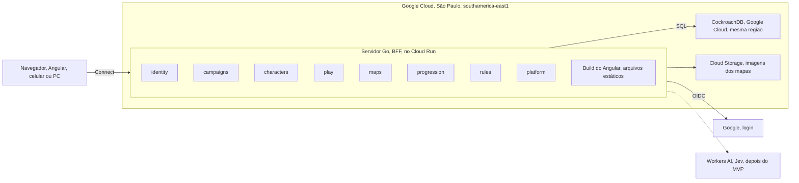
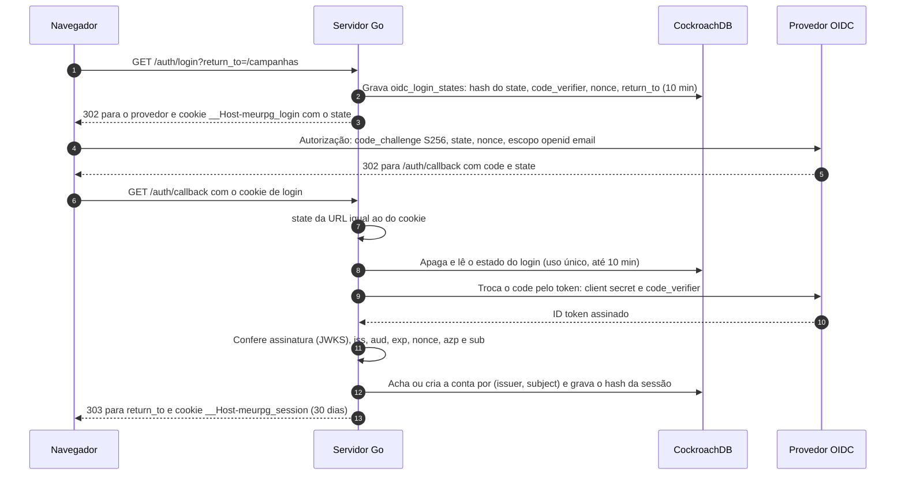
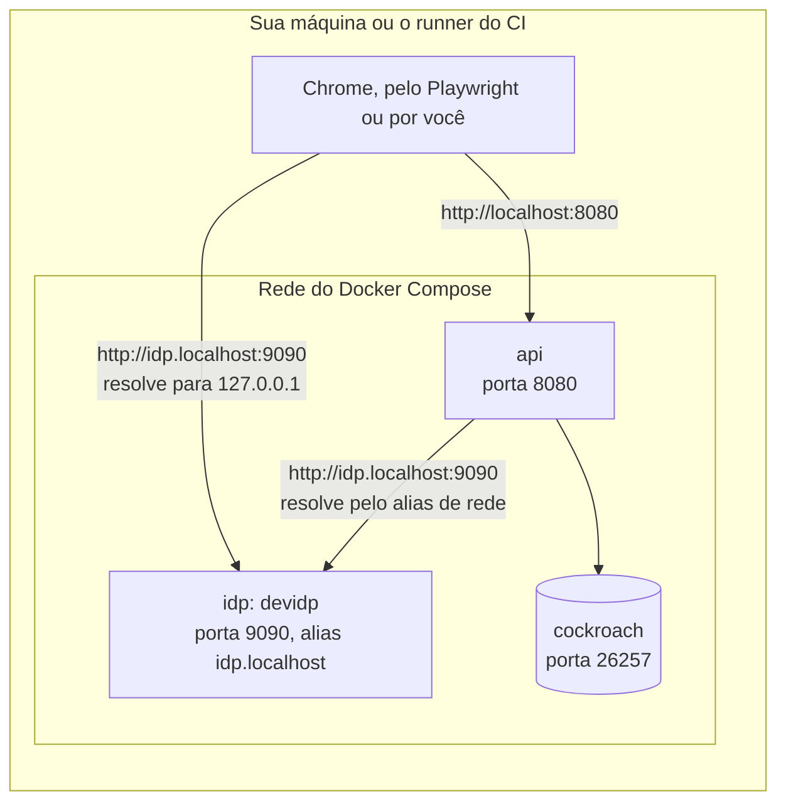

# Arquitetura

O novo backend é um monólito modular em Go no Cloud Run em São Paulo. O CockroachDB fica no Google Cloud, também em São Paulo, como o Samuel confirmou: servidor e banco no mesmo provedor e na mesma região. O Angular só desenha a tela; toda regra roda no servidor.

## Decisões

Decisões difíceis de desfazer viram ADR (Architecture Decision Record) no repositório privado `docs/adr/` (ignorado neste repositório, mantido por Samuel e Vinicius). O código e os documentos aqui citam só o número, como "ver ADR-0002".

| Peça | Escolha | Por quê |
| --- | --- | --- |
| Backend | Go, monólito modular: um deploy só, módulos com fronteiras claras (ADR-0001) | Um time pequeno não precisa de microserviços. As fronteiras deixam separar um módulo depois, se um dia precisar. |
| BFF | O próprio servidor Go (ADR-0001) | A tela pede "a ficha pronta" numa chamada. Nenhuma regra de D&D fica no navegador, então ninguém trapaceia editando o JavaScript. |
| API | Protobuf + Connect (connect-go e connect-es), com buf (ADR-0001) | Um contrato gera o código dos dois lados. Funciona em HTTP/1.1 com JSON, então dá para testar com `curl`. |
| Tempo real | Stream do Connect (server streaming), aberto só durante a sessão (ADR-0005, proposta) | Sem sessão ativa, nada fica conectado. Um WebSocket esquecido aberto o mês todo custaria caro (ver [Operação](operacao.md)). |
| Hospedagem | Cloud Run em `southamerica-east1`, 1 vCPU e 512 MiB, `min-instances` 0, `max-instances` baixo (ADR-0003) | Escala a zero quando ninguém usa. No uso previsto, fica abaixo de US$ 1 por mês (ver [Operação](operacao.md)). |
| Banco | CockroachDB no Google Cloud (São Paulo), com pgx, sqlc e goose (ADR-0003) | sqlc gera Go tipado a partir do SQL. O CockroachDB roda em `SERIALIZABLE`, então toda escrita repete a transação no erro `40001`. |
| Login | Google OIDC com PKCE; sessão com token opaco num cookie `__Host-` httpOnly (ADR-0002) | O JavaScript da página não lê o cookie, e dá para revogar a sessão na hora (logout, tirar alguém da campanha). |
| Frontend | Um novo app Angular em `web/`, sobre o cliente Connect, com as regras no servidor. O servidor Go entrega o build, na mesma origem da API (ADR-0006, proposta) | O cookie de sessão só funciona bem sem cookies de terceiros, e o Safari do iPhone bloqueia esses cookies. No app antigo (descontinuado), o Angular ficava no GitHub Pages e a API no Render, em sites diferentes; componentes úteis de lá (stepper da ficha, mapa, editor) são portados para o `web/` conforme a necessidade. Detalhes em [Frontend (web/)](#frontend-web) abaixo. |
| Jev (depois do MVP) | Cloudflare Workers AI, atrás de uma interface em Go | Trocar de provedor sem mexer no resto do código. |

## Módulos

Cada módulo do backend fica em `backend/internal/<módulo>`. Um módulo só chama outro pela interface pública dele, nunca pelas tabelas.

- `identity`: login do mestre, sessões de login e usuários. O login do mestre é um *relying party* OIDC genérico: Google em produção, um provedor OIDC local nos testes ponta a ponta — o módulo fala o protocolo, não um SDK do Google. _Em discussão: um jeito de logar sem conta Google para o jogador está sendo avaliado, ver [Perguntas em aberto](produto/perguntas-em-aberto.md#login-do-jogador-sem-google)._
- `campaigns`: campanhas, membros, papéis e convites.
- `characters`: personagens, fichas, trava e cópias.
- `play`: sessão de jogo, cenas, encontros, combatentes e o stream ao vivo.
- `maps`: mapas, pontos de interesse e, depois, masmorras.
- `progression`: modo de XP, XP dado e aviso de subir de nível.
- `rules`: as contas do D&D 5e (modificadores, CD, bônus). Não acessa o banco, então é fácil de testar.
- `platform`: o que é de todos: configuração, banco, servidor HTTP e logs.

Cada módulo é construído do zero, direto no Go: não há troca de lado nem coexistência com o NestJS antigo, que fica descontinuado. O critério de pronto é o mesmo de qualquer história: os testes do módulo passam (ver [Visão do produto](produto/visao.md)).

### Diagrama: arquitetura alvo



A linha tracejada é futura: o Jev (Workers AI) só entra depois do MVP. O app antigo (Angular em `src/`, NestJS em `server/`, GitHub Pages e Render) não faz parte deste diagrama porque está descontinuado; ele fica no repositório só como referência até sair num PR à parte.

Os fluxos de quem pode mexer na ficha e de como o jogador entra na sessão ficam em [Regras de negócio → Fluxos e estados](produto/regras.md#fluxos-e-estados), porque são regra de negócio, não peça de infraestrutura.

## Contratos de API (Protobuf)

Toda chamada da API nasce num arquivo `.proto`. O `buf generate` gera o código Go e o TypeScript, e o CI recusa um PR que quebra o contrato. Foi um desencontro de contrato entre o Angular e o NestJS que causou o erro 400 ao salvar fichas.

Regras:

1. Um pacote por módulo e versão: `meurpg.<módulo>.v1`, em `proto/meurpg/<módulo>/v1/`.
2. Um serviço por módulo. Cada chamada tem o seu par `XxxRequest` e `XxxResponse`, mesmo vazio, como o `buf lint` pede.
3. O número de um campo nunca muda nem é reaproveitado. Campo removido vira `reserved`.
4. Mudança que quebra o contrato vira um pacote `v2`. O `buf breaking` compara cada PR com a `main`.
5. O código gerado fica no repositório. O CI roda `buf generate` de novo e falha se aparecer diferença.
6. Campos em `snake_case` no `.proto`; o TypeScript gerado usa `camelCase` sozinho.
7. Chamada só de leitura leva `idempotency_level = NO_SIDE_EFFECTS`, e o Connect passa a aceitar GET, que o navegador pode guardar em cache.

O primeiro contrato, da Etapa 1, só prova que o caminho todo funciona:

```protobuf
syntax = "proto3";

package meurpg.system.v1;

// SystemService exposes build and runtime information.
service SystemService {
  rpc GetServerInfo(GetServerInfoRequest) returns (GetServerInfoResponse) {
    option idempotency_level = NO_SIDE_EFFECTS;
  }
}

message GetServerInfoRequest {}

message GetServerInfoResponse {
  string version = 1;
  string commit = 2;
}
```

Como o Connect aceita JSON, dá para chamar com `curl`:

```bash
curl -s -X POST http://localhost:8080/meurpg.system.v1.SystemService/GetServerInfo \
  -H 'Content-Type: application/json' -H 'Connect-Protocol-Version: 1' -d '{}'
```

### Códigos de erro

Cada regra de negócio recusada devolve um código de erro do Connect, sempre o mesmo para o mesmo caso.

| Código | Quando |
| --- | --- |
| `unauthenticated` | Sem sessão de login válida. |
| `permission_denied` | O usuário não é membro da campanha, ou um jogador tenta uma ação de mestre. |
| `failed_precondition` | A regra não deixa agora: ficha travada (RN-01), sessão que não começou. |
| `not_found` | Não existe, ou o usuário não pode saber que existe (um ponto escondido, por exemplo). |
| `invalid_argument` | Entrada inválida, como um atributo acima de 30. |
| `aborted` | Conflito de transação (`40001`) que continuou depois das novas tentativas. |

## Frontend (web/)

O `web/` é o app Angular novo (o `src/` antigo está depreciado). O Go serve o build dele na mesma origem da API, como a linha "Frontend" da tabela de decisões explica.

- **Como é servido:** `backend/internal/platform/httpserver.NewStatic` serve `index.html` e os assets com hash a partir de `WEB_DIR` (`/app/web` na imagem, configurável). Sem `WEB_DIR` válido, o servidor sobe só com a API e registra uma linha de log — não é erro fatal, é o caso normal fora da imagem Docker (`make run` no host, por exemplo). Rota desconhecida (não é `/meurpg.*`, `/auth/*`, `/healthz` nem `/readyz`) cai no `index.html`, para o roteador do Angular assumir (SPA fallback); as quatro exceções viram 404 puro, nunca a página.
- **Cache:** asset com hash no nome (todo mundo, graças a `outputHashing: "all"`) leva `Cache-Control: public, max-age=31536000, immutable`. O `index.html` leva `no-cache`, sempre.
- **CSP:** `default-src 'self'`, sem exceção nenhuma em `script-src` (o build de produção não usa `<script>` nem atributo de evento inline — checado no HTML gerado e ao vivo, sem violação no console). `style-src` precisa de `'unsafe-inline'`: é o Angular injetando o CSS de cada componente em `<style>` no `<head>`, em tempo de execução, independente de qualquer opção do build — confirmado também ao vivo (sem o `'unsafe-inline'`, o app carrega sem nenhum estilo). Mais detalhes e a opção de trocar isso por nonce por requisição: comentário de `cspHeader` em `static.go`.
- **Codegen:** `proto/buf.gen.yaml` roda `protoc-gen-es` (Connect-ES v2: um plugin só gera mensagens e serviços) como plugin local, do binário em `web/node_modules/.bin`, com `target=ts`, escrevendo em `web/src/gen/` — código gerado e comitado, como o lado Go. `make proto` instala as dependências do `web/` sozinho, se faltarem.
- **Dev:** `cd web && npm start` sobe o Angular com `proxy.conf.json` encaminhando `/meurpg.*`, `/auth` e as sondas para `localhost:8080`.
- **Ícones:** quando a tela precisa de um ícone, é a fonte Material Symbols auto-hospedada (pacote `@material-symbols/font-400`, copiado para o build por uma entrada `assets` do `angular.json` e servido pelo próprio Go) — nunca o Google Fonts, que o `font-src 'self'` do CSP bloqueia e que `docs/privacidade.md` proíbe.

### Estado de sessão e o fluxo de entrar/sair

Um `AuthService` (`web/src/app/core/auth/auth.service.ts`) chama `IdentityService.GetMe` uma vez, na inicialização — na prática assim que o menu de conta da barra de navegação, sempre presente, injeta o serviço — e guarda o resultado num signal com quatro estados:

| Estado | Quando |
| --- | --- |
| `unknown` | O `GetMe` ainda não voltou. |
| `signed-out` | O `GetMe` respondeu com o código `unauthenticated`. |
| `signed-in` | O `GetMe` respondeu com o usuário e `sessionExpiresAt`. |
| `unavailable` | Qualquer outro código do Connect, ou uma falha de rede. Nunca vira `signed-out`: um servidor ou banco fora do ar não pode parecer um usuário deslogado. |

O transporte Connect único do app (`web/src/app/core/connect/transport.ts`) força `credentials: 'same-origin'` no `fetch`, para o cookie de sessão ir em toda chamada, e já recebe `Connect-Protocol-Version: 1` em toda chamada unária por padrão do `@connectrpc/connect` (ver [CSRF](#csrf)) — nada a configurar para isso.

Entrar é sempre uma navegação de página inteira para `/auth/login?return_to=<caminho atual>`, nunca uma rota Angular: é o servidor quem conduz o fluxo OIDC (ver [Módulo identity](#módulo-identity-login-e-sessão) abaixo). `authGuard` (`web/src/app/core/auth/auth.guard.ts`) protege rotas que precisam de sessão, como "Minhas campanhas": deixa passar se `signed-in`; manda para o login, com `return_to`, se `signed-out`; e redireciona para a página "servidor indisponível" (mantendo o caminho pedido em `return_to`, para "Tentar de novo" voltar direto para lá) se `unavailable`, em vez de tratar como se a pessoa tivesse saído. Depois do callback do servidor, o navegador já volta em `return_to`, então não há nada para o cliente interpretar.

Sair chama `IdentityService.SignOut` e sempre volta para a página inicial com uma navegação de página inteira — mesmo se a chamada falhar, porque um "Sair" que falha silenciosamente é pior do que um cookie que uma tentativa futura de `GetMe` corrige.

## Módulo identity: login e sessão

O mestre entra por um provedor OpenID Connect (OIDC) com Authorization Code + PKCE, e o servidor abre uma sessão opaca de no máximo 30 dias, guardada num cookie `__Host-` `HttpOnly` (ADR-0002). O código fica em `backend/internal/identity` e não conhece nenhum provedor: em produção é o Google, em desenvolvimento um provedor OIDC local ou um provedor falso dos testes. Tudo vem da configuração (ver [CONTRIBUTING.md](../CONTRIBUTING.md#login-local-com-um-provedor-oidc)) e da descoberta OIDC (`/.well-known/openid-configuration`).

| Rota | O que faz |
| --- | --- |
| `GET /auth/login?return_to=/caminho` | Guarda o estado do login e manda o navegador para o provedor. `return_to` só aceita um caminho deste site. |
| `GET /auth/callback` | Confere tudo, cria a sessão, grava o cookie e volta para `return_to`. |
| `IdentityService.GetMe` | Quem está logado (só o ID da conta) e quando a sessão acaba. Aceita GET, porque a requisição é vazia. |
| `IdentityService.SignOut` | Revoga a sessão atual no banco e apaga o cookie. As outras sessões do usuário continuam. |

### Diagrama: o login



O callback recusa com 400, sem criar sessão, quando: falta o cookie de login ou o `state` não bate com ele; o estado não existe, já foi usado ou passou de 10 minutos; o provedor devolveu erro; a troca do `code` falhou (inclusive por PKCE); ou o ID token falha em qualquer conferência. O `aud` precisa ser só o nosso client ID, e o `azp`, quando vem, também.

### Sessão

- **Token:** 32 bytes aleatórios (`crypto/rand`) no cookie `__Host-meurpg_session`, com `Secure`, `HttpOnly`, `SameSite=Lax` e `Path=/`. O banco guarda só o SHA-256 (`auth_sessions.token_hash`).
- **Validade:** 30 dias corridos desde o login, sem renovar com o uso (NIST SP 800-63B-4, AAL1). Depois disso, o mestre passa pelo provedor de novo.
- **`auth_time` e `max_age`:** o servidor manda `max_age` só se `OIDC_MAX_AGE` estiver definido (o Google não documenta o parâmetro). O `auth_time` do ID token, quando vem, é só registrado em `auth_sessions.auth_time`, nunca usado para decidir: num provedor local de teste ele manteve a hora do primeiro login mesmo depois de um login forçado. No ambiente local, o devidp recebe `OIDC_MAX_AGE=1h`; com o Google, a variável fica sem valor. Quem cumpre a reautenticação a cada 30 dias (NIST SP 800-63B-4) é a sessão de 30 dias no servidor, não o `max_age`.
- **Logout:** apaga a linha da sessão, então o token para de valer na hora, em qualquer instância.
- **Login de novo no mesmo navegador:** gera outro token (nada de reaproveitar o antigo) e revoga a sessão anterior.

Outros módulos descobrem quem chama assim: montam o serviço Connect com `identity.Service.Interceptor()` e chamam `identity.RequireSession(ctx)` no handler. Sem sessão válida, a resposta é `unauthenticated`. Se o banco não responde, é `unavailable`, para o app não achar que o usuário saiu.

### CSRF

A proteção vem em camadas, como a ADR-0009 descreve:

| Camada | O que barra |
| --- | --- |
| Cookie `SameSite=Lax` | O navegador não manda o cookie em POST nem em `fetch` vindos de outro site. |
| `http.CrossOriginProtection` em volta do mux | Recusa com 403 um POST (ou PUT, DELETE) de outra origem, pelo `Sec-Fetch-Site` ou comparando `Origin` com `Host`. GET sempre passa, então nenhum GET pode mudar estado sem proteção própria. |
| `connect.WithRequireConnectProtocolHeader()` em todo serviço | Toda chamada unária do Connect exige o header `Connect-Protocol-Version: 1` (ou `connect=v1` na URL de um GET). Outro site só mandaria esse header depois de um preflight de CORS, que o servidor não aceita. |
| `state` no cookie de login, PKCE e `nonce` | Protegem o `GET /auth/callback`, que cria a sessão mesmo sendo GET. Ninguém consegue fazer o navegador da vítima terminar um login começado por outra pessoa. |

Por causa do header obrigatório, um `curl` numa chamada Connect precisa de `-H 'Connect-Protocol-Version: 1'`.

### Limite de tentativas no login

`GET /auth/login` grava uma linha em `oidc_login_states` a cada chamada, então tem um limite, em memória, antes de qualquer outra coisa. Passou do limite, a resposta é `429 Too Many Requests` com `Retry-After` (em segundos), sem gravar nada.

| Limite | Valor | Por quê |
| --- | --- | --- |
| Por IP do cliente | 20 de uma vez, depois 1 a cada 3 s (20 por minuto) | Folga para uma mesa inteira no mesmo Wi-Fi; um cliente sozinho não enche a tabela. |
| Geral | 200 de uma vez, depois 2 por segundo (120 por minuto) | Limita o que uma botnet grava: no máximo 7.200 linhas por hora por instância, que o TTL apaga na hora seguinte. |

- O limite de cada cliente é conferido antes do geral, então um cliente acima do próprio limite não gasta a cota de todo mundo. IPv6 conta por `/64`.
- Os contadores ficam na memória de cada instância: com N instâncias no Cloud Run, o limite efetivo é até N vezes maior. Uma tabela de no máximo 10 mil clientes evita que endereços novos esgotem a memória; um cliente parado some da tabela em até 2 minutos, mesmo que nenhuma requisição nova chegue.
- **De onde vem o IP.** Localmente, da conexão (`RemoteAddr`); `X-Forwarded-For` é ignorado, porque qualquer cliente manda o que quiser nele. No Cloud Run (a variável `K_SERVICE` existe), toda requisição passa pelo front end do Google, e o IP do cliente vem do **último** item do `X-Forwarded-For`: o Google acrescenta o endereço de quem se conectou a ele depois do que o cliente mandou, e não confere o que vem antes. A fonte (documentação do Google Cloud) e o que muda se um dia houver um load balancer na frente estão no comentário de `ratelimit.ClientKey`, em `backend/internal/platform/ratelimit`.
- O IP não vai para o log (ver [Privacidade](privacidade.md)).

### Sem provedor ou sem banco

O servidor sobe mesmo sem `OIDC_ISSUER` ou sem `DATABASE_URL`: o log de início avisa que o login está desligado, `/auth/login` e `/auth/callback` respondem 503 e o `IdentityService` responde `unavailable`. Se o provedor estiver fora do ar quando o servidor sobe, a descoberta é tentada de novo no próximo login.

## Testes e o provedor de desenvolvimento

Os testes rodam em três camadas, e nenhuma depende de um provedor de identidade de fora:

| Camada | Onde | Provedor OIDC | No CI |
| --- | --- | --- | --- |
| Unitário e fluxo em Go | `go test` em `backend/` | O provedor de `internal/identity/oidctest`, dentro do próprio teste (HTTPS com `httptest`), que loga o usuário na hora e deixa o teste quebrar uma coisa de cada vez: claims, chave de assinatura, descoberta | Job `go` |
| Integração em Go | `go test` com `MEURPG_TEST_DATABASE_URL` | O mesmo, com o CockroachDB de verdade atrás | Job `go-db` (CockroachDB com `docker run`) |
| Ponta a ponta | Playwright em `e2e/`, contra o `docker compose` | **devidp** (`backend/cmd/devidp`): o mesmo `oidctest`, servido com uma página que lista os usuários de teste | Workflow `e2e` |

O devidp implementa só o que o login precisa, com rigor: descoberta, JWKS com uma chave RSA gerada ao subir, `/authorize` com PKCE S256 obrigatório, `state` e `nonce`, `/token` para um client confidencial, ID token RS256 com `email`, `email_verified` e `auth_time`, e `max_age` e `prompt` medidos contra a própria sessão dele. Ele nunca vai para produção: a imagem dele é outra, ele só aceita issuer em host de loopback e não sobe no Cloud Run (detalhes e usuários de teste no [CONTRIBUTING.md](../CONTRIBUTING.md#login-local-com-o-devidp)).

### Diagrama: o login no ambiente local

O issuer é `http://idp.localhost:9090` para os dois lados. O navegador resolve qualquer `*.localhost` para `127.0.0.1` sozinho (RFC 6761) e chega ao devidp pela porta publicada. O container da API chega ao mesmo nome pelo alias de rede `idp.localhost`, que o Docker resolve para o container do devidp. Com a mesma string dos dois lados, o `iss` do ID token bate com o `OIDC_ISSUER`. A configuração aceita `http` num nome `*.localhost` pelo mesmo motivo.



O cookie `__Host-meurpg_session` exige `Secure`, e mesmo assim funciona em `http://localhost`: o Chrome trata `localhost` como contexto seguro. Um teste Playwright confere isso no navegador. O Safari não aceita, então o login local é no Chrome ou no Firefox.

## Ver também

- [Modelo de dados](dados.md)
- [Regras de negócio](produto/regras.md)
- [Roadmap](roadmap.md)
- [Operação](operacao.md)
- `docs/adr/` (repositório privado, não versionado aqui): as decisões completas por trás desta página.
