# Arquitetura

O novo backend é um monólito modular em Go no Cloud Run em São Paulo. O CockroachDB fica no Google Cloud, também em São Paulo, como o Samuel confirmou: servidor e banco no mesmo provedor e na mesma região. O Angular só desenha a tela; toda regra roda no servidor.

## Decisões

Decisões difíceis de desfazer viram ADR (Architecture Decision Record) no repositório privado `docs/adr/` (ignorado neste repositório, mantido por Samuel e Vinicius). O código e os documentos aqui citam só o número, como "ver ADR-0002".

| Peça | Escolha | Por quê |
| --- | --- | --- |
| Backend | Go, monólito modular: um deploy só, módulos com fronteiras claras (ADR-0001) | Um time pequeno não precisa de microserviços. As fronteiras deixam separar um módulo depois, se um dia precisar. |
| BFF | O próprio servidor Go (ADR-0001) | A tela pede "a ficha pronta" numa chamada. Nenhuma regra de D&D fica no navegador, então ninguém trapaceia editando o JavaScript. |
| API | Protobuf + Connect (connect-go e connect-es), com buf (ADR-0001) | Um contrato gera o código dos dois lados. Funciona em HTTP/1.1 com JSON, então dá para testar com `curl`. |
| Tempo real | Stream do Connect (server streaming), aberto só durante a sessão e só com a aba visível; o aviso de sessão é uma consulta leve a cada 30 segundos, não um stream (ADR-0005, proposta; implementado na Etapa 5, ver [Sessão ao vivo](#sessão-ao-vivo)) | Sem sessão ativa, nada fica conectado. Um WebSocket esquecido aberto o mês todo custaria caro (ver [Operação](operacao.md)). |
| Hospedagem | Cloud Run em `southamerica-east1`, 1 vCPU e 512 MiB, `min-instances` 0, `max-instances` 1 enquanto o fan-out do stream for em memória (ADR-0003, ADR-0005) | Escala a zero quando ninguém usa. No uso previsto, fica abaixo de US$ 1 por mês (ver [Operação](operacao.md)). |
| Banco | CockroachDB no Google Cloud (São Paulo), com pgx, sqlc e goose (ADR-0003) | sqlc gera Go tipado a partir do SQL. O CockroachDB roda em `SERIALIZABLE`, então toda escrita repete a transação no erro `40001`. |
| Login | Google OIDC com PKCE; sessão com token opaco num cookie `__Host-` httpOnly (ADR-0002) | O JavaScript da página não lê o cookie, e dá para revogar a sessão na hora (logout, tirar alguém da campanha). |
| Frontend | Um novo app Angular em `web/`, sobre o cliente Connect, com as regras no servidor. O servidor Go entrega o build, na mesma origem da API (ADR-0006, proposta) | O cookie de sessão só funciona bem sem cookies de terceiros, e o Safari do iPhone bloqueia esses cookies. No app antigo (descontinuado), o Angular ficava no GitHub Pages e a API no Render, em sites diferentes; componentes úteis de lá (stepper da ficha, mapa, editor) são portados para o `web/` conforme a necessidade. Detalhes em [Frontend (web/)](#frontend-web) abaixo. |
| Jev (depois do MVP) | Cloudflare Workers AI, atrás de uma interface em Go | Trocar de provedor sem mexer no resto do código. |

## Módulos

Cada módulo do backend fica em `backend/internal/<módulo>`. Um módulo só chama outro pela interface pública dele, nunca pelas tabelas.

- `identity`: login do mestre, sessões de login e usuários. O login do mestre é um *relying party* OIDC genérico: Google em produção, um provedor OIDC local nos testes ponta a ponta — o módulo fala o protocolo, não um SDK do Google. O login do jogador sem Google (RN-17, decidido pelo Samuel em 29/09/2026: handle por mesa, sem e-mail) ainda não está implementado — ver [ADR-0009](adr/0009-login-do-jogador-sem-google.md). Criar campanha continua exigindo uma conta com Google no MVP (RN-14).
- `campaigns`: campanhas, membros (inclusive o membro pendente de um convite com aprovação, RN-15), papéis e convites.
- `characters`: personagens, fichas, história, trava, notas do mestre e, depois, cópias. Também serve o catálogo de regras do editor (`ContentService`) enquanto não existe conteúdo da mesa (ver [Módulo characters](#módulo-characters-personagens-e-fichas)).
- `play`: sessão de jogo, cenas, encontros, combatentes e o stream ao vivo. Hoje: iniciar, encerrar e listar sessões, o que trava as fichas (Etapa 4), e a sessão ao vivo: o aviso, o stream e a correção do mestre nos PV, espaços de magia e dados de vida, com o histórico em `session_events` (Etapa 5; ver [Módulo play](#módulo-play-sessões-de-jogo)).
- `maps`: mapas, pontos de interesse, a galeria de imagens e, depois, masmorras. Na Etapa 5, primeiro a galeria: enviar, guardar e servir as imagens (ver [Módulo maps](#módulo-maps-galeria-e-imagens)).
- `progression`: modo de XP, XP dado e aviso de subir de nível.
- `rules`: as contas do D&D 5e (modificadores, CD, bônus). Não acessa o banco, então é fácil de testar.
- `platform`: o que é de todos: configuração, banco, servidor HTTP e logs.

Cada módulo é construído do zero, direto no Go: não há troca de lado nem coexistência com o NestJS antigo, que fica descontinuado e será removido do repositório (decidido pelo Samuel em 29/09/2026, ver [App antigo](app-antigo.md)) — o backend novo passa a cobrir sozinho todas as histórias do MVP. O critério de pronto é o mesmo de qualquer história: os testes do módulo passam (ver [Visão do produto](produto/visao.md)).

### Diagrama: arquitetura alvo

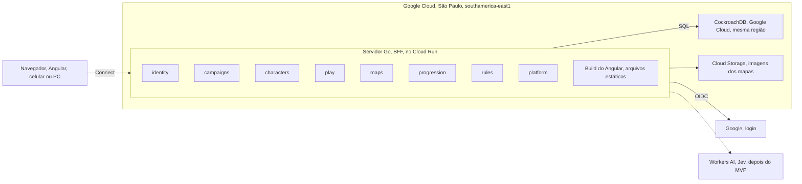

A linha tracejada é futura: o Jev (Workers AI) só entra depois do MVP. O app antigo (Angular em `src/`, NestJS em `server/`, GitHub Pages e Render) não faz parte deste diagrama porque está descontinuado. O `src/` fica no repositório só como referência até sair num PR à parte; o `server/` (NestJS) será removido do repositório (decidido pelo Samuel em 29/09/2026, ver [App antigo](app-antigo.md)).

Os fluxos de quem pode mexer na ficha e de como o jogador entra na sessão ficam em [Regras de negócio → Fluxos e estados](produto/regras.md#fluxos-e-estados), porque são regra de negócio, não peça de infraestrutura.

## Contratos de API (Protobuf)

Toda chamada da API nasce num arquivo `.proto`. O `buf generate` gera o código Go e o TypeScript, e o CI recusa um PR que quebra o contrato. Foi um desencontro de contrato entre o Angular e o NestJS que causou o erro 400 ao salvar fichas.

Regras:

1. Um pacote por módulo e versão: `meurpg.<módulo>.v1`, em `proto/meurpg/<módulo>/v1/`.
2. Um serviço por módulo. Cada chamada tem o seu par `XxxRequest` e `XxxResponse`, mesmo vazio, como o `buf lint` pede.
3. O número de um campo nunca muda nem é reaproveitado. Campo removido vira `reserved`.
4. Mudança que quebra o contrato vira um pacote `v2`. O `buf breaking` compara cada PR com a `main`.
5. O código gerado fica no repositório. O CI roda `buf generate` de novo e falha se aparecer diferença.
6. Campos em `snake_case` no `.proto`; o TypeScript gerado usa `camelCase` sozinho.
7. Chamada só de leitura leva um nível de idempotência, e qual depende da requisição (decidido por Vinicius em 29/09/2026):
   - **Requisição sem ID e sem dado pessoal** (vazia, como `GetMe`, `ListMyCampaigns`, `ListOpenGameSessions` e `GetServerInfo`): `idempotency_level = NO_SIDE_EFFECTS`. O Connect passa a aceitar GET, que o navegador pode guardar em cache.
   - **Requisição com ID ou dado pessoal** (como `GetCampaign`, `ListMembers`, `ListInvites`, `GetCharacter`, `ListCharacters`, `GetMasterNotes`, `ListContent`, `ListGameSessions` e `GetLiveSession`): `idempotency_level = IDEMPOTENT`. Fica documentada como leitura e segura para repetir, mas só aceita POST: num GET, a mensagem inteira vai na URL, e a URL fica nos logs da plataforma (ver [Privacidade](privacidade.md)).
   - O teste `TestConnectGETOnlyForRequestsWithoutData` (`backend/cmd/api`) falha se um método `NO_SIDE_EFFECTS` tiver requisição com campo.
8. Os nomes seguem o Google AIP (decidido por Vinicius em 29/09/2026):
   - **Métodos padrão** começam com `Get`, `List`, `Create`, `Update` ou `Delete` mais o recurso (AIP-131 a AIP-135): `GetCampaign`, `ListMembers`, `CreateInvite`.
   - **Métodos customizados** começam com o verbo da ação (AIP-136): `AcceptInvite`, `RevokeInvite`.
   - **Busca com filtro**, quando existir, vira `Search<Recurso>`, como `SearchCampaigns`: é o equivalente em RPC do `:search` do AIP-136. Leva `IDEMPOTENT`, porque a requisição carrega o filtro.
   - Nome que já existe não muda: renomear uma RPC quebra o contrato (regra 4).

O primeiro contrato, da Etapa 1, só prova que o caminho todo funciona:

```protobuf
syntax = "proto3";

package meurpg.system.v1;

// SystemService exposes build and runtime information.
service SystemService {
  rpc GetServerInfo(GetServerInfoRequest) returns (GetServerInfoResponse) {
    option idempotency_level = NO_SIDE_EFFECTS;
  }
}

message GetServerInfoRequest {}

message GetServerInfoResponse {
  string version = 1;
  string commit = 2;
}
```

Como o Connect aceita JSON, dá para chamar com `curl`:

```bash
curl -s -X POST http://localhost:8080/meurpg.system.v1.SystemService/GetServerInfo \
  -H 'Content-Type: application/json' -H 'Connect-Protocol-Version: 1' -d '{}'
```

### Códigos de erro

Cada regra de negócio recusada devolve um código de erro do Connect, sempre o mesmo para o mesmo caso.

| Código | Quando |
| --- | --- |
| `unauthenticated` | Sem sessão de login válida. |
| `permission_denied` | O usuário é membro da campanha, mas não tem o papel: um jogador tenta uma ação de mestre. |
| `failed_precondition` | A regra não deixa agora: ficha travada (RN-01), sessão que não começou, convite expirado. Vem com um detalhe que diz o motivo, quando há mais de um (`InviteUnusable`, `CharacterBlocked`, `GameSessionBlocked`). |
| `not_found` | Não existe, ou o usuário não pode saber que existe: um ponto escondido, ou uma campanha da qual ele não é membro (ADR-0011). O membro pendente (RN-15) recebe o mesmo `not_found` fora das poucas chamadas que ele pode fazer. |
| `invalid_argument` | Entrada inválida, como um atributo acima de 30. |
| `resource_exhausted` | Um limite da campanha acabou: a galeria cheia (300 imagens ou 500 MB, MR-019). |
| `aborted` | Conflito de transação (`40001`) que continuou depois das novas tentativas, ou uma ficha que mudou desde que o app a leu (revisão velha, AIP-154). O app recarrega e a pessoa tenta de novo. |

## Frontend (web/)

O `web/` é o app Angular novo (o `src/` antigo está depreciado). O Go serve o build dele na mesma origem da API, como a linha "Frontend" da tabela de decisões explica.

- **Como é servido:** `backend/internal/platform/httpserver.NewStatic` serve `index.html` e os assets com hash a partir de `WEB_DIR` (`/app/web` na imagem, configurável). Sem `WEB_DIR` válido, o servidor sobe só com a API e registra uma linha de log — não é erro fatal, é o caso normal fora da imagem Docker (`make run` no host, por exemplo). Rota desconhecida (não é `/meurpg.*`, `/auth/*`, `/healthz` nem `/readyz`) cai no `index.html`, para o roteador do Angular assumir (SPA fallback); as quatro exceções viram 404 puro, nunca a página.
- **Cache:** asset com hash no nome (todo mundo, graças a `outputHashing: "all"`) leva `Cache-Control: public, max-age=31536000, immutable`. O `index.html` leva `no-cache`, sempre.
- **CSP:** `default-src 'self'`; `form-action` é `'self'` mais a origem do provedor de login (ver o fluxo do convite abaixo); sem exceção nenhuma em `script-src` (o build de produção não usa `<script>` nem atributo de evento inline — checado no HTML gerado e ao vivo, sem violação no console). `style-src` precisa de `'unsafe-inline'`: é o Angular injetando o CSS de cada componente em `<style>` no `<head>`, em tempo de execução, independente de qualquer opção do build — confirmado também ao vivo (sem o `'unsafe-inline'`, o app carrega sem nenhum estilo). Mais detalhes e a opção de trocar isso por nonce por requisição: comentário de `cspHeader` em `static.go`.
- **Codegen:** `proto/buf.gen.yaml` roda `protoc-gen-es` (Connect-ES v2: um plugin só gera mensagens e serviços) como plugin local, do binário em `web/node_modules/.bin`, com `target=ts`, escrevendo em `web/src/gen/` — código gerado e comitado, como o lado Go. `make proto` instala as dependências do `web/` sozinho, se faltarem.
- **Dev:** `cd web && npm start` sobe o Angular com `proxy.conf.json` encaminhando `/meurpg.*`, `/auth` e as sondas para `localhost:8080`.
- **Visual:** os tokens de cor, tipo, espaço e raio são propriedades CSS `--mr-*` em `web/src/styles.scss`, com os tokens de sistema do Angular Material apontados para eles, e as peças comuns (painel, lista, etiqueta, aviso) ficam em `web/src/styles/_ui.scss`. O que cada um significa e como uma tela é desenhada e revisada: [Design](design.md).
- **Fontes:** Alegreya e Alegreya Sans (licença OFL), dos pacotes `@fontsource/alegreya` e `@fontsource/alegreya-sans`, só o subconjunto latino em woff2, declaradas em `web/src/styles.scss` e servidas pelo próprio Go, como os ícones abaixo. A licença de cada uma está no `NOTICE` e em `third_party/licenses/`.
- **Ícones:** quando a tela precisa de um ícone, é a fonte Material Symbols auto-hospedada (pacote `@material-symbols/font-400`, copiado para o build por uma entrada `assets` do `angular.json` e servido pelo próprio Go) — nunca o Google Fonts, que o `font-src 'self'` do CSP bloqueia e que `docs/privacidade.md` proíbe.

### Estado de sessão e o fluxo de entrar/sair

Um `AuthService` (`web/src/app/core/auth/auth.service.ts`) chama `IdentityService.GetMe` uma vez, na inicialização — na prática assim que o menu de conta da barra de navegação, sempre presente, injeta o serviço — e guarda o resultado num signal com quatro estados:

| Estado | Quando |
| --- | --- |
| `unknown` | O `GetMe` ainda não voltou. |
| `signed-out` | O `GetMe` respondeu com o código `unauthenticated`. |
| `signed-in` | O `GetMe` respondeu com o usuário e `sessionExpiresAt`. |
| `unavailable` | Qualquer outro código do Connect, ou uma falha de rede. Nunca vira `signed-out`: um servidor ou banco fora do ar não pode parecer um usuário deslogado. |

O transporte Connect único do app (`web/src/app/core/connect/transport.ts`) força `credentials: 'same-origin'` no `fetch`, para o cookie de sessão ir em toda chamada, e já recebe `Connect-Protocol-Version: 1` em toda chamada unária por padrão do `@connectrpc/connect` (ver [CSRF](#csrf)) — nada a configurar para isso.

Entrar é sempre uma navegação de página inteira para `/auth/login?return_to=<caminho atual>`, nunca uma rota Angular: é o servidor quem conduz o fluxo OIDC (ver [Módulo identity](#módulo-identity-login-e-sessão) abaixo). `authGuard` (`web/src/app/core/auth/auth.guard.ts`) protege rotas que precisam de sessão, como "Minhas campanhas": deixa passar se `signed-in`; manda para o login, com `return_to`, se `signed-out`; e redireciona para a página "servidor indisponível" (mantendo o caminho pedido em `return_to`, para "Tentar de novo" voltar direto para lá) se `unavailable`, em vez de tratar como se a pessoa tivesse saído. Depois do callback do servidor, o navegador já volta em `return_to`, então não há nada para o cliente interpretar.

Sair chama `IdentityService.SignOut` e sempre volta para a página inicial com uma navegação de página inteira — mesmo se a chamada falhar, porque um "Sair" que falha silenciosamente é pior do que um cookie que uma tentativa futura de `GetMe` corrige.

### Nenhum dado no navegador além do cookie de sessão

Regra do Vinicius, sem exceção: nada no `web/` lê nem grava `localStorage`, `sessionStorage`, IndexedDB, nem grava cookie pelo JavaScript, nem usa Worker para guardar token ou dado pessoal. O único lugar onde a sessão mora é o cookie `__Host-meurpg_session`, `HttpOnly` — o próprio JavaScript do app nunca o lê nem o escreve; quem faz login e logout é sempre uma navegação de página inteira para o servidor (`AuthService.signIn`/`signOut`, acima), nunca `fetch` guardando algo no navegador. O token do convite (abaixo) também nunca toca em armazenamento algum: vive só num campo do componente, na memória.

`web/src/no-web-storage.spec.ts` é a trava automática: varre todo `.ts`/`.html` de `web/src` (fora `gen/` e specs) atrás de `localStorage`, `sessionStorage`, `indexedDB`, `document.cookie =` e `new Worker`/`new SharedWorker`, e falha o teste se algum aparecer. Ver [Privacidade](privacidade.md).

**Por que nada fica no navegador.** O padrão BFF (tabela de decisões, acima) é o que a diretriz do IETF para OAuth em aplicações no navegador ("OAuth 2.0 for Browser-Based Applications") classifica como a opção mais forte: os tokens do OIDC ficam só no servidor, e o navegador só tem o cookie de sessão `__Host-`, `HttpOnly`, que o JavaScript não lê. Guardar token num Web Worker é a mitigação recomendada só para quem precisa mesmo guardar token no navegador — e mesmo assim um XSS ainda consegue usar o worker como proxy; não é o nosso caso, porque nenhum token OIDC chega ao navegador. O token do convite também não fica ali: vai no corpo do `POST /auth/login`, e o servidor guarda só o hash dele, no estado de login de uso único e 10 minutos; um worker não sobreviveria à navegação até o provedor de qualquer forma. Se um dia o navegador precisar chamar uma API de terceiro direto, o padrão do worker é o plano para esse token.

### Telas de campanhas, convite e perfil

MR-001, MR-002 e MR-003 (ver [Histórias](produto/historias.md)) ficam em `web/src/app/pages/`, todas carregadas por rota lazy (`loadComponent`), sobre o `CampaignService` gerado (`web/src/app/core/campaigns/campaigns.service.ts`):

| Rota | Tela | Guarda |
| --- | --- | --- |
| `/campanhas` | `ListMyCampaigns`, com o papel (mestre/jogador) de cada uma, ou "esperando a aprovação do mestre" para o membro pendente (RN-15); formulário "Nova campanha" (nome, modo de XP) que leva à campanha criada | `authGuard` |
| `/campanhas/:id` | `GetCampaign` + `ListMembers`; para o mestre, a seção "Convites" (criar, com a opção "Exigir aprovação do mestre", listar com status, revogar). Para o membro pendente, só `GetCampaign` (que traz só o nome): o aviso "Esperando a aprovação do mestre" e o próprio personagem, sem pedir os membros | `authGuard` |
| `/convite` | Aceita um convite pelo token no fragmento da URL (abaixo) | Pública — trata os dois casos, logado e deslogado |
| `/convite/erro` | Mensagem por código (`motivo`), depois do fluxo de login pelo convite | Pública |
| `/perfil` | "Meu perfil": muda o nome de exibição (`IdentityService.UpdateProfile`) | `authGuard` |

Erros do Connect viram mensagem em português por um mapa `Código → texto` (`web/src/app/core/connect/connect-errors.ts`), com um caso especial para `AcceptInvite`: seu `failed_precondition` carrega o detalhe `InviteUnusable`, e `web/src/app/core/campaigns/invite-errors.ts` lê `state` dele para dizer exatamente por quê (expirado, revogado, já usado). Uma campanha da qual o usuário não é membro, e uma que não existe, chegam como o mesmo `not_found` (ADR-0011) e viram a mesma tela "campanha não encontrada" — o app nunca tenta adivinhar a diferença.

**O fluxo do convite, do lado do navegador** (`web/src/app/pages/invite/invite-accept.ts`):

1. Ao abrir `/convite#t=<token>`, o componente lê o token de `location.hash` no construtor e chama `history.replaceState` **imediatamente**, antes de qualquer outra coisa — a URL visível nunca mostra o token depois desse primeiro instante. O token fica só num campo privado do componente, na memória (ver "Nenhum dado no navegador", acima); nunca vira parâmetro de rota, query string, nem toca em armazenamento algum.
2. Sem token, mostra "link de convite inválido".
3. Com token e sessão ativa, chama `AcceptInvite` direto: sucesso (inclusive `already_member`) navega para `/campanhas/<id>`; convite inutilizável mostra a mensagem específica de `invite-errors.ts`. Num convite com aprovação (RN-15, MR-024), quem acabou de virar membro pendente (`awaiting_approval` e não `already_member`) vai direto para `/campanhas/<id>/personagens/novo`, criar o personagem que o mestre vai aprovar.
4. Com token e sem sessão, mostra "Entrar para aceitar o convite". O clique monta e envia um `<form method="post" action="/auth/login">` oculto, com `return_to=/campanhas`, `intent=campaign_invite` e `intent_payload=<token>` — esse é o contrato com o servidor (módulo `identity`): ele aceita o convite depois do login e redireciona para `/campanhas/<id>` (ou `/campanhas/<id>/personagens/novo`, para quem acabou de virar membro pendente), ou para `/convite/erro?motivo=<código>`, com `<código>` entre `expired`, `revoked`, `used_up`, `not_found`, `invalid` e `unavailable` (o banco falhou ao aceitar). O botão "Entrar" do menu nunca leva o fragmento para o `return_to`: o `AuthService.signIn` corta tudo a partir do `#`, e o servidor também descarta fragmentos. É um POST de mesma origem para `/auth/login`, e o servidor responde com um 303 para o provedor. O navegador confere o `form-action` do CSP em cada passo desse redirecionamento, então o CSP lista, além de `'self'`, a origem do provedor configurado em `OIDC_ISSUER` (`WithFormActionOrigin` em `backend/internal/platform/httpserver/static.go`); sem isso, o botão não sai da página.

### Testes

Unitários (Vitest, `web/src/**/*.spec.ts`) cobrem o mapeamento de erros, o corte do fragmento (`replaceState` chamado, nada de armazenamento tocado), os campos do formulário do fluxo deslogado e, para o convite com aprovação (MR-024), a caixa "Exigir aprovação do mestre", o destino de quem acabou de virar membro pendente, o aviso "Esperando a aprovação do mestre", a lista "Esperando aprovação" do mestre e os botões "Aprovar personagem" e "Recusar personagem". Ponta a ponta (Playwright, tags `@MR-001`/`@MR-002`/`@MR-003`/`@MR-024`) ficam em `e2e/tests/campaigns.spec.ts`, `e2e/tests/invite.spec.ts` (inclusive o caminho de login pelo convite, item 4 acima) e `e2e/tests/character-approval.spec.ts`.

## Módulo identity: login e sessão

O mestre entra por um provedor OpenID Connect (OIDC) com Authorization Code + PKCE, e o servidor abre uma sessão opaca de no máximo 30 dias, guardada num cookie `__Host-` `HttpOnly` (ADR-0002). O código fica em `backend/internal/identity` e não conhece nenhum provedor: em produção é o Google, em desenvolvimento um provedor OIDC local ou um provedor falso dos testes. Tudo vem da configuração (ver [CONTRIBUTING.md](../CONTRIBUTING.md#login-local-com-um-provedor-oidc)) e da descoberta OIDC (`/.well-known/openid-configuration`).

| Rota | O que faz |
| --- | --- |
| `GET /auth/login?return_to=/caminho` | Guarda o estado do login e manda o navegador para o provedor. `return_to` só aceita um caminho deste site; um fragmento (`#...`) é descartado. |
| `POST /auth/login` | O mesmo, a partir de um formulário do app, com uma **intenção de login** opcional (`intent` e `intent_payload`): algo que o servidor conclui logo depois do login, como aceitar um convite. Ver [Aceitar o convite pelo login](#aceitar-o-convite-pelo-login). |
| `GET /auth/callback` | Confere tudo, cria a sessão, grava o cookie, conclui a intenção, se houver, e volta para `return_to` (ou para onde a intenção mandar). |
| `IdentityService.GetMe` | Quem está logado (o ID da conta e o nome de exibição) e quando a sessão acaba. Aceita GET, porque a requisição é vazia. |
| `IdentityService.SignOut` | Revoga a sessão atual no banco e apaga o cookie. As outras sessões do usuário continuam. |
| `IdentityService.UpdateProfile` | Muda o nome de exibição (vazio apaga). O `GetMe` também devolve esse nome. |

### Diagrama: o login

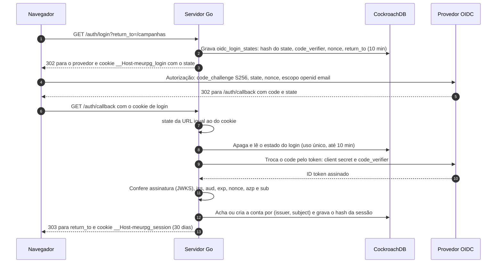

O callback recusa com 400, sem criar sessão, quando: falta o cookie de login ou o `state` não bate com ele; o estado não existe, já foi usado ou passou de 10 minutos; o provedor devolveu erro; a troca do `code` falhou (inclusive por PKCE); ou o ID token falha em qualquer conferência. O `aud` precisa ser só o nosso client ID, e o `azp`, quando vem, também.

### Sessão

- **Token:** 32 bytes aleatórios (`crypto/rand`) no cookie `__Host-meurpg_session`, com `Secure`, `HttpOnly`, `SameSite=Lax` e `Path=/`. O banco guarda só o SHA-256 (`auth_sessions.token_hash`).
- **Validade:** 30 dias corridos desde o login, sem renovar com o uso (NIST SP 800-63B-4, AAL1). Depois disso, o mestre passa pelo provedor de novo.
- **`auth_time` e `max_age`:** o servidor manda `max_age` só se `OIDC_MAX_AGE` estiver definido (o Google não documenta o parâmetro). O `auth_time` do ID token, quando vem, é só registrado em `auth_sessions.auth_time`, nunca usado para decidir: num provedor local de teste ele manteve a hora do primeiro login mesmo depois de um login forçado. No ambiente local, o devidp recebe `OIDC_MAX_AGE=1h`; com o Google, a variável fica sem valor. Quem cumpre a reautenticação a cada 30 dias (NIST SP 800-63B-4) é a sessão de 30 dias no servidor, não o `max_age`.
- **Logout:** apaga a linha da sessão, então o token para de valer na hora, em qualquer instância. Um stream da sessão ao vivo já aberto termina na checagem seguinte, em até 60 segundos (ver [Sessão ao vivo](#sessão-ao-vivo)).
- **Login de novo no mesmo navegador:** gera outro token (nada de reaproveitar o antigo) e revoga a sessão anterior.

Outros módulos descobrem quem chama pela interface descrita em [Quem está chamando](#quem-está-chamando), logo abaixo.

### Quem está chamando

A sessão só entra no contexto de uma requisição pelo `identity`, depois de conferir o cookie no banco: o interceptor, nas chamadas Connect, e o `AuthenticateRequest`, o mesmo passo para as poucas rotas HTTP comuns (enviar e baixar imagens, ver [Módulo maps](#módulo-maps-galeria-e-imagens)). Os dois só leem o cookie da requisição. Nenhuma função exportada põe uma sessão, ou um usuário qualquer, no contexto (decidido por Vinicius em 29/09/2026).

- **Os outros módulos recebem quem chama por uma interface,** `authz.Caller` (`UserID(ctx) (string, error)`). O `identity.Service` implementa lendo a chave privada que o interceptor dele preencheu, e o `cmd/api/main.go` liga as duas pontas. Sem sessão válida, a resposta é `unauthenticated`; se o banco não responde, o interceptor devolve `unavailable`, para o app não achar que o usuário saiu.
- **Nos handlers, a pergunta passa pelo `authz`:** `authz.RequireSignedIn(ctx)` quando basta estar logado, `authz.RequireCampaignMember` ou `authz.RequireCampaignRole` quando é sobre uma campanha. O `campaigns` monta o serviço com `Mount(handle, sessions, ...)`, em que `sessions` é o interceptor mais o `Caller` (o próprio `identity.Service` em produção). Numa rota HTTP comum, o `authz.Middleware` faz o papel do `authz.Interceptor`: as mesmas checagens, com um memo por requisição. Nenhuma rota está em `pendingMayCall`, então o membro pendente fica de fora.
- **Os testes dos outros módulos usam um `Caller` falso** (um mock), em vez de fabricar uma sessão. O mock só existe nos arquivos `_test.go` daquele módulo.
- **O `identity.Store` também fecha essa porta:** os métodos de sessão e de estado do login são não exportados, então nenhum outro pacote cria ou consulta uma sessão, nem implementa um `Store` falso que invente uma.
- **A intenção de login também:** o `IntentHandler.Complete` recebe o usuário como `identity.SignedIn`, que só o callback do `identity` preenche (ver [Aceitar o convite pelo login](#aceitar-o-convite-pelo-login)).

Assim, um erro num módulo novo não vira um jeito de se passar por outra pessoa: para ter um usuário no contexto, a requisição precisa de um cookie de sessão válido.

### CSRF

A proteção vem em camadas, como a ADR-0009 descreve:

| Camada | O que barra |
| --- | --- |
| Cookie `SameSite=Lax` | O navegador não manda o cookie em POST nem em `fetch` vindos de outro site. |
| `http.CrossOriginProtection` em volta do mux | Recusa com 403 um POST (ou PUT, DELETE) de outra origem, pelo `Sec-Fetch-Site` ou comparando `Origin` com `Host`. GET sempre passa, então nenhum GET pode mudar estado sem proteção própria. |
| `connect.WithRequireConnectProtocolHeader()` em todo serviço | Toda chamada unária do Connect exige o header `Connect-Protocol-Version: 1` (ou `connect=v1` na URL de um GET). Outro site só mandaria esse header depois de um preflight de CORS, que o servidor não aceita. |
| `state` no cookie de login, PKCE e `nonce` | Protegem o `GET /auth/callback`, que cria a sessão mesmo sendo GET. Ninguém consegue fazer o navegador da vítima terminar um login começado por outra pessoa. |

Por causa do header obrigatório, um `curl` numa chamada Connect precisa de `-H 'Connect-Protocol-Version: 1'`.

O envio de imagens (`POST /uploads/images`) não é Connect, então o header do protocolo não vale para ele. Quem o protege é o `http.CrossOriginProtection`, que fica em volta de todas as rotas, e o cookie `SameSite=Lax`. O teste `TestCrossSiteUploadsAreRefused` confere que um envio de outro site recebe 403 e não grava nada.

### Limite de tentativas no login

`/auth/login` grava uma linha em `oidc_login_states` a cada chamada, então tem um limite, em memória, antes de qualquer outra coisa. O `GET` e o `POST` dividem o mesmo limite. Passou do limite, a resposta é `429 Too Many Requests` com `Retry-After` (em segundos), sem gravar nada.

| Limite | Valor | Por quê |
| --- | --- | --- |
| Por IP do cliente | 20 de uma vez, depois 1 a cada 3 s (20 por minuto) | Folga para uma mesa inteira no mesmo Wi-Fi; um cliente sozinho não enche a tabela. |
| Geral | 200 de uma vez, depois 2 por segundo (120 por minuto) | Limita o que uma botnet grava: no máximo 7.200 linhas por hora por instância, que o TTL apaga na hora seguinte. |

- O limite de cada cliente é conferido antes do geral, então um cliente acima do próprio limite não gasta a cota de todo mundo. IPv6 conta por `/64`.
- Os contadores ficam na memória de cada instância: com N instâncias no Cloud Run, o limite efetivo é até N vezes maior. Uma tabela de no máximo 10 mil clientes evita que endereços novos esgotem a memória; um cliente parado some da tabela em até 2 minutos, mesmo que nenhuma requisição nova chegue.
- **De onde vem o IP.** Localmente, da conexão (`RemoteAddr`); `X-Forwarded-For` é ignorado, porque qualquer cliente manda o que quiser nele. No Cloud Run (a variável `K_SERVICE` existe), toda requisição passa pelo front end do Google, e o IP do cliente vem do **último** item do `X-Forwarded-For`: o Google acrescenta o endereço de quem se conectou a ele depois do que o cliente mandou, e não confere o que vem antes. A fonte (documentação do Google Cloud) e o que muda se um dia houver um load balancer na frente estão no comentário de `ratelimit.ClientKey`, em `backend/internal/platform/ratelimit`.
- O IP não vai para o log (ver [Privacidade](privacidade.md)).

### Sem provedor ou sem banco

O servidor sobe mesmo sem `OIDC_ISSUER` ou sem `DATABASE_URL`: o log de início avisa que o login está desligado, `/auth/login` e `/auth/callback` respondem 503 e o `IdentityService` responde `unavailable`. Se o provedor estiver fora do ar quando o servidor sobe, a descoberta é tentada de novo no próximo login.

## Testes e o provedor de desenvolvimento

Os testes rodam em três camadas, e nenhuma depende de um provedor de identidade de fora:

| Camada | Onde | Provedor OIDC | No CI |
| --- | --- | --- | --- |
| Unitário e fluxo em Go | `go test` em `backend/` | O provedor de `internal/identity/oidctest`, dentro do próprio teste (HTTPS com `httptest`), que loga o usuário na hora e deixa o teste quebrar uma coisa de cada vez: claims, chave de assinatura, descoberta | Job `go` |
| Integração em Go | `go test` com `MEURPG_TEST_DATABASE_URL` | O mesmo, com o CockroachDB de verdade atrás | Job `go-db` (CockroachDB com `docker run`) |
| Ponta a ponta | Playwright em `e2e/`, contra o `docker compose` | **devidp** (`backend/cmd/devidp`): o mesmo `oidctest`, servido com uma página que lista os usuários de teste | Workflow `e2e` |

O devidp implementa só o que o login precisa, com rigor: descoberta, JWKS com uma chave RSA gerada ao subir, `/authorize` com PKCE S256 obrigatório, `state` e `nonce`, `/token` para um client confidencial, ID token RS256 com `email`, `email_verified` e `auth_time`, e `max_age` e `prompt` medidos contra a própria sessão dele. Ele nunca vai para produção: a imagem dele é outra, ele só aceita issuer em host de loopback e não sobe no Cloud Run (detalhes e usuários de teste no [CONTRIBUTING.md](../CONTRIBUTING.md#login-local-com-o-devidp)).

### Diagrama: o login no ambiente local

O issuer é `http://idp.localhost:9090` para os dois lados. O navegador resolve qualquer `*.localhost` para `127.0.0.1` sozinho (RFC 6761) e chega ao devidp pela porta publicada. O container da API chega ao mesmo nome pelo alias de rede `idp.localhost`, que o Docker resolve para o container do devidp. Com a mesma string dos dois lados, o `iss` do ID token bate com o `OIDC_ISSUER`. A configuração aceita `http` num nome `*.localhost` pelo mesmo motivo.

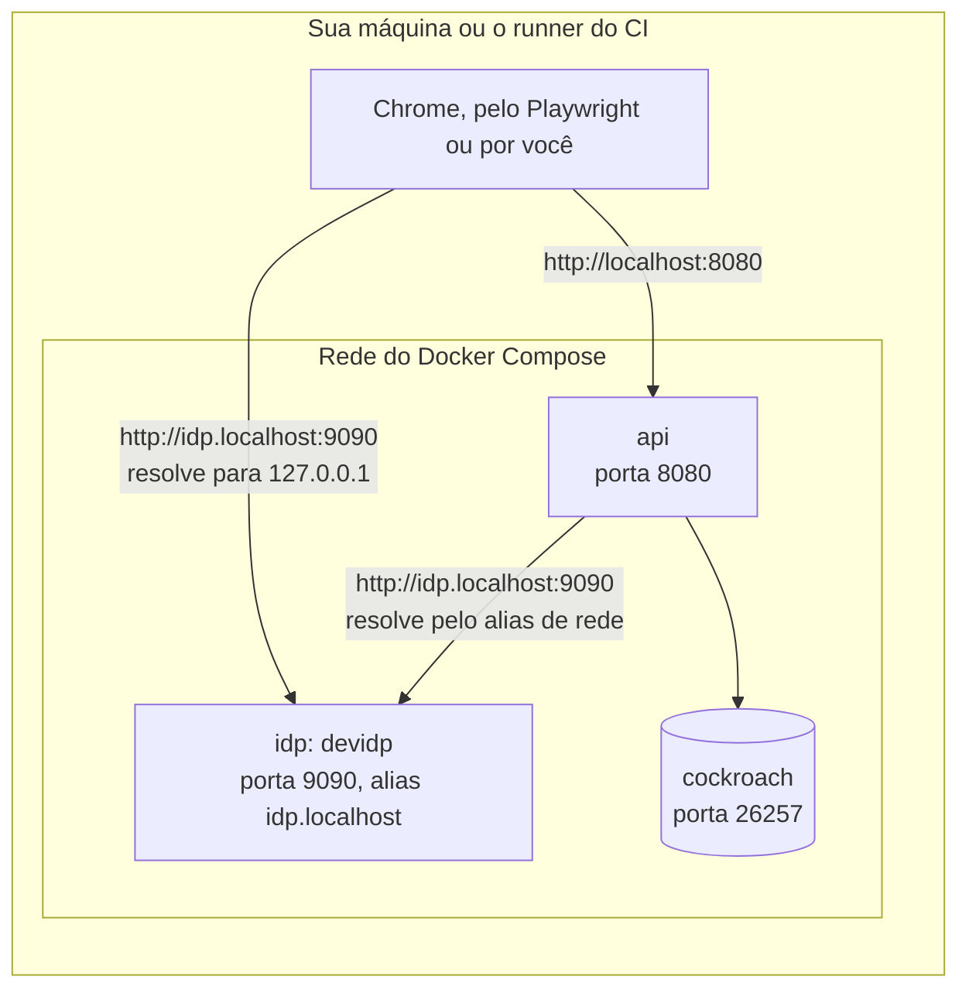

O cookie `__Host-meurpg_session` exige `Secure`, e mesmo assim funciona em `http://localhost`: o Chrome trata `localhost` como contexto seguro. Um teste Playwright confere isso no navegador. O Safari não aceita, então o login local é no Chrome ou no Firefox.

## Módulo campaigns e autorização

O mestre cria a campanha e gera convites; o jogador faz login e aceita o convite, e vira jogador da campanha (MR-001, MR-002, MR-003). O código fica em `backend/internal/campaigns`, e quem decide o que cada um pode fazer é o pacote `backend/internal/authz` (ADR-0011: papéis por campanha, conferidos no banco a cada requisição).

| Chamada do `CampaignService` | Quem pode |
| --- | --- |
| `CreateCampaign`, `ListMyCampaigns`, `AcceptInvite` | Qualquer pessoa logada. `ListMyCampaigns` também lista as campanhas em que a pessoa é membro pendente, só com o nome |
| `GetCampaign` | Membros da campanha; o membro pendente (RN-15) também, e recebe só o nome e `awaiting_approval` |
| `ListMembers` | Membros da campanha. O membro pendente não aparece na lista e recebe `not_found` |
| `CreateInvite`, `ListInvites`, `RevokeInvite` | O mestre da campanha |

### Autorização

O papel é por campanha (RN-05): a linha em `campaign_members` diz se a pessoa é `master` ou `player` naquela campanha. Não existe papel global, nem papel guardado em token.

- **O banco decide, a cada requisição.** Tirar alguém da campanha vale na chamada seguinte, sem esperar nada vencer.
- **Uma checagem explícita no começo de cada handler:** `authz.RequireCampaignMember(ctx, id)` para qualquer membro, `authz.RequireCampaignRole(ctx, id, authz.RoleMaster)` só para o mestre, ou só `authz.RequireSignedIn(ctx)` quando basta estar logado. As poucas chamadas que o membro pendente pode fazer usam `authz.RequireCampaignMemberOrPending(ctx, id)` (ver [Membro pendente](#membro-pendente)). Quem está chamando vem do `identity`, pela interface `authz.Caller` (ver [Quem está chamando](#quem-está-chamando)).
- **Uma leitura por campanha, por requisição.** O `authz.Interceptor` dá a cada requisição um memo novo, e o memo acaba com ela.
- **O stream confere de novo.** Um stream (`WatchGameSession`) dura minutos, e o memo dele duraria o mesmo tanto. Por isso o handler chama `authz.RecheckCampaignMember` a cada 60 segundos: ela lê de novo a sessão de login (`identity.Service.RecheckSession`, pela interface `authz.SessionRechecker`) e a participação, sem o memo, e o stream termina com o mesmo erro que uma chamada nova receberia (`unauthenticated` ou `not_found`). Sem um `Caller` que saiba conferir a sessão de novo, a checagem falha (`internal`).
- **Sem o interceptor, a checagem falha** (`internal`), nunca libera.

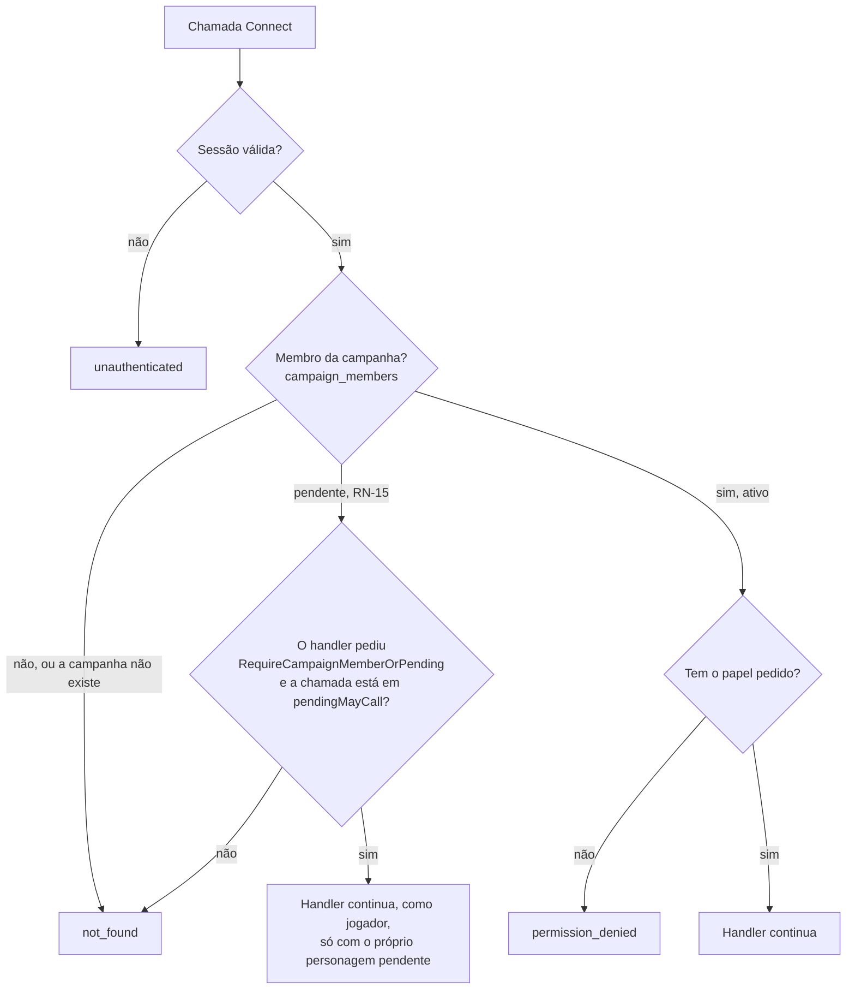

Quem não é membro recebe `not_found` tanto para uma campanha que existe quanto para uma inventada, com a mesma mensagem. Assim ninguém descobre quais campanhas existem. Um teste chama todo método do `CampaignService` como mestre, jogador, não membro, anônimo e membro pendente (`TestAuthorizationMatrix`), e falha se um método novo aparecer sem linha na tabela.

### Membro pendente

O membro pendente é quem aceitou um convite com aprovação (RN-15, MR-024) e espera o mestre aprovar o personagem que criou. Ele não é membro: `campaign_members.status = 'pending'`, e `RequireCampaignMember` e `RequireCampaignRole` respondem a ele exatamente como a quem não está na campanha (`not_found`, a mesma mensagem). Assim, toda chamada que já existe, e toda chamada nova, o deixa de fora sem ninguém precisar lembrar dele.

A exceção é uma só, e fica escrita no `authz` (`backend/internal/authz/pending.go`), não espalhada pelos handlers: enquanto espera, ele trabalha no próprio personagem. Para passar, duas travas precisam abrir:

1. O handler pede, chamando `authz.RequireCampaignMemberOrPending` em vez de `RequireCampaignMember`.
2. A chamada está em `pendingMayCall`, a lista fechada do que o membro pendente pode chamar. Se um handler fora da lista pedir mesmo assim, o membro pendente continua recebendo `not_found`, e o erro de programação vai para o log.

| Chamada em `pendingMayCall` | Para quê | O que o handler limita |
| --- | --- | --- |
| `CampaignService.GetCampaign` | Ver o nome da campanha enquanto espera | Só `id`, `name`, `my_role` (jogador) e `awaiting_approval` |
| `CharacterService.CreateCharacter` | Criar o único personagem, que nasce pendente | Só personagem de jogador, e um só (RN-03: o pendente conta como vivo) |
| `CharacterService.GetCharacter`, `ListCharacters` | Ler o próprio personagem | Só o próprio personagem pendente |
| `CharacterService.UpdateCharacter`, `UpdateCharacterStory` | Editar a ficha e a história | Só o próprio personagem pendente |
| `ContentService.ListContent` | O catálogo que o editor de personagem oferece | — |

Dentro dessas chamadas, o membro pendente é tratado como jogador (`authz` devolve `RolePlayer` e `Membership.Pending`), e o `characters` só mostra a ele os personagens `pending` dele (`canSee`, em `access.go`). `ListMyCampaigns` não precisa de exceção: só pede login, e lista as participações da própria pessoa, pendentes incluídas. Mudar a lista é mudar a RN-15: precisa da decisão, das linhas nas matrizes de autorização (`TestAuthorizationMatrix` de `campaigns` e de `characters` têm uma coluna para o membro pendente) e do teste `TestPendingMayCallIsTheAgreedList`.

O membro pendente deixa de existir de um dos dois jeitos, sempre pelo mestre e sempre na mesma transação que decide o personagem (ver [Módulo characters](#aprovar-ou-recusar-o-personagem)): a aprovação o torna membro ativo (jogador), a recusa apaga a participação.

### Convites

O convite é um link `https://<app>/convite#t=<token>`. O token tem 32 bytes aleatórios e só o servidor o gera; o banco guarda só o SHA-256 dele (`campaign_invites.token_hash`), e o servidor devolve o token uma vez só, na resposta do `CreateInvite`.

- **O token vai no fragmento (`#t=`),** que o navegador nunca manda para o servidor, então não aparece em log nem no `Referer`. O app lê o fragmento e manda o token no corpo do `AcceptInvite`, nunca na URL (ADR-0009).
- **Padrão (RN-07, decidida em 29/09/2026):** vale para uma pessoa e por 7 dias. O mestre pode escolher de 1 a 20 usos e de 5 minutos a 30 dias, e pode revogar o convite a qualquer momento. Quem já entrou continua na campanha.
- **Aceitar exige login** (hoje, OIDC). Quando o login do jogador sem Google chegar (RN-17, ADR-0009), ele cria a conta e a sessão, e a mesma regra de aceitar convite roda depois.
- **Convite com aprovação (RN-15, MR-024, implementado na Etapa 4):** o mestre escolhe, em cada convite, se ele exige aprovação (`CreateInviteRequest.requires_approval`, "Exigir aprovação do mestre" na tela; o padrão é não exigir, e o convite funciona como antes). Quem aceita um convite com aprovação vira [membro pendente](#membro-pendente), gasta um uso do convite, e o app o leva direto para criar o personagem, que nasce pendente. O mestre aprova ou recusa esse personagem (ver [Módulo characters](#aprovar-ou-recusar-o-personagem)); recusado, o jogador precisa de um convite novo.
- **Aceitar de novo não muda nada:** um membro recebe a campanha de volta com `already_member`, e nenhum uso do convite é gasto. Vale para o membro pendente, com qualquer convite da campanha: ele continua pendente.
- **Dois jogadores disputando o último uso não entram os dois.** Tudo acontece numa transação (`db.InTx`), com a linha do convite travada (`SELECT ... FOR UPDATE`); o `UPDATE` repete as regras, e um `CHECK` no banco impede `use_count` maior que `max_uses`. O teste `TestAcceptInviteRaceForTheLastUse` põe dez pessoas ao mesmo tempo no CockroachDB.
- **Convite que não serve** responde `failed_precondition`, com o detalhe `InviteUnusable` dizendo o motivo: expirado, revogado ou já usado. O app mostra uma mensagem clara para cada um. "Já usado" é o aviso de que o link pode ter vazado.

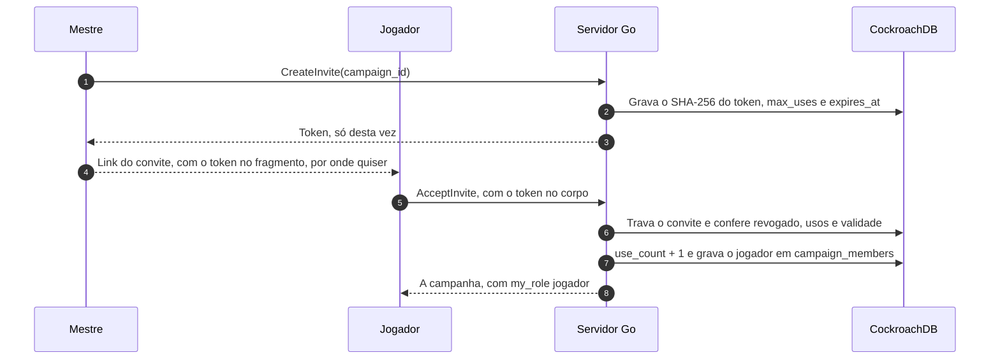

### Aceitar o convite pelo login

Quem abre o link do convite sem estar logado entra e aceita o convite num passo só, e nada fica guardado no navegador: nem `localStorage`, nem `sessionStorage`, nem service worker (decidido por Vinicius em 29/09/2026, ADR-0009). O token vai no corpo do formulário de login, e o servidor guarda só o hash dele, dentro do estado do login, que já é de uso único e dura no máximo 10 minutos.

1. A tela `/convite#t=<token>` lê o token do fragmento e envia um formulário `POST /auth/login` (`application/x-www-form-urlencoded`, da mesma origem) com `return_to`, `intent=campaign_invite` e `intent_payload=<token>`.
2. O `identity` confere o limite de tentativas e o `return_to`, e pede ao `campaigns` para preparar a intenção. O `campaigns` confere o formato do token e devolve o SHA-256 dele. O `identity` grava o hash, com o tipo da intenção, em `oidc_login_states`, e segue o login como sempre.
3. No callback, depois de criar a sessão, o `identity` pede ao `campaigns` para concluir a intenção. O `campaigns` aceita o convite pelo hash, na mesma transação do `AcceptInvite` (`db.InTx`, com a linha do convite travada).
4. O navegador vai para `/campanhas/<campaign_id>`, inclusive quem já era membro. Quem acabou de virar membro pendente, por um convite com aprovação (RN-15), vai para `/campanhas/<campaign_id>/personagens/novo`, criar o personagem. Se o convite não serve, vai para `/convite/erro?motivo=<código>`. O login vale do mesmo jeito: a sessão fica, e só o destino muda.

| `motivo` | Quando |
| --- | --- |
| `expired` | O convite passou da validade. |
| `revoked` | O mestre revogou o convite. |
| `used_up` | Os usos acabaram, talvez com alguém que pegou o link. |
| `not_found` | Nenhum convite tem esse token, ou a campanha foi apagada. |
| `invalid` | O que ficou guardado no login não é um hash de token. Só um bug causa isso. |
| `unavailable` | O banco não respondeu. Abrir o link de novo pode funcionar. |

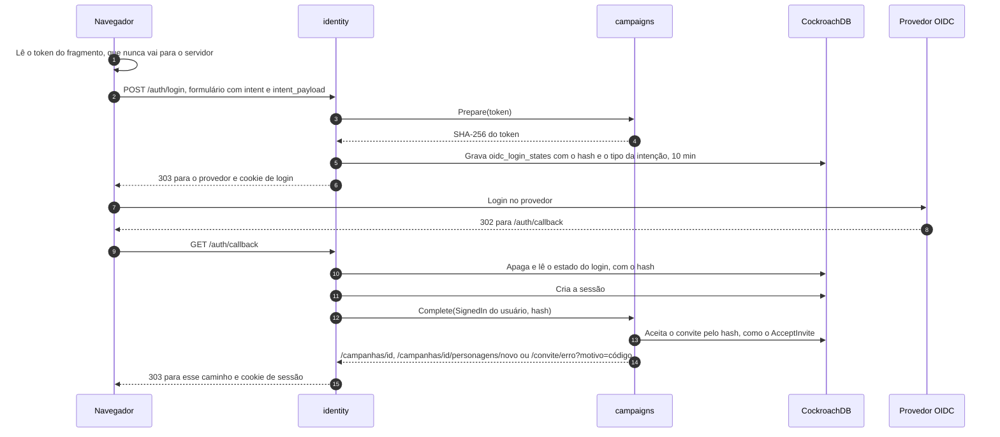

Regras que valem para qualquer intenção, não só a do convite:

- **O `identity` não conhece o `campaigns`.** Ele tem um registro de intenções por nome (`identity.Config.Intents`), preenchido no `cmd/api/main.go`. Cada intenção implementa `identity.IntentHandler`: `Prepare(payload)` no começo do login, que devolve o que guardar (no máximo 256 bytes, e nunca um segredo como veio), e `Complete(ctx, quem, dados)` depois da sessão criada, que devolve para onde ir.
- **`Complete` só age por quem acabou de entrar.** O usuário chega como `identity.SignedIn`, uma capacidade: o campo é privado e não há construtor, então só o callback do `identity` preenche um, logo depois de criar a sessão daquela pessoa. Fora do `identity`, só dá para escrever `identity.SignedIn{}`, que não tem usuário, e o `Complete` do convite recusa esse valor antes de tocar no banco (decidido por Vinicius em 29/09/2026). Pelo mesmo motivo do `ContextWithSession` removido: nenhuma função exportada age como um usuário qualquer.
- **Nada secreto em URL.** O `GET /auth/login` recusa `intent` e `intent_payload` com 400, e o `POST` recusa query string. O `return_to` perde o fragmento, então nem um `#t=...` colado por engano é guardado.
- **CSRF:** o `POST /auth/login` passa pelo `http.CrossOriginProtection`, então um formulário de outro site recebe 403. Sem isso, qualquer página poderia fazer o navegador de alguém entrar numa campanha escolhida por um atacante.
- **Entrada ruim para antes do provedor:** tipo de intenção desconhecido, `intent_payload` sem `intent`, token mal formado ou maior que 1.024 caracteres respondem 400; corpo acima de 8 KiB, 413; outro `Content-Type`, 415. Nada é gravado.
- **O destino passa pela mesma checagem do `return_to`.** Um caminho que não é deste site é trocado pelo `return_to`.
- **Logs:** registram só o motivo e o tipo da intenção, nunca o token, o hash ou um valor enviado pelo cliente. Os testes `TestIntentLogsHaveNoSecrets` e os de `signin_test.go` conferem.

### Respostas e GET

Toda resposta do `CampaignService`, inclusive os erros, sai com `Cache-Control: no-store`. Só o `ListMyCampaigns` aceita GET (`NO_SIDE_EFFECTS`), porque a requisição dele é vazia. As outras leituras (`GetCampaign`, `ListMembers`, `ListInvites`) levam o ID da campanha, e num GET a mensagem inteira vai na URL, que fica nos logs da plataforma (ver [Privacidade](privacidade.md)). Por isso elas levam `IDEMPOTENT` e ficam só em POST, mesmo sem efeito colateral (regra 7 dos [Contratos de API](#contratos-de-api-protobuf)).

### Nome de exibição

Os membros aparecem pelo nome de exibição, que cada pessoa digita no app (`IdentityService.UpdateProfile`, de 1 a 40 caracteres). Ele nunca vem do provedor de login. O `campaigns` pede os nomes ao `identity` por uma interface (`Profiles`, que o `identity.PostgresStore` implementa), sem ler a tabela `users`, como a regra dos módulos manda.

## Módulo rules: regras como dados

O `rules` calcula a ficha: recebe as escolhas do jogador (o `Build`) e devolve os números da ficha (o `Derived`), a partir do conteúdo do SRD 5.1 embutido no binário (ADR-0008). Não usa banco, rede, relógio nem aleatoriedade: a mesma ficha e o mesmo conteúdo dão sempre o mesmo resultado. O código fica em `backend/internal/rules`.

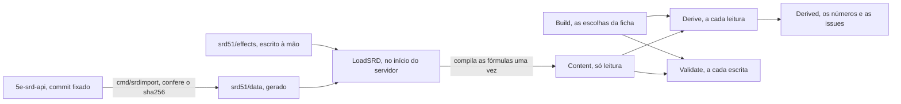

| Função | Quando roda | O que faz |
| --- | --- | --- |
| `LoadSRD()` | Uma vez, no início | Lê o snapshot e os efeitos, confere o esquema e compila toda fórmula. Erro aqui é bug no conteúdo embutido, e o servidor não sobe. |
| `Validate(build, content)` | Em toda escrita de ficha | Recusa o que não faz sentido nenhum: atributo fora de 1 a 30, nível total acima de 20, chave que não existe, sub-raça de outra raça, listas grandes demais. Devolve o campo, com os nomes do proto, sem repetir o valor. |
| `Derive(build, content)` | Em toda leitura de ficha | Calcula a ficha. Nunca falha: uma chave desconhecida, uma escolha fora da regra ou uma fórmula que quebra vira uma `Issue`, e o resto é calculado ("o app é um assistente, não um juiz"). |
| `Content.Catalog()`, `NamePT()`, `Summary()` | Nas telas de edição e nas listas | O que o editor oferece, com nomes em português; o nome de uma chave; "Mago 3" para uma linha de lista. |

**O que o `Derive` calcula**, para as 12 classes e as 9 raças do SRD, do nível 1 ao 20:

- atributos com os bônus de raça, sub-raça e manuais, e os modificadores;
- bônus de proficiência, os 6 testes de resistência (da primeira classe), as 18 perícias (nenhuma, metade, proficiente ou especialização), as 3 passivas e a iniciativa;
- CA com armadura, escudo e defesas sem armadura, com a descrição de como chegou nela; PV máximos (fixo ou rolado) e dados de vida; deslocamento e sentidos;
- conjuração por classe (CD, ataque, truques, magias conhecidas ou preparadas), espaços de magia (com a tabela de multiclasse) e a magia de pacto do bruxo;
- ataques com as armas da ficha e com os truques de dano;
- features e traços até o nível do personagem, com o texto do SRD em inglês, as dicas (`hints`) e as `issues`.

**O que não calcula (ainda):** magias ativas como Armadura Arcana e Escudo, PV atuais, espaços gastos e recursos em uso (são da sessão de jogo, Etapa 6). Os efeitos escritos à mão cobrem os níveis 1 a 5; acima disso, uma feature sem efeito aparece só como texto, e o mestre resolve.

### Efeitos e versões

O SRD descreve as features em prosa. O que o motor precisa saber fica em `effects/*.json`, escrito à mão, num conjunto fechado de tipos:

| Tipo | Exemplo |
| --- | --- |
| `modifier` | Defesa sem Armadura: `ac.base`, o maior entre as opções, `10 + mod("dex") + mod("con")`, só com `armor() == "none"` |
| `proficiency` | Pau para Toda Obra: metade da proficiência em toda perícia e na iniciativa |
| `roll_mode` | Esperteza Gnômica: vantagem em resistências de INT, SAB e CAR contra magia (vira dica) |
| `sense` | Visão no escuro, 18 m (60 ft) |
| `spellcasting` | Mago: INT, prepara do grimório, `max(1, mod("int") + classLevel("wizard"))` preparadas |
| `resource`, `grant_action` | Fúria, Retomar o Fôlego: carregados agora, usados pela sessão de jogo |
| `choice`, `note`, `handler` | Escolhas do jogador, o que só aparece como texto, e uma função Go registrada |

Um efeito com `tags` (como `against:magic`) nunca é aplicado sozinho: vira uma dica na ficha, e o mestre decide. A versão do conteúdo, `srd51@<commit>+fx.<n>`, aparece na ficha. Mudar um arquivo de `effects/` exige uma revisão nova; um teste confere. Um snapshot novo ou uma revisão nova pode mudar números de uma ficha travada, e o `content_version` mostra com qual conteúdo eles foram calculados.

### Fórmulas no Expr, com sandbox

As fórmulas dos efeitos rodam no Expr (`github.com/expr-lang/expr`), pinado em `v1.17.8`, nunca abaixo de `v1.17.7` (CVE-2025-68156). Como o conteúdo da mesa (homebrew) vai ser entrada não confiável, o pacote `rules/formula` fecha o Expr em camadas:

- **Ambiente fechado e tipado.** A fórmula só enxerga `level()`, `classLevel("wizard")`, `mod("int")`, `score("int")`, `prof()`, `armor()` e `shield()`. Nenhuma dessas funções acessa banco, rede, relógio ou aleatoriedade, e um nome desconhecido é erro de compilação.
- **Sem builtins.** `DisableAllBuiltins` desliga todos; só `floor`, `ceil`, `min` e `max` voltam, como funções nossas de duas linhas, com tipos fixos.
- **Lista branca antes de compilar.** A árvore da fórmula só pode ter números, verdadeiro/falso, aritmética, comparações, `and`/`or`/`not`, o ternário e chamadas às funções acima, com argumentos de texto literais e conhecidos (as 6 habilidades, as classes, as categorias de armadura). Ranges (`1..1000000` aloca memória mesmo sem builtins), `in`, `matches`, pipes, `??`, `let`, acesso a membros, listas, mapas e closures são recusados.
- **Limites.** No máximo 256 bytes e 64 nós; números literais até 1.000 e resultados até 10.000. A compilação acontece uma vez, ao carregar o conteúdo, nunca numa requisição.
- **Execução que não derruba o servidor.** Um erro em tempo de execução (um `%` por zero) vira uma `Issue` e o efeito é ignorado. A execução também é protegida por `recover`.
- **Testes.** Um teste tenta cada construção proibida, e um fuzz (`FuzzCompileFormula`) alimenta o compilador com entrada aleatória.

O SRD 5.1 é CC-BY-4.0: a atribuição exata fica no `NOTICE`, em `srd51.Attribution` e na página "Créditos"; um teste confere que são o mesmo texto.

## Módulo characters: personagens e fichas

O jogador cria o próprio personagem e o mestre cria os NPCs; a ficha volta com os números calculados pelo servidor (MR-003, MR-004, MR-005, MR-006). O personagem de quem entrou por um convite com aprovação espera o mestre aprovar ou recusar (MR-024, RN-15). O código fica em `backend/internal/characters`, e as tabelas estão em [Modelo de dados](dados.md#esquema-implementado).

- **A ficha guarda escolhas, não números.** `CharacterSheet` é uma ficha completa (`FullSheet`: jogador, inimigo e boss) ou básica (`BasicSheet`: minion e NPC de história). A completa guarda chaves de conteúdo, como `class:wizard`; toda escrita passa por `rules.Validate`, e toda leitura por `rules.Derive`, que devolve o `DerivedSheet` (ver [Módulo rules](#módulo-rules-regras-como-dados)). O navegador nunca calcula uma regra.
- **A história é à parte** (`CharacterStory`: personalidade, aparência, história, aliados), com a própria trava e a própria chamada (`UpdateCharacterStory`).
- **Revisão.** Ficha e história dividem uma `revision`. Quem salva manda a revisão que leu; se a ficha mudou nesse meio-tempo, a resposta é `aborted` e nada muda.
- **Notas do mestre** ficam numa tabela à parte e só saem por `GetMasterNotes`. Nenhuma outra resposta as carrega (RN-11), e um teste confere cada resposta que o jogador pode pedir.

| Chamada | Mestre | Dono (jogador) | Outro jogador | Não membro | Anônimo | Membro pendente (RN-15) |
| --- | --- | --- | --- | --- | --- | --- |
| `CreateCharacter`, tipo jogador | `permission_denied` | Sim; `failed_precondition` se já tem um vivo (RN-03) | Sim, o próprio | `not_found` | `unauthenticated` | Sim, um só, que nasce pendente |
| `CreateCharacter`, NPC | Sim | `permission_denied` | `permission_denied` | `not_found` | `unauthenticated` | `permission_denied` |
| `GetCharacter`, `UpdateCharacter`, `UpdateCharacterStory` do personagem do jogador | Sim | Sim, dentro das travas abaixo | `not_found` | `not_found` | `unauthenticated` | Só o próprio personagem pendente |
| `GetCharacter`, `UpdateCharacter`, `UpdateCharacterStory` de um NPC | Sim | `not_found` | `not_found` | `not_found` | `unauthenticated` | `not_found` |
| `ListCharacters` | Todos, NPCs e pendentes incluídos | Só os próprios | Só os próprios | `not_found` | `unauthenticated` | Só o próprio pendente |
| `SetStoryEditing`, `MarkCharacterDead` (só personagem de jogador) | Sim | `permission_denied` | `permission_denied` | `not_found` | `unauthenticated` | `not_found` |
| `ApproveCharacter`, `RejectCharacter` (só personagem de jogador) | Sim | `permission_denied` | `permission_denied` | `not_found` | `unauthenticated` | `not_found` |
| `GetMasterNotes`, `UpdateMasterNotes` | Sim | `permission_denied` | `permission_denied` | `not_found` | `unauthenticated` | `not_found` |
| `ContentService.ListContent` | Sim | Sim | Sim | `not_found` | `unauthenticated` | Sim |

Um membro que não pode ver um personagem (o de outro jogador, ou qualquer NPC para um jogador) recebe `not_found`, com a mesma mensagem de um personagem que não existe; assim ninguém descobre IDs de NPC. O teste `TestAuthorizationMatrix` chama cada método como cada um dos seis e falha se um método novo aparecer sem linha na tabela.

**As travas do jogador (RN-01).** O dono edita a ficha enquanto ela é rascunho, ou enquanto espera a aprovação do mestre (pendente, MR-024). Depois que uma sessão começa, a ficha trava; a história também, e o jogador só a edita enquanto o mestre libera (`SetStoryEditing`), até a próxima sessão começar. O mestre edita tudo, sempre. Os números calculados nunca são editáveis.

| Motivo (`CharacterBlockedReason`) | Quando |
| --- | --- |
| `SHEET_LOCKED` | O jogador tenta editar a ficha depois que uma sessão começou. |
| `CHARACTER_DEAD` | O jogador tenta editar a ficha de um personagem morto (RN-03). |
| `LIVING_CHARACTER_EXISTS` | O jogador tenta criar um segundo personagem vivo na campanha (RN-03). O detalhe traz o ID do personagem vivo. |
| `STORY_LOCKED` | O jogador tenta editar a história de um personagem travado ou morto sem a liberação do mestre. |
| `NOT_PENDING` | O mestre tenta recusar um personagem que não espera aprovação (MR-024): aprovado, o personagem fica na campanha. |
| `AWAITING_APPROVAL` | O mestre tenta marcar como morto um personagem que ainda espera aprovação (MR-024): ele aprova ou recusa antes. |

Esses motivos vêm no detalhe `CharacterBlocked` do `failed_precondition`, e ganham de uma revisão velha: tentar de novo não resolveria. Um `invalid_argument` diz o campo, com o caminho do proto (por exemplo, `sheet.full.base_scores.intelligence`), e nunca repete o que a pessoa digitou.

**Texto livre.** O servidor tira espaços das pontas; campos de uma linha recusam quebra de linha e caracteres de controle, e os de várias linhas aceitam quebra de linha e tabulação. Os limites, em caracteres, estão nos comentários de `characters.proto`.

**Respostas e GET.** Como no `campaigns`: toda resposta, inclusive os erros, sai com `Cache-Control: no-store`, e toda leitura leva um ID, então é `IDEMPOTENT` e só aceita POST.

**Por que o `ContentService` fica aqui.** A ADR-0008 põe o conteúdo da mesa no `campaigns`. Na Etapa 4 o conteúdo é só o SRD embutido no `rules`, sem nada no banco, então o catálogo é montado uma vez na partida e servido pelo `characters`. A requisição já leva o `campaign_id`, porque o conteúdo da mesa vai ser por campanha (decidido pelo Samuel em 29/09/2026).

### Aprovar ou recusar o personagem

O personagem criado por um [membro pendente](#membro-pendente) nasce `CHARACTER_STATE_PENDING` (RN-15, MR-024). O jogador edita a ficha e a história enquanto espera; a sessão de jogo não o trava, e ele não morre. O mestre o vê em "Esperando aprovação", na seção "Personagens" da campanha, abre a ficha e decide:

- **`ApproveCharacter`**: o personagem vira rascunho (RN-01 vale como sempre: trava na próxima sessão), e a participação do jogador vira ativa. Aprovar de novo, ou aprovar um personagem que nunca esperou, não muda nada.
- **`RejectCharacter`**: o personagem é apagado, com a história e as notas do mestre, e a participação pendente também. O jogador não vê mais a campanha e precisa de um convite novo. Só vale para personagem pendente; para os outros, `failed_precondition` (`NOT_PENDING`).

As duas mexem em duas tabelas de dois módulos, numa transação só: o `characters` muda o personagem e pede ao `campaigns` para mudar a participação, pela interface `characters.PendingMembers` (`ActivatePendingMember` e `DeletePendingMember`), que o `campaigns.Service` implementa e o `cmd/api` liga, como o `play` faz com o `SheetLocker`. Nenhum dos dois pacotes importa o outro. As duas travam a linha do personagem primeiro (`SELECT ... FOR UPDATE`), então uma aprovação e uma recusa ao mesmo tempo acontecem uma depois da outra: a segunda encontra o personagem já ativo (a recusa recebe `failed_precondition`) ou já apagado (a aprovação recebe `not_found`), nunca metade de cada (`TestRN15_ApproveAndRejectRace`).

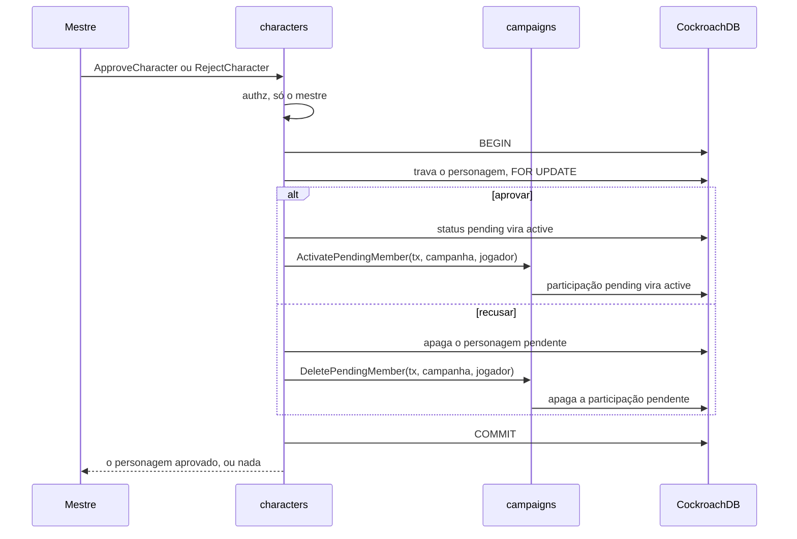

Na tela, a ficha pendente mostra ao jogador "Esperando a aprovação do mestre", e ao mestre os botões "Aprovar personagem" e "Recusar personagem"; recusar pede uma confirmação ("Confirmar recusa"), porque apaga o personagem de vez.

## Módulo play: sessões de jogo

O `play` inicia, encerra e lista as sessões de jogo de uma campanha, o que trava as fichas (RN-01, Etapa 4), e cuida da sessão ao vivo (Etapa 5): o aviso de que a sessão começou (RN-06), o stream da sessão (ADR-0005) e a correção do mestre nos PV, nos espaços de magia e nos dados de vida (RN-02), cada uma registrada em `session_events` (ADR-0007). Turnos e ações vêm com o combate, na Etapa 6. O código fica em `backend/internal/play`.

| Chamada do `PlayService` | Quem pode | Erros próprios |
| --- | --- | --- |
| `StartGameSession` | O mestre da campanha | `failed_precondition` (`SESSION_ALREADY_OPEN`) se já há uma sessão aberta |
| `EndGameSession` | O mestre da campanha | `not_found` se a sessão não é da campanha. Encerrar de novo não é erro: devolve a sessão como está |
| `ListGameSessions` | Membros da campanha | — |
| `ListOpenGameSessions` | Qualquer pessoa logada; cada um vê só as campanhas em que é membro ativo | — |
| `GetLiveSession`, `WatchGameSession` | Membros da campanha | `failed_precondition` (`NO_OPEN_SESSION`) sem sessão aberta |
| `AdjustCharacterVitals` | O mestre da campanha, durante a sessão | `failed_precondition` (`NO_OPEN_SESSION`); `not_found` se o personagem não é um personagem de jogador vivo da campanha; `invalid_argument` fora de 0 até o máximo |

O membro pendente (RN-15) recebe `not_found` em tudo que pede campanha, como quem não é membro; `TestAuthorizationMatrix` tem uma coluna para ele.

**Como o `play` e o `characters` se encontram.** Iniciar uma sessão trava as fichas na mesma transação que abre a sessão. O `play` não mexe na tabela `characters`: ele declara uma interface, `SheetLocker`, que o `characters.Service` implementa com `LockSheets`, e o `cmd/api` liga os dois. Nenhum dos dois pacotes importa o outro. `LockSheets` não recebe quem está chamando: é "o sistema" da RN-01, e só o `play` o chama, depois de conferir que quem chama é o mestre.

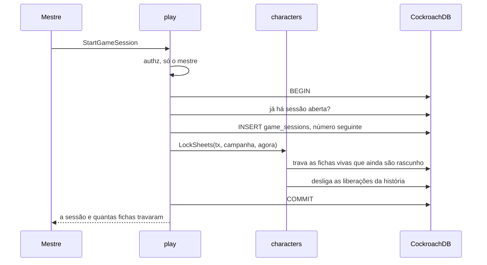

- **Uma sessão aberta por campanha.** A checagem dentro da transação dá o erro claro; um índice único parcial garante a regra quando duas chamadas correm juntas.
- **O personagem criado depois** da primeira sessão fica rascunho até a próxima começar, porque `LockSheets` roda em todo início de sessão, não só no primeiro.
- **Encerrar não destrava nada.** A ficha continua travada entre as sessões.

### Sessão ao vivo

O jogador fica sabendo da sessão por uma consulta leve, e acompanha a sessão por um stream que só existe enquanto ele está com a página da sessão aberta e visível (ADR-0005).

- **O aviso (RN-06) é uma consulta, não um stream.** Com a aba visível e a pessoa logada, o app chama `ListOpenGameSessions` a cada 30 segundos, e uma vez quando a aba volta a ficar visível. A resposta traz as sessões abertas das campanhas em que a pessoa é membro ativo, com o nome da campanha e o papel dela; uma sessão nova vira o aviso "A sessão 3 de Mirathel começou" com o link. São duas leituras por índice (as campanhas da pessoa, pelo `campaigns`, e as sessões abertas delas, pelo índice parcial de `game_sessions`), e o Cloud Run só cobra o tempo da requisição.
- **O link da sessão** é `/campanhas/<id>/sessao`, sem segredo (RN-07). Quem decide é o servidor: sem login, `unauthenticated`, e o app manda para o login; quem não é membro, ou é membro pendente, recebe `not_found` (a tela mostra "Peça um convite ao mestre", sem o nome da campanha); sem sessão aberta, `failed_precondition` com `GameSessionBlocked` e o motivo `NO_OPEN_SESSION` (a tela mostra "Nenhuma sessão em andamento").
- **O stream** (`WatchGameSession`) manda primeiro `ready`, depois de registrar a assinatura. Só então o app lê a foto da sessão (`GetLiveSession`), então nenhuma mudança cai no intervalo entre a foto e o stream. Uma mudança pode chegar antes da foto: a `revision` das `CharacterVitals` diz qual é a mais nova. Depois vêm `heartbeat` a cada 25 segundos, `vitals_changed` e `session_ended`.

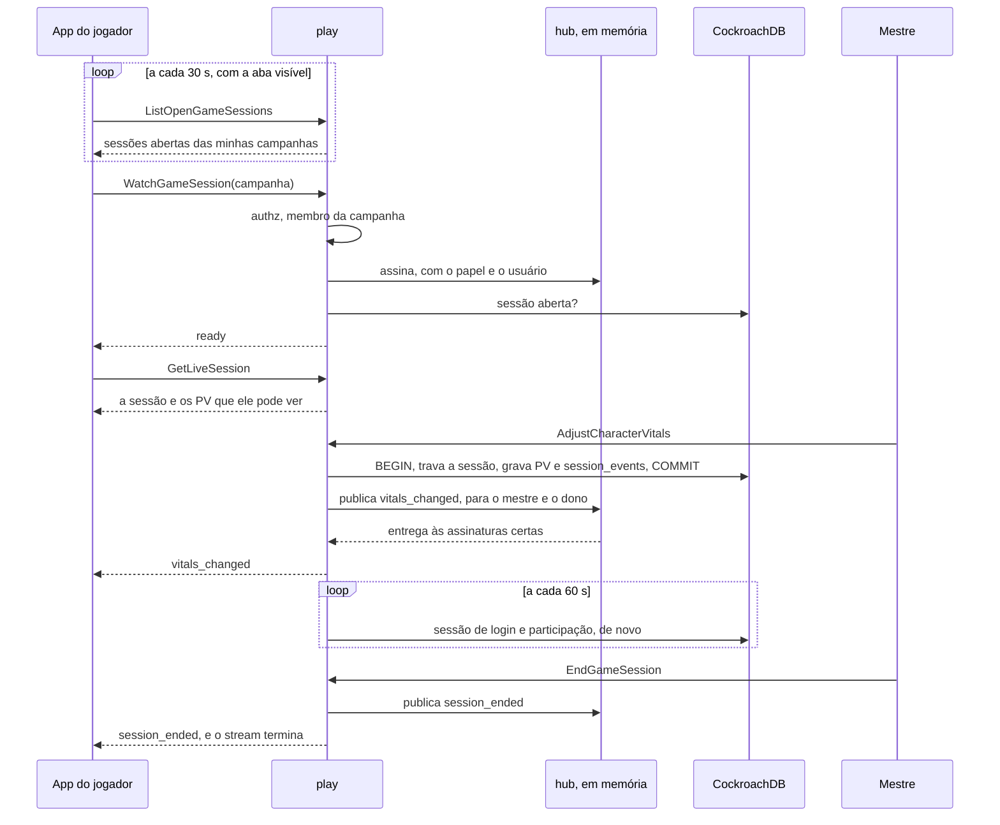

**Quem vê o quê.** O mestre vê as `CharacterVitals` de todo personagem de jogador vivo da campanha; o jogador, só as do próprio personagem, na foto e no stream (pergunta 28 para o Samuel; o padrão é "não"). O filtro roda no servidor: cada evento publicado leva a própria audiência (todos, o mestre, ou um usuário), e o hub só entrega às assinaturas dela. `TestPlayersSeeOnlyTheirOwnVitals` confere a foto e o stream, e `TestRN11_LiveSessionNeverCarriesMasterNotes` confere que nada da sessão ao vivo carrega as notas do mestre.

**Quando o stream termina.**

| Quando | Como termina | O que o app faz |
| --- | --- | --- |
| O mestre encerra a sessão | `session_ended`, depois fim sem erro | Mostra "Sessão encerrada" |
| 30 minutos de stream | Fim sem erro | Reconecta e lê a foto de novo |
| O servidor vai reiniciar (graceful shutdown) | Fim sem erro, na hora: o `httpserver` chama `play.Service.Close` quando o desligamento começa | Reconecta |
| O app parou de ler e ficou 16 eventos para trás | `unavailable` | Reconecta e lê a foto de novo |
| A sessão de login acabou (logout, revogada, 30 dias) | `unauthenticated`, na checagem seguinte | Manda para o login |
| A pessoa saiu da campanha | `not_found`, na checagem seguinte | "Peça um convite ao mestre" |

O app reconecta com espera crescente (1 s, 2 s, 4 s, até 30 s, com variação aleatória) e só com a aba visível: com a aba escondida por 2 minutos, ele mesmo fecha o stream, e reabre (com a foto nova) quando a aba volta. É o que impede uma aba esquecida de segurar uma conexão aberta (ver [Operação](operacao.md#stream-da-sessão-ao-vivo)).

**O hub fica em memória, numa instância só.** O pacote `play/live` guarda as assinaturas de cada campanha na memória do servidor. Publicar nunca espera: cada assinatura tem um buffer de 16 eventos, e a que enche é derrubada, em vez de atrasar a mudança do mestre. Com duas instâncias do Cloud Run, a mudança feita numa não chegaria aos streams abertos na outra; por isso o serviço roda com `max-instances = 1` enquanto o fan-out for em memória (ver [Operação](operacao.md)). Quando uma instância não bastar, um canal compartilhado (changefeed do CockroachDB ou Pub/Sub) entra no lugar do hub, e o resto não muda.

**O stream passa pela mesma pilha HTTP.** O log de requisições embrulha a resposta num `statusRecorder` que repassa o `Flush`, o `CrossOriginProtection` recusa POST de outra origem (o stream é um POST com `Content-Type: application/connect+json`, que outro site só mandaria depois de um preflight de CORS), o servidor fala HTTP/1.1 e h2c, e não há `WriteTimeout`. `TestLiveStreamIsNotBuffered` abre o stream pelo servidor de verdade, em HTTP/1.1 e em h2c, com o heartbeat desligado, e confere que `ready` e `vitals_changed` chegam na hora.

### PV, espaços de magia e dados de vida

Os números do personagem que mudam durante o jogo (PV atual, PV temporários, espaços de magia usados por círculo, espaços de pacto usados e dados de vida usados) ficam em `character_vitals`, no módulo `characters`, porque são do personagem e duram de uma sessão para outra (ver [Modelo de dados](dados.md#esquema-implementado)). O `play` os lê e muda pela interface `play.VitalsKeeper` (`ListVitals`, `GetVitals`, `AdjustVitals`), que o `characters.Service` implementa e o `cmd/api` liga, como o `SheetLocker`. As mensagens (`CharacterVitals`) são do `play.proto`, porque só o `PlayService` as serve: o `play` declara a interface e o que passa por ela, e o `characters` só preenche.

- **Os máximos nunca são guardados.** Saem do `rules.Derive`, como todo número da ficha: PV máximo, espaços por círculo, espaços de pacto e dados de vida (o total é o nível). A cada leitura, o valor guardado é cortado no máximo de agora: uma ficha que perdeu nível nunca mostra mais do que tem.
- **Sem linha, o personagem está inteiro:** PV cheio, nada usado, `revision` 0.
- **Só personagens de jogador vivos e ativos** (não NPC, não morto, não pendente). O NPC ganha PV de combate com os combatentes, na Etapa 6.
- **A correção do mestre** (`AdjustCharacterVitals`) troca só os valores que vêm na requisição, cada um de 0 até o máximo (PV temporários até 999). Numa transação só, o `play` trava a linha da sessão aberta (`FOR UPDATE`), confere a chave de idempotência, pede ao `characters` para gravar e grava o evento em `session_events`; só depois do `COMMIT` publica `vitals_changed`.
- **Idempotência.** O app manda um UUID novo a cada correção (`idempotency_key`) e o mesmo numa nova tentativa. Se a chave já está em `session_events`, nada é gravado nem publicado, e a resposta traz os PV como estão agora (`TestAdjustCharacterVitalsIsIdempotent`). A mesma chave para outro personagem é `invalid_argument`.
- **Ordem dos eventos.** O `seq` de cada evento é o seguinte da sessão, lido com a linha da sessão travada, então duas correções ao mesmo tempo esperam uma pela outra e ganham 1, 2, 3, sem buraco e sem repetição (`TestSessionEventsAreOrderedPerSession`). `EndGameSession` trava a mesma linha, então uma correção em andamento termina antes da sessão acabar.

## Módulo maps: galeria e imagens

A galeria guarda as imagens que o mestre usa nos mapas e no documento da campanha (MR-019). O servidor aceita só JPEG, PNG e WebP, grava cada imagem codificada de novo, sem nenhum metadado, e só a entrega a quem é membro da campanha. O código fica em `backend/internal/maps`; mapas, pontos de interesse e tokens chegam depois, no mesmo módulo.

| Rota ou chamada | Quem pode | O que faz |
| --- | --- | --- |
| `POST /uploads/images` | O mestre da campanha | Recebe a imagem (formulário `multipart/form-data`: `campaign_id`, depois `file`), confere, codifica de novo, guarda e responde `201` com o `GalleryImage` em JSON |
| `GET /images/{id}` e `GET /images/{id}/thumb` | Qualquer membro ativo da campanha da imagem, jogadores inclusive | Entrega a imagem, ou a miniatura de 480 px no lado maior |
| `GalleryService.ListGalleryImages` | O mestre | Lista a galeria, da mais nova para a mais antiga, com o uso da cota |
| `GalleryService.RenameGalleryImage` | O mestre | Muda o nome (1 a 80 caracteres, uma linha) |
| `GalleryService.DeleteGalleryImage` | O mestre | Apaga a linha e os arquivos. Recusa com `failed_precondition` se um mapa usa a imagem |

Enviar e baixar não são chamadas Connect porque o corpo é um arquivo. As duas rotas usam o mesmo cookie de sessão e as mesmas checagens do `authz` (ver [Quem está chamando](#quem-está-chamando)). O contrato inteiro, com os erros, fica no comentário do `GalleryService` em `proto/meurpg/maps/v1/gallery.proto`.

### O envio

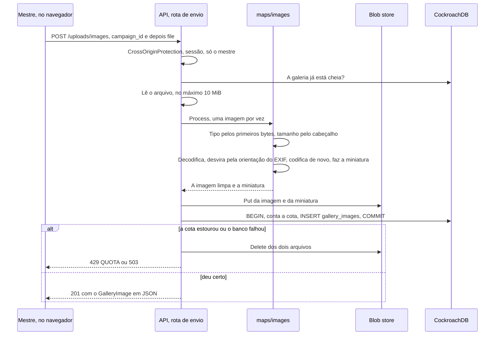

- **A ordem economiza trabalho.** O `campaign_id` vem antes do arquivo, então quem não é o mestre recebe a recusa antes de o servidor ler 10 MiB. Uma olhada rápida na cota também vem antes; a checagem que vale é a de dentro da transação, que o `SERIALIZABLE` do CockroachDB protege de dois envios ao mesmo tempo.
- **O tipo vem dos bytes,** nunca do nome do arquivo nem do que o navegador diz. SVG, GIF e o resto são recusados.
- **Bomba de descompressão.** O servidor lê só o cabeçalho primeiro (`image.DecodeConfig`) e recusa acima de 8.192 px num lado ou de 40 megapixels. Também estima a memória que a decodificação vai usar (um JPEG progressivo ou um PNG de 16 bits gastam bem mais por pixel) e recusa acima de 256 MiB. Só uma imagem é processada por vez em cada instância, então alguns envios juntos não esgotam os 512 MiB do Cloud Run (ver [Operação](operacao.md)).
- **Codificar de novo é o que limpa.** A imagem nova tem só os pixels: EXIF (com a posição do GPS), XMP, perfis ICC, os textos de um PNG e qualquer coisa escondida depois da imagem ficam para trás. PNG continua PNG, para o mapa manter as partes transparentes. JPEG continua JPEG, com qualidade 88. WebP vira JPEG, ou PNG quando tem pixels transparentes.
- **A foto fica em pé.** O celular grava a foto como o sensor viu e anota no EXIF como estava virado. Como o EXIF sai, o servidor desvira os pixels antes, senão a foto apareceria deitada.
- **O nome** vem do nome do arquivo, sem pastas, sem extensão e sem caracteres de controle, cortado em 80 caracteres ("Imagem" quando não sobra nada). O mestre pode mudar.
- **Os arquivos antes da linha.** Se algo falha depois de gravar um arquivo, os dois arquivos são apagados. Uma queda do servidor bem no meio pode deixar arquivos sem linha, que ninguém alcança; uma limpeza periódica pode achá-los depois pelo prefixo da campanha.

### Onde as imagens ficam

O pacote `backend/internal/platform/blob` é uma interface pequena (`Put`, `Open`, `Delete`) com uma implementação em disco. As chaves são `campaigns/<campanha>/images/<id>` e `…/<id>.thumb`: tudo de uma campanha tem o mesmo prefixo.

| Onde | Como |
| --- | --- |
| Ambiente local | `BLOB_DIR=/var/lib/meurpg/images`, num volume do Docker Compose (`images`), que sobrevive ao `make down` |
| Testes | Uma pasta temporária por teste |
| Produção | Um bucket privado do Cloud Storage, em São Paulo, atrás da mesma interface, a partir do primeiro deploy (ver [Operação](operacao.md)) |

- **Em disco,** cada arquivo começa com uma linha com o tipo (`image/jpeg`), seguida da imagem. O `Put` escreve num arquivo temporário e renomeia por cima, então ninguém lê meio arquivo. Toda operação passa por um `os.Root`, que recusa qualquer caminho fora da pasta, mesmo por um link simbólico, e a chave só aceita letras minúsculas, dígitos, `.`, `-` e `_`. Os erros não levam o caminho, porque a chave tem IDs.
- **Sem `BLOB_DIR`,** as imagens ficam desligadas: o envio, o download e o `GalleryService` respondem `503`/`unavailable`, e o resto do app funciona. O log de início avisa.
- **Apagar** tira a linha primeiro e os arquivos depois: sem a linha, ninguém alcança os arquivos, então uma falha ao apagá-los não expõe nada (vai para o log).
- **Apagar a campanha** (hoje, só pela exclusão da conta do mestre) apaga as linhas pelo `ON DELETE CASCADE`, mas não os arquivos. Quem implementar a exclusão da campanha ou da conta precisa apagar também o prefixo `campaigns/<campanha>/` (ver [Privacidade](privacidade.md)).

### Servir as imagens

`GET /images/{id}` confere, nesta ordem: sessão válida (senão `401`, antes de procurar a imagem), a imagem existe e quem pede é membro ativo da campanha dela (senão `404`, igual a uma imagem que não existe, nunca `403`). Só depois disso vem o `304` do `If-None-Match`, para um estranho não descobrir que a imagem existe mandando o ETag.

| Header | Valor | Por quê |
| --- | --- | --- |
| `Cache-Control` | `private, max-age=31536000, immutable` | Os bytes de um ID nunca mudam: um envio novo ganha um ID novo. `private`, porque é só daquele membro |
| `ETag` | `"<id>"` (miniatura: `"<id>.thumb"`) | O navegador revalida sem baixar de novo (`304`) |
| `Content-Type`, `Content-Length` | Do arquivo guardado | — |
| `X-Content-Type-Options: nosniff` e `Content-Disposition: inline` | — | O navegador trata o arquivo como a imagem que o `Content-Type` diz |
| `Content-Security-Policy: default-src 'none'` | — | Mesmo aberta sozinha numa aba, a resposta não roda nada |
| `Cross-Origin-Resource-Policy: same-origin` | — | Outro site não embute a imagem |

O CSP do app já aceita as imagens (`img-src 'self'`), e o handler do Angular deixa `/images` e `/uploads` para a API (`isAPIPath`); no `ng serve`, o `proxy.conf.json` encaminha as duas.

**RN-10 com imagens.** O jogador pode baixar uma imagem da campanha, porque os mapas que ele vê são imagens. Isso não revela um mapa escondido: o jogador só baixa pelo ID, o ID é um UUID aleatório, e ele só recebe o ID de uma imagem numa resposta que pode ver (um mapa revelado, o mapa atual da sessão). A galeria, que lista todas as imagens, é só do mestre (`TestMR019_PlayersCannotListTheGallery`). Quem não é membro ativo recebe `404` (`TestAuthorizationMatrix`, no `maps`).

### Os erros do envio

A rota não é Connect, mas os erros usam os códigos do Connect, num JSON pequeno que o app traduz pelo `reason`: `{"code": "invalid_argument", "reason": "UNSUPPORTED_TYPE", "message": "..."}`. A `message` é em inglês, para quem desenvolve; a tela mostra um texto próprio para cada `reason`.

| HTTP | `code` | `reason` | Quando |
| --- | --- | --- | --- |
| 400 | `invalid_argument` | `UNSUPPORTED_TYPE` | Não é JPEG, PNG nem WebP |
| 413 | `invalid_argument` | `TOO_LARGE` | Mais de 10 MiB, enviado ou depois de codificado de novo |
| 400 | `invalid_argument` | `DIMENSIONS` | Pixels demais |
| 400 | `invalid_argument` | `CORRUPT` | Parece uma imagem aceita, mas não abre |
| 400 | `invalid_argument` | `MALFORMED_REQUEST` | Não é um formulário `multipart`, falta um campo, sobra um campo, ou a ordem está errada |
| 429 | `resource_exhausted` | `QUOTA` | A campanha já tem 300 imagens, ou passaria de 500 MiB |
| 401, 403, 404 | `unauthenticated`, `permission_denied`, `not_found` | — | Sem sessão; um jogador; quem não é membro (ou a campanha não existe) |
| 503 | `unavailable` | — | Imagens desligadas (sem `BLOB_DIR`), ou o banco ou o armazenamento não responderam |

O `403` do `CrossOriginProtection` (um envio de outro site) vem antes de tudo isso, em texto puro: o app nunca o vê.

## Ver também

- [Modelo de dados](dados.md)
- [Regras de negócio](produto/regras.md)
- [Roadmap](roadmap.md)
- [Operação](operacao.md)
- `docs/adr/` (repositório privado, não versionado aqui): as decisões completas por trás desta página.
