# Arquitetura

O novo backend é um monólito modular em Go no Cloud Run em São Paulo. O CockroachDB fica no Google Cloud, também em São Paulo, como o Samuel confirmou: servidor e banco no mesmo provedor e na mesma região. O Angular só desenha a tela; toda regra roda no servidor.

## Decisões

Decisões difíceis de desfazer viram ADR (Architecture Decision Record) no repositório privado `docs/adr/` (ignorado neste repositório, mantido por Samuel e Vinicius). O código e os documentos aqui citam só o número, como "ver ADR-0002".

| Peça | Escolha | Por quê |
| --- | --- | --- |
| Backend | Go, monólito modular: um deploy só, módulos com fronteiras claras (ADR-0001) | Um time pequeno não precisa de microserviços. As fronteiras deixam separar um módulo depois, se um dia precisar. |
| BFF | O próprio servidor Go (ADR-0001) | A tela pede "a ficha pronta" numa chamada. Nenhuma regra de D&D fica no navegador, então ninguém trapaceia editando o JavaScript. |
| API | Protobuf + Connect (connect-go e connect-es), com buf (ADR-0001) | Um contrato gera o código dos dois lados. Funciona em HTTP/1.1 com JSON, então dá para testar com `curl`. |
| Tempo real | Stream do Connect (server streaming), aberto só durante a sessão e só com a aba visível; o aviso de sessão é uma consulta leve a cada 30 segundos, não um stream (ADR-0005, proposta; implementado na Etapa 5, ver [Sessão ao vivo](#sessão-ao-vivo)) | Sem sessão ativa, nada fica conectado. Um WebSocket esquecido aberto o mês todo custaria caro (ver [Operação](operacao.md)). |
| Hospedagem | Cloud Run em `southamerica-east1`, 1 vCPU e 512 MiB, `min-instances` 0, `max-instances` 1 enquanto o fan-out do stream for em memória (ADR-0003, ADR-0005) | Escala a zero quando ninguém usa. No uso previsto, fica abaixo de US$ 1 por mês (ver [Operação](operacao.md)). |
| Banco | CockroachDB no Google Cloud (São Paulo), com pgx, sqlc e goose (ADR-0003) | sqlc gera Go tipado a partir do SQL. O CockroachDB roda em `SERIALIZABLE`, então toda escrita repete a transação no erro `40001`. |
| Login | Google OIDC com PKCE; sessão com token opaco num cookie `__Host-` httpOnly (ADR-0002) | O JavaScript da página não lê o cookie, e dá para revogar a sessão na hora (logout, tirar alguém da campanha). |
| Frontend | Um novo app Angular em `web/`, sobre o cliente Connect, com as regras no servidor. O servidor Go entrega o build, na mesma origem da API (ADR-0006, proposta) | O cookie de sessão só funciona bem sem cookies de terceiros, e o Safari do iPhone bloqueia esses cookies. No app antigo (descontinuado), o Angular ficava no GitHub Pages e a API no Render, em sites diferentes; componentes úteis de lá (stepper da ficha, mapa, editor) são portados para o `web/` conforme a necessidade. Detalhes em [Frontend (web/)](#frontend-web) abaixo. |
| Jev (depois do MVP) | Cloudflare Workers AI, atrás de uma interface em Go | Trocar de provedor sem mexer no resto do código. |

## Módulos

Cada módulo do backend fica em `backend/internal/<módulo>`. Um módulo só chama outro pela interface pública dele, nunca pelas tabelas.

- `identity`: login do mestre, sessões de login e usuários. O login do mestre é um *relying party* OIDC genérico: Google em produção, um provedor OIDC local nos testes ponta a ponta — o módulo fala o protocolo, não um SDK do Google. O login do jogador sem Google (RN-17, decidido pelo Samuel em 29/09/2026: handle por mesa, sem e-mail) ainda não está implementado — ver [ADR-0009](adr/0009-login-do-jogador-sem-google.md). Criar campanha continua exigindo uma conta com Google no MVP (RN-14).
- `campaigns`: campanhas, membros (inclusive o membro pendente de um convite com aprovação, RN-15), papéis, convites, como a campanha rola os dados (RN-18) e o documento da campanha (MR-018, ver [Documento da campanha](#documento-da-campanha)).
- `characters`: personagens, fichas, história, trava, notas do mestre e, depois, cópias. Também serve o catálogo de regras do editor (`ContentService`) enquanto não existe conteúdo da mesa (ver [Módulo characters](#módulo-characters-personagens-e-fichas)).
- `play`: sessão de jogo, cenas, encontros, combatentes e o stream ao vivo. Hoje: iniciar, encerrar e listar sessões, o que trava as fichas (Etapa 4), e a sessão ao vivo: o aviso, o stream, a correção do mestre nos PV, espaços de magia e dados de vida, com o histórico em `session_events`, e o que a sessão mostra, o mapa atual e uma imagem da galeria (Etapa 5; ver [Módulo play](#módulo-play-sessões-de-jogo)).
- `maps`: mapas, pontos de interesse, tokens, a galeria de imagens e, depois, masmorras. Na Etapa 5, a galeria (enviar, guardar e servir as imagens, ver [Módulo maps: galeria](#módulo-maps-galeria-e-imagens)) e os mapas, com o que cada um vê decidido no servidor (ver [Módulo maps: mapas](#módulo-maps-mapas-pontos-e-tokens)).
- `progression`: o XP que o mestre dá (por inimigos, por ouro ou à mão), os marcos, o histórico e quem pode subir de nível (Etapa 7, `ProgressionService`; ver [Módulo progression](#módulo-progression-xp-e-marcos)).
- `notes`: as anotações particulares dos jogadores, com etiqueta de cena, junto das pistas que o mestre revelou a cada um (Etapa 8, `NotesService`; ver [Módulo notes](#módulo-notes-anotações-dos-jogadores)).
- `rules`: as contas do D&D 5e (modificadores, CD, bônus). Não acessa o banco, então é fácil de testar.
- `platform`: o que é de todos: configuração, banco, servidor HTTP, logs e os dados (`platform/dice`: ler expressões, rolar e conferir o dado físico).

Cada módulo é construído do zero, direto no Go: não há troca de lado nem coexistência com o NestJS antigo, que fica descontinuado e será removido do repositório (decidido pelo Samuel em 29/09/2026, ver [App antigo](app-antigo.md)) — o backend novo passa a cobrir sozinho todas as histórias do MVP. O critério de pronto é o mesmo de qualquer história: os testes do módulo passam (ver [Visão do produto](produto/visao.md)).

### Diagrama: arquitetura alvo

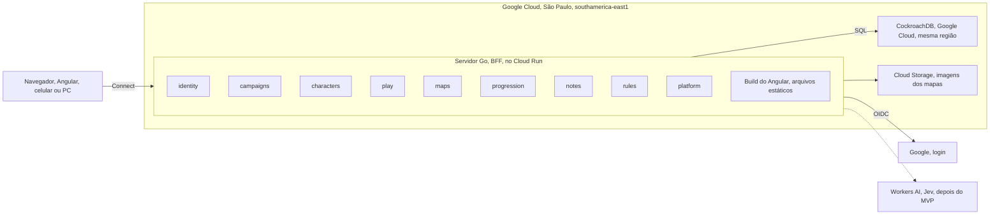
```mermaid
flowchart LR
    Nav["Navegador, Angular, celular ou PC"]

    subgraph GCP["Google Cloud, São Paulo, southamerica-east1"]
        subgraph BFF["Servidor Go, BFF, no Cloud Run"]
            identity["identity"]
            campaigns["campaigns"]
            characters["characters"]
            play["play"]
            maps["maps"]
            progression["progression"]
            notes["notes"]
            rules["rules"]
            platform["platform"]
            AngularBuild["Build do Angular, arquivos estáticos"]
        end
        DB["CockroachDB, Google Cloud, mesma região"]
        Storage["Cloud Storage, imagens dos mapas"]
    end

    GoogleLogin["Google, login"]
    WorkersAI["Workers AI, Jev, depois do MVP"]

    Nav -->|"Connect"| BFF
    BFF -->|"SQL"| DB
    BFF --> Storage
    BFF -->|"OIDC"| GoogleLogin

    BFF -.-> WorkersAI
```

A linha tracejada é futura: o Jev (Workers AI) só entra depois do MVP. O app antigo (Angular em `src/`, NestJS em `server/`, GitHub Pages e Render) não faz parte deste diagrama porque está descontinuado. O `src/` fica no repositório só como referência até sair num PR à parte; o `server/` (NestJS) será removido do repositório (decidido pelo Samuel em 29/09/2026, ver [App antigo](app-antigo.md)).

Os fluxos de quem pode mexer na ficha e de como o jogador entra na sessão ficam em [Regras de negócio → Fluxos e estados](produto/regras.md#fluxos-e-estados), porque são regra de negócio, não peça de infraestrutura.

## Contratos de API (Protobuf)

Toda chamada da API nasce num arquivo `.proto`. O `buf generate` gera o código Go e o TypeScript, e o CI recusa um PR que quebra o contrato. Foi um desencontro de contrato entre o Angular e o NestJS que causou o erro 400 ao salvar fichas.

Regras:

1. Um pacote por módulo e versão: `meurpg.<módulo>.v1`, em `proto/meurpg/<módulo>/v1/`.
2. Um serviço por módulo, em regra. Um assunto à parte dentro do módulo pode ter um serviço próprio, no mesmo pacote: o `campaigns` tem o `CampaignService` e o `CampaignDocumentService`, do [documento da campanha](#documento-da-campanha). Cada chamada tem o seu par `XxxRequest` e `XxxResponse`, mesmo vazio, como o `buf lint` pede.
3. O número de um campo nunca muda nem é reaproveitado. Campo removido vira `reserved`.
4. Mudança que quebra o contrato vira um pacote `v2`. O `buf breaking` compara cada PR com a `main`.
5. O código gerado fica no repositório. O CI roda `buf generate` de novo e falha se aparecer diferença.
6. Campos em `snake_case` no `.proto`; o TypeScript gerado usa `camelCase` sozinho.
7. Chamada só de leitura leva um nível de idempotência, e qual depende da requisição (decidido por Vinicius em 29/09/2026):
   - **Requisição sem ID e sem dado pessoal** (vazia, como `GetMe`, `ListMyCampaigns`, `ListOpenGameSessions` e `GetServerInfo`): `idempotency_level = NO_SIDE_EFFECTS`. O Connect passa a aceitar GET, que o navegador pode guardar em cache.
   - **Requisição com ID ou dado pessoal** (como `GetCampaign`, `ListMembers`, `ListInvites`, `GetCampaignDocument`, `GetCharacter`, `ListCharacters`, `GetMasterNotes`, `ListContent`, `GetSpellDetails`, `ListGameSessions` e `GetLiveSession`): `idempotency_level = IDEMPOTENT`. Fica documentada como leitura e segura para repetir, mas só aceita POST: num GET, a mensagem inteira vai na URL, e a URL fica nos logs da plataforma (ver [Privacidade](privacidade.md)).
   - O teste `TestConnectGETOnlyForRequestsWithoutData` (`backend/cmd/api`) falha se um método `NO_SIDE_EFFECTS` tiver requisição com campo.
8. Os nomes seguem o Google AIP (decidido por Vinicius em 29/09/2026):
   - **Métodos padrão** começam com `Get`, `List`, `Create`, `Update` ou `Delete` mais o recurso (AIP-131 a AIP-135): `GetCampaign`, `ListMembers`, `CreateInvite`.
   - **Métodos customizados** começam com o verbo da ação (AIP-136): `AcceptInvite`, `RevokeInvite`.
   - **Busca com filtro**, quando existir, vira `Search<Recurso>`, como `SearchCampaigns`: é o equivalente em RPC do `:search` do AIP-136. Leva `IDEMPOTENT`, porque a requisição carrega o filtro.
   - Nome que já existe não muda: renomear uma RPC quebra o contrato (regra 4).

O primeiro contrato, da Etapa 1, só prova que o caminho todo funciona:

```protobuf
syntax = "proto3";

package meurpg.system.v1;

// SystemService exposes build and runtime information.
service SystemService {
  rpc GetServerInfo(GetServerInfoRequest) returns (GetServerInfoResponse) {
    option idempotency_level = NO_SIDE_EFFECTS;
  }
}

message GetServerInfoRequest {}

message GetServerInfoResponse {
  string version = 1;
  string commit = 2;
}
```

Como o Connect aceita JSON, dá para chamar com `curl`:

```bash
curl -s -X POST http://localhost:8080/meurpg.system.v1.SystemService/GetServerInfo \
  -H 'Content-Type: application/json' -H 'Connect-Protocol-Version: 1' -d '{}'
```

### Códigos de erro

Cada regra de negócio recusada devolve um código de erro do Connect, sempre o mesmo para o mesmo caso.

| Código | Quando |
| --- | --- |
| `unauthenticated` | Sem sessão de login válida. |
| `permission_denied` | O usuário é membro da campanha, mas não tem o papel: um jogador tenta uma ação de mestre. |
| `failed_precondition` | A regra não deixa agora: ficha travada (RN-01), sessão que não começou, convite expirado, imagem usada num mapa. Vem com um detalhe que diz o motivo, quando há mais de um (`InviteUnusable`, `CharacterBlocked`, `GameSessionBlocked`, `XPBlocked`), ou o que a tela precisa mostrar (`ImageInUse`, com os mapas que usam a imagem). |
| `not_found` | Não existe, ou o usuário não pode saber que existe: um mapa escondido para o jogador, ou uma campanha da qual ele não é membro (ADR-0011). O membro pendente (RN-15) recebe o mesmo `not_found` fora das poucas chamadas que ele pode fazer. |
| `invalid_argument` | Entrada inválida, como um atributo acima de 30. |
| `resource_exhausted` | Um limite da campanha acabou: a galeria cheia (300 imagens ou 500 MB, MR-019), 200 mapas na campanha ou 200 pontos num mapa. |
| `aborted` | Conflito de transação (`40001`) que continuou depois das novas tentativas, ou uma ficha ou um documento da campanha que mudou desde que o app o leu (revisão velha, AIP-154). O app recarrega e a pessoa tenta de novo. |

## Frontend (web/)

O `web/` é o app Angular novo (o `src/` antigo está depreciado). O Go serve o build dele na mesma origem da API, como a linha "Frontend" da tabela de decisões explica.

- **Como é servido:** `backend/internal/platform/httpserver.NewStatic` serve `index.html` e os assets com hash a partir de `WEB_DIR` (`/app/web` na imagem, configurável). Sem `WEB_DIR` válido, o servidor sobe só com a API e registra uma linha de log — não é erro fatal, é o caso normal fora da imagem Docker (`make run` no host, por exemplo). Rota desconhecida (não é `/meurpg.*`, `/auth/*`, `/healthz` nem `/readyz`) cai no `index.html`, para o roteador do Angular assumir (SPA fallback); as quatro exceções viram 404 puro, nunca a página.
- **Cache:** asset com hash no nome (todo mundo, graças a `outputHashing: "all"`) leva `Cache-Control: public, max-age=31536000, immutable`. O `index.html` leva `no-cache`, sempre.
- **CSP:** `default-src 'self'`; `form-action` é `'self'` mais a origem do provedor de login (ver o fluxo do convite abaixo); sem exceção nenhuma em `script-src` (o build de produção não usa `<script>` nem atributo de evento inline — checado no HTML gerado e ao vivo, sem violação no console). `style-src` precisa de `'unsafe-inline'`: é o Angular injetando o CSS de cada componente em `<style>` no `<head>`, em tempo de execução, independente de qualquer opção do build — confirmado também ao vivo (sem o `'unsafe-inline'`, o app carrega sem nenhum estilo). Mais detalhes e a opção de trocar isso por nonce por requisição: comentário de `cspHeader` em `static.go`.
- **Codegen:** `proto/buf.gen.yaml` roda `protoc-gen-es` (Connect-ES v2: um plugin só gera mensagens e serviços) como plugin local, do binário em `web/node_modules/.bin`, com `target=ts`, escrevendo em `web/src/gen/` — código gerado e comitado, como o lado Go. `make proto` instala as dependências do `web/` sozinho, se faltarem.
- **Dev:** `cd web && npm start` sobe o Angular com `proxy.conf.json` encaminhando `/meurpg.*`, `/auth` e as sondas para `localhost:8080`.
- **Visual:** os tokens de cor, tipo, espaço e raio são propriedades CSS `--mr-*` em `web/src/styles.scss`, com os tokens de sistema do Angular Material apontados para eles, e as peças comuns (painel, lista, etiqueta, aviso) ficam em `web/src/styles/_ui.scss`. O que cada um significa e como uma tela é desenhada e revisada: [Design](design.md).
- **Fontes:** Alegreya e Alegreya Sans (licença OFL), dos pacotes `@fontsource/alegreya` e `@fontsource/alegreya-sans`, só o subconjunto latino em woff2, declaradas em `web/src/styles.scss` e servidas pelo próprio Go, como os ícones abaixo. A licença de cada uma está no `NOTICE` e em `third_party/licenses/`.
- **Ícones:** quando a tela precisa de um ícone, é a fonte Material Symbols auto-hospedada (pacote `@material-symbols/font-400`, copiado para o build por uma entrada `assets` do `angular.json` e servido pelo próprio Go) — nunca o Google Fonts, que o `font-src 'self'` do CSP bloqueia e que `docs/privacidade.md` proíbe.

### Estado de sessão e o fluxo de entrar/sair

Um `AuthService` (`web/src/app/core/auth/auth.service.ts`) chama `IdentityService.GetMe` uma vez, na inicialização — na prática assim que o menu de conta da barra de navegação, sempre presente, injeta o serviço — e guarda o resultado num signal com quatro estados:

| Estado | Quando |
| --- | --- |
| `unknown` | O `GetMe` ainda não voltou. |
| `signed-out` | O `GetMe` respondeu com o código `unauthenticated`. |
| `signed-in` | O `GetMe` respondeu com o usuário e `sessionExpiresAt`. |
| `unavailable` | Qualquer outro código do Connect, ou uma falha de rede. Nunca vira `signed-out`: um servidor ou banco fora do ar não pode parecer um usuário deslogado. |

O transporte Connect único do app (`web/src/app/core/connect/transport.ts`) força `credentials: 'same-origin'` no `fetch`, para o cookie de sessão ir em toda chamada, e já recebe `Connect-Protocol-Version: 1` em toda chamada unária por padrão do `@connectrpc/connect` (ver [CSRF](#csrf)) — nada a configurar para isso.

Entrar é sempre uma navegação de página inteira para `/auth/login?return_to=<caminho atual>`, nunca uma rota Angular: é o servidor quem conduz o fluxo OIDC (ver [Módulo identity](#módulo-identity-login-e-sessão) abaixo). `authGuard` (`web/src/app/core/auth/auth.guard.ts`) protege rotas que precisam de sessão, como "Minhas campanhas": deixa passar se `signed-in`; manda para o login, com `return_to`, se `signed-out`; e redireciona para a página "servidor indisponível" (mantendo o caminho pedido em `return_to`, para "Tentar de novo" voltar direto para lá) se `unavailable`, em vez de tratar como se a pessoa tivesse saído. Depois do callback do servidor, o navegador já volta em `return_to`, então não há nada para o cliente interpretar.

Sair chama `IdentityService.SignOut` e sempre volta para a página inicial com uma navegação de página inteira — mesmo se a chamada falhar, porque um "Sair" que falha silenciosamente é pior do que um cookie que uma tentativa futura de `GetMe` corrige.

### Nenhum dado no navegador além do cookie de sessão

Regra do Vinicius, sem exceção: nada no `web/` lê nem grava `localStorage`, `sessionStorage`, IndexedDB, nem grava cookie pelo JavaScript, nem usa Worker para guardar token ou dado pessoal. O único lugar onde a sessão mora é o cookie `__Host-meurpg_session`, `HttpOnly` — o próprio JavaScript do app nunca o lê nem o escreve; quem faz login e logout é sempre uma navegação de página inteira para o servidor (`AuthService.signIn`/`signOut`, acima), nunca `fetch` guardando algo no navegador. O token do convite (abaixo) também nunca toca em armazenamento algum: vive só num campo do componente, na memória.

`web/src/no-web-storage.spec.ts` é a trava automática: varre todo `.ts`/`.html` de `web/src` (fora `gen/` e specs) atrás de `localStorage`, `sessionStorage`, `indexedDB`, `document.cookie =` e `new Worker`/`new SharedWorker`, e falha o teste se algum aparecer. Ver [Privacidade](privacidade.md).

**Por que nada fica no navegador.** O padrão BFF (tabela de decisões, acima) é o que a diretriz do IETF para OAuth em aplicações no navegador ("OAuth 2.0 for Browser-Based Applications") classifica como a opção mais forte: os tokens do OIDC ficam só no servidor, e o navegador só tem o cookie de sessão `__Host-`, `HttpOnly`, que o JavaScript não lê. Guardar token num Web Worker é a mitigação recomendada só para quem precisa mesmo guardar token no navegador — e mesmo assim um XSS ainda consegue usar o worker como proxy; não é o nosso caso, porque nenhum token OIDC chega ao navegador. O token do convite também não fica ali: vai no corpo do `POST /auth/login`, e o servidor guarda só o hash dele, no estado de login de uso único e 10 minutos; um worker não sobreviveria à navegação até o provedor de qualquer forma. Se um dia o navegador precisar chamar uma API de terceiro direto, o padrão do worker é o plano para esse token.

### Telas de campanhas, convite e perfil

MR-001, MR-002 e MR-003 (ver [Histórias](produto/historias.md)) ficam em `web/src/app/pages/`, todas carregadas por rota lazy (`loadComponent`), sobre o `CampaignService` gerado (`web/src/app/core/campaigns/campaigns.service.ts`):

| Rota | Tela | Guarda |
| --- | --- | --- |
| `/campanhas` | `ListMyCampaigns`, com o papel (mestre/jogador) de cada uma, ou "esperando a aprovação do mestre" para o membro pendente (RN-15); formulário "Nova campanha" (nome, modo de XP) que leva à campanha criada | `authGuard` |
| `/campanhas/:id` | `GetCampaign` + `ListMembers`; para o mestre, a seção "Convites" (criar, com a opção "Exigir aprovação do mestre", listar com status, revogar). Para o membro pendente, só `GetCampaign` (que traz só o nome): o aviso "Esperando a aprovação do mestre" e o próprio personagem, sem pedir os membros | `authGuard` |
| `/convite` | Aceita um convite pelo token no fragmento da URL (abaixo) | Pública — trata os dois casos, logado e deslogado |
| `/convite/erro` | Mensagem por código (`motivo`), depois do fluxo de login pelo convite | Pública |
| `/perfil` | "Meu perfil": muda o nome de exibição (`IdentityService.UpdateProfile`) | `authGuard` |

Erros do Connect viram mensagem em português por um mapa `Código → texto` (`web/src/app/core/connect/connect-errors.ts`), com um caso especial para `AcceptInvite`: seu `failed_precondition` carrega o detalhe `InviteUnusable`, e `web/src/app/core/campaigns/invite-errors.ts` lê `state` dele para dizer exatamente por quê (expirado, revogado, já usado). Uma campanha da qual o usuário não é membro, e uma que não existe, chegam como o mesmo `not_found` (ADR-0011) e viram a mesma tela "campanha não encontrada" — o app nunca tenta adivinhar a diferença.

**O fluxo do convite, do lado do navegador** (`web/src/app/pages/invite/invite-accept.ts`):

1. Ao abrir `/convite#t=<token>`, o componente lê o token de `location.hash` no construtor e chama `history.replaceState` **imediatamente**, antes de qualquer outra coisa — a URL visível nunca mostra o token depois desse primeiro instante. O token fica só num campo privado do componente, na memória (ver "Nenhum dado no navegador", acima); nunca vira parâmetro de rota, query string, nem toca em armazenamento algum.
2. Sem token, mostra "link de convite inválido".
3. Com token e sessão ativa, chama `AcceptInvite` direto: sucesso (inclusive `already_member`) navega para `/campanhas/<id>`; convite inutilizável mostra a mensagem específica de `invite-errors.ts`. Num convite com aprovação (RN-15, MR-024), quem acabou de virar membro pendente (`awaiting_approval` e não `already_member`) vai direto para `/campanhas/<id>/personagens/novo`, criar o personagem que o mestre vai aprovar.
4. Com token e sem sessão, mostra "Entrar para aceitar o convite". O clique monta e envia um `<form method="post" action="/auth/login">` oculto, com `return_to=/campanhas`, `intent=campaign_invite` e `intent_payload=<token>` — esse é o contrato com o servidor (módulo `identity`): ele aceita o convite depois do login e redireciona para `/campanhas/<id>` (ou `/campanhas/<id>/personagens/novo`, para quem acabou de virar membro pendente), ou para `/convite/erro?motivo=<código>`, com `<código>` entre `expired`, `revoked`, `used_up`, `not_found`, `invalid` e `unavailable` (o banco falhou ao aceitar). O botão "Entrar" do menu nunca leva o fragmento para o `return_to`: o `AuthService.signIn` corta tudo a partir do `#`, e o servidor também descarta fragmentos. É um POST de mesma origem para `/auth/login`, e o servidor responde com um 303 para o provedor. O navegador confere o `form-action` do CSP em cada passo desse redirecionamento, então o CSP lista, além de `'self'`, a origem do provedor configurado em `OIDC_ISSUER` (`WithFormActionOrigin` em `backend/internal/platform/httpserver/static.go`); sem isso, o botão não sai da página.

### Testes

Unitários (Vitest, `web/src/**/*.spec.ts`) cobrem o mapeamento de erros, o corte do fragmento (`replaceState` chamado, nada de armazenamento tocado), os campos do formulário do fluxo deslogado e, para o convite com aprovação (MR-024), a caixa "Exigir aprovação do mestre", o destino de quem acabou de virar membro pendente, o aviso "Esperando a aprovação do mestre", a lista "Esperando aprovação" do mestre e os botões "Aprovar personagem" e "Recusar personagem". Ponta a ponta (Playwright, tags `@MR-001`/`@MR-002`/`@MR-003`/`@MR-024`) ficam em `e2e/tests/campaigns.spec.ts`, `e2e/tests/invite.spec.ts` (inclusive o caminho de login pelo convite, item 4 acima) e `e2e/tests/character-approval.spec.ts`.

## Módulo identity: login e sessão

O mestre entra por um provedor OpenID Connect (OIDC) com Authorization Code + PKCE, e o servidor abre uma sessão opaca de no máximo 30 dias, guardada num cookie `__Host-` `HttpOnly` (ADR-0002). O código fica em `backend/internal/identity` e não conhece nenhum provedor: em produção é o Google, em desenvolvimento um provedor OIDC local ou um provedor falso dos testes. Tudo vem da configuração (ver [CONTRIBUTING.md](../CONTRIBUTING.md#login-local-com-um-provedor-oidc)) e da descoberta OIDC (`/.well-known/openid-configuration`).

| Rota | O que faz |
| --- | --- |
| `GET /auth/login?return_to=/caminho` | Guarda o estado do login e manda o navegador para o provedor. `return_to` só aceita um caminho deste site; um fragmento (`#...`) é descartado. |
| `POST /auth/login` | O mesmo, a partir de um formulário do app, com uma **intenção de login** opcional (`intent` e `intent_payload`): algo que o servidor conclui logo depois do login, como aceitar um convite. Ver [Aceitar o convite pelo login](#aceitar-o-convite-pelo-login). |
| `GET /auth/callback` | Confere tudo, cria a sessão, grava o cookie, conclui a intenção, se houver, e volta para `return_to` (ou para onde a intenção mandar). |
| `IdentityService.GetMe` | Quem está logado (o ID da conta e o nome de exibição) e quando a sessão acaba. Aceita GET, porque a requisição é vazia. |
| `IdentityService.SignOut` | Revoga a sessão atual no banco e apaga o cookie. As outras sessões do usuário continuam. |
| `IdentityService.UpdateProfile` | Muda o nome de exibição (vazio apaga). O `GetMe` também devolve esse nome. |

### Diagrama: o login

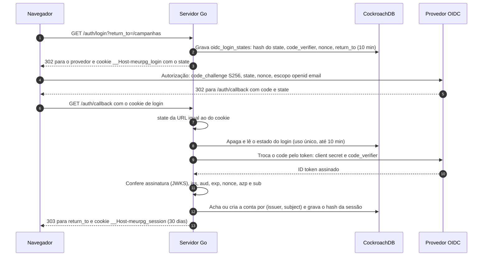
```mermaid
sequenceDiagram
    autonumber
    participant N as Navegador
    participant S as Servidor Go
    participant B as CockroachDB
    participant P as Provedor OIDC

    N->>S: GET /auth/login?return_to=/campanhas
    S->>B: Grava oidc_login_states: hash do state, code_verifier, nonce, return_to (10 min)
    S-->>N: 302 para o provedor e cookie __Host-meurpg_login com o state
    N->>P: Autorização: code_challenge S256, state, nonce, escopo openid email
    P-->>N: 302 para /auth/callback com code e state
    N->>S: GET /auth/callback com o cookie de login
    S->>S: state da URL igual ao do cookie
    S->>B: Apaga e lê o estado do login (uso único, até 10 min)
    S->>P: Troca o code pelo token: client secret e code_verifier
    P-->>S: ID token assinado
    S->>S: Confere assinatura (JWKS), iss, aud, exp, nonce, azp e sub
    S->>B: Acha ou cria a conta por (issuer, subject) e grava o hash da sessão
    S-->>N: 303 para return_to e cookie __Host-meurpg_session (30 dias)
```

O callback recusa com 400, sem criar sessão, quando: falta o cookie de login ou o `state` não bate com ele; o estado não existe, já foi usado ou passou de 10 minutos; o provedor devolveu erro; a troca do `code` falhou (inclusive por PKCE); ou o ID token falha em qualquer conferência. O `aud` precisa ser só o nosso client ID, e o `azp`, quando vem, também.

### Sessão

- **Token:** 32 bytes aleatórios (`crypto/rand`) no cookie `__Host-meurpg_session`, com `Secure`, `HttpOnly`, `SameSite=Lax` e `Path=/`. O banco guarda só o SHA-256 (`auth_sessions.token_hash`).
- **Validade:** 30 dias corridos desde o login, sem renovar com o uso (NIST SP 800-63B-4, AAL1). Depois disso, o mestre passa pelo provedor de novo.
- **`auth_time` e `max_age`:** o servidor manda `max_age` só se `OIDC_MAX_AGE` estiver definido (o Google não documenta o parâmetro). O `auth_time` do ID token, quando vem, é só registrado em `auth_sessions.auth_time`, nunca usado para decidir: num provedor local de teste ele manteve a hora do primeiro login mesmo depois de um login forçado. No ambiente local, o devidp recebe `OIDC_MAX_AGE=1h`; com o Google, a variável fica sem valor. Quem cumpre a reautenticação a cada 30 dias (NIST SP 800-63B-4) é a sessão de 30 dias no servidor, não o `max_age`.
- **Logout:** apaga a linha da sessão, então o token para de valer na hora, em qualquer instância. Um stream da sessão ao vivo já aberto termina na checagem seguinte, em até 60 segundos (ver [Sessão ao vivo](#sessão-ao-vivo)).
- **Login de novo no mesmo navegador:** gera outro token (nada de reaproveitar o antigo) e revoga a sessão anterior.

Outros módulos descobrem quem chama pela interface descrita em [Quem está chamando](#quem-está-chamando), logo abaixo.

### Quem está chamando

A sessão só entra no contexto de uma requisição pelo `identity`, depois de conferir o cookie no banco: o interceptor, nas chamadas Connect, e o `AuthenticateRequest`, o mesmo passo para as poucas rotas HTTP comuns (enviar e baixar imagens, ver [Módulo maps](#módulo-maps-galeria-e-imagens)). Os dois só leem o cookie da requisição. Nenhuma função exportada põe uma sessão, ou um usuário qualquer, no contexto (decidido por Vinicius em 29/09/2026).

- **Os outros módulos recebem quem chama por uma interface,** `authz.Caller` (`UserID(ctx) (string, error)`). O `identity.Service` implementa lendo a chave privada que o interceptor dele preencheu, e o `cmd/api/main.go` liga as duas pontas. Sem sessão válida, a resposta é `unauthenticated`; se o banco não responde, o interceptor devolve `unavailable`, para o app não achar que o usuário saiu.
- **Nos handlers, a pergunta passa pelo `authz`:** `authz.RequireSignedIn(ctx)` quando basta estar logado, `authz.RequireCampaignMember` ou `authz.RequireCampaignRole` quando é sobre uma campanha. O `campaigns` monta o serviço com `Mount(handle, sessions, ...)`, em que `sessions` é o interceptor mais o `Caller` (o próprio `identity.Service` em produção). Numa rota HTTP comum, o `authz.Middleware` faz o papel do `authz.Interceptor`: as mesmas checagens, com um memo por requisição. Nenhuma rota está em `pendingMayCall`, então o membro pendente fica de fora.
- **Os testes dos outros módulos usam um `Caller` falso** (um mock), em vez de fabricar uma sessão. O mock só existe nos arquivos `_test.go` daquele módulo.
- **O `identity.Store` também fecha essa porta:** os métodos de sessão e de estado do login são não exportados, então nenhum outro pacote cria ou consulta uma sessão, nem implementa um `Store` falso que invente uma.
- **A intenção de login também:** o `IntentHandler.Complete` recebe o usuário como `identity.SignedIn`, que só o callback do `identity` preenche (ver [Aceitar o convite pelo login](#aceitar-o-convite-pelo-login)).

Assim, um erro num módulo novo não vira um jeito de se passar por outra pessoa: para ter um usuário no contexto, a requisição precisa de um cookie de sessão válido.

### CSRF

A proteção vem em camadas, como a ADR-0009 descreve:

| Camada | O que barra |
| --- | --- |
| Cookie `SameSite=Lax` | O navegador não manda o cookie em POST nem em `fetch` vindos de outro site. |
| `http.CrossOriginProtection` em volta do mux | Recusa com 403 um POST (ou PUT, DELETE) de outra origem, pelo `Sec-Fetch-Site` ou comparando `Origin` com `Host`. GET sempre passa, então nenhum GET pode mudar estado sem proteção própria. |
| `connect.WithRequireConnectProtocolHeader()` em todo serviço | Toda chamada unária do Connect exige o header `Connect-Protocol-Version: 1` (ou `connect=v1` na URL de um GET). Outro site só mandaria esse header depois de um preflight de CORS, que o servidor não aceita. |
| `state` no cookie de login, PKCE e `nonce` | Protegem o `GET /auth/callback`, que cria a sessão mesmo sendo GET. Ninguém consegue fazer o navegador da vítima terminar um login começado por outra pessoa. |

Por causa do header obrigatório, um `curl` numa chamada Connect precisa de `-H 'Connect-Protocol-Version: 1'`.

O envio de imagens (`POST /uploads/images`) não é Connect, então o header do protocolo não vale para ele. Quem o protege é o `http.CrossOriginProtection`, que fica em volta de todas as rotas, e o cookie `SameSite=Lax`. O teste `TestCrossSiteUploadsAreRefused` confere que um envio de outro site recebe 403 e não grava nada.

### Limite de tentativas no login

`/auth/login` grava uma linha em `oidc_login_states` a cada chamada, então tem um limite, em memória, antes de qualquer outra coisa. O `GET` e o `POST` dividem o mesmo limite. Passou do limite, a resposta é `429 Too Many Requests` com `Retry-After` (em segundos), sem gravar nada.

| Limite | Valor | Por quê |
| --- | --- | --- |
| Por IP do cliente | 20 de uma vez, depois 1 a cada 3 s (20 por minuto) | Folga para uma mesa inteira no mesmo Wi-Fi; um cliente sozinho não enche a tabela. |
| Geral | 200 de uma vez, depois 2 por segundo (120 por minuto) | Limita o que uma botnet grava: no máximo 7.200 linhas por hora por instância, que o TTL apaga na hora seguinte. |

- O limite de cada cliente é conferido antes do geral, então um cliente acima do próprio limite não gasta a cota de todo mundo. IPv6 conta por `/64`.
- Os contadores ficam na memória de cada instância: com N instâncias no Cloud Run, o limite efetivo é até N vezes maior. Uma tabela de no máximo 10 mil clientes evita que endereços novos esgotem a memória; um cliente parado some da tabela em até 2 minutos, mesmo que nenhuma requisição nova chegue.
- **De onde vem o IP.** Localmente, da conexão (`RemoteAddr`); `X-Forwarded-For` é ignorado, porque qualquer cliente manda o que quiser nele. No Cloud Run (a variável `K_SERVICE` existe), toda requisição passa pelo front end do Google, e o IP do cliente vem do **último** item do `X-Forwarded-For`: o Google acrescenta o endereço de quem se conectou a ele depois do que o cliente mandou, e não confere o que vem antes. A fonte (documentação do Google Cloud) e o que muda se um dia houver um load balancer na frente estão no comentário de `ratelimit.ClientKey`, em `backend/internal/platform/ratelimit`.
- O IP não vai para o log (ver [Privacidade](privacidade.md)).

### Sem provedor ou sem banco

O servidor sobe mesmo sem `OIDC_ISSUER` ou sem `DATABASE_URL`: o log de início avisa que o login está desligado, `/auth/login` e `/auth/callback` respondem 503 e o `IdentityService` responde `unavailable`. Se o provedor estiver fora do ar quando o servidor sobe, a descoberta é tentada de novo no próximo login.

## Testes e o provedor de desenvolvimento

Os testes rodam em três camadas, e nenhuma depende de um provedor de identidade de fora:

| Camada | Onde | Provedor OIDC | No CI |
| --- | --- | --- | --- |
| Unitário e fluxo em Go | `go test` em `backend/` | O provedor de `internal/identity/oidctest`, dentro do próprio teste (HTTPS com `httptest`), que loga o usuário na hora e deixa o teste quebrar uma coisa de cada vez: claims, chave de assinatura, descoberta | Job `go` |
| Integração em Go | `go test` com `MEURPG_TEST_DATABASE_URL` | O mesmo, com o CockroachDB de verdade atrás | Job `go-db` (CockroachDB com `docker run`) |
| Ponta a ponta | Playwright em `e2e/`, contra o `docker compose` | **devidp** (`backend/cmd/devidp`): o mesmo `oidctest`, servido com uma página que lista os usuários de teste | Workflow `e2e` |

O devidp implementa só o que o login precisa, com rigor: descoberta, JWKS com uma chave RSA gerada ao subir, `/authorize` com PKCE S256 obrigatório, `state` e `nonce`, `/token` para um client confidencial, ID token RS256 com `email`, `email_verified` e `auth_time`, e `max_age` e `prompt` medidos contra a própria sessão dele. Ele nunca vai para produção: a imagem dele é outra, ele só aceita issuer em host de loopback e não sobe no Cloud Run (detalhes e usuários de teste no [CONTRIBUTING.md](../CONTRIBUTING.md#login-local-com-o-devidp)).

### Diagrama: o login no ambiente local

O issuer é `http://idp.localhost:9090` para os dois lados. O navegador resolve qualquer `*.localhost` para `127.0.0.1` sozinho (RFC 6761) e chega ao devidp pela porta publicada. O container da API chega ao mesmo nome pelo alias de rede `idp.localhost`, que o Docker resolve para o container do devidp. Com a mesma string dos dois lados, o `iss` do ID token bate com o `OIDC_ISSUER`. A configuração aceita `http` num nome `*.localhost` pelo mesmo motivo.

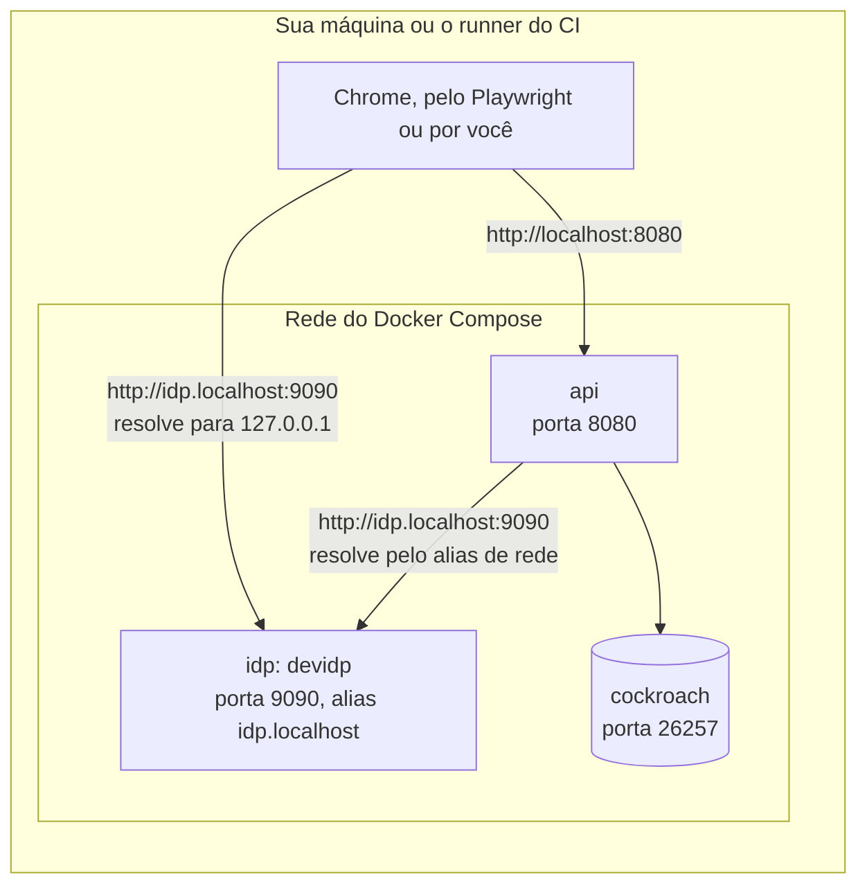
```mermaid
flowchart LR
    subgraph Host["Sua máquina ou o runner do CI"]
        Nav["Chrome, pelo Playwright ou por você"]
        subgraph Rede["Rede do Docker Compose"]
            API["api<br/>porta 8080"]
            IDP["idp: devidp<br/>porta 9090, alias idp.localhost"]
            DB[("cockroach<br/>porta 26257")]
        end
    end

    Nav -->|"http://localhost:8080"| API
    Nav -->|"http://idp.localhost:9090<br/>resolve para 127.0.0.1"| IDP
    API -->|"http://idp.localhost:9090<br/>resolve pelo alias de rede"| IDP
    API --> DB
```

O cookie `__Host-meurpg_session` exige `Secure`, e mesmo assim funciona em `http://localhost`: o Chrome trata `localhost` como contexto seguro. Um teste Playwright confere isso no navegador. O Safari não aceita, então o login local é no Chrome ou no Firefox.

## Módulo campaigns e autorização

O mestre cria a campanha e gera convites; o jogador faz login e aceita o convite, e vira jogador da campanha (MR-001, MR-002, MR-003). O código fica em `backend/internal/campaigns`, e quem decide o que cada um pode fazer é o pacote `backend/internal/authz` (ADR-0011: papéis por campanha, conferidos no banco a cada requisição).

| Chamada | Quem pode |
| --- | --- |
| `CreateCampaign`, `ListMyCampaigns`, `AcceptInvite` | Qualquer pessoa logada. `ListMyCampaigns` também lista as campanhas em que a pessoa é membro pendente, só com o nome |
| `GetCampaign` | Membros da campanha; o membro pendente (RN-15) também, e recebe só o nome e `awaiting_approval` |
| `ListMembers` | Membros da campanha. O membro pendente não aparece na lista e recebe `not_found` |
| `CreateInvite`, `ListInvites`, `RevokeInvite` | O mestre da campanha |
| `SetCampaignDiceMode` | O mestre da campanha (RN-18, ver [Dados da campanha](#dados-da-campanha)) |
| `SetMyDicePreference` | Membros da campanha, o mestre também; o membro pendente recebe `not_found` |
| `ListPendingMembers`, `RemovePendingMember` | O mestre da campanha. Listam e removem os membros pendentes que ainda não criaram o personagem (RN-15, pergunta 24); não são `ListMembers` de propósito, porque essas pessoas não são membros. Quem já criou o personagem se aprova ou se recusa pelo `CharacterService` |
| `CampaignDocumentService`: `GetCampaignDocument`, `UpdateCampaignDocument` | O mestre da campanha (ver [Documento da campanha](#documento-da-campanha)) |

### Autorização

O papel é por campanha (RN-05): a linha em `campaign_members` diz se a pessoa é `master` ou `player` naquela campanha. Não existe papel global, nem papel guardado em token.

- **O banco decide, a cada requisição.** Tirar alguém da campanha vale na chamada seguinte, sem esperar nada vencer.
- **Uma checagem explícita no começo de cada handler:** `authz.RequireCampaignMember(ctx, id)` para qualquer membro, `authz.RequireCampaignRole(ctx, id, authz.RoleMaster)` só para o mestre, ou só `authz.RequireSignedIn(ctx)` quando basta estar logado. As poucas chamadas que o membro pendente pode fazer usam `authz.RequireCampaignMemberOrPending(ctx, id)` (ver [Membro pendente](#membro-pendente)). Quem está chamando vem do `identity`, pela interface `authz.Caller` (ver [Quem está chamando](#quem-está-chamando)).
- **Uma leitura por campanha, por requisição.** O `authz.Interceptor` dá a cada requisição um memo novo, e o memo acaba com ela.
- **O stream confere de novo.** Um stream (`WatchGameSession`) dura minutos, e o memo dele duraria o mesmo tanto. Por isso o handler chama `authz.RecheckCampaignMember` a cada 60 segundos: ela lê de novo a sessão de login (`identity.Service.RecheckSession`, pela interface `authz.SessionRechecker`) e a participação, sem o memo, e o stream termina com o mesmo erro que uma chamada nova receberia (`unauthenticated` ou `not_found`). Sem um `Caller` que saiba conferir a sessão de novo, a checagem falha (`internal`).
- **Sem o interceptor, a checagem falha** (`internal`), nunca libera.

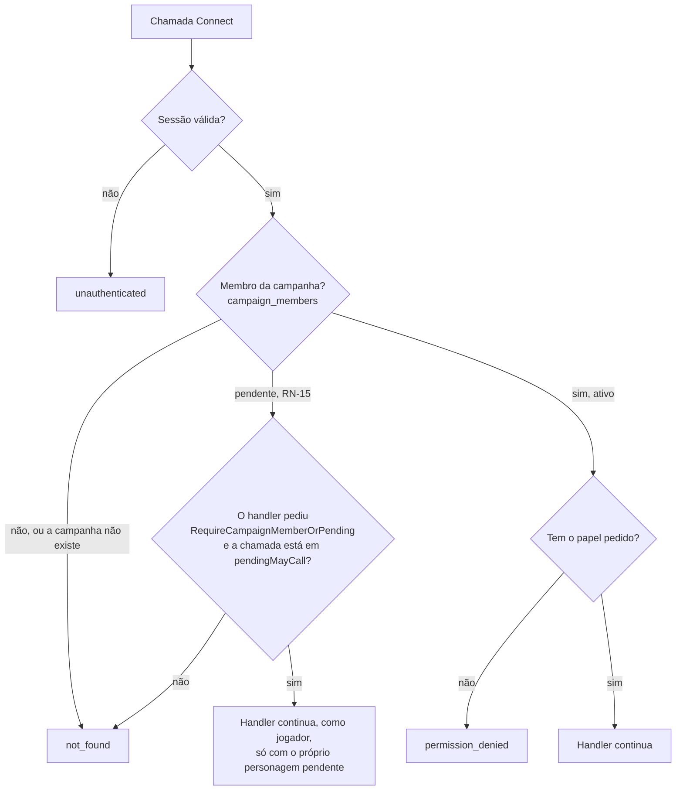
```mermaid
flowchart TD
    A["Chamada Connect"] --> B{"Sessão válida?"}
    B -->|"não"| U["unauthenticated"]
    B -->|"sim"| C{"Membro da campanha?<br/>campaign_members"}
    C -->|"não, ou a campanha não existe"| N["not_found"]
    C -->|"pendente, RN-15"| Q{"O handler pediu<br/>RequireCampaignMemberOrPending<br/>e a chamada está em pendingMayCall?"}
    Q -->|"não"| N
    Q -->|"sim"| J["Handler continua, como jogador,<br/>só com o próprio personagem pendente"]
    C -->|"sim, ativo"| D{"Tem o papel pedido?"}
    D -->|"não"| P["permission_denied"]
    D -->|"sim"| OK["Handler continua"]
```

Quem não é membro recebe `not_found` tanto para uma campanha que existe quanto para uma inventada, com a mesma mensagem. Assim ninguém descobre quais campanhas existem. Um teste chama todo método do `CampaignService` como mestre, jogador, não membro, anônimo e membro pendente (`TestAuthorizationMatrix`), e falha se um método novo aparecer sem linha na tabela; o `CampaignDocumentService` tem o dele (`TestCampaignDocumentAuthorizationMatrix`).

### Membro pendente

O membro pendente é quem aceitou um convite com aprovação (RN-15, MR-024) e espera o mestre aprovar o personagem que criou. Ele não é membro: `campaign_members.status = 'pending'`, e `RequireCampaignMember` e `RequireCampaignRole` respondem a ele exatamente como a quem não está na campanha (`not_found`, a mesma mensagem). Assim, toda chamada que já existe, e toda chamada nova, o deixa de fora sem ninguém precisar lembrar dele.

Um membro pendente que nunca cria o personagem é apagado sozinho 30 dias depois de entrar (TTL do banco sobre `campaign_members.pending_expires_at`, ver [Modelo de dados](dados.md#esquema-implementado)); o mestre o vê e o remove antes com `ListPendingMembers` e `RemovePendingMember`. Se ele aceita um convite comum (sem aprovação) da mesma campanha, `AcceptInvite` o promove na mesma transação: gasta um uso, ativa a participação e aprova o personagem dele, se houver, pela interface `campaigns.Characters`, que o `characters` implementa (`cmd/api` liga os dois com `SetCharacters`, porque os dois módulos se precisam e nenhum importa o outro).

A exceção é uma só, e fica escrita no `authz` (`backend/internal/authz/pending.go`), não espalhada pelos handlers: enquanto espera, ele trabalha no próprio personagem. Para passar, duas travas precisam abrir:

1. O handler pede, chamando `authz.RequireCampaignMemberOrPending` em vez de `RequireCampaignMember`.
2. A chamada está em `pendingMayCall`, a lista fechada do que o membro pendente pode chamar. Se um handler fora da lista pedir mesmo assim, o membro pendente continua recebendo `not_found`, e o erro de programação vai para o log.

| Chamada em `pendingMayCall` | Para quê | O que o handler limita |
| --- | --- | --- |
| `CampaignService.GetCampaign` | Ver o nome da campanha enquanto espera | Só `id`, `name`, `my_role` (jogador) e `awaiting_approval` |
| `CharacterService.CreateCharacter` | Criar o único personagem, que nasce pendente | Só personagem de jogador, e um só (RN-03: o pendente conta como vivo) |
| `CharacterService.GetCharacter`, `ListCharacters` | Ler o próprio personagem | Só o próprio personagem pendente |
| `CharacterService.UpdateCharacter`, `UpdateCharacterStory` | Editar a ficha e a história | Só o próprio personagem pendente |
| `ContentService.ListContent` | O catálogo que o editor de personagem oferece | — |
| `ContentService.GetSpellDetails` | Os detalhes de uma magia, para a lista de magias do editor | — |

Dentro dessas chamadas, o membro pendente é tratado como jogador (`authz` devolve `RolePlayer` e `Membership.Pending`), e o `characters` só mostra a ele os personagens `pending` dele (`canSee`, em `access.go`). `ListMyCampaigns` não precisa de exceção: só pede login, e lista as participações da própria pessoa, pendentes incluídas. Mudar a lista é mudar a RN-15: precisa da decisão, das linhas nas matrizes de autorização (`TestAuthorizationMatrix` de `campaigns` e de `characters` têm uma coluna para o membro pendente) e do teste `TestPendingMayCallIsTheAgreedList`.

O membro pendente deixa de existir de um dos dois jeitos, sempre pelo mestre e sempre na mesma transação que decide o personagem (ver [Módulo characters](#aprovar-ou-recusar-o-personagem)): a aprovação o torna membro ativo (jogador), a recusa apaga a participação.

### Convites

O convite é um link `https://<app>/convite#t=<token>`. O token tem 32 bytes aleatórios e só o servidor o gera; o banco guarda só o SHA-256 dele (`campaign_invites.token_hash`), e o servidor devolve o token uma vez só, na resposta do `CreateInvite`.

- **O token vai no fragmento (`#t=`),** que o navegador nunca manda para o servidor, então não aparece em log nem no `Referer`. O app lê o fragmento e manda o token no corpo do `AcceptInvite`, nunca na URL (ADR-0009).
- **Padrão (RN-07, decidida em 29/09/2026):** vale para uma pessoa e por 7 dias. O mestre pode escolher de 1 a 20 usos e de 5 minutos a 30 dias, e pode revogar o convite a qualquer momento. Quem já entrou continua na campanha.
- **Aceitar exige login** (hoje, OIDC). Quando o login do jogador sem Google chegar (RN-17, ADR-0009), ele cria a conta e a sessão, e a mesma regra de aceitar convite roda depois.
- **Convite com aprovação (RN-15, MR-024, implementado na Etapa 4):** o mestre escolhe, em cada convite, se ele exige aprovação (`CreateInviteRequest.requires_approval`, "Exigir aprovação do mestre" na tela; o padrão é não exigir, e o convite funciona como antes). Quem aceita um convite com aprovação vira [membro pendente](#membro-pendente), gasta um uso do convite, e o app o leva direto para criar o personagem, que nasce pendente. O mestre aprova ou recusa esse personagem (ver [Módulo characters](#aprovar-ou-recusar-o-personagem)); recusado, o jogador precisa de um convite novo.
- **Aceitar de novo não muda nada:** um membro recebe a campanha de volta com `already_member`, e nenhum uso do convite é gasto. Vale para o membro pendente, com qualquer convite da campanha: ele continua pendente.
- **Dois jogadores disputando o último uso não entram os dois.** Tudo acontece numa transação (`db.InTx`), com a linha do convite travada (`SELECT ... FOR UPDATE`); o `UPDATE` repete as regras, e um `CHECK` no banco impede `use_count` maior que `max_uses`. O teste `TestAcceptInviteRaceForTheLastUse` põe dez pessoas ao mesmo tempo no CockroachDB.
- **Convite que não serve** responde `failed_precondition`, com o detalhe `InviteUnusable` dizendo o motivo: expirado, revogado ou já usado. O app mostra uma mensagem clara para cada um. "Já usado" é o aviso de que o link pode ter vazado.

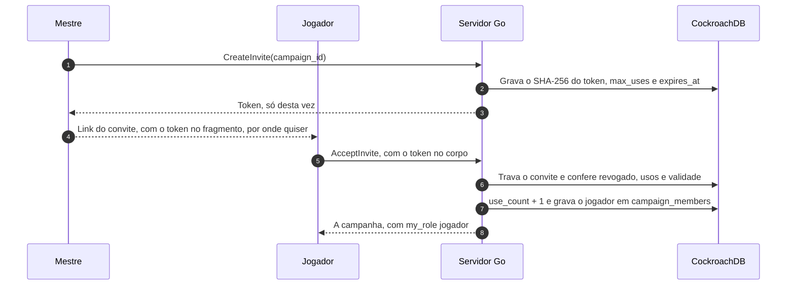
```mermaid
sequenceDiagram
    autonumber
    participant M as Mestre
    participant J as Jogador
    participant S as Servidor Go
    participant B as CockroachDB

    M->>S: CreateInvite(campaign_id)
    S->>B: Grava o SHA-256 do token, max_uses e expires_at
    S-->>M: Token, só desta vez
    M-->>J: Link do convite, com o token no fragmento, por onde quiser
    J->>S: AcceptInvite, com o token no corpo
    S->>B: Trava o convite e confere revogado, usos e validade
    S->>B: use_count + 1 e grava o jogador em campaign_members
    S-->>J: A campanha, com my_role jogador
```

### Aceitar o convite pelo login

Quem abre o link do convite sem estar logado entra e aceita o convite num passo só, e nada fica guardado no navegador: nem `localStorage`, nem `sessionStorage`, nem service worker (decidido por Vinicius em 29/09/2026, ADR-0009). O token vai no corpo do formulário de login, e o servidor guarda só o hash dele, dentro do estado do login, que já é de uso único e dura no máximo 10 minutos.

1. A tela `/convite#t=<token>` lê o token do fragmento e envia um formulário `POST /auth/login` (`application/x-www-form-urlencoded`, da mesma origem) com `return_to`, `intent=campaign_invite` e `intent_payload=<token>`.
2. O `identity` confere o limite de tentativas e o `return_to`, e pede ao `campaigns` para preparar a intenção. O `campaigns` confere o formato do token e devolve o SHA-256 dele. O `identity` grava o hash, com o tipo da intenção, em `oidc_login_states`, e segue o login como sempre.
3. No callback, depois de criar a sessão, o `identity` pede ao `campaigns` para concluir a intenção. O `campaigns` aceita o convite pelo hash, na mesma transação do `AcceptInvite` (`db.InTx`, com a linha do convite travada).
4. O navegador vai para `/campanhas/<campaign_id>`, inclusive quem já era membro. Quem acabou de virar membro pendente, por um convite com aprovação (RN-15), vai para `/campanhas/<campaign_id>/personagens/novo`, criar o personagem. Se o convite não serve, vai para `/convite/erro?motivo=<código>`. O login vale do mesmo jeito: a sessão fica, e só o destino muda.

| `motivo` | Quando |
| --- | --- |
| `expired` | O convite passou da validade. |
| `revoked` | O mestre revogou o convite. |
| `used_up` | Os usos acabaram, talvez com alguém que pegou o link. |
| `not_found` | Nenhum convite tem esse token, ou a campanha foi apagada. |
| `invalid` | O que ficou guardado no login não é um hash de token. Só um bug causa isso. |
| `unavailable` | O banco não respondeu. Abrir o link de novo pode funcionar. |

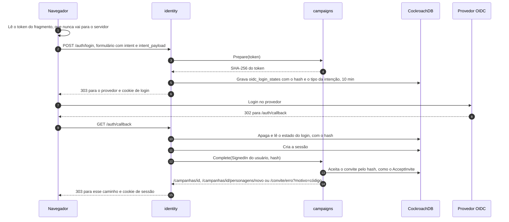
```mermaid
sequenceDiagram
    autonumber
    participant N as Navegador
    participant I as identity
    participant C as campaigns
    participant B as CockroachDB
    participant P as Provedor OIDC

    N->>N: Lê o token do fragmento, que nunca vai para o servidor
    N->>I: POST /auth/login, formulário com intent e intent_payload
    I->>C: Prepare(token)
    C-->>I: SHA-256 do token
    I->>B: Grava oidc_login_states com o hash e o tipo da intenção, 10 min
    I-->>N: 303 para o provedor e cookie de login
    N->>P: Login no provedor
    P-->>N: 302 para /auth/callback
    N->>I: GET /auth/callback
    I->>B: Apaga e lê o estado do login, com o hash
    I->>B: Cria a sessão
    I->>C: Complete(SignedIn do usuário, hash)
    C->>B: Aceita o convite pelo hash, como o AcceptInvite
    C-->>I: /campanhas/id, /campanhas/id/personagens/novo ou /convite/erro?motivo=código
    I-->>N: 303 para esse caminho e cookie de sessão
```

Regras que valem para qualquer intenção, não só a do convite:

- **O `identity` não conhece o `campaigns`.** Ele tem um registro de intenções por nome (`identity.Config.Intents`), preenchido no `cmd/api/main.go`. Cada intenção implementa `identity.IntentHandler`: `Prepare(payload)` no começo do login, que devolve o que guardar (no máximo 256 bytes, e nunca um segredo como veio), e `Complete(ctx, quem, dados)` depois da sessão criada, que devolve para onde ir.
- **`Complete` só age por quem acabou de entrar.** O usuário chega como `identity.SignedIn`, uma capacidade: o campo é privado e não há construtor, então só o callback do `identity` preenche um, logo depois de criar a sessão daquela pessoa. Fora do `identity`, só dá para escrever `identity.SignedIn{}`, que não tem usuário, e o `Complete` do convite recusa esse valor antes de tocar no banco (decidido por Vinicius em 29/09/2026). Pelo mesmo motivo do `ContextWithSession` removido: nenhuma função exportada age como um usuário qualquer.
- **Nada secreto em URL.** O `GET /auth/login` recusa `intent` e `intent_payload` com 400, e o `POST` recusa query string. O `return_to` perde o fragmento, então nem um `#t=...` colado por engano é guardado.
- **CSRF:** o `POST /auth/login` passa pelo `http.CrossOriginProtection`, então um formulário de outro site recebe 403. Sem isso, qualquer página poderia fazer o navegador de alguém entrar numa campanha escolhida por um atacante.
- **Entrada ruim para antes do provedor:** tipo de intenção desconhecido, `intent_payload` sem `intent`, token mal formado ou maior que 1.024 caracteres respondem 400; corpo acima de 8 KiB, 413; outro `Content-Type`, 415. Nada é gravado.
- **O destino passa pela mesma checagem do `return_to`.** Um caminho que não é deste site é trocado pelo `return_to`.
- **Logs:** registram só o motivo e o tipo da intenção, nunca o token, o hash ou um valor enviado pelo cliente. Os testes `TestIntentLogsHaveNoSecrets` e os de `signin_test.go` conferem.

### Respostas e GET

Toda resposta do `CampaignService` e do `CampaignDocumentService`, inclusive os erros, sai com `Cache-Control: no-store`. Só o `ListMyCampaigns` aceita GET (`NO_SIDE_EFFECTS`), porque a requisição dele é vazia. As outras leituras (`GetCampaign`, `ListMembers`, `ListInvites`, `GetCampaignDocument`) levam o ID da campanha, e num GET a mensagem inteira vai na URL, que fica nos logs da plataforma (ver [Privacidade](privacidade.md)). Por isso elas levam `IDEMPOTENT` e ficam só em POST, mesmo sem efeito colateral (regra 7 dos [Contratos de API](#contratos-de-api-protobuf)).

### Dados da campanha

Como os jogadores rolam os dados é uma configuração da campanha mais uma preferência de cada membro (RN-18, MR-013, MR-014). O `Campaign` traz `dice_mode`; o `GetCampaign` traz também `my_dice_preference`, a do próprio chamador, que é o que a página da campanha precisa (as listas não leem a coluna, então vem vazia nelas). O `ListMembers` põe `dice_preference` em cada `Member` só quando quem chama é o mestre, porque é ele que lista a escolha de cada jogador no painel "Dados"; para um jogador o campo vem vazio. Foi um campo a mais, e não uma chamada nova, porque o painel já lista os membros. `SetCampaignDiceMode` e `SetMyDicePreference` devolvem o valor salvo; repetir o mesmo valor não é erro, e um valor não especificado é `invalid_argument`.

A conta "onde este jogador rola?" é `campaigns.EffectiveDiceMode(modo, preferência)`, uma função pura: com `app` ou `physical` na campanha, vale o modo e a preferência não importa; com `players_choose`, vale a preferência. O `Service.PlayerDiceMode(ctx, campaignID, userID)` faz as duas leituras e aplica a função. O módulo `play` não importa o `campaigns`: ele vai declarar uma interface pequena (`PlayerDiceMode(ctx, campaignID, userID) (campaigns.RollsIn, error)` ou o equivalente com um tipo dele) e o `cmd/api` entrega o serviço, como já se faz com `ActiveCampaigns`. Os NPCs não passam por aqui: rolam sempre no app.

#### O pacote platform/dice

`backend/internal/platform/dice` é Go puro, sem dependência nova, e é onde se rola (o módulo `rules` continua sem aleatoriedade, ADR-0008). `Parse` lê `d20`, `1d20+6`, `2d6 + 2`, `1d4 - 1` e recusa o resto, com os limites de 1 a 100 dados, lados em 4, 6, 8, 10, 12, 20 ou 100, e modificador de −100 a +100. `Roll(roller, expr)` devolve um `Result` (a expressão, as faces, o modificador e o total). `Roller` é uma interface: `Crypto` usa `crypto/rand` (`rand.Int` sorteia sem viés), e `Fixed` devolve uma sequência de faces nos testes. `Physical(expr, soma)` confere a soma digitada, que tem de ficar entre `N` e `N×lados`, e soma o modificador; o resultado não tem faces, porque ninguém as digitou.

### Nome de exibição

Os membros aparecem pelo nome de exibição, que cada pessoa digita no app (`IdentityService.UpdateProfile`, de 1 a 40 caracteres). Ele nunca vem do provedor de login. O `campaigns` pede os nomes ao `identity` por uma interface (`Profiles`, que o `identity.PostgresStore` implementa), sem ler a tabela `users`, como a regra dos módulos manda.

### Documento da campanha

Cada campanha tem um documento: um texto em Markdown que só o mestre lê e escreve (MR-018), com a preparação do jogo, imagens da galeria e links para mapas e fichas. "Só o mestre" está decidido (pergunta 27, respondida em 02/10/2026), porque o documento guarda spoilers; se um dia os jogadores puderem ler o documento, ou partes dele, mudam a autorização e esta seção. O código fica em `backend/internal/campaigns/document.go`; o contrato, em `proto/meurpg/campaigns/v1/campaign_document.proto`; a tabela, em [Modelo de dados](dados.md#esquema-implementado).

| Chamada do `CampaignDocumentService` | Mestre | Jogador | Não membro | Anônimo | Membro pendente (RN-15) |
| --- | --- | --- | --- | --- | --- |
| `GetCampaignDocument`, `UpdateCampaignDocument` | Sim | `permission_denied` | `not_found` | `unauthenticated` | `not_found` |

- **Um documento por campanha.** A linha em `campaign_documents` nasce no primeiro salvamento. Antes disso, o documento é vazio, na revisão 0. Apagar a campanha apaga o documento; excluir a conta de quem o editou por último não apaga: o documento é da campanha.
- **Revisão, como na ficha.** O app manda a revisão que leu (`expected_revision`), e o servidor só salva se ela ainda é a guardada, numa instrução só: `INSERT ... ON CONFLICT DO NOTHING` no primeiro salvamento, `UPDATE ... WHERE revision = <a lida>` nos outros. Se alguém salvou antes (outra aba, ou outro mestre quando a RN-13 chegar), a resposta é `aborted` e nada muda; a tela avisa e guarda o rascunho. O mesmo salvamento repetido (o mesmo texto, pela mesma pessoa, uma revisão acima) devolve o documento salvo, não `aborted`: é uma resposta que se perdeu, ou um clique duplo.
- **O texto.** Até 200 KiB: 204.800 bytes de UTF-8, contados em bytes, como o banco guarda (um `CHECK` repete o limite). Quebra de linha e tabulação valem, e `\r\n` vira `\n`. Os outros caracteres de controle, e os invisíveis que mudam a direção do texto, são recusados com `invalid_argument`, que diz o campo e nunca repete o texto. Nada mais muda: os espaços nas pontas ficam, porque no Markdown eles contam, e o editor recebe de volta exatamente o que salvou.
- **Quem editou.** A resposta traz `updated_at` e o nome de exibição de quem salvou por último (`updated_by_display_name`), para "Editado por Samuel ontem às 22:10". O `campaigns` pede o nome ao `identity` pela interface `Profiles`.

Além do Markdown comum (títulos, parágrafos, negrito, itálico, listas), o app entende três links próprios:

| No texto | Na tela |
| --- | --- |
| `[texto](mapa:<id do mapa>)` | Um link que abre o mapa numa janela, sem sair do documento |
| `[texto](ficha:<id do personagem>)` | Um link que abre a ficha numa janela |
| `` | A imagem; o texto entre colchetes é o texto alternativo e a legenda |

Os IDs são UUIDs, que os seletores do editor ("Imagem da galeria", "Link para mapa", "Link para ficha") escrevem: o mestre nunca digita um ID, e a leitura nunca mostra um. O servidor guarda os IDs como texto e não confere nada. Um link para algo apagado, ou de outra campanha, aparece como indisponível ("mapa apagado", "ficha apagada", "imagem apagada"). A imagem só vem da galeria: o app não carrega imagem de uma URL externa escrita no texto, e o CSP (`img-src 'self'`) também não deixaria (ver [Privacidade](privacidade.md)).

**Por que o servidor não renderiza o documento.** O servidor guarda o texto e não o interpreta. O app transforma o Markdown numa árvore de tokens e desenha cada token com o Angular, nunca com `innerHTML`, então nenhum texto do documento vira HTML ou script na página. E cada link é resolvido pelas chamadas e rotas de sempre (o módulo `maps`, o `characters` e `/images/<id>`), com a autorização de cada uma: um ID escrito no texto não dá acesso a nada. Assim o documento não precisa repetir a autorização do que ele cita, e um link nunca mostra a alguém o que essa pessoa não pode ver, mesmo se a regra da pergunta 27 (só o mestre lê) mudar.

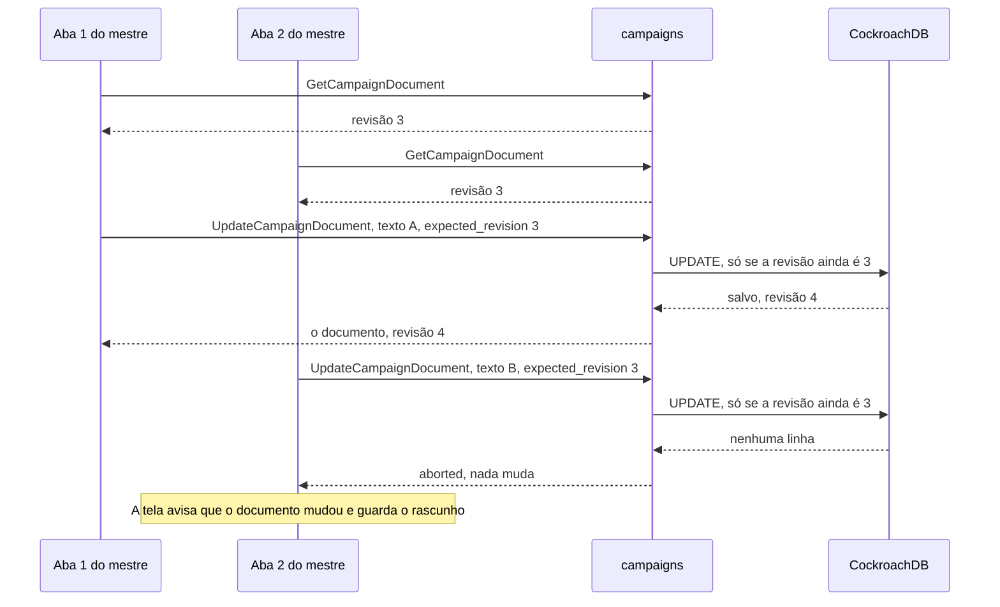
```mermaid
sequenceDiagram
    participant A as Aba 1 do mestre
    participant B as Aba 2 do mestre
    participant C as campaigns
    participant DB as CockroachDB
    A->>C: GetCampaignDocument
    C-->>A: revisão 3
    B->>C: GetCampaignDocument
    C-->>B: revisão 3
    A->>C: UpdateCampaignDocument, texto A, expected_revision 3
    C->>DB: UPDATE, só se a revisão ainda é 3
    DB-->>C: salvo, revisão 4
    C-->>A: o documento, revisão 4
    B->>C: UpdateCampaignDocument, texto B, expected_revision 3
    C->>DB: UPDATE, só se a revisão ainda é 3
    DB-->>C: nenhuma linha
    C-->>B: aborted, nada muda
    Note over B: A tela avisa que o documento mudou e guarda o rascunho
```

## Módulo rules: regras como dados

O `rules` calcula a ficha: recebe as escolhas do jogador (o `Build`) e devolve os números da ficha (o `Derived`), a partir do conteúdo do SRD 5.1 embutido no binário (ADR-0008). Não usa banco, rede, relógio nem aleatoriedade: a mesma ficha e o mesmo conteúdo dão sempre o mesmo resultado. O código fica em `backend/internal/rules`.

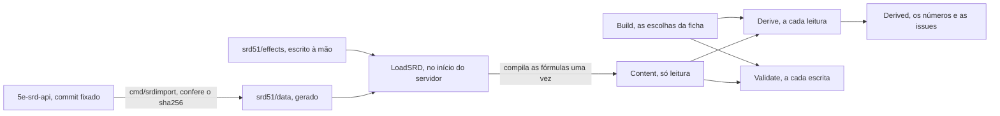
```mermaid
flowchart LR
    Fonte["5e-srd-api, commit fixado"] -->|"cmd/srdimport, confere o sha256"| Data["srd51/data, gerado"]
    Efeitos["srd51/effects, escrito à mão"] --> Load
    Data --> Load["LoadSRD, no início do servidor"]
    Load -->|"compila as fórmulas uma vez"| Content["Content, só leitura"]
    Ficha["Build, as escolhas da ficha"] --> Derive
    Content --> Derive["Derive, a cada leitura"]
    Derive --> Derived["Derived, os números e as issues"]
    Ficha --> Validate["Validate, a cada escrita"]
    Content --> Validate
```

| Função | Quando roda | O que faz |
| --- | --- | --- |
| `LoadSRD()` | Uma vez, no início | Lê o snapshot e os efeitos, confere o esquema e compila toda fórmula. Erro aqui é bug no conteúdo embutido, e o servidor não sobe. |
| `Validate(build, content)` | Em toda escrita de ficha | Recusa o que não faz sentido nenhum: atributo fora de 1 a 30, nível total acima de 20, chave que não existe, sub-raça de outra raça, listas grandes demais. Devolve o campo, com os nomes do proto, sem repetir o valor. |
| `Derive(build, content)` | Em toda leitura de ficha | Calcula a ficha. Nunca falha: uma chave desconhecida, uma escolha fora da regra ou uma fórmula que quebra vira uma `Issue`, e o resto é calculado ("o app é um assistente, não um juiz"). |
| `Content.Catalog()`, `NamePT()`, `Summary()` | Nas telas de edição e nas listas | O que o editor oferece, com nomes em português; o nome de uma chave; "Mago 3" para uma linha de lista. |
| `Content.NextLevelXP(nível)`, `LevelForXP(xp)`, `XPForChallenge(nd)`, `SplitXP(total, n)` | No XP e na ficha | As contas de experiência (RN-09, RN-12): o XP do próximo nível (falso no 20), o nível de um XP, o XP de um nível de desafio ("1/4", "5"...) e a parte de cada um numa divisão, arredondada para baixo. Tabelas em `effects/advancement.json`, conferidas ao carregar (20 níveis crescentes; os 34 níveis de desafio em ordem). `Derived.NextLevelXP` e `Content.Catalog().ChallengeRatings` (que o `ListContent` devolve para o seletor de ND do NPC) saem delas. |
| `SceneOptions(derived, ações)` | Na cena de RP (MR-015) | Para cada teste que o mestre pôs na cena (`skill:investigation`, `ability:str`, `save:wis`, com nome e CD opcionais), o bônus do personagem, o nome em português ("Teste de Força", "Salvaguarda de Sabedoria") e a passiva de Percepção, Investigação e Intuição. Os tipos são fechados: nada de combate entra numa cena, e uma chave desconhecida devolve um `*SceneError`, nunca um pânico. |

**O que o `Derive` calcula**, para as 12 classes e as 9 raças do SRD, do nível 1 ao 20:

- atributos com os bônus de raça, sub-raça e manuais, e os modificadores;
- bônus de proficiência, os 6 testes de resistência (da primeira classe), as 18 perícias (nenhuma, metade, proficiente ou especialização), as 3 passivas e a iniciativa;
- CA com armadura, escudo e defesas sem armadura, com a descrição de como chegou nela; PV máximos (fixo ou rolado) e dados de vida; deslocamento e sentidos;
- conjuração por classe (CD, ataque, truques, magias conhecidas ou preparadas), espaços de magia (com a tabela de multiclasse) e a magia de pacto do bruxo;
- ataques com as armas da ficha e com os truques de dano;
- features e traços até o nível do personagem, com o texto do SRD em inglês, as dicas (`hints`) e as `issues`.

- recursos com usos (`Resources`: Retomar o Fôlego, Ki, Fúria, com o máximo no nível e quando voltam) e ações (`Actions`, as que uma feature dá, com a ação que gastam e o recurso que consomem; `StandardActions`, as dez de todo mundo);
- o dano de cada ataque também como números (`DamageDice`, `VersatileDice`: quantidade, faces e bônus), além do texto "1d8+3".

**O que não calcula (ainda):** magias ativas como Armadura Arcana e Escudo, PV atuais, espaços gastos e recursos em uso (são da sessão de jogo, Etapa 6; o `combat`, abaixo, só faz as contas sobre o que a sessão guarda). Os efeitos escritos à mão cobrem os níveis 1 a 5; acima disso, uma feature sem efeito aparece só como texto, e o mestre resolve.

### Efeitos e versões

O SRD descreve as features em prosa. O que o motor precisa saber fica em `effects/*.json`, escrito à mão, num conjunto fechado de tipos:

| Tipo | Exemplo |
| --- | --- |
| `modifier` | Defesa sem Armadura: `ac.base`, o maior entre as opções, `10 + mod("dex") + mod("con")`, só com `armor() == "none"` |
| `proficiency` | Pau para Toda Obra: metade da proficiência em toda perícia e na iniciativa |
| `roll_mode` | Esperteza Gnômica: vantagem em resistências de INT, SAB e CAR contra magia (vira dica) |
| `sense` | Visão no escuro, 18 m (60 ft) |
| `spellcasting` | Mago: INT, prepara do grimório, `max(1, mod("int") + classLevel("wizard"))` preparadas |
| `resource`, `grant_action` | Fúria, Retomar o Fôlego: viram `Derived.Resources` e `Derived.Actions`, que o `combat` lê (ver [Combate e detalhes das magias](#combate-e-detalhes-das-magias)) |
| `extra_attack` | Ataque Extra: quantos ataques a Ação de Atacar faz (`Derived.AttacksPerAction`) |
| `wild_shape` | Forma Selvagem do druida: o ND máximo e se exclui voo e natação (`max_cr`, `no_fly`, `no_swim`), nos três níveis (2, 4 e 8); ver [Criaturas, convocações e Forma Selvagem](#criaturas-convocações-e-forma-selvagem) |
| `choice`, `note`, `handler` | Escolhas do jogador, o que só aparece como texto, e uma função Go registrada |

Um efeito com `tags` (como `against:magic`) nunca é aplicado sozinho: vira uma dica na ficha, e o mestre decide. A versão do conteúdo, `srd51@<commit>+fx.<n>`, aparece na ficha. Mudar um arquivo de `effects/` exige uma revisão nova; um teste confere. Um snapshot novo ou uma revisão nova pode mudar números de uma ficha travada, e o `content_version` mostra com qual conteúdo eles foram calculados.

### Criaturas, convocações e Forma Selvagem

As 334 criaturas do SRD 5.1 (MR-037, Etapa 9) entram no `rules` como o resto do conteúdo: o `cmd/srdimport` lê `5e-SRD-Monsters.json` (o mesmo commit, o sha256 no `inputHashes`) e escreve `srd51/data/monsters.json` (`srd51.Monster`: tamanho, tipo, CA e o que a dá, PV e dados, deslocamentos em pés, os seis atributos, bônus de resistência e de perícia, vulnerabilidades, resistências e imunidades, imunidades a condições, sentidos, ND e XP, traços, ações com o bônus de ataque, as partes do dano, a CD de resistência e as rotinas do Ataque Múltiplo, reações e ações lendárias). Os nomes em português são `monster:<índice>` em `effects/names_pt.json`; o texto das fichas fica em inglês, como o das magias. Duas leituras do importador merecem aviso: quando o SRD dá uma escolha de dano (a espada longa com uma ou duas mãos), fica a primeira opção e o texto tem o resto; e a resistência que o 5e-database deixa só no texto ("Força CD 11 ou cai Derrubado") é lida do texto da ação.

| Função (`rules.Content`) | O que faz |
| --- | --- |
| `ListCreatures(filtro)`, `CreatureByKey(chave)` | A lista (nome em português ou inglês sem acento, tipo, ND máximo, sem voo, sem natação; ordenada por nome em português) e a ficha com os rótulos em português. Alimentam o `ContentService.ListCreatures` e o `GetCreature`. |
| `MonsterDerived(chave)` | A ficha da criatura como `Derived`, que o combate já lê: atributos e modificadores, resistências e perícias (os bônus da ficha, ou o modificador), CA, PV, o deslocamento de andar em `SpeedWalkFt` e os outros (`SpeedFlyFt`, `SpeedSwimFt`, `SpeedClimbFt`, `SpeedBurrowFt`, `Hover`), sentidos, Percepção passiva, os ataques (bônus e a **primeira** parte do dano; o texto inteiro vai em `Attack.Notes` para o mestre), o Ataque Múltiplo como `AttacksPerAction` (a maior rotina) e as ações com resistência em `SaveActions`, com a CD. Sem conjuração. |
| `SummonOptions(magia, círculo, build)`, `CheckSummon(...)` | O que uma magia de convocação deixa escolher com aquele espaço, e a conferência de uma escolha (`ErrSummonCreature`, `ErrSummonCount`, `ErrSummonOption`, `ErrSummonCircle`). O tempo de conjuração, o ritual e a concentração vêm dos dados da magia. |
| `WildShapeLimitFor(build)`, `WildShapeForms(build)`, `WildShapeAllows(build, fera)` | As feras que o druida pode assumir agora: nível 2, ND até 1/4, sem voo nem natação (31 feras); nível 4, até 1/2, sem voo (48); nível 8, até 1 (70). |
| `WildShapeDerived(ficha, fera)` | A ficha do druida na forma de fera, pelo SRD: CA, PV (uma reserva à parte: `HitPointsMax` é o da fera), deslocamentos, Força, Destreza e Constituição, ataques e sentidos da fera; Inteligência, Sabedoria e Carisma, bônus de proficiência, features e recursos do personagem. As proficiências em perícias e resistências ficam e ganham as da fera, e onde as duas têm a mesma vence o bônus maior. A visão no escuro do personagem só vale se a fera também a tem (vale o maior alcance). Sem magias: `Spellcasting`, `Spells` e `PactMagic` saem vazios. |

**O efeito `summon`** (quinto tipo fechado de `effects/spells.json`, junto de `hp_pool`, `hp_threshold`, `zero_hp_target` e `flat_heal`; o carregamento recusa criatura, campo, ND ou modo de ataque que não existe). Quatro entradas: `spell:find-familiar` (as 15 formas do SRD, uma criatura, ritual de 1 hora, **não ataca**; o Pacto da Corrente, `feature:pact-of-the-chain`, soma Diabrete, Pseudodragão, Quasit e Sprite, e faz **todo** familiar do bruxo, de qualquer forma, atacar só com a reação), `spell:animate-dead` (Esqueleto ou Zumbi: 1 criatura mais 2 por círculo acima do 3º), `spell:conjure-animals` (só feras; 1 de ND 2, 2 de ND 1, 4 de ND 1/2 ou 8 de ND 1/4, vezes 2 no 5º círculo, 3 no 7º e 4 no 9º; concentração) e nenhuma para Encontrar Montaria, que fica para depois do MVP (pergunta 74). Quem gasta o espaço e cria as criaturas é o `play` (fatias 9.9 e 9.10); o `rules` só diz o que pode.

**Na API.** `ContentService.ListCreatures` (filtros, ordem por nome em português, páginas de 1 a 100, 50 por padrão, `page_token` opaco) e `GetCreature` (a ficha para a tela) são `IDEMPOTENT` e só aceitam POST. As criaturas são regra pública, igual para toda campanha, mas só um **membro ativo** pergunta: o membro pendente (RN-15) não precisa de criatura para montar o personagem e recebe `not_found`. O `DerivedSheet` ganhou os deslocamentos (`speed_fly_ft`, `speed_swim_ft`, `speed_climb_ft`, `speed_burrow_ft`, `hover`), `save_actions` e, no `Attack`, `notes`; o `Sense` ganhou `sense` ("darkvision"...), porque o `key` de um sentido de criatura é a criatura. A CA de uma criatura vem da armadura que ela usa (o azer tem 17, com escudo), e a nota diz o que veste e os outros valores ("15 com Armadura Arcana"). Testes: `TestMonsterDerived`, `TestListCreatures`, `TestSummonOptions`, `TestCheckSummon`, `TestWildShapeForms`, `TestWildShapeDerived` (o pacote `rules`), `TestListAndGetCreatures` e a linha dos dois métodos em `TestAuthorizationMatrix` (o `characters`).

### As criaturas do personagem no jogo (MR-037, fatia 9.9)

**Uma criatura é do personagem, e no combate é um combatente do tipo `creature`.** As regras (o que uma magia deixa convocar, os números de uma criatura) são do `rules`, descritas acima; esta seção é o que o servidor guarda e faz com elas. O módulo `characters` guarda a criatura (`character_creatures`, `00102`); o módulo `play` a põe no combate (`combatants.kind = 'creature'`, `00103`); os dois se encontram em duas interfaces pequenas ligadas no `cmd/api`: `play.CombatRoster` (o que o combate pede ao `characters`) e `characters.CreatureHost` (o que o `characters` pede ao `play`, ligada por `SetCreatureHost`).

| Quem | O quê |
| --- | --- |
| `CharacterService` | `ListCharacterCreatures` (`IDEMPOTENT`; o mestre e o jogador dono; para qualquer outro jogador é `not_found`, como a ficha, e o PV nunca chega a ele), `GiveCreature` (só o mestre, qualquer criatura do SRD, até 40 por personagem), `RenameCreature` (o combatente da criatura num combate aberto ganha o nome novo) e `DismissCreature` (o dono ou o mestre; dispensar uma já dispensada não muda nada) e `AdjustCreatureHitPoints` (só o mestre, RN-02, só fora do combate: dentro dele o PV é do combatente e vale `AdjustCombatantHitPoints`; a 0 PV a criatura é dispensada). A ficha da criatura (`ContentService.GetCreature`) é a de sempre. |
| `PlayService.CastSummon` | Conjurar fora do combate o que não cabe nele: Encontrar Familiar (1 hora, **ritual: sem espaço de magia**), Animar os Mortos (1 minuto, gasta o espaço) e Conjurar Animais (1 ação). Confere que o personagem tem a magia (a do grimório vale como ritual para o mago; o Pacto da Corrente dá o ritual de Encontrar Familiar sem a magia), o espaço (os `vitals`, como todo gasto) e a escolha (`rules.CheckSummon`), cria as criaturas e escreve o evento `creature_summoned` (IDs e chaves, nunca o nome que o jogador digitou). Um familiar novo dispensa o antigo ("um de cada vez", motivo `replaced`), e uma convocação que pede concentração (Conjurar Animais) dispensa antes as criaturas da concentração anterior, dentro ou fora do combate (motivo `concentration`). Recusado enquanto o personagem está num combate que não acabou (`SUMMON_IN_COMBAT`: lá é o `CastSpell`). |
| `CombatService.CastSpell` | Conjurar Animais no combate: o pedido leva `summon` (a opção e as chaves das criaturas, e os nomes) e a rolagem da iniciativa do grupo no mesmo `roll_in_app` / `d20_face` (a magia não rola mais nada), que o jogador faz como todo dado (RN-18). As criaturas nascem em quadrados livres ao lado de quem conjurou, entram na ordem com **uma iniciativa só** e jogam juntas se o total empata com outro combatente (o turno conjunto de sempre). Uma magia mais longa que uma ação é recusada com `CASTING_TIME_TOO_LONG` ("Leva 1 hora: conjure fora do combate"); uma escolha que as regras recusam, com `SUMMON_CHOICE_INVALID`; sem a rolagem, `SUMMON_NEEDS_INITIATIVE`; sem lugar (um combate tem 40 combatentes, contando as criaturas da concentração que sai), `TOO_MANY_COMBATANTS`, antes de gastar o espaço. O bônus do grupo é o da primeira criatura da conjuração, qualquer que seja o membro por quem o jogador rola. |
| `CombatService.EndConcentration` | Encerra a concentração (o próprio jogador ou o mestre) e **dispensa as criaturas daquela conjuração**, com um `creature_dismissed` para cada uma. `SetCombatantConditions` com `end_concentration` e conjurar outra magia de concentração fazem o mesmo (RN-22). |
| Dica do stream `creatures_changed` (20) | Para o mestre e o dono, fora do combate; no combate, `encounter_changed` já cobre. Não leva conteúdo. |

**O que o combate faz com elas.**

- **Quem entra.** As criaturas vivas de um personagem de jogador entram quando o combate é montado (`StartEncounter`), uma linha para cada, sem iniciativa e sem quadrado enquanto o dono não tem token. O jogador dono (ou o mestre) rola a iniciativa com `SubmitInitiative`: **uma rolagem por conjuração** (as criaturas com o mesmo `summon_group_id` recebem o mesmo d20 e o mesmo total, e o bônus de quem rolou; Conjurar Animais é regra do SRD, e o mesmo vale, por decisão nossa, para Animar os Mortos); o familiar rola a própria. O mestre pode tirar uma do combate (`RemoveCombatant`), e ela continua na lista do dono. Quem sai do combate em preparação leva as criaturas junto. Os de Conjurar Animais, conjurados antes do combate, entram com o dono já concentrando na magia. Uma criatura dada pelo mestre **durante** um combate não entra nele.
- **De quem é a linha.** `combatants.character_id` é o **dono** (a coluna continua `NOT NULL` e a criatura some com o personagem, em cascata) e `user_id` o jogador do dono, então o `mayAct` de sempre funciona: o jogador age pela criatura, e só ele e o mestre. `Combatant.mine` continua verdadeiro **só para o personagem do próprio jogador** (a tela atual acha o "meu" combatante com ele); o campo novo `controlled_by_me` cobre também as criaturas, e `owner_character_id` diz de quem é. `character_id` fica vazio numa criatura, até para o mestre.
- **Vez e economia.** A criatura tem a vez e a economia dela, calculadas de `MonsterDerived`: ataques (cada ação com bônus de ataque, a primeira parte do dano), a Disparada e as ações padrão, **sem** "Conjurar uma magia". O que a magia deixou: o familiar não ataca (sem ataques nem a ação Atacar, nem para o mestre: `CREATURE_CANNOT_ATTACK`); o do Pacto da Corrente tem os ataques desabilitados como ação (`REACTION_ONLY`) e só ataca com `as_reaction`; as de Animar os Mortos e Conjurar Animais atacam como qualquer criatura. Ao entrar no combate a criatura copia, como o personagem, o lado (`party`), o tamanho e o deslocamento de voar da ficha dela (`size`, `speed_fly_ft`) e o salto (`combat.JumpLimits` da Força da criatura, `jump_long_dft` e `jump_high_dft`): o movimento da 9.6 usa o melhor entre andar e voar, quem voa ignora terreno difícil, e nadar e escalar nunca são a velocidade no mapa. O jogador dono a move na vez dela e o mestre sempre; outro jogador recebe `permission_denied`. O combatente dispensado (concentração que acabou) não ocupa quadrado nem dá cobertura, porque o movimento e a cobertura leem a lista sem os dispensados. Testes: `TestMR037_ACreatureMovesLikeAnyCombatant`, `TestMR037_ADismissedCreatureBlocksNoSquare`.
- **PV e derrota.** O PV fica no combatente, como o do NPC: o dano cai na hora, sem esperar o mestre (RN-02 é do PV de **personagem**), e a 0 PV a criatura fica derrotada (sem testes contra a morte) e **dispensada** da lista do dono. Não há código por ponto de PV: toda escrita de combate passa por `syncCreatures`, que, depois da mudança e antes do evento dela, dispensa a criatura derrotada e traz de volta a que um "Desfazer" ou uma cura levantou. No fim do combate, e quando ela sai dele, o PV volta para `character_creatures`.
- **Quem vê o quê (RN-20).** O jogador dono e o mestre recebem o PV da criatura como número (`hit_points_*`); **todos os outros recebem só a palavra do estado**, na ordem, no registro e no stream (nunca um `hit_points_*`, nem `hit_points_after` no registro). A iniciativa da criatura é pública, como a dos personagens; o dono, o tipo e o nome em português da criatura também (o grupo sabe de quem é). O grupo e o ataque permitido só vão ao dono e ao mestre.
- **Fora do combate.** O PV é do mestre (`AdjustCreatureHitPoints`); a criatura não tem token (a 9.10 dá um ao mapa de exploração); a Forma Selvagem e "ver pelos olhos do familiar" são da 9.10.
- **O que o desfazer põe de volta.** O "Desfazer" do mestre devolve o PV da criatura (e a traz de volta se ela caíra), tira as criaturas de um `CastSpell` e devolve o espaço e a concentração; Quando a concentração acaba, os combatentes das criaturas não são apagados: ficam **dispensados** (`combatants.dismissed`, `00104`), fora da ordem, do mapa e dos turnos, mas com o mesmo id, PV, condições e linhas do registro; desfazer o fim da concentração tira a marca e eles voltam, os mesmos. Os eventos `creature_summoned` e `creature_dismissed` são escritos antes do evento da mudança e **não fecham a cadeia do desfazer** (`lastAction` os pula): desfeito o `CastSpell` ou o fim da concentração, a ação anterior ainda pode ser desfeita. No combate, a criatura derrotada não escreve evento próprio (o dano que a derrotou já é o registro dela, e um evento depois dele fecharia o desfazer da ação anterior); fora do combate, o `creature_dismissed` com `reason: defeated` é escrito.

**A auditoria dos testes de tipo do `play`.** Eram 42 conferências `== kindNPC` e `!= kindPlayer`; cada uma foi lida, e a coluna diz o que uma criatura faz ali. As que **mudaram** passaram a perguntar "guarda o PV no combatente?" (`holdsHP`: NPC ou criatura) ou "é do lado do grupo?" (`inParty`: personagem ou criatura).

| Onde | Antes | Criatura |
| --- | --- | --- |
| `landDamage`, `healCombatant` | só NPC leva o dano e a cura na hora | `holdsHP`: leva na hora, como o NPC |
| `AdjustCombatantHitPoints`, `readFxTarget`, `dropToZero` (Sono, Palavra de Poder), `pendingProto` (`target_defeated`) | só NPC | `holdsHP` |
| `UndoLastAction` (o dano, a cura, a magia e a correção de PV, 3 lugares) | só NPC volta o PV na combatente | `holdsHP`; e o `syncCreatures` refaz a lista do dono |
| `stateOf` | só NPC tem palavra de estado | `holdsHP`: Ileso / Ferido / Muito ferido / Derrotado |
| `turnFor`, `EndTurn` (de quem é a parte encerrada), a economia dividida do turno conjunto | só personagem de jogador é "do jogador" | `inParty`: o grupo com uma criatura é do jogador, não "só de NPCs" |
| `combatantToProto`: `character_id`, iniciativa | personagem de jogador (ou o mestre) | criatura: `owner_character_id` no lugar do `character_id`; iniciativa pública (`inParty`) |
| `armorClasses`, os retratos, os nomes do registro | a ficha vem do `character_id` | a ficha vem da criatura (`sheetKey`, `sheetOf`): nunca a CA do dono |
| `ResetDeathSavesOfCharacter`, `MarkDeathSaveRolledOnTurn` (SQL) | pelo `character_id` | `AND kind = 'player'`: o `character_id` de uma criatura é o do dono |
| `RollAttack`, `GetTurnOptions`, `TakeAction`, `CastSpell`, o alvo de um ataque e de uma resistência | a ficha do `character_id` | a ficha da criatura, e `mayAttack` aplica o que a magia deixou |

As que **não mudaram, de propósito**: `isDown` (uma criatura nunca "cai": é derrotada), `RollDeathSave` e `ConfirmDeath` (recusam: só personagem morre), `shieldFor` (a criatura não conjura Escudo), o gasto de espaço e de recurso (só personagem), `ApplyPendingDamage` (nunca há dano esperando numa criatura), `SetCombatantHidden` (uma criatura nunca é escondida), `npcOnlyGroups` (um grupo com criatura não é de NPCs), os retratos (só NPC), os destaques do combate (`tallyHighlights`: o dano de uma criatura não conta para o dono; e um golpe, crítico ou dano num alvo do grupo, uma criatura ou um personagem, é fogo amigo e não conta para ninguém: só vale o que acerta um NPC), o XP (só NPC derrotado dá XP: `kind = 'npc'` no SQL), `RemoveCombatant` (só o personagem de jogador não sai de um combate que corre) e `endEncounter` (só o personagem tem token para levar de volta). Testes: `TestMR037_TheKindAudit`, `TestMR037_ACreatureAtZeroLeavesAndTheHitPointsGoBack`, `TestRN20_CreatureHitPointsOnlyToOwnerAndMaster`.

**O que os ADRs devem dizer.** O ADR-0011 (quem pode o quê) ganha a linha das criaturas: o mestre e o jogador dono leem, renomeiam e dispensam; só o mestre dá e corrige o PV; para outro jogador a criatura é `not_found`. O ADR-0007 (eventos) ganha o payload de `creature_summoned` (`character_id`, `creature_ids`, `monster_keys`, `source`, `ritual`, e o `summon_roll` no combate) e de `creature_dismissed` (`character_id`, `creature_ids`, `reason`: `owner`, `master`, `defeated`, `concentration`), todos só de IDs e chaves.

### Combate e detalhes das magias

O pacote `rules/combat` é a parte pura da luta (MR-012 a MR-014): o que o personagem pode fazer agora e a aritmética de ataque, dano, cura, espaços e testes contra a morte. Como o `rules`, não usa banco, rede, relógio nem aleatoriedade: os dados são rolados fora (no servidor da sessão ou pelo jogador, RN-18) e entram como número, e toda função devolve um valor novo em vez de mudar o que recebeu. O módulo `play` guarda o estado e chama estas funções; o app escreve os resultados em português.

| Função | O que faz |
| --- | --- |
| `Options(derived, TurnState, Usage)` | O `TurnOptions` da "Sua vez": a economia (ação, ação bônus, reação, cada uma com `used` e `available`; movimento em pés, dobrado depois da Disparada), os ataques, as magias, as ações padrão e as ações das features, cada opção habilitada ou desabilitada com um código de motivo. Calculado a cada leitura, nunca guardado. |
| `ResolveAttack(bônus, CA, d20)` | Acerto ou erro: 20 natural sempre acerta e é crítico, 1 natural sempre erra. |
| `DamageTotal(dados, faces, crítico)` | Soma as faces rolladas e o bônus. Crítico dobra os dados, nunca o bônus. `DiceToRoll` e `DiceRange` dão quantos dados rolar e a faixa válida, para conferir o total digitado com dado físico. |
| `ApplyDamage(pv, temporários, dano)` | Os PV temporários vão primeiro; piso em 0; diz se "caiu a 0" e quanto sobrou do dano. |
| `ApplyHeal(pv, máximo, cura)` | Cura até o máximo e diz quanto curou de fato. |
| `SpendSlot`, `SpendPactSlot`, `SpendResource` | Gastam um espaço de magia, um de pacto ou um uso de recurso; `ErrNoSlot` e `ErrNoUses` quando não há. Devolvem um `Usage` novo. |
| `DeathSave(d20, sucessos, falhas)` | 10 ou mais é sucesso, menos é falha, 1 natural são duas falhas, 20 natural volta com 1 PV. Três sucessos: estável. Três falhas: `dying`, que o mestre confirma (RN-03); o motor nunca mata sozinho. `DamageWhileDown(crítico)` dá 1 falha (2 no crítico) para dano em quem está a 0. |
| `JumpLimits(derived)`, `HasRunningStart(movimento anterior)` | O salto (MR-034, RN-21): o alcance em distância e em altura, com e sem corrida, em décimos de pé. Só as contas da ficha; a linha do salto e o que ele custa estão em `rules/grid`. |
| `ConcentrationDC(dano)` | `max(10, dano/2)`, o número do lembrete de concentração (RN-22). |
| `AttacksLeft`, `MissileDarts`, `SaveSucceeded`, `HalfDamage`, `ShieldACBonus` | Quantos ataques da Ação de Atacar ainda cabem (Ataque Extra), os dardos dos Mísseis Mágicos (3, e mais um por círculo acima do 1º), a resistência que alcança a CD, a metade do dano arredondada para baixo e os +5 do Escudo. |

**Os motivos de uma opção desabilitada** são códigos, nunca texto; o app mapeia cada um para a frase em português:

| Código | Quando | Parâmetros |
| --- | --- | --- |
| `ACTION_USED`, `BONUS_ACTION_USED`, `REACTION_USED` | A ação, a ação bônus ou a reação que a opção pede já foi usada | — |
| `ATTACKS_USED` | A Ação de Atacar fez todos os ataques (Ataque Extra); com um ataque só, o código é `ACTION_USED` | — |
| `NO_SLOT` | Magia de círculo 1 ou mais sem espaço livre no círculo dela nem acima (nem de pacto) | `min_level`: o círculo da magia |
| `NO_USES` | O recurso da feature acabou | `recharge`: quando volta (`short_rest`, `long_rest`...) |
| `REACTION_ONLY_WHEN_HIT` | Escudo: só se conjura quando um ataque acerta o conjurador | — |
| `REACTION_ONLY` | As outras magias de reação (Contramágica, Queda Suave, Repreensão Infernal) | — |
| `CASTING_TIME_TOO_LONG` | Tempo de conjuração de 1 minuto ou mais | — |

**A ordem das magias.** `Options` devolve `spells` já ordenada (MR-014, pergunta 57): primeiro as que dá para conjurar agora (`enabled`), depois as outras; em cada grupo, os truques primeiro, depois por círculo e pelo nome em português (sem acento, sem diferenciar maiúscula; empate mantém a ordem da ficha). O Escudo Arcano nunca dá para conjurar na vez do próprio personagem (`REACTION_ONLY_WHEN_HIT`), então vai entre as outras, e a tela mostra o motivo como "Só fora da sua vez".

Vale o primeiro motivo que se aplica: o que a magia é, depois a economia, depois os espaços. Cada magia traz também os círculos com que pode ser conjurada (`slots`: do círculo dela para cima, só com espaço livre, mais o espaço de pacto do bruxo, com quantos estão livres para o aviso de "último espaço"). Truques que causam dano ficam só em `attacks`, não em `spells`. O `TurnOptions` é devolvido pelo `CombatService.GetTurnOptions`, com a economia (inclusive `attacks_per_action` e `attacks_left`, do Ataque Extra).

**Ações padrão e recursos.** As dez ações de todo mundo (Atacar, Conjurar uma magia, Disparada, Desengajar, Esquivar, Ajudar, Esconder, Preparar, Procurar, Usar um objeto) ficam em `effects/standard_actions.json`, escritas à mão, e entram na regra das revisões dos efeitos. Os nomes em português dos recursos ficam em `effects/names_pt.json` como `resource:<nome>`; sem esse nome, vale o da feature. **Ataque Extra** é um tipo de efeito fechado, `extra_attack` (com `count`: 2 no 5º nível do guerreiro, bárbaro, monge, paladino e patrulheiro), e `Derived.AttacksPerAction` guarda o maior `count` do personagem (1 sem ele). **Surto de ação** é uma ação grátis (`grant_action` com `free`) ligada ao recurso `action_surge`.

**Detalhes das magias.** `ListContent` continua leve (nome, círculo, escola, classes, ritual, concentração, tempo de conjuração). Tudo o que o SRD diz de uma magia vem de `ContentService.GetSpellDetails(campaign_id, spell_key)`, para o diálogo "?" (mesmo acesso do `ListContent`, membro pendente incluído; chave desconhecida é `not_found`): tempo de conjuração (quantidade e unidade, e o gatilho da reação quando o SRD tem), alcance (tipo e distância em pés), componentes (V, S, M e o material em inglês), duração (instantânea, com tempo, até ser dissipada, especial; e se pede concentração), ataque, resistência (habilidade e o que acontece ao passar: nada, metade ou outra coisa), dano por círculo do espaço (e por nível do personagem, nos truques), cura por círculo e o texto em inglês, com "Em círculos superiores". O servidor devolve dado estruturado e o texto cru do SRD para o que não cabe na estrutura ("4d6 OR 5d6"); escrever "60 ft" como "18 m" e "1 action" como "1 ação" é do app (`spell-details-format.ts`, que cai no texto cru, marcado, quando o valor não mapeia; o editor busca a magia ao abrir o "?" e guarda a resposta só enquanto a página está aberta, sem Web Storage). Em Go, `SpellDetails.DamageAt(círculo, nível)` e `HealAt(círculo)` dão as rolagens já em números (`ParseDice`), para as fatias de combate.

### Grade, visão e predefinições (Etapa 9)

Dois pacotes puros novos fazem a geometria do mapa e a névoa de guerra (MR-034 a MR-036, RN-21), junto de duas tabelas de conteúdo escritas à mão. Nenhum usa banco, rede, relógio nem aleatoriedade (ADR-0008); o `maps` guarda as camadas, o `play` pergunta o custo de um movimento e o `vision` constrói a névoa sobre a linha do `grid`. O navegador não faz conta nenhuma: desenha o que o servidor manda. Na fatia 9.2 existiram só as contas; a ligação do movimento, do alcance, do salto e da cobertura com o servidor é da fatia 9.6 ([Movimento no combate](#movimento-no-combate-etapa-9-fatia-96)); as camadas e os novos tipos de ponto são da fatia 9.3 ([Camadas, névoa e os novos tipos de ponto](#camadas-névoa-e-os-novos-tipos-de-ponto-etapa-9)), e a névoa de cada personagem, da 9.4.

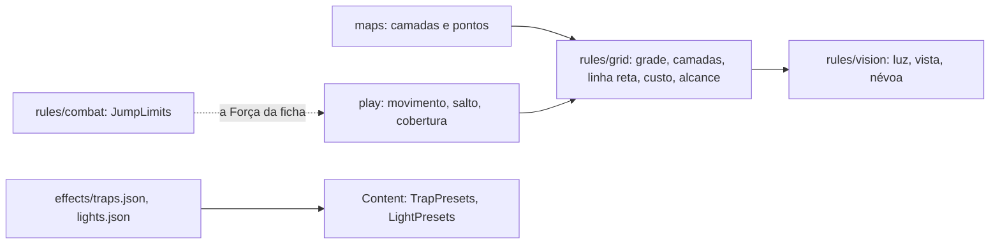
```mermaid
flowchart LR
    Maps["maps: camadas e pontos"] --> Grid
    Play["play: movimento, salto, cobertura"] --> Grid
    Grid["rules/grid: grade, camadas, linha reta, custo, alcance"] --> Vision["rules/vision: luz, vista, névoa"]
    Combat["rules/combat: JumpLimits"] -.->|"a Força da ficha"| Play
    Efeitos["effects/traps.json, lights.json"] --> Content["Content: TrapPresets, LightPresets"]
```

**`rules/grid`.** A grade de um mapa (`Grid`: colunas e linhas; as linhas saem da imagem por `RowsFor`, `round(colunas × altura / largura)` entre 1 e 400), a conversão entre pontos-base (0 a 10000 da largura e da altura da imagem) e quadrados (`SquareOf`, `CenterOf`, as mesmas contas do `play`) e as **camadas empacotadas**, que o `maps` guarda e a API manda (o navegador decodifica, então o formato faz parte do contrato):

| Camada | Tipo | Bytes |
| --- | --- | --- |
| Parede, terreno difícil | `Layer`: 1 bit por quadrado | `ceil(quadrados / 8)`. O quadrado `n = linha × colunas + coluna` é o bit `n % 8` do byte `n / 8`, do menos significativo para o mais. |
| Luz | `LightLayer`: 2 bits por quadrado (0 não pintado, 1 escuro, 2 penumbra, 3 claro) | `ceil(quadrados / 4)`. O quadrado `n` ocupa os bits `2 × (n % 4)` e o seguinte do byte `n / 4`. |
| Cobertura | `CoverLayer`: 2 bits (0 nenhuma, 1 meia, 2 três quartos; o 3 nunca é guardado) | Igual à da luz. |

Os bits que sobram no último byte são 0; `Decode…` recusa tamanho errado, bit sobrando ligado e, na cobertura, o valor 3 (`ErrLayerSize`). Uma parede é cobertura total; ela e o quadrado de três quartos bloqueiam o movimento, mas só a parede bloqueia a vista e a luz.

A **linha reta entre os centros** de dois quadrados (`Line`) é percorrida com inteiros, então o resultado é o mesmo em toda máquina: o quadrado de saída fica de fora, o de chegada entra, e uma linha que passa exatamente por uma quina não entra nos dois quadrados vizinhos a ela. Quando esses dois são paredes (ou uma parede e uma coluna, no movimento), a linha é **espremida** e fica bloqueada. Em cima da linha:

| Função | O que faz |
| --- | --- |
| `Terrain.Move(de, para, ocupantes, mover)` | O custo de um movimento reto em décimos de pé: o comprimento da linha (exato até o décimo) mais 50 por quadrado em que a linha entra que é terreno difícil ou tem outra criatura (uma vez só, mesmo que os dois valham). Quem voa não paga o terreno do mapa, só o espaço de criaturas. Bloqueia por parede, coluna, espremida e criatura hostil que não dá para atravessar (dois tamanhos de diferença, `Size`), e por terminar no quadrado de alguém (salvo Miúdo com Miúdos). |
| `Terrain.MoveUntil(…, parar, restante)` | O movimento como de fato acontece, para quando o jogador não vê tudo (névoa) ou há uma armadilha: segue a linha e para antes do primeiro obstáculo real, antes do primeiro quadrado que o movimento que sobra (`restante`, em décimos de pé) não paga (`StopMovement`), ou no primeiro quadrado do conjunto `parar` (a área da armadilha). O custo é o real até ali e nunca passa do que sobra. `Marked` e `MarkedAt` dizem que a armadilha disparou mesmo quando o quadrado dela está ocupado e o personagem termina um quadrado antes (`Reached`). |
| `Terrain.Reach(de, movimento que sobra, ocupantes, mover)` | Todo quadrado alcançável num movimento reto, com o custo, em ordem de leitura: o círculo, encolhido pelo terreno e cortado pelas paredes. É o que o servidor manda para o navegador desenhar. |
| `Terrain.Jump(de, para, ocupantes, mover)` | O custo do salto em distância: só o comprimento (passa por cima de terreno difícil e de criaturas); não atravessa parede nem coluna. |
| `Terrain.CoverBetween(atacante, alvo, criaturas)` | A cobertura do alvo: a melhor entre os quadrados da linha, sem os dois das pontas; parede ou espremida é total, outra criatura dá meia. |
| `LeavesReach(de, para, reator, alcance)` | Se um movimento sai do alcance de quem reage (o ataque de oportunidade), inclusive atravessando-o, e o último quadrado dele dentro do alcance. |
| `RangeSquares`, `RangeFt` | O alcance de ataque e de magia: a distância entre os centros **arredondada para baixo** em quadrados, vezes 5 ft. |
| `Terrain.Validate()`, `NewSight(grade, paredes)` | Conferem que a grade vale e que cada camada é do tamanho dela (`ErrBadGrid`): os bytes de uma camada não querem dizer nada em outra grade. Entrada de fora nunca derruba o servidor. |
| `Sight.Clear(de, para)` | Se a linha não cruza parede, rápido: com uma soma de áreas das paredes, pula o trecho da linha cuja caixa não tem parede e divide o resto ao meio. É o que o `vision` usa. |

**`rules/vision`** é a conta da névoa de guerra (D6): da `Scene` (a grade, as paredes, a luz base do mapa, a luz pintada e as fontes de luz) o `Compile` calcula a luz de cada quadrado, a maior que chega a ele, e `Lit.See(viewer)` diz o que cada observador (um quadrado e seus sentidos em pés: visão no escuro, visão às cegas, visão verdadeira) enxerga: **não visto**, **claro**, **penumbra**, **cinza** (no escuro, dentro da visão no escuro ou da visão às cegas) ou **parede vista** (uma parede que toca um quadrado visto). Luz e vista param nas paredes, pela mesma linha do movimento. Um observador sempre conhece o próprio quadrado. `Lit.Union` junta vários (a "Visão do grupo", ou um jogador com mais de uma criatura). `PassivePenalty` dá −5 para penumbra e cinza (levemente obscurecido, SRD) e 0 para claro. A visão no escuro, dentro do alcance, vê a penumbra como luz clara e o escuro como cinza; a visão verdadeira vê os dois como luz clara. `Compile` devolve erro para grade inválida ou camadas de outra grade, e limita o raio de uma fonte de luz a 120 ft (claro e penumbra, cada um). Medido (`go test ./internal/rules/vision -run '^$' -bench .`, Apple M1 Pro; o Cloud Run, com 1 vCPU, é mais lento): a caverna do desenho (24 × 16, 4 observadores, 2 luzes) leva uns 0,03 ms; 60 × 40 com 6 e 10 luzes, uns 0,4 ms; 200 × 400 com 6 e 20, uns 5 ms no escuro; um campo de 200 × 400 em luz do dia com borda e cinco pilares, uns 80 ms; com 1 parede em cada 1000 quadrados, uns 75 ms; com 1 em cada 100 (o pior caso medido), uns 145 ms.

**Predefinições.** `effects/traps.json` (as oito armadilhas de exemplo do SRD, nas nossas palavras e com os números do SRD, mais a tabela de gravidade e o dano por nível) e `effects/lights.json` (as luzes do SRD, em pés) são escritos à mão, conferidos ao carregar (tipos fechados, condições e tipos de dano que existem, tudo recusado se não bate) e entram na regra da revisão dos efeitos. Os nomes em português são `trap:<chave>` e `light:<chave>`, em `names_pt.json`. O `ContentService.ListTrapPresets` e `ListLightPresets` (`characters/presets.go`) entregam as predefinições, a tabela de gravidade e o dano por nível ao formulário do mestre; são regra pública, `IDEMPOTENT`, só para membro ativo (o pendente recebe `not_found`, como em `ListCreatures`). `Content.TrapPresets()`, `TrapSeverities()`, `TrapDamageByLevel()` e `LightPresets()` entregam o conteúdo; uma armadilha tem as partes de efeito do desenho (um ataque, dano que sempre acerta, condições que sempre pegam e uma resistência, com o que acontece ao falhar e ao passar), a CD para notar e para achar, o gatilho, a área e o `fall_ft` dos fossos (queda de 1d6 por 3 m, `FallDice`, e quem cai fica Derrubado). `find_dc_ours` marca a CD para achar que não é do SRD (ele só dá a CD para notar): `TrapPreset.FindDCIsOurs`. `TrapPresets()` e `TrapPreset()` devolvem cópias profundas. A lanterna de foco (um cone) fica de fora: o app só acende círculos.

### Movimento no combate (Etapa 9, fatia 9.6)

O movimento, o alcance, o salto e a cobertura do combate (MR-034, RN-21) são do módulo `play`, que **chama** `rules/grid` e `rules/combat.JumpLimits` e não refaz a geometria (`combat_move.go`, `combat_cover.go`). Os números que o combate precisa de uma ficha são copiados para o combatente quando ele entra, como a velocidade: o lado, o tamanho, a velocidade de voo e os limites de salto (migration `00098`, [Dados](dados.md)). O que fica no servidor (RN-20): a CA com a cobertura nunca vai a um jogador.

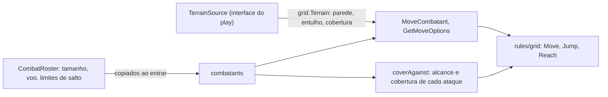
```mermaid
flowchart LR
    Terr["TerrainSource (interface do play)"] -->|"grid.Terrain: parede, entulho, cobertura"| Move
    Roster["CombatRoster: tamanho, voo, limites de salto"] -->|"copiados ao entrar"| Comb["combatants"]
    Comb --> Move["MoveCombatant, GetMoveOptions"]
    Comb --> Cover["coverAgainst: alcance e cobertura de cada ataque"]
    Move --> Grid["rules/grid: Move, Jump, Reach"]
    Cover --> Grid
```

| Peça | O que faz |
| --- | --- |
| `TerrainSource` | `Terrain(ctx, campanha, mapa) (grid.Terrain, error)`, declarada no `play` e implementada pelo `maps` (`Service.Terrain`, em `terrain.go`: a grade e as camadas de parede, terreno difícil e cobertura que o mestre pintou, lidas com os mesmos `gridOf` e `loadLayers` do `GetMapLayers`; sem linha de camadas é piso aberto, um mapa de outra campanha é `not_found`, e a luz não entra). Como as duas se precisam, o `cmd/api` liga uma à outra com `play.Service.SetTerrain` depois de criar o `maps`; uma fonte nula (os testes sem mapa) também é piso aberto. O terreno só vale se a grade dele é a do combate, que foi copiada quando começou: camadas de outra grade, ou um mapa que o mestre apagou, viram piso aberto. |
| `MoveCombatant` | Uma linha reta do quadrado do combatente ao escolhido. O jogador paga o comprimento exato em décimos de pé (`grid.Terrain.Move`) e vê o `TOO_FAR` com o que falta (`missing_dft`); o mestre move de graça. O `grid.Occupants` de cada movimento é montado por `occupantsFor`: os outros combatentes no mapa e vivos, hostis quando o lado é o outro, com o maior tamanho do quadrado; o jogador planeja com os que enxerga, e o movimento real roda com `Terrain.MoveUntil` contra todos: para antes de uma criatura escondida, cobra o custo até ali e responde só `stopped_early` (a fatia 9.4 troca "os que enxerga" por "os que o personagem vê"). Voa quem tem `speed_fly_ft` (a melhor das duas velocidades, sem pagar o entulho); nadar e escalar ficam de fora. |
| `GetMoveOptions` | `Terrain.Reach` para os alcançáveis e `Terrain.Move` para os recusados dentro do círculo, cada um com o motivo (`WALL`, `ENEMY`, `OCCUPIED`, `TOO_COSTLY`). Só do combatente do próprio jogador na vez dele, ou qualquer um para o mestre. |
| Salto | `MoveCombatant` com `jump`: `LONG` usa `Terrain.Jump` (custo = comprimento, sem terreno difícil, sem parede, sem pousar em criatura); `HIGH` gasta os pés sem mover. Os limites vêm de `combat.JumpLimits` (guardados no combatente, e só eles valem: o `GetTurnOptions` os devolve; parado é a metade) e a corrida, de `combat.HasRunningStart` sobre o `last_move_dft`, que soma os movimentos a pé seguidos e é quebrado por ação, ataque, magia ou salto (`breakRun`; o desfazer a devolve). O `GetTurnOptions` os devolve (`TurnOptions.jumps`). O evento `combatant_moved` leva `jump`, `height_dft` e `landing_difficult`; o registro mostra o lembrete da Acrobacia só ao mestre. |
| Lado e tamanho | `combatants.side` (`party` ou `enemy`) e `size`. Os personagens de jogador e as criaturas deles (MR-037) são `party` e os NPCs `enemy`; o mestre troca um NPC com `SetCombatantSide` (evento `side_set`). O tamanho vem da raça do personagem (o `Catalog`), do `BasicSheet.size` (sem valor, Médio) ou, numa criatura, da ficha dela (`CreatureByKey`). Todo combatente ocupa um quadrado, Grande ou não. |
| Alcance | `grid.RangeFt`, os quadrados entre os centros arredondados para baixo vezes 5 ft, em todo lugar onde havia `GridDistanceFt` (`combat_actions.go`, `combat_spells.go`): um vizinho na diagonal está a 5 ft. |
| Cobertura | `coverAgainst`: a maior entre `Terrain.CoverBetween` (com os quadrados das outras criaturas) e a marca do mestre (`SetCombatantCover`, evento `cover_set`, apagada quando o combatente se move). Soma +2 ou +5 na CA do ataque com arma e do ataque de magia e no teste de Destreza da magia; a cobertura total faz `RollAttack` e `CastSpell` recusarem o jogador (`TARGET_COVER_TOTAL`; magia de área não recusa) e a lista de alvos a anota (`TargetInReach.cover`, `cover_source`). A CA com a cobertura (`target_armor_class`, `cover_bonus`) só vai ao mestre; é guardada no dano pendente (`pending_damages.attack_armor_class`, migration `00100`) para o Escudo comparar o golpe com ela mais 5. Uma magia com o tipo `ignores_cover` em `effects/spells.json` (Chama Sagrada, `Content.IgnoresCover`, `link.Spell.IgnoresCover`) não soma cobertura ao teste, mas a recusa de alvo por cobertura total fica. `TargetInReach.untargetable` diz ao app que o jogador não pode escolher o alvo. |
| Desengajar | `standard:disengage` liga `combatants.disengaged`, zerado no começo da vez (`ResetCombatantTurn`) e devolvido pelo desfazer. É a marca que a fatia 9.6b lê para o ataque de oportunidade. |
| Desfazer | `combatant_moved` passou a ser um tipo que o `UndoLastAction` desfaz: o evento guarda de onde o combatente saiu (`from`: quadrado, movimento andado, corrida, marca de cobertura), e o desfazer põe tudo de volta (um salto e a cobertura que o movimento apagou incluídos). |

**Em décimos de pé.** O servidor guarda e cobra o movimento em décimos de pé (`movement_used_dft`, `last_move_dft`; `Combatant.movement_*_dft`, `MovementLeft.*_dft`); os campos em pés continuam preenchidos, arredondados para baixo, para o app publicado. O app publicado só mudou para desenhar o mesmo círculo (`web/src/app/core/combat/combat-grid.ts`, provisório até a fatia 9.15, que passa a desenhar o que o `GetMoveOptions` manda).

**Limites desta fatia, ditos claro.** Não há névoa de guerra (fatia 9.4) nem ataque de oportunidade (9.6b) ainda; nadar e escalar não custam diferente; todo combatente ocupa um quadrado; uma criatura escondida dos jogadores não conta como cobertura para o ataque de um jogador (contaria como "cobertura do mapa" e entregaria que ela está ali); quando o mestre ataca, todas contam. O combate que já estava rodando quando a migration chegou fica sem limites de salto até as pessoas voltarem a entrar (os campos novos têm padrão 0).

### Subir de nível (MR-040)

Três funções puras, em `levelup.go`, dizem o que um nível dá e o que a ficha travada pode mudar na subida (RN-01, RN-12). Como o resto do pacote, não usam banco, relógio nem aleatoriedade: o dado de vida é rolado fora e entra como número.

| Função | O que faz |
| --- | --- |
| `LevelUpOptions(before, classKey, c)` | O que o próximo nível dessa classe dá, em dados que a tela desenha: se tem Aumento de Atributo, o dado de vida e a média, quantos truques e magias novos (e de qual lista, até qual círculo), o novo máximo de preparadas, a subclasse, as opções das features do nível, as perícias e a especialização, e o que muda sozinho (espaços, bônus de proficiência, as features novas, pelo nome). Calculado pelo `Derive` da ficha de antes e da de depois, sem escolhas. |
| `ApplyLevelUp(before, choices, c)` | O `Build` que as escolhas fazem: a classe com um nível a mais e as escolhas somadas. Os PV seguem o método da ficha: a média numa ficha de PV fixos não grava nada; um dado numa ficha de PV fixos passa a "rolados", com a média nos níveis anteriores; numa ficha de dados rolados, a média entra como uma rolagem. Não julga nada. |
| `CheckLevelUp(before, after, c)` | Recusa tudo o que o nível não dá. As únicas diferenças aceitas: uma classe do personagem com um nível a mais; o aumento de atributo, só em nível que tem um (+2 em um ou +1 em dois, nenhum acima de 20); a entrada nova de PV (1 até o dado) com os níveis anteriores iguais; exatamente os truques e as magias conhecidas ou do grimório que a tabela dá (duas por nível no Mago), e magias preparadas novas, nenhuma removida; a subclasse no nível dela; e exatamente as opções, perícias e especialização que as features do nível dão. Tudo o mais (nome, raça, antecedente, valores-base, armadura, escudo, armas, as outras classes) é `locked_field`. No fim, a ficha nova não pode ter uma `Issue` que a de antes não tinha (magia fora da lista da classe ou acima do círculo, preparadas demais): vira `sheet_issue`. |

Cada recusa é um `*LevelUpError` com o campo (`full.cantrip_keys`, com os nomes de campo do proto) e um código de motivo estável (`class`, `max_level`, `locked_field`, `ability_not_due`, `ability_shape`, `ability_above_20`, `hit_points`, `subclass`, `cantrips`, `spells`, `prepared`, `feature_choice`, `skills`, `expertise`, `sheet_issue`), que a tela traduz para o português; nunca se lê a mensagem. O que as opções dizem, e o que a checagem exige, vem dos mesmos números (`levelUpOptionsWith`): o que a subclasse escolhida soma (as três perícias do Colégio do Conhecimento, o truque do Círculo da Terra, as opções das features dela) está na parte de cada subclasse candidata (`LevelUpSubclass`), porque o nível dela ainda não tem subclasse. As invocações novas do Bruxo vêm da coluna `invocations_known` da tabela da classe (níveis 2, 5, 7, 9, 12, 15 e 18, como na tabela do SRD; o snapshot do 5e-database erra os níveis 4 e 6, e a correção está em `effects/corrections.json`), e os Segredos Mágicos do Bardo (níveis 10, 14 e 18) deixam duas das magias novas virem da lista de qualquer classe (`AnyClassSpells`; o `Derive` também deixa de marcar essas magias como fora da lista). **O que não é coberto, de propósito, e o mestre acrescenta pelo editor** (`MasterAdds` lista as do nível): o Arcana Mística do Bruxo (11, 13, 15 e 17), a Maestria de Magia e a Magia Característica do Mago (18 e 20), os Segredos Mágicos Adicionais do Colégio do Conhecimento (6) e os inimigos e terrenos favoritos do Patrulheiro; multiclasse e subclasse própria; e **trocar uma magia conhecida por outra**, que o SRD permite a Bardo, Patrulheiro, Feiticeiro e Bruxo ao subir de nível (a subida só acrescenta, nunca remove). Uma chave repetida em qualquer lista é recusada. O `TestLevelUpSweep` sobe as 12 classes de 1 a 20, com cada subclasse do SRD, fazendo exatamente o que as opções pedem, e confere que a checagem, o `Validate` e o `Derive` aceitam cada passo sem nenhuma `Issue`. Testes: `TestLevelUpPensantus` (Mago 3 para 4, os números do golden: Int 18 para 20, PV 23 para 30, ou 34 com Constituição, CD 14 para 15, preparadas 7 para 9, truques 3 para 4, grimório 10 para 12, espaços do 2º círculo 2 para 3), `TestLevelUpToren` (Guerreiro 3 para 4 com aumento, e 4 para 5 sem nada a escolher), o Clérigo (prepara sem grimório), o Feiticeiro (magias conhecidas e metamagia), a subclasse, os PV rolados e `TestLevelUpRefusals`, uma linha por recusa.

### Fórmulas no Expr, com sandbox

As fórmulas dos efeitos rodam no Expr (`github.com/expr-lang/expr`), pinado em `v1.17.8`, nunca abaixo de `v1.17.7` (CVE-2025-68156). Como o conteúdo da mesa (homebrew) vai ser entrada não confiável, o pacote `rules/formula` fecha o Expr em camadas:

- **Ambiente fechado e tipado.** A fórmula só enxerga `level()`, `classLevel("wizard")`, `mod("int")`, `score("int")`, `prof()`, `armor()` e `shield()`. Nenhuma dessas funções acessa banco, rede, relógio ou aleatoriedade, e um nome desconhecido é erro de compilação.
- **Sem builtins.** `DisableAllBuiltins` desliga todos; só `floor`, `ceil`, `min` e `max` voltam, como funções nossas de duas linhas, com tipos fixos.
- **Lista branca antes de compilar.** A árvore da fórmula só pode ter números, verdadeiro/falso, aritmética, comparações, `and`/`or`/`not`, o ternário e chamadas às funções acima, com argumentos de texto literais e conhecidos (as 6 habilidades, as classes, as categorias de armadura). Ranges (`1..1000000` aloca memória mesmo sem builtins), `in`, `matches`, pipes, `??`, `let`, acesso a membros, listas, mapas e closures são recusados.
- **Limites.** No máximo 256 bytes e 64 nós; números literais até 1.000 e resultados até 10.000. A compilação acontece uma vez, ao carregar o conteúdo, nunca numa requisição.
- **Execução que não derruba o servidor.** Um erro em tempo de execução (um `%` por zero) vira uma `Issue` e o efeito é ignorado. A execução também é protegida por `recover`.
- **Testes.** Um teste tenta cada construção proibida, e um fuzz (`FuzzCompileFormula`) alimenta o compilador com entrada aleatória.

O SRD 5.1 é CC-BY-4.0: a atribuição exata fica no `NOTICE`, em `srd51.Attribution` e na página "Créditos"; um teste confere que são o mesmo texto.

## Módulo characters: personagens e fichas

O jogador cria o próprio personagem e o mestre cria os NPCs; a ficha volta com os números calculados pelo servidor (MR-003, MR-004, MR-005, MR-006). O personagem de quem entrou por um convite com aprovação espera o mestre aprovar ou recusar (MR-024, RN-15). O código fica em `backend/internal/characters`, e as tabelas estão em [Modelo de dados](dados.md#esquema-implementado).

- **A ficha guarda escolhas, não números.** `CharacterSheet` é uma ficha completa (`FullSheet`: jogador, inimigo e boss) ou básica (`BasicSheet`: minion e NPC de história). A completa guarda chaves de conteúdo, como `class:wizard`; toda escrita passa por `rules.Validate`, e toda leitura por `rules.Derive`, que devolve o `DerivedSheet` (ver [Módulo rules](#módulo-rules-regras-como-dados)). O navegador nunca calcula uma regra.
- **O NPC dá XP (MR-016).** `FullSheet` (inimigo, chefe) e `BasicSheet` (lacaio) têm `challenge_rating` ("0", "1/8", ... "30" ou vazio) e `xp_value` (0 a 1.000.000). A ficha de um jogador recusa os dois com `invalid_argument`. O servidor guarda o que recebe: quem preenche o XP a partir do nível é o editor. O `characters` também soma e subtrai o XP da ficha a pedido do `progression` e diz, em `GetCharacter`, se o personagem pode subir de nível (ver [Módulo progression](#módulo-progression-xp-e-marcos)).
- **O retrato do NPC (MR-031).** `FullSheet` e `BasicSheet` têm `portrait_image_id`: uma imagem da galeria da campanha, conferida pelo `Gallery` (ver [NPCs em cena](#npcs-em-cena-o-palco)). A ficha de um jogador recusa o campo com `invalid_argument`. O campo mora no JSON da ficha, sem migration.
- **A história é à parte** (`CharacterStory`: personalidade, aparência, história, aliados), com a própria trava e a própria chamada (`UpdateCharacterStory`).
- **Revisão.** Ficha e história dividem uma `revision`. Quem salva manda a revisão que leu; se a ficha mudou nesse meio-tempo, a resposta é `aborted` e nada muda.
- **Notas do mestre** ficam numa tabela à parte e só saem por `GetMasterNotes`. Nenhuma outra resposta as carrega (RN-11), e um teste confere cada resposta que o jogador pode pedir.

| Chamada | Mestre | Dono (jogador) | Outro jogador | Não membro | Anônimo | Membro pendente (RN-15) |
| --- | --- | --- | --- | --- | --- | --- |
| `CreateCharacter`, tipo jogador | `permission_denied` | Sim; `failed_precondition` se já tem um vivo (RN-03) | Sim, o próprio | `not_found` | `unauthenticated` | Sim, um só, que nasce pendente |
| `CreateCharacter`, NPC | Sim | `permission_denied` | `permission_denied` | `not_found` | `unauthenticated` | `permission_denied` |
| `GetCharacter`, `UpdateCharacter`, `UpdateCharacterStory` do personagem do jogador | Sim | Sim, dentro das travas abaixo | `not_found` | `not_found` | `unauthenticated` | Só o próprio personagem pendente |
| `GetCharacter`, `UpdateCharacter`, `UpdateCharacterStory` de um NPC | Sim | `not_found` | `not_found` | `not_found` | `unauthenticated` | `not_found` |
| `ListCharacters` | Todos, NPCs e pendentes incluídos | Só os próprios | Só os próprios | `not_found` | `unauthenticated` | Só o próprio pendente |
| `SetStoryEditing`, `MarkCharacterDead` (só personagem de jogador) | Sim | `permission_denied` | `permission_denied` | `not_found` | `unauthenticated` | `not_found` |
| `ApproveCharacter`, `RejectCharacter` (só personagem de jogador) | Sim | `permission_denied` | `permission_denied` | `not_found` | `unauthenticated` | `not_found` |
| `GetMasterNotes`, `UpdateMasterNotes` | Sim | `permission_denied` | `permission_denied` | `not_found` | `unauthenticated` | `not_found` |
| `GetLevelUpOptions`, `PreviewLevelUp` (só enquanto `can_level_up`) | Sim | Sim | `not_found` | `not_found` | `unauthenticated` | `not_found` |
| `RollLevelUpHitPoints`, `LevelUpCharacter` (só enquanto `can_level_up`) | `permission_denied` | Sim | `not_found` | `not_found` | `unauthenticated` | `not_found` |
| `ListLevelUps` | Sim | `permission_denied` | `permission_denied` | `not_found` | `unauthenticated` | `not_found` |
| `ContentService.ListContent`, `GetSpellDetails` | Sim | Sim | Sim | `not_found` | `unauthenticated` | Sim |
| `ContentService.ListCreatures`, `GetCreature`, `ListTrapPresets`, `ListLightPresets` | Sim | Sim | Sim | `not_found` | `unauthenticated` | `not_found` |

Um membro que não pode ver um personagem (o de outro jogador, ou qualquer NPC para um jogador) recebe `not_found`, com a mesma mensagem de um personagem que não existe; assim ninguém descobre IDs de NPC. O teste `TestAuthorizationMatrix` chama cada método como cada um dos seis e falha se um método novo aparecer sem linha na tabela.

**As travas do jogador (RN-01).** O dono edita a ficha enquanto ela é rascunho, ou enquanto espera a aprovação do mestre (pendente, MR-024). Depois que uma sessão começa, a ficha trava; a história também, e o jogador só a edita enquanto o mestre libera (`SetStoryEditing`), até a próxima sessão começar. O mestre edita tudo, sempre. Os números calculados nunca são editáveis.

| Motivo (`CharacterBlockedReason`) | Quando |
| --- | --- |
| `SHEET_LOCKED` | O jogador tenta editar a ficha depois que uma sessão começou. |
| `CHARACTER_DEAD` | O jogador tenta editar a ficha de um personagem morto (RN-03). |
| `LIVING_CHARACTER_EXISTS` | O jogador tenta criar um segundo personagem vivo na campanha (RN-03). O detalhe traz o ID do personagem vivo. |
| `STORY_LOCKED` | O jogador tenta editar a história de um personagem travado ou morto sem a liberação do mestre. |
| `NOT_PENDING` | O mestre tenta recusar um personagem que não espera aprovação (MR-024): aprovado, o personagem fica na campanha. |
| `AWAITING_APPROVAL` | O mestre tenta marcar como morto um personagem que ainda espera aprovação (MR-024): ele aprova ou recusa antes. Também vale nas chamadas do subir de nível. |
| `CANNOT_LEVEL_UP` | Uma chamada do subir de nível guiado (MR-040) num personagem que não "Pode subir de nível" (RN-12), que é NPC ou que está no nível 20. Um personagem morto responde `CHARACTER_DEAD`. |
| `DICE_FORCED_PHYSICAL` | `RollLevelUpHitPoints`, ou `LevelUpCharacter` com o dado rolado no app, numa campanha em que todos rolam dado físico (RN-18). |
| `DICE_FORCED_IN_APP` | `LevelUpCharacter` com o dado físico digitado, numa campanha em que todos rolam no app (RN-18). |

Esses motivos vêm no detalhe `CharacterBlocked` do `failed_precondition`, e ganham de uma revisão velha: tentar de novo não resolveria. Um `invalid_argument` diz o campo, com o caminho do proto (por exemplo, `sheet.full.base_scores.intelligence`), e nunca repete o que a pessoa digitou.

**A ficha básica (NPC) rola iniciativa e ataca com dados de verdade.** `BasicSheet` guarda `initiative_bonus` (−10 a +20) e até 3 `BasicAttack`: nome (1 a 40 caracteres), bônus de ataque (−10 a +20), dados do dano (1 a 20 dados de 4, 6, 8, 10 ou 12 faces), bônus do dano (−20 a +40), tipo de dano (`DamageType`, os 13 do SRD) e alcance em pés (0 a 600; 0 é corpo a corpo, 1,5 m). O alcance está na API, mas a tela ainda não tem campo para ele: ela devolve o valor como veio. Cada erro é um `invalid_argument` com o caminho do campo (`sheet.basic.attacks[1].damage_dice_sides`). Os campos antigos `attack_bonus` e `damage` (texto livre, como "1d6+2 cortante") ficam no `.proto` só para ler fichas salvas antes da Etapa 6. **A conversão acontece na leitura, sem migration:** `loadSheet` chama `upgradeLegacyAttack` (`legacy_attack.go`), uma função pura que lê "NdS+K tipo", em português ou inglês, e a transforma num ataque chamado "Ataque" com o bônus antigo, zerando os campos antigos. Se o texto não for lido (sem tipo, dado inválido, número fora do limite), os campos antigos continuam como estão e a tela mostra "Dano antigo: …" para o mestre refazer. O JSON guardado só muda quando o mestre salva de novo, e quem salva com ataques tem os campos antigos limpos pelo servidor (`cleanBasicSheet`); sem ataques, o texto antigo é mantido, para salvar nunca apagá-lo. Uma migration de dados não ganharia nada: a leitura é barata, vale para todo leitor (ficha, sessão, combate) e não tem como deixar uma ficha pela metade.

**Texto livre.** O servidor tira espaços das pontas; campos de uma linha recusam quebra de linha e caracteres de controle, e os de várias linhas aceitam quebra de linha e tabulação. Os limites, em caracteres, estão nos comentários de `characters.proto`.

**Respostas e GET.** Como no `campaigns`: toda resposta, inclusive os erros, sai com `Cache-Control: no-store`, e toda leitura leva um ID, então é `IDEMPOTENT` e só aceita POST.

**Por que o `ContentService` fica aqui.** A ADR-0008 põe o conteúdo da mesa no `campaigns`. Na Etapa 4 o conteúdo é só o SRD embutido no `rules`, sem nada no banco, então o catálogo é montado uma vez na partida e servido pelo `characters`. A requisição já leva o `campaign_id`, porque o conteúdo da mesa vai ser por campanha (decidido pelo Samuel em 29/09/2026). Cada classe que conjura leva, em `ClassSpellcasting.max_spell_level_by_level`, o maior círculo de magia que ela alcança em cada nível (calculado a partir dos espaços de magia da tabela da classe, com `rules.MaxSpellLevelFromSlots`), e o editor só filtra as listas de magias por essa tabela; quem valida de verdade, ao salvar, continua sendo o servidor.

### Aprovar ou recusar o personagem

O personagem criado por um [membro pendente](#membro-pendente) nasce `CHARACTER_STATE_PENDING` (RN-15, MR-024). O jogador edita a ficha e a história enquanto espera; a sessão de jogo não o trava, e ele não morre. O mestre o vê em "Esperando aprovação", na seção "Personagens" da campanha, abre a ficha e decide:

- **`ApproveCharacter`**: o personagem vira rascunho (RN-01 vale como sempre: trava na próxima sessão), e a participação do jogador vira ativa. Aprovar de novo, ou aprovar um personagem que nunca esperou, não muda nada.
- **`RejectCharacter`**: o personagem é apagado, com a história e as notas do mestre, e a participação pendente também. O jogador não vê mais a campanha e precisa de um convite novo. Só vale para personagem pendente; para os outros, `failed_precondition` (`NOT_PENDING`).

As duas mexem em duas tabelas de dois módulos, numa transação só: o `characters` muda o personagem e pede ao `campaigns` para mudar a participação, pela interface `characters.PendingMembers` (`ActivatePendingMember` e `DeletePendingMember`), que o `campaigns.Service` implementa e o `cmd/api` liga, como o `play` faz com o `SheetLocker`. Nenhum dos dois pacotes importa o outro. As duas travam a linha do personagem primeiro (`SELECT ... FOR UPDATE`), então uma aprovação e uma recusa ao mesmo tempo acontecem uma depois da outra: a segunda encontra o personagem já ativo (a recusa recebe `failed_precondition`) ou já apagado (a aprovação recebe `not_found`), nunca metade de cada (`TestRN15_ApproveAndRejectRace`).

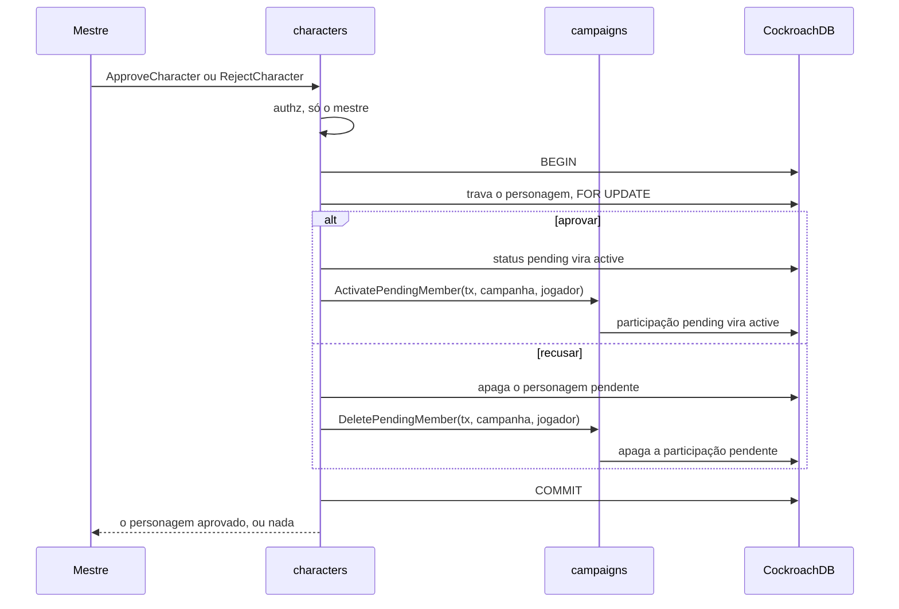
```mermaid
sequenceDiagram
    participant M as Mestre
    participant C as characters
    participant K as campaigns
    participant DB as CockroachDB
    M->>C: ApproveCharacter ou RejectCharacter
    C->>C: authz, só o mestre
    C->>DB: BEGIN
    C->>DB: trava o personagem, FOR UPDATE
    alt aprovar
        C->>DB: status pending vira active
        C->>K: ActivatePendingMember(tx, campanha, jogador)
        K->>DB: participação pending vira active
    else recusar
        C->>DB: apaga o personagem pendente
        C->>K: DeletePendingMember(tx, campanha, jogador)
        K->>DB: apaga a participação pendente
    end
    C->>DB: COMMIT
    C-->>M: o personagem aprovado, ou nada
```

Na tela, a ficha pendente mostra ao jogador "Esperando a aprovação do mestre", e ao mestre os botões "Aprovar personagem" e "Recusar personagem"; recusar pede uma confirmação ("Confirmar recusa"), porque apaga o personagem de vez.

### Subir de nível pela ficha (MR-040)

O jogador sobe o personagem de nível pela ficha travada, só enquanto `can_level_up` é verdadeiro (RN-01, RN-12; pergunta 48 do Samuel). O módulo `characters` faz a parte que precisa de banco; o que um nível dá e o que a ficha pode mudar é do `rules` (ver [Subir de nível](#subir-de-nível-mr-040)). Cinco chamadas do `CharacterService`, na tabela de quem pode acima:

- **`GetLevelUpOptions`** (leitura, `IDEMPOTENT`): o `LevelUpOptions` da classe (a primeira, se `class_key` vier vazio) com os nomes em português, a regra de dado da campanha (`dice_rule`) e o dado que o servidor já rolou, se houver (`kept_hit_point_roll`). Para o mestre e para o dono.
- **`PreviewLevelUp`** (leitura, `IDEMPOTENT`): a ficha derivada de depois, com as escolhas aplicadas, e a primeira recusa, se houver (`LevelUpRefusal`, como dado, não como erro). É o "Resumo", o antes e o depois: o app web não tem o motor de regras, então o servidor faz as contas, inclusive o novo máximo de preparadas depois de um aumento de atributo. Não grava nada.
- **`RollLevelUpHitPoints`**: o servidor rola o dado de vida da classe com `platform/dice` e guarda o resultado em `character_level_up_rolls`, por personagem e nível (não por classe: um personagem de duas classes rola uma vez só por nível). Chamar de novo, com a mesma chave ou outra, devolve a mesma rolagem (`already_rolled`); pedir para outra classe é recusado (`HIT_POINT_ROLL_OTHER_CLASS`). A campanha que força dado físico a recusa (`DICE_FORCED_PHYSICAL`). Só o dono.
- **`LevelUpCharacter`**: recebe a revisão e as escolhas, monta a ficha nova a partir da guardada (o cliente nunca manda a ficha), roda `rules.Validate` (`invalid_argument` para o que é malformado, como uma chave que não existe) e `rules.CheckLevelUp` (`failed_precondition` com o detalhe `LevelUpRefusal`: o campo e o motivo), e grava, na mesma transação, a ficha (com a checagem de revisão, `aborted` se velha) e o registro em `character_level_ups`, e apaga o dado usado. A ordem das recusas: personagem morto ou pendente, revisão velha, "não pode subir de nível", a ficha guardada que já não passa nas regras de hoje (`SHEET_NEEDS_MASTER`: nenhuma escolha a conserta, o mestre corrige pelo editor), dado, regras. Só o dono; o mestre continua com o editor (`permission_denied`). Depois da gravação publica o `xp_changed`.
- **`ListLevelUps`** (leitura, `IDEMPOTENT`): o "O que mudou" do mestre: as subidas da campanha, ou de um personagem (`character_id`), da mais nova à mais antiga, em páginas (`page_size` 1 a 50, `page_token` opaco, como o histórico de XP), cada uma com o jogador, a classe, o nível de antes e o de depois, as escolhas (`LevelUpChoices`, com o valor que os PV tomaram), os nomes em português de cada chave e a hora. É a leitura **menor** que desenha o estado 6 da tela `E8-15`: o mestre é avisado pelo stream e lê a lista, sem aprovação nem veto (pergunta 66, decidida em 04/10/2026). Só o mestre.

**Dado e RN-18.** A regra da campanha vem do `campaigns` pela interface `characters.DiceRules`, ligada em `cmd/api` (o mesmo desenho do `play.DiceModes`): `FORCED_PHYSICAL` recusa o dado do app, `FORCED_IN_APP` recusa o número digitado, e com "cada jogador escolhe" vale o de cada rolagem (a preferência salva só diz qual opção a tela destaca). O dado digitado é um número de 1 até o dado da classe; fora disso é `HIT_POINTS`.

**Ao vivo.** A subida reaproveita o aviso que a ficha e a lista já escutam, o `xp_changed` (o campo 14 do stream, sem conteúdo): ele já significa "leia o XP e os níveis de novo", e a subida muda exatamente isso (o nível da ficha e o `can_level_up`). O `characters` chama `PublishXPChanged` pela interface `characters.Live`, que o `play` implementa e `cmd/api` liga; só o comentário do campo mudou. Não ocupa o campo 20.

**O registro e o "pode subir" que some.** Nada precisa limpar o `can_level_up`: ele vem do XP da ficha e da marca de marco, e o nível na ficha mudou (ver [RN-12](produto/regras.md)). A subida não mexe no XP: a campanha por XP deixa de pedir o nível quando o XP não alcança o próximo, e a por marcos quando o nível passa o da marca. O `TestMR040_CanLevelUpClearsAfterwards` confere os dois.

### A tela do subir de nível (MR-040, fatia 8.15)

A página `/campanhas/:id/personagens/:characterId/subir-de-nivel` (rota preguiçosa, `pages/level-up`) é só um cliente das cinco chamadas acima: o navegador não calcula regra (ADR-0008). `core/levelup` guarda a parte sem tela: `LevelUpClient` (as chamadas, mais o conteúdo e a preferência de dados da campanha), `levelup-flow.ts` (os passos de cada nível e as listas dos seletores, que vêm do servidor e do conteúdo), `LevelUpDraft` (as escolhas em signals, o que falta e o `LevelUpChoices` a enviar), `levelup-summary.ts` (as linhas "antes → depois", das duas fichas derivadas), `levelup-errors.ts` (as recusas por código e motivo, nunca por mensagem) e `LevelUpFeed` (a leitura do mestre).

- **A cada escolha** o `LevelUpPreview` chama o `PreviewLevelUp` (com 150 ms de calma; a resposta ultrapassada por uma mais nova é descartada) e a tela lê dele o "O que muda", o novo máximo de preparadas e a primeira recusa (o teto de 20 dos atributos é dela: a tela só mostra o motivo). Com o dado de vida rolado, chama também com a média, para o cartão "Média: 4" mostrar a vida com ela. A tela não faz conta de regra: mostra os números do servidor e os termos ("4 + Constituição +3").
- **Os passos:** Atributos, Vida, Magias e Resumo; o passo sem escolha não existe. "Escolhas" (subclasse, opções das features, perícias, especialização) entra antes de Magias, porque a subclasse pode dar truques.
- **Salvar** é uma chamada só, `LevelUpCharacter`, no "Confirmar o nível N", com a revisão lida. `aborted` (revisão velha) e `LevelUpRefusal` aparecem no lugar; a confirmação volta à ficha pelo estado da navegação (nunca Web Storage), e a ficha o tira do histórico depois de ler, então um recarregamento não mostra o aviso de novo. "Ler a ficha de novo" depois de uma revisão velha refaz a sessão com a ficha e as opções novas e leva junto as escolhas que ainda valem.
- **O mestre:** o `LevelUpFeed` lê `ListLevelUps` na campanha (uma página de 50) e a lista lê todas as páginas e a página lê de novo no `xp_changed` quando a campanha tem sessão aberta (`XpWatcher`, o mesmo cliente do stream da ficha). "Recente" é "confirmada nas últimas 24 horas", sem guardar nada no navegador; dispensar o aviso vale até recarregar.

## Módulo play: sessões de jogo

O `play` inicia, encerra e lista as sessões de jogo de uma campanha, o que trava as fichas (RN-01, Etapa 4), e cuida da sessão ao vivo (Etapa 5): o aviso de que a sessão começou (RN-06), o stream da sessão (ADR-0005) e a correção do mestre nos PV, nos espaços de magia e nos dados de vida (RN-02), cada uma registrada em `session_events` (ADR-0007). Desde a Etapa 6 ele também roda o combate: o encontro, quem luta, a iniciativa, a ordem dos turnos e o movimento na grade (MR-013), e o que se faz num turno: as opções, o ataque em dois passos, o dano, as ações padrão, o desfazer e o registro (MR-012, MR-014, [Combate](#combate)); as magias, as reações, os testes contra a morte e as condições vêm na fatia seguinte. O código fica em `backend/internal/play`.

| Chamada do `PlayService` | Quem pode | Erros próprios |
| --- | --- | --- |
| `StartGameSession` | O mestre da campanha | `failed_precondition` (`SESSION_ALREADY_OPEN`) se já há uma sessão aberta |
| `EndGameSession` | O mestre da campanha | `not_found` se a sessão não é da campanha. Encerrar de novo não é erro: devolve a sessão como está |
| `ListGameSessions` | Membros da campanha | — |
| `ListOpenGameSessions` | Qualquer pessoa logada; cada um vê só as campanhas em que é membro ativo | — |
| `GetLiveSession`, `WatchGameSession` | Membros da campanha | `failed_precondition` (`NO_OPEN_SESSION`) sem sessão aberta |
| `AdjustCharacterVitals` | O mestre da campanha, durante a sessão | `failed_precondition` (`NO_OPEN_SESSION`); `not_found` se o personagem não é um personagem de jogador vivo da campanha; `invalid_argument` fora de 0 até o máximo |
| `SetCurrentMap` | O mestre da campanha, durante a sessão | `failed_precondition` (`NO_OPEN_SESSION`); `not_found` se o mapa não é da campanha |
| `SetShownImage` | O mestre da campanha, durante a sessão | `failed_precondition` (`NO_OPEN_SESSION`); `not_found` se a imagem não é da galeria da campanha |
| `OpenScene` | O mestre da campanha, durante a sessão (abrir outra cena esvazia o palco) | `failed_precondition` (`NO_OPEN_SESSION`); `not_found` se o ponto não é um ponto de cena da campanha. Qualquer ponto de cena abre, mesmo sem ações (pergunta 63); abrir descobre a cena (MR-030) |
| `CloseScene` | O mestre da campanha, durante a sessão | `failed_precondition` (`NO_OPEN_SESSION`). Sem cena aberta, não muda nada; fechar esvazia o palco |
| `GetOpenScene` | Membros da campanha | `failed_precondition` (`NO_OPEN_SESSION`) |
| `RollSceneCheck` | Um jogador, com personagem vivo, durante a sessão | `permission_denied` para o mestre; `failed_precondition` (`NO_OPEN_SESSION`, ou `SceneBlocked`: `NO_OPEN_SCENE`, `ALREADY_ROLLED` (sem tentativa sobrando), `WRONG_DICE_MODE`, `NO_CHARACTER`); `not_found` se a ação não é da cena aberta; `invalid_argument` para um d20 fora de 1 a 20 |
| `GrantSceneAttempt` | O mestre da campanha, durante a sessão | `failed_precondition` (`NO_OPEN_SESSION`; `SceneBlocked`: `NO_OPEN_SCENE`); `not_found` se a ação não é da cena aberta ou o personagem não é um personagem de jogador vivo da campanha; `invalid_argument` para uma chave que não é UUID, ou já usada por outra mudança. Numa ação sem limite não muda nada |
| `GetSessionSummary` | Membros da campanha | `not_found` se a sessão não é da campanha; `failed_precondition` (`GameSessionBlocked`: `SESSION_NOT_ENDED`) para uma sessão ainda aberta. Ver [Resumo da sessão](#resumo-da-sessão) |
| `PutOnStage` | O mestre da campanha, durante a sessão | `failed_precondition` (`NO_OPEN_SESSION`; `SceneBlocked`: `NO_OPEN_SCENE`, `STAGE_FULL` com 4 em cena); `not_found` se o personagem não é um NPC vivo da campanha (ou o ID não é um UUID). O NPC que já está em cena não muda nada |
| `TakeOffStage` | O mestre da campanha, durante a sessão | `failed_precondition` (`NO_OPEN_SESSION`). O NPC que não está em cena não muda nada |
| `SetSpeaker` | O mestre da campanha, durante a sessão | `failed_precondition` (`NO_OPEN_SESSION`); `not_found` se o NPC não está em cena. O `character_id` vazio tira a fala de todos |
| `ListLeftImages` | Membros da campanha, com ou sem sessão aberta | — |
| `TakeBackLeftImage` | O mestre da campanha, com ou sem sessão aberta | `not_found` se a imagem não está na lista de imagens deixadas |

O membro pendente (RN-15) recebe `not_found` em tudo que pede campanha, como quem não é membro; `TestAuthorizationMatrix` tem uma coluna para ele.

**Como o `play` e o `characters` se encontram.** Iniciar uma sessão trava as fichas na mesma transação que abre a sessão. O `play` não mexe na tabela `characters`: ele declara uma interface, `SheetLocker`, que o `characters.Service` implementa com `LockSheets`, e o `cmd/api` liga os dois. Nenhum dos dois pacotes importa o outro. `LockSheets` não recebe quem está chamando: é "o sistema" da RN-01, e só o `play` o chama, depois de conferir que quem chama é o mestre.

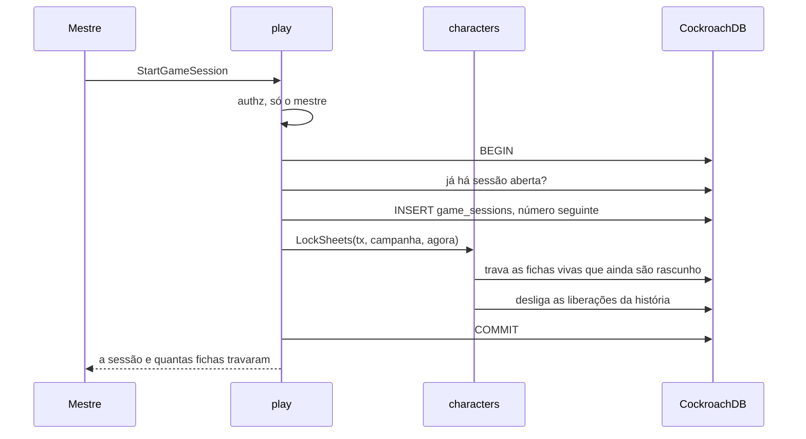
```mermaid
sequenceDiagram
    participant M as Mestre
    participant P as play
    participant C as characters
    participant DB as CockroachDB
    M->>P: StartGameSession
    P->>P: authz, só o mestre
    P->>DB: BEGIN
    P->>DB: já há sessão aberta?
    P->>DB: INSERT game_sessions, número seguinte
    P->>C: LockSheets(tx, campanha, agora)
    C->>DB: trava as fichas vivas que ainda são rascunho
    C->>DB: desliga as liberações da história
    P->>DB: COMMIT
    P-->>M: a sessão e quantas fichas travaram
```

- **Uma sessão aberta por campanha.** A checagem dentro da transação dá o erro claro; um índice único parcial garante a regra quando duas chamadas correm juntas.
- **O personagem criado depois** da primeira sessão fica rascunho até a próxima começar, porque `LockSheets` roda em todo início de sessão, não só no primeiro.
- **Encerrar não destrava nada.** A ficha continua travada entre as sessões.

### Sessão ao vivo

O jogador fica sabendo da sessão por uma consulta leve, e acompanha a sessão por um stream que só existe enquanto ele está com a página da sessão aberta e visível (ADR-0005).

- **O aviso (RN-06) é uma consulta, não um stream.** Com a aba visível e a pessoa logada, o app chama `ListOpenGameSessions` a cada 30 segundos, e uma vez quando a aba volta a ficar visível. A resposta traz as sessões abertas das campanhas em que a pessoa é membro ativo, com o nome da campanha e o papel dela; uma sessão nova vira o aviso "A sessão 3 de Mirathel começou" com o link. São duas leituras por índice (as campanhas da pessoa, pelo `campaigns`, e as sessões abertas delas, pelo índice parcial de `game_sessions`), e o Cloud Run só cobra o tempo da requisição.
- **O link da sessão** é `/campanhas/<id>/sessao`, sem segredo (RN-07). Quem decide é o servidor: sem login, `unauthenticated`, e o app manda para o login; quem não é membro, ou é membro pendente, recebe `not_found` (a tela mostra "Peça um convite ao mestre", sem o nome da campanha); sem sessão aberta, `failed_precondition` com `GameSessionBlocked` e o motivo `NO_OPEN_SESSION` (a tela mostra "Nenhuma sessão em andamento").
- **O stream** (`WatchGameSession`) manda primeiro `ready`, depois de registrar a assinatura. Só então o app lê a foto da sessão (`GetLiveSession`), então nenhuma mudança cai no intervalo entre a foto e o stream. Uma mudança pode chegar antes da foto: a `revision` das `CharacterVitals` diz qual é a mais nova. Depois vêm `heartbeat` a cada 25 segundos, `vitals_changed`, os eventos dos mapas (`current_map_changed`, `map_changed`, `token_moved`, ver [Os mapas na sessão ao vivo](#os-mapas-na-sessão-ao-vivo)), `shown_image_changed`, `left_images_changed`, os eventos do combate (`encounter_changed`, `turn_changed`, `combatant_moved`, `combat_log_changed`, ver [Combate](#combate)), `xp_changed` (o XP da campanha mudou, ver [Módulo progression](#módulo-progression-xp-e-marcos)) e `session_ended`.

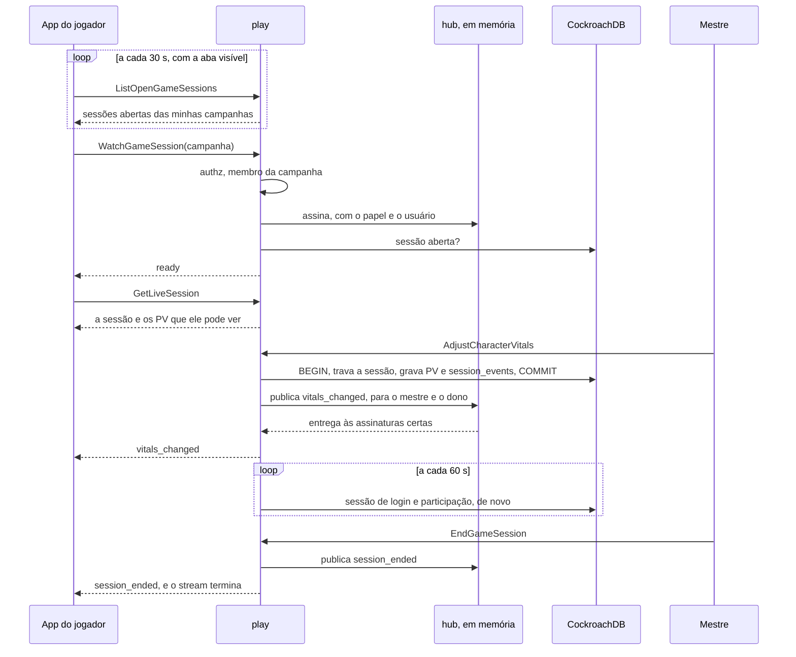
```mermaid
sequenceDiagram
    participant J as App do jogador
    participant P as play
    participant H as hub, em memória
    participant DB as CockroachDB
    participant M as Mestre
    loop a cada 30 s, com a aba visível
        J->>P: ListOpenGameSessions
        P-->>J: sessões abertas das minhas campanhas
    end
    J->>P: WatchGameSession(campanha)
    P->>P: authz, membro da campanha
    P->>H: assina, com o papel e o usuário
    P->>DB: sessão aberta?
    P-->>J: ready
    J->>P: GetLiveSession
    P-->>J: a sessão e os PV que ele pode ver
    M->>P: AdjustCharacterVitals
    P->>DB: BEGIN, trava a sessão, grava PV e session_events, COMMIT
    P->>H: publica vitals_changed, para o mestre e o dono
    H-->>P: entrega às assinaturas certas
    P-->>J: vitals_changed
    loop a cada 60 s
        P->>DB: sessão de login e participação, de novo
    end
    M->>P: EndGameSession
    P->>H: publica session_ended
    P-->>J: session_ended, e o stream termina
```

**Quem vê o quê.** O mestre vê as `CharacterVitals` de todo personagem de jogador vivo da campanha; o jogador, só as do próprio personagem, na foto e no stream (decidido em 02/10/2026, pergunta 28). O filtro roda no servidor: cada evento publicado leva a própria audiência (todos, o mestre, ou um usuário), e o hub só entrega às assinaturas dela. `TestPlayersSeeOnlyTheirOwnVitals` confere a foto e o stream, e `TestRN11_LiveSessionNeverCarriesMasterNotes` confere que nada da sessão ao vivo carrega as notas do mestre.

**Quando o stream termina.**

| Quando | Como termina | O que o app faz |
| --- | --- | --- |
| O mestre encerra a sessão | `session_ended`, depois fim sem erro | Mostra "Sessão encerrada" |
| 30 minutos de stream | Fim sem erro | Reconecta e lê a foto de novo |
| O servidor vai reiniciar (graceful shutdown) | Fim sem erro, na hora: o `httpserver` chama `play.Service.Close` quando o desligamento começa | Reconecta |
| O app parou de ler e ficou 16 eventos para trás | `unavailable` | Reconecta e lê a foto de novo |
| A sessão de login acabou (logout, revogada, 30 dias) | `unauthenticated`, na checagem seguinte | Manda para o login |
| A pessoa saiu da campanha | `not_found`, na checagem seguinte | "Peça um convite ao mestre" |

O app reconecta com espera crescente (1 s, 2 s, 4 s, até 30 s, com variação aleatória) e só com a aba visível: com a aba escondida por 2 minutos, ele mesmo fecha o stream, e reabre (com a foto nova) quando a aba volta. É o que impede uma aba esquecida de segurar uma conexão aberta (ver [Operação](operacao.md#stream-da-sessão-ao-vivo)).

**No app.** A consulta do aviso fica em `web/src/app/shell/live-notice/open-sessions.ts`, que faz parte do bundle inicial, mas carrega o cliente gerado do `PlayService` só na primeira consulta (um `import()` dinâmico), então o código gerado fica num chunk lazy. A página da sessão (`web/src/app/pages/live-session`) segue as regras acima em `live-stream.ts`, testado com relógio falso. O aviso não aparece na página da própria campanha (o painel "Sessão" já diz), nas páginas de sessão, nem para o mestre da campanha, que foi quem iniciou; o link "Ao vivo" aparece para todos.

**O hub fica em memória, numa instância só.** O pacote `play/live` guarda as assinaturas de cada campanha na memória do servidor. Publicar nunca espera: cada assinatura tem um buffer de 16 eventos, e a que enche é derrubada, em vez de atrasar a mudança do mestre. Com duas instâncias do Cloud Run, a mudança feita numa não chegaria aos streams abertos na outra; por isso o serviço roda com `max-instances = 1` enquanto o fan-out for em memória (ver [Operação](operacao.md)). Quando uma instância não bastar, um canal compartilhado (changefeed do CockroachDB ou Pub/Sub) entra no lugar do hub, e o resto não muda.

**O stream passa pela mesma pilha HTTP.** O log de requisições embrulha a resposta num `statusRecorder` que repassa o `Flush`, o `CrossOriginProtection` recusa POST de outra origem (o stream é um POST com `Content-Type: application/connect+json`, que outro site só mandaria depois de um preflight de CORS), o servidor fala HTTP/1.1 e h2c, e não há `WriteTimeout`. `TestLiveStreamIsNotBuffered` abre o stream pelo servidor de verdade, em HTTP/1.1 e em h2c, com o heartbeat desligado, e confere que `ready` e `vitals_changed` chegam na hora.

### PV, espaços de magia e dados de vida

Os números do personagem que mudam durante o jogo (PV atual, PV temporários, espaços de magia usados por círculo, espaços de pacto usados e dados de vida usados) ficam em `character_vitals`, no módulo `characters`, porque são do personagem e duram de uma sessão para outra (ver [Modelo de dados](dados.md#esquema-implementado)). O `play` os lê e muda pela interface `play.VitalsKeeper` (`ListVitals`, `GetVitals`, `AdjustVitals`), que o `characters.Service` implementa e o `cmd/api` liga, como o `SheetLocker`. As mensagens (`CharacterVitals`) são do `play.proto`, porque só o `PlayService` as serve: o `play` declara a interface e o que passa por ela, e o `characters` só preenche.

- **Os máximos nunca são guardados.** Saem do `rules.Derive`, como todo número da ficha: PV máximo, espaços por círculo, espaços de pacto e dados de vida (o total é o nível). A cada leitura, o valor guardado é cortado no máximo de agora: uma ficha que perdeu nível nunca mostra mais do que tem.
- **Sem linha, o personagem está inteiro:** PV cheio, nada usado, `revision` 0.
- **Só personagens de jogador vivos e ativos** (não NPC, não morto, não pendente). O NPC ganha PV de combate com os combatentes, na Etapa 6.
- **A correção do mestre** (`AdjustCharacterVitals`) troca só os valores que vêm na requisição, cada um de 0 até o máximo (PV temporários até 999). Numa transação só, o `play` trava a linha da sessão aberta (`FOR UPDATE`), confere a chave de idempotência, pede ao `characters` para gravar e grava o evento em `session_events`; só depois do `COMMIT` publica `vitals_changed`.
- **Idempotência.** O app manda um UUID novo a cada correção (`idempotency_key`) e o mesmo numa nova tentativa. Se a chave já está em `session_events`, nada é gravado nem publicado, e a resposta traz os PV como estão agora (`TestAdjustCharacterVitalsIsIdempotent`). A mesma chave para outro personagem é `invalid_argument`.
- **Ordem dos eventos.** O `seq` de cada evento é o seguinte da sessão, lido com a linha da sessão travada, então duas correções ao mesmo tempo esperam uma pela outra e ganham 1, 2, 3, sem buraco e sem repetição (`TestSessionEventsAreOrderedPerSession`). `EndGameSession` trava a mesma linha, então uma correção em andamento termina antes da sessão acabar.

### O que a sessão mostra

A sessão aberta mostra a todos duas coisas, lado a lado e independentes: o mapa atual e uma imagem da galeria que o mestre escolhe mostrar (MR-028), como um retrato ou uma carta. As duas ficam na linha da sessão, em `game_sessions`, e só o mestre as muda, só com a sessão aberta.

| | Mapa atual | Imagem mostrada |
| --- | --- | --- |
| Chamada | `SetCurrentMap(map_id)`, vazio para tirar | `SetShownImage(image_id)`, vazio para parar |
| Coluna | `current_map_id` | `shown_image_id` |
| Revela | O mapa (RN-10): o jogador sempre vê o mapa atual | Nada além da própria imagem, e só enquanto é mostrada |
| Na foto | `GetLiveSession.current_map_id`; o app lê o mapa com `MapService.GetMap` | `GetLiveSession.shown_image` (ID, nome como legenda, tamanho, URLs) |
| No stream | `current_map_changed`, para todos | `shown_image_changed`, para todos |
| Quando é apagado | `DeleteMap` tira da sessão (`SET NULL`) e manda `current_map_changed` vazio | `DeleteGalleryImage` tira da sessão (`SET NULL`) e manda `shown_image_changed` vazio |

- **Uma sessão nova começa sem os dois:** as colunas são da linha da sessão. A sessão encerrada guarda o último, só como registro.
- **Escolher o mapa atual o revela** na mesma transação que trava a linha da sessão. Se o mestre esconder o mapa atual depois, o jogador continua vendo enquanto ele for o atual (`Map.revealed` falso e `Map.current` verdadeiro).
- **A imagem mostrada não abre a galeria.** O jogador recebe o ID da imagem enquanto ela é mostrada, e mais nenhum; depois que o mestre para de mostrar, a rota `GET /images/{id}` responde `404` a ele, mesmo que tenha guardado o ID, a menos que o mestre a tenha deixado com os jogadores (abaixo; ver [Servir as imagens](#servir-as-imagens) e a pergunta 32, respondida em 02/10/2026, da [MR-028](produto/historias.md#mr-028-mostrar-uma-imagem-aos-jogadores)).

#### Imagens deixadas com os jogadores

O mestre pode deixar a imagem mostrada com os jogadores (MR-028, "Deixar com os jogadores"): ela sai da tela, mas continua numa lista que os jogadores veem até o mestre tirá-la. A lista é da campanha, não da sessão: por isso fica na tabela `campaign_left_images` (`campaign_id`, `image_id`, `left_at`; chave primária nas duas primeiras; `CASCADE` na campanha e na imagem da galeria, então apagar a imagem a tira da lista), e não em `game_sessions`, que a perderia quando a sessão acaba. O interruptor da imagem que está à mostra, esse sim, é da sessão: `game_sessions.shown_image_keep` (começa desligado, e volta a desligado quando a imagem mostrada muda).

| Chamada | O que faz |
| --- | --- |
| `SetShownImage(image_id, keep)` | `keep` é o interruptor da imagem mostrada. O mestre liga chamando de novo com a mesma imagem (não manda evento: os jogadores não sabem do interruptor). Com ele ligado, parar de mostrar ou trocar passa a imagem para a lista, na mesma transação que trava a linha da sessão; `EndGameSession` faz o mesmo ao encerrar |
| `ListLeftImages(campaign_id)` | Qualquer membro ativo, com ou sem sessão: a lista, da mais antiga para a mais nova, com as mesmas URLs da imagem mostrada |
| `TakeBackLeftImage(campaign_id, image_id)` | Só o mestre: tira a imagem da lista (ela continua na galeria); `not_found` se não está lá |
| `left_images_changed` (stream) | Uma dica sem conteúdo, a todos: deixou, tirou ou apagou uma imagem deixada. O app lê a lista de novo |

A tabela é do módulo `maps` (a rota das imagens a lê, junto das tabelas dos mapas); o `play` a escreve pela mesma interface `MapKeeper` (`LeaveImage` dentro da transação dele, `ListLeftImages`, `TakeBackImage`). `GetLiveSession.shown_image_keep` diz ao mestre se o interruptor está ligado; o jogador sempre recebe `false`.

**Como o `play` e o `maps` se encontram.** Um precisa do outro, então cada um declara o que precisa, o outro implementa, e o `cmd/api` liga os dois, sem nenhum importar o outro:

- o `play` declara `MapKeeper`: conferir e revelar o mapa atual, dentro da transação do `play`, ler a imagem mostrada e guardar as imagens deixadas com os jogadores. O `maps` implementa com `maps.SessionMaps`, que só precisa do banco;
- o `maps` declara `LiveSession`: qual é o mapa atual e a imagem mostrada, qual é o ponto da cena aberta, e publicar no stream. O `play.Service` implementa com `OnScreen`, `OpenScenePoint` e `Publish`. As mensagens são as do `play.proto`: o `maps` as monta, como o `characters` monta as `CharacterVitals`.

Como o `SessionMaps` não precisa do `play`, o `cmd/api` o cria primeiro, cria o `play` com ele, e só então cria o `maps` com o `play`: nenhum dos dois espera o outro.

### Cenas de RP

Uma cena de RP é um ponto do mapa do tipo `scene` com as ações que o mestre escolheu (MR-015, Etapa 7). As ações moram no `maps` (`scene_actions`, `MapService`); abrir a cena na sessão, rolar e o registro são do `play` (`backend/internal/play/scene.go`). O Samuel decidiu as perguntas 51 a 55 em 03/10/2026 (ver [Perguntas em aberto](produto/perguntas-em-aberto.md#respondidas-em-03102026)): o que está descrito aqui é o que existe, com a CD que o mestre pode mostrar por cena (52) e as tentativas por ação e por jogador (55), feitas no servidor na fatia 8.9 da Etapa 8 e nas telas na fatia 8.14.

- **As ações** (pergunta 51): um teste de perícia, um teste de atributo ou uma salvaguarda, cada um com nome opcional (até 60 caracteres) e CD opcional (1 a 30), no máximo 20 por ponto. O mestre muda uma de cada vez (`AddSceneAction`, `UpdateSceneAction`, `MoveSceneAction`, `RemoveSceneAction`: não há "salvar tudo"), e cada resposta traz a lista como ficou. A chave é conferida no catálogo das regras (`rules.Content.SceneCheckName`, que o `cmd/api` entrega ao `maps` em `Config.Rules`): só perícias, os seis atributos e as seis salvaguardas, então um ataque, uma magia ou uma habilidade de combate dá `invalid_argument`. O `MapPoint` ganha `scene_actions`: o mestre recebe tudo; o jogador, só nos pontos que vê (RN-10), e com a CD só quando o ponto tem `show_dc` ligada (RN-20, pergunta 52). Cada ação tem também `max_attempts` (as tentativas de cada jogador, abaixo), que todos recebem.
- **Mostrar a CD** (pergunta 52, fatia 8.9): `map_points.show_dc`, por cena, desligada por padrão, que o mestre muda com `UpdateMapPoint` (ou `CreateMapPoint`) como os ganchos; só um ponto de cena a tem, e um ponto que deixa de ser cena a perde. Todo membro recebe a chave (`MapPoint.show_dc`, `OpenSceneInfo.show_dc`). Ligada, o jogador recebe `dc` nas ações que têm CD (`SceneActionView` e `SceneAction`) e `passed` nas próprias rolagens; desligada, nada disso, como antes. Uma ação sem CD não mostra nada a mais, e o mestre vê a CD sempre. Mudar a chave com a cena aberta manda `scene_changed` a todos, e o app lê a cena de novo. Cada rolagem guarda no evento se a cena mostrava a CD quando foi feita (`dc_shown`): é essa marca, não a chave de hoje, que o [resumo da sessão](#resumo-da-sessão) conta.
- **Abrir e fechar** (pergunta 53): `OpenScene(point_id)` escolhe um ponto de cena da campanha **qualquer um, mesmo sem ações** (pergunta 63, mudada na Etapa 8: a descrição, as pistas e os NPCs bastam para uma cena; o `SceneBlocked` `NO_ACTIONS` continua no enum, mas o servidor nunca o manda), escondido ou não: abrir um ponto escondido não o revela no mapa, mas **descobre** a cena (`scene_discoveries`, MR-030). Uma cena por vez: abrir outra troca a primeira; abrir a que já está aberta não muda nada. `CloseScene` não pergunta nada. A cena aberta é `game_sessions.open_scene_point_id`; um ponto apagado, ou que deixa de ser de cena, fecha a cena. Cada abertura e cada fechamento vira um `session_events` (`scene_opened`, `scene_closed`).
- **Ler a cena** (`GetOpenScene`, uma chamada própria, não o `GetLiveSession`: ela calcula bônus a partir da ficha, e o app a lê depois do `ready` e de cada `scene_changed`). O nome e a descrição do ponto vão para todos. O **mestre** recebe também os ganchos do ponto e as pistas, cada uma com quem a tem (MR-029); o jogador **nunca** recebe nem um nem outro (RN-20), nem as pistas já reveladas a ele: essas lê nas anotações. O **mestre** recebe as ações com a CD e o limite de tentativas e todas as rolagens, cada uma com quem rolou, o dado e o total, `passed` quando a ação tinha CD e `attempts_left` (quantas tentativas aquele personagem ainda tem naquela ação, para oferecer "Dar mais uma tentativa"). O **jogador** recebe as ações **sem CD** (a não ser que a cena a mostre), cada uma com o bônus e a passiva do próprio personagem vivo (`rules.SceneOptions`, pelo `CombatRoster.SceneOptions`), o limite (`max_attempts`) e as tentativas que **o próprio personagem** ainda tem (`attempts_left`), e só as próprias rolagens, sem `passed` (a não ser que a cena mostre a CD). A passiva só vem em Percepção, Investigação e Intuição. Um jogador sem personagem vivo (ou com ficha básica) recebe as ações sem bônus.
- **Rolar** (`RollSceneCheck`, RN-18, pergunta 55): o jogador rola, com o próprio personagem vivo, uma ação da cena aberta. O servidor rola o d20, ou recebe o d20 digitado (1 a 20) conforme a regra por rolagem do RN-18: um modo forçado pela campanha recusa a outra forma com `WRONG_DICE_MODE`. Total = d20 + o bônus de `SceneOptions`. Cada personagem rola cada ação até o **limite de tentativas** dela (`scene_actions.max_attempts`, pergunta 55: 1 por padrão, de 1 a 5, ou 0 para sem limite; o mestre muda com `UpdateSceneAction`), contando as rolagens e as tentativas dadas (`GrantSceneAttempt`) desde o último `scene_opened`: sem nenhuma sobrando, a rolagem é recusada com `ALREADY_ROLLED` (o nome é do tempo em que o limite era 1; o motivo é o mesmo); fechar e abrir a cena de novo zera todas as contas. Baixar o limite abaixo do que alguém gastou o deixa sem tentativas e não apaga nada (as sobras são `max(limite - rolagens + dadas, 0)`, calculadas a cada leitura dos `session_events`); subir devolve. **"Dar mais uma tentativa"** (`GrantSceneAttempt(action_id, character_id, idempotency_key)`, só o mestre, cena aberta): soma uma tentativa daquele personagem naquela ação nesta abertura, grava o evento `scene_attempt_granted` (só IDs: o ponto e a ação no payload, o personagem no evento) e manda `scene_changed` a todos, o mesmo aviso sem conteúdo; numa ação sem limite não muda nada e não grava. A chave de idempotência repetida não soma outra. Repetir a chamada com a mesma `idempotency_key` devolve a primeira rolagem e não grava nada. A resposta ao jogador é a rolagem com o total; a CD e se passou só vêm quando a cena mostra a CD, e ficam com o mestre se não. O registro do mestre (pergunta 54) é a lista de rolagens do `GetOpenScene`, lida de `session_events`, da mais nova para a mais antiga.
- **O stream.** `scene_changed` (campo 15 do `WatchGameSessionResponse`) vai a todos quando a cena abre, fecha ou muda (uma ação ou o texto do ponto): é só um aviso sem conteúdo, e o app lê a cena de novo, já filtrada. `stage_changed` (campo 17) vai a todos quando o palco muda (ver [NPCs em cena](#npcs-em-cena-o-palco)). Uma mudança que só o mestre lê (as pistas e a revelação de uma pista na cena aberta) manda o `scene_changed` só ao mestre, e o stream dos jogadores não ouve nada. `scene_check_rolled{action_id}` (campo 16) vai só ao mestre e a quem rolou: ninguém ouve a rolagem de outro jogador, e nenhum dos dois leva número nenhum. `notes_changed` (campo 18) vai só aos jogadores que receberam uma pista: sem conteúdo, o app lê as anotações de novo (`PlayService` publica pela interface `maps.LiveSession.PublishToUsers`).
- **No app** (fatia 7.5). Os clientes `MapsClient` (as quatro chamadas das ações) e `SceneClient` (`OpenScene`, `CloseScene`, `GetOpenScene`, `RollSceneCheck`) são chamados só por código lazy. O `SceneState` guarda a cena como cada pessoa a vê e diz, numa região viva, o que mudou; a sessão o lê depois do `ready` (a primeira leitura é calada) e a cada `scene_changed` ou `scene_check_rolled`. Os motivos de `SceneBlocked` viram texto por `scene-errors.ts`, nunca pela mensagem. As telas estão em [Design](design.md#cenas-de-rp).

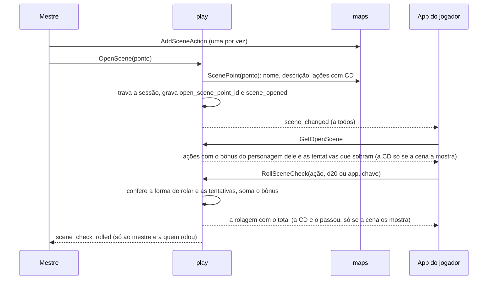
```mermaid
sequenceDiagram
    participant M as Mestre
    participant P as play
    participant K as maps
    participant J as App do jogador
    M->>K: AddSceneAction (uma por vez)
    M->>P: OpenScene(ponto)
    P->>K: ScenePoint(ponto): nome, descrição, ações com CD
    P->>P: trava a sessão, grava open_scene_point_id e scene_opened
    P-->>J: scene_changed (a todos)
    J->>P: GetOpenScene
    P-->>J: ações com o bônus do personagem dele e as tentativas que sobram (a CD só se a cena a mostra)
    J->>P: RollSceneCheck(ação, d20 ou app, chave)
    P->>P: confere a forma de rolar e as tentativas, soma o bônus
    P-->>J: a rolagem com o total (a CD e o passou, só se a cena os mostra)
    P-->>M: scene_check_rolled (só ao mestre e a quem rolou)
```

- **Ganchos, pistas e descobertas** (MR-029 e MR-030, Etapa 8; perguntas 59 a 61, decididas pelo Samuel em 03/10/2026). Os "Ganchos e anotações" são um texto Markdown do mestre, até 4.000 caracteres, na coluna `map_points.hooks`: salvam com o ponto (`UpdateMapPoint`) e só o mestre os recebe, no mapa e na cena aberta. As pistas (`scene_clues`) são textos de 1 a 500 caracteres, até 30 por cena, que o mestre muda uma por vez (`AddSceneClue`, `UpdateSceneClue`, `MoveSceneClue`, `RemoveSceneClue`), como as ações.
  - **Revelar** (`RevealSceneClue(campanha, pista, character_ids)`): o app marca todos os personagens de jogador por padrão e o mestre desmarca. Cada jogador recebe a pista **uma vez** (`scene_clue_reveals`, único por pista e jogador: repetir não muda nada, não grava evento e não avisa ninguém), e **não há "esconder de novo"**. A linha guarda uma **cópia do texto**, então editar ou apagar a pista, ou a cena, depois não muda o que o jogador recebeu (decisão: a pista foi dita à mesa). Com sessão aberta, a revelação vira o evento `clue_revealed` (só IDs: a pista, o ponto e os personagens que ainda não a tinham, nunca o texto) e o `maps` o grava pela interface `LiveSession.AppendEvent`, a mesma que o `progression` usa; sem sessão, a revelação vale do mesmo jeito. Só os jogadores que a receberam ouvem `notes_changed`. Quem está offline a lê no próximo `ListNotes`.
  - **Quem tem cada pista**: o mestre recebe cada pista com `revealed_to` (os personagens e quando); "Todos", "Só a Brisa" e "Ninguém ainda" a tela calcula comparando com o grupo.
  - **Descobertas** (`scene_discoveries`): uma cena é descoberta quando seu ponto é revelado no mapa (`SetMapPointRevealed(true)` ou `UpdateMapPoint` com `revealed`) ou quando o mestre a abre (`OpenScene`, mesmo escondida); vale para o grupo todo e continua valendo se o ponto for escondido de novo. É a única lista de cenas que um jogador alcança por nome fora do mapa e da cena aberta (ver [Módulo notes](#módulo-notes-anotações-dos-jogadores)).
- **Como o `play`, o `maps` e o `characters` se encontram.** O `play` lê a cena pelo `MapKeeper.ScenePoint` (`maps.SessionMaps`, que traz também os ganchos e as pistas, e que o `play` só entrega ao mestre) e grava a descoberta pelo `MapKeeper.DiscoverScene`, na transação de `OpenScene`, pede os bônus ao `CombatRoster.SceneOptions` e o nome do teste ao `CombatRoster.SceneCheckName` (`characters.Service`), e o `maps` pergunta qual ponto é a cena aberta pelo `LiveSession.OpenScenePoint` (`play.Service`), para avisar o stream quando muda uma ação ou o ponto da cena aberta.
- **O histórico** (`session_events`): o payload de `scene_check_rolled` leva só IDs e números (o ponto, a ação, a chave do teste, o d20, o bônus, o total, `physical`, `dc_shown` (a cena mostrava a CD) e, se a ação tinha CD, `passed`), nunca um nome de pessoa, de ação ou de cena, nem a CD (ver [Privacidade](privacidade.md)). O de `scene_attempt_granted` leva o ponto e a ação. O palco grava `stage_changed` com o `change` (`put`, `taken_off`, `speaker` ou `cleared`) e o ID do NPC, sem nome.

### NPCs em cena: o palco

O palco é a fila de NPCs "em cena" na cena aberta, como numa visual novel (MR-031, Etapa 8, D7; pergunta 62, decidida pelo Samuel em 03/10/2026: o retrato fica na ficha do NPC e aparece na cena e no cartão do combate). O código é `backend/internal/play/stage.go`; o retrato é do `characters` (`portrait.go`); a regra de baixar a imagem é do `maps` (`serve.go`).

- **O retrato** é o campo `portrait_image_id` da ficha de um NPC (`FullSheet` ou `BasicSheet`): uma imagem da galeria da campanha. O `characters` confere pela interface `Gallery` (`SetGallery`; quem implementa é `maps.SessionMaps.ImageInCampaign`, que o `cmd/api` entrega antes de ligar o resto, porque só precisa do banco): uma imagem de outra campanha, ou que não existe, é `invalid_argument` com o mesmo texto, para ninguém saber que existe em outra, e a ficha de um jogador recusa o campo. **Apagar a imagem da galeria limpa o retrato** (`DeleteGalleryImage` chama `ClearPortraits` na mesma transação e manda `stage_changed`), em vez de recusar como faz para o fundo de um mapa: o retrato cai nas iniciais, o mapa sem imagem não é mapa. Um retrato gravado no instante em que a imagem é apagada pode sobreviver a ela: a URL responde `404` e o app desenha as iniciais; o próximo salvamento da ficha é recusado até o retrato ser trocado. O cartão do NPC no combate (`Combatant.portrait_url`) leva a URL só na cópia do mestre (`TestMR031_TheMastersNPCCardHasThePortrait`).
- **O palco** é a tabela `stage_npcs` (ver [Dados](dados.md)): por sessão, em ordem, no máximo 4. Três chamadas do `PlayService`, só do mestre e só com a sessão aberta: `PutOnStage(character_id)` (qualquer NPC vivo da campanha, escondido no combate ou não, o que não o revela lá; recusa com `SceneBlocked` `NO_OPEN_SCENE` sem cena aberta e `STAGE_FULL` com 4 em cena; repetir não muda nada), `TakeOffStage` e `SetSpeaker` (um só fala por vez; vazio, ninguém). Cada uma trava a linha da sessão, muda e grava um `session_events` `stage_changed` (só IDs, sem nome) na mesma transação, e depois do `COMMIT` publica `stage_changed` (campo 17 do `WatchGameSessionResponse`, sem conteúdo) a todos. A resposta é o palco como ficou. **Fechar a cena, ou abrir outra, esvazia o palco** na mesma transação (`OpenScene` e `CloseScene` chamam `clearStage`): abrir de novo a que já está aberta não muda nada.
- **O que cada um recebe (RN-20).** O palco vai no `OpenSceneInfo.stage` do `GetOpenScene` (a resposta do `OpenScene` também o leva): cada entrada tem o nome do NPC, a URL do retrato (vazia sem retrato: o app desenha as iniciais) e se ele fala. O mestre recebe também o `character_id`, que as três chamadas pedem. **O jogador nunca recebe** o tipo, o PV, a CA, o XP, a ficha, as notas nem o ID do personagem: o `id` da entrada é o lugar no palco, feito quando o NPC entra, e não nomeia ninguém. O stream leva só o aviso. `TestMR031_APlayerSeesOnlyNameAndPortrait` lê cada resposta e cada evento que o jogador recebe, como o JSON do app, e confere as chaves de cada entrada.
- **Baixar o retrato.** O jogador só baixa a imagem (e a miniatura) de um NPC **enquanto ele está no palco da cena aberta** da sessão aberta da campanha; em qualquer outra hora é `404`, como numa imagem que ele não pode ver: fora de cena, com a cena fechada, trocada ou a sessão encerrada, também no `If-None-Match` (nunca um `304`). É a mesma forma da imagem mostrada (MR-028): `maps.playersSeeImage` pergunta ao `play` (`LiveSession.ImageOnStage`), depois das outras regras. O mestre baixa sempre (`TestMR031_PortraitsAreVisibleOnlyOnStage`).
- **A tabela de quem chama.** As três chamadas estão na tabela do `PlayService` acima; `TestAuthorizationMatrix` (no `play`) e `TestStageAuthorizationMatrix` (no `maps`, com cena e NPCs de verdade) chamam cada uma como mestre, jogador, de fora, pendente e sem login.

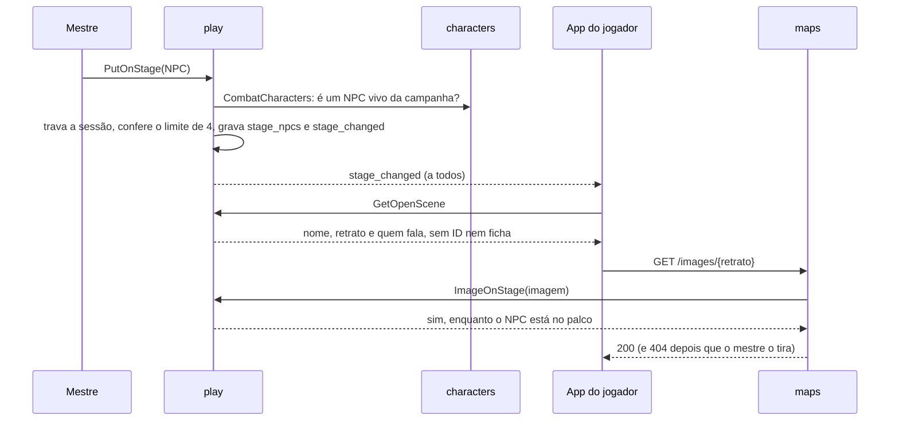
```mermaid
sequenceDiagram
    participant M as Mestre
    participant P as play
    participant C as characters
    participant J as App do jogador
    participant K as maps
    M->>P: PutOnStage(NPC)
    P->>C: CombatCharacters: é um NPC vivo da campanha?
    P->>P: trava a sessão, confere o limite de 4, grava stage_npcs e stage_changed
    P-->>J: stage_changed (a todos)
    J->>P: GetOpenScene
    P-->>J: nome, retrato e quem fala, sem ID nem ficha
    J->>K: GET /images/{retrato}
    K->>P: ImageOnStage(imagem)
    P-->>K: sim, enquanto o NPC está no palco
    K-->>J: 200 (e 404 depois que o mestre o tira)
```

### Combate

Um combate (no código, um *encounter*) vive dentro da sessão aberta: o mestre escolhe quem luta, todos rolam a iniciativa, os turnos giram até o mestre encerrar (MR-013). O contrato é o `CombatService`, em `proto/meurpg/play/v1/combat.proto`, e os eventos andam no mesmo stream da sessão. Fica num serviço à parte, e não como mais métodos do `PlayService`, porque o combate cresce a cada fatia (ataques, desfazer e registro; depois as magias, as reações, os testes contra a morte, as condições e as features) e o `play.proto` já é o maior arquivo do módulo; os dois serviços são implementados pelo mesmo `play.Service` e montados juntos, com os mesmos interceptors. O código fica em `combat.go` (as chamadas), `combat_write.go` (a transação que toda mudança compartilha), `combat_view.go` (quem vê o quê), `combat_rules.go` (as contas, puras e testadas sem banco), `combat_actions.go` (as opções, o ataque, o dano, as ações padrão e os PV do NPC), `combat_undo.go` (o desfazer), `combat_log.go` (o registro), `combat_events.go` (o payload dos eventos), `combat_spells.go` e `combat_spells_view.go` (conjurar), `combat_reactions.go` (o Escudo), `combat_death.go` (os testes contra a morte e a confirmação), `combat_conditions.go` (condições e concentração) e `combat_vitals.go` (espaços, usos e PV pelos `character_vitals`).

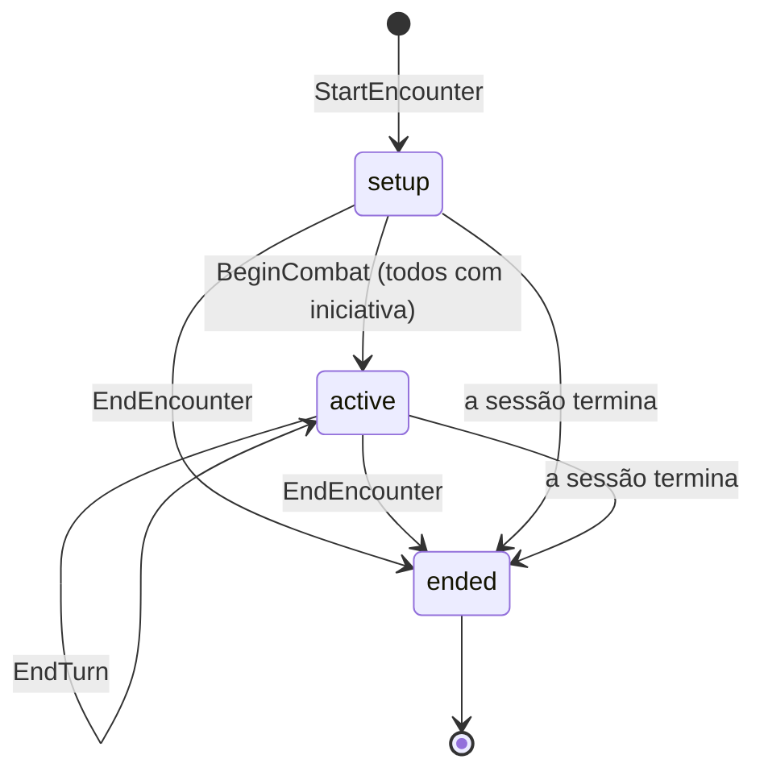
```mermaid
stateDiagram-v2
    [*] --> setup: StartEncounter
    setup --> active: BeginCombat (todos com iniciativa)
    active --> active: EndTurn
    setup --> ended: EndEncounter
    active --> ended: EndEncounter
    setup --> ended: a sessão termina
    active --> ended: a sessão termina
    ended --> [*]
```

| Chamada do `CombatService` | Quem pode | O que faz |
| --- | --- | --- |
| `StartEncounter` | O mestre, com a sessão aberta | Cria o combate em `setup`, no mapa atual (que precisa de grade) ou no mapa do ponto de batalha. Põe o grupo e as cópias dos NPCs; cada NPC rola a própria iniciativa na hora |
| `GetEncounter` | Membros, filtrado | O último combate da sessão aberta, inclusive o que acabou de terminar, ou nenhum |
| `SubmitInitiative` | O jogador no próprio personagem, ou o mestre em qualquer um | d20 rolado no app (`roll_in_app`) ou o d20 físico digitado (`d20_face`), com a RN-18: com "cada jogador escolhe" o jogador escolhe a cada rolagem, e só um modo que o mestre forçou barra (`WRONG_DICE_MODE`). Só em `setup` |
| `SetInitiativeOrder` | O mestre | Ordena o empate (mesmo total e mesmo bônus) |
| `BeginCombat` | O mestre | `active`, rodada 1, o primeiro da ordem na vez. Sem a iniciativa de alguém: `failed_precondition` (`INITIATIVE_MISSING`) com quem falta |
| `EndTurn` | O jogador do membro, ou o mestre (qualquer um) | Encerra a parte de um membro do turno; quando o último que age encerra, o turno passa ao próximo grupo que não está derrotado e, depois do último, a rodada sobe (num turno de um só, é a vez toda, como sempre). `aborted` se `expected_combatant_id` não é mais um membro que age. Com dano a rolar, a aplicar ou à espera de uma reação do combatente da vez: `PENDING_DAMAGE`, e só o mestre passa assim mesmo (`discard_pending_damage`), o que descarta o dano. Com o teste contra a morte do jogador por rolar: `DEATH_SAVE_DUE` (o mestre passa assim mesmo). Se ninguém está na vez (o combatente da vez saiu do combate, ou o personagem dele foi apagado), só o mestre chama, e a vez recomeça do primeiro da ordem, na mesma rodada |
| `MoveCombatant` | O jogador no próprio personagem, na vez dele; o mestre em qualquer um, sempre | Põe o combatente num quadrado, ou o faz saltar (`jump`). O jogador paga o comprimento exato da linha em décimos de pé, com o terreno e as criaturas na conta, e é limitado pelo movimento que sobra; o mestre, não ([Movimento no combate](#movimento-no-combate-etapa-9-fatia-96)) |
| `GetMoveOptions` | O jogador no próprio personagem, na vez dele; o mestre em qualquer um | Todo quadrado que o combatente alcança num movimento reto, com o custo, e o motivo de cada quadrado do círculo que recusa (`IDEMPOTENT`) |
| `SetCombatantSide` | O mestre | Marca um NPC como "Aliado" (lado do grupo) ou inimigo, e grava `side_set` |
| `SetCombatantCover` | O mestre | Marca à mão a cobertura de um combatente (nenhuma, meia, três quartos, total), que some quando ele se move, e grava `cover_set` |
| `SetCombatantHidden` | O mestre | Esconde ou mostra um NPC |
| `AddCombatants` | O mestre | Reforços (NPCs), com a iniciativa rolada na hora e o lugar na ordem |
| `RemoveCombatant` | O mestre | Tira alguém; se era a vez dele, a vez passa |
| `EndEncounter` | O mestre | `ended`; os tokens dos jogadores vão para onde eles pararam. Encerrar de novo não é erro |
| `GetTurnOptions` | O jogador no próprio personagem; o mestre em qualquer um | O que o combatente pode fazer agora ("Sua vez"), com os alvos de cada ataque e de cada magia (`spell_targets`, com a distância, os dardos por círculo e quantos alvos a magia aceita) e o dano que falta rolar ou aplicar. Responde também fora da vez, com tudo desabilitado e o motivo |
| `RollAttack` | O jogador no próprio personagem, na vez dele (ou com `as_reaction`, fora dela); o mestre em qualquer combatente da vez | O ataque, primeiro passo: rola o d20 (app ou face física), gasta a ação (ou a reação, no ataque de oportunidade) e compara com a CA do alvo |
| `CastSpell` | O jogador no próprio personagem, na vez dele; o mestre em qualquer combatente da vez | Conjura: gasta o espaço e a ação ou a ação bônus de uma vez, e resolve pelo que a magia é (ataque de magia, resistência, dardos, cura ou só registro) |
| `UseReaction`, `DeclineReaction` | O jogador no personagem atingido; o mestre em qualquer um | O Escudo quando um golpe acerta: gasta o espaço e a reação, dá +5 na CA até o começo da próxima vez do personagem e compara o golpe de novo; ou deixa o golpe passar |
| `RollDeathSave` | O jogador no próprio personagem; o mestre em qualquer um | O teste contra a morte de quem está a 0 PV, no começo da vez dele |
| `ConfirmDeath` | O mestre | Confirma a morte de quem falhou três vezes: marca o personagem como morto e o tira da ordem. Não se desfaz |
| `SetCombatantConditions` | O mestre; o jogador só para encerrar a concentração do próprio personagem | As condições (rótulos, RN-22) e o fim da concentração |
| `RollDamage` | O jogador no próprio ataque; o mestre em qualquer um | O dano do ataque que acertou, segundo passo. NPC alvo: aplicado na hora. Personagem de jogador: fica `ROLLED`, esperando o mestre. Numa magia de área, uma rolagem só vale para todos os alvos da conjuração; uma cura aplica na hora |
| `ApplyPendingDamage`, `DiscardPendingDamage` | O mestre | "Aplicar 5 de dano" (pelos `character_vitals`, RN-02), com a quantia que ele quiser no lugar da rolada (`amount`), e "Não aplicar" |
| `TakeAction` | O jogador no próprio personagem, na vez dele; o mestre em qualquer combatente da vez | As ações padrão que só gastam a economia (Disparada, Desengajar, Esquivar, Ajudar, Esconder, Preparar, Procurar, Usar um objeto) e as ações das features (`feature:second-wind`, `feature:action-surge-1-use`...), que gastam também um uso do recurso |
| `AdjustCombatantHitPoints` | O mestre | "Dano/Cura" de um NPC: dano, cura ou valor exato, e PV temporários |
| `UndoLastAction` | O mestre | Desfaz a última ação, um passo, com um evento compensatório |
| `ListCombatLog` | Membros, filtrado | O registro do combate, da última rodada para a primeira |

Os erros de estado são `failed_precondition` com o detalhe `EncounterBlocked` e um motivo (`MAP_HAS_NO_GRID` com o `map_id`, para a tela oferecer a grade; `NO_CURRENT_MAP`; `ENCOUNTER_ALREADY_OPEN`; `NOT_IN_SETUP`; `NOT_ACTIVE`; `NOT_YOUR_TURN`; `NOT_PLACED`; `TOO_FAR` com `missing_ft`; `SQUARE_OCCUPIED`; e, nas ações, `ACTION_USED`, `BONUS_ACTION_USED`, `REACTION_USED`, `ATTACKS_USED`, `NO_SLOT` com `min_level`, `NO_USES` com `recharge`, `TARGET_OUT_OF_REACH` com `missing_ft`, `TARGET_DEFEATED`, `COMBATANT_DOWN`, `PENDING_DAMAGE`, `REACTION_PENDING`, `NOT_AWAITING_REACTION`, `DEATH_SAVE_DUE`, `DEATH_SAVE_NOT_DUE`, `NOT_DYING`, `DAMAGE_ALREADY_ROLLED`, `DAMAGE_NOT_ROLLED`, `DAMAGE_RESOLVED`, `NOTHING_TO_UNDO`, `WRONG_DICE_MODE`...). Quem chama não depende do texto da mensagem.

**Como o `play` lê os outros módulos.** Por interfaces pequenas, ligadas no `cmd/api`, sem importar código de ninguém. Os tipos simples que passam por elas ficam em `play/link`, um pacote que não importa nada do projeto.

| Interface do `play` | Quem implementa | Para quê |
| --- | --- | --- |
| `CombatRoster` (`CombatParty`, `CombatCharacters`, `CombatSheet`, `CombatTurnOptions`, `CombatSpell`, `CombatSave`, `MarkDead`, `Conditions`) | `characters.Service` | Quem pode lutar, com o bônus de iniciativa, a velocidade e o PV máximo (do `rules.Derive` numa ficha completa; como está numa ficha básica); a CA, os ataques, as ações padrão e as das features de um personagem (`link.Sheet`, com os ataques por ação); o `TurnOptions` do motor de regras, com os espaços e os usos que o personagem já gastou; a magia como o conjurador a conjura, já no círculo do espaço (`link.Spell`: alcance, ataque ou resistência, dano ou cura com o modificador do conjurador); o bônus de resistência de um alvo (uma ficha básica não tem: `Known` falso); a morte confirmada pelo mestre (o efeito do `MarkCharacterDead`, na transação do combate); e as condições do SRD. Uma ficha básica vira um `rules.Derived` mínimo (os ataques estruturados como `basic:0`, `basic:1`, e as dez ações padrão), então o motor serve ao Goblin como serve ao Toren |
| `DiceModes` (`ForcedDice`) | Um adaptador em cima de `campaigns.Service.CampaignDiceMode` | O que o modo da campanha obriga: nada (`cada jogador escolhe`), tudo no app, ou tudo com dado físico (RN-18). A preferência do jogador não entra: ela só é o padrão que a tela destaca (`PlayerDiceMode`, `EffectiveDiceMode`) |
| `MapKeeper` (mais `MapGrid`, `BattlePoint`, `MapTokens`, `SetTokenPositions`) | `maps.SessionMaps` | A grade do mapa, o mapa de um ponto de batalha, onde estão os tokens e, no fim, mover os tokens dos jogadores |

**A grade e o movimento (RN-21).** O mapa tem `grid_columns` (4 a 200 quadrados de 1,5 m na largura da imagem); as linhas seguem a proporção da imagem (`round(colunas × altura / largura)`, de 1 a 400) e não são guardadas. O combate copia a grade ao começar (`encounters.grid_columns` e `grid_rows`), então mudar a grade do mapa depois não mexe em ninguém. Cada combatente começa no quadrado do token do personagem, se tem um (de várias cópias de um NPC, só a primeira), e senão sem posição: o mestre o põe. O jogador anda na própria vez, no máximo o movimento que sobra: a velocidade da ficha (dobrada depois da Disparada, `dashed`) menos o que já andou, em décimos de pé, e uma linha reta custa o seu comprimento exato (um passo na diagonal vale 7,1 ft), com o terreno e as criaturas na conta (ver [Movimento no combate](#movimento-no-combate-etapa-9-fatia-96); o círculo substituiu a distância de Chebyshev na fatia 9.6). Passou: `TOO_FAR`. Um quadrado ocupado por alguém que ele vê: `SQUARE_OCCUPIED`; um combatente escondido do jogador não bloqueia, para o erro não revelar que ele está ali. O mestre move qualquer um para qualquer quadrado da grade, sem gastar movimento. A Disparada (`TakeAction`) chama `markDashed`, e o movimento que sobra dobra até o fim da vez.

**A ordem (RN-19).** Maior total primeiro; no empate, maior bônus; no empate dos dois, a ordem que o mestre decidiu (`SetInitiativeOrder`), e sem decisão, a de entrada. Quem ainda não rolou fica no fim. O servidor guarda a posição de cada um (`order_index`) e refaz a ordem a cada rolagem ou reforço. O jogador rola a própria iniciativa uma vez só, para ninguém rolar de novo até sair bom; o mestre pode corrigir qualquer valor. Cada NPC rola o seu, no servidor, com `crypto/rand` (RN-19); o dado físico é validado pela `platform/dice`.

**Quem vê o quê (RN-10, RN-20).** Como no mapa, o filtro roda no servidor (`combat_view.go`) e o que o jogador não vê fica fora da resposta, nunca em branco. `TestRN20_PlayersNeverReceiveHiddenCombatantsOrNPCNumbers` lê a resposta do jogador como o JSON que o app recebe e procura nela o combatente escondido e os números do NPC.

| O quê | O mestre vê | O jogador vê |
| --- | --- | --- |
| Combatente escondido (NPC novo nasce escondido) | Todos | Nenhum: nem o ID, nem o nome, nem a posição |
| A vez de um escondido | O combatente | "Vez do mestre": `current_combatant_id` vazio e `master_turn` verdadeiro |
| PV e PV temporários de um NPC | Os números | Uma palavra: Ileso, Ferido, Muito ferido (metade ou menos) ou Derrotado |
| CA de qualquer combatente | Só o mestre: `Combatant.armor_class` (a lista da ordem, "CA 15") e `AttackRoll.target_armor_class` ("Acertou contra CA 18 do Toren"); o servidor lê a ficha de cada um só para a cópia do mestre | Nunca: nenhuma resposta a leva, só Acertou ou Errou |
| Iniciativa de um NPC | O total, o d20 e o bônus | Nada: só a ordem |
| Iniciativa de um jogador | Tudo | O total de todos os jogadores; o d20 e o bônus, só do próprio |
| PV de um jogador | Os números, dos `character_vitals` | Os do próprio personagem vêm da sessão ao vivo; os dos outros jogadores, não (pergunta 28); só a palavra "Caído" a 0 PV, de todos |
| Velocidade, movimento que sobra, ação, ação bônus, reação | Todos | Só do próprio personagem |
| De qual personagem um NPC é cópia | Sim | Não |

**O ataque em dois passos (MR-012, MR-014).** São duas chamadas porque, com dado físico, o jogador digita o d20 e depois o dano (RN-18). `RollAttack` confere quem pode (o jogador no próprio personagem, na vez dele, com a ação livre, o alvo à vista e ao alcance; o mestre em qualquer combatente da vez, sem limite de alcance nem de ação: o Capitão com várias armas é dele), rola o d20 (`crypto/rand` no app, ou a face digitada, 1 a 20), gasta a **ação** e compara com a CA do alvo (`rules/combat.ResolveAttack`: 20 natural é crítico, 1 natural erra). A resposta traz a rolagem em números (`1d20 (13) + 6 = 19`) e o resultado, **nunca a CA para o jogador**; a resposta do mestre leva também a CA contra a qual o total foi comparado (`target_armor_class`, com o +5 de um Escudo ativo, guardada no evento, para um reenvio achar a mesma). `TestRN20_PlayersNeverReceiveCAOrHiddenLogEntries` procura a CA no JSON do jogador e confere que a do mestre a tem. Acertou: abre uma linha em `pending_damages` (guardada, para um reenvio ou um recarregamento achar). `RollDamage` rola os dados do dano (dobrados no crítico, o modificador uma vez, o tipo do ataque) ou valida a soma digitada (`dice.Physical`, de N a N × faces). A Ação de Atacar faz um ataque, ou mais com o Ataque Extra (ver abaixo); a vantagem e a desvantagem ficam por conta da mesa.

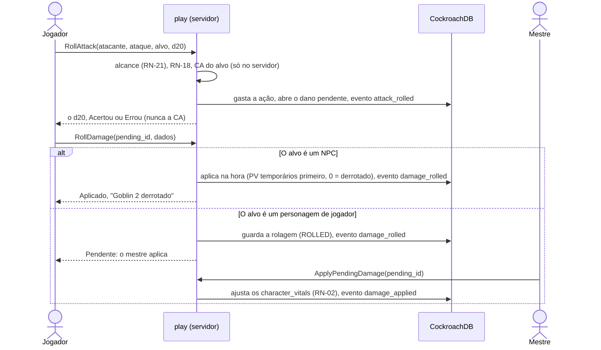
```mermaid
sequenceDiagram
    actor J as Jogador
    participant S as play (servidor)
    participant DB as CockroachDB
    actor M as Mestre
    J->>S: RollAttack(atacante, ataque, alvo, d20)
    S->>S: alcance (RN-21), RN-18, CA do alvo (só no servidor)
    S->>DB: gasta a ação, abre o dano pendente, evento attack_rolled
    S-->>J: o d20, Acertou ou Errou (nunca a CA)
    J->>S: RollDamage(pending_id, dados)
    alt O alvo é um NPC
        S->>DB: aplica na hora (PV temporários primeiro, 0 = derrotado), evento damage_rolled
        S-->>J: Aplicado, "Goblin 2 derrotado"
    else O alvo é um personagem de jogador
        S->>DB: guarda a rolagem (ROLLED), evento damage_rolled
        S-->>J: Pendente: o mestre aplica
        M->>S: ApplyPendingDamage(pending_id)
        S->>DB: ajusta os character_vitals (RN-02), evento damage_applied
    end
```

**Dano pendente.** `pending_damages` guarda o dano de um acerto, com os dados copiados da ficha no momento do acerto (uma ficha mudada depois não mexe numa rolagem aberta; o crítico já vem com os dados dobrados). O estado vai de `awaiting_roll` a `rolled` (só para personagem de jogador) e a `applied` ou `discarded`. Um NPC aplica na hora: `ApplyDamage` (PV temporários primeiro, piso em 0); a 0 PV ele fica `defeated` e `nextTurn` o pula. O dano em personagem de jogador espera o mestre (RN-02) e passa pelos `character_vitals` (o mesmo caminho da correção), com o piso em 0; a 0 PV o personagem está **caído**: o `GetEncounter` mostra a palavra `COMBATANT_STATE_DOWN` ("Caído") a todos que o veem, derivada dos `character_vitals`, sem números. Os testes contra a morte são da seção [Os caídos](#os-caídos-rn-03); a morte por dano massivo continua sendo do mestre. `EndTurn` com dano aberto do combatente da vez recusa com `PENDING_DAMAGE`; só o mestre passa assim mesmo (`discard_pending_damage`, o "Passar o turno mesmo assim?" da tela), e o dano aberto é descartado na mesma transação.

**Conjurar (MR-014).** `CastSpell` gasta o espaço e a ação (ou a ação bônus) **na conjuração**, na mesma transação (MR-014, critério 2): um reenvio com a mesma chave não gasta nada, e uma conjuração recusada também não. Quem conjura: o jogador no próprio personagem, na vez dele (uma magia preparada ou um truque de resistência da lista de opções); o mestre, em qualquer combatente da vez (um NPC com ficha completa conjura da ficha; os espaços de NPC não são contados, só os de personagem de jogador). A magia, o círculo (`slot`: nível ou pacto, nenhum para truque) e os alvos vêm conferidos contra o `TurnOptions` do personagem, e os alvos contra o que ele vê, o alcance (Pessoal só o conjurador, Toque 5 ft, à distância o alcance da magia; o mestre nunca é limitado) e quantos alvos a magia aceita. O SRD diz em prosa se uma magia atinge uma área e quantos alvos leva; `characters/combatspells.go` lê o texto com dois padrões e um ataque de magia leva um alvo, então um palpite errado nunca trava o mestre (ele não é limitado pelo número de alvos).

| A magia é | O que a conjuração faz | O que fica para `RollDamage` |
| --- | --- | --- |
| Ataque de magia (Raio Gélido... com `attack_type`) | Um d20 por alvo (`roll_in_app`, ou `d20_face` para um alvo só, RN-18 a cada rolagem), contra a CA como no `RollAttack` (o crítico dobra os dados); o acerto abre o dano pendente, e o Escudo pode segurá-lo | O dano de cada acerto |
| Resistência (Mãos Flamejantes, Chama Sagrada) | O servidor rola a resistência de cada alvo: um NPC de ficha completa usa o bônus do `Derived.SavingThrows`; uma ficha básica não tem bônus, rola d20 + 0 e o registro diz (`bonus_known` falso, só para o mestre); o personagem de jogador também é rolado no app com o bônus da ficha (a palavra final é do mestre, pelo `amount`). Quem passa leva metade (arredondada para baixo) ou nada, como a magia diz | **Uma** rolagem para a conjuração toda (SRD): os danos pendentes dela dividem um `cast_id`, e rolar um assenta todos, cheio ou pela metade |
| Mísseis Mágicos | Os dardos (3, e mais um por círculo acima) são divididos entre os alvos, ao menos um em cada, somando exato; sem rolagem de ataque | O dano de cada alvo: 1d4 + 1 por dardo, em qualquer círculo (o dano do SRD no círculo é o da salva inteira, e cada dardo é 1d4 + 1) |
| Cura | Um dano pendente que é cura | A rolagem com o modificador de conjuração ("+ MOD") cura **na hora**, até o máximo, por NPC e por personagem (pelos `character_vitals`); quem estava a 0 PV levanta e os testes contra a morte zeram |
| Lê PV (Sono, Borrifo de Cores, Palavra de Poder, Poupar os Moribundos, Cura Completa) | O servidor lê o PV de cada alvo (NPC: `combatants.hp_current`; personagem de jogador: o `VitalsKeeper`) e aplica o efeito na hora, na mesma transação (ver [Magias que leem PV](#magias-que-leem-pv)) | — |
| O resto (Teia, Passo Nebuloso...) | Gasta e registra; o efeito é da mesa, e o mestre marca as condições depois | — |

#### Magias que leem PV

Seis magias do SRD não rolam dano: o que fazem depende do PV de quem está na área (MR-014, Etapa 8, pergunta 58). O que cada uma faz é conteúdo escrito à mão, em `rules/srd51/effects/spells.json`, num conjunto fechado de quatro tipos que o carregador confere (como o `effects/` das features; mudar o arquivo pede uma revisão nova, a `fx.6`):

| Tipo | O que faz | Magias |
| --- | --- | --- |
| `hp_pool` | Rola um total de dados (e os dados a mais por círculo acima do da magia) e passa pelas criaturas em ordem crescente de PV atual, pulando as que já estão inconscientes ou a 0 PV; cada uma cujo PV cabe no que sobrou ganha a condição, e o total desce pelo PV dela | Sono (5d8, +2d8, Inconsciente), Borrifo de Cores (6d10, +2d10, Cego) |
| `hp_threshold` | A criatura com PV igual ou menor que N sofre o efeito: uma condição ou a morte | Palavra de Poder: Atordoar (150, Atordoado), Matar (100, morre) |
| `zero_hp_target` | Só vale numa criatura a 0 PV, e a deixa estável | Poupar os Moribundos |
| `flat_heal` | Cura um valor fixo (mais um tanto por círculo) e encerra condições | Cura Completa (70, +10 por círculo; encerra Cego e Surdo) |

`rules.SpellEffect(chave, círculo)` devolve o efeito já no círculo do espaço. As contas são funções puras de `rules/combat` (`hpspells.go`): `ResolvePool`, `ResolveThreshold`, `ResolveZeroHP` e `ResolveFlatHeal` recebem o PV de cada criatura e os dados rolados e dizem quem é afetado (empates mantêm a ordem dos alvos; o limite vale com PV exatamente igual a N). Em `play`, `combat_spells_hp.go` lê o PV de verdade e aplica o resultado: a condição pelo mesmo campo que o `SetCombatantConditions` escreve; a "morte" derrota um NPC (0 PV) e leva um personagem de jogador a 0 PV com três falhas de morte, para o mestre confirmar com `ConfirmDeath` (RN-03); o personagem a 0 PV de Poupar os Moribundos fica estável (três sucessos). O total do pool é rolado no servidor (`roll_in_app`) ou digitado com dado físico (`pool_sum`, a soma dos dados), e segue o modo de dados da campanha como qualquer rolagem (RN-18). O evento da conjuração guarda, por alvo, o PV de antes, o que foi afetado e o que o "Desfazer última ação" precisa devolver (PV, falhas de morte, condições).

**Quem recebe o quê (RN-20).** `SpellCast` (a resposta) e `CombatLogSpell` (o registro) levam campos tipados, e o app nunca lê texto: `effect_kind`, `effect_condition_key` e, por alvo, `SpellEffectResult.outcome` (afetado ou não) vão para todo mundo que vê a linha; `pool_roll` (`5d8 (2, 4, 1, 5, 3) = 15`) só para o mestre e para o jogador de quem conjurou; `effect_threshold`, e por alvo `reason`, `hit_points_before`, `pool_order` e `pool_left`, só para o mestre; `healed`, para o mestre e para o jogador do alvo (num NPC, a quantidade contaria a quem conjurou quantos PV faltavam). Os alvos continuam na ordem que quem conjurou listou, e a ordem do total só aparece no `pool_order` do mestre.

Uma conjuração leva no máximo **10 alvos**, também a do mestre: o que cada alvo sofreu fica no evento da conjuração e no da rolagem de dano, e o payload de um `session_events` tem no máximo 4 KiB (`00024`); passar disso é `invalid_argument`. Uma cura aparece no registro com o que o alvo recuperou (até o máximo) só para o mestre e para o jogador do alvo; os outros recebem a rolagem, porque o número cortado diria quantos PV faltavam (RN-20).

Uma magia de concentração põe o nome dela em `concentration_spell` do conjurador; uma segunda a troca, e o registro diz qual terminou (RN-22). O `GetTurnOptions` traz, para cada magia que dá para conjurar agora, os alvos que quem chama vê, com a distância e `too_far`, e os dardos por círculo.

**A reação: o Escudo (decisão 5 da linha do tempo).** Quando um golpe que não é crítico acerta um personagem de jogador que pode conjurar o Escudo agora (preparado, com espaço livre, reação livre, de pé), o dano pendente nasce em `AWAITING_REACTION`, e não em `AWAITING_ROLL`: quem atacou vê "esperando a reação", e o jogador atingido e o mestre recebem o aviso no `GetEncounter` (`reaction_prompts`, por quem vê: o mestre todos, o jogador os do próprio personagem, sem o atacante e sem o total do golpe). O jogador decide sem saber o total, como numa mesa.

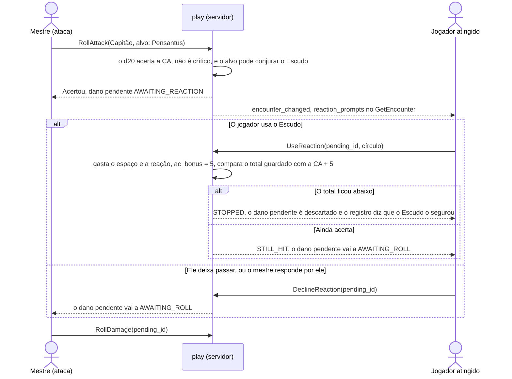
```mermaid
sequenceDiagram
    actor M as Mestre (ataca)
    participant S as play (servidor)
    actor J as Jogador atingido
    M->>S: RollAttack(Capitão, alvo: Pensantus)
    S->>S: o d20 acerta a CA, não é crítico, e o alvo pode conjurar o Escudo
    S-->>M: Acertou, dano pendente AWAITING_REACTION
    S-->>J: encounter_changed, reaction_prompts no GetEncounter
    alt O jogador usa o Escudo
        J->>S: UseReaction(pending_id, círculo)
        S->>S: gasta o espaço e a reação, ac_bonus = 5, compara o total guardado com a CA + 5
        alt O total ficou abaixo
            S-->>J: STOPPED, o dano pendente é descartado e o registro diz que o Escudo o segurou
        else Ainda acerta
            S-->>J: STILL_HIT, o dano pendente vai a AWAITING_ROLL
        end
    else Ele deixa passar, ou o mestre responde por ele
        J->>S: DeclineReaction(pending_id)
        S-->>M: o dano pendente vai a AWAITING_ROLL
    end
    M->>S: RollDamage(pending_id)
```

`RollDamage` e `ApplyPendingDamage` num golpe que espera a reação dão `REACTION_PENDING`; `EndTurn` do atacante dá `PENDING_DAMAGE` (só o mestre passa, descartando). Os +5 ficam em `combatants.ac_bonus` até o começo da próxima vez do personagem (`ResetCombatantTurn`): todo ataque nesse meio tempo usa a CA da ficha mais o bônus, e o bônus nunca altera a ficha (RN-04). O **ataque de oportunidade** é o `RollAttack` com `as_reaction`: um ataque corpo a corpo (alcance de 5 ft; uma arma que a ficha lista com alcance próprio, como a adaga arremessável, conta como à distância) fora da vez, que gasta a reação no lugar da ação. As outras magias de reação são da mesa.

**Os caídos (RN-03).** Um personagem de jogador a 0 PV está "Caído" (a palavra vem dos `character_vitals`). A vez dele começa com um teste contra a morte por rolar (`death_save_due`, para ele e para o mestre), e a vez espera por ele. Quem cai a 0 PV **durante a própria vez** (um ataque de oportunidade, a correção do mestre) não deve o teste nessa vez: o primeiro é no começo da vez seguinte (SRD 5.1; `changeVitals` marca `death_save_rolled`).

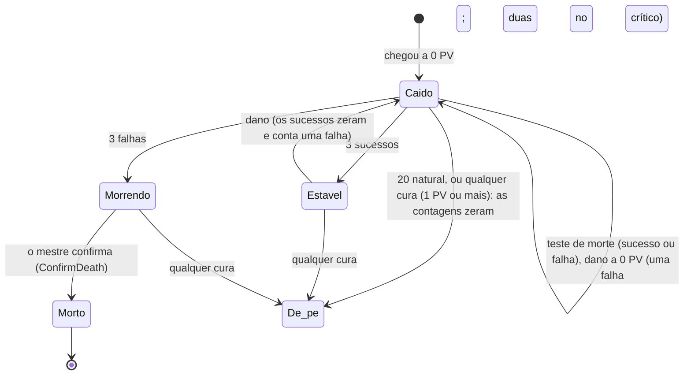
```mermaid
stateDiagram-v2
    [*] --> Caido: chegou a 0 PV
    Caido --> Caido: teste de morte (sucesso ou falha), dano a 0 PV (uma falha; duas no crítico)
    Caido --> Estavel: 3 sucessos
    Estavel --> Caido: dano (os sucessos zeram e conta uma falha)
    Caido --> Morrendo: 3 falhas
    Morrendo --> Morto: o mestre confirma (ConfirmDeath)
    Caido --> De_pe: 20 natural, ou qualquer cura (1 PV ou mais): as contagens zeram
    Estavel --> De_pe: qualquer cura
    Morrendo --> De_pe: qualquer cura
    Morto --> [*]
```

`RollDeathSave` usa `combat.DeathSave` (10 ou mais é sucesso, menos é falha, 1 natural são duas falhas, 20 natural volta com 1 PV pelos `character_vitals`); o d20 é do app ou digitado, a cada rolagem (RN-18). Dano que acerta quem está a 0 PV (o "Aplicar" do mestre) não baixa os PV: soma uma falha (`combat.DamageWhileDown`). Toda cura acima de 0 zera as duas contagens: uma magia, Retomar o Fôlego, o 20 natural, a correção dos PV do mestre (`AdjustCharacterVitals`) e um desfazer, pelo mesmo caminho dos `character_vitals` (`changeVitals`). O jogador que tenta `EndTurn` com o teste por rolar recebe `DEATH_SAVE_DUE` (o mestre passa a vez mesmo assim). Com três falhas o personagem está **morrendo**: o mestre vê a palavra "Morrendo" e confirma com `ConfirmDeath`, que chama o efeito do `MarkCharacterDead` (o personagem passa a `dead` e o jogador pode criar outro), marca o combatente como fora da ordem e passa a vez se era a dele. Para os jogadores a palavra continua "Caído", com as contagens (que são públicas): o app nunca diz que alguém morreu antes de o mestre confirmar (pergunta 39). `ConfirmDeath` não se desfaz: o personagem já está morto no módulo `characters`. As contagens ficam na linha do combatente: o combate encerrado as guarda para o resumo ("Caída: 1 sucesso, 1 falha"), e um combate novo começa em 0 e 0.

**Condições e concentração (RN-22).** As condições são rótulos (`combatants.conditions`, chaves do SRD como `condition:poisoned`): `SetCombatantConditions` troca o conjunto inteiro, só o mestre; o jogador só encerra a concentração do próprio personagem. Não há efeito nenhum. Os jogadores veem as condições dos combatentes que veem (as chaves e os nomes em português, `condition_names_pt`), nunca as de um escondido. Quando um dano é aplicado a quem está concentrado, a resposta e o registro levam `concentration_dc` (`combat.ConcentrationDC` do dano que o alvo sofre, sem o que os PV temporários absorveram): "Teste de concentração: CD 10", só para o mestre e para o jogador do alvo. O app lembra; quem rola é a mesa.

**Recursos, ações das features e Ataque Extra.** Os usos gastos de cada recurso da ficha ficam em `character_vitals.resources_used` (`{chave: usos}`, cortados ao máximo da ficha na leitura, como os espaços), e a correção do mestre (`AdjustCharacterVitals.resources_used`) os devolve: não há descanso ainda. `TakeAction` aceita as `feature_actions` do `TurnOptions`: gasta a economia (uma ação grátis não gasta nada), um uso do recurso (`NO_USES` com a `recharge`; só personagem de jogador conta usos, e um recurso que é um reservatório de pontos, como Cura pelas Mãos, fica com o mestre) e vai para o registro. Só duas mudam números: **Retomar o Fôlego** cura 1d10 + o nível de guerreiro, rolado como um dano (RN-18) e curado pelos `character_vitals`, e **Surto de Ação** devolve a ação, com os ataques da Ação de Atacar. **Ataque Extra:** `combatants.attacks_made` conta os ataques da vez; o primeiro gasta a ação, os seguintes cabem enquanto sobram (`AttacksLeft`) e o último dá `ATTACKS_USED`; o contador volta a 0 no começo da vez. O Ataque Extra é só da Ação de Atacar, ou seja, de ataques com arma: um truque (`Kind` magia) gasta a ação inteira e não conta ataque, e depois de um ataque com arma o truque dá `ACTION_USED`, e vice-versa. O multiataque de NPC continua sendo do mestre, que pode atacar de novo.

| Ação de feature, níveis 1 a 5 | Economia | Como o combate trata |
| --- | --- | --- |
| Retomar o Fôlego (guerreiro) | Ação bônus, 1 uso por descanso curto | Cura 1d10 + nível pelo caminho dos PV; gasta o uso |
| Surto de Ação (guerreiro, nível 2) | Grátis, 1 uso por descanso curto | Devolve a ação e os ataques; gasta o uso |
| Fúria (bárbaro) | Ação bônus, usos por descanso longo | Gasta o uso e registra; os efeitos são da mesa |
| Inspiração de Bardo (bardo), Palavras Cortantes (bardo, reação) | Ação bônus; reação | Gasta e registra (a inspiração tem usos por descanso longo) |
| Sentido Divino, Cura pelas Mãos (paladino) | Ação | O primeiro gasta um uso; a Cura pelas Mãos é um reservatório de pontos do mestre: gasta a ação e nenhum ponto |
| Canalizar Divindade: Expulsar Mortos-Vivos e Preservar a Vida (clérigo), Arma Sagrada e Expulsar o Profano (paladino) | Ação | Gasta a ação e um uso e registra |
| Forma Selvagem (druida) | Ação | Gasta a ação e um uso e registra |
| Conjuração Flexível: Criar Espaços de Magia e Converter Espaço de Magia (feiticeiro) | Ação bônus | Gasta a ação bônus e registra; os pontos de feitiçaria são da mesa |
| Rajada de Golpes, Defesa Paciente, Passo do Vento (monge, nível 2); Desviar Projéteis (reação); Queda Lenta (reação) | Ação bônus; reação | Gasta a economia e registra |
| Ação Ardilosa, Mãos Rápidas (ladino); Esquiva Sobrenatural (ladino, reação) | Ação bônus; reação | Gasta a economia e registra |
| Presa do Caçador: Matador de Gigantes (patrulheiro, reação); Estilo de Luta: Proteção (guerreiro e paladino, reação) | Reação | Gasta a reação e registra (fora da vez dá para usar) |
| Sopro (meio-dragão, traço da raça) | Ação | Gasta a ação e um uso e registra |

**Desfazer (compensação, não apagamento).** `UndoLastAction(expected_event_id)` desfaz um passo, só do mestre. A última ação é o último `session_events` da sessão que um desfazer ainda não desfez (`lastAction`): se for um ataque, um dano, um "Aplicar" ou "Não aplicar", uma ação padrão ou de feature, uma magia conjurada, um Escudo usado ou recusado, um teste contra a morte, as condições ou a concentração, ou o ajuste de PV de um NPC, daquele combate, pode ser desfeita (a confirmação da morte, não); qualquer evento depois (a vez passou, um movimento, uma correção dos PV) deixa `NOTHING_TO_UNDO`, porque desfazer por cima dele deixaria de ser repor o que estava antes. Cada evento guarda o antes (PV e `defeated`, a economia, os ataques feitos, o estado do dano, as contagens da morte, a concentração, as condições, o bônus de CA) e o que gastou (o espaço, o uso do recurso), e o desfazer escreve de volta, pelos mesmos caminhos (`character_vitals` para os espaços, os usos e os PV), e grava um evento `action_undone` com o ID do desfeito: o histórico guarda os dois. `expected_event_id` é o `undoable_event_id` do registro; se já é outro, `aborted`, e dois mestres nunca desfazem duas coisas. A linha desfeita some do registro.

**O registro do combate (D10, ADR-0007).** `ListCombatLog` monta o registro a cada leitura, a partir dos `session_events` do combate (a coluna `encounter_id`), da última rodada para a primeira, sem tabela própria: o histórico e o registro não podem discordar. Cada linha é estruturada (tipo, rodada, quem fez e em quem, o ataque ou a ação e o nome em português, as rolagens, o resultado, o dano e o tipo); a frase em português é do app. Os eventos de um ataque (a rolagem, o dano, o "Aplicar") viram **uma** linha, a do ataque. Entram: o começo e o fim do combate, os ataques (com o dano, a quantia que o mestre aplicou no lugar da rolada, só para ele, e o lembrete de concentração), as magias conjuradas (uma linha com o resultado em cada alvo: o ataque, a resistência, o dano ou a cura), as reações, os testes contra a morte e a morte confirmada, as condições e o fim da concentração, as ações padrão e de feature, o movimento na vez (`distance_ft`), e, só para o mestre, o ajuste de PV de um NPC e o "mostrar/esconder". A iniciativa, a ordem dos turnos e os reforços não são linhas do registro; o que acontece antes da rodada 1 também não.

| O quê | O mestre | O jogador |
| --- | --- | --- |
| Uma linha com um combatente escondido (hoje, ou quando aconteceu) | Sim, com `hidden` ligado ("Só o mestre vê") | Nenhuma: nem o ID, nem o nome, nem "espera escondido" |
| Um combatente que o mestre mostra depois | — | As linhas **novas**; as antigas (feitas escondido) continuam fora (cada evento guarda `secret`) |
| Os dados (d20 e dano) | Todos | Só os do próprio personagem; dos outros, o resultado e o dano que sofrem ou causam |
| A resistência de um alvo de magia | Os dados, o bônus e se o bônus é conhecido | O resultado como palavra (passou ou falhou); os dados só se o alvo é o personagem dele (nunca os de um NPC); a CD, só quem conjurou |
| Uma conjuração que toca um escondido | Sim, com `hidden` ligado | Nenhuma linha |
| A quantia que o mestre aplicou no lugar da rolada | As duas | Só o que o personagem levou |
| O aviso de reação (Escudo) | Todos, com o atacante | Só o do próprio personagem, sem o atacante e sem o total do golpe |
| Condições | Todas | As dos combatentes que veem |
| "Morrendo" | Sim | Nunca: "Caído", com as contagens (públicas); "Estável" e "Morto" (depois da confirmação) são para todos |
| PV depois do dano (`hit_points_after`) | Sim | Nunca (RN-20) |
| CA de qualquer um | Não faz parte do registro (o mestre a lê na ordem e na rolagem) | Nunca |
| Ajuste de PV de um NPC, mostrar/esconder | Sim | Nenhuma |
| `undoable_event_id`, `undoable` | A última ação | Nunca |

**Eventos.** Cada mudança vira um `session_events` (`encounter_started`, `initiative_submitted`, `initiative_order_set`, `combat_begun`, `turn_ended`, `combatant_moved`, `combatant_hidden_set`, `combatants_added`, `combatant_removed`, `encounter_ended`, e os das ações: `attack_rolled`, `damage_rolled`, `damage_applied`, `damage_discarded`, `action_taken`, `hit_points_adjusted`, `action_undone`, e os das magias e do resto: `spell_cast`, `reaction_used`, `reaction_declined`, `death_save_rolled`, `death_confirmed`, `conditions_set`), na mesma transação, com o payload só de IDs e números (`combat_events.go`; o evento leva o `encounter_id`, a rodada e se um escondido estava nele). O nome da arma ou da ação nunca vai no evento: o registro o lê da ficha, na hora. Só depois do `COMMIT` o `play` publica, para cada audiência o que ela pode ver (o hub ganhou a audiência "jogadores", para um evento que o mestre recebe de outra forma):

| Evento no stream | Quando | Quem recebe |
| --- | --- | --- |
| `encounter_changed{encounter_id, revision}` | Qualquer mudança no combate | Todos. É só um aviso sem conteúdo: o app lê `GetEncounter` de novo, já filtrado |
| `turn_changed{round, current_combatant_id, master_turn}` | O combate começa, a vez passa, quem está na vez some ou muda de estado | Cada um a sua cópia: o mestre vê quem é; o jogador, "Vez do mestre" se é um escondido |
| `combatant_moved{combatant_id, col, row}` | Um combatente anda | O mestre sempre; o jogador, só se vê o combatente |
| `combat_log_changed{encounter_id}` | Uma linha do registro surgiu, mudou ou sumiu (ataque, dano, ação, desfazer, movimento na vez, começo e fim) | O mestre sempre; o jogador, só se a linha não tem um escondido. Aviso sem conteúdo: o app lê `ListCombatLog` de novo |

**Idempotência e concorrência.** Toda escrita leva `idempotency_key`. Numa transação só, o `play` trava a linha da sessão aberta (`FOR UPDATE`, como a correção dos PV), confere a chave em `session_events`, muda as linhas, grava o evento e termina; a chave repetida não muda nada, não grava nada, não publica nada, e a resposta é o combate como está (a de um ataque ou de um dano refaz a rolagem do evento guardado: o reenvio nunca rola de novo, e a chave de outra mudança é `invalid_argument`). Duas mudanças ao mesmo tempo esperam uma pela outra, então o toque duplo em "Encerrar turno" nunca pula dois turnos: o segundo traz um `expected_combatant_id` que já não é o da vez e recebe `aborted` (`TestEndTurnIsIdempotent`). Um índice único parcial (`encounters_one_open_per_session`) garante um combate aberto por sessão mesmo se duas chamadas correrem juntas. Encerrar a sessão (`EndGameSession`) encerra o combate na mesma transação.

**O combate na tela.** A página da sessão (`pages/live-session`) lê o combate (`CombatClient.get`, em `core/combat`) a cada `ready` e depois de cada `encounter_changed` mais novo que a cópia que ela tem (`CombatState` compara as revisões e só deixa uma cópia mais velha de lado); `turn_changed` e `combatant_moved` entram no lugar, sem ler de novo, e um combatente que a tela não conhece manda ler. O servidor já filtrou o que cada um vê, então a tela só desenha o que chega. Quem escolhe a tela é o `CombatView` (`pages/live-session/combat`): para o mestre, a iniciativa, o combate e o resumo; para o jogador, "Role a iniciativa", a vez com o mapa e a página "Mover", e o resumo. Os erros viram português pelo código e pelo detalhe `EncounterBlocked` (`combat-errors.ts`), nunca pela mensagem. Arrastar um token salva um movimento de cada vez por combatente (`MoveSaves`), e se o servidor recusa, o token volta e a tela diz por quê. A grade do mapa tem a página própria `/campanhas/:id/mapas/:mapId/grade` (`MapService.SetMapGrid`). Imprimir o mapa também tem a página própria, `/campanhas/:id/mapas/:mapId/imprimir` (MR-033, `pages/maps/map-print`): só web, lê o mapa que já vem de `MapService.GetMap` (`grid_columns`, `grid_rows` e a imagem), faz a conta das folhas em `print-math.ts` e imprime com CSS de impressão, sem PDF no servidor. Ver [Design](design.md#imprimir-o-mapa). O código do combate é carregado só com a página da sessão: o pacote inicial não cresce.

**Conjurar, cair e reagir na tela (fatia 6.5c).** As folhas novas (`cast-sheet`, `shield-sheet`, `feature-sheet`, `conditions-dialog`) moram numa moldura só, `sheet-frame`, que rola por dentro com o rodapé fixo, e abrem por `openSheet` (folha no celular, diálogo do tablet para cima; o Escudo é um `alertdialog` sem saída). Toda a lógica pura fica em `core/combat` e é testada sem DOM: `cast-flow` (os espaços, os alvos, os dardos, o resultado), `death-saves`, `conditions` (as 15 do SRD com os nomes em português), `combat-log` (as frases novas). O `CombatClient` ganhou `castSpell`, `rollDeathSave`, `confirmDeath`, `setConditions`, o `amount` do `applyDamage` e o `asReaction` do `rollAttack`; cada ação leva a própria `idempotency_key`, feita uma vez e reenviada na retentativa. O `SpellCatalog` lê o que o SRD diz de uma magia (`GetSpellDetails`: se ela rola ataque, pede resistência ou cura) só quando a tela precisa. Os nomes em português vêm prontos do servidor: as condições (`condition_names_pt`), a magia da concentração (`concentration_spell_name_pt`) e a do aviso de reação (`spell_name_pt`), que também diz quem atacou e com quê (`attacker_label`, `attack_name_pt`) só a quem vê o atacante (RN-20). O jogador lê `GetTurnOptions` também fora da vez (o ataque de oportunidade usa os `attack_targets`), e o aviso do Escudo abre sozinho a partir de `Encounter.reaction_prompts` depois de cada `encounter_changed`; o cartão do mestre lê o mesmo dano pendente e troca ao vivo quando o jogador responde. A correção do mestre (`AdjustCharacterVitals`) durante um combate com aquele personagem sobe a revisão do encontro e publica `encounter_changed`, para as telas mostrarem "Caído" ou a cura na hora. O ataque de oportunidade aceita só ataques com `Attack.melee` (arma corpo a corpo do SRD, arremessável ou não: a adaga conta), a 1,5 m. Uma ação de característica que gasta um recurso leva o nome do recurso ("Surto de Ação", não o "Surto de Ação (1 uso)" do SRD).

### O turno conjunto

O turno do combate é de um **grupo** (MR-013, RN-19, Etapa 8, fatia 8.11). Combatentes lado a lado na ordem com o mesmo total de iniciativa, jogadores e NPCs, formam um grupo (`groupRuns`, `combat_turn.go`); quem está sozinho no total é um grupo de um. O grupo não é guardado: é calculado da ordem e dos totais quando a vez chega a ele (`nextTurnGroup`), e `combatants.turn_state` guarda a resposta, `idle` (fora do turno), `acting` ou `ended`, até o turno passar. Assim reordenar um empate, trazer um reforço ou esconder um membro no meio da vez não muda uma vez que já começou.

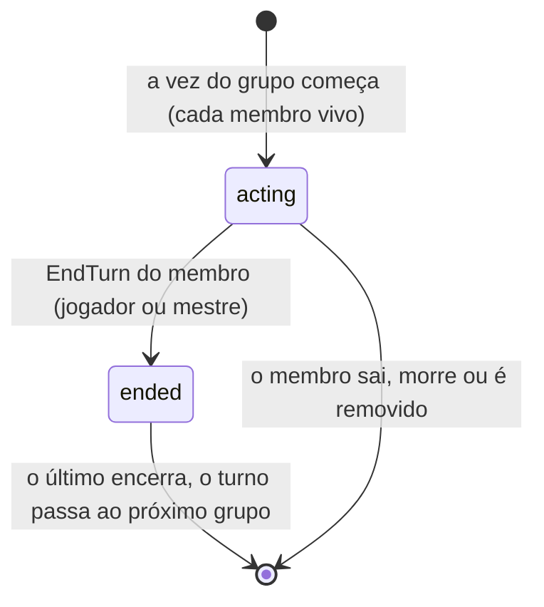
```mermaid
stateDiagram-v2
    [*] --> acting: a vez do grupo começa (cada membro vivo)
    acting --> ended: EndTurn do membro (jogador ou mestre)
    ended --> [*]: o último encerra, o turno passa ao próximo grupo
    acting --> [*]: o membro sai, morre ou é removido
```

- **Início da vez:** `startTurn` zera, para cada membro vivo, o movimento, a ação, a ação bônus, o Disparar, a reação, o bônus do Escudo e o teste contra a morte devido (`ResetCombatantTurn`), e `current_combatant_id` aponta o primeiro.
- **Toda checagem de "é a vez dele"** é `actsNow` (está no turno e a parte não terminou): `MoveCombatant`, `RollAttack`, `RollDamage`, `TakeAction`, `CastSpell`, os testes contra a morte, as reações (`mustReactNow`: quem age agora gasta a ação, não a reação) e `GetTurnOptions` (`gate`). O desfazer fica fechado depois de uma parte encerrada, porque `turn_part_ended` não é uma ação desfazível.
- **O que cada um recebe (RN-20):** `Encounter.turn_group_ids` e `Combatant.turn_part_ended` só para um grupo que tem um personagem de jogador, sem nunca um membro escondido (a vez espera a parte do mestre sem nomeá-lo); um grupo só de NPCs chega ao jogador como os ids que ele vê, sem `current_combatant_id` escolhido nem total, mais `npc_only_groups` para o plural "os Goblins"; a economia de um jogador chega a ele, ao mestre e aos outros jogadores do mesmo grupo. O stream não ganhou evento: `encounter_changed` e `turn_changed` (cada plateia a sua cópia) bastam.
- **Eventos:** `turn_part_ended` (a parte encerrada, com o turno ainda de pé) e `turn_ended` (a vez passou), além do `combat_log` "Brisa encerrou a parte dela".
- **Na web:** `core/combat/joint-turn.ts` (puro) lê isso e agrupa a ordem (`orderItems`); o cartão do mestre é `joint-card`, e `end-part` e `joint-others` são do jogador.

### Destaques do combate

Quando um combate termina, a mesa vê quem fez o quê (MR-032, Etapa 8, D8; pergunta 64, decidida pelo Samuel em 03/10/2026). `CombatService.GetCombatHighlights(encounter_id)` (`backend/internal/play/highlights.go`) é de qualquer membro, só para um combate **encerrado** da sessão aberta (senão `failed_precondition` com `EncounterBlocked` `NOT_ENDED`; um combate de outra campanha é `not_found`).

- **De onde vem.** Como o registro do combate, é calculado a cada leitura dos `session_events` do combate, nunca guardado: o histórico e os destaques não podem discordar. Um evento que o `action_undone` desfez é pulado (a primeira passada acha todos os desfeitos), e o dano de um personagem de jogador só conta quando o mestre o aplica (`damage_applied`): rolado e esperando, ou descartado, não conta.
- **O que conta**, por personagem de jogador que lutou: **dano causado** a NPCs, só os PV que realmente saíram (os temporários também; o dano além de 0 não conta: 28 rolados num goblin de 7 PV são 7); **cura feita**, o que realmente voltou, a quem for; **dano levado**, de quem for (um golpe com 0 PV é falha no teste contra a morte, não PV); **golpes finais**, NPCs que o golpe dele levou a 0 PV; **acertos críticos**, com arma e com ataque de magia. O ajuste de PV de um NPC pela mão do mestre (`AdjustCombatantHitPoints`) não é de ninguém. Quem saiu do combate (`RemoveCombatant`) não aparece.
- **As categorias**, na ordem do app: Mais dano causado, Mais cura, Tanque (mais dano levado), Golpe final e Acertos críticos. Cada uma traz o número e todos os empatados, na ordem do combate; uma categoria em que todos têm 0 fica de fora (`HighlightKind`, `HighlightCategory`).
- **O que cada um recebe (RN-20).** Nenhum NPC é nomeado, escondido ou não: o dano a um NPC escondido entra como número, e nenhuma resposta leva nome nem ID de NPC. **Todo membro** recebe as categorias com os números dos vencedores; **só o mestre** recebe também `characters`, a tabela com todos os números de cada personagem, zeros incluídos ("Números de cada jogador" na tela). O jogador recebe a lista vazia (`TestMR032_HighlightsOfTheAmbush`).
- **Testes.** O combate de referência (`timeline.md`) é o principal: Toren 23 de dano, Brisa 24 levados, Pensantus e Toren com 2 golpes finais, sem cura nem crítico, então Golpe final empata e duas categorias ficam de fora. `TestMR032_HighlightsSkipTheUndoneAndCountWhatHappened` (desfazer, cura, crítico, NPC escondido), `TestMR032_OverkillDoesNotCount`, `TestMR032_UndoneActionsAreSkipped`, `TestMR032_DamageTakenIsWhatTheMasterApplied`, `TestMR032_HealingIsWhatWasGivenBack`, `TestMR032_TiesNameEveryoneAndZerosAreLeftOut` e `TestMR032_HighlightsAuthorizationMatrix`.

### Resumo da sessão

Quando a sessão acaba, a mesa vê como foi (MR-032, Etapa 8, fatia 8.9; pergunta 64, decidida pelo Samuel em 03/10/2026). `PlayService.GetSessionSummary(campaign_id, game_session_id)` (`backend/internal/play/summary.go`) é de qualquer membro, só para uma sessão **que acabou**: a sessão aberta é recusada com `failed_precondition` (`GameSessionBlocked` `SESSION_NOT_ENDED`), porque os números dela ainda mudam e cada combate já tem os próprios destaques; uma sessão de outra campanha é `not_found`. O app sabe que o resumo existe pelo `session_ended` que o stream de todos recebe quando o mestre encerra a sessão (o evento traz o id da sessão); o mestre também abre o resumo de uma sessão antiga pela lista de sessões.

- **De onde vem.** Como os destaques, é calculado a cada leitura dos `session_events`, nunca guardado. Para cada combate que começou na sessão (`started_at` preenchido) o servidor roda o mesmo `tallyHighlights` do `GetCombatHighlights` e soma, por personagem, na ordem em que apareceram; as categorias saem do mesmo `categoriesOf`, com duas a mais: `HIGHLIGHT_KIND_CHECKS_PASSED` ("Mais testes passados fora do combate": a contagem de testes passados, e empate nomeia todos) e `HIGHLIGHT_KIND_TREASURE_FOUND` ("Mais tesouro encontrado", fatia 9.11, abaixo).
- **O que conta como teste.** Só a rolagem de `scene_check_rolled` com `dc_shown` (a cena mostrava a CD aos jogadores quando foi feita) e `passed` preenchido (a ação tinha CD). Uma rolagem numa cena que escondia a CD não entra em conta nenhuma, para ninguém (RN-20): a cena nunca disse ao jogador se passou, e o resumo também não diz. O mestre desligar a chave depois não tira as rolagens feitas com ela ligada; ligá-la depois não põe as feitas antes. **"Mais tesouro encontrado" (MR-041, Etapa 9, fatia 9.11).** A última categoria (`HIGHLIGHT_KIND_TREASURE_FOUND = 7`, só do resumo da sessão: os destaques de um combate nunca a devolvem) e o `treasure_found_po` de cada personagem (`SessionCharacterSummary`, na tabela do mestre e no `mine` do jogador) vêm das PO que cada personagem achou **naquela sessão**: os tesouros com `treasure_session_id` igual ao dela, cada valor dividido entre quem achou e arredondado para baixo (125 e 125 para 251 PO de dois). O `play` pede ao `maps` pela interface que já tem, `MapKeeper.TreasureFoundIn(session_id)` (a consulta `ListTreasureFindsOfSession`); a conta é feita na leitura, como o resto, e **decisão: lê os dados vivos**. Conta os tesouros achados naquela sessão com o valor e os finders **como estão agora**, e não os eventos `treasure_found`: marcar de novo para trocar quem achou não escreve evento, então os eventos não bastam como fonte. O custo é aceito: editar um tesouro depois muda o resumo de uma sessão antiga (um tesouro convertido, porém, fica travado, e um desmarcado deixa de contar). Um tesouro achado fora de uma sessão não tem sessão e não conta; um desmarcado depois perdeu a sessão e os finders e também não conta. Quem achou e não lutou nem rolou teste entra no resumo por isso. Todo membro recebe a categoria (tesouro achado é público) e vale em qualquer modo de XP; é um número diferente do XP de "Voltar à cidade", que divide entre quem o mestre escolher. Teste: `TestMR032_SummaryCountsTreasureFoundInTheSession`.
- **O que cada um recebe (RN-20).** **Todo membro**: o início, o fim e a duração, e as categorias com os vencedores e o número deles, sem o "de N". **O mestre**, também: quantos combates e cenas abertas (abrir de novo conta de novo), os testes passados e tentados no total ("9 de 12") e a tabela `players` com cada personagem que lutou ou rolou um teste, zeros incluídos ("Pensantus: 3 de 4"). **O jogador**, em vez disso: o `mine`, o próprio resultado (o dano dele e os testes passados de tentados), e nunca o de outro jogador. Nenhum NPC é nomeado.
- **A tela (fatia 8.14).** O app lê o resumo quando a página da sessão passa para "encerrada" (o mestre confirmou o fim, ou o stream mandou `session_ended`): `SessionEnded` (`pages/live-session/session-ended`) chama `GetSessionSummary` com o id da sessão que a página já tinha e desenha o painel do mestre ou o cartão do jogador; se a leitura falhar, cai no aviso simples "A sessão acabou". A tela não calcula nada: escreve os campos que o servidor mandou. Os quadros dos destaques, a tabela por jogador e o cartão ficam em `web/src/app/shared/highlights` e são os mesmos do fim do combate.
- **Testes.** `TestMR032_SessionSummary` (um combate e três cenas, uma com a CD escondida: Pensantus 1 de 3, Toren 2 de 3, Brisa 2 de 2; o mestre, cada jogador e as recusas), `TestRN20_SessionSummaryHidesWhatTheSceneHid` (lê cada resposta do jogador como JSON), e as linhas do `GetSessionSummary` e do `GrantSceneAttempt` nas matrizes de autorização (`TestAuthorizationMatrix`, `TestSceneAuthorizationMatrix`).

## Módulo progression: XP e marcos

O mestre dá XP ao grupo e registra marcos; a campanha inteira lê o histórico e o XP de todos (MR-016, RN-09, RN-12; pergunta 50, decidida pelo Samuel em 03/10/2026). O módulo `progression` tem as tabelas `xp_awards` e `xp_award_shares` (ver [Dados](dados.md)) e o `ProgressionService`. O XP em si é um número da ficha (`FullSheet.experience_points`), então quem o muda é o `characters`; o `progression` pede por uma interface.

| Chamada | Mestre | Jogador | Não membro | Anônimo | Membro pendente (RN-15) |
| --- | --- | --- | --- | --- | --- |
| `AwardXP`, `MarkMilestone`, `UndoLastXPAward`, `ListTreasuresToConvert` | Sim | `permission_denied` | `not_found` | `unauthenticated` | `not_found` |
| `AddMilestone`, `UpdateMilestone`, `MoveMilestone`, `RemoveMilestone`, `MarkMilestoneReached`, `GiveMilestoneTo` | Sim | `permission_denied` | `not_found` | `unauthenticated` | `not_found` |
| `ListXPAwards`, `GetCampaignExperience` | Sim | Sim | `not_found` | `unauthenticated` | `not_found` |
| `ListMilestones` | Sim, todos | Sim, só os alcançados | `not_found` | `unauthenticated` | `not_found` |

O `TestAuthorizationMatrix` do módulo chama cada método como cada um desses papéis e falha se um método novo não estiver na tabela dele.

- **Os modos (RN-09).** `AwardXP` recebe `ENEMIES` (o total é a soma do `xp_value` dos NPCs derrotados de um combate **encerrado**, um prêmio por combate, a menos que seja desfeito), `GOLD` (1 XP por PO) ou `MANUAL` (o número que o mestre digitou). O modo precisa caber na campanha: campanha por inimigos aceita `ENEMIES` e `MANUAL`; por ouro, `GOLD` e `MANUAL`; por marcos, nenhum deles, só `MarkMilestone`. Fora disso, `failed_precondition` com o detalhe `XPBlocked` (`MODE_NOT_ALLOWED`, que traz o modo da campanha). Os outros motivos: `ENCOUNTER_NOT_ENDED`, `ALREADY_AWARDED`, `NOTHING_TO_GIVE` (total 0, ou pouco demais para dar 1 XP a cada um), `NOTHING_TO_UNDO` e `CHARACTER_NOT_ELIGIBLE` (quem não é personagem de jogador vivo da campanha: morto, pendente, NPC ou de outra campanha; o detalhe traz o ID).
- **A divisão.** `rules.SplitXP(total, quantos)`, arredondada para baixo (100 para 3 dá 33, e 1 se perde: a resposta traz `lost_xp`; pergunta 46, decidida pelo Samuel em 03/10/2026). Quem recebe é a lista que o mestre manda (`character_ids`, 1 a 40, sem repetir): o servidor não decide quem lutou, a tela propõe (pergunta 45, decidida pelo Samuel em 03/10/2026).
- **O prêmio é uma transação só.** O `progression` grava o prêmio e as partes, soma cada parte em `experience_points` na ficha, por `characters.AddExperience` (a interface `progression.Party`), e acrescenta o evento da sessão, tudo junto. A trava da ficha (RN-01) não impede: é um ato do mestre. O XP fica entre 0 e 1.000.000, e a revisão da ficha sobe.
- **"Voltar à cidade" (Etapa 9, fatia 9.11, MR-041, pergunta 75).** É um prêmio `GOLD` com `treasure_point_ids`, sem tipo novo de prêmio nem de evento. O `progression` nunca lê as tabelas do `maps`: pede por `progression.Treasures`, que o `maps.Treasures` implementa (`backend/internal/maps/treasure_convert.go`, ligado no `cmd/api`). `ListTreasuresToConvert` (só o mestre, `IDEMPOTENT`) lê os tesouros achados e não convertidos (`ListUnconverted`, que não lê a tabela de personagens: devolve os IDs de quem achou, por ID) e pede os nomes ao `characters`, que ordena quem achou por nome; devolve no máximo 100, os mais antigos (o que uma conversão aceita), e `total` diz quantos há. O histórico (RN-10) dá ao jogador só `treasure_count` e `gold`; a lista `treasures` (IDs e PO de cada um) é do mestre. Nenhuma API entrega o evento cru a um jogador: o stream só manda a dica `xp_changed`. Dentro da transação do prêmio: `LockForConversion` trava as linhas dos pontos (`SELECT … FOR UPDATE`) e o `progression` confere cada um (`not_found` se não é tesouro da campanha, `TREASURE_NOT_FOUND_YET`, `TREASURE_ALREADY_CONVERTED`, e `TREASURES_OVER_LIMIT` se somam mais de 1.000.000 PO), soma as PO (o total e a coluna `gold` do prêmio), grava o prêmio, as partes e, em `xp_award_treasures`, os tesouros; `MarkConverted` preenche `map_points.treasure_converted_award_id`. Duas conversões ao mesmo tempo esperam uma pela outra na trava, e a segunda encontra o tesouro convertido (`TestMR041_ATreasureIsConvertedOnce`). O desfazer chama `Release`, que limpa a ligação na mesma transação; só o último prêmio se desfaz, então um tesouro convertido por um prêmio que não é mais o último continua convertido (o mestre corrige à mão). O evento `xp_awarded` ganha `treasures` (ID e PO de cada um, nada de nome) e o `xp_award_undone` também; o histórico (`XPAward.treasures`) sobrevive ao desfazer. A divisão é a de sempre (`SplitXP`). Em campanha por inimigos ou por marcos o modo é recusado (`MODE_NOT_ALLOWED`); o tesouro dela só aparece no mapa e no resumo.
- **Marcos (RN-12, pergunta 48).** `MarkMilestone` (só em campanha por marcos) grava um prêmio `milestone` com partes de 0 XP e o nível total de cada personagem na hora (`level_at_mark`). "Pode subir de nível" dura enquanto o nível da ficha não passa desse: a leitura compara, e nada é gravado quando o mestre sobe o nível.
- **Marcos planejados (Etapa 8, fatia 8.10, MR-016, pergunta 45).** Na campanha por marcos, o mestre escreve os marcos antes (`planned_milestones`, até 100 por campanha, 1 a 120 caracteres, na ordem dele) com `AddMilestone`, `UpdateMilestone`, `MoveMilestone` e `RemoveMilestone`, uma mudança por chamada e no formato das pistas de cena (cada uma responde com a lista toda, que o app adota; só marco ainda planejado muda, senão `failed_precondition` `MILESTONE_ALREADY_REACHED`; `resource_exhausted` no 101º). `MarkMilestoneReached(milestone_id, character_ids, idempotency_key)` e `GiveMilestoneTo` reusam o `give` do `MarkMilestone`: o mesmo prêmio `milestone`, com o texto do marco como motivo e `xp_awards.milestone_id` apontando para ele, então `can_level_up`, o evento `milestone_marked` (com o `milestone_id`, nunca o texto) e o `xp_changed` são os de sempre; dentro da transação o marco é travado (`FOR UPDATE`), para dois marcos ao mesmo tempo se revezarem. **Alcançado** é derivado: ter um prêmio ligado a ele que não foi desfeito. Todas as escritas de marco (inclusive editar, mover e remover) conferem o modo da campanha (`MODE_NOT_ALLOWED`). Uma chave de idempotência reusada precisa ser o mesmo pedido: mesmo tipo (marcar ou "Dar a mais alguém", guardado em `xp_awards.milestone_again`), mesmo marco e mesmos personagens, senão `invalid_argument` e nada é dado. Um marco que já teve algum prêmio, mesmo desfeito, não é removido (`MILESTONE_HAS_HISTORY`): apagá-lo limparia o `milestone_id` de prêmios, e o histórico nunca se reescreve. Marcar de novo dá `MILESTONE_ALREADY_REACHED`; `GiveMilestoneTo` num marco planejado dá `MILESTONE_NOT_REACHED`, e num personagem que já o tem, `CHARACTER_ALREADY_MARKED`. O desfazer continua o do último prêmio: sem marca viva o marco volta a planejado; desfazer uma marca de "Dar a mais alguém" tira só aquela. `ListMilestones` (qualquer membro) dá ao mestre tudo na ordem dele e ao jogador **só os alcançados** (RN-20: o servidor nem monta os planejados para ele), cada um com as marcas vivas (`XPAward`: quem, quando, `can_undo` só do mestre), e, por último, os registrados fora da lista (`off_list`, o ID é o do prêmio). Campanha que conta XP responde `MODE_NOT_ALLOWED`. No app, o `MilestonesStore` guarda a lista e `pages/campaign-detail/milestones` tem o painel (planejados, alcançados, personagens e a folha "Marcar como alcançado"); a página da campanha não escuta o stream, então a tela do jogador se atualiza ao reabrir a aba.
- **Desfazer (ADR-0007).** `UndoLastXPAward` desfaz só o último prêmio que não foi desfeito (`expected_award_id`, opcional, dá `aborted` se outro já é o último): subtrai cada parte das fichas (nunca abaixo de 0) ou desliga as marcas, e preenche `undone_at` e `undone_by`. O prêmio continua no histórico com a etiqueta "Desfeito"; nada é apagado. Para desfazer um anterior, desfaz-se os mais novos antes (a pergunta 50 pode vir a pedir mais).
- **Idempotência.** Toda escrita leva `idempotency_key`. A chave fica no próprio prêmio (e a do desfazer em `undo_key`), não em `session_events`, porque o prêmio existe com ou sem sessão aberta: a mesma chave não muda nem publica nada e devolve o que a primeira fez; a chave de outra mudança é `invalid_argument`.
- **Leitura.** `ListXPAwards` pagina do mais novo ao mais antigo (`page_size` 1 a 50, `page_token` opaco) com quem deu (nome de exibição), o modo, o motivo, o nome do combate, as partes (nome do personagem e XP), se foi desfeito e `can_undo` (só para o mestre, no último). `GetCampaignExperience` traz cada personagem de jogador vivo com nível, XP, XP do próximo nível, `can_level_up` e o motivo (`XP` ou `MILESTONE`).
- **"Pode subir de nível" na ficha.** `GetCharacter` traz `can_level_up` e `level_up_reason`, só para o mestre e para o dono, de um personagem de jogador vivo. A regra mora no `progression` (`levelUpReason`): em campanha por inimigos ou por ouro, o XP da ficha chegar ao do próximo nível (`DerivedSheet.next_level_xp`); em campanha por marcos, uma marca de marco cujo nível ainda não foi ultrapassado. Ninguém sobe do nível 20. O `characters` pergunta ao `progression` por uma interface (`characters.LevelUps`, ligada no `cmd/api` com `SetLevelUps`), a mesma volta que o `campaigns` e o `characters` fazem.
- **Na sessão ao vivo.** Com uma sessão aberta, cada prêmio, desfazer e marco vira uma linha em `session_events` (`xp_awarded`, `xp_award_undone`, `milestone_marked`), pela interface `progression.SessionLog` que o `play` implementa, com IDs e números só: nem o motivo nem nome algum entram no payload (o motivo fica em `xp_awards`). Depois do commit sai `xp_changed`, um aviso sem conteúdo (campo 14 do `WatchGameSessionResponse`) para todos da sessão, mestre e jogadores: o app lê o histórico e o XP de novo, onde pode. Sem sessão aberta, o XP é dado igual e nada é gravado nem publicado.
- **O XP do NPC (RN-20).** O nível de desafio (`challenge_rating`) e o `xp_value` são campos da ficha de NPC (`FullSheet` de inimigo e chefe, `BasicSheet` de lacaio); o servidor confere o nível contra a lista do `rules`, o XP de 0 a 1.000.000, e a ficha de um jogador recusa os dois com `invalid_argument` (nada se perde calado). Ao entrar no combate, o NPC leva o `xp_value` para `combatants.xp_value`, e só o mestre recebe `Combatant.xp_value`. O jogador nunca vê a ficha de um NPC, e o combate dele não tem o número (`TestRN20_PlayersNeverGetAnNPCsXP`).
- **No app (Etapa 7, fatia 7.4).** O cliente é `web/src/app/core/progression` (`ProgressionClient`, carregado só por código preguiçoso; as cinco chamadas; a chave de idempotência nasce uma vez por ação e vai de novo na repetição). Os erros viram português pelo código e pelo detalhe `XPBlocked` (`xp-errors.ts`), nunca pela mensagem. O `ExperienceStore` lê o XP e o histórico de uma campanha e é entregue por quem usa: a página da campanha (o painel "Experiência" e a etiqueta "Pode subir de nível" da lista), o "Dar XP" da sessão e o fim do combate; uma leitura ultrapassada por outra mais nova é descartada. Na sessão ao vivo, o `xp_changed` chega pelo mesmo `LiveStream` e soma 1 no `XpChanges`: tudo que depende de XP na página (o fim do combate, o "Dar XP") lê de novo. A ficha do personagem escuta a sessão pelo mesmo cliente (`XpWatcher`, que usa o `LiveStream` e o `LiveSessionSourceLive`, não uma cópia), só enquanto a campanha tem sessão aberta e até a página sair; sem sessão, lê ao abrir. A divisão que a tela mostra ao vivo (`xp-math.ts`) repete a do servidor (para baixo); quem vale é a resposta do servidor (`xp_each`, `lost_xp`). O texto do motivo e o "O que aconteceu" levam o aviso de ficção (`docs/privacidade.md`).
- **Como os módulos se ligam.** `progression` declara `Party` (implementada pelo `characters`: `Party`, `Names`, `AddExperience`), `Combats` e `SessionLog` (pelo `play`: `CampaignEncounter`, `EncounterNames`, `AppendEvent`, `PublishXPChanged`), `Campaigns` (`CampaignXPMode`) e `Profiles` (nomes de exibição); os tipos que atravessam ficam em `progression/link`. O `cmd/api` liga tudo. Nenhum pacote importa o código de outro.

## Módulo notes: anotações dos jogadores

Cada jogador escreve anotações particulares na campanha e lê, na mesma lista, as pistas que o mestre revelou a ele (MR-030, MR-029; Etapa 8, decisões D5 e D6 do plano, perguntas 59 a 61, decididas pelo Samuel em 03/10/2026). O módulo `notes` tem a tabela `player_notes` (ver [Dados](dados.md)) e o `NotesService`, em `proto/meurpg/notes/v1/notes.proto`; o código fica em `backend/internal/notes`. **O mestre não lê as anotações** (pergunta 60), e nenhum outro jogador também: todo SQL do módulo filtra pelo autor, então a anotação de outra pessoa nunca é encontrada.

| Chamada | Mestre | Jogador ativo | Não membro | Anônimo | Membro pendente (RN-15) |
| --- | --- | --- | --- | --- | --- |
| `ListNotes`, `CreateNote`, `UpdateNote`, `DeleteNote`, `ListNoteScenes` | `not_found` | Sim, nas próprias anotações | `not_found` | `unauthenticated` | `not_found` |

O mestre recebe `not_found`, e não `permission_denied`, de propósito: ele não tem anotações, e a resposta é a mesma de uma anotação que não existe. Uma anotação de outro jogador, o ID de uma pista e um ID que não existe também são `not_found`. O `TestNotesAuthorizationMatrix` chama cada método como cada um desses papéis e falha se um método novo não estiver na tabela.

- **A lista** (`ListNotes`): as anotações do jogador e as pistas reveladas a ele, da mais nova à mais antiga (uma anotação pela última escrita, uma pista pela chegada), com filtro opcional por cena. Uma pista vem como `NOTE_KIND_CLUE`: só leitura, sem editar nem apagar, e **não conta** nas 300 anotações. A resposta traz `note_count` e `max_notes`. A lista não é paginada: no máximo 300 anotações e as pistas.
- **Os limites**: o texto de uma anotação tem de 1 a 2.000 caracteres (várias linhas), e cada jogador tem no máximo 300 por campanha (`resource_exhausted`, conferido na transação do `INSERT`).
- **A etiqueta de cena**: só uma cena **descoberta** (ver [Cenas de RP](#cenas-de-rp)). Uma cena não descoberta e uma que não existe são recusadas do mesmo jeito (`invalid_argument`, a mesma mensagem), para o jogador nunca saber que ela está lá. `ListNoteScenes` é o seletor: só as cenas descobertas, pelo nome de hoje. O nome de uma cena só chega a um jogador por essas listas depois de descoberta; a etiqueta de uma anotação ou de uma pista só mostra o nome enquanto a cena é descoberta (uma pista de cena ainda não descoberta chega sem etiqueta).
- **Como se liga ao `maps`.** As cenas descobertas e as pistas recebidas são tabelas do `maps`; o `notes` declara a interface `Scenes` (`DiscoveredScenes`, `ReceivedClues`), implementada por `maps.SessionMaps` e conectada no `cmd/api`, com os tipos simples em `notes/link`. Nenhum módulo importa o outro.
- **Excluir a conta** apaga as anotações e as pistas recebidas (`ON DELETE CASCADE`). Hoje não existe sair da campanha nem ser removido como membro ativo; quando existir, apagar as anotações dele entra na mesma transação (como já acontece com o membro pendente que o mestre recusa ou remove: os dados dele somem junto).
- **Texto livre e logs**: o texto de uma anotação nunca entra em log nem em evento (ver [Privacidade](privacidade.md)).

## Módulo maps: galeria e imagens

A galeria guarda as imagens que o mestre usa nos mapas e no documento da campanha (MR-019). O servidor aceita só JPEG, PNG e WebP, grava cada imagem codificada de novo, sem nenhum metadado, e só a entrega a quem pode vê-la: o mestre da campanha, ou o jogador enquanto a imagem está visível para ele. O código fica em `backend/internal/maps`, com os mapas, os pontos de interesse e os tokens (ver [Módulo maps: mapas](#módulo-maps-mapas-pontos-e-tokens)).

| Rota ou chamada | Quem pode | O que faz |
| --- | --- | --- |
| `POST /uploads/images` | O mestre da campanha | Recebe a imagem (formulário `multipart/form-data`: `campaign_id`, depois `file`), confere, codifica de novo, guarda e responde `201` com o `GalleryImage` em JSON |
| `GET /images/{id}` e `GET /images/{id}/thumb` | O mestre da campanha da imagem; o jogador, só enquanto vê a imagem (o fundo de um mapa que ele vê, a imagem mostrada na sessão, ou uma imagem que o mestre deixou com os jogadores) | Entrega a imagem, ou a miniatura de 480 px no lado maior |
| `GalleryService.ListGalleryImages` | O mestre | Lista a galeria, da mais nova para a mais antiga, com o uso da cota |
| `GalleryService.RenameGalleryImage` | O mestre | Muda o nome (1 a 80 caracteres, uma linha) |
| `GalleryService.DeleteGalleryImage` | O mestre | Apaga a linha e os arquivos. Recusa com `failed_precondition` se um mapa usa a imagem; se for o retrato de um NPC, o retrato é limpo (MR-031) |

Enviar e baixar não são chamadas Connect porque o corpo é um arquivo. As duas rotas usam o mesmo cookie de sessão e as mesmas checagens do `authz` (ver [Quem está chamando](#quem-está-chamando)). O contrato inteiro, com os erros, fica no comentário do `GalleryService` em `proto/meurpg/maps/v1/gallery.proto`.

### O envio

```mermaid
sequenceDiagram
    participant M as Mestre, no navegador
    participant A as API, rota de envio
    participant I as maps/images
    participant B as Blob store
    participant DB as CockroachDB
    M->>A: POST /uploads/images, campaign_id e depois file
    A->>A: CrossOriginProtection, sessão, só o mestre
    A->>DB: A galeria já está cheia?
    A->>A: Lê o arquivo, no máximo 10 MiB
    A->>I: Process, uma imagem por vez
    I->>I: Tipo pelos primeiros bytes, tamanho pelo cabeçalho
    I->>I: Decodifica, desvira pela orientação do EXIF, codifica de novo, faz a miniatura
    I-->>A: A imagem limpa e a miniatura
    A->>B: Put da imagem e da miniatura
    A->>DB: BEGIN, conta a cota, INSERT gallery_images, COMMIT
    alt a cota estourou ou o banco falhou
        A->>B: Delete dos dois arquivos
        A-->>M: 429 QUOTA ou 503
    else deu certo
        A-->>M: 201 com o GalleryImage em JSON
    end
```

- **A ordem economiza trabalho.** O `campaign_id` vem antes do arquivo, então quem não é o mestre recebe a recusa antes de o servidor ler 10 MiB. Uma olhada rápida na cota também vem antes; a checagem que vale é a de dentro da transação, que o `SERIALIZABLE` do CockroachDB protege de dois envios ao mesmo tempo.
- **O tipo vem dos bytes,** nunca do nome do arquivo nem do que o navegador diz. SVG, GIF e o resto são recusados.
- **Bomba de descompressão.** O servidor lê só o cabeçalho primeiro (`image.DecodeConfig`) e recusa acima de 8.192 px num lado ou de 40 megapixels. Também estima a memória que a decodificação vai usar (um JPEG progressivo ou um PNG de 16 bits gastam bem mais por pixel) e recusa acima de 256 MiB. Só uma imagem é processada por vez em cada instância, então alguns envios juntos não esgotam os 512 MiB do Cloud Run (ver [Operação](operacao.md)).
- **Codificar de novo é o que limpa.** A imagem nova tem só os pixels: EXIF (com a posição do GPS), XMP, perfis ICC, os textos de um PNG e qualquer coisa escondida depois da imagem ficam para trás. PNG continua PNG, para o mapa e o retrato de um NPC manterem as partes transparentes (a miniatura também mantém o alfa; `TestTransparentPNGKeepsAlpha`). JPEG continua JPEG, com qualidade 88. WebP vira JPEG, ou PNG quando tem pixels transparentes.
- **A foto fica em pé.** O celular grava a foto como o sensor viu e anota no EXIF como estava virado. Como o EXIF sai, o servidor desvira os pixels antes, senão a foto apareceria deitada.
- **O nome** vem do nome do arquivo, sem pastas, sem extensão e sem caracteres de controle, cortado em 80 caracteres ("Imagem" quando não sobra nada). O mestre pode mudar.
- **Os arquivos antes da linha.** Se algo falha depois de gravar um arquivo, os dois arquivos são apagados. Uma queda do servidor bem no meio pode deixar arquivos sem linha, que ninguém alcança; uma limpeza periódica pode achá-los depois pelo prefixo da campanha.

### Onde as imagens ficam

O pacote `backend/internal/platform/blob` é uma interface pequena (`Put`, `Open`, `Delete`) com uma implementação em disco. As chaves são `campaigns/<campanha>/images/<id>` e `…/<id>.thumb`: tudo de uma campanha tem o mesmo prefixo.

| Onde | Como |
| --- | --- |
| Ambiente local | `BLOB_DIR=/var/lib/meurpg/images`, num volume do Docker Compose (`images`), que sobrevive ao `make down` |
| Testes | Uma pasta temporária por teste |
| Produção | Um bucket privado do Cloud Storage, em São Paulo, atrás da mesma interface, a partir do primeiro deploy (ver [Operação](operacao.md)) |

- **Em disco,** cada arquivo começa com uma linha com o tipo (`image/jpeg`), seguida da imagem. O `Put` escreve num arquivo temporário e renomeia por cima, então ninguém lê meio arquivo. Toda operação passa por um `os.Root`, que recusa qualquer caminho fora da pasta, mesmo por um link simbólico, e a chave só aceita letras minúsculas, dígitos, `.`, `-` e `_`. Os erros não levam o caminho, porque a chave tem IDs.
- **Sem `BLOB_DIR`,** as imagens ficam desligadas: o envio, o download e o `GalleryService` respondem `503`/`unavailable`, e o resto do app funciona. O log de início avisa.
- **Apagar** tira a linha primeiro e os arquivos depois: sem a linha, ninguém alcança os arquivos, então uma falha ao apagá-los não expõe nada (vai para o log).
- **Apagar a campanha** (hoje, só pela exclusão da conta do mestre) apaga as linhas pelo `ON DELETE CASCADE`, mas não os arquivos. Quem implementar a exclusão da campanha ou da conta precisa apagar também o prefixo `campaigns/<campanha>/` (ver [Privacidade](privacidade.md)).

### Servir as imagens

O mestre baixa toda imagem da campanha; o jogador, só a imagem que ele vê agora (RN-10). `GET /images/{id}` (e `/thumb`) confere, nesta ordem:

1. sessão válida, senão `401`, antes de procurar a imagem;
2. a imagem existe e quem pede é membro ativo da campanha dela, senão `404`, igual a uma imagem que não existe, nunca `403`;
3. para o jogador, a imagem está visível para ele agora: é o fundo de um mapa que ele vê (revelado, ou o mapa atual da sessão aberta) a imagem que o mestre mostra na sessão aberta (MR-028), uma imagem deixada com os jogadores, ou o retrato de um NPC que está no palco da cena aberta (MR-031). Senão, `404`. **Nunca** a imagem que é o fundo de um mapa com a névoa ligada (`ImageIsOnAFogMap`): o jogador só a recebe, desenhada, quadrado por quadrado (MR-036; [A imagem de um mapa com névoa](#a-imagem-de-um-mapa-com-névoa)). São leituras de cada módulo: o que a sessão mostra vem do `play` (`LiveSession.OnScreen`), os mapas, de uma consulta só (`ImageIsOnAVisibleMap`, pelo índice `maps_image_id_idx`), e o palco, de `LiveSession.ImageOnStage`, só se as outras não bastaram.

Só depois disso vem o `304` do `If-None-Match`: nem um estranho descobre que a imagem existe mandando o ETag, nem um jogador continua com uma imagem que não vê mais.

| Header | Valor | Por quê |
| --- | --- | --- |
| `Cache-Control` | Mestre: `private, max-age=31536000, immutable`. Jogador: `private, no-cache` | Os bytes de um ID nunca mudam (um envio novo ganha um ID novo), então o mestre guarda a imagem por um ano. O jogador pode deixar de ver a imagem a qualquer momento (o mapa escondido de novo, a imagem que parou de ser mostrada), então o navegador dele pergunta de novo a cada uso: `304` sem corpo enquanto ele vê, `404` depois. `private`, porque é só daquele membro |
| `Vary` | `Cookie` | Num navegador usado pelo mestre e por um jogador (um sai, o outro entra), a cópia de um nunca responde pelo outro: um cookie de sessão novo é outra entrada no cache |
| `ETag` | `"<id>"` (miniatura: `"<id>.thumb"`) | O navegador revalida sem baixar de novo (`304`) |
| `Content-Type`, `Content-Length` | Do arquivo guardado | — |
| `X-Content-Type-Options: nosniff` e `Content-Disposition: inline` | — | O navegador trata o arquivo como a imagem que o `Content-Type` diz |
| `Content-Security-Policy: default-src 'none'` | — | Mesmo aberta sozinha numa aba, a resposta não roda nada |
| `Cross-Origin-Resource-Policy: same-origin` | — | Outro site não embute a imagem |

O CSP do app já aceita as imagens (`img-src 'self'`), e o handler do Angular deixa `/images` e `/uploads` para a API (`isAPIPath`); no `ng serve`, o `proxy.conf.json` encaminha as duas.

**RN-10 com imagens.** O jogador baixa uma imagem só enquanto a vê: saber o ID não basta, porque ele guarda os IDs de mapas escondidos de novo e de imagens que pararam de ser mostradas (decidido pelo integrador em 30/09/2026, junto com a MR-028; antes, qualquer membro baixava qualquer imagem da campanha pelo ID). O ID só chega a ele numa resposta que pode ver (um mapa que ele vê, a imagem que o mestre mostra, ou a lista de imagens deixadas), e a rota confere de novo a cada pedido, também na lista `campaign_left_images`: deixada, é servida; tirada pelo mestre, volta a `404` (`TestRN10_PlayersOnlyFetchImagesTheyCanSee`). O nome da imagem na galeria vai ao jogador só na imagem mostrada e nas deixadas com ele, como legenda; num mapa, só ao mestre. A galeria, que lista todas as imagens, é só do mestre (`TestMR019_PlayersCannotListTheGallery`). Quem não é membro ativo recebe `404` (`TestAuthorizationMatrix`, no `maps`). O que continua fora do alcance do servidor: a imagem que o navegador já desenhou na página, e o que alguém salvou ou fotografou da tela.

### Os erros do envio

A rota não é Connect, mas os erros usam os códigos do Connect, num JSON pequeno que o app traduz pelo `reason`: `{"code": "invalid_argument", "reason": "UNSUPPORTED_TYPE", "message": "..."}`. A `message` é em inglês, para quem desenvolve; a tela mostra um texto próprio para cada `reason`.

| HTTP | `code` | `reason` | Quando |
| --- | --- | --- | --- |
| 400 | `invalid_argument` | `UNSUPPORTED_TYPE` | Não é JPEG, PNG nem WebP |
| 413 | `invalid_argument` | `TOO_LARGE` | Mais de 10 MiB, enviado ou depois de codificado de novo |
| 400 | `invalid_argument` | `DIMENSIONS` | Pixels demais |
| 400 | `invalid_argument` | `CORRUPT` | Parece uma imagem aceita, mas não abre |
| 400 | `invalid_argument` | `MALFORMED_REQUEST` | Não é um formulário `multipart`, falta um campo, sobra um campo, ou a ordem está errada |
| 429 | `resource_exhausted` | `QUOTA` | A campanha já tem 300 imagens, ou passaria de 500 MiB |
| 401, 403, 404 | `unauthenticated`, `permission_denied`, `not_found` | — | Sem sessão; um jogador; quem não é membro (ou a campanha não existe) |
| 503 | `unavailable` | — | Imagens desligadas (sem `BLOB_DIR`), ou o banco ou o armazenamento não responderam |

O `403` do `CrossOriginProtection` (um envio de outro site) vem antes de tudo isso, em texto puro: o app nunca o vê.

### No app

A tela da galeria (`/campanhas/:id/galeria`), o painel "Galeria" da página da campanha e o seletor de imagem usam três peças de `web/src/app/core/images/`, todas carregadas só pelas rotas lazy:

- `GalleryClient`: o `GalleryService` gerado (listar, renomear, apagar).
- `ImageUploader`: o `POST /uploads/images`, com `XMLHttpRequest` e `FormData` (`campaign_id`, depois `file`, sem escrever o `Content-Type`). É XHR, e não `fetch`, porque só o XHR informa o progresso do envio; o app não tem `HttpClient`, e colocá-lo só para isto pesaria mais. A resposta `201` vira o `GalleryImage` gerado (`fromJson`).
- `UploadQueue`: envia os arquivos um depois do outro, cada um com o próprio progresso, cancelamento e erro. Antes de enviar, confere no próprio navegador o tipo (JPEG, PNG ou WebP), o tamanho (10 MB) e o número de imagens, com o `GalleryUsage` do `ListGalleryImages`. Os bytes da cota ficam com o servidor, porque ele conta a imagem já codificada de novo, que pode ser bem menor que o arquivo.

O texto de cada erro vem do `reason` (ou do `code`, ou do status HTTP), nunca da `message` (`upload-errors.ts`). As imagens na tela vêm sempre de `/images/<id>` ou `/thumb`, da mesma origem: o CSP (`img-src 'self'`) não deixa mostrar uma prévia do arquivo antes do envio (uma URL `blob:`).

## Módulo maps: mapas, pontos e tokens

Um mapa é uma imagem da galeria com pontos de interesse e tokens por cima (MR-008, MR-009, MR-012). O mestre prepara tudo escondido e revela aos poucos; o servidor decide o que cada um vê (RN-10), e o jogador nunca recebe o que está escondido. O código fica em `backend/internal/maps` (`mapservice.go` e as regras de quem vê o quê em `visibility.go`), e o contrato no `MapService` de `proto/meurpg/maps/v1/maps.proto`.

| Chamada do `MapService` | Quem pode | O que faz |
| --- | --- | --- |
| `ListMaps` | Membros da campanha, filtrado | Os mapas, do mais antigo para o mais novo, cada um com a imagem, se está revelado, se é o mapa atual, quantos pontos tem e de quais mapas é submapa |
| `GetMap` | Membros da campanha, filtrado | Um mapa com os pontos e os tokens. Mapa escondido: `not_found` para o jogador. Num mapa com névoa, o jogador recebe só o que o personagem dele vê ou lembra (ver [A névoa por jogador](#a-névoa-por-jogador-etapa-9-fatia-94)); o mestre pode mandar `as_character_id` ("Ver como") |
| `CreateMap` | O mestre | Cria o mapa a partir de uma imagem da galeria da campanha. Nasce escondido. `resource_exhausted` passando de 200 mapas |
| `UpdateMap` | O mestre | Muda o nome ou a imagem, com a revisão (`aborted` se for velha) |
| `DeleteMap` | O mestre | Apaga o mapa com os pontos e os tokens; os pontos de submapa que levavam a ele ficam sem destino; se era o mapa atual, a sessão fica sem |
| `SetMapRevealed` | O mestre | Revela ou esconde o mapa |
| `SetMapGrid` | O mestre | Define a grade de batalha (4 a 200 colunas de 1,5 m; 0 tira). O mapa passa a trazer `grid_columns` e `grid_rows`. Outras colunas apagam as camadas pintadas (o mesmo vale para trocar a imagem em `UpdateMap`), e as duas coisas são recusadas com `failed_precondition` (`MapBlocked` `COMBAT_RUNNING`) enquanto há um combate no mapa; tirar a grade desliga a névoa. Os jogadores que veem o mapa recebem `map_changed` |
| `PaintMapCells` | O mestre | Pinta um lote de quadrados (1 a 400) de uma camada: terreno difícil, parede, cobertura ou luz. A última escrita vale, repetir não muda nada. `failed_precondition` `NO_GRID` sem grade. Ver [Camadas, névoa e os novos tipos de ponto](#camadas-névoa-e-os-novos-tipos-de-ponto-etapa-9) |
| `GetMapLayers` | Membros da campanha, filtrado | As quatro camadas empacotadas. O mestre recebe todas; o jogador, parede, terreno e cobertura, nunca a luz; num mapa com névoa, só dos quadrados que o personagem vê ou lembra, mais as paredes junto de um quadrado visto (`fog_withheld`: "esta é uma visão filtrada") |
| `SetMapFog` | O mestre | A névoa de guerra do mapa: ligada (precisa de grade), a luz base (escuro, penumbra ou claro) e a "Visão do grupo". Ligar a névoa num mapa cuja imagem também serve a outra coisa copia a imagem (ver [A imagem de um mapa com névoa](#a-imagem-de-um-mapa-com-névoa)) |
| `GetMapVision` | Membros da campanha | O estado de cada quadrado para quem chama (visto claro, penumbra, em cinza, parede, lembrado, não visto), empacotado em 4 bits por quadrado, e um número de revisão, mais o índice das peças da imagem (`tiles_path`, `tile_squares`, `tiles`; ver [As peças da imagem por jogador](#as-peças-da-imagem-por-jogador-etapa-9-fatia-95)). O mestre, sem `as_character_id`, vê tudo; com ele, vê o que o jogador daquele personagem vê |
| `ForgetMapVision` | O mestre | "Esquecer o que foi visto": apaga a memória de todos os jogadores sobre o mapa |
| `RevealTrap` | O mestre | Mostra uma armadilha a personagens de jogador escolhidos (1 a 50) ou a todos. Escreve `trap_revealed` com a sessão aberta |
| `MarkTreasureFound`, `UnmarkTreasureFound` | O mestre | Marca o tesouro como achado por um ou mais personagens, ou tira a marca. Recusados depois de convertido em XP (`TREASURE_CONVERTED`). Escrevem `treasure_found` e `treasure_unfound` com a sessão aberta |
| `SetCarriedLight` | O mestre, ou o jogador no próprio personagem | A luz que o personagem carrega no token (uma predefinição de `ListLightPresets`, ou vazio) |
| `CreateMapPoint` | O mestre | Põe um ponto (batalha, submapa, cena de RP, armadilha, tesouro ou luz) numa posição. Nasce escondido. `resource_exhausted` passando de 200 pontos |
| `UpdateMapPoint` | O mestre | Muda o que vier na requisição: tipo, nome, descrição, os ganchos (só num ponto de cena, até 4.000 caracteres), "Mostrar a CD aos jogadores" (`show_dc`, só num ponto de cena), posição (mover é isto), destino do submapa, revelado, e os dados dos tipos novos (a armadilha inteira, o valor do tesouro, a luz) |
| `DeleteMapPoint` | O mestre | Apaga o ponto |
| `SetMapPointRevealed` | O mestre | Revela ou esconde o ponto. Revelar um ponto de cena descobre a cena (MR-030) |
| `AddSceneAction`, `UpdateSceneAction`, `MoveSceneAction`, `RemoveSceneAction` | O mestre | As ações de uma cena de RP, uma mudança por chamada, cada uma devolvendo a lista do ponto (MR-015; ver [Cenas de RP](#cenas-de-rp)). `invalid_argument` para uma chave que não é perícia, atributo ou salvaguarda, um nome com mais de 60 caracteres, uma CD fora de 1 a 30 ou um ponto que não é de cena; `resource_exhausted` passando de 20 ações |
| `AddSceneClue`, `UpdateSceneClue`, `MoveSceneClue`, `RemoveSceneClue` | O mestre | As pistas de uma cena de RP (MR-029), uma mudança por chamada, cada uma devolvendo a lista do ponto com quem tem cada pista. `invalid_argument` para um texto vazio ou com mais de 500 caracteres, ou um ponto que não é de cena; `resource_exhausted` passando de 30 pistas |
| `RevealSceneClue` | O mestre | Revela uma pista aos personagens de jogador escolhidos (1 a 50); cada jogador a recebe uma vez e não há como desfazer. `not_found` para um NPC, um personagem sem jogador ou uma pista de outra campanha. Ver [Cenas de RP](#cenas-de-rp) |
| `PlaceMapToken` | O mestre | Põe o token de um personagem vivo da campanha, ou o move. O de jogador nasce visível; o de NPC, escondido |
| `SetMapTokenHidden` | O mestre | Esconde ou mostra o token |
| `RemoveMapToken` | O mestre | Tira o token do mapa |

- **A grade de batalha (MR-013, RN-21).** `maps.grid_columns` guarda quantos quadrados de 1,5 m cabem na largura da imagem; as linhas são calculadas pela proporção da imagem. Sem grade (`NULL`), o combate não começa no mapa. A conta de linhas e a leitura da grade pelo `play` estão em `maps.SessionMaps`.
- **Posições em pontos-base.** `x_bp` e `y_bp` vão de 0 a 10000 na largura e na altura da imagem (5000 é o meio). Não dependem do tamanho da imagem, então trocar a imagem ou dar zoom não mexe em nada. A resposta traz a largura e a altura da imagem, para a tela desenhar o mapa antes de a imagem chegar.
- **Os pontos.** Batalha, submapa ou cena de RP, com nome (até 80 caracteres) e descrição para os jogadores (até 2.000, com quebras de linha). O ponto de submapa leva a outro mapa da mesma campanha, nunca ao próprio; o app abre primeiro a ficha do ponto, com "Abrir <mapa>". O ponto de batalha também pode ter um mapa de destino, o do combate: iniciar o combate pelo ponto (`CombatService.StartEncounter`) faz esse mapa virar o mapa atual da sessão, e o revela (ver [Combate](#combate)); ele não conta como "submapa de". A cena de RP, com as ações que o mestre escolhe e a abertura na sessão, veio na Etapa 7 (decidido em 02/10/2026, pergunta 29; ver [Cenas de RP](#cenas-de-rp)). Mudar um ponto de cena para outro tipo apaga as ações dele.
- **Os tokens.** Um por personagem por mapa. O personagem precisa ser vivo e da campanha (de jogador, nem morto nem pendente, ou NPC); quem diz é o `characters`, pela interface `maps.CharacterDirectory` (`characters.Service.MapCharacters`), que devolve só ID, tipo, nome e jogador: nada da ficha, nem as notas do mestre. O personagem que morre continua na tabela, mas não aparece no mapa.
- **Um movimento por vez.** Mover (`PlaceMapToken`, `UpdateMapPoint`) não leva revisão: vale a última escrita. Dois movimentos seguidos do mesmo token, enviados juntos, podem chegar ao banco fora de ordem (os dois escrevem a mesma linha, e a repetição no erro `40001` pode gravar o mais velho por último), e o mapa de todos ficaria na posição velha. Por isso a tela manda um movimento de cada ponto ou token por vez (`web/src/app/core/maps/move-saves.ts`): enquanto um vai, só o último espera, e os do meio ficam de fora. Se o servidor recusar, o item volta para a última posição salva. E o mapa (`shared/map-view`) parte da última posição que ele mesmo informou até o estado novo chegar: sem isso, duas setas seguidas, mais rápidas que a tela, mandavam a mesma posição duas vezes.
- **Limites.** 200 mapas por campanha e 200 pontos por mapa (proposta, como a cota da galeria), porque as listas não são paginadas.
- **A imagem de um mapa não pode ser apagada** da galeria: `DeleteGalleryImage` responde `failed_precondition` com o detalhe `ImageInUse`, que nomeia os mapas; a galeria mostra em cada imagem os mapas que a usam (`GalleryImage.used_in_maps`).

### Quem vê o quê no mapa

O filtro roda no servidor, em `visibility.go`, e o que o jogador não vê fica de fora da resposta, nunca em branco: nem o ID, nem o nome, nem a descrição. `TestMR009_PlayersNeverReceiveHiddenPoints` lê a resposta do jogador como o JSON que o app recebe e procura o ponto escondido nela.

| O quê | O mestre vê | O jogador vê |
| --- | --- | --- |
| Mapa | Todos, com "revelado" e "mapa atual" | O revelado, e o mapa atual da sessão mesmo escondido. Qualquer outro é `not_found`, igual a um mapa que não existe |
| Ponto | Todos, com o estado | Só os revelados, num mapa que ele vê, com três exceções (abaixo): a luz, a armadilha e o tesouro |
| Armadilha | Todas, com CDs, gatilho, efeito e quem a conhece | Só se foi revelada a um personagem dele, está disparada ou o mestre a revelou a todos; e então só o nome, a descrição, a posição, a área e o estado (armada, disparada ou desarmada), nunca as CDs, o gatilho, o efeito nem a predefinição |
| Tesouro | Todos, com o valor e quem achou | O revelado (só nome e posição) ou o achado (com a descrição, o valor e quem achou, mesmo que ninguém o tenha revelado) |
| Luz (ponto) | Todas | Nunca: ele vê a luz, não o ponto |
| Camadas pintadas | As quatro | Parede, terreno e cobertura de um mapa que ele vê; nunca a luz; num mapa com névoa, só os quadrados que o personagem vê ou lembra |
| A luz que um personagem carrega | Todas | A do próprio personagem; as dos outros chegam só pela névoa (o que ela ilumina) |
| Token | Todos, com o estado | Só os visíveis, num mapa que ele vê; o próprio vem marcado (`mine`) para a tela desenhar "(você)". Num mapa com névoa: o de todo personagem de jogador, sempre; o de um NPC, só num quadrado visto agora |
| Destino do ponto de submapa | Sempre | Só se ele também vê o mapa de destino; senão o ponto não tem destino e só mostra a descrição |
| De quais mapas este é submapa | Todos | Só os que ele vê, por um ponto revelado |
| Quantos pontos o mapa tem | Todos | Só os que ele vê (o contador do mapa soma as armadilhas que ele conhece); num mapa com névoa, só os que ele recebe |
| A névoa de guerra | `fog_enabled`, `base_light` e `group_vision` | `fog_enabled` e `group_vision`; a luz base, não |
| A imagem de um mapa com névoa | Sempre | Nunca: sem ID, URL nem miniatura (`image_withheld`), só o tamanho |
| Nome da imagem na galeria | Sim | Não |
| O arquivo da imagem (`GET /images/{id}`) | Toda imagem da campanha | Só enquanto vê um mapa com essa imagem, enquanto ela é a imagem mostrada na sessão, ou enquanto o mestre a deixa com os jogadores, e nunca a de um mapa com névoa (ver [Servir as imagens](#servir-as-imagens)) |

Quem não é membro ativo (e o membro pendente) recebe `not_found` em tudo, como no resto do app (`TestMapServiceAuthorizationMatrix`).

### Camadas, névoa e os novos tipos de ponto (Etapa 9)

A fatia 9.3 põe no servidor tudo que os mapas da Etapa 9 guardam; as telas vêm em 9.12 a 9.14, a leitura da névoa por jogador em 9.4, as armadilhas em jogo em 9.8 e a conversão do tesouro em XP em 9.11. O código está em `layers.go` (camadas e névoa), `spec.go` (os dados dos tipos novos), `traps.go` (revelar armadilha, tesouro achado) e `carriedlight.go`.

```mermaid
flowchart LR
    Mestre["Mestre: PaintMapCells, SetMapFog, pontos"] --> Maps["maps"]
    Maps --> Layers[("map_layers: 4 camadas empacotadas")]
    Maps --> Points[("map_points: armadilha, tesouro, luz")]
    Maps --> Reveals[("map_point_reveals, map_treasure_finders")]
    Maps -->|"CombatRunsOnMap"| Play["play"]
    Maps -->|"AppendEvent, OpenSessionID, PublishToUsers"| Play
    Layers -->|"paredes e luz pintada"| Fog["névoa por jogador (9.4)"]
```

- **As quatro camadas (D2).** Terreno difícil e parede (1 bit por quadrado), cobertura (2 bits: nenhuma, meia, três quartos) e luz (2 bits: não pintado, escuro, penumbra, claro), no formato de `rules/grid` (ver [Grade, visão e predefinições](#grade-visão-e-predefinições-etapa-9)). Ficam na tabela `map_layers`, uma linha por mapa, e não em quatro colunas de `maps`, porque o `maps` é lido inteiro (`SELECT *`) por quase toda chamada e 60 KB iriam junto toda vez; mapa sem nada pintado não tem linha, e camada sem nada pintado é `NULL` (a resposta a manda vazia). O limite é 10 KB por camada de 1 bit e 20 KB por camada de 2 bits, na maior grade (200 × 400).
- **Pintar.** `PaintMapCells(camada, valor, quadrados)` aceita até 400 quadrados por chamada, todos dentro da grade (um quadrado de fora recusa o lote inteiro: nada é pintado), e vale a última escrita, sem revisão, porque pintar é arrastar. Repetir o que já está não muda nada e não sobe a revisão. A chamada trava a linha do mapa (`GetMapForUpdate`), então dois lotes seguidos esperam um pelo outro. `Map.layers_revision` sobe uma vez por mudança das camadas que o jogador lê (terreno, parede, cobertura); a **luz pintada**, que nenhum jogador lê, tem contador próprio (`maps.light_revision`) e o mestre lê a soma, para o número do jogador não dizer quando o mestre pinta luz (num mapa com névoa o jogador recebe 0 em `Map.layers_revision`, e, em `GetMapLayers`, um número do que ele recebe). Ela fica **separada** de `Map.revision` (a guarda do nome e da imagem) para que pintar nunca faça um `UpdateMap` de outra aba falhar com `aborted`.
- **O que apaga as camadas.** Outras colunas na grade, ou outra imagem no mapa: `clearLayers` apaga a linha de `map_layers`, sobe a revisão e apaga a memória do que os jogadores viram do mapa (`map_vision_memory`: um bitmap só serve à grade em que foi feito). A mesma coluna, a mesma imagem ou um novo nome não apagam. As duas mudanças são recusadas com `failed_precondition` e o detalhe `MapBlocked` `COMBAT_RUNNING` enquanto há um combate que não terminou no mapa (`encounters.map_id`); o `maps` pergunta ao `play` pela interface `maps.CombatMaps` (`play.Service.CombatRunsOnMap`, ligada no `cmd/api`), **dentro da mesma transação** que trava a linha do mapa e decide se a grade ou a imagem mudam de fato. A tela pergunta antes; o servidor só faz.
- **Quem lê as camadas.** `GetMapLayers`: o mestre recebe as quatro; o jogador, de um mapa que ele vê, parede, terreno e cobertura (são coisas visíveis), nunca a luz; **com névoa**, só os quadrados que o personagem dele vê ou lembra (fatia 9.4, [abaixo](#a-névoa-por-jogador-etapa-9-fatia-94)), e `fog_withheld` diz que vazio quer dizer "nada que você conheça".
- **A névoa (D6).** Três colunas novas em `maps`: `fog_enabled` (desligada por padrão; precisa de grade, e tirar a grade desliga), `base_light` (`dark` por padrão) e `group_vision`. `SetMapFog` muda cada uma sozinha; desligar a névoa mantém as camadas. Mudar só a luz base não avisa os jogadores nem mexe em `updated_at` (ela é do mestre); só a chave e a "Visão do grupo" fazem isso. O `Map` traz `fog_enabled` e `group_vision` a todos e `base_light` só ao mestre.
- **Os tipos novos de ponto.** `map_points.kind` aceita `trap`, `treasure` e `light`, cada um com colunas próprias, `NULL` nos outros tipos (as CHECKs garantem que um tipo nunca carrega dado de outro; migration 00093). A **armadilha** guarda a definição em `trap` (JSONB, no mesmo formato da mensagem `TrapSpec` da API, sem o estado) e o estado em `trap_state` (armada, disparada, desarmada), porque o jogo ao vivo o muda e porque "disparada" decide quem vê. O servidor confere tudo ao criar e ao mudar, com as mesmas regras do carregador de `effects/traps.json`: CDs de 1 a 30 (notar pode ser 0, "nenhuma"), área de 1 a 4, gatilho `enter` ou `manual`, ataque com bônus de 0 a 20 e 1 a 10 ataques, dano de 1 a 20 dados de d4 a d12 ou um número de 1 a 100, no máximo 4 partes de dano e 4 condições, tipo de dano e condição que existem, uma resistência que ao falhar faz dano ou dá condição, e metade do dano só onde há dano. Criar a partir de uma predefinição **copia** os números: mudar a predefinição depois não mexe numa armadilha do mapa. O **tesouro** guarda o valor em PO (0 a 1.000.000, inteiro; a descrição é a do ponto), quando foi achado, a sessão aberta nessa hora e, para a fatia 9.11, `treasure_converted_award_id`. A **luz** guarda a predefinição de origem (ou nada, se for personalizada) e os dois raios em pés (0 a 120, múltiplos de 5, não os dois 0). Mudar o tipo de um ponto apaga os dados do tipo antigo e exige os do novo; uma luz não pode ser revelada. **Uma armadilha que disparou fica pública para sempre:** `trap_triggered_at` é gravado na primeira vez que o estado vira `triggered` e nunca é limpo, e é ele (não o estado de agora) que decide "todos veem", no `seesPoint`, na contagem de pontos e em `ListPointRevealsOfCampaign`; desarmá-la depois mostra "Desarmada" a quem a vê, e rearmá-la não a esconde. Uma edição que não manda o estado (`TRAP_STATE_UNSPECIFIED`) mantém o atual, e só uma armadilha nova nasce armada.
- **Sem chave estrangeira em dois IDs.** `treasure_session_id` e `treasure_converted_award_id` são UUIDs simples: `map_points` e `game_sessions` já se referenciam (a cena aberta), e uma referência a `game_sessions` ou a `xp_awards` fecharia um ciclo que a cópia de tabelas dos bancos de teste (`platform/dbtest`) não sabe montar. Nada se perde, porque uma sessão e um prêmio só são apagados junto com a campanha, que apaga os pontos do mapa também.
- **Quem sabe de uma armadilha (D5, RN-10).** A tabela `map_point_reveals(point_id, character_id, how, at)` diz que personagens a conhecem, e `how` é `noticed` e `searched` (a fatia 9.8 escreve em jogo) ou `master` (`RevealTrap`). O `viewerOf` lê, para cada jogador, as armadilhas reveladas a personagens dele (`knownTraps`) e o `seesPoint` decide; uma revelação a alguns personagens vai por `PublishToUsers` só aos jogadores deles, como as pistas. Revelar a todos é o `revealed_at` que já existia. Quando uma armadilha que só alguns personagens conhecem muda, é revelada ou escondida, ou é apagada, os jogadores desses personagens recebem `map_changed` por `PublishToUsers` (os jogadores são lidos na transação, antes de o `DELETE` apagar as linhas de `map_point_reveals`), e mais ninguém. Armadilha disparada, ou revelada a todos, todos veem. A resposta a um jogador traz só nome, descrição, posição, área e estado; as CDs, o gatilho, o efeito e a predefinição nunca saem do mestre. Uma armadilha desarmada aparece assim a quem a vê.
- **Tesouro achado (D8).** `MarkTreasureFound(personagens)` guarda `treasure_found_at`, a sessão aberta (`LiveSession.OpenSessionID`, que trava a linha da sessão como o `AppendEvent`) e quem achou (`map_treasure_finders`); a partir daí qualquer um que veja o mapa vê o tesouro com a descrição, o valor e quem achou. Marcar de novo troca quem achou e mantém quando. Os eventos `treasure_found` e `treasure_unfound` (e `trap_revealed`) só são escritos com a sessão aberta e levam IDs e o valor em PO, nunca um nome nem um texto. Um tesouro **achado** não pode ser apagado, nem o mapa que o guarda (`MapBlocked` `TREASURE_FOUND`: desmarque antes), para o resumo da sessão nunca o perder em silêncio. Com `treasure_converted_award_id` preenchido, o valor, a marca, o tipo e a exclusão do ponto ou do mapa ficam travados (`MapBlocked` `TREASURE_CONVERTED`); a fatia 9.11 preenche e limpa esse campo dentro da transação do prêmio de XP.
- **A luz que o personagem carrega (D6).** `map_tokens.carried_light` guarda a chave de uma predefinição (`light:torch`); `SetCarriedLight` é do jogador para o próprio personagem e do mestre para qualquer um (um jogador num NPC recebe `not_found`, e no personagem de outro jogador, `permission_denied`; num token escondido, o jogador recebe `not_found`, igual a não ter token, e nenhum aviso). O `MapToken` traz a chave só ao mestre e ao dono; o que os outros veem dela vem pela névoa (9.4).
- **Avisos.** Pintar manda `map_changed` com no máximo um por segundo por mapa: o primeiro sai na hora, os seguintes viram um só no fim do segundo, e a última mudança nunca fica sem aviso (`hintGate`). O que avisa os jogadores está na tabela da próxima seção.
- **Fora desta fatia.** A leitura da névoa por jogador (9.4, a próxima seção), as peças da imagem (9.5), perceber e procurar armadilhas em jogo, disparar e o dano delas (9.8), converter o tesouro em XP e o resumo da sessão (9.11) e as telas (9.12 a 9.14). O "Quem notaria" da armadilha (a Percepção passiva de cada personagem, com −5 na penumbra) a tela monta com as fichas e, para a penumbra, com o estado de cada quadrado de `GetMapVision`.

### A névoa por jogador (Etapa 9, fatia 9.4)

Num mapa com a névoa ligada, **o jogador só recebe o que o personagem dele vê agora ou já viu** (MR-036, RN-10, D6). A conta é de `rules/vision` (pura, testada contra a caverna dos desenhos); o `maps` monta a cena, pergunta ao pacote o que cada um vê, guarda o que foi visto e filtra cada resposta. O código está em `fog.go` (cena, cache, memória, atualização), `fogreads.go` (`GetMapVision`, "Ver como", `ForgetMapVision`, filtros), `fogwrites.go` (quem fica sabendo de cada escrita), `fogimage.go` (a cópia da imagem) e, do outro lado, `characters/partyvision.go` e `play/mapseam.go`.

```mermaid
flowchart LR
    Chars["characters: PartyVision<br/>personagens vivos e sentidos"] --> Fog
    Play["play: CombatPositions<br/>onde cada combatente está"] --> Fog
    Layers[("map_layers: paredes e luz")] --> Fog
    Pts[("map_points: pontos de luz")] --> Fog
    Toks[("map_tokens: posição e luz carregada")] --> Fog
    Fog["maps: cena compilada (cache)<br/>vision.Compile, Lit.See"] --> View["o que cada jogador vê agora"]
    Mem[("map_vision_memory: o que cada jogador já viu")] --> Eff
    View --> Eff["o que cada jogador sabe: agora + lembrado"]
    Eff --> Reads["GetMap, ListMaps, GetMapLayers, GetMapVision"]
    Eff -->|"vision_changed"| Stream["stream: só quem mudou"]
    View -->|"escritas que mudam o que se vê"| Mem
```

- **Os olhos de cada um.** O jogador vê pelo **personagem vivo dele**, no quadrado do token ou, enquanto roda um combate no mapa, no quadrado do combatente (`maps.CombatMaps.CombatPositions`, implementada pelo `play`: os tokens só voltam ao lugar no fim do combate). Com a "Visão do grupo" ligada, todos veem a união da visão de todos os personagens de jogador. Um personagem sem token no mapa não vê nada de novo (só o que já lembra), e um morto também. Os sentidos (visão no escuro, percepção às cegas, visão verdadeira) vêm da ficha derivada, pela interface `maps.CharacterDirectory.PartyVision` (implementada por `characters.Service`): é o ponto em que a fatia 9.10 põe os sentidos da fera na Forma Selvagem e acrescenta os olhos do familiar (`link.PartyMember.Extra`). A luz carregada fica no token (`map_tokens.carried_light`) e anda com o token, ou com o combatente.
- **A cena e o cache.** A cena (grade, paredes, luz base, luz pintada, os pontos de luz e as luzes carregadas) vira um `vision.Lit` (`vision.Compile`), que não depende de quem olha e é a parte cara. O `Lit` fica num cache de **8 cenas** (por mapa, com a chave feita da grade, da luz base, das duas revisões das camadas e das fontes de luz), e cada cena guarda até **24** visões de quem já olhou; passando disso as visões recomeçam. Uma cena de 200 × 400 ocupa cerca de 430 kB e cada visão, 85 kB: no máximo **19 MB** para o cache inteiro (`TestSceneMemory`). Se vários pedidos pedem a mesma cena ao mesmo tempo, ela é compilada uma vez só (`sync.Once` na entrada) e os outros esperam. Nada de goroutine por pedido. As atualizações de um mapa esperam umas pelas outras numa trava por mapa (32 travas, escolhidas pelo ID); o `ListMaps` lê a turma uma vez só para todos os mapas com névoa e guarda a contagem de pontos de cada jogador por (mapa, revisão da visão, pontos). Medidas em [CONTRIBUTING](../CONTRIBUTING.md#as-medidas-da-névoa).
- **O que foi visto fica (D6).** A tabela `map_vision_memory(map_id, user_id, seen, updated_at)` guarda, por jogador e mapa, um bitmap dos quadrados já vistos (o formato de `rules/grid`: 1 bit por quadrado, no máximo 10 KB). Só cresce, e só quadrados: **nunca criaturas**. Só é gravada **enquanto os jogadores veem o mapa** (revelado ou o mapa atual): um mapa que o mestre prepara em segredo não grava nada, e o primeiro olhar dos jogadores é gravado quando ele passa a ser visto (`SetMapRevealed`, o mapa atual, o mapa do combate: `SessionMaps.MapShown`). É atualizada pelas **escritas que mudam o que alguém vê** (`refreshVision`, depois da transação): pôr ou mover um token, mudar a luz carregada, pintar parede ou luz, criar, mover, mudar ou apagar um ponto de luz, mudar a névoa, a luz base ou a "Visão do grupo", apagar a camada (grade ou imagem trocada) e, pelo gancho `Service.CombatMoved`, um movimento de combate (9.6 e 9.7 o chamam). **Nunca numa leitura.** O mestre limpa a memória de todos com `ForgetMapVision` ("Esquecer o que foi visto"); trocar as colunas da grade ou a imagem faz o mesmo, dentro de `clearLayers`. Cada limpeza sobe a **época** do mapa (`maps.vision_epoch`) e cada linha de memória guarda a época em que foi feita: uma linha de época velha lê-se vazia, e a gravação só acontece se o mapa ainda está na época da atualização (conferido dentro do próprio `INSERT`), então uma atualização que já estava rodando nunca traz de volta o que foi apagado. As atualizações do mesmo mapa se serializam numa trava por mapa, para dois "lê, soma, grava" não se perderem.
- **O que cada leitura devolve ao jogador** (o mestre não muda; `as_character_id` do mestre devolve exatamente o que o jogador daquele personagem recebe):
  - `GetMap` e `ListMaps`: **sem ID, URL nem miniatura da imagem** (`image_withheld`, só a largura e a altura); os pontos só se um quadrado deles (a área toda, numa armadilha) é visto agora ou lembrado, e já são pontos que ele receberia sem a névoa (as regras de armadilha, luz e tesouro valem por cima); os pontos do que só é lembrado vêm marcados (`remembered`); os tokens: o de todo personagem de jogador sempre (o grupo sabe onde está o seu povo, mesmo num quadrado preto), o de um NPC só num quadrado visto agora e se o mestre não o escondeu; a contagem de pontos (`point_count`) é a do que ele recebe.
  - `GetMapLayers`: parede, terreno difícil e cobertura só nos quadrados vistos agora ou lembrados, mais as paredes junto de um quadrado visto; **a luz nunca**. A revisão é um número do que ele recebe, nunca o contador do mapa.
  - `GetMapVision`: o estado de cada quadrado, em 4 bits (`0` não visto, `1` parede vista, `2` visto em cinza, `3` penumbra, `4` claro, `5` lembrado), a grade, uma `revision` (um número dos estados: muda quando um quadrado muda) e `character_on_map` (falso: "Seu personagem não está neste mapa").
  - Quem pede um ponto, token ou camada que não vê recebe o mesmo `not_found` de quem pede o que não existe, e nenhuma contagem diz o que ficou de fora.
- **O stream (D6).** O aviso novo é `vision_changed{map_id}`, sem conteúdo: o app lê `GetMapVision` e o mapa de novo. Vai a **cada jogador cuja visão, memória ou camadas recebidas mudaram** (`refreshVision` guarda a última revisão que cada jogador conhece, ou leu em `GetMapVision`, e compara; a revisão inclui as camadas filtradas, então terreno e cobertura pintados onde ele vê, ou uma parede onde ele só lembra, também avisam; quem só lembra, sem personagem vivo, também). Depois de uma reinicialização, ou de o servidor largar um mapa (os últimos 64 mapas usados ficam, o mais antigo sai primeiro), um jogador de quem o servidor não tem registro só é avisado se algo que ele vê ou lembra mudou de fato: pelo `LiveSession.PublishToUsersCoalesced`: o hub não enfileira outro `vision_changed` do mesmo mapa num stream enquanto um espera na fila (`live.Event.Coalesce`; `Subscription.Taken` libera o seguinte). Num mapa com névoa, **o movimento de um token de NPC chega ao jogador só como `vision_changed`**, e só se o token estava ou está num quadrado que ele vê agora (e o mestre não o escondeu); nunca como `token_moved`, que levaria o quadrado. **Enquanto roda um combate no mapa, o NPC fica de fora**: o token de NPC não vai ao jogador (é o quadrado de antes da luta) e o movimento dele não avisa ninguém; os combatentes são da 9.7. Os olhos dos personagens de jogador, no combate, são os quadrados dos combatentes (os de NPC não, porque as cópias de um NPC dividem o personagem; uma luz carregada por um NPC fica no token). Um token que o mestre escondeu continua iluminando o mapa (a luz vale, o token não aparece). O movimento de um token de personagem de jogador vai a todos como antes. Uma mudança num ponto vai (`map_changed`) só aos jogadores que veem ou lembram um quadrado dele; pintar, só pelo `vision_changed` de quem teve a visão mudada (no máximo um por segundo por mapa).
- **"Ver como" e os pais.** Para o mestre "Ver como", um mapa que os jogadores não veem é tão escondido quanto para o jogador (destino de submapa e "Submapa de ..."), e o JSON é o mesmo; "Submapa de A" só aparece a um jogador por um ponto de A, num mapa com névoa, que fique num quadrado que ele vê ou lembra.
- **Quem pode "Ver como" e esquecer a memória** (ADR-0011): só o mestre. Um jogador que manda `as_character_id` recebe `permission_denied`, antes de qualquer outra coisa; um NPC, ou um personagem que não existe, recebe `not_found`.

#### A imagem de um mapa com névoa

O jogador nunca recebe a imagem original de um mapa com névoa (RN-10): o `Map` não leva o ID, a URL nem a miniatura, e **a rota `GET /images/{id}` recusa** a imagem que é o fundo de um mapa com a névoa ligada (`ImageIsOnAFogMap`), seja qual for o outro motivo para ela estar à vista. O que o jogador vê da imagem são as peças dele, montadas só com os quadrados que ele viu (a próxima seção, fatia 9.5). Para que a regra não cortasse outro uso do mesmo arquivo, **ligar a névoa copia a imagem** quando ela serve a outra coisa (o fundo de outro mapa, uma imagem deixada com os jogadores, a imagem mostrada na sessão ou o retrato de um NPC em cena): a cópia é uma imagem nova da galeria (mesmos bytes, nome "… (névoa)"; conta na cota da campanha, e a cota cheia recusa ligar a névoa com `resource_exhausted`) e passa a ser a do mapa; o outro uso fica com o ID antigo. O mesmo vale para trocar a imagem de um mapa que já tem névoa. A imagem que o mapa tem só para si não é copiada. O inverso vale também: **mostrar na sessão, deixar com os jogadores, pôr de retrato ou usar num mapa sem névoa** uma imagem que é o fundo de um mapa com névoa dá uma cópia para esse uso (`SessionMaps.ImageToShow` e `PortraitImage`, `CreateMap`, `UpdateMap`), com a mesma cota (`resource_exhausted` se a galeria estiver cheia); a imagem mostrada é a cópia (o ID da resposta é o dela). Ligar a névoa também copia quando um retrato usa a imagem. A rota recusa só a imagem própria do mapa com névoa. Teste: `TestRN10_FogMapImageIsCopiedWhenShared`, `TestRN10_AFogMapsImageIsNeverReusedRaw`, `TestRN10_AFogMapsImageCopyNeedsRoom`.

#### As peças da imagem por jogador (Etapa 9, fatia 9.5)

O jogador de um mapa com névoa recebe a imagem em **peças de 16 × 16 quadrados**, cada uma montada no servidor só com os quadrados que ele vê agora ou já viu; o resto da peça é **preto opaco** ("Não visto" do desenho), nunca transparente nem com alfa baixo (RN-10, MR-036, D6, ADR-0016). O código está em `maps/tiles.go`.

**O que se garante, e o teste que prova (`TestRN10_TileOracle`):** duas imagens que só diferem dentro de quadrados que o jogador não conhece dão **peças idênticas byte a byte** para ele, num PNG 1:1, num PNG maior que 2.048 px (com fator inteiro ou não, em grade par ou ímpar) e num JPEG 1:1 ou maior que 2.048 px. Para isso:

- A cópia de trabalho é encolhida **quadrado por quadrado** (`Scale` com o retângulo de origem do quadrado): um pixel de um quadrado nunca é calculado com pixels do vizinho.
- No **PNG**, a peça também escurece **1 pixel** do lado conhecido de toda borda com um quadrado desconhecido (um cinto, por garantia).
- No **JPEG** (o `images.Process` regrava o JPEG com q88 e croma 4:2:0), a croma é dividida e o toque da DCT se espalha dentro de um bloco de 16 × 16 pixels de origem (um MCU). A peça escurece **todo bloco que toca um quadrado desconhecido**. Por isso, **num mapa JPEG a borda da névoa fica um pouco mais escura, até um bloco (16 px de origem)**, e um mapa com quadrados muito pequenos perde mais de cada quadrado conhecido. Um mapa em PNG não tem essa perda.
- Como a peça depende também dos quadrados em volta (o cinto e os blocos), o servidor guarda por peça os quadrados que o jogador conhece numa janela de 16 + 2 × anel quadrados (anel de 1 no PNG, e no JPEG o que cobre 18 px de origem, no máximo 18), e a revisão e o cache usam essa janela: quando um vizinho passa a ser conhecido, a peça muda.

```mermaid
flowchart LR
    Vision["GetMapVision: tiles_path, tile_squares e tiles (tx, ty, revision)"] --> App["App: busca só as peças novas ou com revisão nova"]
    App --> Route["GET /images/maps/{mapa}/tiles/{tx}/{ty}?r="]
    Route --> Auth["Sessão, membro ativo e mapa visível: 3 leituras"]
    Auth --> Kept["Peças do jogador, guardadas na memória até uma escrita mudar o que ele vê"]
    Kept --> Cache{"Cache de peças"}
    Cache -- "tem" --> Out["PNG"]
    Cache -- "não tem" --> Limit["Limite de faltas por usuário (429)"]
    Limit --> Gate["Uma renderização por vez (espera 8 s, depois 503 com Retry-After)"]
    Gate --> Copy["Cópia de trabalho do mapa (até 2.048 px, quadrado por quadrado)"]
    Copy --> Draw["Preto opaco, e os pixels dos quadrados conhecidos, sem as bordas"]
    Draw --> Out
```

- **A rota.** `GET /images/maps/{mapa}/tiles/{tx}/{ty}?r=<revisão>` (mesma origem, cookie de sessão; fica sob `/images` para o servidor estático e o proxy de desenvolvimento já a tratarem como API). A autorização é a do mapa: não membro, membro pendente, mapa que o jogador não vê, mapa sem névoa, peça fora da grade e **peça sem nenhum quadrado conhecido** dão o mesmo `404`; sem sessão, `401`. O **mestre não recebe peças**: lê a imagem inteira de `GET /images/{id}`, como antes (um `404` na rota de peças); com `?as=<id do personagem>` ele recebe as do jogador daquele personagem ("Ver como"), e um jogador que manda `as` recebe `404`. Nenhuma URL que um jogador recebe leva à imagem inteira.
- **O que cada pedido custa.** Cada pedido confere a sessão, a participação e se o jogador vê o mapa (`GetMapTileInfo`, a participação e o mapa atual: três leituras). **As peças do jogador** (quais existem e a revisão de cada uma) ficam na memória (`viewSet`), por mapa e por jogador: `GetMapVision` as deixa lá, e o pedido seguinte de uma peça não refaz a visão (uma dúzia de leituras e o `rules.Derive` de cada personagem do grupo). Toda escrita que muda o que alguém vê (`refreshVision`, no começo e no fim), trocar a imagem ou a grade, "Esquecer o que foi visto" e apagar o mapa as descartam; uma geração por mapa impede que uma visão que estava sendo montada durante a escrita seja guardada, e 30 s sem escrita também as descartam (um cinto).
- **O índice.** `GetMapVision` traz `tiles_path`, `tile_squares` (16) e `tiles` (`tx`, `ty`, `revision`): só as peças que existem para quem pergunta. A `revision` é um número dos quadrados conhecidos em volta da peça, da imagem e da grade; o app busca de novo só a peça cuja revisão mudou. A memória só cresce, então uma peça só ganha pixels (até o mestre limpar a memória). O sombreado de cada quadrado (visto, em cinza, lembrado) o navegador desenha com os estados de `GetMapVision`: a peça só leva pixels. Vazio para o mestre, num mapa sem névoa e com as imagens desligadas.
- **A cópia de trabalho.** A imagem guardada (já limpa, sem metadados) é decodificada uma vez por mapa e por grade, pelo decodificador do formato (PNG ou JPEG, pelo nome), **depois de ler o cabeçalho**: uma imagem cuja decodificação passaria de 192 MiB (um PNG de 16 bits de mais de 24 megapixels, de antes de o envio guardar só 8 bits) é recusada com `503`. Ela é encolhida para **no máximo 2.048 px no lado maior** (uma imagem de 4.096 × 2.048 vira 2.048 × 1.024, 8,4 MB de RGBA), num LRU de **dois mapas** (`workingSet`). A decodificação também pega a vaga do envio de imagens (`Service.processing`), então um envio e uma primeira peça nunca decodificam ao mesmo tempo. Uma imagem ou uma grade nova é outra cópia.
- **O orçamento.** **Uma renderização por vez** (`tileRenderer.gate`): o pedido espera até 8 s e depois recebe `503` com `Retry-After: 2` e `reason: BUSY`. As faltas de cache de cada usuário têm limite (`platform/ratelimit`: 60 de uma vez e 10 por segundo; passou, `429` com `Retry-After` e `reason: RATE_LIMITED`; uma peça no cache não conta). As peças prontas ficam num cache de PNG limitado a **32 MiB contados em bytes** (um `bytes.Clone` de cada uma: o `Buffer` guarda folga) (LRU). A chave é a imagem, a grade, a peça e os **quadrados conhecidos em volta**, nunca o usuário: dois jogadores com a mesma visão da peça, e toda peça totalmente vista, dividem a mesma peça. Quem pede de novo uma peça que outro já renderizou não renderiza nada (o pedido confere o cache de novo depois de esperar a vez). **O limite de capacidade:** a cópia de trabalho é do servidor todo, em dois mapas; com três mapas com névoa em jogo ao mesmo tempo as cópias se revezam e cada vez decodifica a imagem de novo (de uns 150 a 600 ms), segurando a vez de renderização.
- **O que invalida.** Trocar a imagem, trocar a grade, "Esquecer o que foi visto" e apagar o mapa descartam a cópia de trabalho, as peças e as peças dos jogadores (`tiles.forget`); a chave já tem a imagem, a grade e os quadrados conhecidos, então uma peça velha nunca é servida por engano.
- **O cache do navegador.** `Cache-Control: private, no-cache` com `ETag` (a revisão) e `Vary: Cookie`, como a imagem de um jogador: o navegador pergunta a cada uso, recebe `304` enquanto a visão da peça é a mesma e `404` quando o jogador perde o mapa. O `?r=` é só uma chave de cache do navegador; o servidor sempre monta a peça do que o jogador conhece agora. O `ETag` é conferido antes de renderizar: um `304` não renderiza nem decodifica nada (custa as três leituras; medida em [CONTRIBUTING](../CONTRIBUTING.md#as-medidas-dos-tiles-da-névoa)).
- **PNG, não WebP.** A biblioteca do Go só decodifica WebP; codificar pediria uma dependência nova. O PNG sem perdas é exato e os trechos pretos comprimem a quase nada. **Os envios em PNG passam a ser guardados com 8 bits por canal** (`images.Process`), então o que decodifica a imagem depois custa 4 bytes por pixel, não 8.
- **Testes.** `TestRN10_TileOracle` (o teste da garantia acima, em dez casos: PNG e JPEG, 1:1 e acima de 2.048 px, grade par e ímpar, quadrados pequenos), `TestRN10_JPEGKeepsTheInteriorOfAKnownArea`, `TestRN10_TilesCarryOnlyWhatThePlayerSaw` (decodifica a peça na caverna e confere cada pixel; outro jogador tem outras peças; o mestre recebe a imagem inteira, não peças), `TestRN10_APlayerWhoSawNothingGetsNoTile`, `TestRN10_TileAuthorization`, `TestRN10_TileCaching`, `TestRN10_TheViewIsKeptBetweenTileRequests`, `TestRN10_TileMissesAreRateLimitedPerUser`, `TestRN10_TilesAreInvalidated`, `TestRN10_TheIndexListsOnlyTilesWithAKnownSquare`, `TestTileBudget_*` (um por vez, o LRU de dois mapas, o limite de 2.048 px, a decodificação recusada, o cache limitado), `TestProcessStoresPNGsAs8Bit` e os benchmarks `BenchmarkTileCold`, `BenchmarkTileWarm` e `BenchmarkTileWarmJPEG`.

### Os mapas na sessão ao vivo

Com a sessão aberta, cada mudança num mapa chega na hora a quem está na página da sessão, pelo stream do `play`. O `maps` decide a audiência de cada evento, porque só ele sabe o que a mudança tocou: o mestre recebe sempre; o jogador, só quando a mudança toca algo que ele vê, antes ou depois dela. Uma mudança só em coisas escondidas não chega ao jogador, nem como um `map_changed` num mapa que ele vê.

| Evento | Quando | Quem recebe |
| --- | --- | --- |
| `current_map_changed{map_id}` | O mestre muda o mapa atual, ou apaga o mapa atual (vazio) | Todos |
| `map_changed{map_id}` | Um ponto é criado, muda, é apagado, revelado ou escondido, ou muda uma ação da cena dele; um token é posto, escondido, mostrado ou tirado; o mapa muda de nome ou de imagem, é revelado, escondido, criado ou apagado; uma camada é pintada; a névoa muda; um tesouro é marcado ou desmarcado; uma armadilha é revelada | O mestre; os jogadores, se veem o mapa antes ou depois **e** a coisa mudada antes ou depois. Exceções: uma armadilha revelada a alguns personagens avisa só os jogadores deles; uma luz carregada avisa só o dono; uma camada de luz só o mestre; num mapa com névoa, uma mudança num ponto avisa só os jogadores que veem ou lembram um quadrado dele, e uma camada, só pelo `vision_changed` |
| `token_moved{map_id, character_id, x_bp, y_bp}` | O mestre move um token que já estava no mapa | Todos, se o token está visível num mapa que os jogadores veem; senão, só o mestre. Num mapa com névoa, só o de personagem de jogador: o de NPC chega ao jogador como `vision_changed` |
| `vision_changed{map_id}` | Num mapa com névoa, o que um jogador vê ou lembra mudou, ou um NPC mexeu num quadrado que ele vê | Só os jogadores que isso toca, no máximo um na fila de cada stream; nunca o mestre |

- **`map_changed` é só um aviso.** Não leva conteúdo: o app lê o mapa de novo (`GetMap`), já filtrado. Assim o nome ou a descrição de um ponto nunca viajam pelo stream. Se o jogador não vê mais o mapa, o `GetMap` responde `not_found` e o app sai dele; um `map_changed` de um mapa que o app ainda não lista (acabou de ser revelado) quer dizer que a lista mudou (`ListMaps`).
- **`token_moved` leva a posição:** o app move o token sem ler o mapa de novo. Um token novo vem como `map_changed`, porque o app precisa do nome.
- **Mudar a visibilidade de um mapa** também avisa os mapas com um ponto de submapa que leva a ele: o destino do ponto aparece ou some para o jogador.
- Sem sessão aberta, ninguém está assinando, e nada é publicado: o app lê os mapas quando abre a tela.

```mermaid
sequenceDiagram
    participant M as Mestre
    participant MS as maps
    participant P as play
    participant H as hub, em memória
    participant DB as CockroachDB
    participant J as App do jogador
    M->>MS: SetMapPointRevealed(ponto, revelado)
    MS->>MS: authz, só o mestre
    MS->>P: CurrentMapID
    P->>DB: mapa atual da sessão aberta
    MS->>DB: BEGIN, confere o mapa, trava o ponto, revela, COMMIT
    MS->>MS: o jogador vê o mapa, e o ponto estava ou ficou revelado?
    MS->>P: Publish(map_changed, jogadores: sim)
    P->>H: para o mestre e os jogadores
    H-->>J: map_changed(mapa)
    J->>MS: GetMap
    MS-->>J: o mapa, com o ponto revelado e sem os escondidos
```

## Ver também

- [Modelo de dados](dados.md)
- [Regras de negócio](produto/regras.md)
- [Roadmap](roadmap.md)
- [Operação](operacao.md)
- `docs/adr/` (repositório privado, não versionado aqui): as decisões completas por trás desta página.
