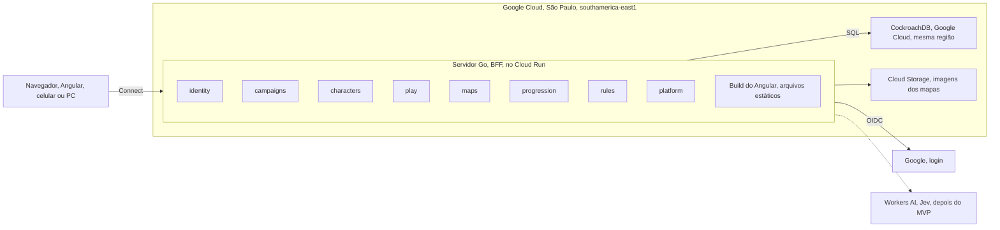

# Arquitetura

O novo backend é um monólito modular em Go no Cloud Run em São Paulo. O CockroachDB fica no Google Cloud, também em São Paulo, como o Samuel confirmou: servidor e banco no mesmo provedor e na mesma região. O Angular só desenha a tela; toda regra roda no servidor.

## Decisões

Decisões difíceis de desfazer viram ADR (Architecture Decision Record) no repositório privado `docs/adr/` (ignorado neste repositório, mantido por Samuel e Vinicius). O código e os documentos aqui citam só o número, como "ver ADR-0002".

| Peça | Escolha | Por quê |
| --- | --- | --- |
| Backend | Go, monólito modular: um deploy só, módulos com fronteiras claras (ADR-0001) | Um time pequeno não precisa de microserviços. As fronteiras deixam separar um módulo depois, se um dia precisar. |
| BFF | O próprio servidor Go (ADR-0001) | A tela pede "a ficha pronta" numa chamada. Nenhuma regra de D&D fica no navegador, então ninguém trapaceia editando o JavaScript. |
| API | Protobuf + Connect (connect-go e connect-es), com buf (ADR-0001) | Um contrato gera o código dos dois lados. Funciona em HTTP/1.1 com JSON, então dá para testar com `curl`. |
| Tempo real | Stream do Connect (server streaming), aberto só durante a sessão (ADR-0005, a escrever) | Sem sessão ativa, nada fica conectado. Um WebSocket esquecido aberto o mês todo custaria caro (ver [Operação](operacao.md)). |
| Hospedagem | Cloud Run em `southamerica-east1`, 1 vCPU e 512 MiB, `min-instances` 0, `max-instances` baixo (ADR-0003) | Escala a zero quando ninguém usa. No uso previsto, fica abaixo de US$ 1 por mês (ver [Operação](operacao.md)). |
| Banco | CockroachDB no Google Cloud (São Paulo), com pgx, sqlc e goose (ADR-0003) | sqlc gera Go tipado a partir do SQL. O CockroachDB roda em `SERIALIZABLE`, então toda escrita repete a transação no erro `40001`. |
| Login | Google OIDC com PKCE; sessão com token opaco num cookie `__Host-` httpOnly (ADR-0002) | O JavaScript da página não lê o cookie, e dá para revogar a sessão na hora (logout, tirar alguém da campanha). |
| Frontend | Um novo app Angular em `web/`, sobre o cliente Connect, com as regras no servidor. O servidor Go entrega o build, na mesma origem da API (ADR-0006, ainda proposta) | O cookie de sessão só funciona bem sem cookies de terceiros, e o Safari do iPhone bloqueia esses cookies. No app antigo (descontinuado), o Angular ficava no GitHub Pages e a API no Render, em sites diferentes; componentes úteis de lá (stepper da ficha, mapa, editor) são portados para o `web/` conforme a necessidade. |
| Jev (depois do MVP) | Cloudflare Workers AI, atrás de uma interface em Go | Trocar de provedor sem mexer no resto do código. |

## Módulos

Cada módulo do backend fica em `backend/internal/<módulo>`. Um módulo só chama outro pela interface pública dele, nunca pelas tabelas.

- `identity`: login do mestre, sessões de login e usuários. O login do mestre é um *relying party* OIDC genérico: Google em produção, um provedor OIDC local nos testes ponta a ponta — o módulo fala o protocolo, não um SDK do Google. _Em discussão: um jeito de logar sem conta Google para o jogador está sendo avaliado, ver [Perguntas em aberto](produto/perguntas-em-aberto.md#login-do-jogador-sem-google)._
- `campaigns`: campanhas, membros, papéis e convites.
- `characters`: personagens, fichas, trava e cópias.
- `play`: sessão de jogo, cenas, encontros, combatentes e o stream ao vivo.
- `maps`: mapas, pontos de interesse e, depois, masmorras.
- `progression`: modo de XP, XP dado e aviso de subir de nível.
- `rules`: as contas do D&D 5e (modificadores, CD, bônus). Não acessa o banco, então é fácil de testar.
- `platform`: o que é de todos: configuração, banco, servidor HTTP e logs.

Cada módulo é construído do zero, direto no Go: não há troca de lado nem coexistência com o NestJS antigo, que fica descontinuado. O critério de pronto é o mesmo de qualquer história: os testes do módulo passam (ver [Visão do produto](produto/visao.md)).

### Diagrama: arquitetura alvo



A linha tracejada é futura: o Jev (Workers AI) só entra depois do MVP. O app antigo (Angular em `src/`, NestJS em `server/`, GitHub Pages e Render) não faz parte deste diagrama porque está descontinuado; ele fica no repositório só como referência até sair num PR à parte.

Os fluxos de quem pode mexer na ficha e de como o jogador entra na sessão ficam em [Regras de negócio → Fluxos e estados](produto/regras.md#fluxos-e-estados), porque são regra de negócio, não peça de infraestrutura.

## Contratos de API (Protobuf)

Toda chamada da API nasce num arquivo `.proto`. O `buf generate` gera o código Go e o TypeScript, e o CI recusa um PR que quebra o contrato. Foi um desencontro de contrato entre o Angular e o NestJS que causou o erro 400 ao salvar fichas.

Regras:

1. Um pacote por módulo e versão: `meurpg.<módulo>.v1`, em `proto/meurpg/<módulo>/v1/`.
2. Um serviço por módulo. Cada chamada tem o seu par `XxxRequest` e `XxxResponse`, mesmo vazio, como o `buf lint` pede.
3. O número de um campo nunca muda nem é reaproveitado. Campo removido vira `reserved`.
4. Mudança que quebra o contrato vira um pacote `v2`. O `buf breaking` compara cada PR com a `main`.
5. O código gerado fica no repositório. O CI roda `buf generate` de novo e falha se aparecer diferença.
6. Campos em `snake_case` no `.proto`; o TypeScript gerado usa `camelCase` sozinho.
7. Chamada só de leitura leva `idempotency_level = NO_SIDE_EFFECTS`, e o Connect passa a aceitar GET, que o navegador pode guardar em cache.

O primeiro contrato, da Etapa 1, só prova que o caminho todo funciona:

```protobuf
syntax = "proto3";

package meurpg.system.v1;

// SystemService exposes build and runtime information.
service SystemService {
  rpc GetServerInfo(GetServerInfoRequest) returns (GetServerInfoResponse) {
    option idempotency_level = NO_SIDE_EFFECTS;
  }
}

message GetServerInfoRequest {}

message GetServerInfoResponse {
  string version = 1;
  string commit = 2;
}
```

Como o Connect aceita JSON, dá para chamar com `curl`:

```bash
curl -s -X POST http://localhost:8080/meurpg.system.v1.SystemService/GetServerInfo \
  -H 'Content-Type: application/json' -d '{}'
```

### Códigos de erro

Cada regra de negócio recusada devolve um código de erro do Connect, sempre o mesmo para o mesmo caso.

| Código | Quando |
| --- | --- |
| `unauthenticated` | Sem sessão de login válida. |
| `permission_denied` | O usuário não é membro da campanha, ou um jogador tenta uma ação de mestre. |
| `failed_precondition` | A regra não deixa agora: ficha travada (RN-01), sessão que não começou. |
| `not_found` | Não existe, ou o usuário não pode saber que existe (um ponto escondido, por exemplo). |
| `invalid_argument` | Entrada inválida, como um atributo acima de 30. |
| `aborted` | Conflito de transação (`40001`) que continuou depois das novas tentativas. |

## Ver também

- [Modelo de dados](dados.md)
- [Regras de negócio](produto/regras.md)
- [Roadmap](roadmap.md)
- [Operação](operacao.md)
- `docs/adr/` (repositório privado, não versionado aqui): as decisões completas por trás desta página.
