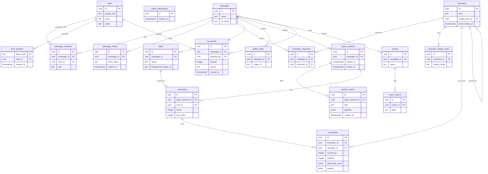
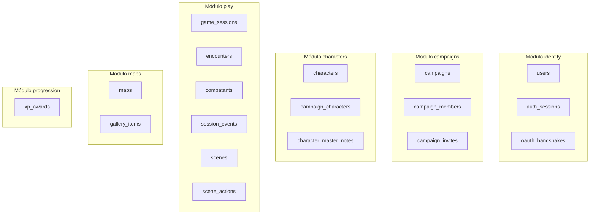

# Modelo de dados

A campanha vira o centro do banco: hoje ela não existe, e tudo pertence direto ao usuário. A tabela abaixo compara o schema atual (`server/src/db/schema.sql`) com a proposta. Cada mudança vira uma migration do goose, revisada no PR como qualquer código.

## Hoje vs. proposta

| Hoje | Proposta | Por quê |
| --- | --- | --- |
| `users.role` é global (padrão `master`) | O papel vai para `campaign_members.role` | Um usuário pode ser mestre numa campanha e jogador em outra (RN-05). |
| `characters.type` aceita `npc`, `player`, `boss`, `minion` | `characters.kind` aceita `player`, `enemy`, `boss`, `minion`, `story` | `npc` vira dois tipos: inimigo (ficha completa) e história (ficha básica). |
| O personagem liga ao mestre por `master_user_id` | `campaign_characters` liga personagens a campanhas | Um índice único parcial deixa o personagem de jogador em uma campanha só (RN-03), e o NPC em várias (RN-04). |
| Sem cópia de personagem | `characters.copied_from_id` e `characters.sheet_locked_at` | A cópia lembra de onde veio (RN-03), e a trava tem data (RN-01). |
| `master_notes` na mesma linha do personagem | Tabela própria, `character_master_notes` | A consulta que monta a ficha do jogador nem toca nessa tabela, então não tem como vazar (RN-11). |
| `character_join_tokens.token` em texto puro, por personagem | `campaign_invites.token_hash`, por campanha, com expiração | Quem lê o banco não consegue usar o convite (RN-07). |
| `maps.user_id` | `maps.campaign_id` | O mapa pertence à campanha. |
| `maps.background_image` guarda a imagem em base64 | Imagem no Cloud Storage; a tabela guarda só a URL | Cada leitura do mapa mandaria a imagem inteira. Sair de São Paulo custa US$ 0,19 por GiB, e a URL deixa o navegador usar cache. |
| Galeria só no navegador de quem usa | `gallery_items`, ligada à campanha | Fica disponível em qualquer aparelho. |

Tabelas novas para a mesa ao vivo:

- `game_sessions`: começo e fim de cada sessão. Iniciar a primeira preenche `sheet_locked_at` das fichas dos jogadores, na mesma transação.
- `encounters` e `combatants`: rodada, turno, iniciativa, PV atual, espaços de magia usados e posição na grade de cada combate.
- `session_events`: cada ação da sessão (dano, cura, magia, XP) vira uma linha que nunca é alterada. É o histórico da mesa e o que o stream manda para os celulares.
- `xp_awards`: quem deu XP, quanto, quando e por quê (MR-016). O modo de XP fica em `campaigns.xp_mode`.
- `scenes` e `scene_actions`: a cena de RP e a lista de ações dela (MR-015).

Os pontos de interesse continuam em `jsonb` dentro do mapa por enquanto, cada um com um campo `revealed`. O servidor filtra os escondidos antes de responder (RN-10). A notificação no app não precisa de tabela no MVP: uma `game_session` sem `ended_at` já é o aviso de "sessão em andamento".

## Tabelas: novo vs. existente

| Tabela | Situação |
| --- | --- |
| `users` | Existente, muda: perde `role` (vai para `campaign_members`) |
| `auth_sessions` | Existente, sem mudança |
| `oauth_handshakes` | Existente, sem mudança |
| `characters` | Existente, muda: `type` vira `kind`, ganha `copied_from_id` e `sheet_locked_at` |
| `maps` | Existente, muda: `user_id` vira `campaign_id`, imagem vira URL do Cloud Storage |
| `character_join_tokens` | Existente hoje, substituída por `campaign_invites` |
| `campaigns` | Nova |
| `campaign_members` | Nova |
| `campaign_invites` | Nova |
| `campaign_characters` | Nova |
| `character_master_notes` | Nova |
| `gallery_items` | Nova |
| `game_sessions` | Nova |
| `encounters` | Nova |
| `combatants` | Nova |
| `session_events` | Nova |
| `scenes` | Nova |
| `scene_actions` | Nova |
| `xp_awards` | Nova |

## Diagrama: modelo proposto

As colunas abaixo são as citadas no guia mais as chaves primárias e estrangeiras necessárias para o diagrama fechar. O nome exato de cada coluna nova é fechado na migration do goose que a introduz, revisada no PR como qualquer código.

## Diagrama: tabelas por módulo

## Ver também

- [Glossário](produto/glossario.md)
- [Regras de negócio](produto/regras.md)
- [Arquitetura](arquitetura.md): os módulos donos de cada tabela.
- `server/src/db/schema.sql`: o schema real de hoje.
