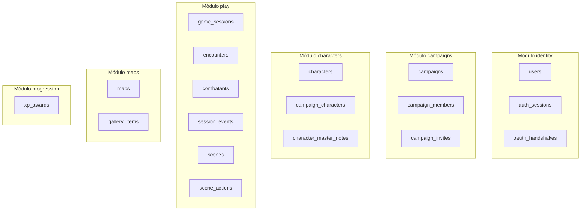
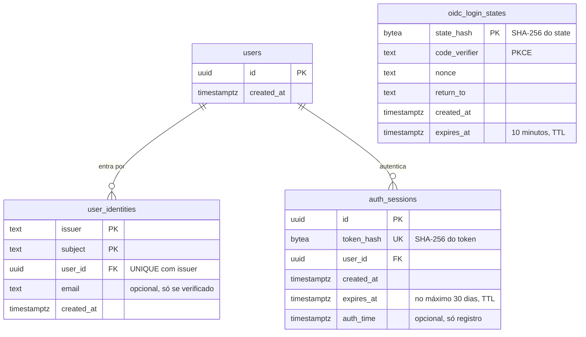

# Modelo de dados

A campanha é o centro do banco novo. O schema começa do zero: a migration `00001_init` está vazia, e cada módulo cria as próprias tabelas conforme é construído (decidido em 29/09/2026). Não há migração de dados do app antigo — o diagrama deste documento é o alvo proposto, montado módulo por módulo, não um destino que os dados de hoje precisam alcançar.

## O que muda em relação ao app antigo (referência)

No app antigo (`server/src/db/schema.sql`, descontinuado), a campanha não existia, e tudo pertencia direto ao usuário. A tabela abaixo serve só para quem conhece o schema antigo entender as escolhas novas — nenhuma linha dele é migrada.

| App antigo | Novo (proposta) | Por quê |
| --- | --- | --- |
| `users.role` é global (padrão `master`) | O papel vai para `campaign_members.role` | Um usuário pode ser mestre numa campanha e jogador em outra (RN-05). |
| `characters.type` aceita `npc`, `player`, `boss`, `minion` | `characters.kind` aceita `player`, `enemy`, `boss`, `minion`, `story` | `npc` vira dois tipos: inimigo (ficha completa) e história (ficha básica). |
| O personagem liga ao mestre por `master_user_id` | `campaign_characters` liga personagens a campanhas | Um índice único parcial deixa o personagem de jogador em uma campanha só (RN-03), e o NPC em várias (RN-04). |
| Sem cópia de personagem | `characters.copied_from_id` e `characters.sheet_locked_at` | A cópia lembra de onde veio (RN-03), e a trava tem data (RN-01). |
| `master_notes` na mesma linha do personagem | Tabela própria, `character_master_notes` | A consulta que monta a ficha do jogador nem toca nessa tabela, então não tem como vazar (RN-11). |
| `character_join_tokens.token` em texto puro, por personagem | `campaign_invites.token_hash`, por campanha, com expiração | Quem lê o banco não consegue usar o convite (RN-07). |
| `maps.user_id` | `maps.campaign_id` | O mapa pertence à campanha. |
| `maps.background_image` guarda a imagem em base64 | Imagem no Cloud Storage; a tabela guarda só a URL | Cada leitura do mapa mandaria a imagem inteira. Sair de São Paulo custa US$ 0,19 por GiB, e a URL deixa o navegador usar cache. |
| Galeria só no navegador de quem usa | `gallery_items`, ligada à campanha | Fica disponível em qualquer aparelho. |

Tabelas novas para a mesa ao vivo:

- `game_sessions`: começo e fim de cada sessão. Iniciar a primeira preenche `sheet_locked_at` das fichas dos jogadores, na mesma transação.
- `encounters` e `combatants`: rodada, turno, iniciativa, PV atual, espaços de magia usados e posição na grade de cada combate.
- `session_events`: cada ação da sessão (dano, cura, magia, XP) vira uma linha que nunca é alterada. É o histórico da mesa e o que o stream manda para os celulares.
- `xp_awards`: quem deu XP, quanto, quando e por quê (MR-016). O modo de XP fica em `campaigns.xp_mode`.
- `scenes` e `scene_actions`: a cena de RP e a lista de ações dela (MR-015).

Os pontos de interesse continuam em `jsonb` dentro do mapa por enquanto, cada um com um campo `revealed`. O servidor filtra os escondidos antes de responder (RN-10). A notificação no app não precisa de tabela no MVP: uma `game_session` sem `ended_at` já é o aviso de "sessão em andamento".

## Tabelas do schema novo, e a equivalente no app antigo

Toda tabela abaixo é nova — nasce numa migration do goose de algum módulo, nenhuma vem de `ALTER` sobre uma tabela existente. A coluna da direita só ajuda quem conhece o app antigo a encontrar a tabela equivalente de lá.

| Tabela | Equivalente no app antigo |
| --- | --- |
| `users` | Parecida com `users` de lá, mas perde `role` (vai para `campaign_members`) |
| `auth_sessions` | Mesma ideia de `auth_sessions` de lá (hash do token) |
| `oauth_handshakes` | Mesma ideia de `oauth_handshakes` de lá |
| `characters` | Parecida com `characters` de lá: `type` vira `kind`, ganha `copied_from_id` e `sheet_locked_at` |
| `maps` | Parecida com `maps` de lá: `user_id` vira `campaign_id`, imagem vira URL do Cloud Storage |
| `campaign_invites` | Substitui a ideia de `character_join_tokens` de lá, por campanha e com token só em hash |
| `campaigns` | Sem equivalente lá |
| `campaign_members` | Sem equivalente lá |
| `campaign_characters` | Sem equivalente lá |
| `character_master_notes` | Sem equivalente lá |
| `gallery_items` | Sem equivalente lá |
| `game_sessions` | Sem equivalente lá |
| `encounters` | Sem equivalente lá |
| `combatants` | Sem equivalente lá |
| `session_events` | Sem equivalente lá |
| `scenes` | Sem equivalente lá |
| `scene_actions` | Sem equivalente lá |
| `xp_awards` | Sem equivalente lá |

## Diagrama: modelo proposto

As colunas abaixo são as citadas no guia mais as chaves primárias e estrangeiras necessárias para o diagrama fechar. O nome exato de cada coluna nova é fechado na migration do goose que a introduz, revisada no PR como qualquer código.

## Diagrama: tabelas por módulo

## Esquema implementado

Esta seção lista só o que já existe nas migrations de `backend/migrations/`. O resto desta página ainda é proposta. O esquema novo começa vazio (`00001_init`), e cada módulo cria as próprias tabelas.

| Migration | Tabela | Para quê |
| --- | --- | --- |
| `00002_create_users` | `users` | A conta. Não guarda dado pessoal: só `id` e `created_at`. |
| `00003_create_user_identities` | `user_identities` | Liga a conta a um login OIDC. |
| `00004_create_auth_sessions` | `auth_sessions` | As sessões de login (o hash do token). |
| `00005_create_oidc_login_states` | `oidc_login_states` | Logins começados e ainda não terminados. |

Todas são do módulo `identity`. Mudanças em relação à proposta acima:

- `users.google_sub` e `users.email` viraram `user_identities (issuer, subject, email)`. O par `(issuer, subject)` é a chave primária, porque o `sub` só é único dentro de um provedor. Assim o código não depende do Google, e uma conta pode ter outro jeito de entrar (ADR-0009) sem mudar `users`.
- `UNIQUE (user_id, issuer)`: uma conta tem no máximo uma identidade por provedor, então duas contas Google nunca se juntam.
- `email` é opcional: só é gravado quando o provedor diz que foi verificado, e é atualizado (ou apagado) a cada login. Nome e foto nunca são gravados.
- `oauth_handshakes` virou `oidc_login_states`, com o hash do `state` como chave.
- `auth_sessions` ganhou `id` (para listar e revogar uma sessão, ADR-0009) e `auth_time` (só registro). Um `CHECK` no banco impede sessão com mais de 30 dias.
- Toda FK para `users` tem `ON DELETE CASCADE`: excluir a conta apaga identidades e sessões.
- `auth_sessions` e `oidc_login_states` usam o TTL por linha do CockroachDB (`ttl_expiration_expression = 'expires_at'`). O job apaga as linhas vencidas uma vez por dia nas sessões e de hora em hora nos logins. As consultas continuam filtrando `expires_at`, porque a linha vencida existe até o job passar.

Cada migration é um único `CREATE TABLE IF NOT EXISTS`, com índices e constraints dentro dele. Como o CockroachDB faz commit antes de cada DDL, isso deixa cada migration atômica e segura para rodar de novo.

`oidc_login_states` não liga a nenhuma conta: o login ainda não terminou, então ninguém sabe quem é.

## Ver também

- [Glossário](produto/glossario.md)
- [Regras de negócio](produto/regras.md)
- [Arquitetura](arquitetura.md): os módulos donos de cada tabela.
- `server/src/db/schema.sql`: o schema do app antigo (descontinuado), só como referência histórica.
