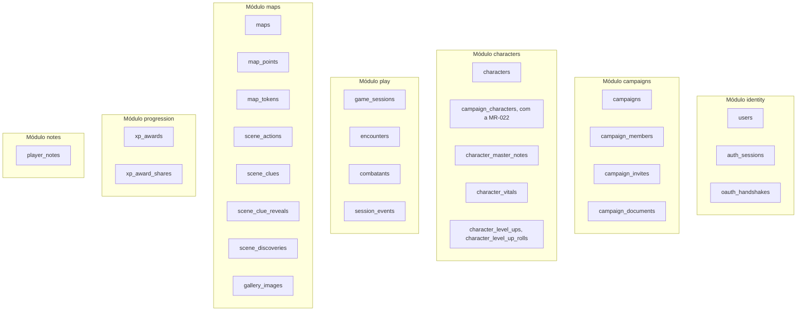

# Modelo de dados

A campanha é o centro do banco novo. O schema começa do zero: a migration `00001_init` está vazia, e cada módulo cria as próprias tabelas conforme é construído (decidido em 29/09/2026). Não há migração gradual de dados do app antigo — o diagrama deste documento é o alvo proposto, montado módulo por módulo, não um destino que os dados de hoje precisam alcançar.

**Exceção: os personagens.** Decidido pelo Samuel em 29/09/2026: o banco do app antigo pode ser apagado depois de uma importação única e pontual, só dos personagens (por exemplo, o Pensantus), para o banco novo. Não é uma migração do schema inteiro, nem uma ferramenta que fica no repositório: é uma tarefa de uma vez só, registrada no [roadmap](roadmap.md) (Etapa 11), que lê o `characters` de lá e cria as linhas equivalentes em `characters` daqui, revisada à mão. O resto do banco antigo (campanhas, mapas, sessões do app antigo, se existirem) não é importado. Ver também [Privacidade](privacidade.md#o-banco-do-app-antigo).

## O que muda em relação ao app antigo (referência)

No app antigo (`server/src/db/schema.sql`), a campanha não existia, e tudo pertencia direto ao usuário. A tabela abaixo serve só para quem conhece o schema antigo entender as escolhas novas — nenhuma linha dele é migrada, com a única exceção dos personagens, acima. O `server/` (NestJS) será removido do repositório (decidido pelo Samuel em 29/09/2026, ver [App antigo](app-antigo.md)); esta tabela já registra por escrito o que mudou, então a remoção do arquivo não perde o contexto.

| App antigo | Novo (proposta) | Por quê |
| --- | --- | --- |
| `users.role` é global (padrão `master`) | O papel vai para `campaign_members.role` | Um usuário pode ser mestre numa campanha e jogador em outra (RN-05). |
| `characters.type` aceita `npc`, `player`, `boss`, `minion` | `characters.kind` aceita `player`, `enemy`, `boss`, `minion`, `story` | `npc` vira dois tipos: inimigo (ficha completa) e história (ficha básica). |
| O personagem liga ao mestre por `master_user_id` | `characters.campaign_id` diz a campanha do personagem; o dono é `player_user_id` (personagem de jogador) ou `master_user_id` (NPC) | Um índice único parcial garante um personagem vivo por jogador por campanha (RN-03). A tabela `campaign_characters`, para usar o NPC em várias campanhas (RN-04), vem com a MR-022 (ver [Esquema implementado](#esquema-implementado)). |
| Sem cópia de personagem | `characters.sheet_locked_at` (feito) e `characters.copied_from_id` (com a MR-021) | A trava tem data (RN-01), e a cópia vai lembrar de onde veio (RN-03). |
| `master_notes` na mesma linha do personagem | Tabela própria, `character_master_notes` | A consulta que monta a ficha do jogador nem toca nessa tabela, então não tem como vazar (RN-11). |
| `character_join_tokens.token` em texto puro, por personagem | `campaign_invites.token_hash`, por campanha, com expiração | Quem lê o banco não consegue usar o convite (RN-07). |
| `maps.user_id` | `maps.campaign_id` | O mapa pertence à campanha. |
| `maps.background_image` guarda a imagem em base64 | Imagem no Cloud Storage; o mapa aponta para uma imagem da galeria | Cada leitura do mapa mandaria a imagem inteira. Sair de São Paulo custa US$ 0,19 por GiB, e a URL deixa o navegador usar cache. |
| Galeria só no navegador de quem usa | `gallery_images`, ligada à campanha (feito na Etapa 5) | Fica disponível em qualquer aparelho. |

Tabelas novas para a mesa ao vivo:

- `game_sessions`: começo e fim de cada sessão. Iniciar uma sessão preenche `sheet_locked_at` das fichas dos jogadores que ainda são rascunho, na mesma transação. Já existe (Etapa 4, ver [Esquema implementado](#esquema-implementado)).
- `character_vitals`: PV atual, PV temporários, espaços de magia usados, dados de vida usados e usos gastos dos recursos de cada personagem de jogador, que duram de uma sessão para outra (RN-02). Já existe (Etapa 5, ver [Esquema implementado](#esquema-implementado)).
- `encounters` e `combatants`: rodada, turno, iniciativa, PV atual, espaços de magia usados e posição na grade de cada combate.
- `session_events`: cada ação da sessão (dano, cura, magia, XP) vira uma linha que nunca é alterada. É o histórico da mesa; o stream manda a mudança que ela registra. Já existe (Etapa 5), com a correção do mestre nos PV, espaços de magia e dados de vida, e, na Etapa 6, as mudanças do combate: o ataque, o dano, as ações, as magias, as reações, os testes contra a morte, as condições, o desfazer. O registro do combate é lido dela (ver [Esquema implementado](#esquema-implementado)).
- `pending_damages`: o dano de um ataque ou de uma magia que acertou, e as curas, do d20 até o mestre aplicar ou descartar (MR-012, MR-014). Já existe (Etapa 6).
- `xp_awards` e `xp_award_shares`: quem deu XP ou registrou um marco, quanto, quando e por quê, e o que cada personagem recebeu (MR-016). O modo de XP fica em `campaigns.xp_mode`. Já existem (Etapa 7, ver [Esquema implementado](#esquema-implementado)).
- `character_level_ups` e `character_level_up_rolls`: o registro de cada subida de nível feita pelo jogador na ficha travada, que o mestre lê como "O que mudou", e o dado de vida que o servidor rolou para o próximo nível, guardado até a subida o usar (MR-040). Já existem (Etapa 8, ver [Esquema implementado](#esquema-implementado)).
- `stage_npcs`: os NPCs "em cena" na cena aberta de uma sessão, na ordem em que entraram, no máximo 4, com quem fala (MR-031). Já existe (Etapa 8, ver [Esquema implementado](#esquema-implementado)).
- `scene_actions`: as ações que o mestre pôs numa cena de RP (MR-015). A cena não tem tabela própria: é um ponto do mapa do tipo `scene` (`map_points`), e a cena aberta na sessão é a coluna `game_sessions.open_scene_point_id`. Já existem (Etapa 7, ver [Esquema implementado](#esquema-implementado)).
- `scene_clues` e `scene_clue_reveals`: as pistas que o mestre prepara numa cena e a quem ele as revelou, com a cópia do texto que o jogador recebeu (MR-029). Já existem (Etapa 8, ver [Esquema implementado](#esquema-implementado)). O texto "Ganchos e anotações" é a coluna `map_points.hooks`.
- `scene_discoveries`: as cenas que o grupo já descobriu, as únicas que o jogador pode usar de etiqueta numa anotação (MR-030). Já existe (Etapa 8).
- `player_notes`: as anotações particulares de cada jogador (MR-030): só quem escreveu as lê. Já existe (Etapa 8).

Os pontos de interesse ficam numa tabela própria, `map_points`, e os tokens em `map_tokens` (feito na Etapa 5), cada um com o próprio estado de revelado ou escondido. O servidor filtra os escondidos antes de responder (RN-10). A notificação no app não precisa de tabela no MVP: uma `game_session` sem `ended_at` já é o aviso de "sessão em andamento".

**Estado do personagem.** Decidido na Etapa 4: uma coluna `status` (`active`, `dead` ou `pending`) junto de `sheet_locked_at`. O morto (RN-03) muda de estado, nunca de linha. O pendente de aprovação (RN-15, MR-024) é o personagem de quem entrou por um convite com aprovação: vira `active` quando o mestre aprova, e é apagado quando o mestre recusa, porque nunca chegou a fazer parte da campanha. Os detalhes estão em [Esquema implementado](#esquema-implementado).

## Tabelas do schema novo, e a equivalente no app antigo

Toda tabela abaixo é nova — nasce numa migration do goose de algum módulo, nenhuma vem de `ALTER` sobre uma tabela existente. A coluna da direita só ajuda quem conhece o app antigo a encontrar a tabela equivalente de lá.

| Tabela | Equivalente no app antigo |
| --- | --- |
| `users` | Parecida com `users` de lá, mas perde `role` (vai para `campaign_members`) |
| `auth_sessions` | Mesma ideia de `auth_sessions` de lá (hash do token) |
| `oauth_handshakes` | Mesma ideia de `oauth_handshakes` de lá |
| `characters` | Parecida com `characters` de lá: `type` vira `kind`, ganha `campaign_id`, `status` e `sheet_locked_at` (e `copied_from_id` com a MR-021) |
| `maps` | Parecida com `maps` de lá: `user_id` vira `campaign_id`, a imagem vira uma imagem da galeria (`gallery_images`) |
| `map_points` | Os pontos de interesse, que lá ficavam dentro do mapa |
| `map_tokens` | Sem equivalente lá |
| `campaign_invites` | Substitui a ideia de `character_join_tokens` de lá, por campanha e com token só em hash |
| `campaigns` | Sem equivalente lá |
| `campaign_members` | Sem equivalente lá |
| `campaign_documents` | Sem equivalente lá: o guia da campanha do app antigo ficava no navegador, com as campanhas |
| `campaign_characters` | Sem equivalente lá. Vem com a MR-022 (NPC em várias campanhas) |
| `character_master_notes` | Sem equivalente lá |
| `character_vitals` | Sem equivalente lá |
| `gallery_images` | Sem equivalente lá (a galeria de lá ficava no navegador) |
| `game_sessions` | Sem equivalente lá |
| `encounters` | Sem equivalente lá |
| `combatants` | Sem equivalente lá |
| `session_events` | Sem equivalente lá |
| `pending_damages` | Sem equivalente lá |
| `scene_actions` | Sem equivalente lá |
| `stage_npcs` | Sem equivalente lá |
| `character_level_ups`, `character_level_up_rolls` | Sem equivalente lá |
| `scene_clues`, `scene_clue_reveals`, `scene_discoveries`, `player_notes` | Sem equivalente lá |
| `xp_awards`, `xp_award_shares` | Sem equivalente lá |

## Diagrama: modelo proposto

As colunas abaixo são as citadas no guia mais as chaves primárias e estrangeiras necessárias para o diagrama fechar. O nome exato de cada coluna nova é fechado na migration do goose que a introduz, revisada no PR como qualquer código.

```mermaid
erDiagram
    users {
        uuid id PK
        text google_sub
        text email
        text name
    }

    auth_sessions {
        text token_hash PK
        uuid user_id FK
        timestamptz expires_at
    }

    oauth_handshakes {
        text id PK
        timestamptz expires_at
    }

    campaigns {
        uuid id PK
        text name
        text xp_mode
    }

    campaign_members {
        uuid id PK
        uuid campaign_id FK
        uuid user_id FK
        text role
        text status "active ou pending"
    }

    campaign_invites {
        uuid id PK
        uuid campaign_id FK
        text token_hash
        timestamptz expires_at
        bool requires_approval
    }

    campaign_documents {
        uuid campaign_id PK
        text body "Markdown"
        integer revision
    }

    characters {
        uuid id PK
        uuid campaign_id FK
        text kind
        text status
        uuid copied_from_id FK "com a MR-021"
        timestamptz sheet_locked_at
    }

    campaign_characters {
        uuid campaign_id FK "com a MR-022"
        uuid character_id FK
    }

    character_master_notes {
        uuid campaign_id PK
        uuid character_id PK
        text notes
    }

    character_vitals {
        uuid character_id PK
        integer hit_points_current
        integer hit_points_temporary
        integer_array spell_slots_used
        integer hit_dice_used
    }

    character_level_ups {
        uuid id PK
        uuid campaign_id FK
        uuid character_id FK
        text class_key
        integer from_level
        integer to_level
        text hp_method
        integer hp_value
        jsonb choices
        timestamptz created_at
    }

    character_level_up_rolls {
        uuid character_id PK
        integer to_level PK
        text class_key
        integer die
        integer value
    }

    maps {
        uuid id PK
        uuid campaign_id FK
        text name
        uuid image_id FK
    }

    gallery_images {
        uuid id PK
        uuid campaign_id FK
        text name
    }

    game_sessions {
        uuid id PK
        uuid campaign_id FK
        timestamptz started_at
        timestamptz ended_at
    }

    encounters {
        uuid id PK
        uuid game_session_id FK
        uuid map_id FK
        integer round
        integer turn_index
    }

    combatants {
        uuid id PK
        uuid encounter_id FK
        uuid character_id FK
        integer current_hp
        integer initiative
        jsonb spell_slots_used
        jsonb position
    }

    session_events {
        uuid id PK
        uuid game_session_id FK
        integer seq
        text kind
        uuid actor_user_id FK
        jsonb payload
        uuid idempotency_key
        timestamptz created_at
    }

    scene_actions {
        uuid id PK
        uuid point_id FK
        text key
        text name
    }

    stage_npcs {
        uuid id PK
        uuid game_session_id FK
        uuid character_id FK
        bool speaking
    }

    xp_awards {
        uuid id PK
        uuid campaign_id FK
        uuid given_by FK
        text mode
        text reason
        integer total_xp
        timestamptz created_at
    }

    xp_award_shares {
        uuid award_id PK
        uuid character_id PK
        integer xp
    }

    users ||--o{ campaign_members : "participa como"
    users ||--o{ auth_sessions : "autentica"
    users ||--o{ xp_awards : "concede"

    campaigns ||--o{ campaign_members : "tem"
    campaigns ||--o{ campaign_invites : "gera"
    campaigns ||--o| campaign_documents : "tem"
    campaigns |o--o{ characters : "reune"
    campaigns ||--o{ campaign_characters : "reusa NPCs"
    campaigns ||--o{ maps : "possui"
    campaigns ||--o{ gallery_images : "guarda"
    gallery_images ||--o{ maps : "é a imagem de"
    campaigns ||--o{ game_sessions : "realiza"
    campaigns ||--o{ xp_awards : "registra"
    xp_awards ||--o{ xp_award_shares : "divide em"
    characters ||--o{ xp_award_shares : "recebe"

    characters ||--o{ campaign_characters : "entra em"
    characters ||--o| character_master_notes : "tem"
    characters ||--o| character_vitals : "tem"
    characters ||--o{ character_level_ups : "subiu de nível"
    characters ||--o{ character_level_up_rolls : "tem o dado guardado"
    campaigns ||--o{ character_level_ups : "registra"
    characters ||--o{ combatants : "atua como"
    characters |o--o| characters : "copiado de"

    game_sessions ||--o{ session_events : "gera"
    game_sessions ||--o{ encounters : "tem"
    maps ||--o{ encounters : "é palco de"

    encounters ||--o{ combatants : "inclui"

    map_points ||--o{ scene_actions : "lista"
    game_sessions ||--o{ stage_npcs : "põe em cena"
    characters ||--o{ stage_npcs : "está em cena"
```

## Diagrama: tabelas por módulo

## Esquema implementado

Esta seção lista só o que já existe nas migrations de `backend/migrations/`. O resto desta página ainda é proposta. O esquema novo começa vazio (`00001_init`), e cada módulo cria as próprias tabelas.

| Migration | Tabela | Para quê |
| --- | --- | --- |
| `00002_create_users` | `users` | A conta: `id` e `created_at`. O único dado pessoal é o nome de exibição (`00007`), que a própria pessoa digita. |
| `00003_create_user_identities` | `user_identities` | Liga a conta a um login OIDC. |
| `00004_create_auth_sessions` | `auth_sessions` | As sessões de login (o hash do token). |
| `00005_create_oidc_login_states` | `oidc_login_states` | Logins começados e ainda não terminados. |
| `00006_create_auth_sessions_user_id_index` | `auth_sessions` | Índice por `user_id` (sair de todos os aparelhos, excluir a conta). |
| `00007_add_users_display_name` | `users` | Coluna `display_name`, o nome que os outros membros veem. |
| `00008_create_campaigns` | `campaigns` | A campanha (MR-001). |
| `00009_create_campaign_members` | `campaign_members` | Quem é membro de cada campanha, e com qual papel (RN-05). |
| `00010_create_campaign_members_user_id_index` | `campaign_members` | Índice por `user_id` ("minhas campanhas"). |
| `00011_create_campaign_invites` | `campaign_invites` | Os convites (MR-002, RN-07), só com o hash do token. |
| `00012_create_campaign_invites_campaign_id_index` | `campaign_invites` | Índice por `campaign_id` (os convites de uma campanha). |
| `00013_add_oidc_login_states_intent` | `oidc_login_states` | Colunas `intent_kind` e `intent_data`: a intenção de login, como aceitar um convite. |
| `00014_create_characters` | `characters` | Os personagens: os dos jogadores e os NPCs do mestre (MR-003, MR-005), com a ficha e a história como documentos JSON. |
| `00015_create_characters_campaign_id_index` | `characters` | Índice por `(campaign_id, player_user_id)`: a lista do mestre, a do jogador e a trava das fichas. |
| `00016_create_characters_one_living_player_character_index` | `characters` | Índice único parcial: um personagem vivo por jogador por campanha (RN-03). |
| `00017_create_character_master_notes` | `character_master_notes` | As notas do mestre, numa tabela à parte (RN-11). |
| `00018_create_game_sessions` | `game_sessions` | Começo e fim de cada sessão de jogo. Iniciar uma sessão trava as fichas (RN-01). |
| `00019_create_game_sessions_one_open_index` | `game_sessions` | Índice único parcial: no máximo uma sessão aberta por campanha. |
| `00020_expire_orphaned_player_characters` | `characters` | TTL por linha: o banco apaga sozinho o personagem de jogador que ficou sem jogador e sem campanha. |
| `00021_add_campaign_invites_requires_approval` | `campaign_invites` | Coluna `requires_approval`: o convite exige a aprovação do mestre (RN-15, MR-024). |
| `00022_add_campaign_members_status` | `campaign_members` | Coluna `status` (`active` ou `pending`): o membro pendente, que espera a aprovação do personagem (RN-15, MR-024). |
| `00023_create_character_vitals` | `character_vitals` | PV atual, PV temporários, espaços de magia e de pacto usados e dados de vida usados de cada personagem de jogador (RN-02). |
| `00024_create_session_events` | `session_events` | O histórico da sessão, uma linha por mudança, que nunca é alterada (ADR-0007). |
| `00025_create_gallery_images` | `gallery_images` | As imagens da galeria de cada campanha (MR-019). Os arquivos ficam no blob store; a tabela guarda o nome, o tipo, o tamanho e quem enviou. |
| `00026_create_gallery_images_campaign_id_index` | `gallery_images` | Índice por `(campaign_id, created_at DESC)`, com `byte_size` dentro: a galeria da mais nova para a mais antiga, e o uso da cota. |
| `00027_create_campaign_documents` | `campaign_documents` | O documento da campanha (MR-018): um texto em Markdown por campanha, com revisão. |
| `00028_create_maps` | `maps` | Os mapas de cada campanha (MR-008): uma imagem da galeria (`ON DELETE RESTRICT`), o nome, se está revelado (RN-10) e a revisão. |
| `00029_create_map_points` | `map_points` | Os pontos de interesse (MR-008, MR-009): batalha, submapa ou cena de RP, com nome, descrição para os jogadores, posição, o mapa ao qual o submapa leva e se está revelado. |
| `00030_create_map_tokens` | `map_tokens` | Os tokens (MR-012): um por personagem por mapa, com a posição e se está escondido. |
| `00031_create_maps_indexes` | `maps`, `map_points` | Os quatro índices do módulo: mapas por campanha e por imagem, pontos por mapa e por submapa de destino. |
| `00032_add_game_sessions_current_map_id` | `game_sessions` | Coluna `current_map_id`: o mapa atual da sessão (`SET NULL` quando o mapa é apagado). |
| `00033_add_game_sessions_shown_image_id` | `game_sessions` | Coluna `shown_image_id`: a imagem que o mestre mostra aos jogadores (MR-028; `SET NULL` quando a imagem é apagada). |
| `00034_add_campaign_members_pending_expires_at` | `campaign_members` | Coluna `pending_expires_at`: até quando vive um membro pendente que ainda não criou o personagem (RN-15, pergunta 24). |
| `00035_expire_pending_members_without_character` | `campaign_members` | TTL por linha sobre `pending_expires_at`, e o preenchimento dos pendentes que já existiam. |
| `00036_add_campaigns_dice_mode` | `campaigns` | Coluna `dice_mode` (`players_choose`, `app` ou `physical`), com `CHECK`: como a campanha rola os dados (RN-18). |
| `00037_add_campaign_members_dice_preference` | `campaign_members` | Coluna `dice_preference` (`app` ou `physical`), com `CHECK`: como o membro prefere rolar (RN-18). |
| `00038_add_game_sessions_shown_image_keep` | `game_sessions` | Coluna `shown_image_keep` (`BOOL`, padrão falso): o interruptor "Deixar com os jogadores" da imagem mostrada (MR-028). |
| `00039_create_campaign_left_images` | `campaign_left_images` | As imagens que o mestre deixou com os jogadores (MR-028): campanha, imagem da galeria e quando; `CASCADE` na campanha e na imagem. |
| `00040_add_maps_grid_columns` | `maps` | Coluna `grid_columns` (anulável): a grade de batalha, quantos quadrados de 1,5 m cabem na largura da imagem (MR-013, RN-21). |
| `00041_add_maps_grid_columns_valid` | `maps` | `CHECK` da grade: `NULL` ou de 4 a 200 colunas. |
| `00042_allow_battle_points_to_lead` | `map_points` | O `CHECK` do destino agora aceita `battle` além de `submap`: o ponto de batalha pode apontar o mapa do combate. |
| `00043_create_encounters` | `encounters` | Os combates de cada sessão (MR-013): estado, rodada, de quem é a vez, mapa e a grade copiada do mapa. |
| `00044_create_combatants` | `combatants` | Quem luta em cada combate: jogadores e cópias de NPC, com iniciativa, posição na grade, movimento e economia do turno, PV do NPC e escondido (RN-10, RN-19, RN-20). |
| `00045_create_encounters_indexes` | `encounters`, `combatants` | Índice único parcial (um combate aberto por sessão), combates por sessão e combatentes na ordem dos turnos. |
| `00046_add_encounter_session_event_kinds` | `session_events` | O `CHECK` de `kind` ganha os dez tipos do combate. |
| `00047_add_session_events_encounter_id` | `session_events` | A coluna `encounter_id` (opcional, `CASCADE`): a que combate o evento pertence, para o registro e o desfazer. |
| `00048_create_pending_damages` | `pending_damages` | O dano de um ataque que acertou: os dados, as faces, o total e o estado, até o mestre aplicar ou descartar (MR-012, MR-014, RN-02). |
| `00049_create_session_events_encounter_index` | `session_events` | Os eventos de um combate em ordem (índice parcial, só onde há `encounter_id`). |
| `00050_create_pending_damages_index` | `pending_damages` | O dano pendente de um combate. |
| `00051_add_combat_action_session_event_kinds` | `session_events` | O `CHECK` de `kind` ganha os sete tipos das ações: `attack_rolled`, `damage_rolled`, `damage_applied`, `damage_discarded`, `action_taken`, `hit_points_adjusted` e `action_undone`. |
| `00052_add_combatants_attacks_made` | `combatants` | `attacks_made`: os ataques da Ação de Atacar nesta vez (Ataque Extra). |
| `00053_add_combatants_ac_bonus` | `combatants` | `ac_bonus`: os +5 do Escudo até o começo da próxima vez do personagem. |
| `00054_add_combatants_death_save_rolled` | `combatants` | `death_save_rolled`: o teste contra a morte desta vez já foi rolado (RN-03). |
| `00055_add_character_vitals_resources_used` | `character_vitals` | `resources_used` (JSONB): os usos gastos dos recursos da ficha (RN-02). |
| `00056_add_pending_damages_spell_columns` | `pending_damages` | `cast_id`, `healing`, `half`, `applied_amount`, `attack_total` e `roll_total`: o dano de uma magia, a cura, a metade, a quantia que o mestre aplicou e o golpe que espera a reação. |
| `00057_allow_pending_damages_awaiting_reaction` | `pending_damages` | O `CHECK` de `status` ganha `awaiting_reaction`. |
| `00058_add_spell_session_event_kinds` | `session_events` | O `CHECK` de `kind` ganha seis tipos: `spell_cast`, `reaction_used`, `reaction_declined`, `death_save_rolled`, `death_confirmed` e `conditions_set`. |
| `00059_add_combatants_xp_value` | `combatants` | `xp_value`: o XP que o NPC dá ao ser derrotado, copiado da ficha quando ele entra no combate (MR-016). |
| `00060_create_xp_awards` | `xp_awards` | Cada prêmio de XP ou marco que o mestre deu (MR-016, RN-09), com o modo, o motivo, o total e o desfazer (`undone_at`, nunca um `DELETE`). |
| `00061_create_xp_award_shares` | `xp_award_shares` | O que cada personagem recebeu de um prêmio e, num marco, o nível em que foi marcado. |
| `00062_create_xp_awards_indexes` | `xp_awards`, `xp_award_shares` | O histórico de uma campanha do mais novo ao mais antigo, a chave de idempotência (única por campanha), um prêmio por inimigos por combate (índice único parcial, só onde não foi desfeito) e os prêmios de um personagem. |
| `00063_add_xp_and_scene_session_event_kinds` | `session_events` | O `CHECK` de `kind` ganha os seis tipos da Etapa 7: `xp_awarded`, `xp_award_undone`, `milestone_marked`, `scene_opened`, `scene_closed` e `scene_check_rolled`. |
| `00064_create_scene_actions` | `scene_actions` | As ações de uma cena de RP (MR-015): o ponto do mapa, a posição, a chave do teste (`skill:investigation`, `ability:str`, `save:wis`), o nome opcional (até 60) e a CD opcional (1 a 30). |
| `00065_create_scene_actions_point_index` | `scene_actions` | Índice por `(point_id, position)`: as ações de um ponto em ordem. |
| `00066_add_game_sessions_open_scene_point_id` | `game_sessions` | Coluna `open_scene_point_id`: a cena que o mestre abriu na sessão (MR-015; `SET NULL` quando o ponto é apagado). |
| `00067_add_map_points_hooks` | `map_points` | Coluna `hooks`: os "Ganchos e anotações" do mestre numa cena (MR-029), Markdown de até 4.000 caracteres, vazio para nenhum. Só o mestre a recebe. |
| `00068_create_scene_clues` | `scene_clues` | As pistas que o mestre prepara numa cena (MR-029): o ponto, a posição e o texto (1 a 500 caracteres). No máximo 30 por ponto. |
| `00069_create_scene_clues_point_index` | `scene_clues` | Índice por `(point_id, position)`: as pistas de um ponto em ordem. |
| `00070_create_scene_clue_reveals` | `scene_clue_reveals` | A quem o mestre revelou cada pista (MR-029): a campanha, a pista, o ponto, o jogador, o personagem escolhido, **uma cópia do texto** e quando. |
| `00071_create_scene_clue_reveals_indexes` | `scene_clue_reveals` | Único por `(clue_id, user_id)` (revelar de novo não muda nada), as pistas de um jogador por campanha e as de um ponto. |
| `00072_create_scene_discoveries` | `scene_discoveries` | As cenas que o grupo descobriu (MR-030): um ponto revelado no mapa ou aberto numa sessão, uma linha por campanha e ponto. |
| `00073_create_player_notes` | `player_notes` | As anotações particulares dos jogadores (MR-030): a campanha, o autor, o texto (1 a 2.000), a etiqueta de cena opcional. |
| `00074_create_player_notes_index` | `player_notes` | Índice por `(campaign_id, author_user_id, updated_at)`: as anotações de um jogador, da mais nova à mais antiga. |
| `00075_add_etapa8_session_event_kinds` | `session_events` | O `CHECK` de `kind` ganha `clue_revealed` (MR-029) e `stage_changed` (MR-031). |
| `00076_create_stage_npcs` | `stage_npcs` | O palco de uma sessão (MR-031): os NPCs em cena, na ordem em que entraram, com quem fala. |
| `00077_create_stage_npcs_one_speaker_index` | `stage_npcs` | Índice único parcial: no máximo um NPC fala por sessão. |
| `00078_create_character_level_ups` | `character_level_ups` | O registro de cada subida de nível guiada (MR-040): a classe, o nível de antes e o de depois, como os PV foram decididos e o que o jogador escolheu (JSON). O mestre lê como "O que mudou". |
| `00079_create_character_level_ups_indexes` | `character_level_ups` | Índices por `(campaign_id, created_at)` e por `(character_id, created_at)`: o registro da campanha e o de um personagem, do mais novo ao mais antigo. |
| `00080_create_character_level_up_rolls` | `character_level_up_rolls` | O dado de vida que o servidor rolou para o próximo nível, guardado até a subida o usar (MR-040, RN-18). |

As migrations `00002` a `00007` e a `00013` são do módulo `identity`; as `00008` a `00012`, a `00021`, a `00022`, a `00027`, a `00034`, a `00035`, a `00036` e a `00037`, do módulo `campaigns`; as `00014` a `00017`, a `00020`, a `00023`, a `00055` e as `00078` a `00080`, do módulo `characters` (o `xp_value` e o nível de desafio de um NPC ficam no JSON da ficha, sem migration); as `00018`, a `00019`, a `00024`, a `00032`, a `00033`, as `00043` a `00054`, `00056` a `00059`, a `00063`, a `00066`, a `00075`, a `00076` e a `00077`, do módulo `play`; as `00025`, a `00026`, as `00028` a `00031`, as `00040` a `00042`, a `00064`, a `00065` e as `00067` a `00072`, do módulo `maps`; as `00073` e `00074`, do módulo `notes`; as `00060` a `00062`, do módulo `progression`. A `00027` é do documento de campanha, no `campaigns`, que chega num PR à parte. Mudanças em relação à proposta acima, no `identity`:

- `users.google_sub` e `users.email` viraram `user_identities (issuer, subject, email)`. O par `(issuer, subject)` é a chave primária, porque o `sub` só é único dentro de um provedor. Assim o código não depende do Google, e uma conta pode ter outro jeito de entrar (ADR-0009) sem mudar `users`.
- `UNIQUE (user_id, issuer)`: uma conta tem no máximo uma identidade por provedor, então duas contas Google nunca se juntam.
- `email` é opcional: só é gravado quando o provedor diz que foi verificado, e é atualizado (ou apagado) a cada login. Nome e foto nunca são gravados.
- `oauth_handshakes` virou `oidc_login_states`, com o hash do `state` como chave.
- `auth_sessions` ganhou `id` (para listar e revogar uma sessão, ADR-0009) e `auth_time` (só registro). Um `CHECK` no banco impede sessão com mais de 30 dias.
- Toda FK para `users` tem `ON DELETE CASCADE`: excluir a conta apaga identidades e sessões.
- `auth_sessions` e `oidc_login_states` usam o TTL por linha do CockroachDB (`ttl_expiration_expression = 'expires_at'`). O job apaga as linhas vencidas uma vez por dia nas sessões e de hora em hora nos logins. As consultas continuam filtrando `expires_at`, porque a linha vencida existe até o job passar.

- `users.display_name` é opcional (`NULL` até a pessoa escolher), tem de 1 a 40 caracteres (um `CHECK` no banco) e nunca vem do provedor de login.
- `oidc_login_states.intent_kind` e `intent_data` (`00013`) guardam a intenção de login: o que concluir logo depois do login, como aceitar um convite (ver [Arquitetura](arquitetura.md#aceitar-o-convite-pelo-login)). Os dois são `NULL` num login comum. Para o convite, `intent_data` é o SHA-256 do token, nunca o token. Um `CHECK` exige os dois juntos, o tipo com 1 a 32 caracteres e os dados com no máximo 256 bytes.

No `campaigns`:

- `campaign_members` não tem `id`: a chave primária é `(campaign_id, user_id)`, que já responde "esta pessoa é membro?" com uma leitura só. O índice por `user_id` responde "de quais campanhas ela é membro?".
- `role` é texto com `CHECK` (`master` ou `player`), não um `ENUM`: acrescentar um valor a um `CHECK` é uma migration simples. O mesmo vale para `campaigns.xp_mode` (`enemies`, `gold` ou `milestones`, RN-09).
- `campaigns.created_by` é quem criou a campanha, hoje sempre o mestre. Excluir essa conta apaga a campanha, e com ela os membros e os convites (ver [Privacidade](privacidade.md#excluir-a-conta)). Excluir a conta de um jogador não apaga o personagem dele: a participação sai, mas o personagem fica vinculado ao mestre (RN-16, ver [Privacidade](privacidade.md#excluir-a-conta)). **Consequência de RN-13 (mais de um mestre), ainda proposta:** com mais de um mestre numa campanha, ou depois de uma passagem de campanha, excluir a conta de quem a criou não pode mais apagar a campanha inteira — só quando sai o último mestre. Isso muda o `ON DELETE` de `campaigns.created_by` de um `CASCADE` simples para uma regra que primeiro confere se sobra outro mestre; fica para quando o módulo `campaigns` implementar RN-13 e a ADR-0011 (proposta) fechar o desenho exato.
- `campaign_invites` guarda `max_uses`, `use_count`, `expires_at` e `revoked_at`. Dois `CHECK` garantem que `use_count` nunca passa de `max_uses`, nem com dois jogadores aceitando ao mesmo tempo, e que nenhum convite vale mais de 30 dias. O token fica só como SHA-256 em `token_hash`, com `UNIQUE`.
- `campaign_invites` usa o TTL por linha com `expires_at + INTERVAL '30 days'`: o convite some 30 dias depois de expirar. (Depois do `ALTER TABLE` da `00021`, o CockroachDB passa a mostrar a mesma expressão como `expires_at + '30 days'::INTERVAL`; o TTL é o mesmo.)
- **Convite com aprovação (RN-15, MR-024).** `campaign_invites.requires_approval` (`00021`, padrão `false`) diz se quem aceita o convite entra direto ou fica pendente. `campaign_members.status` (`00022`, padrão `active`, então quem já era membro continua membro) é `active` ou `pending`, com `CHECK` (`campaign_members_status_valid`); outro `CHECK` (`campaign_members_only_players_pending`) garante que só um jogador fica pendente, nunca o mestre. O membro pendente não é membro para nada, fora a criação e a edição do próprio personagem (ver [Arquitetura](arquitetura.md#membro-pendente)). Quando o mestre aprova o personagem, a linha vira `active`; quando recusa, a linha é apagada, na mesma transação que muda ou apaga o personagem.
- **Pendente sem personagem some em 30 dias (RN-15, pergunta 24).** `campaign_members.pending_expires_at` (`00034`, anulável) vale `joined_at + 30 dias` enquanto a participação é pendente e a pessoa não criou o personagem, e é `NULL` em todo o resto: um `CHECK` (`campaign_members_expiry_only_pending`) impede prazo em membro ativo. Criar o personagem e virar membro ativo (aprovação do mestre, ou um convite comum) zeram a coluna, na mesma transação. A `00035` liga o TTL por linha com `ttl_expiration_expression = 'pending_expires_at'`, no mesmo desenho da `00020`: o job do CockroachDB roda uma vez por dia e apaga a linha vencida, então ela pode passar até 1 dia do prazo. A mesma migration preenche os pendentes sem personagem que já existiam (`joined_at + 30 dias`), e roda duas vezes sem efeito. A lista do mestre ("pendentes sem personagem") é exatamente `status = 'pending' AND pending_expires_at IS NOT NULL`.
- **Dados da campanha (RN-18).** `campaigns.dice_mode` (`00036`, padrão `players_choose`) diz quem decide como os jogadores rolam: `players_choose` (cada um escolhe), `app` (todos no app) ou `physical` (todos com os próprios dados, digitando a soma). `campaign_members.dice_preference` (`00037`, padrão `app`) é a escolha de cada membro, o mestre também; a participação é da campanha, então a preferência vale só nela. Cada coluna tem um `CHECK` (`campaigns_dice_mode_valid`, `campaign_members_dice_preference_valid`). A preferência só conta com `players_choose`; com os outros modos ela fica guardada, para voltar quando o mestre voltar a deixar escolher. Nenhuma das duas guarda rolagem: as rolagens do combate terão tabela própria.
- Os nomes (`campaigns.name` até 80 caracteres, `display_name` até 40) têm `CHECK` de tamanho; o servidor também tira espaços das pontas e recusa quebra de linha e caracteres de controle.
- **`campaign_documents`** (`00027`, MR-018) guarda o documento da campanha: no máximo uma linha por campanha, com `campaign_id` como chave primária. Campanha sem linha tem um documento vazio, na revisão 0; o primeiro salvamento grava a linha na revisão 1, e cada salvamento depois sobe a revisão em 1, só se ela ainda for a que o mestre leu (ver [Arquitetura](arquitetura.md#documento-da-campanha)). `body` é o Markdown como o mestre escreveu, com até 204.800 bytes (200 KiB; o `CHECK` `campaign_documents_body_size` usa `octet_length`, que conta bytes, a mesma unidade da API). `updated_by` é quem salvou por último: excluir essa conta mantém o documento, sem editor (`SET NULL`); apagar a campanha apaga o documento (`CASCADE`). Não há índice em `updated_by`: só a exclusão de conta procura por ele, como em `campaigns.created_by`. Os IDs dos links do texto (`mapa:`, `ficha:`, `imagem:`) não são chaves estrangeiras: o servidor não os lê, e um link para algo apagado só aparece como indisponível.

No `characters`:

- **A campanha fica na própria linha do personagem.** `characters.campaign_id` substitui, por enquanto, a tabela `campaign_characters` do modelo proposto. Com a tabela de ligação, garantir a RN-03 pediria copiar o `kind` para ela e uma chave estrangeira composta, e mesmo assim não daria para garantir "um personagem vivo por jogador". Com a coluna, a RN-03 vira um índice único parcial (`00016`), com `status <> 'dead'`, então um personagem pendente (MR-024) também conta como vivo. O NPC fica na campanha em que foi criado; usar o mesmo NPC em outras campanhas (MR-022) traz a tabela de ligação de volta, só para NPCs, sem refazer nada.
- **O dono fica em duas colunas**, cada uma com o `ON DELETE` certo: `player_user_id` (só personagem de jogador) com `SET NULL`, e `master_user_id` (só NPC) com `CASCADE`. Assim, quando o jogador exclui a conta, o personagem fica com o mestre da campanha (RN-16); quando o mestre exclui a conta, os NPCs dele vão junto. `campaign_id` usa `SET NULL`: quando a campanha é apagada, o personagem de jogador fica com o jogador. Um `CHECK` (`characters_owner`) garante que o personagem de jogador não tem mestre dono, e que o NPC tem mestre e não tem jogador.
- **Estado**: `status` e `sheet_locked_at`. A API calcula o `CharacterState` a partir das duas (ver [Ciclo de vida da ficha](produto/regras.md#ciclo-de-vida-da-ficha)). O morto ganha `died_at` (`CHECK characters_dead_since`). Outros `CHECK` garantem que só o personagem de jogador morre, fica pendente, trava ou recebe a liberação da história. O personagem criado por um membro pendente nasce com `status = 'pending'` (MR-024); a sessão não o trava (`LockSheets` só trava `active`), e ele não morre: o mestre o aprova (`active`, com a revisão igual) ou o recusa.
- **A ficha é um documento.** `sheet` é o JSON (protojson, com os nomes de campo do `.proto`) de `CharacterSheet`: as escolhas do jogador, por chave de conteúdo, como `class:wizard`. `story` é o JSON de `CharacterStory`: personalidade, aparência, história e aliados. Nenhum número calculado é gravado: o módulo `rules` calcula tudo a cada leitura (ADR-0008). Como o JSON guardado usa os nomes de campo do `.proto`, esses nomes nunca mudam, e o `buf breaking` impede. A ficha básica (NPC) guarda `initiative_bonus` e `attacks` (até 3); as fichas salvas antes da Etapa 6, com `attack_bonus` e `damage` em texto, são convertidas na leitura, sem migration (ver [Módulo characters](arquitetura.md#módulo-characters-personagens-e-fichas)). Não há índice nos documentos: nada procura dentro deles. `CHECK`s garantem que os dois são objetos JSON com até 128 KiB; os limites da API, contados em caracteres, ficam bem abaixo disso.
- **`story_editing_allowed`** é a liberação da história que o mestre dá, personagem por personagem (RN-01). O início de cada sessão desliga todas as liberações da campanha.
- **`revision`** sobe a cada mudança de nome, ficha ou história. Um salvamento com revisão velha recebe `aborted` na API, então duas pessoas editando ao mesmo tempo não apagam o trabalho uma da outra. Travar, morrer e liberar a história não mexem na revisão. `sheet_schema` marca a versão do documento da ficha, para uma futura v2.
- **`character_master_notes`** tem a chave primária `(campaign_id, character_id)`: o mesmo NPC em duas campanhas (MR-022) terá notas separadas. Notas vazias apagam a linha. As notas somem com a campanha ou com o personagem, inclusive o personagem pendente recusado; essa exclusão procura as notas por `character_id` sem índice, o que é barato numa tabela pequena, como já era na exclusão de conta.
- **Personagem recusado** (MR-024): o `RejectCharacter` apaga na hora a linha do personagem pendente, com a história, e a participação pendente do jogador. É a única exclusão de personagem fora da exclusão de conta, e a query só apaga linha com `status = 'pending'`: um personagem aprovado muda de estado, nunca de linha (RN-03).
- **Retenção**: não há TTL para personagens, com uma exceção: o personagem de jogador órfão, sem jogador (a conta foi excluída) e sem campanha (a campanha foi apagada). Ninguém mais o alcança, e ele ainda guarda o texto livre de quem o escreveu. A `00020` põe um TTL por linha cuja expressão só vale para esse caso (`CASE WHEN kind = 'player' AND player_user_id IS NULL AND campaign_id IS NULL THEN created_at END`); o job diário do CockroachDB apaga a linha. O teste `TestOrphanedPlayerCharactersAreDeletedByTheDatabase` lê essa configuração da tabela e confere a expressão sobre linhas de verdade.
- **Índices**: `(campaign_id, player_user_id)` serve às listas e à trava. Não há índice por `player_user_id` nem por `master_user_id` sozinhos: só a exclusão de conta procura por eles, como em `campaigns.created_by`.
- `copied_from_id` (a cópia da RN-03) vem com a MR-021.
- **`character_vitals`** (`00023`) guarda o que muda no jogo e dura de uma sessão para outra (RN-02): `hit_points_current`, `hit_points_temporary`, `spell_slots_used` (um `INT4[]`: o item k é o número de espaços do círculo k usados, até 9 círculos), `pact_slots_used` (os espaços de pacto do bruxo) `hit_dice_used` (o total de dados de vida gastos, somando os dados de todas as classes) e `resources_used` (`00055`, um JSONB `{chave do recurso: usos gastos}`: Retomar o Fôlego, Surto de Ação, Fúria...; os totais vêm da ficha e o valor guardado é cortado a eles na leitura, como os espaços), com `revision` (sobe a cada correção) e `updated_at`. A chave primária é o próprio `character_id`, com `ON DELETE CASCADE`. O nome é "vitals", não "state", porque o estado do personagem já é o ciclo de vida (rascunho, travada, morto, pendente).
  - **Os máximos não ficam aqui.** O `rules.Derive` calcula PV máximo, espaços por círculo, espaços de pacto e dados de vida a cada leitura, e o servidor corta o valor guardado no máximo de agora. Por isso não há `CHECK` de máximo no banco, só de mínimo: todos os números são 0 ou mais, e o array tem no máximo 9 itens.
  - **Sem linha, o personagem está inteiro:** PV cheio, nada usado. A linha nasce na primeira correção do mestre.
  - Só personagem de jogador tem linha. O PV de NPC em combate fica nos combatentes (`combatants`, `00044`).

No `play`:

- `game_sessions` guarda só IDs e horários, sem dado pessoal. `session_number` conta as sessões da campanha a partir de 1, com `UNIQUE (campaign_id, session_number)`. A sessão está aberta enquanto `ended_at` está vazio, e um índice único parcial (`00019`) deixa no máximo uma aberta por campanha. Some com a campanha.
- **O que a sessão mostra** fica na linha da sessão: `current_map_id` (`00032`), o mapa atual, e `shown_image_id` (`00033`), a imagem que o mestre mostra aos jogadores (MR-028). Os dois são opcionais e independentes, e uma sessão nova começa sem nenhum. As chaves estrangeiras são `ON DELETE SET NULL`: apagar o mapa, ou a imagem, tira da tela. Não há índice nessas colunas: só apagar um mapa ou uma imagem procura por elas, e `game_sessions` é pequena (uma linha por noite de jogo). As duas tabelas de destino são do módulo `maps`; o `play` só guarda o ID, e confere e lê o mapa e a imagem pela interface `MapKeeper` (ver [Arquitetura](arquitetura.md#o-que-a-sessão-mostra)).
- **As imagens deixadas com os jogadores** (`campaign_left_images`, `00039`) são da campanha, não da sessão: continuam depois que a sessão acaba, até o mestre tirar (MR-028). A chave primária é (`campaign_id`, `image_id`): lista as imagens de uma campanha e impede deixar a mesma duas vezes; `left_at` dá a ordem. Apagar a campanha ou a imagem da galeria apaga a linha (`CASCADE`). Não há índice em `image_id`: só apagar uma imagem procura por ele, e uma campanha deixa poucas imagens. O interruptor da imagem que ainda está à mostra é `game_sessions.shown_image_keep` (`00038`): ligado, parar de mostrar, trocar ou encerrar a sessão copia a imagem para esta tabela, na mesma transação.
- Iniciar uma sessão grava a linha, trava as fichas e desliga as liberações da história, tudo na mesma transação. As duas últimas partes são do módulo `characters`, que o `play` chama por uma interface (ver [Arquitetura](arquitetura.md#módulo-play-sessões-de-jogo)).
- **`session_events`** (`00024`, ADR-0007) é o histórico da sessão: cada mudança feita na mesa vira uma linha que nunca é alterada, gravada na mesma transação da mudança. Na Etapa 5 existe um tipo só, `character_vitals_adjusted` (a correção do mestre, RN-02); o combate (`00046`) acrescenta `encounter_started`, `initiative_submitted`, `initiative_order_set`, `combat_begun`, `turn_ended`, `combatant_moved`, `combatant_hidden_set`, `combatants_added`, `combatant_removed` e `encounter_ended`, as ações (`00051`) `attack_rolled`, `damage_rolled`, `damage_applied`, `damage_discarded`, `action_taken`, `hit_points_adjusted` e `action_undone` (o desfazer: uma linha compensatória, a desfeita continua lá), as magias e o resto (`00058`) `spell_cast`, `reaction_used`, `reaction_declined`, `death_save_rolled`, `death_confirmed` e `conditions_set`, o XP e as cenas (`00063`, Etapa 7) `xp_awarded`, `xp_award_undone`, `milestone_marked`, `scene_opened`, `scene_closed` e `scene_check_rolled`, e a mesa (`00075`, Etapa 8) `clue_revealed` e `stage_changed`, com payloads só de IDs e números (o nome de uma arma nunca entra: o registro o lê da ficha; o motivo de um prêmio de XP fica em `xp_awards`, nunca no payload). Os das cenas guardam: `scene_opened`, o `point_id` e quantas ações a cena tinha; `scene_closed`, o `point_id`; e `scene_check_rolled`, o `point_id`, o `action_id`, a chave do teste, o d20, o bônus, o total, se foi dado físico e, quando a ação tinha CD, `passed`; `clue_revealed` guarda o `clue_id`, o `point_id` e os `character_ids` que ainda não tinham a pista (nunca o texto dela): nenhum nome de pessoa, de ação ou de cena, e nenhuma CD. Cada migration que muda o `CHECK` (`session_events_kind_valid`) o reescreve inteiro; o `TestSessionEventKindsMatchTheCheck` confere que a lista do código e a do `CHECK` são a mesma. `encounter_id` (`00047`) diz a que combate o evento pertence; fica nulo nas correções dos PV e nos eventos anteriores a ele. O payload dos eventos de ação leva a rodada, `secret` (um combatente escondido estava nele: o jogador nunca recebe a linha, mesmo que o mestre mostre o combatente depois, RN-20) e o antes de tudo que o desfazer repõe (`combat_events.go`).
- **`pending_damages`** (`00048`, MR-012, MR-014) guarda o dano de um ataque que acertou, desde o d20 até o fim: `status` é `awaiting_reaction` (o golpe acertou um personagem que pode conjurar o Escudo e espera a resposta dele, `00057`), `awaiting_roll` (acertou, falta rolar o dano), `rolled` (rolado, num personagem de jogador, esperando o mestre), `applied` ou `discarded`. `dice_count` (já dobrado no crítico), `dice_sides` e `dice_bonus` são o dano a rolar, **copiados da ficha** quando o ataque acerta, então mudar a ficha depois não mexe numa rolagem aberta; zero dados é um número fixo. `faces`, `physical` e `amount` são o que foi rolado (ou a soma digitada com o dado físico) e o dano, nulo até rolar. `damage_type` é a chave do conteúdo, como `damage-type:fire`. Uma magia (`00056`) abre linhas que dividem o `cast_id` (um rótulo, sem chave estrangeira: o evento `spell_cast` diz o que foi a conjuração, e uma área rola o dano uma vez para todas); `healing` marca uma cura, `half` o alvo que passou na resistência (o `amount` é a metade, arredondada para baixo, e `roll_total` a rolagem inteira), `applied_amount` o que o mestre aplicou quando não foi o `amount`, e `attack_total` o total do golpe enquanto espera a reação do Escudo (para compará-lo de novo com a CA mais 5, sem rolar nada). Some com o combate ou com qualquer um dos dois combatentes (`CASCADE`). Sem índice por atacante ou alvo: só tirar um combatente procura por eles.
  - `seq` numera os eventos de cada sessão a partir de 1, na ordem em que aconteceram: o próximo é o maior mais 1, lido com a linha da sessão travada (`FOR UPDATE`), e `UNIQUE (game_session_id, seq)` é a garantia final.
  - `idempotency_key` é o UUID que o app manda com a mudança; `UNIQUE (game_session_id, idempotency_key)` faz uma nova tentativa com a mesma chave não gravar nada. É `NULL` num evento sem chave (NULLs não colidem num `UNIQUE`).
  - `payload` é um JSON pequeno (objeto, até 4 KiB, por `CHECK`) com os números antes e depois: sem texto livre, sem nome. `actor_user_id` é quem fez a mudança (`ON DELETE SET NULL`: a conta excluída some do histórico) e `character_id` o personagem (`SET NULL` se ele for apagado, o que mantém o histórico).
  - Não há API de leitura ainda: a tela do histórico vem com o combate. Some com a sessão, e a sessão com a campanha.
- **`encounters`** (`00043`, MR-013) são os combates da sessão: `status` é `setup` (escolhendo quem luta e rolando a iniciativa), `active` (os turnos rodam) ou `ended`, com `CHECK`. Uma sessão tem no máximo um que não terminou (índice único parcial `encounters_one_open_per_session`, `00045`); os terminados ficam, como registro. `round` é 0 em `setup` e conta de 1. `current_combatant_id` é de quem é a vez e **não tem chave estrangeira**: os combatentes apontam para o combate, e o serviço passa a vez antes de apagar o combatente da vez. `map_id` (`SET NULL`) e `map_point_id` (`SET NULL`) dizem onde e de onde o combate começou; `grid_columns` e `grid_rows` são **copiados** da grade do mapa quando o combate nasce, então mudar a grade depois não move ninguém. `revision` sobe a cada mudança. Some com a sessão, e a sessão com a campanha (`CASCADE`).
- **`combatants`** (`00044`) são quem luta: `kind` é `player` ou `npc`. Cópias do mesmo NPC compartilham o `character_id`, cada uma com o próprio `label` ("Goblin 2", até 40 caracteres) e a própria iniciativa (RN-19). `user_id` é o jogador de um combatente de jogador (`SET NULL` se a conta é excluída, RN-16). `hidden` é o interruptor do mestre: o servidor nunca manda um combatente escondido a um jogador (RN-10, RN-20), e todo NPC novo nasce escondido (pergunta 31). Iniciativa: `initiative` é o total, `initiative_face` o d20 (os dois nulos até rolar, `CHECK`), `initiative_bonus` o bônus copiado da ficha, `order_index` o lugar na ordem dos turnos e `tie_ordered` diz que o mestre decidiu o empate (RN-19). Posição: `grid_col` e `grid_row` (os dois nulos enquanto não tem quadrado). `speed_ft` é a velocidade copiada ao entrar; `movement_used_ft`, `dashed`, `action_used`, `bonus_action_used`, `reaction_used`, `attacks_made` (`00052`, os ataques da Ação de Atacar), `ac_bonus` (`00053`, os +5 do Escudo, que voltam a 0 no começo da próxima vez do personagem) e `death_save_rolled` (`00054`) são o turno atual; todos voltam ao começo da vez do combatente (`ResetCombatantTurn`). **Só o NPC tem PV aqui** (`hp_current`, `hp_max`, `hp_temp`, conferido por `CHECK` conforme o `kind`): o do personagem de jogador continua em `character_vitals`, uma fonte só (RN-02), e o combate nunca muda a ficha do NPC (RN-04). `defeated` é preenchido pelo dano e pelo "Dano/Cura" do mestre: um NPC a 0 PV fica derrotado, e curado acima de 0 volta à ordem. Um personagem de jogador a 0 PV **não** fica `defeated` (continua nos turnos, para os testes contra a morte): o "Caído" que o `GetEncounter` mostra vem dos `character_vitals`. Só a morte que o mestre confirma (`ConfirmDeath`) o deixa `defeated`, e então ele sai da ordem e o personagem passa a `dead` no `characters`. `death_successes` e `death_failures` (0 a 3) guardam os testes contra a morte (RN-03) e ficam na linha depois do combate, para o resumo; `conditions` (chaves do SRD, até 20) e `concentration_spell` (a chave da magia) são os rótulos de RN-22, sem efeito. Sem índice por `character_id` nem `user_id`: só apagar um personagem ou uma conta procura por eles.

**O PV que dura entre sessões (a lacuna da Etapa 4, resolvida na Etapa 5).** O PV atual, os espaços de magia gastos e os dados de vida de um personagem de jogador precisam durar de um encontro para outro e de uma sessão para outra, e `combatants.current_hp` só vale para um combate. Esse estado ficou em `character_vitals` (`00023`, no `characters`, acima). No combate (Etapa 6), o combatente de um personagem de jogador parte desses valores, e o resultado do combate volta para eles.

No `progression` (Etapa 7, MR-016, RN-09, RN-12):

- **`xp_awards`** (`00060`) é o histórico de XP da campanha: uma linha por "Dar XP" ou "Registrar marco". `mode` é `enemies` (o XP dos NPCs derrotados de um combate encerrado), `gold` (1 XP por PO), `manual` (o número que o mestre digitou) ou `milestone` (sem XP: marca os personagens "pode subir de nível"), com `CHECK`. `reason` (1 a 120 caracteres) é o que o mestre escreveu; toda a campanha o lê, e ele nunca vai para um payload de `session_events`. `encounter_id` (`ON DELETE SET NULL`) é o combate de um prêmio por inimigos, `gold` as PO de um prêmio por ouro, `total_xp` o que foi dividido (0 num marco; os `CHECK` amarram cada campo ao modo). `idempotency_key` é o UUID do app (`UNIQUE (campaign_id, idempotency_key)`): a mesma chave outra vez devolve o prêmio que ela fez. **Nunca se apaga nem se reescreve** (ADR-0007): desfazer o último prêmio preenche `undone_at`, `undone_by` e `undo_key` (a chave do desfazer, que também aceita nova tentativa), e o XP volta pelas fichas. O índice único parcial `xp_awards_one_per_encounter` (`encounter_id` onde `mode = 'enemies'` e `undone_at IS NULL`) garante um prêmio por combate, a menos que seja desfeito. `given_by` e `undone_by` ficam nulos (`SET NULL`) se a conta for excluída.
- **`xp_award_shares`** (`00061`) é o que cada personagem recebeu: `xp` (a divisão do total, arredondada para baixo, pergunta 46; 0 num marco) e, só num marco, `level_at_mark`, o nível total do personagem quando foi marcado. A marca "Pode subir de nível" dura enquanto o nível da ficha não passa de `level_at_mark`: compara-se na leitura, e nada é gravado quando o mestre sobe o nível (pergunta 48). Some com o prêmio ou com o personagem (`CASCADE`).
- **O XP em si** continua em `FullSheet.experience_points`, no JSON da ficha (módulo `characters`): o prêmio soma a parte de cada um lá, na mesma transação, e o desfazer subtrai (nunca abaixo de 0). A trava da ficha (RN-01) não impede, porque é um ato do mestre. A revisão da ficha sobe, então uma edição que o jogador abriu antes é recusada como velha.
- **`combatants.xp_value`** (`00059`) é o XP de um NPC derrotado, copiado da ficha ao entrar no combate, como a velocidade: editar a ficha depois não mexe num combate em andamento. Só o mestre o recebe (RN-20).
- **O nível de desafio e o XP de um NPC** (`challenge_rating`, `xp_value`) são campos da ficha, `FullSheet` (inimigo e chefe) e `BasicSheet` (lacaio), no JSON: não há coluna. O servidor confere o nível de desafio contra a lista do `rules` e o XP (0 a 1.000.000), e a ficha de um jogador recusa os dois.

No `maps`:

- **`gallery_images` guarda só a descrição da imagem; o arquivo fica no blob store** (em disco no ambiente local, no Cloud Storage em produção), sob `campaigns/<campaign_id>/images/<id>` e `…/<id>.thumb`. Por isso `id` não tem `DEFAULT`: a API cria o ID antes de gravar os arquivos, cujas chaves o levam. Os arquivos vão primeiro e a linha por último, então toda linha tem os arquivos; apagar faz o contrário (ver [Arquitetura](arquitetura.md#módulo-maps-galeria-e-imagens)).
- **A imagem guardada não é a enviada:** o servidor a codificou de novo, sem metadados, como JPEG ou PNG. `content_type`, `width`, `height` e `byte_size` descrevem a imagem guardada, e os `CHECK`s repetem os limites da API (`image/jpeg` ou `image/png`, 1 a 8.192 px por lado, até 10 MiB). `byte_size` conta na cota da campanha: 300 imagens e 500 MiB, conferidos na mesma transação do `INSERT`.
- **`name`** nasce do nome do arquivo e o mestre muda depois (1 a 80 caracteres, `CHECK`). É texto livre, como o nome da campanha.
- **`uploaded_by`** é quem enviou, para quando a campanha tiver mais de um mestre (RN-13). Não sai na API. `ON DELETE SET NULL`: a imagem fica com a campanha quando a conta sai. Sem índice, como `campaigns.created_by`.
- **`campaign_id` com `ON DELETE CASCADE`:** apagar a campanha apaga as linhas, mas não os arquivos. A exclusão da campanha (ou da conta do mestre) precisa apagar também o prefixo `campaigns/<campaign_id>/` do blob store (ver [Privacidade](privacidade.md)).
- **`maps`** (`00028`) aponta para a imagem com `ON DELETE RESTRICT`: uma imagem usada num mapa não pode ser apagada, e o `DeleteGalleryImage` responde `failed_precondition` com o detalhe `ImageInUse`, que nomeia os mapas (MR-019). O servidor confere também que a imagem é da mesma campanha. Apagar a campanha apaga os mapas e as imagens na mesma instrução, e o CockroachDB confere o `RESTRICT` no fim dela, quando os dois já se foram (`TestDeletingTheCampaignDeletesItsMaps`).
  - `revealed_at` é quando o mestre revelou o mapa aos jogadores; vazio, o mapa está escondido, e todo mapa nasce escondido. O jogador vê o mapa revelado, ou o mapa atual da sessão (`game_sessions.current_map_id`), mesmo escondido; escolher o mapa atual o revela.
  - `revision` sobe quando o nome ou a imagem mudam (revelar não mexe); um salvamento com revisão velha recebe `aborted`, como na ficha.
  - `grid_columns` (`00040`, `00041`) é a grade de batalha (MR-013, RN-21): quantos quadrados de 1,5 m cabem na largura da imagem, de 4 a 200, ou `NULL` sem grade. As linhas não são guardadas: seguem a proporção da imagem (`round(colunas × altura / largura)`). Mudar a grade mexe em `updated_at`, não em `revision`.
- **`map_points`** (`00029`): `kind` é `battle`, `submap` ou `scene` (`CHECK`); `name` (1 a 80) e `description` (até 2.000 caracteres, várias linhas) são texto livre do mestre para os jogadores; `x_bp` e `y_bp` são a posição em pontos-base da largura e da altura da imagem, de 0 a 10000 (`CHECK`), então não dependem do tamanho da imagem.
  - `target_map_id` é o mapa ao qual um ponto de submapa leva, ou o mapa do combate de um ponto de batalha (MR-013): só num `submap` ou `battle` (`CHECK map_points_only_submaps_and_battles_lead`, `00042`), nunca o próprio mapa (`CHECK map_points_not_own_target`), e sempre da mesma campanha (conferido pelo servidor). Apagar o mapa de destino deixa o ponto sem destino (`SET NULL`); apagar o mapa do ponto apaga o ponto (`CASCADE`).
  - `revealed_at` funciona como no mapa, e todo ponto nasce escondido.
- **`scene_actions`** (`00064`, `00065`, MR-015) são as ações de uma cena de RP, uma linha por ação: `point_id` é um ponto `scene` (`ON DELETE CASCADE`; a API só aceita ação em ponto desse tipo, e apaga as ações quando o ponto muda de tipo), `position` ordena as ações do ponto a partir de 0 (não é única: mover renumera a lista numa transação), `key` é `skill:<perícia>`, `ability:<atributo>` ou `save:<atributo>` (o `CHECK` só deixa passar esse formato, e a API confere a chave no catálogo das regras, `rules.Content.SceneCheckName`: ataque, magia e habilidade de combate nunca entram, MR-015), `name` é o nome que o mestre deu ("Convencer o guarda", até 60 caracteres, vazio para nenhum) e `dc` vai de 1 a 30 ou é `NULL`. No máximo 20 ações por ponto (pergunta 51, aceita pelo Samuel em 03/10/2026), conferido na transação do `INSERT`. A CD só o mestre recebe (RN-20).
- **O registro da subida de nível** (`00078`, `00079`, MR-040) é `character_level_ups`: uma linha por subida guiada, escrita na mesma transação que grava a ficha e nunca mais mudada. `campaign_id` e `character_id` são `ON DELETE CASCADE`. `class_key` é a classe que ganhou o nível, `from_level` e `to_level` são os níveis totais (`to_level = from_level + 1`, conferido por `CHECK`), `hp_method` (`average`, `rolled_in_app` ou `rolled_physical`) e `hp_value` (1 a 12) repetem os PV do nível para o histórico ser lido sem abrir o JSON, e `choices` é o `protojson` de `LevelUpChoices`: só o que foi novo (o aumento de atributo, a subclasse, os truques, as magias, as preparadas, as opções, as perícias e a especialização) e os PV, tudo em chaves de conteúdo e números, nenhum texto livre. O mestre lê o registro da campanha do mais novo ao mais antigo, em páginas de até 50 (`ListLevelUps`, com `page_token`), pelo índice `(campaign_id, created_at DESC, id DESC)`. **O dado rolado** (`00080`) é `character_level_up_rolls`, uma linha por `(character_id, to_level)`, **não** por classe: o servidor rola o dado de vida do próximo nível uma vez e devolve o mesmo resultado nas chamadas seguintes, então o jogador não rola de novo até gostar do número (RN-18), e um personagem de duas classes não rola um d6 e um d12 para o mesmo nível e fica com o melhor. `class_key` é a classe que rolou, e a rolagem só vale para ela. Se o mestre baixa o nível na ficha, a rolagem de um nível acima fica guardada e ainda vale quando o personagem chegar lá. A subida usa a linha e a apaga; o valor continua em `character_level_ups`. `die` (6, 8, 10 ou 12) e `value` (1 a `die`) são conferidos por `CHECK`.
- **O palco** (`00076`, `00077`, MR-031, D7) é uma tabela pequena, `stage_npcs`, e não colunas de `game_sessions`: uma linha por NPC em cena, com `game_session_id` e `character_id` (os dois `ON DELETE CASCADE`: um NPC apagado sai de cena), `position` (a ordem de entrada, a partir de 0; um NPC novo toma a maior posição mais um, então tirar um deixa um buraco que não muda a ordem), `speaking` e `created_at`. `UNIQUE (game_session_id, character_id)` impede o mesmo NPC duas vezes, e o índice único parcial `stage_npcs_one_speaker` (`00077`) deixa no máximo um falando. O limite de 4 é conferido na transação que insere, com a linha da sessão travada, como o das ações de uma cena. `id` é o lugar no palco, feito quando o NPC entra: é o que a cópia do jogador leva no lugar do ID do personagem, que é segredo do mestre (RN-20). Fechar ou trocar a cena apaga as linhas da sessão; a sessão encerrada só deixa de ser lida. Cada mudança é um `session_events` `stage_changed`, com o payload só de IDs (`change`: `put`, `taken_off`, `speaker` ou `cleared`, e o `character_id`).
- **O retrato do NPC** (MR-031) não tem coluna: é o campo `portrait_image_id` do JSON da ficha (`FullSheet` e `BasicSheet`), o ID de uma imagem da galeria da campanha. A ficha de um jogador o recusa, e o servidor confere que a imagem é da campanha. Apagar a imagem da galeria tira o campo das fichas que o têm, na mesma transação, e sobe a `revision` delas (`UPDATE ... sheet #- '{...}'`); sem migration, porque a ficha é JSON.
- **A cena aberta** (`00066`): `game_sessions.open_scene_point_id` é o ponto `scene` que o mestre abriu na sessão, um de cada vez, como `current_map_id` e `shown_image_id`. `NULL` é nenhuma cena; uma sessão nova começa sem cena. Abrir um ponto escondido não o revela no mapa (RN-10). Apagar o ponto fecha a cena (`SET NULL`); mudar o tipo do ponto faz a cena ler como fechada. O que vale como "cena aberta de novo" é o último `scene_opened` da sessão: uma rolagem só conta, para a regra de uma rolagem por ação (a que a pergunta 55, decidida pelo Samuel em 03/10/2026, vai trocar por tentativas definidas pelo mestre; ainda a fazer), se vier depois dele, então fechar e abrir a cena zera as rolagens sem apagar nenhuma linha do histórico.
- **Ganchos, pistas, descobertas e anotações** (`00067` a `00075`, MR-029 e MR-030, Etapa 8):
  - `map_points.hooks` (`00067`) são os "Ganchos e anotações": texto do mestre, até 4.000 caracteres (`CHECK`), só num ponto `scene`. Salva com o ponto, como a descrição, e nunca vai a um jogador (RN-20). Mudar o tipo do ponto limpa os ganchos, apaga as ações e as pistas.
  - `scene_clues` (`00068`, `00069`) são as pistas: `position` ordena a lista a partir de 0 (não é única: mover renumera), `text` tem de 1 a 500 caracteres (`CHECK`). No máximo 30 por ponto, conferido na transação do `INSERT` com o ponto travado, como as ações. Só o mestre as lê; apagar o ponto apaga as pistas (`CASCADE`).
  - `scene_clue_reveals` (`00070`, `00071`) registra cada revelação, uma linha por pista e jogador (índice único em `(clue_id, user_id)`: revelar de novo não muda nada). **A linha guarda uma cópia do texto**, então o que o jogador recebeu fica como foi dito à mesa mesmo que o mestre edite ou apague a pista, ou apague a cena (`clue_id` e `point_id` viram `NULL` por `SET NULL`, e a anotação perde só a etiqueta). `user_id` é o jogador dono da anotação (`CASCADE` ao excluir a conta, como `player_notes`); `character_id` é o personagem que o mestre escolheu, para o "Só a Brisa". Não há "esconder de novo".
  - `scene_discoveries` (`00072`) tem chave `(campaign_id, point_id)`, e a primeira vez vale. O `maps` grava quando um ponto de cena é revelado (`SetMapPointRevealed`, ou `UpdateMapPoint` com `revealed`) e o `play` grava quando o mestre abre a cena (`OpenScene`, mesmo num ponto escondido), na transação de cada um. Vale para o grupo todo e não some quando o ponto é escondido de novo. A lista das cenas que o jogador pode etiquetar junta com `map_points` e só mostra o que ainda é `scene`.
  - `player_notes` (`00073`, `00074`) são as anotações: `text` de 1 a 2.000 caracteres (`CHECK`), `scene_point_id` opcional (a API só aceita cena descoberta; apagar o ponto tira a etiqueta, `SET NULL`). No máximo 300 por jogador por campanha, conferido na transação do `INSERT`; as pistas recebidas não contam. Toda consulta filtra pelo autor, então a anotação de outra pessoa nunca é encontrada, nem pelo mestre. Excluir a conta ou a campanha apaga as anotações (`CASCADE`). Hoje não existe sair da campanha nem ser removido como membro ativo; quando existir, apagar as anotações do membro entra na mesma transação.
- **`map_tokens`** (`00030`): a chave primária é `(map_id, character_id)`, um token por personagem por mapa, e lista os tokens de um mapa. O personagem é um personagem vivo da campanha, de jogador ou NPC, conferido pelo módulo `characters`; um personagem que morre continua na tabela, mas o `GetMap` não o lista. `hidden` nasce `false` para personagem de jogador e `true` para NPC (decidido em 02/10/2026, pergunta 31: o mestre revela quando quiser). Some com o mapa ou com o personagem (`CASCADE`); não há índice por `character_id`, porque só apagar um personagem procura por ele, como em `campaigns.created_by`.
- **Índices** (`00031`): mapas por `(campaign_id, created_at)` e por `image_id` (o `RESTRICT` e a resposta que nomeia os mapas), pontos por `(map_id, created_at)` e por `target_map_id` (o `SET NULL`).
- **Limites** (proposta, como a cota da galeria): 200 mapas por campanha e 200 pontos por mapa, conferidos na transação do `INSERT` (`resource_exhausted`). As listas não são paginadas.

Cada migration faz uma mudança só: um `CREATE TABLE IF NOT EXISTS` com as constraints dentro, um `CREATE INDEX IF NOT EXISTS` ou um `ALTER TABLE`. A exceção é a `00031`, com os quatro índices do módulo `maps`, cada um num `CREATE INDEX IF NOT EXISTS` à parte, então ela também é segura para rodar de novo. Como o CockroachDB faz commit antes de cada DDL, isso deixa cada migration atômica e segura para rodar de novo, e o teste `TestMigrationsAreSafeToRerun` roda todas duas vezes para provar. O índice fica numa migration à parte, e não dentro do `CREATE TABLE`, porque o sqlc lê as migrations com o parser do PostgreSQL, que não conhece a sintaxe de índice embutido do CockroachDB (ver [CONTRIBUTING.md](../CONTRIBUTING.md#queries-com-sqlc)). Por isso a `00004` foi reescrita antes do primeiro deploy, com o mesmo resultado no banco.

```mermaid
erDiagram
    users {
        uuid id PK
        timestamptz created_at
        text display_name "opcional, digitado, até 40"
    }

    user_identities {
        text issuer PK
        text subject PK
        uuid user_id FK "UNIQUE com issuer"
        text email "opcional, só se verificado"
        timestamptz created_at
    }

    auth_sessions {
        uuid id PK
        bytea token_hash UK "SHA-256 do token"
        uuid user_id FK
        timestamptz created_at
        timestamptz expires_at "no máximo 30 dias, TTL"
        timestamptz auth_time "opcional, só registro"
    }

    oidc_login_states {
        bytea state_hash PK "SHA-256 do state"
        text code_verifier "PKCE"
        text nonce
        text return_to
        timestamptz created_at
        timestamptz expires_at "10 minutos, TTL"
        text intent_kind "opcional, ex. campaign_invite"
        bytea intent_data "opcional, ex. SHA-256 do token do convite"
    }

    campaigns {
        uuid id PK
        text name "até 80"
        text xp_mode "enemies, gold ou milestones"
        text dice_mode "players_choose, app ou physical, RN-18"
        uuid created_by FK
        timestamptz created_at
    }

    campaign_members {
        uuid campaign_id PK "e FK para campaigns"
        uuid user_id PK "e FK para users"
        text role "master ou player"
        timestamptz joined_at
        text status "active ou pending, RN-15"
        timestamptz pending_expires_at "pendente sem personagem, TTL"
        text dice_preference "app ou physical, RN-18"
    }

    campaign_invites {
        uuid id PK
        uuid campaign_id FK
        bytea token_hash UK "SHA-256 do token"
        uuid created_by FK
        int4 max_uses
        int4 use_count "até max_uses"
        timestamptz created_at
        timestamptz expires_at "no máximo 30 dias, TTL + 30 dias"
        timestamptz revoked_at "opcional"
        bool requires_approval "RN-15, padrão false"
    }

    characters {
        uuid id PK
        uuid campaign_id FK "opcional, SET NULL"
        text kind "player, enemy, boss, minion ou story"
        uuid player_user_id FK "só jogador, SET NULL"
        uuid master_user_id FK "só NPC, CASCADE"
        text status "active, dead ou pending"
        text name "até 80"
        jsonb sheet "CharacterSheet, até 128 KiB"
        jsonb story "CharacterStory, até 128 KiB"
        bool story_editing_allowed "liberação da história"
        int4 sheet_schema
        int4 revision "sobe a cada edição"
        timestamptz sheet_locked_at "opcional, RN-01"
        timestamptz died_at "opcional, RN-03"
        timestamptz created_at
        timestamptz updated_at
    }

    character_master_notes {
        uuid campaign_id PK "e FK para campaigns"
        uuid character_id PK "e FK para characters"
        text notes "1 a 20000"
        timestamptz updated_at
    }

    campaign_documents {
        uuid campaign_id PK "e FK para campaigns"
        text body "Markdown, até 200 KiB"
        int4 revision "sobe a cada salvamento"
        timestamptz updated_at
        uuid updated_by FK "opcional, SET NULL"
    }

    game_sessions {
        uuid id PK
        uuid campaign_id FK
        int4 session_number "UNIQUE por campanha"
        timestamptz started_at
        timestamptz ended_at "vazio enquanto aberta"
        uuid current_map_id FK "opcional, SET NULL"
        uuid shown_image_id FK "opcional, SET NULL, MR-028"
        bool shown_image_keep "interruptor Deixar com os jogadores"
        uuid open_scene_point_id FK "opcional, SET NULL, MR-015"
    }

    campaign_left_images {
        uuid campaign_id PK "e FK, CASCADE"
        uuid image_id PK "e FK para gallery_images, CASCADE"
        timestamptz left_at
    }

    character_vitals {
        uuid character_id PK "e FK para characters"
        int4 hit_points_current "0 ou mais, cortado no máximo da ficha"
        int4 hit_points_temporary "0 ou mais"
        int4_array spell_slots_used "usados por círculo, até 9"
        int4 pact_slots_used "espaços de pacto usados"
        int4 hit_dice_used "dados de vida usados"
        jsonb resources_used "usos gastos dos recursos, {chave: n}"
        int4 revision "sobe a cada correção"
        timestamptz updated_at
    }

    character_level_ups {
        uuid id PK
        uuid campaign_id FK "CASCADE"
        uuid character_id FK "CASCADE"
        text class_key "a classe que ganhou o nível"
        int4 from_level "nível total antes"
        int4 to_level "nível total depois, from_level + 1"
        text hp_method "average, rolled_in_app ou rolled_physical"
        int4 hp_value "1 a 12: o que o nível tomou"
        jsonb choices "LevelUpChoices: só o que é novo"
        timestamptz created_at
    }

    character_level_up_rolls {
        uuid character_id PK "e FK, CASCADE"
        int4 to_level PK "nível total depois"
        text class_key "a classe que rolou"
        int4 die "6, 8, 10 ou 12"
        int4 value "1 a die"
        timestamptz created_at
    }

    session_events {
        uuid id PK
        uuid game_session_id FK
        int4 seq "UNIQUE por sessão, a partir de 1"
        text kind "character_vitals_adjusted ou do combate"
        uuid actor_user_id FK "opcional, SET NULL"
        uuid character_id FK "opcional, SET NULL"
        uuid encounter_id FK "opcional, CASCADE"
        jsonb payload "números antes e depois, até 4 KiB"
        uuid idempotency_key "opcional, UNIQUE por sessão"
        timestamptz created_at
    }

    encounters {
        uuid id PK
        uuid game_session_id FK "CASCADE"
        uuid map_id FK "opcional, SET NULL"
        uuid map_point_id FK "opcional, SET NULL"
        text name "1 a 80"
        text status "setup, active ou ended"
        int4 round "0 em setup"
        uuid current_combatant_id "de quem é a vez, sem FK"
        int4 grid_columns "copiada do mapa, 4 a 200"
        int4 grid_rows "1 a 400"
        int4 revision "sobe a cada mudança"
        timestamptz created_at
        timestamptz started_at "opcional"
        timestamptz ended_at "opcional"
    }

    combatants {
        uuid id PK
        uuid encounter_id FK "CASCADE"
        uuid character_id FK "CASCADE"
        uuid user_id FK "opcional, SET NULL"
        text label "1 a 40, Goblin 2"
        text kind "player ou npc"
        bool hidden "RN-10, NPC nasce escondido"
        int4 initiative "total, opcional"
        int4 initiative_bonus
        int4 initiative_face "o d20, opcional"
        bool tie_ordered "RN-19"
        int4 order_index "ordem dos turnos"
        int4 grid_col "opcional"
        int4 grid_row "opcional"
        int4 speed_ft
        int4 movement_used_ft
        bool dashed
        bool action_used
        bool bonus_action_used
        bool reaction_used
        int4 attacks_made "ataques da Ação de Atacar nesta vez"
        int4 ac_bonus "Escudo: +5 até a próxima vez, 0 a 30"
        bool death_save_rolled "o teste contra a morte desta vez"
        int4 hp_current "só NPC"
        int4 hp_max "só NPC"
        int4 hp_temp "só NPC"
        int4 xp_value "XP ao derrotar, só NPC, 0 a 1.000.000"
        bool defeated
        int4 death_successes
        int4 death_failures
        text_array conditions "RN-22"
        text concentration_spell "opcional"
        timestamptz created_at
    }

    pending_damages {
        uuid id PK
        uuid encounter_id FK "CASCADE"
        uuid attacker_id FK "combatants, CASCADE"
        uuid target_id FK "combatants, CASCADE"
        text attack_key "arma ou truque"
        text status "awaiting_reaction, awaiting_roll, rolled, applied ou discarded"
        bool critical "dados dobrados"
        int4 dice_count "já dobrado no crítico"
        int4 dice_sides
        int4 dice_bonus
        text damage_type "damage-type:fire"
        int4_array faces "o que o app rolou"
        bool physical "soma digitada"
        int4 amount "o dano que vale, opcional"
        uuid cast_id "a conjuração, opcional, sem FK"
        bool healing "cura, não dano"
        bool half "passou na resistência: metade"
        int4 applied_amount "o que o mestre aplicou, opcional"
        int4 attack_total "o total do golpe, enquanto espera a reação"
        int4 roll_total "o total da rolagem antes da metade"
        timestamptz created_at
        timestamptz resolved_at "opcional"
    }

    gallery_images {
        uuid id PK "sem DEFAULT: a API cria"
        uuid campaign_id FK "CASCADE"
        uuid uploaded_by FK "opcional, SET NULL"
        text name "1 a 80"
        text content_type "image/jpeg ou image/png"
        int4 width "1 a 8192"
        int4 height "1 a 8192"
        int4 byte_size "até 10 MiB, conta na cota"
        timestamptz created_at
    }

    maps {
        uuid id PK
        uuid campaign_id FK "CASCADE"
        text name "1 a 80"
        uuid image_id FK "RESTRICT"
        timestamptz revealed_at "vazio: escondido"
        int4 grid_columns "grade de batalha, 4 a 200, opcional"
        int4 revision "sobe com nome ou imagem"
        timestamptz created_at
        timestamptz updated_at
    }

    map_points {
        uuid id PK
        uuid map_id FK "CASCADE"
        text kind "battle, submap ou scene"
        text name "1 a 80"
        text description "até 2000"
        text hooks "Ganchos e anotações, só o mestre, até 4000"
        int4 x_bp "0 a 10000"
        int4 y_bp "0 a 10000"
        uuid target_map_id FK "submap ou battle, SET NULL"
        timestamptz revealed_at "vazio: escondido"
        timestamptz created_at
        timestamptz updated_at
    }

    scene_actions {
        uuid id PK
        uuid point_id FK "CASCADE, ponto scene"
        int4 position "ordem na lista, de 0"
        text key "skill:..., ability:... ou save:..."
        text name "até 60, vazio: sem nome"
        int4 dc "1 a 30, opcional; só o mestre vê"
        timestamptz created_at
        timestamptz updated_at
    }

    scene_clues {
        uuid id PK
        uuid point_id FK "CASCADE, ponto scene"
        int4 position "ordem na lista, de 0"
        text text "1 a 500; só o mestre lê"
        timestamptz created_at
        timestamptz updated_at
    }

    scene_clue_reveals {
        uuid id PK
        uuid campaign_id FK "CASCADE"
        uuid clue_id FK "SET NULL; único com user_id"
        uuid point_id FK "SET NULL"
        uuid user_id FK "CASCADE, o jogador"
        uuid character_id FK "SET NULL, o escolhido"
        text text "cópia do que o jogador recebeu"
        timestamptz revealed_at
    }

    scene_discoveries {
        uuid campaign_id PK "e FK, CASCADE"
        uuid point_id PK "e FK, CASCADE, ponto scene"
        timestamptz discovered_at
    }

    player_notes {
        uuid id PK
        uuid campaign_id FK "CASCADE"
        uuid author_user_id FK "CASCADE; só ele lê"
        text text "1 a 2000"
        uuid scene_point_id FK "opcional, SET NULL, só cena descoberta"
        timestamptz created_at
        timestamptz updated_at
    }

    map_tokens {
        uuid map_id PK "e FK para maps"
        uuid character_id PK "e FK para characters"
        int4 x_bp "0 a 10000"
        int4 y_bp "0 a 10000"
        bool hidden "NPC nasce escondido"
        timestamptz updated_at
    }

    xp_awards {
        uuid id PK
        uuid campaign_id FK "CASCADE"
        uuid given_by FK "opcional, SET NULL"
        timestamptz created_at
        text mode "enemies, gold, manual ou milestone"
        text reason "1 a 120"
        uuid encounter_id FK "opcional, SET NULL, só enemies"
        int4 gold "só gold"
        int4 total_xp "0 num marco"
        uuid idempotency_key "UNIQUE por campanha"
        timestamptz undone_at "opcional, nunca um DELETE"
        uuid undone_by FK "opcional, SET NULL"
        uuid undo_key "opcional"
    }

    xp_award_shares {
        uuid award_id PK "e FK, CASCADE"
        uuid character_id PK "e FK, CASCADE"
        int4 xp "0 num marco"
        int4 level_at_mark "só marco, 1 a 20"
    }

    users ||--o{ user_identities : "entra por"
    users ||--o{ auth_sessions : "autentica"
    users ||--o{ campaigns : "cria"
    users ||--o{ campaign_members : "participa como"
    users ||--o{ campaign_invites : "gera"
    campaigns ||--o{ campaign_members : "tem"
    campaigns ||--o{ campaign_invites : "tem"
    users |o--o{ characters : "joga ou é dono do NPC"
    campaigns |o--o{ characters : "reúne"
    campaigns ||--o{ character_master_notes : "guarda"
    characters ||--o{ character_master_notes : "tem"
    campaigns ||--o{ game_sessions : "realiza"
    characters ||--o| character_vitals : "tem"
    characters ||--o{ character_level_ups : "subiu de nível"
    campaigns ||--o{ character_level_ups : "registra"
    characters ||--o{ character_level_up_rolls : "tem o dado guardado"
    game_sessions ||--o{ session_events : "registra"
    users |o--o{ session_events : "fez"
    characters |o--o{ session_events : "é assunto de"
    campaigns ||--o{ gallery_images : "guarda"
    users |o--o{ gallery_images : "enviou"
    campaigns ||--o| campaign_documents : "tem"
    users |o--o{ campaign_documents : "salvou por último"
    campaigns ||--o{ maps : "possui"
    gallery_images ||--o{ maps : "é a imagem de"
    maps ||--o{ map_points : "tem"
    maps |o--o{ map_points : "é o submapa de"
    map_points ||--o{ scene_actions : "tem as ações"
    map_points ||--o{ scene_clues : "tem as pistas"
    scene_clues |o--o{ scene_clue_reveals : "foi revelada em"
    map_points |o--o{ scene_clue_reveals : "é a cena de"
    users ||--o{ scene_clue_reveals : "recebeu"
    campaigns ||--o{ scene_clue_reveals : "guarda"
    campaigns ||--o{ scene_discoveries : "descobriu"
    map_points ||--o{ scene_discoveries : "foi descoberta como"
    users ||--o{ player_notes : "escreveu"
    campaigns ||--o{ player_notes : "guarda"
    map_points |o--o{ player_notes : "etiqueta"
    map_points |o--o{ game_sessions : "é a cena aberta de"
    maps ||--o{ map_tokens : "tem"
    characters ||--o{ map_tokens : "está em"
    maps |o--o{ game_sessions : "é o mapa atual de"
    gallery_images |o--o{ game_sessions : "é mostrada em"
    campaigns ||--o{ campaign_left_images : "deixou com os jogadores"
    gallery_images ||--o{ campaign_left_images : "é deixada em"
    game_sessions ||--o{ encounters : "tem"
    maps |o--o{ encounters : "é palco de"
    map_points |o--o{ encounters : "começou em"
    encounters ||--o{ combatants : "inclui"
    characters ||--o{ combatants : "atua como"
    users |o--o{ combatants : "joga"
    encounters ||--o{ pending_damages : "tem"
    combatants ||--o{ pending_damages : "ataca"
    combatants ||--o{ pending_damages : "sofre"
    encounters |o--o{ session_events : "tem os eventos de"
    campaigns ||--o{ xp_awards : "registra"
    users |o--o{ xp_awards : "deu ou desfez"
    encounters |o--o{ xp_awards : "rendeu"
    xp_awards ||--o{ xp_award_shares : "divide em"
    characters ||--o{ xp_award_shares : "recebe"
```

`oidc_login_states` não liga a nenhuma conta: o login ainda não terminou, então ninguém sabe quem é.

## Ver também

- [Glossário](produto/glossario.md)
- [Regras de negócio](produto/regras.md)
- [Arquitetura](arquitetura.md): os módulos donos de cada tabela.
- `server/src/db/schema.sql`: o schema do app antigo, referência histórica até o `server/` (NestJS) sair do repositório (decidido pelo Samuel em 29/09/2026, ver [App antigo](app-antigo.md)); esta página já registra o que muda, então a remoção não perde contexto.
