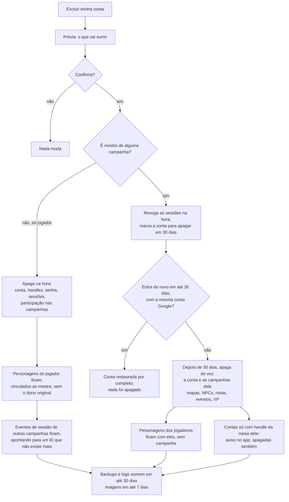

# Privacidade e proteção de dados

O MeuRPG coleta só o que a mesa precisa para jogar, guarda tudo em São Paulo e trata cada direito do titular como uma funcionalidade. Este documento diz que dados pessoais existem no sistema, por quê, por quanto tempo, e o que todo PR precisa respeitar.

> **Não é parecer jurídico.** É orientação de engenharia, escrita por devs. A decisão completa está na ADR-0010 (repositório privado): "privacidade desde a concepção, LGPD como base e GDPR como régua". Ela ainda é **proposta**, até o Samuel aceitar. O aviso de privacidade para quem usa o app é outro documento, ainda a escrever (roteiro no fim desta página).

## Em resumo

- **A lei que vale é a LGPD** (Lei 13.709/2018). O GDPR europeu hoje não se aplica, porque não oferecemos o app para a União Europeia. Mesmo assim, em cada tema, seguimos a regra mais rigorosa das duas.
- **Somos agente de tratamento de pequeno porte** (Resolução CD/ANPD nº 2/2022). Mesmo dispensados, indicamos um encarregado e publicamos um canal de contato. Decidido pelo Samuel em 29/09/2026: ele é o controlador, o Vinicius é o encarregado, e o canal é um e-mail só para isso até existir o domínio.
- **O jogador não precisa dar e-mail nem nome real.** Decidido pelo Samuel em 29/09/2026 (RN-17): o jogador entra por um login anônimo, com o apelido do mestre junto do apelido do jogador, sem conta Google (ver [Regras de negócio](produto/regras.md)).
- **A base legal é o contrato**, não o consentimento. O app precisa desses dados para funcionar. Segurança e logs usam legítimo interesse.
- **Sem cookies de terceiros, analytics, pixel ou fonte de CDN.** O único cookie é o de sessão, que é estritamente necessário, então não há banner.
- **O MVP é para maiores de 18 anos**, por autodeclaração (decidido pelo Samuel em 29/09/2026; ver [Menores de idade](#menores-de-idade)).
- **Só a nossa mesa no MVP.** O app não abre para outras mesas nem cobra nada no MVP (decidido pelo Samuel em 29/09/2026). Abrir muda o porte do agente de tratamento e a análise do GDPR, então a decisão volta antes disso.

## Checklist de privacidade para PRs

Copie no PR que mexe em dados, logs, telas ou fornecedores:

- [ ] **Logs:** nada de headers, query, body, IP, token, e-mail, handle ou texto livre. O middleware de log registra só método, path, protocolo, status e duração.
- [ ] **URLs:** nenhum segredo nem dado pessoal em path ou query string. Token vai no fragmento (`#t=`). Os logs da plataforma guardam a URL inteira.
- [ ] **GET do Connect:** só ganha `idempotency_level = NO_SIDE_EFFECTS` o método cuja requisição não leva ID nem dado pessoal. No GET, a mensagem inteira vai na URL. Leitura com ID leva `IDEMPOTENT` e fica em POST.
- [ ] **Respostas com dado pessoal** saem com `Cache-Control: no-store`.
- [ ] **Coluna ou tabela nova com dado pessoal:** entrou no [inventário](#inventário-de-dados-pessoais) com finalidade e retenção, e o módulo implementa export e exclusão (o teste de catálogo passa).
- [ ] **Só o necessário:** cada campo novo tem um motivo. Campo opcional diz por que existe.
- [ ] **Texto livre novo:** a tela avisa "é ficção; não escreva dados reais de pessoas". Texto livre nunca vai para `session_events`, logs ou o Jev.
- [ ] **Resposta para jogador:** não inclui notas do mestre (RN-11) nem ponto de interesse escondido (RN-10).
- [ ] **`session_events`:** o payload só tem IDs, números e códigos. Nunca nome, handle ou texto.
- [ ] **Imagens:** upload para o nosso bucket, com EXIF removido. Nada de URL de imagem externa.
- [ ] **Navegador:** nenhum script, fonte, pixel ou iframe de terceiros.
- [ ] **Sem Web Storage:** nada de `localStorage`, `sessionStorage`, IndexedDB, cookie gravado pelo JavaScript, ou Worker guardando token ou dado pessoal — o único armazenamento no aparelho é o cookie de sessão `__Host-`, `HttpOnly`. `web/src/no-web-storage.spec.ts` confere isso automaticamente.
- [ ] **Fornecedor novo ou dado saindo do servidor:** atualizar a [tabela de operadores](#operadores-e-onde-os-dados-ficam) e abrir a pergunta de contrato e de transferência internacional.
- [ ] **Segredos:** só no Secret Manager. Nada em código, teste ou fixture.
- [ ] **Gatilho de impacto:** respondeu às [perguntas de impacto](#perguntas-de-impacto)? Um "sim" pede uma seção de riscos no PR.

## Inventário de dados pessoais

"Até excluir" quer dizer: até a pessoa excluir a conta ou o item. Depois disso, o dado ainda some dos backups e logs em até 30 dias. As linhas de handle, senha, link de reentrada e log de identidade são do login do jogador sem Google (RN-17, decidido pelo Samuel em 29/09/2026), ainda não implementado.

| Dado | Onde fica | Para quê | Base legal | Retenção |
|---|---|---|---|---|
| `sub` do Google (mestre, ou jogador que vinculou o Google) | `user_identities.subject`, com `user_identities.issuer` | Reconhecer a conta no login | Contrato | Até excluir |
| E-mail do Google | `user_identities.email` | Só contato de segurança (incidente, pedido do titular). Nunca aparece para outros usuários. Só é gravado se o provedor diz que foi verificado, e é atualizado ou apagado a cada login | Contrato; legítimo interesse | Até excluir |
| Nome e foto do Google | — | Não coletamos. O nome de exibição é digitado no app | — | — |
| Nome de exibição | `users.display_name` | Mostrar a pessoa aos outros membros das campanhas dela. Digitado no app, de 1 a 40 caracteres; nunca vem do provedor de login | Contrato | Até a pessoa apagar (nome vazio no `UpdateProfile`) ou excluir a conta |
| Preferência de inatividade (tempo sem uso até a exclusão automática) | `users` (coluna a definir) | Aplicar RN-16; a pessoa escolhe o próprio prazo | Contrato | Até a pessoa mudar a preferência ou excluir a conta. Padrão de 1 ano quando a pessoa não escolhe |
| Handle | `table_handles` | Identificar o jogador na mesa | Contrato | Até sair da mesa ou excluir |
| Hash de senha (argon2id), contador de falhas | `password_credentials` | Autenticar; travar tentativas | Contrato; legítimo interesse | Até remover a senha ou excluir |
| Hash do token de sessão, datas e `auth_time` | `auth_sessions` (`token_hash`, `created_at`, `expires_at`, `auth_time`) | Manter o login; `auth_time` só para auditoria | Contrato | No máximo 30 dias; a linha vencida some pelo TTL do banco em até 1 dia |
| Estado do login OIDC (`state` só como hash, `code_verifier`, `nonce`, `return_to` sem fragmento) | `oidc_login_states` | Login com o provedor OIDC | Contrato | 10 minutos; apagado no callback, ou pelo TTL do banco em até 1 hora |
| Intenção de login: o tipo (`campaign_invite`) e o hash do token do convite, nunca o token | `oidc_login_states` (`intent_kind`, `intent_data`) | Aceitar o convite logo depois do login, sem guardar nada no navegador | Contrato | No máximo 10 minutos, com o resto do estado do login: apagado no callback, ou pelo TTL do banco em até 1 hora |
| Convite: hash do token, usos, validade e quem criou | `campaign_invites` | Entrar na campanha (RN-07) | Contrato | 30 dias depois de expirar, pelo TTL do banco. O convite vale no máximo 30 dias, então a linha vive no máximo 60. Some antes se a campanha, ou a conta de quem o criou, for excluída |
| Link de reentrada (só hash) | `reentry_links` | Recuperar acesso | Contrato | 30 dias depois de usado ou expirado |
| Log de identidade (reentrada, vínculo e junção de contas) | Banco | Segurança e auditoria | Legítimo interesse | 180 dias, só com UUIDs |
| IP no limitador de tentativas | Memória | Frear força bruta | Legítimo interesse | Minutos |
| IP, user agent e URL nos logs do Cloud Run | Cloud Logging, São Paulo | Operar e proteger a plataforma | Legítimo interesse | 30 dias |
| Membros e papéis (quem, em qual campanha, com qual papel, desde quando) | `campaign_members` | Controlar acesso (RN-05) | Contrato | Enquanto a campanha existir; apagado ao excluir a conta |
| Nome da campanha e modo de XP | `campaigns` | Jogar. O nome é texto livre: a tela avisa "é ficção; não escreva dados reais de pessoas" | Contrato | Enquanto a campanha existir; apagada quando o mestre que a criou exclui a conta |
| Ficha do personagem: escolhas de jogo e o texto livre dela (nome do personagem, equipamento, idiomas, características) | `characters` (`name`, `sheet`) | Jogar. Sem nome real nem e-mail do jogador (PRIV-21) | Contrato | Enquanto o personagem existir: não há exclusão de personagem no fluxo normal (RN-03). Quando o jogador exclui a conta, fica com a campanha, sem vínculo com a conta (RN-16); quando a campanha é apagada, fica com o jogador. Sem jogador e sem campanha, o TTL do banco apaga a linha em até 1 dia. O NPC some com a conta do mestre |
| História do personagem (personalidade, aparência, história, aliados) | `characters.story` | Jogar | Contrato | A mesma da ficha. Depois da trava da ficha, o jogador corrige quando o mestre libera (RN-01) |
| Notas do mestre | `character_master_notes` | Preparar o jogo; nunca vão para o jogador (RN-11) | Contrato | Enquanto a campanha e o personagem existirem; notas vazias apagam a linha |
| Sessões de jogo: quando começaram e terminaram | `game_sessions` | Travar as fichas (RN-01) e, depois, a mesa ao vivo | Contrato | Enquanto a campanha existir. Só IDs e horários: nada sobre uma pessoa |
| Imagens (retrato, mapa, galeria) | Cloud Storage | Jogar | Contrato | Até excluir, mais 7 dias de soft delete |
| Eventos da sessão, combatentes, XP | `session_events`, `combatants`, `xp_awards` | Histórico e tempo real (MR-012, MR-016) | Contrato | Enquanto a campanha existir |
| Backups do banco | Cockroach Labs | Recuperar desastre | Legítimo interesse | 30 dias |
| Cookie de sessão `__Host-meurpg_session` | Aparelho do usuário | Manter o login | Estritamente necessário | Até o logout, que apaga a sessão no servidor, ou 30 dias |
| Cookie de login `__Host-meurpg_login` (o `state`) | Aparelho do usuário | Amarrar o login ao navegador que o começou (contra login CSRF) | Estritamente necessário | 10 minutos; apagado no callback |

**O app novo (`web/`) não guarda nada no navegador além desses dois cookies**, os dois `HttpOnly` e nunca lidos pelo JavaScript da página. Nada de `localStorage`, `sessionStorage`, IndexedDB, cookie gravado pelo JavaScript, ou Worker guardando token ou dado pessoal — regra do Vinicius, sem exceção, com uma trava automática (`web/src/no-web-storage.spec.ts`) que varre o código-fonte atrás dessas APIs. Ver [Arquitetura](arquitetura.md#nenhum-dado-no-navegador-além-do-cookie-de-sessão).

**No app antigo (descontinuado)**, `users.name` era guardado, e havia duas colunas sem finalidade: `characters.email` e `sheet.playerName`. Não há migração de dados: as três simplesmente não existem no schema novo (decidido em 29/09/2026, ver [Modelo de dados](dados.md)). No app antigo, mapas ficavam em base64 no banco, e galeria e campanhas ficavam no `localStorage`.

**Bug do app antigo (descontinuado):** o logout e o "Excluir conta" chamavam rotas que não existiam no NestJS (`POST /api/auth/logout` e `DELETE /api/auth/account`). O logout só limpava o navegador, e o token continuava válido no servidor até expirar. A exclusão falhava, então o direito de eliminação (art. 18, VI) não funcionava lá. Ele não é corrigido no app antigo — o sistema novo implementa os dois desde o primeiro deploy com login e prova com teste automático.

### O que o módulo identity já faz

O login do mestre (`backend/internal/identity`) cumpre assim os itens desta página:

- **Escopo `openid email`.** Nome e foto nunca são pedidos nem gravados, mesmo quando o provedor manda.
- **Logs sem dado pessoal.** Um login que falha registra só um motivo (`state_mismatch`, `invalid_id_token`...). Token, `code`, `state`, cookie, e-mail, `sub`, ID da conta e IP nunca vão para o log. Um teste confere isso.
- **`GetMe` devolve só o ID da conta** e a hora em que a sessão acaba. A requisição é vazia, então o GET do Connect não põe dado pessoal na URL.
- **Respostas sem cache.** `GetMe`, `SignOut` e as rotas `/auth/*` saem com `Cache-Control: no-store`; as rotas `/auth/*` também com `Referrer-Policy: no-referrer`.
- **Excluir a conta** apaga identidades e sessões junto, por `ON DELETE CASCADE`.
- **Limite de tentativas no `/auth/login`.** Para contar as tentativas, o servidor guarda o IP do cliente (o prefixo `/64`, no IPv6) só na memória da instância, nunca no banco nem no log. É a linha "IP no limitador de tentativas" do inventário: some em até 2 minutos depois da última tentativa, ou quando a instância para.
- **Usuários de teste do devidp** (o provedor OIDC de desenvolvimento, ver [CONTRIBUTING.md](../CONTRIBUTING.md#login-local-com-o-devidp)) são fictícios, com e-mails em `example.com`. Ele não existe em produção, então nenhum dado real passa por ele.

### O que o módulo campaigns já faz

O módulo `campaigns` (`backend/internal/campaigns`) e o nome de exibição do `identity` cumprem assim os itens desta página:

- **Nome de exibição digitado.** `users.display_name` nasce vazio e só muda pelo `UpdateProfile`. O nome que o provedor de login manda nunca é gravado (um teste confere com um provedor falso que manda nome). Nome vazio apaga, o que atende a correção e a eliminação (art. 18, III e VI).
- **O `GetMe` não devolve o e-mail.** O e-mail verificado continua só como contato de segurança, em `user_identities`, e não sai em nenhuma resposta.
- **O convite só existe como hash no banco.** O token vai no fragmento da URL (`/convite#t=...`), e o app manda no corpo do `AcceptInvite`, nunca numa query string. Um teste confere que a linha do convite não contém o token.
- **Convite aceito pelo login, sem nada no navegador.** Quem abre o convite sem estar logado manda o token no corpo do `POST /auth/login`. O servidor guarda só o hash, dentro do estado do login (no máximo 10 minutos, uso único), e o app não usa `localStorage`, `sessionStorage` nem service worker para isso (decidido por Vinicius em 29/09/2026). O `GET /auth/login` recusa o token na URL, e o `return_to` perde o fragmento. `TestSignInWithAnInviteJoinsTheCampaign` lê a linha de `oidc_login_states` e confere que nenhuma coluna tem o token; os testes de log conferem que nem o token nem o hash vão para o log.
- **Sem GET com dado na URL.** Só o `ListMyCampaigns`, cuja requisição é vazia, aceita GET. As outras chamadas levam o ID da campanha e ficam em POST.
- **Respostas sem cache.** Toda resposta do `CampaignService`, inclusive erro, sai com `Cache-Control: no-store`.
- **Quem não é membro não descobre a campanha.** A resposta é `not_found`, igual à de uma campanha que não existe (ADR-0011).
- **Logs sem dado pessoal.** O módulo só registra falhas do banco, com a mensagem de erro do driver, que não traz os valores da linha. Nome, token e IDs nunca são passados ao log.
- **Excluir a conta** apaga a participação nas campanhas; para o mestre, apaga também as campanhas que ele criou, com os membros e os convites (`ON DELETE CASCADE`). `TestDeletingAnAccount` confere.

### O que o módulo characters já faz

O módulo `characters` (`backend/internal/characters`) e o começo do `play` cumprem assim os itens desta página:

- **Sem dado real do jogador na ficha.** Não há campo de nome do jogador nem de e-mail (PRIV-21); o nome que aparece ao lado do personagem é o nome de exibição do `identity`. Todo o texto livre (nome do personagem, equipamento, história) é ficção, e a tela vai avisar "é ficção; não escreva dados reais de pessoas" (PR das telas da Etapa 4).
- **As notas do mestre nunca chegam ao jogador.** Ficam numa tabela à parte e só saem pelas chamadas do mestre. `TestRN11_PlayersNeverReceiveMasterNotes` confere cada resposta que o jogador pode pedir.
- **O jogador só vê os próprios personagens.** O de outro jogador e os NPCs são `not_found` para ele, com a mesma mensagem de um personagem que não existe.
- **Sem GET com dado na URL e sem cache.** Toda leitura leva um ID, então fica em POST (`IDEMPOTENT`), e toda resposta, inclusive erro, sai com `Cache-Control: no-store`.
- **Logs e erros sem texto livre.** O módulo só registra falhas do banco. Um erro de validação diz o campo, nunca o que foi digitado (`TestUpdateCharacterValidation`), e uma ficha guardada que não abre gera um erro sem o conteúdo dela.
- **Correção da história.** O jogador edita a história enquanto o personagem é rascunho; depois da trava, quando o mestre libera (RN-01). O pedido de correção fora disso vai pelo canal do encarregado.
- **Excluir a conta.** As chaves estrangeiras já fazem a parte dos personagens: `player_user_id` usa `ON DELETE SET NULL` e o NPC vai junto com a conta do mestre (`CASCADE`); `TestRN16_DeletingAccountsKeepsPlayerCharacters` confere. O personagem de jogador que fica sem jogador e sem campanha é apagado pelo TTL do banco (`TestOrphanedPlayerCharactersAreDeletedByTheDatabase`).
- **Ainda falta:** o export (`ExportMyData`) e a prévia da exclusão com a escolha de apagar os próprios personagens. Vêm no PR de privacidade, com o `PrivacyService` (decidido em 29/09/2026).

## Direitos do titular e como atendemos

Quase tudo é autoatendimento, dentro do app e logado. A sessão já prova quem é a pessoa. O que não for autoatendimento é respondido em até **15 dias corridos**, pelo canal do encarregado.

| Direito | LGPD | Como | API (esboço) |
|---|---|---|---|
| Confirmação e acesso | Art. 18, I e II | Tela "Meus dados", download em JSON | `PrivacyService.ExportMyData` |
| Portabilidade | Art. 18, V | O mesmo JSON, com versão de schema | `PrivacyService.ExportMyData` |
| Correção | Art. 18, III | Editar nome de exibição e handle. A história do personagem, depois da trava da ficha (RN-01), o jogador corrige quando o mestre libera; se o mestre não liberar, o pedido vai pelo canal do encarregado, no prazo de 15 dias | `IdentityService.UpdateProfile` |
| Eliminação | Art. 18, VI | "Excluir minha conta", com prévia do que some | `PrivacyService.PreviewAccountDeletion`, `PrivacyService.DeleteMyAccount` |
| Com quem compartilhamos | Art. 18, VII | Lista de operadores no aviso de privacidade | — |
| Oposição, dúvidas, outros pedidos | Art. 18, §2º | Canal do encarregado; depois, um formulário no app | `PrivacyService.SubmitPrivacyRequest` |
| Revogar consentimento | Art. 18, IX | Nada depende de consentimento hoje. Recurso opcional futuro terá botão de desligar | — |

**Jogador que perdeu o acesso** (conta só com handle): pede um link de reentrada ao mestre e faz o pedido logado. Se o mestre não puder ajudar, escreve ao canal do encarregado.

### Excluir a conta

**Decidido pelo Samuel em 29/09/2026 (RN-16).** Jogador e mestre têm tratamentos diferentes:

- **Jogador:** a exclusão é imediata e definitiva. Conta, handles, senha, sessões e participação nas campanhas somem na hora. Os personagens dele **não são apagados**: ficam vinculados ao mestre da campanha, sem o dono original (ver a tensão com a identidade, abaixo).
- **Mestre:** a conta entra em espera. As sessões são revogadas na hora — ninguém consegue mais usar a conta —, mas a linha da conta em si (o par `issuer`/`subject` do provedor de login, ver [Modelo de dados](dados.md)) só é apagada de vez depois de **30 dias**. Se o mestre entrar de novo com a **mesma conta Google** dentro desses 30 dias, a conta é restaurada por completo: nada foi perdido. Passados os 30 dias sem esse retorno, tudo é apagado: a conta e as campanhas dele (mapas, NPCs, notas, eventos, XP).
- **Em qualquer exclusão**, o que resta (contas de mesa órfãs, backups, logs, imagens) some por completo até 30 dias depois da exclusão de fato.
- **Inatividade:** cada pessoa escolhe no próprio perfil quanto tempo de inatividade leva à exclusão automática da conta; o padrão é 1 ano.

Os personagens já seguem esse desenho no banco (Etapa 4). E um personagem de jogador que fica sem jogador e sem campanha — o jogador excluiu a conta e a campanha foi apagada, em qualquer ordem — é apagado pelo TTL do banco em até 1 dia: ninguém mais o alcança, e guardar o texto livre dele não teria finalidade (ver [Modelo de dados](dados.md#esquema-implementado)).

Por isso os eventos da sessão guardam só IDs: quando a dona dos dados some, o evento fica anônimo sem ninguém editar o histórico. A espera de 30 dias do mestre usa uma marca de "apagar em" na conta, conferida no login, em vez da exclusão imediata da linha. O Samuel aceitou esse desenho em 29/09/2026.

### A tensão entre manter o personagem e apagar a identidade

Manter o personagem de um jogador excluído vinculado ao mestre (RN-16) não pode virar um jeito de manter a identidade dessa pessoa depois que ela pediu para sumir. O vínculo com a conta apagada é removido — a linha de `users` e `user_identities` some, como em qualquer exclusão —, mas o personagem em si tem campos de texto livre (história, aparência, personalidade, citações, aliados) que a própria pessoa escreveu, e que podem conter dado pessoal dela ou de terceiros, mesmo com o aviso de "é ficção; não escreva dados reais de pessoas".

**Tratamento, aceito pelo Samuel em 29/09/2026:**

1. Na exclusão, o personagem passa a pertencer ao mestre da campanha: dono anterior desvinculado, sem nenhum identificador que aponte de volta à conta apagada.
2. Antes de confirmar a exclusão, a tela avisa: "seus personagens continuam na(s) campanha(s), com o mestre; você pode apagá-los agora, se preferir".
3. Se a pessoa escolher apagar em vez de deixar com o mestre, o personagem (inclusive o texto livre) some como qualquer outro dado dela.
4. O texto livre que ficar com o mestre não é filtrado nem redigido automaticamente: é conteúdo de jogo, e o mestre passa a ser quem decide o que fazer com ele, do mesmo jeito que decide sobre um NPC. Isso é uma escolha de produto, não uma garantia jurídica de que não sobra dado pessoal — por isso fica como pergunta ao advogado, abaixo.

O texto livre que fica com o mestre continua na lista de perguntas ao advogado (ver "A definir", abaixo). Ver [ADR-0010](adr/0010-privacidade-lgpd-gdpr.md), seção 4.3.

## Operadores e onde os dados ficam

Os dados ficam em São Paulo (`southamerica-east1`). O acesso de um fornecedor de fora do Brasil ainda conta como transferência internacional, então cada operador precisa de contrato e de um mecanismo de transferência (Resolução CD/ANPD nº 19/2024).

| Fornecedor | O que faz | Dados | Contrato LGPD |
|---|---|---|---|
| Google Cloud | Cloud Run, Cloud Logging, Cloud Storage, Secret Manager | Tudo, em São Paulo | Data Processing Addendum com as cláusulas-padrão brasileiras |
| Cockroach Labs | Banco CockroachDB gerenciado, no Google Cloud em São Paulo | O banco e os backups | **A definir:** o contrato atual cobre o GDPR |
| Google (login) | Sign in with Google | O Google é controlador da própria conta; nós recebemos só `sub` e e-mail | Não é nosso operador |
| Render | App antigo (descontinuado): NestJS. **`server/` será removido do repositório** (decidido pelo Samuel em 29/09/2026, ver [README.md](../README.md)) | O que passava pela API do app antigo | **Lacuna temporária.** Acaba quando `server/` for removido |
| GitHub Pages | App antigo (descontinuado): Angular, mantido em `src/` só como referência até sair num PR à parte | IP de quem visita | **Lacuna temporária.** Acaba quando `src/` for removido |
| Cloudflare Workers AI | Jev, depois do MVP | Só contexto de jogo, sem dado pessoal | **A definir** antes do Jev |
| Have I Been Pwned | Checa se a senha nova já vazou | 5 caracteres do hash da senha, saindo do servidor. Não identifica ninguém | Não é operador |

### O banco do app antigo

Decidido pelo Samuel em 29/09/2026: o CockroachDB do app antigo (usado pelo NestJS) pode ser apagado. Não é o mesmo banco do sistema novo — é um cluster à parte, que só precisa ser descomissionado. Antes de apagar, uma tarefa única importa só os personagens de lá para o banco novo (ver [Modelo de dados](dados.md)); o resto (campanhas, mapas e sessões do app antigo, se existirem) não é importado. Depois de descomissionado, os backups dele somem no prazo do provedor (30 dias). Isso é uma tarefa do [roadmap](roadmap.md) (Etapa 8); falta só a data.

## Cookies e navegador

- O cookie de sessão `__Host-` é estritamente necessário. A LGPD (guia de cookies da ANPD) e a Diretiva ePrivacy europeia (art. 5(3)) dispensam consentimento nesse caso. Por isso não há banner.
- Nada de analytics. Se um dia houver, a preferência é contar no servidor, com números agregados e sem identificador. Qualquer ferramenta com cookie ou identificador exige consentimento antes de carregar, com "recusar" tão fácil quanto "aceitar".
- Fontes e ícones passam a ser servidos pelo nosso servidor. No app antigo, o `index.html` busca fontes no Google, e isso manda o IP de cada visitante para lá.

## Menores de idade

O MVP é para maiores de 18 anos, declarado ao entrar. Guardamos só a data da declaração, nunca a data de nascimento. O convite é pessoal, e o app não tem busca de mesas, perfil público nem chat com desconhecidos. Essas funcionalidades só entram depois de uma avaliação do ECA Digital (Lei 15.211/2025) feita com advogado.

**Pergunta do Samuel, em 29/09/2026, para nós:** se jogadores ou mestres forem menores de 18 anos, o que precisamos fazer para cumprir a LGPD e o GDPR? Respondemos no mesmo dia, no documento de acompanhamento, com a recomendação da ADR-0010 (seção 8):

- o MVP fica só para maiores de 18 anos, por autodeclaração, como descrito acima;
- um menor que já esteja na mesa joga sem conta própria (o mestre cuida da ficha, sem dado pessoal dele), até existir um fluxo com os responsáveis revisado por advogado;
- antes de abrir ao público: advogado, avaliação do ECA Digital (Lei 15.211/2025; Decreto 12.880/2026) e uma aferição de idade que siga as orientações finais da ANPD.

A autodeclaração não é proibida para nós (a vedação do ECA Digital, art. 9º, §1º, é para conteúdo impróprio para menores), mas a ANPD a considera pouco confiável; por isso ela só serve enquanto o app for fechado, por convite. O GDPR (art. 8) só pede idade mínima quando a base é consentimento, e nós usamos contrato. O Samuel aceitou essa recomendação em 29/09/2026, e hoje não há menores na mesa (respondido pelo Vinicius no mesmo dia).

## Incidentes

- **Avaliamos em até 24 h** se um incidente pode causar risco ou dano relevante. Vazamento de hash de senha ou de sessão entra na lista de critérios da ANPD como "dados de autenticação".
- **Comunicamos em até 72 h corridas**, à ANPD e às pessoas afetadas, por mensagem no app e e-mail. A lei dá 3 dias úteis; 72 h cabe nesse prazo e também no do GDPR.
- **Registramos todo incidente por 5 anos**, mesmo os que não precisam ser comunicados.

O runbook fica no repositório privado.

## Perguntas de impacto

Todo PR responde. Um "sim" pede uma seção curta de riscos e medidas no PR. Dois "sim" pedem um relatório de impacto (RIPD) antes do merge.

1. Coleta um tipo novo de dado pessoal? Um dado sensível, documento, foto de pessoa ou localização?
2. Envolve criança ou adolescente, ou verificação de idade?
3. Manda dado para um terceiro novo, ou para fora do Brasil?
4. Decide algo sobre pessoas automaticamente, cria perfil, ou usa IA com dado pessoal?
5. Observa comportamento (analytics, rastreamento)?
6. Torna algo público ou fácil de encontrar (perfil público, busca de mesas, chat)?
7. Muda a escala (abre para outras mesas)?
8. Usa um dado para uma finalidade nova, ou cruza bases?

## A definir

- Criar o e-mail do canal do encarregado (um endereço só para isso, até ter domínio) e publicá-lo no aviso de privacidade.
- Contrato LGPD com a Cockroach Labs; contratos para Render, GitHub Pages e Cloudflare enquanto forem usados.
- Conferir no console do CockroachDB Cloud que os backups ficam em São Paulo e são guardados por no máximo 30 dias. O plano atual, o legado Unlimited, fica (decidido pelo Samuel em 29/09/2026); trocar de plano perde o Unlimited, e está em avaliação se vale migrar para o Cloud SQL ou outro produto (ver [Operação](operacao.md)).
- Antes de ler PDFs de regras com IA (MR-027): escolher o operador, dizer o que sai do servidor, e tratar o direito autoral de livros oficiais (o resultado só aparece para a mesa).
- Revisão por advogado do aviso de privacidade, dos termos de uso e desse tratamento, antes do primeiro deploy público.

## Roteiro do aviso de privacidade

Este é o esqueleto do texto para quem usa o app. Português simples, com versão e data. Mudança relevante é avisada no app.

1. Quem somos: controlador, encarregado e canal de contato.
2. Que dados coletamos, por tipo de conta: mestre com Google, jogador só com handle, jogador com Google.
3. Para que usamos cada dado, e com que base legal.
4. O que o mestre vê e pode fazer, incluindo o link de reentrada e o fato de que, na própria mesa, ele pode entrar como o jogador.
5. Com quem compartilhamos: operadores, países, garantias e a seção de transferência internacional.
6. Por quanto tempo guardamos, incluindo backups e logs.
7. Cookies e armazenamento no navegador.
8. Seus direitos: como pedir, em quanto tempo, e como reclamar à ANPD.
9. Segurança e o que fazemos em caso de incidente.
10. Idade mínima.
11. Mudanças neste aviso.

Os termos de uso vêm junto: quem pode usar (18+), o papel do mestre, conduta (é ficção; não publicar dados reais de terceiros), conteúdo do usuário, sem garantia de disponibilidade, exclusão da conta, lei e foro brasileiros.

## Ver também

- [Arquitetura](arquitetura.md): módulos, login e onde cada peça roda.
- [Modelo de dados](dados.md): as tabelas citadas aqui.
- [Operação](operacao.md): segredos, logs e alertas.
- [Regras de negócio](produto/regras.md): RN-10 e RN-11, que também protegem o que o jogador vê; RN-16, exclusão de conta e inatividade; RN-17, login do jogador sem Google.
- [Perguntas em aberto](produto/perguntas-em-aberto.md): o que ainda falta responder, e o registro das respostas do Samuel.
- `docs/adr/` (repositório privado): ADR-0002 (sessão), ADR-0009 (login do jogador sem Google), ADR-0010 (privacidade), ADR-0011 (papéis por campanha).
