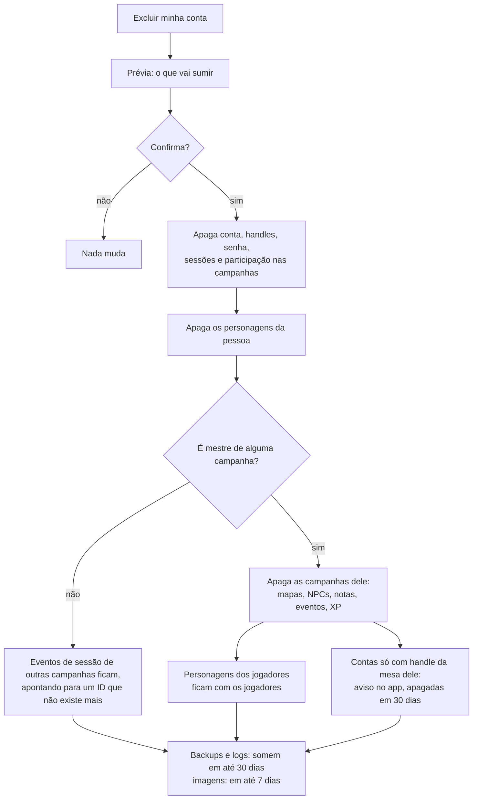

# Privacidade e proteção de dados

O MeuRPG coleta só o que a mesa precisa para jogar, guarda tudo em São Paulo e trata cada direito do titular como uma funcionalidade. Este documento diz que dados pessoais existem no sistema, por quê, por quanto tempo, e o que todo PR precisa respeitar.

> **Não é parecer jurídico.** É orientação de engenharia, escrita por devs. A decisão completa está na ADR-0010 (repositório privado): "privacidade desde a concepção, LGPD como base e GDPR como régua". Ela ainda é **proposta**, até o Samuel aceitar. O aviso de privacidade para quem usa o app é outro documento, ainda a escrever (roteiro no fim desta página).

## Em resumo

- **A lei que vale é a LGPD** (Lei 13.709/2018). O GDPR europeu hoje não se aplica, porque não oferecemos o app para a União Europeia. Mesmo assim, em cada tema, seguimos a regra mais rigorosa das duas.
- **Somos agente de tratamento de pequeno porte** (Resolução CD/ANPD nº 2/2022). Mesmo dispensados, indicamos um encarregado e publicamos um canal de contato.
- **O jogador não precisaria dar e-mail nem nome real.** A proposta em discussão é entrar com um handle da mesa, sem conta Google (ver [Perguntas em aberto](produto/perguntas-em-aberto.md#login-do-jogador-sem-google)).
- **A base legal é o contrato**, não o consentimento. O app precisa desses dados para funcionar. Segurança e logs usam legítimo interesse.
- **Sem cookies de terceiros, analytics, pixel ou fonte de CDN.** O único cookie é o de sessão, que é estritamente necessário, então não há banner.
- **O MVP é para maiores de 18 anos.**

## Checklist de privacidade para PRs

Copie no PR que mexe em dados, logs, telas ou fornecedores:

- [ ] **Logs:** nada de headers, query, body, IP, token, e-mail, handle ou texto livre. O middleware de log registra só método, path, protocolo, status e duração.
- [ ] **URLs:** nenhum segredo nem dado pessoal em path ou query string. Token vai no fragmento (`#t=`). Os logs da plataforma guardam a URL inteira.
- [ ] **GET do Connect:** só ganha `idempotency_level = NO_SIDE_EFFECTS` o método cuja requisição não leva dado pessoal. No GET, a mensagem inteira vai na URL.
- [ ] **Respostas com dado pessoal** saem com `Cache-Control: no-store`.
- [ ] **Coluna ou tabela nova com dado pessoal:** entrou no [inventário](#inventário-de-dados-pessoais) com finalidade e retenção, e o módulo implementa export e exclusão (o teste de catálogo passa).
- [ ] **Só o necessário:** cada campo novo tem um motivo. Campo opcional diz por que existe.
- [ ] **Texto livre novo:** a tela avisa "é ficção; não escreva dados reais de pessoas". Texto livre nunca vai para `session_events`, logs ou o Jev.
- [ ] **Resposta para jogador:** não inclui notas do mestre (RN-11) nem ponto de interesse escondido (RN-10).
- [ ] **`session_events`:** o payload só tem IDs, números e códigos. Nunca nome, handle ou texto.
- [ ] **Imagens:** upload para o nosso bucket, com EXIF removido. Nada de URL de imagem externa.
- [ ] **Navegador:** nenhum script, fonte, pixel ou iframe de terceiros.
- [ ] **Fornecedor novo ou dado saindo do servidor:** atualizar a [tabela de operadores](#operadores-e-onde-os-dados-ficam) e abrir a pergunta de contrato e de transferência internacional.
- [ ] **Segredos:** só no Secret Manager. Nada em código, teste ou fixture.
- [ ] **Gatilho de impacto:** respondeu às [perguntas de impacto](#perguntas-de-impacto)? Um "sim" pede uma seção de riscos no PR.

## Inventário de dados pessoais

"Até excluir" quer dizer: até a pessoa excluir a conta ou o item. Depois disso, o dado ainda some dos backups e logs em até 30 dias. As linhas de handle, senha, link de reentrada e log de identidade dependem do login do jogador sem Google, que ainda está em discussão.

| Dado | Onde fica | Para quê | Base legal | Retenção |
|---|---|---|---|---|
| `sub` do Google (mestre, ou jogador que vinculou o Google) | `user_identities.subject`, com `user_identities.issuer` | Reconhecer a conta no login | Contrato | Até excluir |
| E-mail do Google | `user_identities.email` | Só contato de segurança (incidente, pedido do titular). Nunca aparece para outros usuários. Só é gravado se o provedor diz que foi verificado, e é atualizado ou apagado a cada login | Contrato; legítimo interesse | Até excluir |
| Nome e foto do Google | — | Não coletamos. O nome de exibição é digitado no app | — | — |
| Handle e nome de exibição | `table_handles`, `users` | Identificar o jogador na mesa | Contrato | Até sair da mesa ou excluir |
| Hash de senha (argon2id), contador de falhas | `password_credentials` | Autenticar; travar tentativas | Contrato; legítimo interesse | Até remover a senha ou excluir |
| Hash do token de sessão, datas e `auth_time` | `auth_sessions` (`token_hash`, `created_at`, `expires_at`, `auth_time`) | Manter o login; `auth_time` só para auditoria | Contrato | No máximo 30 dias; a linha vencida some pelo TTL do banco em até 1 dia |
| Estado do login OIDC (`state` só como hash, `code_verifier`, `nonce`, `return_to`) | `oidc_login_states` | Login com o provedor OIDC | Contrato | 10 minutos; apagado no callback, ou pelo TTL do banco em até 1 hora |
| Convite e link de reentrada (só hash) | `campaign_invites`, `reentry_links` | Entrar na campanha; recuperar acesso | Contrato | 30 dias depois de usado ou expirado |
| Log de identidade (reentrada, vínculo e junção de contas) | Banco | Segurança e auditoria | Legítimo interesse | 180 dias, só com UUIDs |
| IP no limitador de tentativas | Memória | Frear força bruta | Legítimo interesse | Minutos |
| IP, user agent e URL nos logs do Cloud Run | Cloud Logging, São Paulo | Operar e proteger a plataforma | Legítimo interesse | 30 dias |
| Membros e papéis | `campaign_members` | Controlar acesso (RN-05) | Contrato | Enquanto a campanha existir |
| Ficha e texto livre do personagem | `characters` | Jogar | Contrato | Até excluir |
| Notas do mestre | `character_master_notes` | Preparar o jogo; nunca vão para o jogador (RN-11) | Contrato | Enquanto a campanha existir |
| Imagens (retrato, mapa, galeria) | Cloud Storage | Jogar | Contrato | Até excluir, mais 7 dias de soft delete |
| Eventos da sessão, combatentes, XP | `session_events`, `combatants`, `xp_awards` | Histórico e tempo real (MR-012, MR-016) | Contrato | Enquanto a campanha existir |
| Backups do banco | Cockroach Labs | Recuperar desastre | Legítimo interesse | 30 dias |
| Cookie de sessão `__Host-meurpg_session` e `localStorage` | Aparelho do usuário | Manter o login | Estritamente necessário | Até o logout, que limpa tudo, ou 30 dias |
| Cookie de login `__Host-meurpg_login` (o `state`) | Aparelho do usuário | Amarrar o login ao navegador que o começou (contra login CSRF) | Estritamente necessário | 10 minutos; apagado no callback |

**No app antigo (descontinuado)**, `users.name` era guardado, e havia duas colunas sem finalidade: `characters.email` e `sheet.playerName`. Não há migração de dados: as três simplesmente não existem no schema novo (decidido em 29/09/2026, ver [Modelo de dados](dados.md)). No app antigo, mapas ficavam em base64 no banco, e galeria e campanhas ficavam no `localStorage`.

**Bug do app antigo (descontinuado):** o logout e o "Excluir conta" chamavam rotas que não existiam no NestJS (`POST /api/auth/logout` e `DELETE /api/auth/account`). O logout só limpava o navegador, e o token continuava válido no servidor até expirar. A exclusão falhava, então o direito de eliminação (art. 18, VI) não funcionava lá. Ele não é corrigido no app antigo — o sistema novo implementa os dois desde o primeiro deploy com login e prova com teste automático.

### O que o módulo identity já faz

O login do mestre (`backend/internal/identity`) cumpre assim os itens desta página:

- **Escopo `openid email`.** Nome e foto nunca são pedidos nem gravados, mesmo quando o provedor manda.
- **Logs sem dado pessoal.** Um login que falha registra só um motivo (`state_mismatch`, `invalid_id_token`...). Token, `code`, `state`, cookie, e-mail, `sub`, ID da conta e IP nunca vão para o log. Um teste confere isso.
- **`GetMe` devolve só o ID da conta** e a hora em que a sessão acaba. A requisição é vazia, então o GET do Connect não põe dado pessoal na URL.
- **Respostas sem cache.** `GetMe`, `SignOut` e as rotas `/auth/*` saem com `Cache-Control: no-store`; as rotas `/auth/*` também com `Referrer-Policy: no-referrer`.
- **Excluir a conta** apaga identidades e sessões junto, por `ON DELETE CASCADE`.
- **Limite de tentativas no `/auth/login`.** Para contar as tentativas, o servidor guarda o IP do cliente (o prefixo `/64`, no IPv6) só na memória da instância, nunca no banco nem no log. É a linha "IP no limitador de tentativas" do inventário: some em até 2 minutos depois da última tentativa, ou quando a instância para.
- **Usuários de teste do devidp** (o provedor OIDC de desenvolvimento, ver [CONTRIBUTING.md](../CONTRIBUTING.md#login-local-com-o-devidp)) são fictícios, com e-mails em `example.com`. Ele não existe em produção, então nenhum dado real passa por ele.

## Direitos do titular e como atendemos

Quase tudo é autoatendimento, dentro do app e logado. A sessão já prova quem é a pessoa. O que não for autoatendimento é respondido em até **15 dias corridos**, pelo canal do encarregado.

| Direito | LGPD | Como | API (esboço) |
|---|---|---|---|
| Confirmação e acesso | Art. 18, I e II | Tela "Meus dados", download em JSON | `PrivacyService.ExportMyData` |
| Portabilidade | Art. 18, V | O mesmo JSON, com versão de schema | `PrivacyService.ExportMyData` |
| Correção | Art. 18, III | Editar nome de exibição e handle. A trava da ficha (RN-01) vale para dado de jogo, nunca para dado pessoal | `IdentityService.UpdateProfile` |
| Eliminação | Art. 18, VI | "Excluir minha conta", com prévia do que some | `PrivacyService.PreviewAccountDeletion`, `PrivacyService.DeleteMyAccount` |
| Com quem compartilhamos | Art. 18, VII | Lista de operadores no aviso de privacidade | — |
| Oposição, dúvidas, outros pedidos | Art. 18, §2º | Canal do encarregado; depois, um formulário no app | `PrivacyService.SubmitPrivacyRequest` |
| Revogar consentimento | Art. 18, IX | Nada depende de consentimento hoje. Recurso opcional futuro terá botão de desligar | — |

**Jogador que perdeu o acesso** (conta só com handle): pede um link de reentrada ao mestre e faz o pedido logado. Se o mestre não puder ajudar, escreve ao canal do encarregado.

### Excluir a conta

A exclusão acontece na hora, numa transação só.

Por isso os eventos da sessão guardam só IDs: quando a dona dos dados some, o evento fica anônimo sem ninguém editar o histórico.

## Operadores e onde os dados ficam

Os dados ficam em São Paulo (`southamerica-east1`). O acesso de um fornecedor de fora do Brasil ainda conta como transferência internacional, então cada operador precisa de contrato e de um mecanismo de transferência (Resolução CD/ANPD nº 19/2024).

| Fornecedor | O que faz | Dados | Contrato LGPD |
|---|---|---|---|
| Google Cloud | Cloud Run, Cloud Logging, Cloud Storage, Secret Manager | Tudo, em São Paulo | Data Processing Addendum com as cláusulas-padrão brasileiras |
| Cockroach Labs | Banco CockroachDB gerenciado, no Google Cloud em São Paulo | O banco e os backups | **A definir:** o contrato atual cobre o GDPR |
| Google (login) | Sign in with Google | O Google é controlador da própria conta; nós recebemos só `sub` e e-mail | Não é nosso operador |
| Render | App antigo (descontinuado): NestJS, mantido em `server/` só como referência | O que passava pela API do app antigo | **A definir** (sai quando `server/` for removido) |
| GitHub Pages | App antigo (descontinuado): Angular, mantido em `src/` só como referência | IP de quem visita | **A definir** (sai quando `src/` for removido) |
| Cloudflare Workers AI | Jev, depois do MVP | Só contexto de jogo, sem dado pessoal | **A definir** antes do Jev |
| Have I Been Pwned | Checa se a senha nova já vazou | 5 caracteres do hash da senha, saindo do servidor. Não identifica ninguém | Não é operador |

## Cookies e navegador

- O cookie de sessão `__Host-` é estritamente necessário. A LGPD (guia de cookies da ANPD) e a Diretiva ePrivacy europeia (art. 5(3)) dispensam consentimento nesse caso. Por isso não há banner.
- Nada de analytics. Se um dia houver, a preferência é contar no servidor, com números agregados e sem identificador. Qualquer ferramenta com cookie ou identificador exige consentimento antes de carregar, com "recusar" tão fácil quanto "aceitar".
- Fontes e ícones passam a ser servidos pelo nosso servidor. No app antigo, o `index.html` busca fontes no Google, e isso manda o IP de cada visitante para lá.

## Menores de idade

O MVP é para maiores de 18 anos, declarado ao entrar. Guardamos só a data da declaração, nunca a data de nascimento. O convite é pessoal, e o app não tem busca de mesas, perfil público nem chat com desconhecidos. Essas funcionalidades só entram depois de uma avaliação do ECA Digital (Lei 15.211/2025) feita com advogado.

## Incidentes

- **Avaliamos em até 24 h** se um incidente pode causar risco ou dano relevante. Vazamento de hash de senha ou de sessão entra na lista de critérios da ANPD como "dados de autenticação".
- **Comunicamos em até 72 h corridas**, à ANPD e às pessoas afetadas, por mensagem no app e e-mail. A lei dá 3 dias úteis; 72 h cabe nesse prazo e também no do GDPR.
- **Registramos todo incidente por 5 anos**, mesmo os que não precisam ser comunicados.

O runbook fica no repositório privado.

## Perguntas de impacto

Todo PR responde. Um "sim" pede uma seção curta de riscos e medidas no PR. Dois "sim" pedem um relatório de impacto (RIPD) antes do merge.

1. Coleta um tipo novo de dado pessoal? Um dado sensível, documento, foto de pessoa ou localização?
2. Envolve criança ou adolescente, ou verificação de idade?
3. Manda dado para um terceiro novo, ou para fora do Brasil?
4. Decide algo sobre pessoas automaticamente, cria perfil, ou usa IA com dado pessoal?
5. Observa comportamento (analytics, rastreamento)?
6. Torna algo público ou fácil de encontrar (perfil público, busca de mesas, chat)?
7. Muda a escala (abre para outras mesas)?
8. Usa um dado para uma finalidade nova, ou cruza bases?

## A definir

- Nome do controlador e do encarregado, e o e-mail do canal (até ter domínio, um endereço só para isso).
- Contrato LGPD com a Cockroach Labs; contratos para Render, GitHub Pages e Cloudflare enquanto forem usados.
- Se há menores na mesa hoje.
- Quando alguém exclui a conta: os personagens dela podem ficar com o mestre como NPC?
- Por quanto tempo guardar contas inativas, já que uma continuação pode vir anos depois (RN-03).
- Revisão por advogado do aviso de privacidade e dos termos de uso antes da Etapa 3.

## Roteiro do aviso de privacidade

Este é o esqueleto do texto para quem usa o app. Português simples, com versão e data. Mudança relevante é avisada no app.

1. Quem somos: controlador, encarregado e canal de contato.
2. Que dados coletamos, por tipo de conta: mestre com Google, jogador só com handle, jogador com Google.
3. Para que usamos cada dado, e com que base legal.
4. O que o mestre vê e pode fazer, incluindo o link de reentrada e o fato de que, na própria mesa, ele pode entrar como o jogador.
5. Com quem compartilhamos: operadores, países, garantias e a seção de transferência internacional.
6. Por quanto tempo guardamos, incluindo backups e logs.
7. Cookies e armazenamento no navegador.
8. Seus direitos: como pedir, em quanto tempo, e como reclamar à ANPD.
9. Segurança e o que fazemos em caso de incidente.
10. Idade mínima.
11. Mudanças neste aviso.

Os termos de uso vêm junto: quem pode usar (18+), o papel do mestre, conduta (é ficção; não publicar dados reais de terceiros), conteúdo do usuário, sem garantia de disponibilidade, exclusão da conta, lei e foro brasileiros.

## Ver também

- [Arquitetura](arquitetura.md): módulos, login e onde cada peça roda.
- [Modelo de dados](dados.md): as tabelas citadas aqui.
- [Operação](operacao.md): segredos, logs e alertas.
- [Regras de negócio](produto/regras.md): RN-10 e RN-11, que também protegem o que o jogador vê.
- `docs/adr/` (repositório privado): ADR-0002 (sessão), ADR-0009 (login do jogador sem Google), ADR-0010 (privacidade).
