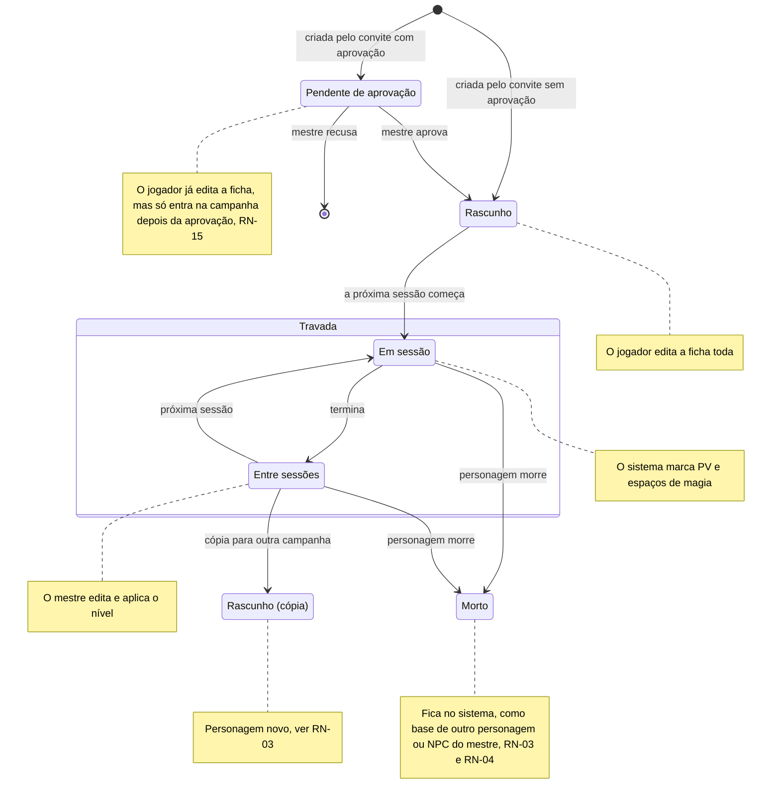
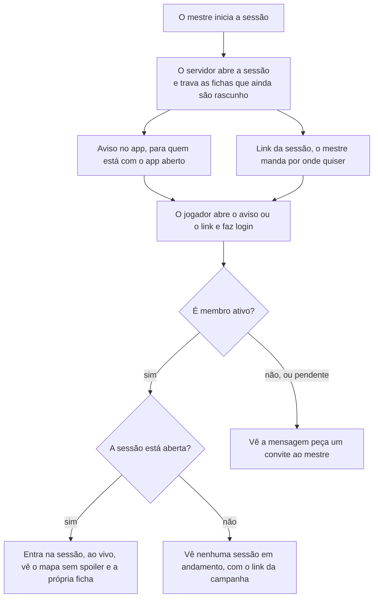

# Regras de negócio

As respostas do Samuel de 28/09/2026 e de 29/09/2026 fecham as regras que faltavam para o MVP. Cada regra tem um ID para as histórias e os testes apontarem para ela. "Proposta" é sugestão nossa, esperando o Samuel mudar para "Decidido".

| ID | Regra | Como o sistema cumpre | Situação |
| --- | --- | --- | --- |
| RN-01 | **Trava da ficha.** O jogador edita a própria ficha até o início da primeira sessão da campanha. Depois, só o mestre e o sistema alteram. Um personagem criado depois (o substituto de um morto, ou o de quem chegou depois) fica editável até a próxima sessão começar. A história do personagem (personalidade, aparência, história, aliados) tem trava própria: depois da trava, o jogador só a edita quando o mestre libera, personagem por personagem, até a próxima sessão começar ou até o mestre travar de novo. Os números que o sistema calcula nunca são editáveis. | O servidor recusa edições do jogador quando `sheet_locked_at` está preenchido. A liberação da história é `story_editing_allowed`, que só o mestre muda e que o início de cada sessão desliga. A tela mostra a ficha só para leitura. Implementado na Etapa 4: `PlayService.StartGameSession` trava, na mesma transação, todo personagem de jogador vivo que ainda é rascunho, então o personagem criado depois trava na sessão seguinte. A recusa é `failed_precondition` com o detalhe `CharacterBlocked` (`SHEET_LOCKED`, `CHARACTER_DEAD` ou `STORY_LOCKED`); o mestre libera a história com `SetStoryEditing`. | Decidido; o personagem criado depois e a trava da história, respondida pelo Vinicius em 29/09/2026 |
| RN-02 | **PV e espaços de magia.** Durante a sessão, o sistema marca PV e espaços de magia a partir das ações: dano, cura, magia conjurada, descanso. O mestre também pode corrigir PV e espaços de magia na mão, a qualquer momento da sessão: o mestre tem a palavra final. | Cada ação vira um evento no servidor, que recalcula e avisa a mesa ao vivo. A correção do mestre também vira um evento, sem passar pelas contas automáticas. Implementada na Etapa 5, a correção do mestre: PV atual, PV temporários, espaços de magia (e de pacto) usados e dados de vida usados ficam em `character_vitals` e duram de uma sessão para outra; os máximos saem da ficha (`rules.Derive`), e o valor guardado é cortado no máximo a cada leitura. O mestre corrige com `PlayService.AdjustCharacterVitals`, só com uma sessão aberta (sem sessão, `failed_precondition` com `NO_OPEN_SESSION`), cada valor de 0 até o máximo; a correção e uma linha em `session_events` são gravadas na mesma transação, e o stream avisa o mestre e o dono do personagem na hora. Uma nova tentativa com a mesma `idempotency_key` não muda nada. O jogador vê só os números do próprio personagem (pergunta 28 para o Samuel; o padrão é "não" para os dos outros). As contas automáticas (dano, cura, magia, descanso) vêm com o combate, na Etapa 6. | Decidido pelo Samuel em 29/09/2026 |
| RN-03 | **Um personagem, uma campanha.** O personagem do jogador fica numa campanha só. Dentro da campanha, o jogador só cria um personagem novo quando o atual morre. O personagem morto não é apagado: fica no sistema, como base para outro personagem do jogador, ou como NPC do mestre em outra campanha (RN-04). Para jogar outra campanha, ao mesmo tempo ou numa continuação anos depois, o jogador faz uma cópia. | A cópia é um personagem novo com `copied_from_id` apontando para o original. Ela começa editável e trava na primeira sessão da nova campanha. O personagem morto muda de estado, nunca de linha: não existe exclusão de personagem no fluxo normal. Implementado na Etapa 4, menos a cópia (MR-021): `characters.campaign_id` é a campanha do personagem, o mestre marca a morte com `MarkCharacterDead` (`status = 'dead'` e `died_at`), e o índice único parcial `characters_one_living_player_character` deixa um só personagem vivo por jogador em cada campanha, mesmo com duas chamadas ao mesmo tempo. A segunda criação recebe `failed_precondition` com `LIVING_CHARACTER_EXISTS` e o ID do vivo. | Decidido pelo Samuel em 29/09/2026 |
| RN-04 | **NPCs reutilizáveis.** O mestre usa os próprios personagens em quantas campanhas quiser. Isso inclui um personagem de jogador morto (RN-03), que o mestre pode reaproveitar como NPC em outra campanha. | O NPC é um modelo. PV e posição de cada combate ficam no combatente, então um combate numa campanha não muda o NPC nas outras. Na Etapa 4, o NPC tem dono, o mestre que o criou (`characters.master_user_id`), e fica na campanha em que foi criado; usar o mesmo NPC em outras campanhas é a MR-022, e nada no modelo impede. Jogadores não veem nem criam NPCs. | Decidido |
| RN-05 | **Papéis por campanha.** Um usuário pode ser mestre numa campanha e jogador em outra. O backend já suportava isso; agora é regra fechada. | O papel fica em `campaign_members`, não no usuário. | Decidido pelo Samuel em 29/09/2026 |
| RN-06 | **Aviso de início da sessão.** Quando o mestre inicia a sessão, os membros recebem uma notificação no app, para quem está com o app aberto. O link da sessão pede que a pessoa esteja logada (com Google, ou com o login sem Google da RN-17) e só abre a sessão para membros. | O app mostra a notificação em tela; não há notificação push do navegador (com o app fechado) no MVP. Quem não é membro vê "peça um convite ao mestre". O servidor da Etapa 5 já cumpre a parte dele: com a aba visível, o app pergunta a cada 30 segundos quais sessões estão abertas nas campanhas da pessoa (`PlayService.ListOpenGameSessions`, só de quem é membro ativo), sem manter conexão aberta; a página da sessão só abre para membros (`GetLiveSession` e `WatchGameSession` respondem `not_found` a quem não é membro, inclusive ao membro pendente, e `failed_precondition` com `NO_OPEN_SESSION` quando não há sessão). As telas (o aviso, o link "Sessão ao vivo" e a página da sessão) vêm no mesmo PR da Etapa 5, depois do desenho aprovado. | Decidido pelo Samuel em 29/09/2026 |
| RN-07 | **Convite não é link da sessão.** O convite adiciona alguém à campanha; o link da sessão só leva um membro até ela. O mestre escolhe, ao gerar o convite, quantos usos ele tem e por quanto tempo vale, e pode revogar a qualquer momento. | O convite expira e fica guardado só como hash. Padrão: 1 uso, 7 dias. O mestre escolhe de 1 a 20 usos e de 5 minutos a 30 dias. O link da sessão não carrega segredo nenhum: é `/campanhas/<id>/sessao`, e quem decide se a pessoa entra é o servidor, conferindo a participação a cada chamada e, no stream, de novo a cada 60 segundos. | Decidido pelo Samuel em 29/09/2026 |
| RN-08 | **Formato da importação.** O jogador ou o mestre escolhe o formato: ficha do D&D Beyond ou a ficha em português, as duas em PDF editável. Não há importação de DOCX. | O importador lê os campos do PDF e mostra o resultado para revisão antes de salvar. | Decidido pelo Samuel em 29/09/2026 |
| RN-09 | **Modo de XP.** Cada campanha dá XP por inimigos derrotados, por ouro ou por marcos. Nos dois primeiros modos, o mestre também dá XP quando quiser. | Por inimigos: soma o XP dos inimigos derrotados e divide entre o grupo, como no livro do mestre. Por ouro: 1 XP por 1 peça de ouro (PO), como nas edições antigas. Por marcos: o mestre sobe o nível do grupo. | Decidido pelo Samuel em 29/09/2026 |
| RN-10 | **Mapa sem spoiler.** O jogador só vê os pontos de interesse que o grupo já descobriu. | O servidor filtra a resposta. Um ponto escondido nunca chega ao celular do jogador. | Decidido |
| RN-11 | **Notas do mestre.** Só o mestre lê e edita as notas do mestre. | As notas ficam numa tabela à parte, `character_master_notes`, e só saem por `GetMasterNotes` e `UpdateMasterNotes`, que só o mestre chama. Nenhuma outra resposta as carrega. No app antigo, o jogador conseguia ler e editar: é um bug conhecido, não corrigido lá — o sistema novo prova que ele não existe com um teste automático (`TestRN11_PlayersNeverReceiveMasterNotes`). | Decidido (respondida pelo Vinicius em 29/09/2026) |
| RN-12 | **Subir de nível no MVP.** A tela de subir de nível fica para depois do MVP. Até lá, o mestre aplica o novo nível na ficha. | O sistema avisa o mestre quando um personagem atinge o XP do próximo nível. | Proposta |
| RN-13 | **Mais de um mestre.** Uma campanha pode ter mais de um mestre, e um mestre pode passar a campanha para outro. | Mais de uma linha com `role = master` em `campaign_members` da mesma campanha. Consequência: hoje excluir a conta de quem criou a campanha apaga a campanha inteira (ver [Privacidade](../privacidade.md#excluir-a-conta)); com mais de um mestre ou com a passagem de campanha, isso muda — a campanha só é apagada quando o último mestre sai. Ver [ADR-0011](../adr/0011-autorizacao-papeis-por-campanha.md), como proposta. | Decidido pelo Samuel em 29/09/2026 |
| RN-14 | **Criar campanha exige conta de mestre completa.** Qualquer conta serve para jogar. Para criar campanha, a conta precisa ser uma conta de mestre completa, que no MVP só existe com Google. Outras formas de login viram conta de mestre completa depois do MVP. | `CreateCampaign` recusa quem não tem uma identidade Google vinculada. Confirma, para o MVP, a proposta da [ADR-0009](../adr/0009-login-do-jogador-sem-google.md). | Decidido pelo Samuel em 29/09/2026 |
| RN-15 | **Convite com aprovação.** Pelo link do convite, o jogador já cria o próprio personagem. O mestre aprova ou recusa esse personagem antes dele valer para a campanha. | O personagem nasce num estado "pendente de aprovação", editável pelo jogador; só passa a fazer parte da campanha quando o mestre aprova (ver [Ciclo de vida da ficha](#ciclo-de-vida-da-ficha), RN-01). Implementado na Etapa 4 (MR-024): o mestre marca, em cada convite, "Exigir aprovação do mestre" (`requires_approval`; sem marcar, o convite funciona como antes). Quem aceita esse convite vira membro pendente (`campaign_members.status = 'pending'`) e vai direto criar o personagem, que nasce `CHARACTER_STATE_PENDING`. O membro pendente não é membro: fora ver o nome da campanha e criar, ler e editar o próprio personagem, o servidor responde `not_found`, como a quem não está na campanha (ver [Arquitetura](../arquitetura.md#membro-pendente)). A sessão não trava o personagem pendente, e ele não morre. O mestre o aprova (`ApproveCharacter`: o personagem vira rascunho e o jogador, membro) ou recusa (`RejectCharacter`: o personagem e a participação pendente são apagados, e o jogador precisa de um convite novo), numa transação só. | Decidido pelo Samuel em 29/09/2026; o convite escolher a aprovação, e a recusa apagar o personagem e a participação, são propostas nossas, esperando o Samuel |
| RN-16 | **Exclusão de conta e inatividade.** Quando um jogador exclui a conta, os personagens dele ficam vinculados ao mestre da campanha, não apagados. Quando um mestre exclui a conta, ele tem 30 dias para voltar entrando de novo com a mesma conta (o mesmo `issuer`/`subject`, ver [Privacidade](../privacidade.md#excluir-a-conta)); passado esse prazo, tudo é apagado. Em qualquer exclusão, tudo some de vez 30 dias depois. Cada pessoa escolhe no próprio perfil quanto tempo de inatividade leva à exclusão da conta; padrão de 1 ano. | O personagem do jogador passa a ser do mestre, sem vínculo com a conta apagada, ou é apagado junto, se a pessoa preferir. A espera de 30 dias do mestre é uma marca "apagar em" na conta, conferida no login. Tratamento aceito pelo Samuel em 29/09/2026; ver [Privacidade](../privacidade.md#excluir-a-conta) para o fluxo completo, inclusive a ressalva sobre dado pessoal em texto livre do personagem. Na Etapa 4, a parte dos personagens já vale no banco: `player_user_id` usa `ON DELETE SET NULL` (o personagem fica na campanha, com o mestre) e o NPC vai junto com a conta do mestre (`CASCADE`). Um personagem de jogador que fica sem jogador e sem campanha é apagado pelo TTL do banco. A escolha de apagar os próprios personagens, a espera de 30 dias e a inatividade vêm com a exclusão de conta. | Decidido pelo Samuel em 29/09/2026 |
| RN-17 | **Login do jogador sem Google.** O jogador entra por um login anônimo, sem e-mail nem nome real: o apelido do mestre junto do apelido do jogador identifica a conta de forma única (o handle é por mesa, não por campanha, como já propunha a [ADR-0009](../adr/0009-login-do-jogador-sem-google.md)). O jogador entra sem senha; quando a primeira sessão de 30 dias vence, ele precisa definir uma senha ou vincular o Google para continuar. | O handle fica em `table_handles`, único dentro da mesa (`dm_user_id`) do mestre. A senha segue a opção 3 da ADR-0009. | Decidido pelo Samuel em 29/09/2026, inclusive a senha |
| RN-18 | **Dados físicos ou do app.** O mestre escolhe se a campanha permite escolher o dado. Se permitir, cada jogador escolhe entre rolar no app ou rolar o dado físico e digitar o resultado. Proposta nossa para quando não permitir: todos usam o tipo que o mestre escolher. | Uma configuração da campanha e uma preferência de cada jogador nela. O motor de regras aceita os dois (ADR-0008). Chega com o combate (Etapa 6). | Decidido pelo Samuel em 29/09/2026 |

## Discussões que podem mudar estas regras

Nenhuma em aberto. A conversa de 28/09/2026 sobre classes e raças fechou em 29/09/2026: a mesa usa todas as classes e raças base do D&D 5e, e o Samuel aceitou as regras como dados, com as fórmulas na biblioteca Expr (ver [ADR-0008](../adr/0008-regras-dnd-conteudo-como-dados-motor-puro.md)). O cálculo automático de PV e espaços de magia (parte de RN-02), MR-004, MR-013, MR-014, MR-015, MR-016 e MR-017 usam esse motor.

## Fluxos e estados

Três fluxos concentram as regras novas: quem pode mexer na ficha em cada momento (RN-01, RN-03 e RN-15), como o jogador chega à sessão (RN-06 e RN-07) e o que acontece com a ficha quando o personagem morre (RN-03).

### Ciclo de vida da ficha

A API mostra esses estados como `CharacterState`, calculado das colunas `status` e `sheet_locked_at` (ver [Modelo de dados](../dados.md#esquema-implementado)):

| Estado no diagrama | `CharacterState` | Colunas |
| --- | --- | --- |
| Pendente de aprovação | `CHARACTER_STATE_PENDING` | `status = 'pending'`: criado por um membro pendente, pelo convite com aprovação (RN-15, MR-024). Aprovado, vira `active` (rascunho); recusado, a linha é apagada |
| Rascunho, Rascunho (cópia) | `CHARACTER_STATE_DRAFT` | `status = 'active'`, `sheet_locked_at` vazio |
| Travada: Em sessão ou Entre sessões | `CHARACTER_STATE_LOCKED` | `status = 'active'`, `sheet_locked_at` preenchido; as duas diferem só por haver uma sessão aberta |
| Morto | `CHARACTER_STATE_DEAD` | `status = 'dead'`, com `died_at` |

Os NPCs estão sempre em `CHARACTER_STATE_DRAFT`: nunca travam nem morrem, e o mestre sempre os edita.

A trava vale por campanha: a cópia começa como rascunho e só trava na primeira sessão da nova campanha. O personagem pendente de aprovação não trava enquanto espera, nem morre; aprovado, vira rascunho e trava na sessão seguinte, como qualquer outro (RN-15). Um personagem criado depois da primeira sessão fica em rascunho até a próxima sessão começar. Depois da trava, a história do personagem só muda quando o mestre libera (RN-01). A tela de subir de nível fica para depois do MVP (RN-12). O personagem morto nunca é apagado (RN-03): ele só muda de estado.

### Entrada na sessão

O aviso e o link só levam até a porta. Quem decide se a pessoa entra é o servidor, conferindo se ela é membro ativo da campanha: o membro pendente (RN-15) ainda não é membro, e vê a mesma mensagem de quem está de fora.

## Ver também

- [Histórias e critérios de aceite](historias.md): as histórias que implementam cada regra.
- [Arquitetura](../arquitetura.md): módulos e códigos de erro que aplicam essas regras.
- [Modelo de dados](../dados.md): onde `sheet_locked_at`, `copied_from_id` e as demais colunas citadas aqui ficam guardadas.
- [Perguntas em aberto](perguntas-em-aberto.md)
