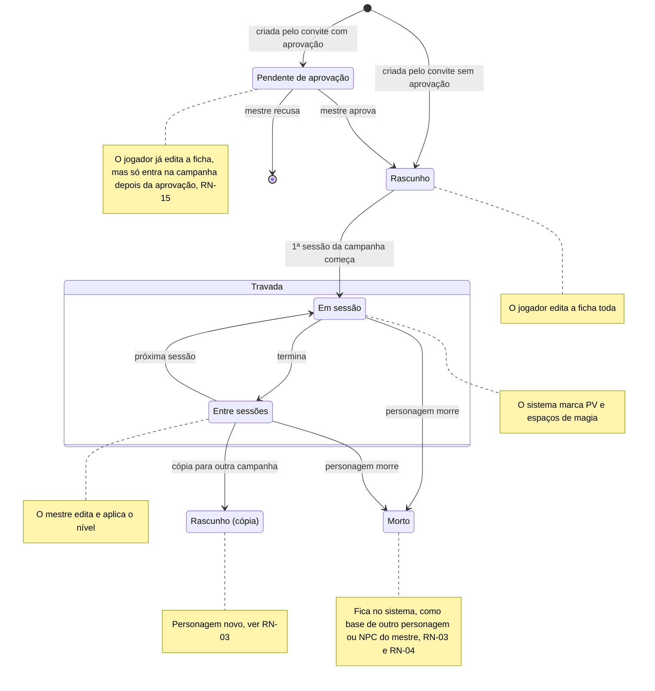
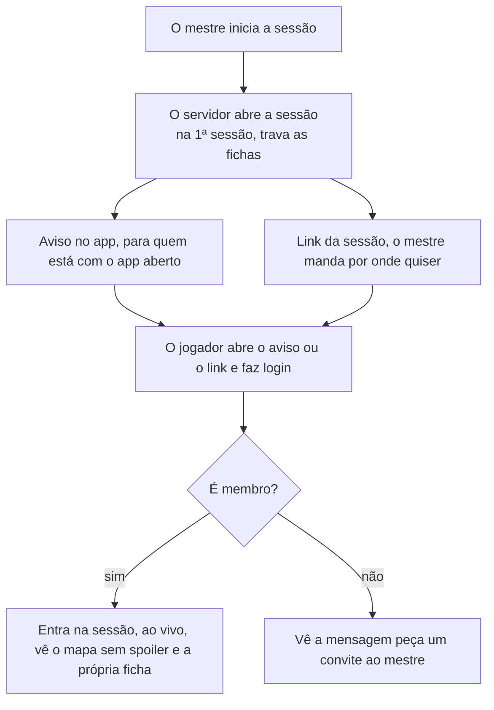

# Regras de negócio

As respostas do Samuel de 28/09/2026 e de 29/09/2026 fecham as regras que faltavam para o MVP. Cada regra tem um ID para as histórias e os testes apontarem para ela. "Proposta" é sugestão nossa, esperando o Samuel mudar para "Decidido".

| ID | Regra | Como o sistema cumpre | Situação |
| --- | --- | --- | --- |
| RN-01 | **Trava da ficha.** O jogador edita a própria ficha até o início da primeira sessão da campanha. Depois, só o mestre e o sistema alteram. | O servidor recusa edições do jogador quando `sheet_locked_at` está preenchido. A tela mostra a ficha só para leitura. | Decidido |
| RN-02 | **PV e espaços de magia.** Durante a sessão, o sistema marca PV e espaços de magia a partir das ações: dano, cura, magia conjurada, descanso. O mestre também pode corrigir PV e espaços de magia na mão, a qualquer momento da sessão: o mestre tem a palavra final. | Cada ação vira um evento no servidor, que recalcula e avisa a mesa ao vivo. A correção do mestre também vira um evento, sem passar pelas contas automáticas. | Decidido pelo Samuel em 29/09/2026 |
| RN-03 | **Um personagem, uma campanha.** O personagem do jogador fica numa campanha só. Dentro da campanha, o jogador só cria um personagem novo quando o atual morre. O personagem morto não é apagado: fica no sistema, como base para outro personagem do jogador, ou como NPC do mestre em outra campanha (RN-04). Para jogar outra campanha, ao mesmo tempo ou numa continuação anos depois, o jogador faz uma cópia. | A cópia é um personagem novo com `copied_from_id` apontando para o original. Ela começa editável e trava na primeira sessão da nova campanha. O personagem morto muda de estado, nunca de linha: não existe exclusão de personagem no fluxo normal. | Decidido pelo Samuel em 29/09/2026 |
| RN-04 | **NPCs reutilizáveis.** O mestre usa os próprios personagens em quantas campanhas quiser. Isso inclui um personagem de jogador morto (RN-03), que o mestre pode reaproveitar como NPC em outra campanha. | O NPC é um modelo. PV e posição de cada combate ficam no combatente, então um combate numa campanha não muda o NPC nas outras. | Decidido |
| RN-05 | **Papéis por campanha.** Um usuário pode ser mestre numa campanha e jogador em outra. O backend já suportava isso; agora é regra fechada. | O papel fica em `campaign_members`, não no usuário. | Decidido pelo Samuel em 29/09/2026 |
| RN-06 | **Aviso de início da sessão.** Quando o mestre inicia a sessão, os membros recebem uma notificação no app, para quem está com o app aberto. O link da sessão pede que a pessoa esteja logada (com Google, ou com o login sem Google da RN-17) e só abre a sessão para membros. | O app mostra a notificação em tela; não há notificação push do navegador (com o app fechado) no MVP. Quem não é membro vê "peça um convite ao mestre". | Decidido pelo Samuel em 29/09/2026 |
| RN-07 | **Convite não é link da sessão.** O convite adiciona alguém à campanha; o link da sessão só leva um membro até ela. O mestre escolhe, ao gerar o convite, quantos usos ele tem e por quanto tempo vale, e pode revogar a qualquer momento. | O convite expira e fica guardado só como hash. Padrão: 1 uso, 7 dias. O mestre escolhe de 1 a 20 usos e de 5 minutos a 30 dias. O link da sessão não carrega segredo nenhum. | Decidido pelo Samuel em 29/09/2026 |
| RN-08 | **Formato da importação.** O jogador ou o mestre escolhe o formato: ficha do D&D Beyond ou a ficha em português, as duas em PDF editável. Não há importação de DOCX. | O importador lê os campos do PDF e mostra o resultado para revisão antes de salvar. | Decidido pelo Samuel em 29/09/2026 |
| RN-09 | **Modo de XP.** Cada campanha dá XP por inimigos derrotados, por ouro ou por marcos. Nos dois primeiros modos, o mestre também dá XP quando quiser. | Por inimigos: soma o XP dos inimigos derrotados e divide entre o grupo, como no livro do mestre. Por ouro: 1 XP por 1 peça de ouro (PO), como nas edições antigas. Por marcos: o mestre sobe o nível do grupo. | Decidido pelo Samuel em 29/09/2026 |
| RN-10 | **Mapa sem spoiler.** O jogador só vê os pontos de interesse que o grupo já descobriu. | O servidor filtra a resposta. Um ponto escondido nunca chega ao celular do jogador. | Decidido |
| RN-11 | **Notas do mestre.** Só o mestre lê e edita as notas do mestre. | O servidor tira `master_notes` de toda resposta para jogador. No app antigo, o jogador conseguia ler e editar: é um bug conhecido, não corrigido lá — o sistema novo prova que ele não existe com um teste automático. | Proposta |
| RN-12 | **Subir de nível no MVP.** A tela de subir de nível fica para depois do MVP. Até lá, o mestre aplica o novo nível na ficha. | O sistema avisa o mestre quando um personagem atinge o XP do próximo nível. | Proposta |
| RN-13 | **Mais de um mestre.** Uma campanha pode ter mais de um mestre, e um mestre pode passar a campanha para outro. | Mais de uma linha com `role = master` em `campaign_members` da mesma campanha. Consequência: hoje excluir a conta de quem criou a campanha apaga a campanha inteira (ver [Privacidade](../privacidade.md#excluir-a-conta)); com mais de um mestre ou com a passagem de campanha, isso muda — a campanha só é apagada quando o último mestre sai. Ver [ADR-0011](../adr/0011-autorizacao-papeis-por-campanha.md), como proposta. | Decidido pelo Samuel em 29/09/2026 |
| RN-14 | **Criar campanha exige conta de mestre completa.** Qualquer conta serve para jogar. Para criar campanha, a conta precisa ser uma conta de mestre completa, que no MVP só existe com Google. Outras formas de login viram conta de mestre completa depois do MVP. | `CreateCampaign` recusa quem não tem uma identidade Google vinculada. Confirma, para o MVP, a proposta da [ADR-0009](../adr/0009-login-do-jogador-sem-google.md). | Decidido pelo Samuel em 29/09/2026 |
| RN-15 | **Convite com aprovação.** Pelo link do convite, o jogador já cria o próprio personagem. O mestre aprova ou recusa esse personagem antes dele valer para a campanha. | O personagem nasce num estado "pendente de aprovação", editável pelo jogador; só passa a fazer parte da campanha quando o mestre aprova (ver [Ciclo de vida da ficha](#ciclo-de-vida-da-ficha), RN-01). | Decidido pelo Samuel em 29/09/2026 |
| RN-16 | **Exclusão de conta e inatividade.** Quando um jogador exclui a conta, os personagens dele ficam vinculados ao mestre da campanha, não apagados. Quando um mestre exclui a conta, ele tem 30 dias para voltar entrando de novo com a mesma conta (o mesmo `issuer`/`subject`, ver [Privacidade](../privacidade.md#excluir-a-conta)); passado esse prazo, tudo é apagado. Em qualquer exclusão, tudo some de vez 30 dias depois. Cada pessoa escolhe no próprio perfil quanto tempo de inatividade leva à exclusão da conta; padrão de 1 ano. | Ver [Privacidade](../privacidade.md#excluir-a-conta) para o fluxo completo, inclusive a ressalva sobre dado pessoal em texto livre do personagem. | Decidido pelo Samuel em 29/09/2026 |
| RN-17 | **Login do jogador sem Google.** O jogador entra por um login anônimo, sem e-mail nem nome real: o apelido do mestre junto do apelido do jogador identifica a conta de forma única (o handle é por mesa, não por campanha, como já propunha a [ADR-0009](../adr/0009-login-do-jogador-sem-google.md)). | O handle fica em `table_handles`, único dentro da mesa (`dm_user_id`) do mestre. | Decidido pelo Samuel em 29/09/2026. Em aberto: se uma senha passa a ser exigida antes de acabarem os primeiros 30 dias (ver [Perguntas em aberto](perguntas-em-aberto.md)). |

## Discussões que podem mudar estas regras

Uma conversa levantada em 28/09/2026 ainda não fechou de todo. As respostas do Samuel de 29/09/2026 fecharam o login do jogador sem Google (RN-17) e o que dependia dele (RN-05, RN-06, RN-07); a parte de classes e raça segue em aberto.

- **O cálculo automático de PV e espaços de magia (parte de RN-02), MR-004, MR-013, MR-014, MR-015, MR-016 e MR-017** dependem de o sistema conhecer os recursos de cada classe e raça (espaços de magia, deslocamento, e outros). O Samuel já respondeu quais classes e raças a mesa usa — todas as base do D&D 5e (ver [ADR-0008](../adr/0008-regras-dnd-conteudo-como-dados-motor-puro.md)) —, mas o motor de fórmulas (Expr) ainda espera o aceite do Samuel. Ver [Regras por classe e raça](perguntas-em-aberto.md#regras-por-classe-e-raça) (em discussão).

## Fluxos e estados

Três fluxos concentram as regras novas: quem pode mexer na ficha em cada momento (RN-01, RN-03 e RN-15), como o jogador chega à sessão (RN-06 e RN-07) e o que acontece com a ficha quando o personagem morre (RN-03).

### Ciclo de vida da ficha

A trava vale por campanha: a cópia começa como rascunho e só trava na primeira sessão da nova campanha. A tela de subir de nível fica para depois do MVP (RN-12). O personagem morto nunca é apagado (RN-03): ele só muda de estado.

### Entrada na sessão

O aviso e o link só levam até a porta. Quem decide se a pessoa entra é o servidor, conferindo se ela é membro da campanha.

## Ver também

- [Histórias e critérios de aceite](historias.md): as histórias que implementam cada regra.
- [Arquitetura](../arquitetura.md): módulos e códigos de erro que aplicam essas regras.
- [Modelo de dados](../dados.md): onde `sheet_locked_at`, `copied_from_id` e as demais colunas citadas aqui ficam guardadas.
- [Perguntas em aberto](perguntas-em-aberto.md)
