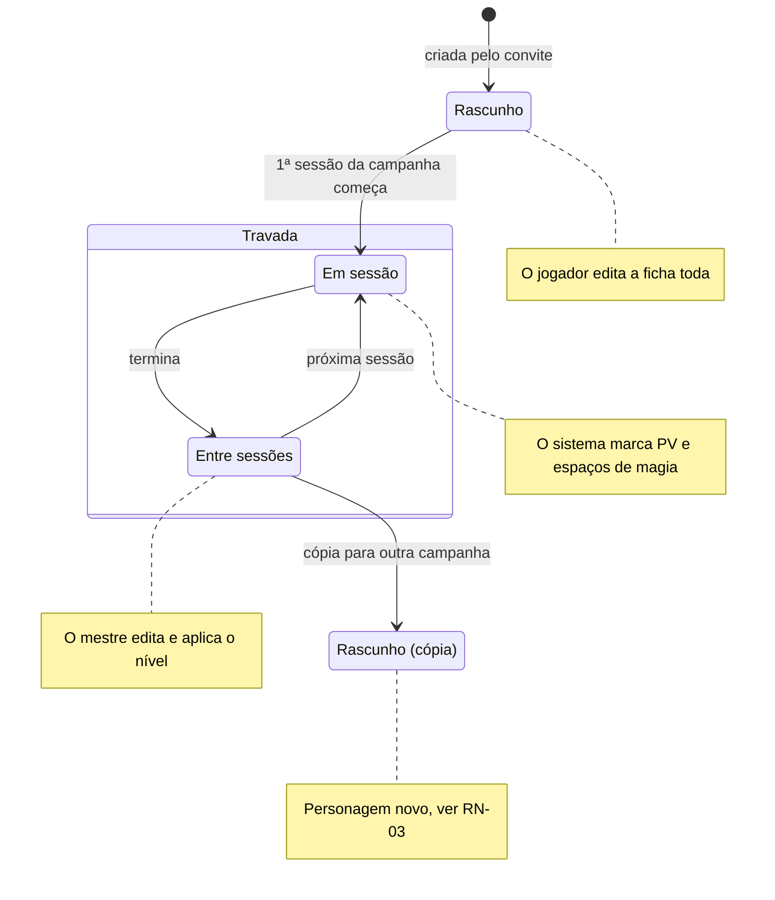
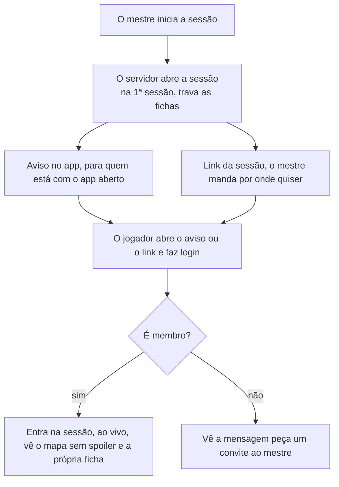

# Regras de negócio

As respostas do Samuel de 28/09/2026 fecham as regras que faltavam para o MVP. Cada regra tem um ID para as histórias e os testes apontarem para ela. "Proposta" é sugestão nossa, esperando o Samuel mudar para "Decidido".

| ID | Regra | Como o sistema cumpre | Situação |
| --- | --- | --- | --- |
| RN-01 | **Trava da ficha.** O jogador edita a própria ficha até o início da primeira sessão da campanha. Depois, só o mestre e o sistema alteram. | O servidor recusa edições do jogador quando `sheet_locked_at` está preenchido. A tela mostra a ficha só para leitura. | Decidido |
| RN-02 | **PV e espaços de magia.** Durante a sessão, o sistema marca PV e espaços de magia a partir das ações: dano, cura, magia conjurada, descanso. | Cada ação vira um evento no servidor, que recalcula e avisa a mesa ao vivo. | Decidido |
| RN-03 | **Um personagem, uma campanha.** O personagem do jogador fica numa campanha só. Para jogar outra, ao mesmo tempo ou numa continuação anos depois, o jogador faz uma cópia. | A cópia é um personagem novo com `copied_from_id` apontando para o original. Ela começa editável e trava na primeira sessão da nova campanha. | Decidido |
| RN-04 | **NPCs reutilizáveis.** O mestre usa os próprios personagens em quantas campanhas quiser. | O NPC é um modelo. PV e posição de cada combate ficam no combatente, então um combate numa campanha não muda o NPC nas outras. | Decidido |
| RN-05 | **Papéis por campanha.** Um usuário pode ser mestre numa campanha e jogador em outra. | O papel fica em `campaign_members`, não no usuário. | Proposta |
| RN-06 | **Aviso de início da sessão.** Quando o mestre inicia a sessão, os membros recebem uma notificação no app. O mestre também gera um link da sessão para mandar por onde quiser. | O link pede login com Google e só abre a sessão para membros. Quem não é membro vê "peça um convite ao mestre". | Decidido |
| RN-07 | **Convite não é link da sessão.** O convite adiciona alguém à campanha; o link da sessão só leva um membro até ela. | O convite expira e fica guardado só como hash. O link da sessão não carrega segredo nenhum. | Proposta |
| RN-08 | **Formato da importação.** O jogador ou o mestre escolhe o formato: ficha do D&D Beyond ou ficha em português. | O importador lê os campos do PDF e mostra o resultado para revisão antes de salvar. | Decidido |
| RN-09 | **Modo de XP.** Cada campanha dá XP por inimigos derrotados, por ouro ou por marcos. Nos dois primeiros modos, o mestre também dá XP quando quiser. | Por inimigos: soma o XP dos inimigos derrotados e divide entre o grupo, como no livro do mestre. Por ouro: converte o ouro conquistado em XP. Por marcos: o mestre sobe o nível do grupo. | Decidido |
| RN-10 | **Mapa sem spoiler.** O jogador só vê os pontos de interesse que o grupo já descobriu. | O servidor filtra a resposta. Um ponto escondido nunca chega ao celular do jogador. | Decidido |
| RN-11 | **Notas do mestre.** Só o mestre lê e edita as notas do mestre. | O servidor tira `master_notes` de toda resposta para jogador. Hoje o jogador consegue ler e editar: é um bug conhecido. | Proposta |
| RN-12 | **Subir de nível no MVP.** A tela de subir de nível fica para depois do MVP. Até lá, o mestre aplica o novo nível na ficha. | O sistema avisa o mestre quando um personagem atinge o XP do próximo nível. | Proposta |

## Discussões que podem mudar estas regras

Duas conversas levantadas em 28/09/2026 ainda não fecharam. Enquanto isso, as regras acima continuam valendo como estão.

- **RN-05 e RN-06** podem mudar se o jogador não precisar de login com Google. Ver [Login do jogador sem Google](perguntas-em-aberto.md#login-do-jogador-sem-google) (em discussão).
- **RN-02** depende de o sistema conhecer os recursos de cada classe e raça (espaços de magia, deslocamento, e outros). Ver [Regras por classe e raça](perguntas-em-aberto.md#regras-por-classe-e-raça) (em discussão).

## Fluxos e estados

Dois fluxos concentram as regras novas: quem pode mexer na ficha em cada momento (RN-01 a RN-03) e como o jogador chega à sessão (RN-06 e RN-07).

### Ciclo de vida da ficha

A trava vale por campanha: a cópia começa como rascunho e só trava na primeira sessão da nova campanha. A tela de subir de nível fica para depois do MVP (RN-12).

### Entrada na sessão

O aviso e o link só levam até a porta. Quem decide se a pessoa entra é o servidor, conferindo se ela é membro da campanha.

## Ver também

- [Histórias e critérios de aceite](historias.md): as histórias que implementam cada regra.
- [Arquitetura](../arquitetura.md): módulos e códigos de erro que aplicam essas regras.
- [Modelo de dados](../dados.md): onde `sheet_locked_at`, `copied_from_id` e as demais colunas citadas aqui ficam guardadas.
- [Perguntas em aberto](perguntas-em-aberto.md)
