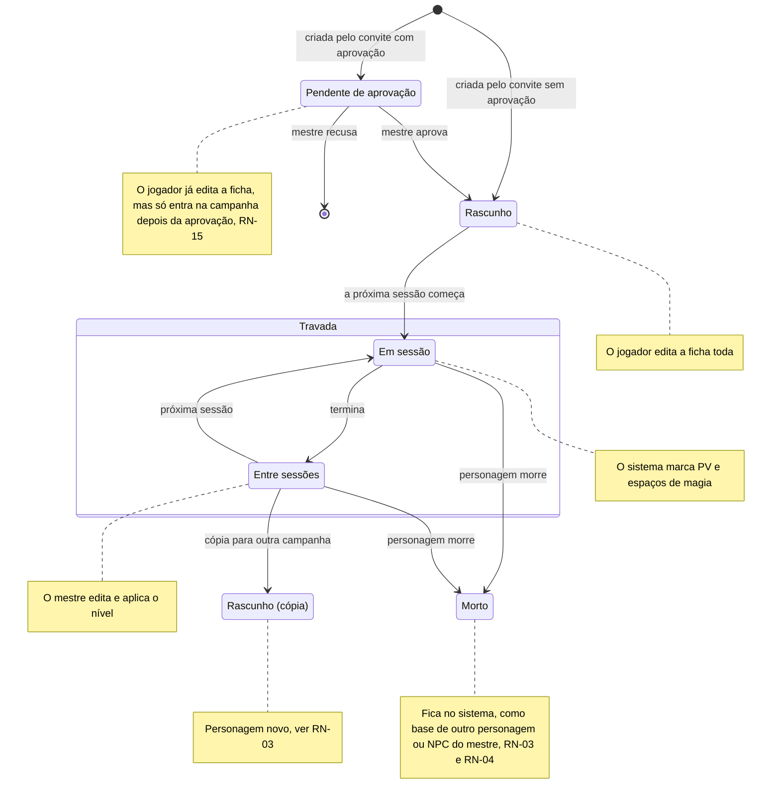
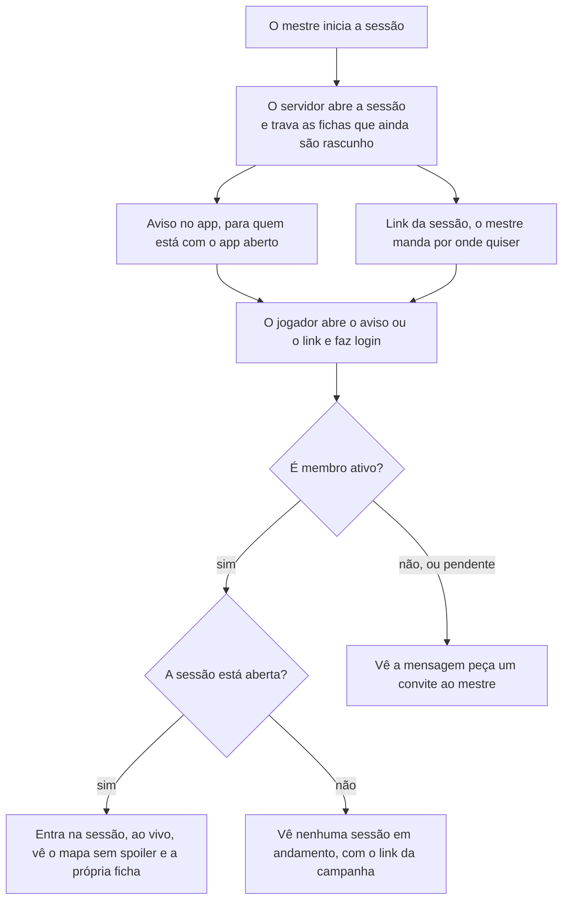

# Regras de negócio

As respostas do Samuel de 28/09/2026 e de 29/09/2026 fecham as regras que faltavam para o MVP. Cada regra tem um ID para as histórias e os testes apontarem para ela. "Proposta" é sugestão nossa, esperando o Samuel mudar para "Decidido". Em 03/10/2026, o Samuel respondeu as perguntas 43 a 65; ver [Perguntas em aberto](perguntas-em-aberto.md#respondidas-em-03102026).

| ID | Regra | Como o sistema cumpre | Situação |
| --- | --- | --- | --- |
| RN-01 | **Trava da ficha.** O jogador edita a própria ficha até o início da primeira sessão da campanha. Depois, só o mestre e o sistema alteram. Um personagem criado depois (o substituto de um morto, ou o de quem chegou depois) fica editável até a próxima sessão começar. A história do personagem (personalidade, aparência, história, aliados) tem trava própria: depois da trava, o jogador só a edita quando o mestre libera, personagem por personagem, até a próxima sessão começar ou até o mestre travar de novo. Os números que o sistema calcula nunca são editáveis. **Exceção (Samuel, 03/10/2026, pergunta 48; antes do MVP, [MR-040](historias.md#mr-040-subir-de-nível-pela-ficha)):** enquanto o personagem "Pode subir de nível" (RN-12), o jogador pode editar a ficha, mas só para acrescentar o que o próximo nível dá: um nível de classe e as escolhas dele. O resto continua travado, e o servidor confere pelo motor de regras. | O servidor recusa edições do jogador quando `sheet_locked_at` está preenchido. A liberação da história é `story_editing_allowed`, que só o mestre muda e que o início de cada sessão desliga. A tela mostra a ficha só para leitura. Implementado na Etapa 4: `PlayService.StartGameSession` trava, na mesma transação, todo personagem de jogador vivo que ainda é rascunho, então o personagem criado depois trava na sessão seguinte. A recusa é `failed_precondition` com o detalhe `CharacterBlocked` (`SHEET_LOCKED`, `CHARACTER_DEAD` ou `STORY_LOCKED`); o mestre libera a história com `SetStoryEditing`. **A exceção do subir de nível (Etapa 8, fatia 8.13, só o servidor; a tela vem depois):** a edição guiada é o `CharacterService.LevelUpCharacter`, só do dono (o mestre continua com o editor da ficha, `UpdateCharacter`), e só enquanto `can_level_up` é verdadeiro, na ficha travada também. O cliente nunca manda a ficha inteira: manda as escolhas (`LevelUpChoices`) e o servidor monta a ficha nova a partir da guardada, roda `rules.Validate` e `rules.CheckLevelUp` e grava com a checagem de revisão (`aborted` se a ficha mudou). **O que a edição pode mudar, e só isso:** um nível de uma classe que o personagem já tem (entrar numa classe nova é multiclasse e fica com o mestre); o aumento de atributo, só num nível que tem "Aumento de Atributo" (+2 num atributo ou +1 em dois, nenhum acima de 20; o SRD 5.1 não tem talentos), que vai para `extra_ability_bonuses`; os PV do nível (a média, o dado rolado no app ou o dado físico digitado, de 1 até o dado da classe; a média e o rolado podem se misturar, e o primeiro dado rolado numa ficha de PV fixos preenche os níveis anteriores com as suas médias, então nada mais muda); exatamente os truques, as magias conhecidas ou do grimório (duas por nível, no Mago) que a tabela da classe dá, e as magias preparadas novas, nenhuma removida, até o novo máximo; a subclasse, se o nível dela é este; e as opções que as features do nível novo oferecem (um estilo de luta, uma metamagia), as perícias e a especialização que ele dá. **O que continua travado, e o servidor recusa com o campo e um motivo (`LevelUpRefusal`):** nome, raça, antecedente, valores-base, armadura, escudo, armas, as outras classes, e tudo o que os níveis anteriores já tinham; a ficha nova também não pode ficar com um problema que a antiga não tinha (uma magia fora da lista da classe, acima do círculo ou preparadas demais). O que a lista não cobre fica com o mestre no editor ("o mestre acrescenta pelo editor"; as opções do servidor listam o que é do nível em `master_adds`): multiclasse; subclasse própria (nome livre); o Arcana Mística do Bruxo (níveis 11, 13, 15 e 17), a Maestria de Magia e a Magia Característica do Mago (18 e 20), os Segredos Mágicos Adicionais do Colégio do Conhecimento (6) e os inimigos e terrenos favoritos do Patrulheiro; e **trocar uma magia conhecida por outra**, que o SRD permite a Bardo, Patrulheiro, Feiticeiro e Bruxo ao subir de nível: a subida guiada só acrescenta magias, nunca tira uma. Dentro da lista, a subida cobre as invocações novas do Bruxo (pela tabela da classe), os Segredos Mágicos do Bardo (níveis 10, 14 e 18: duas das magias novas podem ser de qualquer classe), o truque a mais do Círculo da Terra e as perícias do Colégio do Conhecimento. Uma ficha guardada que já não passa nas regras de hoje (uma chave que o conteúdo perdeu) recebe a recusa `SHEET_NEEDS_MASTER`: o app diz para pedir ao mestre corrigir a ficha. A recusa do jogador por trava continua `failed_precondition` com `CharacterBlocked`: ganharam três motivos, `CANNOT_LEVEL_UP` (não "Pode subir de nível", é NPC ou está no nível 20), `DICE_FORCED_PHYSICAL` e `DICE_FORCED_IN_APP` (RN-18, abaixo). **O dado de vida (RN-18):** o dado rolado no app é rolado **pelo servidor** (`RollLevelUpHitPoints`) e fica guardado para aquele personagem e nível (uma rolagem só por nível, mesmo com duas classes, e ela só vale para a classe que rolou): pedir de novo devolve o mesmo resultado, nunca outro, então o resultado "fica no registro". A campanha que força dado físico recusa o dado do app; a que força o app recusa o número digitado; com "cada jogador escolhe", vale a escolha de cada rolagem. Cada subida fica registrada para o mestre (`ListLevelUps`, "O que mudou"). Testes: `TestLevelUpPensantus`, `TestLevelUpToren`, `TestLevelUpRefusals` (em `rules`) e `TestMR040_ThePlayerLevelsUpALockedSheet`, `TestMR040_TheRestStaysLocked`, `TestMR040_TheRulesRefuseWhatTheLevelDoesNotGive` e `TestMR040_TheHitPointRollIsKept` (em `characters`). | Decidido; o personagem criado depois e a trava da história, respondida pelo Vinicius em 29/09/2026; a exceção do subir de nível, pelo Samuel em 03/10/2026 |
| RN-02 | **PV e espaços de magia.** Durante a sessão, o sistema marca PV e espaços de magia a partir das ações: dano, cura, magia conjurada, descanso. O mestre também pode corrigir PV e espaços de magia na mão, a qualquer momento da sessão: o mestre tem a palavra final. | Cada ação vira um evento no servidor, que recalcula e avisa a mesa ao vivo. A correção do mestre também vira um evento, sem passar pelas contas automáticas. Implementada na Etapa 5, a correção do mestre: PV atual, PV temporários, espaços de magia (e de pacto) usados e dados de vida usados ficam em `character_vitals` e duram de uma sessão para outra; os máximos saem da ficha (`rules.Derive`), e o valor guardado é cortado no máximo a cada leitura. O mestre corrige com `PlayService.AdjustCharacterVitals`, só com uma sessão aberta (sem sessão, `failed_precondition` com `NO_OPEN_SESSION`), cada valor de 0 até o máximo; a correção e uma linha em `session_events` são gravadas na mesma transação, e o stream avisa o mestre e o dono do personagem na hora. Uma nova tentativa com a mesma `idempotency_key` não muda nada. O jogador vê só os números do próprio personagem (pergunta 28, respondida em 02/10/2026: não vê os dos outros; o mestre vê os de todos). As contas automáticas vieram com o combate (Etapa 6, na `main` desde 03/10/2026). As contas são puras, em `rules/combat` (fatia 6.1, 02/10/2026): `ApplyDamage` (PV temporários primeiro, piso em 0), `ApplyHeal` (até o máximo) e `SpendSlot`, `SpendPactSlot` e `SpendResource`. **O dano do combate (fatia 6.4a):** o ataque que acerta abre um dano pendente (`pending_damages`). Num NPC, o dano é aplicado na hora (PV temporários primeiro; a 0 PV ele fica derrotado e sai da ordem); num personagem de jogador, o dano rolado **espera o mestre**, que o aplica ("Aplicar 5 de dano") ou o descarta ("Não aplicar"), e só então muda os `character_vitals`, pelo mesmo caminho da correção, com os mesmos limites (de 0 ao máximo). A 0 PV o personagem está caído (todos veem a palavra "Caído", nunca os números) e faz testes contra a morte (RN-03). O mestre mexe nos PV de um NPC na mão com `AdjustCombatantHitPoints` (dano, cura ou valor, e PV temporários) e desfaz a última ação com `UndoLastAction`: cada uma vira um evento, e o desfazer, um evento compensatório. **Magias, recursos e cura (fatia 6.4b):** `CastSpell` gasta o espaço de magia (ou de pacto) **na conjuração**, junto com a ação ou a ação bônus, pelos mesmos `character_vitals` e na mesma transação (um reenvio com a mesma chave não gasta de novo; o espaço de um NPC não é contado). O dano de uma magia segue o caminho do dano de um ataque (um NPC aplica na hora, um personagem espera o mestre); uma **cura** rola o dado com o modificador de conjuração e cura **na hora**, até o máximo, em NPC e em personagem, e quem estava a 0 PV levanta (RN-03). Os usos de classe e raça (Retomar o Fôlego, Surto de Ação, Fúria...) também ficam em `character_vitals` (`resources_used`, cortados ao máximo da ficha) e a correção do mestre os devolve (`AdjustCharacterVitals.resources_used`; o descanso ainda não existe); Retomar o Fôlego cura 1d10 + o nível de guerreiro. O mestre aplica **uma quantia diferente** da rolada (`ApplyPendingDamage.amount`, de 0 a 9.999: uma resistência, uma resistência que ele não aceita): o registro guarda as duas para ele, e o jogador só vê o que levou. Testes: `TestMR014_CastingSpendsTheSlot`, `TestTimelineRound3MagicMissile`, `TestSaveSpellRollsOnceForTheCast`, `TestHealingSpellRevivesAndResetsDeathSaves`, `TestSecondWindAndActionSurge`, `TestMasterAppliesADifferentAmount`, `TestCombatUndoTakesBackEveryNewAction`. Testes: `TestMR012_DamageToAnNPCIsAppliedAndDefeatsIt`, `TestRN02_DamageToAPlayerWaitsForTheMaster`, `TestCombatUndoRestoresTheLastAction`. | Decidido pelo Samuel em 29/09/2026 |
| RN-03 | **Um personagem, uma campanha.** O personagem do jogador fica numa campanha só. Dentro da campanha, o jogador só cria um personagem novo quando o atual morre. O personagem morto não é apagado: fica no sistema, como base para outro personagem do jogador, ou como NPC do mestre em outra campanha (RN-04). Para jogar outra campanha, ao mesmo tempo ou numa continuação anos depois, o jogador faz uma cópia. | A cópia é um personagem novo com `copied_from_id` apontando para o original. Ela começa editável e trava na primeira sessão da nova campanha. O personagem morto muda de estado, nunca de linha: não existe exclusão de personagem no fluxo normal. Implementado na Etapa 4, menos a cópia (MR-021): `characters.campaign_id` é a campanha do personagem, o mestre marca a morte com `MarkCharacterDead` (`status = 'dead'` e `died_at`), e o índice único parcial `characters_one_living_player_character` deixa um só personagem vivo por jogador em cada campanha, mesmo com duas chamadas ao mesmo tempo. A segunda criação recebe `failed_precondition` com `LIVING_CHARACTER_EXISTS` e o ID do vivo. No combate, a terceira falha no teste contra a morte não mata sozinha: o personagem só morre quando o mestre confirma (pergunta 39), e a confirmação é a mesma `MarkCharacterDead`; a partir daí vale tudo acima. Decidido em 02/10/2026 e feito na fatia 6.4b. As contas do teste contra a morte estão em `rules/combat` (`DeathSave`, `DamageWhileDown`): três falhas dão o resultado `dying`, nunca a morte. **Como o sistema cumpre:** um personagem a 0 PV está "Caído" e, no começo da vez dele, deve um teste contra a morte (`death_save_due`; o `EndTurn` do jogador espera, com `DEATH_SAVE_DUE`, e o mestre passa a vez mesmo assim). `RollDeathSave` (d20 do app ou digitado, a cada rolagem, RN-18): 10 ou mais é sucesso, menos é falha, 1 natural são duas falhas, 20 natural volta com 1 PV (pelos `character_vitals`, as contagens zeram e ele pode agir); três sucessos o deixam "Estável"; três falhas o deixam "Morrendo" para o mestre (para os jogadores a palavra continua "Caído", com as contagens, que são públicas: o app nunca diz que alguém morreu antes do mestre). Dano que acerta quem está a 0 PV não baixa os PV: conta uma falha (duas no crítico); num personagem estável, os sucessos zeram antes. Qualquer cura acima de 0 zera as contagens (uma magia, Retomar o Fôlego, a correção do mestre, um desfazer). `ConfirmDeath` (só o mestre, só com três falhas) chama o efeito do `MarkCharacterDead` na mesma transação, tira o combatente da ordem (a vez passa se era dele) e vai para o registro; **não se desfaz**, porque o personagem já está morto no `characters` (para trazê-lo de volta o mestre usa o próprio serviço de personagens). As contagens ficam na linha do combatente: o combate encerrado as guarda para o resumo ("Caída: 1 sucesso, 1 falha"), e um combate novo começa em 0 e 0. Quem cai a 0 PV na própria vez só rola o primeiro teste na vez seguinte. Fora do combate o app ainda não rola testes contra a morte. Testes: `TestRN03_DeathSavesAndTheMasterConfirms`, `TestRN03_NaturalOneTwentyAndStable`. **Nas telas (6.5c):** na vez de quem está caído, o herói diz "Brisa está caída", com as marcas (sucesso ✓, falha ✕) e "Rolar teste contra a morte" (no app ou digitado, a cada rolagem); depois da rolagem aparece o resultado numa região viva e "Encerrar turno". Só o mestre vê "Morrendo · 3 falhas" e a pergunta "Confirmar a morte" / "Ainda não" (foco em "Ainda não"); os jogadores veem "Caída" e as contagens. Teste: `combat.spec.ts` ("caído: o teste contra a morte"). | Decidido pelo Samuel em 29/09/2026; a confirmação da morte, em 02/10/2026 |
| RN-04 | **NPCs reutilizáveis.** O mestre usa os próprios personagens em quantas campanhas quiser. Isso inclui um personagem de jogador morto (RN-03), que o mestre pode reaproveitar como NPC em outra campanha. | O NPC é um modelo. PV e posição de cada combate ficam no combatente, então um combate numa campanha não muda o NPC nas outras. Na Etapa 4, o NPC tem dono, o mestre que o criou (`characters.master_user_id`), e fica na campanha em que foi criado; usar o mesmo NPC em outras campanhas é a MR-022, e nada no modelo impede. Jogadores não veem nem criam NPCs. | Decidido |
| RN-05 | **Papéis por campanha.** Um usuário pode ser mestre numa campanha e jogador em outra. O backend já suportava isso; agora é regra fechada. | O papel fica em `campaign_members`, não no usuário. | Decidido pelo Samuel em 29/09/2026 |
| RN-06 | **Aviso de início da sessão.** Quando o mestre inicia a sessão, os membros recebem uma notificação no app, para quem está com o app aberto. O link da sessão pede que a pessoa esteja logada (com Google, ou com o login sem Google da RN-17) e só abre a sessão para membros. | O app mostra a notificação em tela; não há notificação push do navegador (com o app fechado) no MVP. Quem não é membro vê "peça um convite ao mestre". O servidor da Etapa 5 já cumpre a parte dele: com a aba visível, o app pergunta a cada 30 segundos quais sessões estão abertas nas campanhas da pessoa (`PlayService.ListOpenGameSessions`, só de quem é membro ativo), sem manter conexão aberta; a página da sessão só abre para membros (`GetLiveSession` e `WatchGameSession` respondem `not_found` a quem não é membro, inclusive ao membro pendente, e `failed_precondition` com `NO_OPEN_SESSION` quando não há sessão). As telas estão no app: o aviso embaixo da barra do app, o link "Ao vivo" na barra e a página da sessão (`/campanhas/<id>/sessao`). | Decidido pelo Samuel em 29/09/2026 |
| RN-07 | **Convite não é link da sessão.** O convite adiciona alguém à campanha; o link da sessão só leva um membro até ela. O mestre escolhe, ao gerar o convite, quantos usos ele tem e por quanto tempo vale, e pode revogar a qualquer momento. | O convite expira e fica guardado só como hash. Padrão: 1 uso, 7 dias. O mestre escolhe de 1 a 20 usos e de 5 minutos a 30 dias. O link da sessão não carrega segredo nenhum: é `/campanhas/<id>/sessao`, e quem decide se a pessoa entra é o servidor, conferindo a participação a cada chamada e, no stream, de novo a cada 60 segundos. | Decidido pelo Samuel em 29/09/2026 |
| RN-08 | **Formato da importação.** O jogador ou o mestre escolhe o formato: ficha do D&D Beyond ou a ficha em português, as duas em PDF editável. Não há importação de DOCX. | O importador lê os campos do PDF e mostra o resultado para revisão antes de salvar. | Decidido pelo Samuel em 29/09/2026 |
| RN-09 | **Modo de XP.** Cada campanha dá XP por inimigos derrotados, por ouro ou por marcos. Nos dois primeiros modos, o mestre também dá XP quando quiser. | Por inimigos: soma o XP dos inimigos derrotados e divide entre o grupo, como no livro do mestre. Por ouro: 1 XP por 1 peça de ouro (PO), como nas edições antigas. Por marcos: o mestre sobe o nível do grupo. **Decidido pelo Samuel em 03/10/2026 (perguntas 44 a 47):** por inimigos, o mestre escolhe se usa o ND ou digita o XP, e decide no fim do combate quem recebe (já é assim, abaixo). Por marcos, o mestre define antes os momentos em que dá um nível completo (**Etapa 8, fatia 8.10, feito**: os marcos planejados, descritos abaixo; o "Registrar um marco fora da lista" continua para o que ninguém planejou). Por ouro, as PO vêm de tesouros postos antes no mapa e são convertidas, 1 XP por PO, quando o grupo volta à cidade (**ainda a fazer**, Etapa 9, [MR-041](historias.md#mr-041-tesouros-e-xp-por-ouro)); até lá, o mestre digita as PO. **As contas (Etapa 7, fatia 7.1):** as tabelas do SRD são conteúdo escrito à mão, `effects/advancement.json` (XP de cada nível, de 1 a 20, e o XP de cada nível de desafio, "ND", de 0 a 30), conferido ao carregar. As funções são puras, no `rules`: `XPForChallenge` (ND para XP), `SplitXP` e `LevelForXP`. **A divisão** é do total pelo número de personagens, arredondada para baixo (100 XP para 3 dá 33 para cada), decidido pelo Samuel em 03/10/2026 (pergunta 46); o ND 0 vale 10 na tabela, e o mestre digita 0 para uma criatura que não ataca. Testes: `TestXPForChallenge`, `TestSplitXP`, `TestLoadAdvancementRefusesBrokenTables`. **O XP dado (Etapa 7, fatia 7.2, módulo `progression`).** O mestre dá XP com `AwardXP`: por inimigos (a soma do XP dos NPCs derrotados de um combate encerrado, um prêmio por combate, a menos que seja desfeito), por ouro (1 XP por PO) ou avulso (o número que digitou), e cada personagem escolhido recebe a parte dele na ficha, na mesma transação. O modo precisa caber na campanha (por inimigos: inimigos e avulso; por ouro: ouro e avulso; por marcos: só o marco) e quem recebe tem de ser personagem de jogador vivo da campanha. O XP do NPC é o `xp_value` da ficha dele (o nível de desafio preenche, e o mestre pode digitar outro), copiado para o combatente quando ele entra no combate; só o mestre o recebe (RN-20). O mestre desfaz só o último prêmio, que continua no histórico como "Desfeito" (nada se apaga, ADR-0007). Toda a campanha lê o histórico (quem deu, quando, por quê, quanto cada um recebeu), e os jogadores recebem o aviso `xp_changed` ao vivo. **O que o Samuel decidiu em 03/10/2026 (perguntas 44 a 50), e já é assim:** o ND é opcional e o campo de XP aceita qualquer número, então os dois jeitos valem por igual (44); quem divide é a lista de personagens que o mestre manda, que a tela propõe com os que lutaram e não morreram (45, por inimigos); a divisão que não fecha arredonda para baixo e o servidor diz quanto se perdeu (46); o marco marca os personagens que o mestre escolhe, sem XP, e a marca dura até o nível da ficha subir (o aviso de subir de nível, 49); todos da campanha veem o histórico (50). **Ainda a fazer:** o XP por tesouro (47), descrito no começo desta regra. **Os marcos planejados (Etapa 8, fatia 8.10, pergunta 45).** Na campanha por marcos, o mestre escreve os marcos antes, uma lista de textos de até 120 caracteres (no máximo 100 por campanha, contando os alcançados), na ordem que ele quiser (`AddMilestone`, `UpdateMilestone`, `MoveMilestone`, `RemoveMilestone`, uma mudança por chamada; a tabela é `planned_milestones`). Quando o grupo chega num marco, o mestre o marca e escolhe quem sobe de nível (`MarkMilestoneReached`): é o `MarkMilestone` de antes, com o texto do marco como motivo e ligado ao marco, então "Pode subir de nível" (RN-12), o histórico, o evento da sessão e o `xp_changed` são os mesmos. A ordem nunca é cobrada: dá para marcar fora dela. Um marco é alcançado uma vez só; "Dar a mais alguém" (`GiveMilestoneTo`) dá o mesmo marco a quem ficou de fora, como um novo prêmio daquele personagem no histórico, sem um segundo marco. "Alcançado" não é uma coluna: vale enquanto algum prêmio do marco não foi desfeito. O desfazer continua sendo o do último prêmio (`UndoLastXPAward`): desfazer a única marca faz o marco voltar a planejado, no mesmo lugar da lista; desfazer uma marca de "Dar a mais alguém" tira o marco só daquele personagem, e ele continua alcançado para os outros. Um marco alcançado nunca é editado, movido nem removido, só desfeito. **Quem vê o quê (RN-20):** os planejados são só do mestre; o jogador recebe apenas os alcançados, com o dia, a hora e quem subiu de nível, como no histórico (pergunta 50), e nunca o nome de um marco que não aconteceu. Um marco registrado fora da lista aparece entre os alcançados, mas não pode receber "Dar a mais alguém". Campanha que conta XP recusa tudo isso com `MODE_NOT_ALLOWED`. Testes: `TestMR016_PlannedMilestones`, `TestMR016_ReachingAPlannedMilestoneLetsTheChosenLevelUp`, `TestMR016_GiveAReachedMilestoneToSomeoneElse`, `TestMR016_UndoOfAPlannedMilestone`, `TestMR016_AMilestoneMarkedOffTheListIsReachedToo`, `TestRN20_PlayersSeeOnlyReachedMilestones`, `TestMR016_PlannedMilestonesNeedAMilestonesCampaign` e a matriz `TestAuthorizationMatrix`; na tela, os testes `@MR-016`, `@RN-12` e `@RN-20` de `e2e/tests/milestones.spec.ts`. **As telas (Etapa 7, fatia 7.4).** O NPC tem "Nível de desafio (ND)" e "XP ao derrotar" no editor (lacaio: seção "Ao ser derrotado"; inimigo e chefe: no passo Básico): trocar o ND sempre refaz o XP pela tabela, um valor digitado fica enquanto o ND não muda, e "Usar 50 XP" volta ao da tabela. No fim do combate, o mestre vê o XP de cada derrotado, a soma, quem recebe (por padrão quem lutou e não morreu; o morto não pode ser marcado) e a divisão escrita ("350 XP ÷ 3 = 116,67, arredondado para baixo. 2 XP se perdem na divisão."); "Dar 116 XP a cada um" dá o prêmio do combate, e "Agora não" deixa a linha "XP do combate ainda não dado", que abre "Dar XP" com o motivo e o total preenchidos. "Dar XP" a qualquer hora (campanha e sessão) pede o motivo (até 120 caracteres) e o valor (1 a 1.000.000), ou as peças de ouro no modo por ouro; os erros aparecem ao sair do campo. A página da campanha tem "Experiência" para todos os membros: o XP de cada personagem, o que falta, o histórico e, só para o mestre, "Desfazer" no último prêmio, com a pergunta no lugar e o foco em "Voltar". Em campanha por marcos nenhuma tela mostra número de XP: a etiqueta e, desde a fatia 8.10, as listas de marcos ("Registrar marco" virou "Registrar um marco fora da lista"). A ficha traz o XP como bloco de leitura, e o jogador não digita mais o XP depois que a ficha trava. Testes: `e2e/tests/xp.spec.ts` (`@MR-016`) e os do Vitest de `core/progression`, `shared/xp`, `campaign-detail/experience`, `combat-xp` e `defeat-xp`. | Decidido pelo Samuel em 29/09/2026 (XP por ouro) e em 03/10/2026 (perguntas 44 a 50) |
| RN-10 | **Mapa sem spoiler.** O jogador só vê os pontos de interesse que o grupo já descobriu. | O servidor filtra a resposta. Um ponto escondido nunca chega ao celular do jogador. Implementado na Etapa 5 com os mapas (MR-008, MR-009): o mapa e o ponto nascem escondidos, e o mestre revela e esconde cada um (`SetMapRevealed`, `SetMapPointRevealed`); o token do NPC nasce escondido e o do personagem de jogador, visível (`SetMapTokenHidden`). O jogador vê o mapa revelado e o mapa atual da sessão (escolher o mapa atual o revela); nele, só os pontos revelados e os tokens visíveis; o ponto de submapa só leva a um mapa que ele também vê. Qualquer outro mapa é `not_found`, igual a um mapa que não existe. O que o jogador não vê fica de fora da resposta, nunca em branco: nem o ID, nem o nome, nem a descrição. O stream segue a mesma regra: uma mudança só em coisas escondidas chega só ao mestre (`TestMR009_PlayersNeverReceiveHiddenPoints`, `TestRN10_PlayersCannotOpenHiddenMaps`; ver [Arquitetura](../arquitetura.md#quem-vê-o-quê-no-mapa)). As imagens seguem a mesma ideia, com a galeria (MR-019): a galeria, com todas as imagens da campanha, é só do mestre (`TestMR019_PlayersCannotListTheGallery`). O jogador baixa uma imagem (`GET /images/{id}`) só enquanto a vê: o fundo de um mapa que ele vê, ou a imagem que o mestre mostra na sessão (MR-028), que não revela mais nada. Guardar o ID não basta: a rota confere a cada pedido, e o navegador do jogador pergunta de novo a cada uso (padrão aceito em 02/10/2026, pergunta 32; `TestRN10_PlayersOnlyFetchImagesTheyCanSee`). O mestre pode deixar uma imagem com os jogadores ("Deixar com os jogadores", MR-028, pergunta 32): ela vai para a lista de imagens deixadas da campanha (`campaign_left_images`) e o jogador a baixa até o mestre tirá-la (`TakeBackLeftImage`), também depois da sessão (`TestMR028_MasterLeavesAnImageWithThePlayers`, e a parte nova de `TestRN10_PlayersOnlyFetchImagesTheyCanSee`: deixada, servida; tirada, `404` de novo). Quem não é membro ativo, ou o jogador que não vê a imagem, recebe `404`, igual a uma imagem que não existe (ver [Arquitetura](../arquitetura.md#servir-as-imagens)). **Cenas de RP (Etapa 7, MR-015):** o mestre pode abrir um ponto de cena escondido (`OpenScene`); ele não é revelado: a cena aberta chega aos jogadores (`GetOpenScene`, com o nome, a descrição e as ações), e o ponto continua fora do mapa deles. O `MapPoint` de um ponto revelado traz as ações da cena, sem a CD. Testes: `TestMR015_AHiddenPointCanBeOpenedAndStaysHidden`, `TestMR015_PlayerSeesTheMastersActionsWithTheirBonus`. **O palco e os retratos (Etapa 8, MR-031, pergunta 62, decidida pelo Samuel em 03/10/2026):** o retrato de um NPC é uma imagem da galeria (campo `portrait_image_id` da ficha do NPC), e o jogador só o baixa enquanto o NPC está no palco da cena aberta: fora de cena, com a cena fechada ou trocada, ou com a sessão encerrada, é `404`, igual a uma imagem que ele não pode ver, também no `If-None-Match`. Tirar o NPC de cena corta o acesso na hora. Testes: `TestMR031_PortraitsAreVisibleOnlyOnStage`, `TestMR031_DeletingAPortraitClearsIt` (ver [Arquitetura](../arquitetura.md#npcs-em-cena-o-palco)). **Cenas descobertas, pistas e ganchos (Etapa 8, MR-029, MR-030, pergunta 61, decidida pelo Samuel em 03/10/2026):** uma cena é "descoberta" quando o mestre revela o ponto no mapa ou a abre numa sessão (mesmo escondida), vale para o grupo todo e não some se o ponto for escondido de novo; é a única regra que deixa o jogador usar o nome de uma cena fora do mapa (a etiqueta de uma anotação). Qualquer ponto de cena abre, mesmo sem ações (pergunta 63, decidida pelo Samuel em 03/10/2026: a cena é toda do mestre; o servidor não recusa mais). O jogador só vê os NPCs da cena e poderá tocar num deles para vê-lo maior, sem mais nada (ainda a fazer, [MR-031](historias.md#mr-031-npcs-na-cena)). Testes: `TestMR030_TagsOnlyDiscoveredScenes`, `TestScenesWithNoActionsOpen`. | Decidido |
| RN-11 | **Notas do mestre.** Só o mestre lê e edita as notas do mestre. | As notas ficam numa tabela à parte, `character_master_notes`, e só saem por `GetMasterNotes` e `UpdateMasterNotes`, que só o mestre chama. Nenhuma outra resposta as carrega. No app antigo, o jogador conseguia ler e editar: é um bug conhecido, não corrigido lá — o sistema novo prova que ele não existe com um teste automático (`TestRN11_PlayersNeverReceiveMasterNotes`). | Decidido (respondida pelo Vinicius em 29/09/2026) |
| RN-12 | **Subir de nível no MVP.** A tela completa de subir de nível fica para depois do MVP ([MR-017](historias.md#mr-017-subir-de-nível)). Até lá, o mestre aplica o novo nível na ficha. Decidido pelo Samuel em 03/10/2026 (pergunta 48): antes do MVP, o jogador também pode, pela edição guiada da ficha que a RN-01 permite enquanto ele "Pode subir de nível" ([MR-040](historias.md#mr-040-subir-de-nível-pela-ficha), servidor feito na fatia 8.13 da Etapa 8; a tela vem depois). | O sistema avisa o mestre quando um personagem atinge o XP do próximo nível. **Fatia 7.1:** `DerivedSheet.next_level_xp` traz o XP do próximo nível (0 no nível 20), calculado pelo `rules` a partir do nível total (`NextLevelXP`: 300 para o nível 2, 900 para o 3, 2.700 para o 4...). **Fatia 7.2 (servidor):** `GetCharacter` traz `can_level_up` e `level_up_reason` (`XP` ou `MILESTONE`) para o mestre e para o dono, de um personagem de jogador vivo, e `GetCampaignExperience` traz o mesmo para o grupo todo. Em campanha por inimigos ou por ouro, vale o `experience_points` da ficha chegar ao XP do próximo nível; em campanha por marcos, vale uma marca de marco (planejado ou não) cujo nível ainda não foi ultrapassado pelo nível da ficha (a marca some sozinha quando o mestre sobe o nível). Ninguém sobe do nível 20. Quem vê o aviso: o mestre e o jogador (decidido pelo Samuel em 03/10/2026, pergunta 49); **As telas (fatia 7.4):** a etiqueta "Pode subir de nível" (seta e palavras, nunca só a cor) aparece na lista "Personagens dos jogadores" da campanha, em "Experiência" e na ficha. Em campanha por inimigos ou por ouro, a ficha mostra o bloco "2.716 XP" com a barra e a frase "Chegou aos 2.700 XP do nível 4. O mestre sobe o seu nível na ficha." (para o mestre: "Suba o nível na ficha."); em campanha por marcos, só a etiqueta. A ficha escuta o `xp_changed` da sessão e se atualiza sozinha, e a marca some quando o mestre sobe o nível no editor. **A subida guiada (fatia 8.13):** quando o jogador sobe o nível pelo `LevelUpCharacter`, o "Pode subir de nível" some sozinho, como quando o mestre sobe o nível no editor: em campanha por XP porque o XP da ficha já não alcança o próximo nível, em campanha por marcos porque o nível da ficha passou o da marca (`TestMR040_CanLevelUpClearsAfterwards`). A subida manda às sessões abertas o mesmo aviso sem conteúdo do XP, o `xp_changed`, e o mestre lê o que mudou em `ListLevelUps`. Testes: `TestDerivedNextLevelXP`, `TestLevelUpReason`, `TestXPCanLevelUpInAnXPCampaign`, `TestMR016_MilestoneMarksWithoutXP` e, na tela, os testes `@RN-12` de `e2e/tests/xp.spec.ts`. | Decidido pelo Samuel em 03/10/2026 (perguntas 48 e 49) |
| RN-13 | **Mais de um mestre.** Uma campanha pode ter mais de um mestre, e um mestre pode passar a campanha para outro. | Mais de uma linha com `role = master` em `campaign_members` da mesma campanha. Consequência: hoje excluir a conta de quem criou a campanha apaga a campanha inteira (ver [Privacidade](../privacidade.md#excluir-a-conta)); com mais de um mestre ou com a passagem de campanha, isso muda — a campanha só é apagada quando o último mestre sai. Ver [ADR-0011](../adr/0011-autorizacao-papeis-por-campanha.md), como proposta. | Decidido pelo Samuel em 29/09/2026 |
| RN-14 | **Criar campanha exige conta de mestre completa.** Qualquer conta serve para jogar. Para criar campanha, a conta precisa ser uma conta de mestre completa, que no MVP só existe com Google. Outras formas de login viram conta de mestre completa depois do MVP. | `CreateCampaign` recusa quem não tem uma identidade Google vinculada. Confirma, para o MVP, a proposta da [ADR-0009](../adr/0009-login-do-jogador-sem-google.md). | Decidido pelo Samuel em 29/09/2026 |
| RN-15 | **Convite com aprovação.** Pelo link do convite, o jogador já cria o próprio personagem. O mestre aprova ou recusa esse personagem antes dele valer para a campanha. | O personagem nasce num estado "pendente de aprovação", editável pelo jogador; só passa a fazer parte da campanha quando o mestre aprova (ver [Ciclo de vida da ficha](#ciclo-de-vida-da-ficha), RN-01). Implementado na Etapa 4 (MR-024): o mestre marca, em cada convite, "Exigir aprovação do mestre" (`requires_approval`; sem marcar, o convite funciona como antes). Quem aceita esse convite vira membro pendente (`campaign_members.status = 'pending'`) e vai direto criar o personagem, que nasce `CHARACTER_STATE_PENDING`. O membro pendente não é membro: fora ver o nome da campanha e criar, ler e editar o próprio personagem, o servidor responde `not_found`, como a quem não está na campanha (ver [Arquitetura](../arquitetura.md#membro-pendente)). A sessão não trava o personagem pendente, e ele não morre. O mestre o aprova (`ApproveCharacter`: o personagem vira rascunho e o jogador, membro) ou recusa (`RejectCharacter`: o personagem e a participação pendente são apagados, e o jogador precisa de um convite novo), numa transação só. Decidido em 02/10/2026 e implementado no servidor no mesmo dia (a tela do mestre veio na Etapa 6, PR #51): o mestre vê quem está pendente sem personagem (`ListPendingMembers`, com quando entrou e quando sai sozinho) e pode removê-lo (`RemovePendingMember`; recusa quem já é membro ou já tem personagem, que se recusa pelo `RejectCharacter`), e a participação pendente sem personagem é apagada sozinha 30 dias depois de entrar, pelo TTL do banco sobre `campaign_members.pending_expires_at` (pergunta 24); um convite comum (sem aprovação, e que vale agora) aceito por um jogador pendente o torna membro na hora, gasta um uso e aprova o personagem dele, se esperava, porque conta como a aprovação do mestre (pergunta 25). Um convite com aprovação aceito por um pendente não muda nada. | Decidido (Samuel em 29/09/2026; o convite escolher a aprovação, a recusa apagar o personagem e a participação, os 30 dias e o convite comum, em 02/10/2026) |
| RN-16 | **Exclusão de conta e inatividade.** Quando um jogador exclui a conta, os personagens dele ficam vinculados ao mestre da campanha, não apagados. Quando um mestre exclui a conta, ele tem 30 dias para voltar entrando de novo com a mesma conta (o mesmo `issuer`/`subject`, ver [Privacidade](../privacidade.md#excluir-a-conta)); passado esse prazo, tudo é apagado. Em qualquer exclusão, tudo some de vez 30 dias depois. Cada pessoa escolhe no próprio perfil quanto tempo de inatividade leva à exclusão da conta; padrão de 1 ano. | O personagem do jogador passa a ser do mestre, sem vínculo com a conta apagada, ou é apagado junto, se a pessoa preferir. A espera de 30 dias do mestre é uma marca "apagar em" na conta, conferida no login. Tratamento aceito pelo Samuel em 29/09/2026; ver [Privacidade](../privacidade.md#excluir-a-conta) para o fluxo completo, inclusive a ressalva sobre dado pessoal em texto livre do personagem. Na Etapa 4, a parte dos personagens já vale no banco: `player_user_id` usa `ON DELETE SET NULL` (o personagem fica na campanha, com o mestre) e o NPC vai junto com a conta do mestre (`CASCADE`). Um personagem de jogador que fica sem jogador e sem campanha é apagado pelo TTL do banco. A escolha de apagar os próprios personagens, a espera de 30 dias e a inatividade vêm com a exclusão de conta. | Decidido pelo Samuel em 29/09/2026 |
| RN-17 | **Login do jogador sem Google.** O jogador entra por um login anônimo, sem e-mail nem nome real: o apelido do mestre junto do apelido do jogador identifica a conta de forma única (o handle é por mesa, não por campanha, como já propunha a [ADR-0009](../adr/0009-login-do-jogador-sem-google.md)). O jogador entra sem senha; quando a primeira sessão de 30 dias vence, ele precisa definir uma senha ou vincular o Google para continuar. | O handle fica em `table_handles`, único dentro da mesa (`dm_user_id`) do mestre. A senha segue a opção 3 da ADR-0009. | Decidido pelo Samuel em 29/09/2026, inclusive a senha |
| RN-18 | **Dados físicos ou do app.** O mestre escolhe se a campanha permite escolher o dado. Se permitir, cada jogador escolhe entre rolar no app ou rolar o dado físico e digitar o resultado. Proposta nossa para quando não permitir: todos usam o tipo que o mestre escolher. | Uma configuração da campanha e uma preferência de cada jogador nela. O motor de regras aceita os dois (ADR-0008). A configuração e a preferência já existem (Etapa 6, fatia 6.2): `campaigns.dice_mode` (`players_choose`, o padrão, `app` ou `physical`) e `campaign_members.dice_preference` (`app`, o padrão, ou `physical`), com `SetCampaignDiceMode` (só o mestre) e `SetMyDicePreference` (qualquer membro ativo, o mestre também). A preferência só vale com `players_choose`; com os outros modos ela fica guardada, mas ignorada, e `EffectiveDiceMode` diz onde o jogador rola. A mudança vale a partir da próxima rolagem. Os NPCs sempre rolam no app. O pacote `platform/dice` lê expressões (`1d20+6`), rola com `crypto/rand` e confere a soma digitada com o dado físico: o jogador digita a soma dos dados, sem o modificador, e o app soma o modificador (pergunta 38, decidido em 02/10/2026); a soma tem de caber no mínimo e no máximo dos dados. As telas são o painel "Dados" do mestre e "Como você rola os dados" do jogador, na página da campanha. As rolagens do combate seguem a regra desde a fatia 6.4a. **Com "cada jogador escolhe", o jogador escolhe a cada rolagem ("Rolar no app" ou digitar o resultado); a preferência guardada é só o padrão que a tela destaca. Só um modo que o mestre forçou barra:** com "todos rolam no app" um valor digitado é recusado, e com "todos rolam os próprios dados" a rolagem do app é recusada (`WRONG_DICE_MODE`), na iniciativa, no ataque e no dano (decidido em 03/10/2026). Em detalhe: o d20 do ataque e o dano do jogador vêm do app (`roll_in_app`) ou são digitados (`d20_face` de 1 a 20; `typed_sum`, a soma dos dados do dano, de N a N × faces, com o dobro de dados no crítico), conforme a escolha do jogador, salvo modo forçado (acima); o NPC rola no app, e o mestre pode digitar o valor. Teste: `TestRN18_PhysicalRollsAreTypedSums`. As telas do ataque (a folha "Atacar", "Digite o resultado do dado", o cartão do mestre) vieram na fatia 6.5b (`combat.spec.ts`, `@RN-18`). **Magias e o resto (fatia 6.4b):** o d20 de um ataque de magia (`roll_in_app` ou `d20_face`, este só para um alvo), o dano e a cura das magias, o d10 do Retomar o Fôlego e o teste contra a morte seguem a regra a cada rolagem, com o mesmo `WRONG_DICE_MODE` quando o mestre forçou um modo. A resistência de um alvo de magia é sempre rolada pelo servidor com o bônus da ficha (a de um NPC, como as dele: no app); a palavra final é do mestre, pela quantia que ele aplica. As rolagens da criação do personagem (atributos e PV, ver [MR-004](historias.md#mr-004-ficha-no-formato-do-pdf)) não entram nesta regra: rolam no navegador e não ficam registradas. **Cenas de RP (Etapa 7):** o d20 de uma ação da cena (`RollSceneCheck`) segue a regra a cada rolagem, como o ataque: no app (`roll_in_app`) ou digitado (`d20_face`, de 1 a 20; o servidor soma o bônus da ficha), com `WRONG_DICE_MODE` quando o mestre forçou o outro modo. Teste: `TestRN18_SceneRollsFollowTheDiceMode`. **Nas telas (7.5):** a folha "Rolar" da cena usa o mesmo `roll-picker` do combate: "Rolar no app" e "Digitar o resultado" (o campo aceita 1 a 20 e mostra o total ao vivo), na ordem da preferência "Como você rola os dados", e só o jeito que um modo forçado permite quando o mestre forçou um; um `WRONG_DICE_MODE` vira "A campanha mudou a forma de rolar os dados. Recarregue a página.". A chave de idempotência é feita uma vez por rolagem e reenviada na nova tentativa. Teste: `scenes.spec.ts` (`@RN-18`). | Decidido pelo Samuel em 29/09/2026; a soma digitada, em 02/10/2026 |
| RN-19 | **Iniciativa.** Numa batalha com vários NPCs iguais, cada um rola a própria iniciativa; o grupo não rola junto. | Cada combatente (`combatants`) tem a sua iniciativa, também os NPCs iguais, e a ordem dos turnos sai delas. Vale com o dado do app ou com o físico (RN-18). Ao iniciar o combate (`CombatService.StartEncounter`), o servidor rola de uma vez a iniciativa de cada cópia de NPC (d20 + o bônus da ficha, com `crypto/rand`), uma rolagem para cada; o jogador rola a dele (`SubmitInitiative`, no app ou digitando o d20 físico, conforme a RN-18). A ordem é maior total, depois maior bônus, e no empate dos dois o mestre decide (`SetInitiativeOrder`). O combate só começa com todas as iniciativas (`BeginCombat`). **Turno conjunto (Etapa 8, 04/10/2026, pergunta 56 do Samuel):** combatentes lado a lado na ordem com o mesmo total, jogadores e NPCs, formam um grupo que joga um turno só: a vez de todos começa junto, cada um com a sua economia, o jogador de cada um encerra a própria parte (`EndTurn`) e o mestre a de qualquer um, e o turno passa quando o último encerra. Quem está sozinho no total é um grupo de um e tudo funciona como antes. O grupo vem da ordem e dos totais, não de um campo; vale a quem a vez começou e não muda no meio: reordenar um empate (`SetInitiativeOrder`) mantém o grupo; um reforço com o mesmo total entra na caixa mas só age na próxima vez do grupo; quem sai, morre ou é derrotado deixa a vez e, se ninguém mais age, o turno passa; esconder um membro não muda nada. O `tie_unresolved` continua só para a ordem em que o grupo é listado. Testes: `TestMR013_PlayersWithTheSameInitiativeShareATurn`, `TestMR013_TheTurnPassesWhenTheLastMemberEnds`, `TestMR013_EachMemberHasItsOwnEconomy`. Testes: `TestRN19_EachNPCRollsItsOwnInitiative`, `TestMR013_TurnOrderAndMovementLeft`, `TestRN19_OrderByInitiativeThenBonusThenTheMastersPlaces`. As telas vêm na fatia 6.5. | Decidido pelo Samuel em 02/10/2026 (pergunta 33) |
| RN-20 | **O que o jogador vê dos inimigos no combate.** O jogador não vê o PV dos inimigos como número: vê uma palavra, "Ileso", "Ferido", "Muito ferido" (metade dos PV ou menos) ou "Derrotado". Também não vê a CA dos inimigos nem as rolagens que o mestre faz para os NPCs: vê se acertou ou errou e o dano que recebe. | Mesma ideia da RN-10 e da RN-02: o servidor filtra a resposta, e o número, a CA e a rolagem do NPC nunca chegam ao celular do jogador; o que sai é a palavra do estado e o resultado (acertou, errou, dano). O mestre vê tudo. Já feito para o combatente (fatia 6.3): o `GetEncounter` do jogador traz do NPC só a palavra (`CombatantState`: `UNHURT`, `HURT`, `BADLY_HURT` com metade dos PV ou menos, `DEFEATED`), nunca o PV, a iniciativa rolada nem o bônus, e um NPC escondido não vem de jeito nenhum: nem na ordem, nem no mapa, e a vez dele aparece como "Vez do mestre". Os eventos do stream seguem o mesmo filtro. **Turno conjunto (Etapa 8, 04/10/2026):** o jogador só vê um grupo se ele tem um personagem de jogador; então a caixa, o total e o estado de cada parte ("Ainda age" / "Encerrou") chegam a todos, e a economia de um jogador chega só a ele, ao mestre e aos jogadores do mesmo grupo. **Um grupo só de NPCs é do mestre**: o jogador vê os NPCs pelo nome na ordem, sem caixa nem total, e na vez deles lê "Vez dos Goblins" (nunca um escolhido ao acaso; o servidor manda só os ids que ele vê, e os grupos de NPCs para dar o plural em "Depois de você: os Goblins", sem total). **Um membro escondido nunca vai ao jogador**: o grupo de Toren com um Goblin escondido é Toren sozinho, e a vez espera a parte do mestre sem nomeá-lo ("Falta o mestre"). **O que isso não esconde, dito claro:** o jogador nunca recebe o número de um NPC, mas, num grupo que tem um personagem de jogador e um NPC visível (o NPC aliado da Brisa, por exemplo), dividir o turno com o jogador mostra que os dois empataram, e portanto o total do NPC. O desenho aceita isso. A parte encerrada de um grupo só de NPCs, ou de um membro escondido, é uma linha só do mestre no registro. Testes: `TestRN20_NPCOnlyGroupsStayTheMasters`, `TestRN20_AHiddenMemberIsNeverNamed`. Teste: `TestRN20_PlayersNeverReceiveHiddenCombatantsOrNPCNumbers`. Dois sinais pequenos ficam, aceitos por enquanto: as cópias de um NPC são numeradas juntas ("Goblin 1" a "Goblin 3"), então, se o mestre revelar o Goblin 2 e esconder o 1, o jogador pode deduzir que existe outro; e o número de revisão do combate também sobe quando algo escondido muda. Para não dar a pista, o mestre esconde as últimas cópias, como no combate de referência (o Goblin 3). Feito nas ações (fatia 6.4a): `RollAttack` compara o d20 com a CA no servidor e devolve só "Acertou", "Errou" ou "Crítico", com a rolagem do próprio jogador; nenhuma resposta do jogador leva a CA de ninguém (a do mestre leva, em `Combatant.armor_class` e `AttackRoll.target_armor_class`, para a ordem "CA 15" e para "Acertou contra CA 18 do Toren", fatia 6.5b); o registro do combate (`ListCombatLog`) não traz a linha que envolve um combatente escondido (nem "espera escondido"; quando o mestre o mostra, só as linhas novas aparecem), os dados de um NPC nem os PV dele, só o resultado e o dano que o jogador sofre ou causa. Teste: `TestRN20_PlayersNeverReceiveCAOrHiddenLogEntries`, que lê as respostas do jogador (`RollAttack`, `RollDamage`, `GetTurnOptions`, `ListCombatLog`, `GetEncounter`) como o JSON que o app recebe e procura nelas a CA, os PV de NPC e o combatente escondido; e `TestTimelineRound1And2Log`, que repete as rodadas 1 e 2 do combate de referência e confere o registro do mestre e o de um jogador. **Magias e reações (fatia 6.4b):** a resistência de um alvo vai para o jogador como palavra (passou ou falhou); os dados dela só vão para o mestre e para o dono do personagem alvo (nunca os de um NPC), e a CD, para o mestre e para quem conjurou; se o bônus de resistência do NPC é conhecido é coisa do mestre. Uma conjuração que toca um combatente escondido, e o golpe de um escondido no Escudo, não deixam linha para o jogador, e o aviso de reação do personagem atingido (`reaction_prompts`) não leva quem atacou nem o total do golpe; o jogador não vê os alvos escondidos na lista de alvos nem pode mirar neles (`not_found`). As condições são as dos combatentes que o jogador vê. Teste: `TestRN20_PlayersNeverReceiveSpellAndReactionSecrets`. **Cenas de RP (Etapa 7, MR-015, perguntas 51 a 55, decididas pelo Samuel em 03/10/2026):** a CD de uma ação da cena é do mestre, como a CA no combate. O jogador nunca recebe a rolagem de outro jogador (o registro dele só tem as próprias, e o stream só o avisa das próprias); o mestre vê as CDs e todas as rolagens, com o resultado. O Samuel confirmou o que foi construído na Etapa 7 (ações escolhidas pelo mestre, a cena abre na sessão para todos, o registro é do mestre e cada jogador vê o seu) e mudou dois pontos, **implementados no servidor na fatia 8.9** (a tela vem depois): **(1) a CD por cena (pergunta 52, "deixar as duas opções, para o mestre decidir").** O ponto da cena tem a chave "Mostrar a CD aos jogadores" (`map_points.show_dc`, desligada por padrão, mudada com `UpdateMapPoint` como os ganchos). Desligada, vale tudo o que a RN-20 já dizia: o jogador não recebe a CD (a cena, o mapa e a resposta da rolagem não levam), nem se passou ou não. Ligada, o jogador recebe a CD de cada ação que tem uma (`SceneActionView.dc`, `SceneAction.dc`) e se passou nas próprias rolagens feitas enquanto a cena mostrava a CD (`SceneRoll.passed`; ligar a chave depois não revela as rolagens antigas, e são exatamente as que o resumo da sessão conta); uma ação sem CD não mostra nada a mais, ligada ou não; o mestre vê a CD sempre. Cada rolagem guarda se a cena mostrava a CD quando foi feita (`dc_shown`, no evento `scene_check_rolled`), e é só essa marca que o resumo da sessão conta. **(2) as tentativas (pergunta 55, "o mestre deve poder definir esse limite de tentativas por jogador e por tipo de rolagem, o sistema deve sempre priorizar a personalização para o mestre").** Cada ação tem um limite de tentativas por jogador (`scene_actions.max_attempts`: 1 por padrão, de 1 a 5, ou 0 para sem limite), que o mestre muda com `UpdateSceneAction`. `RollSceneCheck` recusa, com `ALREADY_ROLLED` (agora "sem tentativa sobrando"), o personagem que gastou as suas; fechar e abrir a cena de novo zera todas as contas; baixar o limite abaixo do que alguém já gastou o deixa sem tentativas e não apaga nada. O jogador recebe o limite e quantas tentativas lhe restam em cada ação (`SceneActionView.max_attempts` e `attempts_left`), e só as próprias. "Dar mais uma tentativa" (`GrantSceneAttempt`, só o mestre, um personagem e uma ação da cena aberta) soma uma tentativa nesta abertura da cena e é um evento `scene_attempt_granted` (só IDs); o jogador fica sabendo pela dica `scene_changed`, que não leva conteúdo. Testes: `TestMR015_ShowTheDCToPlayers`, `TestMR015_AttemptsPerAction`, `TestMR015_OneMoreAttempt` e `TestRN20_APlayerNeverGetsADCOrAnotherPlayersRoll`, que lê as respostas e os eventos do jogador como o JSON que o app recebe (com a chave desligada, como antes). **Nas telas (7.5, ainda sem as opções da cena):** a tela do jogador não tem a CD, a palavra "CD" nem "passou" em lugar nenhum (nem na folha do resultado, que traz só o total e a conta); a do mestre mostra a CD de cada ação e, em cada rolagem de uma ação com CD, "Passou · CD 12" ou "Não passou · CD 13". Teste: `scenes.spec.ts` (`@RN-20`). **Magias que leem PV (Etapa 8, fatia 8.1, MR-014, pergunta 58):** Sono, Borrifo de Cores, Palavra de Poder: Atordoar e Matar, Poupar os Moribundos e Cura Completa são resolvidas pelo servidor com o PV real (o de um NPC vem do combate; o de um personagem de jogador, da ficha viva), na mesma transação da conjuração, e o jogador continua vendo só a palavra. O que cada um recebe: **quem conjurou** (o jogador) vê a rolagem do próprio total, `5d8 (2, 4, 1, 5, 3) = 15` (com dado físico, só o total que digitou), e quais alvos foram afetados e quais não, como palavra ("adormeceu", "não foi afetado"), nunca o PV de um alvo, nem o que sobrou do total, nem o motivo; **o mestre** vê o total, o PV de cada criatura antes, a ordem em que o total passou por elas, o que sobrou depois de cada uma e o motivo de quem não foi afetado (mais que o total, acima do limite, já inconsciente, não estava a 0 PV); **os outros jogadores** veem no registro só quem foi afetado e a condição como etiqueta. A ordem dos alvos que o jogador recebe é a que quem conjurou listou, não a do total, porque a ordem do total diria quem tem menos PV. O PV de um personagem de jogador já é público na mesa, mas a resposta não o repete. Palavra de Poder: Matar num NPC o derrota (0 PV); num personagem de jogador, leva-o a 0 PV com três falhas de morte, e o mestre confirma a morte com `ConfirmDeath` (o servidor nunca mata um personagem sozinho, RN-03). "Desfazer última ação" devolve tudo (PV, falhas, condições, espaço). Testes: `TestMR014_SleepUsesTheRealHitPoints` (os números do E8-03: o total de 15 põe o Goblin de 7 PV para dormir e deixa o Capitão de 27 PV acordado; lê as respostas e o registro do jogador e do mestre como JSON e prova que o jogador nunca recebe um PV), `TestMR014_SleepSkipsTheUnconsciousAndTheOneAtZero`, `TestMR014_ColorSprayBlindsByThePool`, `TestMR014_PowerWordStunAndKillOnNPCs`, `TestMR014_PowerWordKillOnAPlayerCharacterWaitsForTheMaster`, `TestMR014_SpareTheDyingWorksOnlyAtZero`, `TestMR014_CompleteHealHealsAndEndsBlindnessAndDeafness`, `TestRN18_PoolSpellsFollowTheDiceMode`. **Ganchos, pistas e anotações (Etapa 8, MR-029, MR-030, perguntas 59 e 60, decididas pelo Samuel em 03/10/2026):** o jogador nunca recebe os ganchos do mestre, uma pista que não foi revelada a ele, a anotação de outro jogador nem o nome de uma cena que o grupo não descobriu, em nenhuma resposta nem evento do stream. O mestre escolhe a quem revelar cada pista (a tela não marcará ninguém de antemão, pergunta 59, ainda a fazer; os jogadores combinam à mesa o que dividir), cada jogador a recebe uma vez e não há "esconder de novo"; só quem a recebe ouve `notes_changed`. As anotações são só de quem as escreveu: o mestre não as lê (`not_found`). Os ganchos e as pistas guardadas só aparecem para o mestre, no mapa e na cena aberta. Testes: `TestRN20_PlayersNeverGetHooksOrUnrevealedClues`, que lê como o JSON que o app recebe o mapa e seus pontos, `GetOpenScene`, `ListNotes`, `ListNoteScenes`, a foto da sessão e o stream de cada jogador, e `TestMR029_ARevealedClueReachesOnlyTheChosenPlayers`, `TestMR030_PlayerNotesArePrivate`. **NPCs em cena (Etapa 8, MR-031, perguntas 62 e 63, decididas pelo Samuel em 03/10/2026):** o jogador recebe de um NPC no palco só o nome, o retrato (a URL) e se ele fala; nunca o tipo, o PV, a CA, o XP, a ficha, as notas nem o ID do personagem (a entrada do palco leva um ID próprio, que não nomeia ninguém). Teste: `TestMR031_APlayerSeesOnlyNameAndPortrait`, que lê cada resposta e cada evento do jogador como o JSON do app. **Na tela (8.6):** o palco do jogador mostra só imagem e nome (o botão de cada figura se chama "Ver Mira maior"), e a folha de "ver maior" só o nome e o retrato; quando o NPC sai, a imagem dele devolve `404` ao jogador e a tela cai nas iniciais, sem ícone quebrado. Teste: `stage.spec.ts` (`@RN-20`). **Nas telas (Etapa 8, fatia 8.4):** a folha do jogador que conjurou Sono mostra só quem adormeceu e quem não foi afetado, em palavra e ícone, e a rolagem do próprio total; o registro dos jogadores tem a frase sem número; só o registro do mestre tem o cartão com o total, o PV de cada criatura, o que sobra e o motivo. A tela não calcula nada: escreve os campos que o servidor mandou, e o que não veio (PV, ordem, quantidade curada num NPC) não aparece. Testes: `hp-spells-log.spec.ts`, `cast-flow.spec.ts`, `cast-result.spec.ts`, `pool-card.spec.ts` e `combat.spec.ts` (`@RN-20`: "Sono em dois goblins e no Capitão"). **Destaques do combate (Etapa 8, MR-032, pergunta 64, decidida pelo Samuel em 03/10/2026):** os destaques nunca nomeiam um NPC, e o dano a um NPC escondido entra só como número; todo membro recebe as categorias com os números dos vencedores, e o mestre recebe a tabela com os números de cada jogador, enquanto o jogador recebe dela só a linha do próprio personagem. Contam os PV que realmente mudaram (o dano além de 0 não conta; o desfeito e o dano não aplicado também não). Testes: `TestMR032_HighlightsOfTheAmbush`, `TestMR032_HighlightsSkipTheUndoneAndCountWhatHappened`. **Limite aceito (fatia 8.10):** o texto de um marco planejado que foi alcançado e depois desfeito continua no histórico de XP que toda a campanha lê (pergunta 50, todos veem o histórico): os jogadores já o tinham visto quando o marco foi alcançado, e o histórico nunca é reescrito (ADR-0007). Um marco que nunca foi alcançado nunca chega a um jogador. **Resumo da sessão (Etapa 8, fatia 8.9, MR-032, pergunta 64):** o "Resumo da sessão" (`GetSessionSummary`, de uma sessão que acabou) soma os destaques de todos os combates da sessão e acrescenta "Mais testes passados fora do combate". Esse número conta só as rolagens feitas enquanto a cena mostrava a CD, e só de ações que têm uma: uma rolagem numa cena que escondia a CD não entra em conta nenhuma, para ninguém, porque a cena nunca disse ao jogador se passou ou não, e o resumo também não diz. O mestre recebe todos os números e a tabela por jogador ("Pensantus: 3 de 4"); o jogador, os vencedores de cada categoria com o número deles (sem o "de N"), o próprio resultado, e nunca as tentativas de outro jogador. Teste: `TestRN20_SessionSummaryHidesWhatTheSceneHid`, que lê cada resposta do jogador como JSON, e `TestMR032_SessionSummary`. | Decidido pelo Samuel em 02/10/2026 (perguntas 34 e 35) e em 03/10/2026 (perguntas 51 a 55, 58 a 64) |
| RN-21 | **Movimento na grade.** Na grade do mapa, cada quadrado vale 1,5 m, e o movimento é um **círculo**: a distância entre dois quadrados é a linha reta entre os centros deles (um passo na diagonal vale cerca de 2,1 m, não 1,5 m), e o que um combatente alcança é o círculo do seu movimento. O app impede o jogador de andar mais que o movimento do turno: avisa e não deixa. O mestre move qualquer um para qualquer lugar. | O deslocamento do turno vem do motor de regras (MR-013); o servidor confere o caminho do jogador e recusa o que passa do movimento. Para o mestre, a conferência não vale. **O círculo muda na Etapa 9:** hoje o código ainda usa o quadrado do SRD (`rules/combat.GridDistanceSquares`, a diagonal vale um quadrado), e a distância passa a ser a linha reta entre os centros. As contas atuais existem em `rules/combat`: `GridDistanceSquares` (diagonal vale um quadrado), 5 ft por quadrado e o movimento que sobra no turno (`Options`, dobrado depois da Disparada). Já feito (fatia 6.3): `MoveCombatant` recusa o jogador que anda fora da vez dele, para um quadrado ocupado por alguém que ele vê, ou mais longe do que o movimento que sobra (a velocidade da ficha, dobrada depois da Disparada, menos o que já andou), com o motivo `TOO_FAR` e quantos pés faltam; o mestre move qualquer um para qualquer quadrado da grade, sem gastar movimento. A grade é do mapa (`MapService.SetMapGrid`) e o combate não começa sem ela. Testes: `TestRN21_PlayerMovementIsLimitedTheMasterIsNot`, `TestMR013_TurnOrderAndMovementLeft`. | Decidido pelo Samuel em 02/10/2026 (perguntas 36 e 37); o círculo foi decidido pelo Vinicius em 03/10/2026, no lugar da resposta à pergunta 36 |
| RN-22 | **Condições e concentração.** No MVP, o app só marca as condições (derrubado, envenenado…) e a concentração, e lembra: quando o personagem concentrado leva dano, lembra o teste de concentração. O app não aplica os efeitos sozinho; o mestre decide. | Condições e concentração ficam no combatente (ADR-0007, ADR-0008). Aplicar os efeitos sozinho fica para depois do MVP. Feito na fatia 6.4b. O número do lembrete é `rules/combat.ConcentrationDC`: o maior entre 10 e metade do dano. **Como o sistema cumpre:** `SetCombatantConditions` troca o conjunto de condições de um combatente (chaves do SRD como `condition:poisoned`, só o mestre; o jogador só encerra a concentração do próprio personagem); uma magia de concentração conjurada põe o nome dela em `concentration_spell` e uma segunda a troca (o registro diz qual terminou); quando o mestre aplica dano a quem está concentrado, a resposta e o registro levam `concentration_dc` ("Teste de concentração: CD 10"), só para o mestre e o jogador do alvo. Os jogadores veem as condições (e os nomes em português) dos combatentes que veem, nunca as de um escondido. Nenhum efeito é aplicado. Teste: `TestRN22_ConditionsAndTheConcentrationReminder`. **Nas telas (6.5c):** "Condições…" no ⋮ de cada linha da ordem do mestre abre as 15 condições do SRD em caixas (a de `condition:prone` chama-se "Derrubado", decidido pelo Samuel em 03/10/2026, pergunta 43) e "Encerrar concentração"; as condições aparecem como etiquetas sob o nome (ordem do mestre, faixa do jogador) e como um ponto no token; o jogador vê a própria concentração e a encerra. Depois de aplicar dano em quem concentra, o cartão do mestre mostra "Teste de Constituição, CD 10". Testes: `combat.spec.ts` ("condições e concentração", "outro valor"). | Decidido pelo Samuel em 02/10/2026 (pergunta 42) e em 03/10/2026 (pergunta 43, "Derrubado") |

## Discussões que podem mudar estas regras

Nenhuma em aberto. A conversa de 28/09/2026 sobre classes e raças fechou em 29/09/2026: a mesa usa todas as classes e raças base do D&D 5e, e o Samuel aceitou as regras como dados, com as fórmulas na biblioteca Expr (ver [ADR-0008](../adr/0008-regras-dnd-conteudo-como-dados-motor-puro.md)). O cálculo automático de PV e espaços de magia (parte de RN-02), MR-004, MR-013, MR-014, MR-015, MR-016 e MR-017 usam esse motor.

## Fluxos e estados

Três fluxos concentram as regras novas: quem pode mexer na ficha em cada momento (RN-01, RN-03 e RN-15), como o jogador chega à sessão (RN-06 e RN-07) e o que acontece com a ficha quando o personagem morre (RN-03).

### Ciclo de vida da ficha

A API mostra esses estados como `CharacterState`, calculado das colunas `status` e `sheet_locked_at` (ver [Modelo de dados](../dados.md#esquema-implementado)):

| Estado no diagrama | `CharacterState` | Colunas |
| --- | --- | --- |
| Pendente de aprovação | `CHARACTER_STATE_PENDING` | `status = 'pending'`: criado por um membro pendente, pelo convite com aprovação (RN-15, MR-024). Aprovado, vira `active` (rascunho); recusado, a linha é apagada |
| Rascunho, Rascunho (cópia) | `CHARACTER_STATE_DRAFT` | `status = 'active'`, `sheet_locked_at` vazio |
| Travada: Em sessão ou Entre sessões | `CHARACTER_STATE_LOCKED` | `status = 'active'`, `sheet_locked_at` preenchido; as duas diferem só por haver uma sessão aberta |
| Morto | `CHARACTER_STATE_DEAD` | `status = 'dead'`, com `died_at` |

Os NPCs estão sempre em `CHARACTER_STATE_DRAFT`: nunca travam nem morrem, e o mestre sempre os edita.

A trava vale por campanha: a cópia começa como rascunho e só trava na primeira sessão da nova campanha. O personagem pendente de aprovação não trava enquanto espera, nem morre; aprovado, vira rascunho e trava na sessão seguinte, como qualquer outro (RN-15). Um personagem criado depois da primeira sessão fica em rascunho até a próxima sessão começar. Depois da trava, a história do personagem só muda quando o mestre libera (RN-01). A tela completa de subir de nível fica para depois do MVP (RN-12); antes dele, o jogador sobe de nível pela edição guiada da ficha (RN-01, MR-040). O personagem morto nunca é apagado (RN-03): ele só muda de estado.

### Entrada na sessão

O aviso e o link só levam até a porta. Quem decide se a pessoa entra é o servidor, conferindo se ela é membro ativo da campanha: o membro pendente (RN-15) ainda não é membro, e vê a mesma mensagem de quem está de fora.

## Ver também

- [Histórias e critérios de aceite](historias.md): as histórias que implementam cada regra.
- [Arquitetura](../arquitetura.md): módulos e códigos de erro que aplicam essas regras.
- [Modelo de dados](../dados.md): onde `sheet_locked_at`, `copied_from_id` e as demais colunas citadas aqui ficam guardadas.
- [Perguntas em aberto](perguntas-em-aberto.md)
