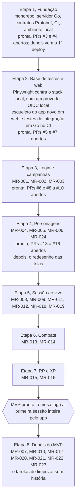

# Roadmap por etapas

O MVP fica pronto no fim da Etapa 7. A ordem começa pela fundação: primeiro o esqueleto, depois a base de testes e o esqueleto do app novo, e só então cada história entra pronta no backend Go, provada pelos próprios testes. Decidido em 29/09/2026: não há migração gradual a partir do app antigo. O `src/` (Angular antigo) fica só como referência até sair do repositório num PR à parte; o `server/` (NestJS antigo) será removido do repositório — decidido pelo Samuel em 29/09/2026 —, porque o backend novo em Go passa a cobrir sozinho todas as histórias do MVP (ver [README.md](../README.md)).

| Etapa | Entrega | Histórias |
| --- | --- | --- |
| 1. Fundação | Monorepo, servidor Go, contratos Protobuf, CI, ambiente local. Pronta, nos PRs #3 e #4; o 1º deploy vem depois. | — |
| 2. Base de testes e web | Playwright contra o stack local, com um provedor OIDC local no lugar do Google; esqueleto do novo app Angular em `web/`; testes de integração em Go no CI. Pronta, nos PRs #5 e #7: o esqueleto do `web/`, o devidp (provedor OIDC de desenvolvimento), os testes Playwright em `e2e/` (`make e2e` e o workflow `e2e`) e os testes de integração com CockroachDB no CI (job `go-db`). | — |
| 3. Login e campanhas | Login do mestre por OIDC com sessão de até 30 dias, criar campanha, gerar e revogar convites, entrar pelo convite (logado ou fazendo login no caminho), com autorização por papel na campanha (ADR-0011) e nome de exibição. Pronta, nos PRs #6 e #8 a #10: backend, telas e testes Playwright das três histórias. O personagem criado pelo convite (MR-003) veio com a Etapa 4. | MR-001, MR-002, MR-003 |
| 4. Personagens | Ficha no formato do PDF, NPCs, ficha travada na primeira sessão, o personagem criado pelo convite (a metade da MR-003 que faltava) e a aprovação desse personagem pelo mestre (MR-024, no MVP desde 29/09/2026). Pronta, nos PRs #13 a #16: o motor de regras (`rules`, com o SRD 5.1), o backend dos personagens (`characters`) e das sessões de jogo, as telas (ficha, editor, NPCs, sessão) e os testes em Go e Playwright de cada critério. O `play` ganhou um começo mínimo (iniciar, encerrar e listar sessões) para a trava da ficha acontecer de verdade. A MR-024 veio por último, no PR 4: o convite com aprovação, o membro pendente e a aprovação ou recusa do personagem (migrations `00021` e `00022`). | MR-004, MR-005, MR-006, MR-024 |
| 5. Sessão ao vivo | Pontos de interesse, mapa sem spoiler, iniciar sessão, acompanhar sessão, documento de campanha e galeria de imagens — confirmadas no MVP pelo Samuel em 29/09/2026, nesta etapa, ao lado dos mapas. Iniciar a sessão já trava as fichas desde a Etapa 4 (o terceiro critério da MR-011); falta o resto: o aviso no app e o link da sessão. | MR-008, MR-009, MR-011, MR-012, MR-018, MR-019 |
| 6. Combate | Ordem dos turnos, ações na vez do jogador. | MR-013, MR-014 |
| 7. RP e XP | Ações da cena de RP, dar XP. | MR-015, MR-016 |
| **MVP pronto** | A mesa joga a primeira sessão inteira pelo app. | — |
| 8. Depois do MVP | Importar ficha em PDF, masmorras, subir de nível, livro de regras, copiar personagem, reutilizar NPCs, passar ou dividir a campanha. Mais duas tarefas de limpeza, sem história própria: importar só os personagens do banco antigo e descomissionar esse banco (decidido pelo Samuel em 29/09/2026, ver [Modelo de dados](dados.md) e [Privacidade](privacidade.md#o-banco-do-app-antigo)); remover `server/` (NestJS) e, depois, `src/` (Angular) do repositório. | MR-007, MR-010, MR-017, MR-020, MR-021, MR-022, MR-023 |

MR-023 (passar ou dividir a campanha) e MR-024 (aprovar o personagem do convite) vieram das respostas do Samuel de 29/09/2026. No mesmo dia ele decidiu a prioridade: a MR-024 entra no MVP, na Etapa 4, e a MR-023 fica para a Etapa 8 (ver [Histórias](produto/historias.md)).

Entre a Etapa 4 e a 5, as telas ganham o visual da "ficha de papel" (decidido pelo Vinicius em 29/09/2026, ver [Design](design.md)): as telas das Etapas 1 a 4 são redesenhadas, e toda tela nova passa a ser desenhada e revisada antes do PR.

MR-025, MR-026 e MR-027 (o conteúdo que a mesa cadastra, inclusive por PDF) vieram de uma ideia do Samuel de 29/09/2026 e ainda não têm prioridade nem etapa (ver [Histórias](produto/historias.md#prioridade-a-definir)).

Cada etapa entrega algo para o mestre e para o jogador. Não há datas: o ritmo depende do tempo livre de cada um.

## Ver também

- [Histórias e critérios de aceite](produto/historias.md)
- [Arquitetura](arquitetura.md)
- [CONTRIBUTING.md](../CONTRIBUTING.md): como o ambiente de dev e o CI ficam prontos na Etapa 1.
