# Roadmap por etapas

O MVP fica pronto no fim da Etapa 10. Em 03/10/2026 ele cresceu: depois da Etapa 7 vêm a mesa, o combate e o mapa a fundo, e o conteúdo e a geração. A ordem começa pela fundação: primeiro o esqueleto, depois a base de testes e o esqueleto do app novo, e só então cada história entra pronta no backend Go, provada pelos próprios testes. Decidido em 29/09/2026: não há migração gradual a partir do app antigo. O `src/` (Angular antigo) fica só como referência até sair do repositório num PR à parte; o `server/` (NestJS antigo) será removido do repositório — decidido pelo Samuel em 29/09/2026 —, porque o backend novo em Go passa a cobrir sozinho todas as histórias do MVP (ver [App antigo](app-antigo.md)).

```mermaid
flowchart TD
    E1["Etapa 1, Fundação<br/>monorepo, servidor Go, contratos Protobuf, CI, ambiente local<br/>na main (PRs #3 e #4); depois vem o 1º deploy"]
    E2["Etapa 2, Base de testes e web<br/>Playwright contra o stack local, com um provedor OIDC local<br/>esqueleto do app novo em web e testes de integração em Go no CI<br/>na main (PRs #5 e #7)"]
    E3["Etapa 3, Login e campanhas<br/>MR-001, MR-002, MR-003<br/>na main (PRs #6 e #8 a #10)"]
    E4["Etapa 4, Personagens<br/>MR-004, MR-005, MR-006, MR-024<br/>na main (PRs #13 a #16)<br/>depois, o redesenho das telas"]
    E5["Etapa 5, Sessão ao vivo<br/>MR-008, MR-009, MR-011, MR-012, MR-018, MR-019, MR-028<br/>na main (PRs #35 a #38, #40 e #42 a #44)"]
    E6["Etapa 6, Combate<br/>MR-013, MR-014<br/>na main (PRs #52, #53, #59, #61, #62 e #66 a #68)"]
    E7["Etapa 7, RP e XP<br/>MR-015, MR-016<br/>na main (PRs #70, #72, #73, #75 e #78)"]
    E8["Etapa 8, A mesa<br/>MR-013 e MR-014 ampliadas, MR-029 a MR-033, MR-040<br/>na main (PRs #74 a #93)"]
    E9["Etapa 9, Combate e mapa a fundo<br/>RN-21 em círculo, MR-034 a MR-037, MR-041<br/>na main (PRs #95 a #124)"]
    E10["Etapa 10, Conteúdo e geração<br/>MR-025, MR-010, MR-038, MR-039<br/>MR-042, MR-043, MR-044<br/>planejada em 05/10"]
    MVP{{"MVP pronto, a mesa joga a primeira sessão inteira pelo app"}}
    E11["Etapa 11, Depois do MVP<br/>MR-007, MR-017, MR-020, MR-021, MR-022, MR-023<br/>MR-026, MR-027<br/>e tarefas de limpeza, sem história"]

    E1 --> E2 --> E3 --> E4 --> E5 --> E6 --> E7 --> E8 --> E9 --> E10 --> MVP --> E11
```

| Etapa | Entrega | Histórias |
| --- | --- | --- |
| 1. Fundação | Monorepo, servidor Go, contratos Protobuf, CI, ambiente local. Na `main` desde 30/09/2026 (PRs #3 e #4); o 1º deploy vem depois. | — |
| 2. Base de testes e web | Playwright contra o stack local, com um provedor OIDC local no lugar do Google; esqueleto do novo app Angular em `web/`; testes de integração em Go no CI. Na `main` desde 30/09/2026 (PRs #5 e #7): o esqueleto do `web/`, o devidp (provedor OIDC de desenvolvimento), os testes Playwright em `e2e/` (`make e2e` e o workflow `e2e`) e os testes de integração com CockroachDB no CI (job `go-db`). | — |
| 3. Login e campanhas | Login do mestre por OIDC com sessão de até 30 dias, criar campanha, gerar e revogar convites, entrar pelo convite (logado ou fazendo login no caminho), com autorização por papel na campanha (ADR-0011) e nome de exibição. Na `main` desde 30/09/2026 (PRs #6 e #8 a #10): backend, telas e testes Playwright das três histórias. O personagem criado pelo convite (MR-003) veio com a Etapa 4. | MR-001, MR-002, MR-003 |
| 4. Personagens | Ficha no formato do PDF, NPCs, ficha travada na primeira sessão, o personagem criado pelo convite (a metade da MR-003 que faltava) e a aprovação desse personagem pelo mestre (MR-024, no MVP desde 29/09/2026). Na `main` desde 30/09/2026 (PRs #13 a #16): o motor de regras (`rules`, com o SRD 5.1), o backend dos personagens (`characters`) e das sessões de jogo, as telas (ficha, editor, NPCs, sessão) e os testes em Go e Playwright de cada critério. O `play` ganhou um começo mínimo (iniciar, encerrar e listar sessões) para a trava da ficha acontecer de verdade. A MR-024 veio por último, no PR 4: o convite com aprovação, o membro pendente e a aprovação ou recusa do personagem (migrations `00021` e `00022`). | MR-004, MR-005, MR-006, MR-024 |
| 5. Sessão ao vivo | Pontos de interesse, mapa sem spoiler, iniciar sessão, acompanhar sessão, documento de campanha e galeria de imagens — confirmadas no MVP pelo Samuel em 29/09/2026 —, e mostrar uma imagem aos jogadores (MR-028, pedida pelo Vinicius em 30/09/2026). Na `main` desde 02/10/2026 (PRs #35 a #38, #40 e #42 a #44), cada parte com o servidor, as telas desenhadas e aprovadas antes do código, e os testes em Go e Playwright de cada critério: a sessão ao vivo (o aviso, o link e o stream, com os PV, os espaços de magia e os dados de vida atuais, que o mestre corrige), a galeria (enviar, guardar sem metadados, servir, renomear e apagar imagens), o documento da campanha (em Markdown, só do mestre, com imagens da galeria e links para mapas e fichas) e os mapas (pontos de interesse, revelar e esconder, tokens, o mapa atual da sessão e a imagem mostrada aos jogadores; migrations `00023` a `00033`). Iniciar a sessão já trava as fichas desde a Etapa 4 (o terceiro critério da MR-011). Os pontos de batalha e de cena só mostram o nome e a descrição até as Etapas 6 e 7, e "o sistema aplica dano" (MR-012) veio com o combate, na Etapa 6. | MR-008, MR-009, MR-011, MR-012, MR-018, MR-019, MR-028 |
| 6. Combate | Ordem dos turnos, ações na vez do jogador. Na `main` desde 03/10/2026, cada parte com o servidor, as telas desenhadas e aprovadas antes do código, e os testes em Go e Playwright de cada critério: o motor de regras do combate e os detalhes das magias (#52); os dados rolados pelo servidor e a escolha entre o dado do app e o físico (RN-18, #53); o encontro, com a iniciativa, a ordem, a grade de 1,5 m e o movimento, e o que cada um vê (#59 e #62); as ações, com o ataque, o dano que o mestre aplica, as ações padrão, o desfazer e o registro (#61 e #67); e as magias, as reações, os testes contra a morte, as condições e as habilidades de classe (#66 e #68). Migrations `00034` a `00058`. Vieram junto os pedidos do Samuel de 01 e 02/10: a subclasse "Nenhuma" e as magias por nível (#47), quem está pendente sem personagem (#49 e #51), a ficha básica do NPC com ataques (#54), "Deixar com os jogadores" (#55) e rolar atributos e PV no app, com o "?" das magias (#56). | MR-013, MR-014 |
| 7. RP e XP | Ações da cena de RP, dar XP. Na `main` desde 03/10/2026, cada parte com o servidor, as telas desenhadas e aprovadas antes do código, e os testes em Go e Playwright de cada critério: as tabelas de XP do SRD e o bônus de cada teste da cena no motor de regras (#70); o XP no servidor, por inimigos, por ouro, avulso ou por marco, com o desfazer, o histórico e "Pode subir de nível" (#72) e nas telas (#78); e as cenas de RP, com as ações num ponto de cena, a cena aberta na sessão e as rolagens dos jogadores (#73 no servidor, #75 nas telas). Migrations `00059` a `00066`. | MR-015, MR-016 |
| 8. A mesa | Pequenas ampliações de telas que já existem e os recursos de mesa e de RP. Na ordem dos turnos (MR-013): o movimento também em quadrados e o turno conjunto (combatentes com a mesma iniciativa jogam o mesmo turno, feito em 04/10/2026, fatia 8.11). Na "Sua vez" (MR-014): as magias ordenadas pelo que dá para conjurar agora, o "?" com a descrição completa durante a sessão e as magias que leem PV resolvidas pelo servidor. Novos: ganchos e pistas da cena, anotações do jogador, NPCs na cena, destaques do combate e imprimir o mapa com a grade. Em 03/10/2026, o Samuel respondeu as perguntas 43 a 65 e o Vinicius decidiu onde cada mudança entra. Nesta etapa: o ataque conjunto passa a incluir os jogadores, com os combatentes do grupo agindo no mesmo turno (MR-013); a pista só vai a quem o mestre escolher (MR-029); o retrato em PNG com fundo transparente e o toque num NPC para vê-lo maior (MR-031); os destaques da sessão (MR-032); e o tamanho do quadrado e do papel na impressão (MR-033). Também aqui, antes do MVP, fica a [MR-040](produto/historias.md#mr-040-subir-de-nível-pela-ficha) (subir de nível pela ficha), numa fatia própria depois das telas da etapa. Chegam junto, como acabamentos da Etapa 7, as opções das cenas (mostrar a CD aos jogadores e as tentativas por ação, MR-015) e os marcos planejados (MR-016). **Na `main` desde 04/10/2026**, cada parte com o servidor, as telas desenhadas e aprovadas antes do código, e os testes em Go e Playwright de cada critério: as magias ordenadas e as que leem PV, com o movimento em quadrados (#74 no servidor, #86 nas telas); os ganchos, as pistas e as anotações dos jogadores (#76 e #89); o palco, o retrato do NPC e os destaques do combate (#79 e #87); a impressão do mapa (#81); a subida de nível pela ficha (#83 e #93); as opções das cenas e o resumo da sessão (#85 e #92); os marcos planejados (#88); e o turno conjunto (#90). Migrations `00067` a `00089`. Vieram junto os testes do `play` em paralelo (#77), o tempo maior do CI (#84) e as correções de testes e do mapa (#82 e #91). | MR-013, MR-014 (critérios novos), MR-029, MR-030, MR-031, MR-032, MR-033, MR-040 |
| 9. Combate e mapa a fundo | O movimento em círculo (RN-21 mudou), os movimentos especiais (salto, terreno difícil, cobertura), a passagem por outras criaturas e o ataque de oportunidade como nas regras oficiais (decidido em 04/10/2026, perguntas 67 a 75), as camadas do mapa, a névoa de guerra pela visão de cada personagem, as armadilhas, as luzes, os tesouros e o XP por ouro (MR-041, decidido pelo Samuel em 03/10/2026), e as criaturas do personagem (o familiar, os mortos-vivos, os animais convocados e a Forma Selvagem), com as criaturas do SRD no motor de regras. **Na `main` desde 05/10/2026**, cada parte com o servidor, as telas desenhadas e aprovadas antes do código, e os testes em Go e Playwright de cada critério: a grade, a visão, o salto, a cobertura e as predefinições no motor de regras (#97), e as criaturas do SRD, as convocações e a Forma Selvagem (#98); as camadas, a névoa, as armadilhas, os tesouros e as luzes no servidor (#103), a névoa por jogador (#107), a imagem em blocos (#109), as armadilhas em jogo (#110) e o editor do mapa (#123); o movimento, o terreno, os saltos e a cobertura (#104), o ataque de oportunidade (#108) e os avisos dele (#114), com as telas (#115); o ouro (#105 e #116); as criaturas do personagem (#106, #112 e #117), no combate e na Forma Selvagem (#122); a névoa na sessão (#113 e #118); e as armadilhas e os tesouros na sessão (#119). Migrations `00090` a `00117`. Vieram junto as respostas das perguntas 66 a 75 (#95 e #96), os bancos de teste reaproveitados e o Playwright em quatro partes (#99 a #102), testes sem corrida (#111 e #120) e a correção do travamento de uma transação que pedia uma segunda conexão do pool (#121). | MR-034, MR-035, MR-036, MR-037, MR-041 |
| 10. Conteúdo e geração | O conteúdo e as regras da própria mesa (MR-025, RN-23 a RN-25): classes e subclasses, raças, antecedentes e magias da campanha, a página "Regras da mesa", a grade calibrada por mapa e o combate sem grade ("teatro da mente"). O gerador de masmorras (MR-010, por design de sala limpa, ADR-0015), com as portas numa camada nova do mapa (RN-26). Os quebra-cabeças, nos três tipos (MR-038, RN-27). As imagens geradas por IA a partir da masmorra e da cena, pela API do Gemini (MR-039, RN-28). E as três ferramentas de preparo do mestre: o bestiário com os monstros no combate (MR-042, RN-29), os encontros (MR-043) e o tesouro (MR-044). **Planejada em 05/10/2026** pelo Vinicius: a primeira parte é um PR só de documentação, com as decisões; depois, as telas desenhadas e aprovadas, e o servidor e as telas em fatias. Do SRD 5.2.1 (as regras de 2024) entram só três tabelas, com crédito e o rótulo na tela: o orçamento de XP dos encontros, os valores dos itens mágicos e o conjunto padrão e a compra por pontos dos atributos (iguais aos de 2014); o resto continua no SRD 5.1. Ficam de fora: copiar conteúdo entre campanhas (MR-026), monstros e itens mágicos próprios, talentos fora do SRD, o flanqueamento, a grade hexagonal, masmorras de vários andares e imagens de personagens. | MR-025, MR-010, MR-038, MR-039, MR-042, MR-043, MR-044 |
| **MVP pronto** | A mesa joga a primeira sessão inteira pelo app, com tudo acima. | — |
| 11. Depois do MVP | Importar ficha em PDF, a tela completa de subir de nível (o ajuste guiado pela ficha, MR-040, vem antes do MVP), livro de regras, copiar personagem, reutilizar NPCs, passar ou dividir a campanha, e a proposta do jogador e a leitura de PDF das regras, nesta ordem. Mais duas tarefas de limpeza, sem história própria: importar só os personagens do banco antigo e descomissionar esse banco (decidido pelo Samuel em 29/09/2026, ver [Modelo de dados](dados.md) e [Privacidade](privacidade.md#o-banco-do-app-antigo)); remover `server/` (NestJS) e, depois, `src/` (Angular) do repositório. | MR-007, MR-017, MR-020, MR-021, MR-022, MR-023, MR-026, MR-027 |

MR-023 (passar ou dividir a campanha) e MR-024 (aprovar o personagem do convite) vieram das respostas do Samuel de 29/09/2026. No mesmo dia ele decidiu a prioridade: a MR-024 entra no MVP, na Etapa 4, e a MR-023 fica para a Etapa 11, depois do MVP (ver [Histórias](produto/historias.md)).

Entre a Etapa 4 e a 5, as telas ganham o visual da "ficha de papel" (decidido pelo Vinicius em 29/09/2026, ver [Design](design.md)): as telas das Etapas 1 a 4 são redesenhadas, e toda tela nova passa a ser desenhada e revisada antes do PR.

MR-025, MR-026 e MR-027 (o conteúdo que a mesa cadastra, inclusive por PDF) vieram de uma ideia do Samuel de 29/09/2026 e ficaram depois do MVP (decidido em 02/10/2026): primeiro o cadastro pelo mestre (MR-025), depois a proposta do jogador (MR-026, sempre com a aprovação do mestre) e a leitura de PDF (MR-027, com o mestre revisando tudo). Em 03/10/2026, só a MR-025 foi para o MVP (Etapa 10); a MR-026 e a MR-027 seguem na Etapa 11. Ver [Histórias](produto/historias.md#mr-025-cadastrar-conteúdo-da-mesa).

**O MVP cresceu em 03/10/2026.** O Vinicius decidiu, depois de uma pesquisa com outros mestres, que a Etapa 7 termina como aprovada e que entram no MVP as Etapas 8, 9 e 10. As decisões dele valem no lugar das respostas anteriores do Samuel onde diferem: o movimento em círculo (RN-21, pergunta 36), a MR-025 (regras da mesa) e a MR-010 (masmorras, agora o gerador) passam para o MVP. O motivo: é o que esses mestres disseram precisar na mesa. As imagens geradas por IA (MR-039) usam o Gemini no Vertex AI, no nosso projeto do Google Cloud; em 05/10/2026, no plano da Etapa 10, o Vinicius trocou pela API do Gemini, com uma chave do Google AI Studio. O Samuel é avisado no documento de acompanhamento; não é uma pergunta nova para ele. Ver [Histórias](produto/historias.md).

Cada etapa entrega algo para o mestre e para o jogador. Não há datas: o ritmo depende do tempo livre de cada um.

## Ver também

- [Histórias e critérios de aceite](produto/historias.md)
- [Arquitetura](arquitetura.md)
- [CONTRIBUTING.md](../CONTRIBUTING.md): como o ambiente de dev e o CI ficam prontos na Etapa 1.
