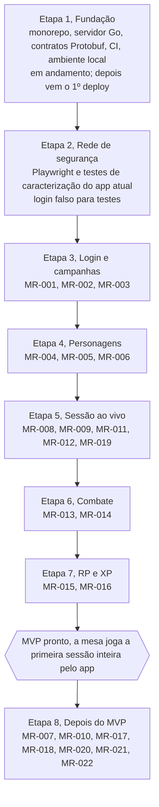

# Roadmap por etapas

O MVP fica pronto no fim da Etapa 7. A ordem começa pela fundação: primeiro o esqueleto, depois a rede de testes sobre o app atual, e só então cada módulo troca de lado.

| Etapa | Entrega | Histórias |
| --- | --- | --- |
| 1. Fundação | Monorepo, servidor Go, contratos Protobuf, CI, ambiente local. Em andamento; o 1º deploy vem depois. | — |
| 2. Rede de segurança | Testes Playwright e de caracterização sobre o app atual, e um login falso para os testes. | — |
| 3. Login e campanhas | Criar campanha, gerar convite, entrar pelo convite. | MR-001, MR-002, MR-003 |
| 4. Personagens | Ficha no formato do PDF, NPCs, ficha travada na primeira sessão. | MR-004, MR-005, MR-006 |
| 5. Sessão ao vivo | Pontos de interesse, mapa sem spoiler, iniciar sessão, acompanhar sessão, galeria de imagens. | MR-008, MR-009, MR-011, MR-012, MR-019 |
| 6. Combate | Ordem dos turnos, ações na vez do jogador. | MR-013, MR-014 |
| 7. RP e XP | Ações da cena de RP, dar XP. | MR-015, MR-016 |
| **MVP pronto** | A mesa joga a primeira sessão inteira pelo app. | — |
| 8. Depois do MVP | Importar ficha em PDF, masmorras, subir de nível, documento de campanha, livro de regras, copiar personagem, reutilizar NPCs. | MR-007, MR-010, MR-017, MR-018, MR-020, MR-021, MR-022 |

Cada etapa entrega algo para o mestre e para o jogador. Não há datas: o ritmo depende do tempo livre de cada um. O NestJS sai quando o último módulo que ele atende passa a rodar em Go.

## Ver também

- [Histórias e critérios de aceite](produto/historias.md)
- [Arquitetura](arquitetura.md)
- [CONTRIBUTING.md](../CONTRIBUTING.md): como o ambiente de dev e o CI ficam prontos na Etapa 1.
