# Roadmap

The MVP is reached when the table plays its first full session through the app. **Current stage: pre-MVP.** Stages 1 to 10 are built; hardening and a rehearsal come before the first real session. After the MVP: internationalization (an English UI), then Stage 11. The per-stage delivery history (PRs, migrations, slices) is in the [archive](archive/etapas.md); who decided what, and when, is in [decisions](archive/decisions.md).

The order starts with the foundation: the skeleton first, then the test base and the new app's skeleton, then each story lands finished on the Go backend, proven by its own tests. There is no gradual migration from the legacy app: `src/` (old Angular) stays as a reference until it leaves the repository in a separate PR, and `server/` (old NestJS) is removed. See [Legacy app](legacy-app.md).

```mermaid
flowchart TD
    E1["Stage 1, Foundation<br/>monorepo, Go server, Protobuf contracts, CI, local environment"]
    E2["Stage 2, Test base and web<br/>Playwright against the local stack with a local OIDC provider<br/>new app skeleton in web, Go integration tests in CI"]
    E3["Stage 3, Sign-in and campaigns<br/>MR-001, MR-002, MR-003"]
    E4["Stage 4, Characters<br/>MR-004, MR-005, MR-006, MR-024"]
    E5["Stage 5, Live session<br/>MR-008, MR-009, MR-011, MR-012, MR-018, MR-019, MR-028"]
    E6["Stage 6, Combat<br/>MR-013, MR-014"]
    E7["Stage 7, RP and XP<br/>MR-015, MR-016"]
    E8["Stage 8, The table<br/>MR-013 and MR-014 extended, MR-029 to MR-033, MR-040"]
    E9["Stage 9, Deep combat and map<br/>RN-21 as a circle, MR-034 to MR-037, MR-041"]
    E10["Stage 10, Content and generation<br/>MR-025, MR-010, MR-038, MR-039<br/>MR-042, MR-043, MR-044, MR-045"]
    MVP{{"MVP: the table plays its first full session through the app"}}
    I18N["Internationalization<br/>English UI"]
    E11["Stage 11, After the MVP<br/>MR-007, MR-017, MR-020, MR-021, MR-022, MR-023<br/>MR-026, MR-027, MR-046, MR-047<br/>and cleanup tasks with no story"]

    E1 --> E2 --> E3 --> E4 --> E5 --> E6 --> E7 --> E8 --> E9 --> E10 --> MVP --> I18N --> E11
```

## Stages

| Stage | Delivers | Stories |
| --- | --- | --- |
| 1. Foundation (done) | Monorepo, Go server, Protobuf contracts, CI, local environment. | — |
| 2. Test base and web (done) | Playwright against the local stack with a local OIDC provider (devidp) instead of Google; the new Angular app skeleton in `web/`; Go integration tests against CockroachDB in CI. | — |
| 3. Sign-in and campaigns (done) | OIDC sign-in with sessions of up to 30 days, create a campaign, generate and revoke invites, join through an invite (signed in or signing in on the way), role-based authorization in the campaign, display name. | MR-001, MR-002, MR-003 |
| 4. Characters (done) | The rules engine over the SRD 5.1, the sheet in the official layout, NPCs, the sheet lock on the first session, the character created through an invite and its approval by the Game Master. | MR-004, MR-005, MR-006, MR-024 |
| 5. Live session (done) | Points of interest, maps without spoilers, starting and following a session with a live stream, the campaign document, the image gallery and showing an image to the players. | MR-008, MR-009, MR-011, MR-012, MR-018, MR-019, MR-028 |
| 6. Combat (done) | The combat rules engine, server-rolled dice with the app/physical choice, the encounter with initiative, the 1.5 m grid and movement, actions, spells, reactions, saves, death saves and the log. | MR-013, MR-014 |
| 7. RP and XP (done) | The SRD XP tables, XP by enemies, gold, free-form or milestone with undo and history, "Pode subir de nível", RP scene actions with player rolls. | MR-015, MR-016 |
| 8. The table (done) | Table and RP features: joint turns, movement in squares, spells ordered by what can be cast now, scene hooks and clues, player notes, NPCs on stage, combat highlights, the guided level-up and printing the map with its grid. | MR-013, MR-014, MR-029 to MR-033, MR-040 |
| 9. Deep combat and map (done) | Circle movement, special movement (jump, difficult terrain, cover, opportunity attack), map layers, per-player fog of war, traps, lights, treasures and XP by gold, and the character's creatures (familiar, undead, summoned animals, Wild Shape) with the SRD creatures in the rules engine. | RN-21, MR-034 to MR-037, MR-041 |
| 10. Content and generation (done) | The table's own content and rules (classes, subclasses, races, backgrounds, spells; table rules; grid calibration; combat without a grid), the dungeon generator with doors, puzzles, the players' spell list and the options the Game Master leaves available, AI-generated images, the bestiary, the encounter builder and the treasure generator. | MR-025, MR-010, MR-038, MR-039, MR-042 to MR-045 |
| **MVP gate** | Hardening, then a rehearsal; the table plays its first full session through the app with everything above. | — |
| Internationalization | The English UI (the screens are in Portuguese until then). | — |
| 11. After the MVP | Importing a character sheet from a PDF, the full level-up screen, a rulebook, copying characters, reusing NPCs, handing over or splitting a campaign, the player's proposal and PDF reading of rules (in this order); the table's style resource by resource (MR-046), more puzzles (MR-047) and a list of past sessions with the summary of each (the server already answers for any ended session). Two cleanup tasks with no story: importing only the characters from the old database and decommissioning that database; removing the legacy app (`src/`, `server/`). | MR-007, MR-017, MR-020 to MR-023, MR-026, MR-027, MR-046, MR-047 |

Each stage delivers something for the Game Master and for the players. There are no dates: the pace depends on everyone's free time.

## See also

- [Stories and acceptance criteria](product/stories.md)
- [Architecture](architecture.md)
- [CONTRIBUTING.md](../CONTRIBUTING.md): the dev environment and the CI.
