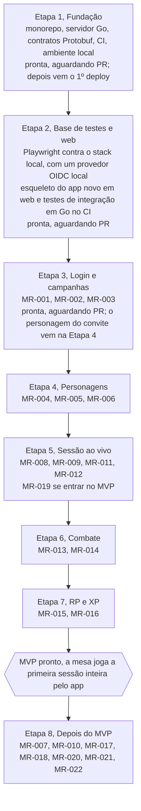

# Roadmap por etapas

O MVP fica pronto no fim da Etapa 7. A ordem começa pela fundação: primeiro o esqueleto, depois a base de testes e o esqueleto do app novo, e só então cada história entra pronta no backend Go, provada pelos próprios testes. Decidido em 29/09/2026: não há migração gradual a partir do app antigo — ele fica só como referência.

| Etapa | Entrega | Histórias |
| --- | --- | --- |
| 1. Fundação | Monorepo, servidor Go, contratos Protobuf, CI, ambiente local. Pronta, aguardando PR; o 1º deploy vem depois. | — |
| 2. Base de testes e web | Playwright contra o stack local, com um provedor OIDC local no lugar do Google; esqueleto do novo app Angular em `web/`; testes de integração em Go no CI. Pronta, aguardando PR: o esqueleto do `web/`, o devidp (provedor OIDC de desenvolvimento), os testes Playwright em `e2e/` (`make e2e` e o workflow `e2e`) e os testes de integração com CockroachDB no CI (job `go-db`). | — |
| 3. Login e campanhas | Login do mestre por OIDC com sessão de até 30 dias, criar campanha, gerar e revogar convites, entrar pelo convite (logado ou fazendo login no caminho), com autorização por papel na campanha (ADR-0011) e nome de exibição. Pronta, aguardando PR: backend, telas e testes Playwright das três histórias. O personagem criado pelo convite (MR-003) vem com a Etapa 4. | MR-001, MR-002, MR-003 |
| 4. Personagens | Ficha no formato do PDF, NPCs, ficha travada na primeira sessão. | MR-004, MR-005, MR-006 |
| 5. Sessão ao vivo | Pontos de interesse, mapa sem spoiler, iniciar sessão, acompanhar sessão e, se o Samuel colocar no MVP, a galeria de imagens ([pergunta em aberto](produto/perguntas-em-aberto.md)). | MR-008, MR-009, MR-011, MR-012 (MR-019 a definir) |
| 6. Combate | Ordem dos turnos, ações na vez do jogador. | MR-013, MR-014 |
| 7. RP e XP | Ações da cena de RP, dar XP. | MR-015, MR-016 |
| **MVP pronto** | A mesa joga a primeira sessão inteira pelo app. | — |
| 8. Depois do MVP | Importar ficha em PDF, masmorras, subir de nível, documento de campanha, livro de regras, copiar personagem, reutilizar NPCs. | MR-007, MR-010, MR-017, MR-018, MR-020, MR-021, MR-022 |

Cada etapa entrega algo para o mestre e para o jogador. Não há datas: o ritmo depende do tempo livre de cada um. O app antigo (`src/` e `server/`) não recebe mais desenvolvimento; fica só como referência até sair do repositório num PR à parte.

## Ver também

- [Histórias e critérios de aceite](produto/historias.md)
- [Arquitetura](arquitetura.md)
- [CONTRIBUTING.md](../CONTRIBUTING.md): como o ambiente de dev e o CI ficam prontos na Etapa 1.
